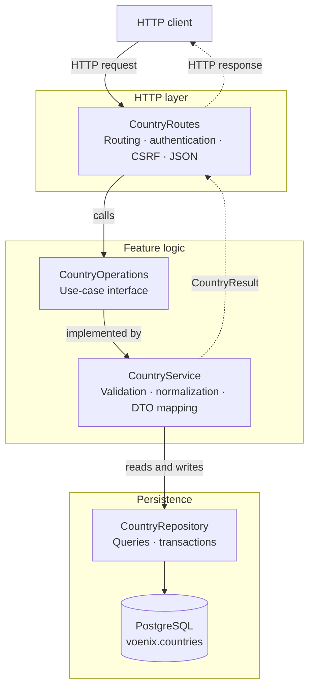

# Backend country package

This guide explains the Kotlin code in
[`backend/src/shop/voenix/country`](../../backend/src/shop/voenix/country).

## What this package does

The country package provides:

- a public, read-only list of countries and telephone dial codes;
- admin endpoints for listing, creating, reading, updating, and deleting
  countries;
- validation and normalization of country input;
- PostgreSQL persistence through Exposed;
- admin session checks and cross-site request forgery (CSRF) protection; and
- HTTP and JSON behavior compatible with the backend that this Kotlin service
  replaces.

The package is a vertical slice: most code needed for the country feature lives
together instead of being split into global `controller`, `service`, and
`repository` directories.

## The five-minute mental model



Solid arrows show the request moving toward the database. Dotted arrows show
the typed result returning to the route and becoming an HTTP response.

> **IntelliJ IDEA:** Rendering this diagram requires the separate
> [Mermaid plugin](https://plugins.jetbrains.com/plugin/20146-mermaid) and the
> Markdown preview pane. Install the plugin through **Settings | Plugins**, then
> select **Preview** or **Editor and Preview** in the Markdown editor.

The important boundaries are:

1. **Routes speak HTTP.** They check authentication and CSRF tokens, parse the
   request, and translate a `CountryResult` into a status code and JSON body.
2. **The service speaks country operations.** It validates, normalizes, checks
   conflicts, and maps stored countries to public or admin responses.
3. **The repository speaks PostgreSQL.** It runs Exposed queries and returns
   domain objects or affected-row counts.

[`Application.kt`](../../backend/src/shop/voenix/Application.kt) connects the
layers at startup:

```kotlin
val countries = CountryService(CountryRepository(database))
CountryAuth.install(this, authSettings)
CountryRoutes.install(this, countries)
```

`CountryRoutes` depends on the [`CountryOperations`](../../backend/src/shop/voenix/country/CountryOperations.kt)
interface rather than directly on `CountryService`. Tests can therefore replace
the real service with a small in-memory stub.

## Follow one request through the code

Consider an admin creating Denmark with this body:

```json
{
  "name": " Denmark ",
  "countryCode": " dk "
}
```

The request follows this path:

1. [`CountryRoutes`](../../backend/src/shop/voenix/country/CountryRoutes.kt)
   matches `POST /api/admin/countries`.
2. Ktor's session authentication verifies that the encrypted `voenix.auth`
   cookie contains a non-expired `UserSession`.
3. `CountryAuth.requireAdmin` checks for the exact `ADMIN` role.
4. `requireCsrfToken` checks the `X-XSRF-TOKEN` header against a token bound to
   the same user.
5. `receiveValidatedFields` accepts a supported JSON content type, parses the
   body, and runs field validation.
6. `CountryService.create` normalizes the values to `Denmark` and `DK`, then
   checks for name and code conflicts.
7. `CountryRepository.insert` writes the row inside an Exposed transaction, and
   `find` reads it back.
8. The service returns `CountryResult.Success(AdminCountryDto(...))`.
9. The route returns `201 Created`, the JSON representation of the new country,
   and a `Location` header.

Notice that the route validates input and the service validates it again. This
is intentional. The route produces detailed HTTP validation responses, while
the service remains safe when called directly by a test, job, or future non-HTTP
adapter.

## HTTP API

All route paths are case-insensitive and accept an optional trailing slash.
For example, `/API/COUNTRIES/` and `/api/countries` reach the same handler.

| Method and path | Access | CSRF header | Success response |
| --- | --- | --- | --- |
| `GET /api/countries` | Public | No | `200` with `CountryListResponse` |
| `GET /api/admin/countries` | Admin | No | `200` with `AdminCountryListResponse` |
| `POST /api/admin/countries` | Admin | Yes | `201`, `AdminCountryDto`, and `Location` |
| `GET /api/admin/countries/{id}` | Admin | No | `200` with `AdminCountryDto` |
| `PUT /api/admin/countries/{id}` | Admin | Yes | `200` with `AdminCountryDto` |
| `DELETE /api/admin/countries/{id}` | Admin | Yes | `204` with no body |
| `GET /api/antiforgery/token` | Public | No | `200` with `{ "requestToken": "..." }` |

Only a path segment that can be parsed as a Kotlin `Long` matches `{id}`.
Malformed or overflowing IDs produce Ktor's normal `404` without entering the
authentication or service code.

### Public and admin representations differ

The database model and the two API models serve different purposes:

```text
Country (database/domain)
├── AdminCountryDto: id, name, countryCode
└── CountryDto:      name, countryCode, dialCode
```

- Admin responses include the database ID and otherwise preserve stored values.
- Public responses hide the ID, uppercase the country code, and use
  libphonenumber to add a dial code such as `+49` for `DE`.
- An unknown two-letter region is allowed but has `dialCode: null`. Validation
  checks the shape of the code; it does not check membership in an ISO country
  list.
- Lists are ordered by stored `country_code`, then by `id`.

### Error mapping

The route converts the closed set of [`CountryResult`](../../backend/src/shop/voenix/country/CountryResult.kt)
values into HTTP responses:

| Result or failure | HTTP status | Response |
| --- | --- | --- |
| `Success` | Depends on the operation | Operation DTO |
| `NotFound` | `404` | `ProblemDetails` |
| `NameConflict` | `409` | `ProblemDetails` |
| `CodeConflict` | `409` | `ProblemDetails` |
| `DatabaseError` | `500` | Generic `ProblemDetails`; database details are not leaked |
| Invalid route input | `400` | `ValidationProblemDetails` as `application/problem+json` |
| Missing or unsupported JSON content type | `415` | `HttpProblemDetails` as `application/problem+json` |
| Missing authentication | `401` | `AuthResponse` |
| Authenticated without `ADMIN` | `403` | `AuthResponse` |
| Missing, stale, or wrong-user CSRF token | `400` | `HttpProblemDetails` |

`CountryResult.Invalid` is useful when the service is called directly. If it
reaches the HTTP failure mapper, it becomes a `500`, because route validation
should already have rejected that input. Treat this as an invariant, not as the
normal validation path.

Validation problem responses also contain a W3C-style trace ID. A valid
`traceparent` request header keeps its trace portion and receives a new span;
otherwise the route creates a fresh trace ID.

## File map

### Startup and feature boundary

- [`Application.kt`](../../backend/src/shop/voenix/Application.kt) creates the
  repository and service, then installs authentication and routes.
- [`CountryOperations.kt`](../../backend/src/shop/voenix/country/CountryOperations.kt)
  is the interface used by the HTTP layer. Its `suspend` functions describe all
  supported country use cases.
- [`CountryResult.kt`](../../backend/src/shop/voenix/country/CountryResult.kt) is
  a sealed result type shared by the service and routes.

### HTTP layer

- [`CountryRoutes.kt`](../../backend/src/shop/voenix/country/CountryRoutes.kt)
  declares endpoints and maps between HTTP and feature types.
- [`CountryRequestParsing.kt`](../../backend/src/shop/voenix/country/CountryRequestParsing.kt)
  implements the compatibility-sensitive JSON parser.
- [`CaseInsensitivePathRouteSelector.kt`](../../backend/src/shop/voenix/country/CaseInsensitivePathRouteSelector.kt)
  makes fixed URL segments case-insensitive.
- [`LongPathSegmentRouteSelector.kt`](../../backend/src/shop/voenix/country/LongPathSegmentRouteSelector.kt)
  only matches valid `Long` IDs.
- `ProblemDetails.kt`, `HttpProblemDetails.kt`, and
  `ValidationProblemDetails.kt` define error response bodies.

### Business and data types

- [`CountryService.kt`](../../backend/src/shop/voenix/country/CountryService.kt)
  implements validation, normalization, conflicts, DTO mapping, and safe error
  handling.
- [`CountryValidation.kt`](../../backend/src/shop/voenix/country/CountryValidation.kt)
  contains reusable validation and normalization functions.
- [`Country.kt`](../../backend/src/shop/voenix/country/Country.kt) represents a
  stored country in application code.
- [`NormalizedCountry.kt`](../../backend/src/shop/voenix/country/NormalizedCountry.kt)
  represents input after validation, trimming, and uppercasing.
- `CreateAdminCountryRequest.kt` and `UpdateAdminCountryRequest.kt` are service
  inputs. Their properties are nullable so missing JSON fields can be validated
  explicitly.
- `AdminCountryDto.kt`, `AdminCountryListResponse.kt`, `CountryDto.kt`, and
  `CountryListResponse.kt` are serializable response models.

### Persistence

- [`Countries.kt`](../../backend/src/shop/voenix/country/Countries.kt) is the
  Exposed table mapping for `countries` in the configured database schema.
- [`CountryRepository.kt`](../../backend/src/shop/voenix/country/CountryRepository.kt)
  contains all country queries and transaction handling.
- [`V1__create_countries.sql`](../../backend/resources/db/migration/V1__create_countries.sql)
  creates the production table, unique indexes, and initial eight rows.
- [`CountrySchemaCompatibility.kt`](../../backend/src/shop/voenix/db/CountrySchemaCompatibility.kt)
  is outside the feature package. It lets Flyway safely adopt a compatible
  country schema left by the former backend.

### Authentication and CSRF support

- [`CountryAuth.kt`](../../backend/src/shop/voenix/country/CountryAuth.kt)
  installs Ktor sessions and authentication, checks admin roles, issues CSRF
  tokens, and renews sessions.
- `UserSession.kt` is the encrypted cookie payload. `UserPrincipal.kt` is the
  validated identity exposed to route handlers.
- `CsrfSession.kt` stores the CSRF token and the user ID to which it belongs.
- [`SameAsRequestCookieTransport.kt`](../../backend/src/shop/voenix/country/SameAsRequestCookieTransport.kt)
  marks cookies `Secure` for HTTPS requests and non-secure for HTTP requests.
- [`AuthSettings.kt`](../../backend/src/shop/voenix/country/AuthSettings.kt)
  reads the session secret from application configuration.

This package validates an existing `UserSession`; it does not verify credentials
or provide a production sign-in endpoint. Tests add `/test/sign-in` routes only
to create sessions for the scenario under test.

## Validation and normalization rules

[`countryValidationErrors`](../../backend/src/shop/voenix/country/CountryValidation.kt)
enforces these rules before a write:

| Field | Rule | Normalization |
| --- | --- | --- |
| `name` | Required after trimming; at most 255 characters | Trim surrounding whitespace |
| `countryCode` | Required; exactly two ASCII letters | Trim and uppercase with `Locale.ROOT` |

Country names must be unique without regard to case. The service normalizes
country codes to uppercase before saving them. Unique database indexes enforce
case-insensitive name uniqueness and exact stored-code uniqueness, so concurrent
application requests cannot create duplicates.

The service performs friendly pre-write conflict checks, but those checks alone
would have a race condition: two requests could both see that a value is free.
If PostgreSQL then reports SQL state `23505` for a unique violation, the service
queries again and classifies the result as a name or code conflict.

The repository's name check uses PostgreSQL `ILIKE`. It escapes `\`, `%`, and
`_`, so user input is compared as a literal complete name rather than as a SQL
wildcard pattern.

## Why JSON parsing is more complicated than expected

For a new Ktor feature, a request is often parsed with `call.receive<MyDto>()`.
This package instead reads the body as text and examines its JSON structure.
That code preserves an existing external contract, including:

- case-insensitive property names (`name`, `Name`, and `NAME`);
- unknown properties being ignored;
- the last matching property winning when case variants are duplicated;
- specific errors for an empty body, `null`, a non-object top-level value,
  malformed JSON, and non-string fields; and
- error paths plus zero-based line and UTF-8 byte positions.

Accepted media types are `application/json`, `text/json`, and
`application/*+json`. With an explicit charset, only UTF-8, UTF-16, and UTF-16LE
are accepted.

Do not replace `CountryRequestParsing` with ordinary automatic deserialization
unless the API contract is intentionally changed and its contract tests are
updated at the same time.

## Authentication and CSRF details

Admin requests pass through checks in this order:

```text
valid numeric route → authenticated session → ADMIN role → CSRF for writes
                    → content type → JSON parsing → field validation → service
```

The ordering matters. For example, an anonymous invalid `POST` receives `401`
rather than a body-validation error. This avoids processing protected input
before authorization and preserves the external API contract.

Important details:

- The auth and CSRF cookies are encrypted and signed with keys derived from
  `Auth.SessionSecret`.
- The secret is required and must contain at least 32 UTF-8 bytes. It can be set
  with `AUTH_SESSION_SECRET` or `Auth__SessionSecret`.
- Cookies are `HttpOnly`, `SameSite=Lax`, have path `/`, and are marked `Secure`
  when the request uses HTTPS.
- The cookie itself is a browser-session cookie, but the encrypted auth payload
  expires after 24 hours.
- A session is renewed for another 24 hours after more than half of its lifetime
  has elapsed.
- A client gets a CSRF token from `GET /api/antiforgery/token`, then sends the
  returned `requestToken` value in the `X-XSRF-TOKEN` header for admin writes.
- A token issued while signed in is bound to that user ID. It cannot be reused
  after switching to another user, and a token issued anonymously cannot be
  used after signing in.

## Persistence and coroutine behavior

Flyway SQL migrations own the production schema. `Countries` maps the existing
table for queries; it must not be used to create or mutate the production schema
at startup.

Each repository method runs one Exposed `suspendTransaction` on
`Dispatchers.IO`. This has two useful effects:

- the blocking JDBC driver does not occupy a coroutine worker intended for
  non-blocking work; and
- callers can use normal sequential Kotlin while the function suspends during
  database work.

`maxAttempts = 1` disables automatic transaction retries. A caller therefore
receives one well-defined result for one repository call.

`CountryService` catches database exceptions, logs their details on the server,
and returns `CountryResult.DatabaseError`. It always rethrows
`CancellationException`: coroutine cancellation is a control signal and must
not be converted into an ordinary database failure.

## Kotlin concepts used here

The package is also a useful tour of common Kotlin backend patterns:

- **`data class`** generates value-based equality, `copy`, and readable
  `toString` methods. It is used for requests, domain values, sessions, and DTOs.
- **`object`** declares a single application-wide instance. `CountryRoutes`,
  `CountryAuth`, and the Exposed `Countries` table do not need separate
  instances.
- **`sealed interface`** limits implementations to a known set. A `when` over
  `CountryResult` can therefore be exhaustive without an `else` branch.
- **`Nothing`** in `CountryResult<Nothing>` means a failure contains no success
  value. Because the generic type is declared `out T`, the same failure object
  can be returned from an operation expecting any success type.
- **`suspend fun`** marks work that may pause without blocking its caller's
  thread. Routes, services, and repositories can call one another naturally.
- **Extension functions** add feature-specific operations to Ktor types. For
  example, `ApplicationCall.receiveCountryFields` reads like a built-in call
  method while remaining code owned by this package.
- **Companion objects** hold class-level constants and shared objects such as
  the service logger and libphonenumber utility.
- **`Locale.ROOT`** makes uppercasing deterministic instead of depending on the
  server's configured language.

## Database schema

`Database.SearchPath` selects the PostgreSQL schema used by the JDBC connection,
Flyway, Exposed, and the existing-schema compatibility checks. It defaults to
`voenix` and can be overridden with `DATABASE_SEARCH_PATH` or
`Database__SearchPath`. The application currently supports one lowercase schema
identifier in the search path.

The `<configured schema>.countries` table contains:

| Column | PostgreSQL type | Notes |
| --- | --- | --- |
| `id` | `bigint` identity | Primary key |
| `name` | `varchar(255)` | Non-null; unique through `LOWER(name)` |
| `country_code` | `varchar(2)` | Non-null; unique |

The first migration seeds Germany, France, Italy, Austria, Belgium, the
Netherlands, Spain, and Sweden. Public dial codes are calculated when a response
is built; they are not stored in this table.

When the schema changes, add a new numbered Flyway migration. Do not edit an
already-applied migration merely to change an existing environment.

## Tests and how to run them

Run backend commands from `backend/` with the repository's Kotlin Toolchain,
not Gradle or Maven:

```sh
cd backend
./kotlin test
./kotlin check
```

`./kotlin check` is the required final quality gate. It runs the tests and
ktlint. The integration tests use Testcontainers with `postgres:17-alpine`, so
a Docker-compatible container runtime must be available.

The test files divide responsibilities as follows:

| Test | Main responsibility |
| --- | --- |
| `CountryRouteSecurityAndValidationTest` | Route matching, check ordering, CSRF, JSON edge cases, result-to-HTTP mapping, trace IDs |
| `CountryAdminAuthorizationTest` | Session expiry and renewal, roles, cookie flags |
| `CountryAdminCrudIntegrationTest` | Full authenticated CRUD flow through real PostgreSQL |
| `CountryPublicRouteIntegrationTest` | Public JSON, sort order, seed data, and dial codes |
| `CountryServiceIntegrationTest` | Validation, normalization, conflicts, concurrency, and hidden database failures |
| `CountryMigrationIntegrationTest` | Exact table, index, identity, and seed schema created by Flyway |

Route tests commonly inject a stub implementation of `CountryOperations` so
they can prove that invalid requests never reach the service. Service and
repository behavior is tested against real PostgreSQL rather than an in-memory
database because this feature relies on PostgreSQL-specific behavior such as
`ILIKE`, functional indexes, and SQL state `23505`.

## Safe change recipes

### Add a persisted country field

1. Add a new Flyway migration under `backend/resources/db/migration`.
2. Add the column mapping to `Countries` and the property to `Country`.
3. Decide whether it belongs in the public DTO, admin DTO, or both.
4. If clients can write it, update both request types, `CountryRequestFields`,
   parsing, validation, and normalization.
5. Update repository row mapping and write statements.
6. Update service mapping and the relevant route, service, CRUD, and migration
   tests.
7. Run `./kotlin check` from `backend/`.

### Add an operation or endpoint

1. Add the use case to `CountryOperations`.
2. Implement it in `CountryService` and return a `CountryResult` instead of an
   HTTP type.
3. Add only the necessary query methods to `CountryRepository`.
4. Add the route and choose its authentication, role, and CSRF requirements.
5. Extend the stub route tests and add a real PostgreSQL integration test when
   persistence behavior changes.

### Change validation or HTTP compatibility behavior

Start with the contract tests in `CountryRouteSecurityAndValidationTest` and
`CountryServiceIntegrationTest`. Error field names, messages, content types,
check ordering, property-name casing, trace IDs, and byte positions may be
observable by clients. Change them deliberately rather than as an incidental
refactor.

## Contributor checklist

Before finishing a country-package change, verify that:

- route code handles HTTP concerns but does not contain SQL;
- service code returns `CountryResult` and does not return Ktor response types;
- repository code does not decide HTTP status codes;
- writes validate and normalize before reaching PostgreSQL;
- admin writes require both an admin session and a user-bound CSRF token;
- database exceptions are logged but not exposed to clients;
- `CancellationException` is rethrown;
- production schema changes use a new Flyway migration;
- each Kotlin file contains exactly one top-level type and is named after it;
  and
- `./kotlin check` passes from `backend/`.
