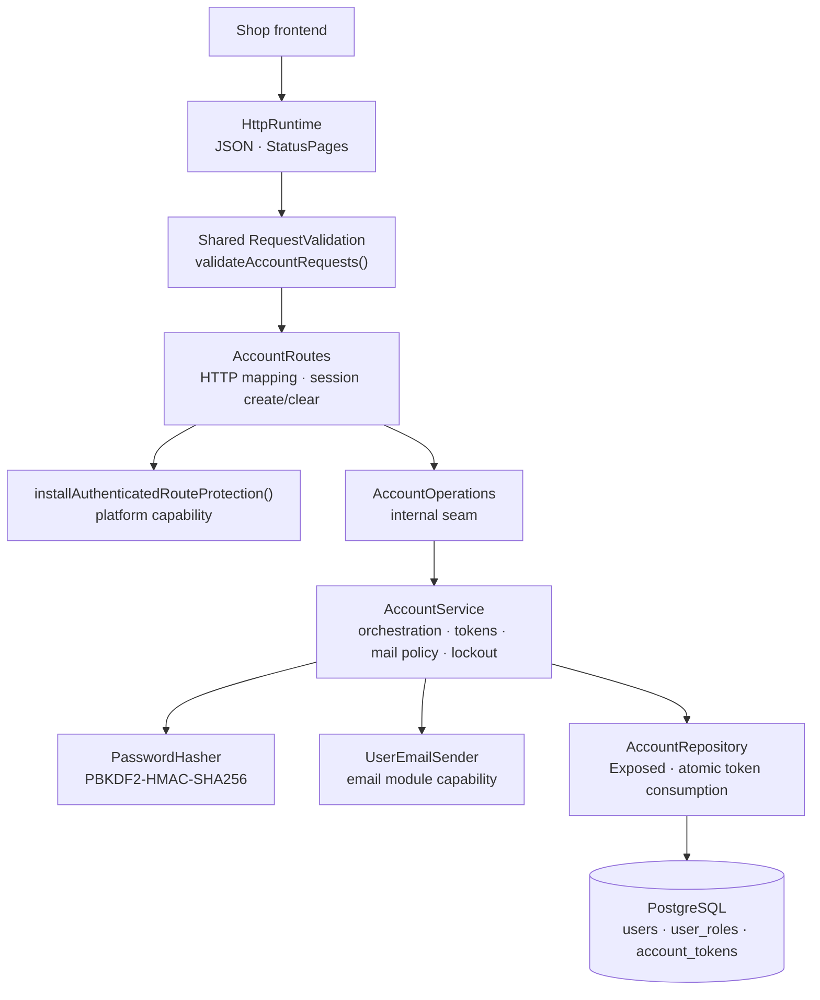

# Backend Account package

This guide explains the Kotlin code in
[`backend/modules/account/src/shop/voenix/account`](../../../backend/modules/account/src/shop/voenix/account).

## What this package does

The Account package gives the shop real user accounts. Visitors register with
e-mail and password, confirm their address via a mailed link, and sign in to a
cookie session. Customers manage their profile (shipping address, optional
separate billing address), change their e-mail with re-confirmation, change
their password, and recover access with a password reset link.

The package is the **trusted credential verifier** the platform auth module
was still missing: a successful login is the one production code path that
creates a `UserSession`. Session mechanics, CSRF, and the fail-closed route
protections stay platform-owned and are reused, never reimplemented (see
[`authentication-and-authorization.md`](authentication-and-authorization.md)).

The migration decisions behind this package are recorded in
[`account-migration.md`](../../migration/account-migration.md); the deferred
follow-ups (frontend adaptation, guest-data claim) live in
[`account-post-migration.md`](../../migration/account-post-migration.md).

## The five-minute mental model



A clock is injected into the module (`java.time.Clock`, system clock in
production). Token expiry, lockout release, and the stored creation timestamp
all read this clock, which is why the integration tests can travel through
time instead of sleeping.

## HTTP API

All routes stay under `/api/auth` because the existing frontend calls these
paths. Mutations without a meaningful payload answer `204 No Content`;
failures use the shared `ApiError` shape (an approved deviation from the
legacy `{ success, message, code }` envelope — the frontend follow-up is
recorded in the post-migration list).

Anonymous endpoints:

| Method and path | Success | Failure notes |
| --- | --- | --- |
| `POST /api/auth/register` | `204`, confirmation mail sent | `400` invalid input, `409` e-mail exists, `502` confirmation mail undeliverable |
| `POST /api/auth/login` | `204` + session cookie | `400` invalid input, `401` bad credentials (uniform), `403` e-mail not confirmed, `429` locked out |
| `POST /api/auth/confirm-email` | `204` | `400` for invalid input and invalid/expired links alike |
| `POST /api/auth/resend-confirmation` | always `204` | only `400` invalid input — enumeration-safe |
| `POST /api/auth/forgot-password` | always `204` | only `400` invalid input — enumeration-safe |
| `POST /api/auth/reset-password` | `204` + notification mail | `400` invalid input or invalid/expired link |
| `POST /api/auth/confirm-change-email` | `204`, login e-mail replaced | `400` invalid link, `409` e-mail taken meanwhile |

Authenticated endpoints (session required; mutations additionally require the
`X-XSRF-TOKEN` header — stricter than the legacy app, an approved deviation):

| Method and path | Success | Failure notes |
| --- | --- | --- |
| `GET /api/auth/me` | `200` profile | `401` |
| `PUT /api/auth/profile` | `200` updated profile | `400`, `401` |
| `POST /api/auth/change-email` | `204`, confirmation to the new address, notification to the old | `400`, `401` wrong password, `409`, `502` |
| `POST /api/auth/change-password` | `204` + notification mail | `400`, `401` wrong current password |
| `POST /api/auth/logout` | `204`, session cleared | `401`, `400` CSRF |

The profile representation is one type, `AccountProfile`, returned by both
`me` and `profile`: id, e-mail, roles, optional shipping and billing
`Address`, `hasSeparateBillingAddress`, and the ISO-8601 creation timestamp.

## Security behavior worth knowing

- **Uniform login failures.** Unknown e-mail and wrong password produce the
  same `401` response, and the service verifies a placeholder hash for
  unknown users so both paths cost a hash comparison. Account existence is
  not observable.
- **Enumeration-safe flows.** `resend-confirmation` and `forgot-password`
  always answer `204`. A failed mail delivery — or even a database error —
  after validation is logged and never changes the response.
- **Lockout.** 15 failed logins lock the account for 10 minutes (`429`).
  Locking resets the counter (Identity semantics), a successful login resets
  it too, and the increment runs under `SELECT … FOR UPDATE` so concurrent
  failures cannot lose an attempt.
- **Single-use tokens.** Confirmation, reset, and change-e-mail links carry a
  random token whose SHA-256 hash is stored in `account_tokens`. A token is
  valid for 24 hours, consuming it deletes the row, and issuing a new token
  replaces the previous one of the same purpose — the database enforces this
  with a unique `(user_id, purpose)` rule, so only the latest link counts.
- **Password hashing.** `PasswordHasher` uses JDK PBKDF2-HMAC-SHA256 with a
  versioned encoding (`v1$<iterations>$<salt>$<hash>`). Verification reads
  the iteration count from the encoding, so the configured work factor
  (`Account.Pbkdf2Iterations`, production default 600 000) can change without
  invalidating stored hashes, and tests can run fast without weakening
  production.
- **Changing the password keeps sessions valid.** Platform cookie sessions
  are self-contained, so neither the current nor other sessions are logged
  out — this matches the legacy behavior and is documented in the migration
  record.

## Account mails

Account mails are sent **directly** through the email module's
`UserEmailSender` capability — never queued as `email_jobs` rows. The rules
come from the Email migration's Auth contract
([`email-post-migration.md`](../../migration/email-post-migration.md)):

- Required deliveries (registration confirmation, change-e-mail confirmation)
  surface a failure as `502`; the customer retries via the resend flow.
- Best-effort notifications (password changed, e-mail change notice) are
  logged on failure and never fail the operation.
- The module builds and percent-encodes the complete links itself:
  `{frontendBaseUrl}/confirm-email?userId=…&token=…`,
  `{frontendBaseUrl}/reset-password?email=…&token=…`, and
  `{frontendBaseUrl}/confirm-change-email?userId=…&newEmail=…&token=…`.

`Account.FrontendBaseUrl` is required at startup and must be HTTPS outside
local environments (`localhost` may use HTTP).

## Persistence

Flyway migration
[`V11__create_users.sql`](../../../backend/modules/platform/resources/db/migration/V11__create_users.sql)
creates three tables:

- `users` — the e-mail doubles as the login name; a unique index on
  `LOWER(email)` makes uniqueness case-insensitive and concurrency-safe.
  Address fields are flat columns; `has_separate_billing_address` controls
  whether billing fields are used. Lockout state lives in
  `failed_login_count` and `locked_until`.
- `user_roles` — plain text roles (`ADMIN`, `CUSTOMER`), primary key
  `(user_id, role)`. No ASP.NET Identity ballast (no claims, external
  logins, 2FA, phone columns, or stamps) was migrated.
- `account_tokens` — SHA-256 token hash, purpose, optional pending new
  e-mail, expiry; unique per `(user_id, purpose)`.

The migration also adds the foreign key `magic_coins.user_id → users.id`
(`ON DELETE CASCADE`) that the MagicCoins migration deliberately deferred.

As everywhere in this backend, the database is the authority for uniqueness:
repositories map SQL state `23505` to a typed conflict via
`executePostgresWrite` and never inspect constraint names (see
[`persistence-error-handling.md`](persistence-error-handling.md)). The
change-e-mail confirmation consumes the token and updates the e-mail in one
transaction, so a unique violation rolls the token consumption back.

## Bootstrapping the first administrator

The application seeds no roles and no users. To grant the first `ADMIN` role
on a fresh deployment, register the account normally (registration always
assigns `CUSTOMER`), confirm the e-mail, and then add the role directly in
the database:

```sql
INSERT INTO users_schema.user_roles (user_id, role)
SELECT id, 'ADMIN'
FROM users_schema.users
WHERE LOWER(email) = LOWER('admin@example.com')
ON CONFLICT DO NOTHING;
```

Replace `users_schema` with the configured search path (the default is
`voenix`) and the e-mail with the administrator's address. The role becomes
effective on the next login because the session stores its roles when it is
created.

## Runtime composition

`Application.kt` wires the module once:

```kotlin
val userEmails = installEmailRuntime(database, emailSettings, productionSettings, source)
installAccountModule(database, accountSettings, userEmails)
```

`AccountModule`, `createAccountModule`, and the operations-based
`installAccountModule` overload follow the standard runtime-handle
convention ([`module-architecture.md`](module-architecture.md)). The handle
and factory are `internal`: no other module needs the assembled instance, and
the package exports no capability yet — the Cart migration will add its
guest-data claim seam when it exists. `AccountSettings`,
`installAccountModule(database, …)`, and `validateAccountRequests()` are the
only public surface.

## Tests

- `AccountInputValidationTest`, `PasswordHasherTest` — pure unit tests for
  the complete field-rule matrix and the hash encoding.
- `AccountServiceIntegrationTest` — service against real PostgreSQL:
  registration, token lifecycle, lockout with a mutable clock, profile
  replace semantics, change-e-mail incl. late conflicts, failing-sender
  behavior.
- `AccountRouteSecurityAndValidationTest` — rejected requests (no session,
  bad CSRF, invalid bodies) never reach the operation.
- `AccountFlowIntegrationTest` — full journeys over HTTP; confirmation and
  reset links are extracted from the recorded mails, never read from the
  database.
- `AccountSchemaIntegrationTest` — the Flyway migration on an empty database
  and its constraints.
