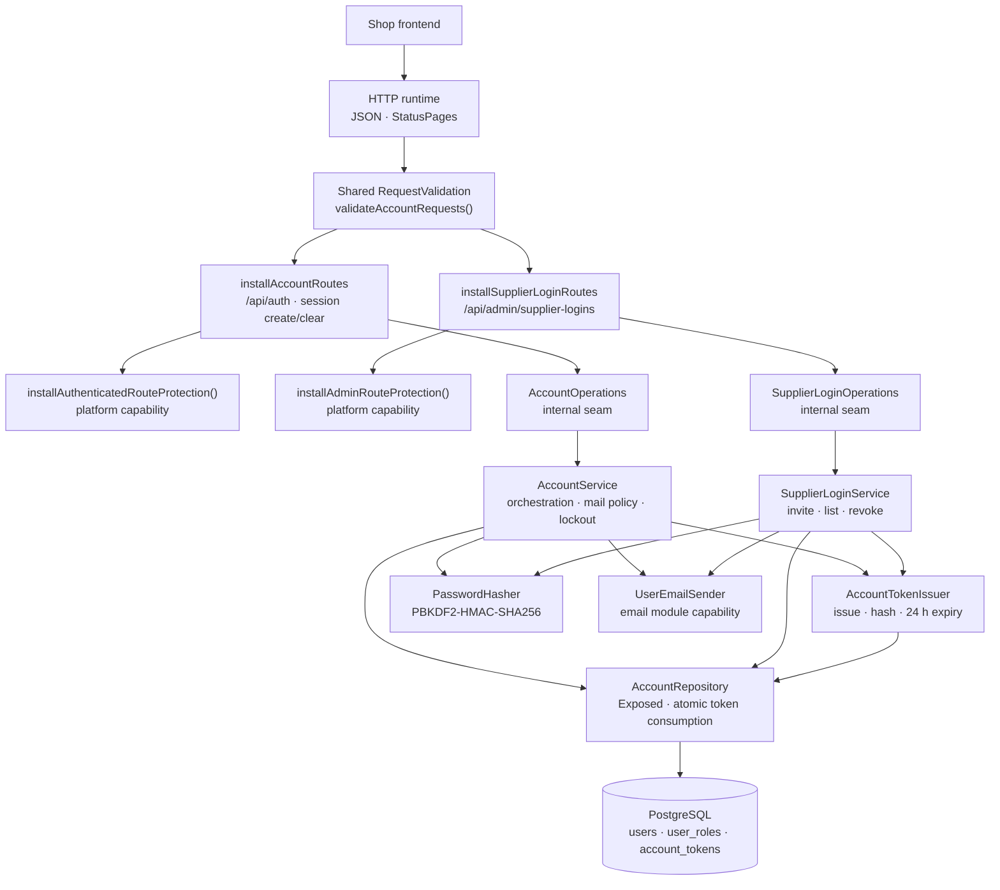

# Backend Account package

This guide explains the Kotlin code in
[`backend/modules/account/src/shop/voenix/account`](../../../backend/modules/account/src/shop/voenix/account).

## What this package does

The Account package gives the shop real user accounts. Visitors register with
e-mail and password, confirm their address via a mailed link, and sign in to a
cookie session. Customers manage their profile (shipping address, optional
separate billing address), change their e-mail with re-confirmation, change
their password, and recover access with a password reset link.

The package is the **trusted credential verifier** the platform auth module
was still missing: a successful login is the one production code path that
creates a `UserSession`. Session mechanics, CSRF, and the fail-closed route
protections stay platform-owned and are reused, never reimplemented (see
[`authentication-and-authorization.md`](authentication-and-authorization.md)).

The package also owns the **supplier logins**: an administrator creates a
login for one supplier, the invited person receives a mailed link and sets
their own password, and deleting the login revokes the access again. That is
the account side of the supplier fulfillment feature (issue #119); everything
a supplier then *does* lives in the production module.

The package touches nothing outside the account itself. A login and a
registration store, verify, and mail — they never move another module's rows
and never mint or renew the visitor's `voenix.guest` cookie (issue #110).

The migration decisions behind this package are recorded in
[`account-migration.md`](../../migration/account-migration.md); the remaining
deferred follow-ups (frontend adaptation; the guest-data claim that record
still tracks was removed again by issue #110) live in
[`account-post-migration.md`](../../migration/account-post-migration.md).

## Package structure

Declarations are grouped into files by what they belong to, not one type per
file (see
[`source-file-organization.md`](source-file-organization.md)). Every file below
is one concern you can read from start to finish; a small value type lives in
the file of the component that owns it.

The whole module lives in the one package `shop.voenix.account` — there are no
sub-packages. Each file is one concern:

| File | Contents |
| --- | --- |
| `AccountModule.kt` | The wiring: the runtime handle, `createAccountModule`, `installAccountModule`, and `validateAccountRequests()`. |
| `AccountRoutes.kt` | The customer HTTP layer: `installAccountRoutes` for the `/api/auth` subtrees, session create/clear, the private helpers that turn an operation result into a status code, and the request DTOs those routes receive (all `@Serializable`, each with its `validate()`). |
| `AccountService.kt` | The orchestration `AccountService` for everything a customer does, the `AccountOperations` seam it implements, and the sealed result types its operations answer with. |
| `SupplierLoginRoutes.kt` | The admin HTTP layer: `installSupplierLoginRoutes` for `/api/admin/supplier-logins`, its `CreateSupplierLoginInput`, and the helpers that answer its three routes. |
| `SupplierLoginService.kt` | The `SupplierLoginService` behind that surface, its `SupplierLoginOperations` seam, and the `CreateSupplierLoginResult` it answers with. |
| `AccountTokenIssuer.kt` | The token mechanics both services share: the `AccountTokenPurpose` values, `AccountTokenIssuer` (issue a token, hash a token a caller sent back), and `newAccountToken()`. |
| `AccountRepository.kt` | The repository, the Exposed tables it owns (`Users`, `UserRoles`, `AccountTokens`), the `UserWriteResult` its writes return, and the file-private read helpers its operations share. |
| `AccountFieldRules.kt` | The two validation rules several inputs share, as top-level functions: `accountEmailErrors(value)` and `accountPasswordErrors(value)`, plus `MINIMUM_PASSWORD_LENGTH`. |
| `AccountMailer.kt` | The mail policy: which mail carries which link, and which delivery may fail. |
| `PasswordHasher.kt` | PBKDF2 hashing and its versioned encoding. |
| `AccountSettings.kt` | The module settings and how they are read from the configuration. |
| `UserAccount.kt` | The stored user row, the `AccountProfileView` it becomes on the wire, and the `Address` value both use. |
| `SupplierLogin.kt` | The supplier login and the `SupplierLoginView` the admin surface answers with. |

Two placements are worth remembering, because they are the rule the rest of the
backend follows too (see `CountryRoutes.kt` or `CartRoutes.kt`):

- A **request DTO** lives in the routes file that receives it. `RegisterInput`,
  `LoginInput`, `ProfileInput`, and the others are declared at the bottom of
  `AccountRoutes.kt`, right below the routes that read them;
  `CreateSupplierLoginInput` sits in `SupplierLoginRoutes.kt` for the same
  reason.
- A **result type** lives in the file of the component that produces it. The
  sealed `RegisterResult`, `LoginResult`, `ChangeEmailResult`, and
  `ChangePasswordResult` are declared in `AccountService.kt`,
  `CreateSupplierLoginResult` in `SupplierLoginService.kt`; `UserWriteResult`,
  which persistence produces, is declared in `AccountRepository.kt`.

The package holds **two services with two seams**, not one. The customer
account (`AccountOperations`/`AccountService`) and the administrator's supplier
logins (`SupplierLoginOperations`/`SupplierLoginService`) are two use cases with
two different callers over the same `users` rows, so each has its own routes
file, its own seam, and its own stub in the tests. They share their
collaborators — the repository, the mailer, the password hasher, and the token
mechanics, which got a name of their own: `AccountTokenIssuer` — but neither
service ever calls the other.

`AccountFieldRules.kt` is its own file because two kinds of caller share it,
so no single file is its natural owner. It holds plain top-level functions
rather than an `object`: in Kotlin the file is already the namespace, so an
`object` that only prefixes names would add nothing (see
[`source-file-organization.md`](source-file-organization.md)).

The package is an organizing device, not a visibility boundary. The `account`
compilation module is the boundary: its `internal` declarations collaborate
freely inside the package but cannot be imported by other modules.

### Deliberate boundaries

Four things in this package look like something a reader might want to "clean
up". They are decisions, so here is why they are the way they are:

- **One repository.** `users`, `user_roles`, and `account_tokens` are one table
  graph, and creating a supplier login writes the user row and its role in one
  `insertUser` transaction. Splitting the repository per service would split
  that transaction, so both services share `AccountRepository`.
- **One shared `Address`.** `ProfileInput` and `AccountProfileView` use the same
  `Address` type on purpose. `PUT profile` is a full replace, so what a client
  sends is exactly what `GET me` answers; an `AddressInput` and an `AddressView`
  would be two identical types that must never drift apart.
- **Inline `ApiError` responses.** Where `NotFound → 404` is the contract —
  the supplier-login list and delete — the routes use the platform
  `OperationResultHttpMapping` like the rest of the backend (see
  [`operation-results.md`](operation-results.md)). The `/api/auth` flows
  cannot: an invalid link answers `400` + `INVALID_LINK` and a missing profile
  user answers `401`, and the shared mapping has no way to say either. Those
  responses are written out as `call.respond(status, ApiError(...))` — the same
  way `CheckoutRoutes.kt`, `OrderRoutes.kt`, and `CartRoutes.kt` answer their
  module-specific result types — instead of private `respondError` /
  `respondValidation` helpers, which kept the status and the message apart.
  (Promoting such helpers to the platform `shop.voenix.http` package is a
  possible follow-up — for the whole backend at once, not for this package
  alone.)
- **`AccountOperations` has exactly 11 methods**, which is exactly Detekt's
  per-interface limit. That is not headroom, it is the ceiling: the next
  customer operation does **not** get a `@Suppress`, it gets a new seam — the
  same way the supplier logins got `SupplierLoginOperations` when the old
  single seam grew too wide.

## The five-minute mental model


```mermaid
flowchart TB
    Client["Shop frontend"]
    Http["HTTP runtime<br/>JSON · StatusPages"]
    Validation["Shared RequestValidation<br/>validateAccountRequests()"]
    Routes["installAccountRoutes<br/>/api/auth · session create/clear"]
    AdminRoutes["installSupplierLoginRoutes<br/>/api/admin/supplier-logins"]
    Protection["installAuthenticatedRouteProtection()<br/>platform capability"]
    AdminProtection["installAdminRouteProtection()<br/>platform capability"]
    Operations["AccountOperations<br/>internal seam"]
    LoginOperations["SupplierLoginOperations<br/>internal seam"]
    Service["AccountService<br/>orchestration · mail policy · lockout"]
    LoginService["SupplierLoginService<br/>invite · list · revoke"]
    Tokens["AccountTokenIssuer<br/>issue · hash · 24 h expiry"]
    Hasher["PasswordHasher<br/>PBKDF2-HMAC-SHA256"]
    Mail["UserEmailSender<br/>email module capability"]
    Repository["AccountRepository<br/>Exposed · atomic token consumption"]
    Tables[("PostgreSQL<br/>users · user_roles · account_tokens")]

    Client --> Http --> Validation --> Routes
    Validation --> AdminRoutes
    Routes --> Protection
    AdminRoutes --> AdminProtection
    Routes --> Operations
    AdminRoutes --> LoginOperations
    Operations --> Service
    LoginOperations --> LoginService
    Service --> Tokens
    LoginService --> Tokens
    Service --> Hasher
    LoginService --> Hasher
    Service --> Mail
    LoginService --> Mail
    Service --> Repository
    LoginService --> Repository
    Tokens --> Repository
    Repository --> Tables
```

A clock is injected into the module (`java.time.Clock`, system clock in
production). Token expiry, lockout release, and the stored creation timestamp
all read this clock, which is why the integration tests can travel through
time instead of sleeping.

## HTTP API

Every route a visitor or customer uses stays under `/api/auth` because the
existing frontend calls these paths; the administrator's supplier-login
management sits under `/api/admin/supplier-logins` (see below). Mutations
without a meaningful payload answer `204 No Content`;
failures use the shared `ApiError` shape (an approved deviation from the
legacy `{ success, message, code }` envelope — the frontend follow-up is
recorded in the post-migration list).

Anonymous endpoints:

| Method and path | Success | Failure notes |
| --- | --- | --- |
| `POST /api/auth/register` | `204`, confirmation mail sent | `400` invalid input, `409` e-mail exists, `502` the provider did not accept the confirmation mail, `500` a failure of our own |
| `POST /api/auth/login` | `204` + session cookie | `400` invalid input, `401` bad credentials (uniform), `403` e-mail not confirmed, `429` locked out |
| `POST /api/auth/confirm-email` | `204` | `400` invalid input, `400` + `"code": "INVALID_LINK"` for an invalid/expired link |
| `POST /api/auth/resend-confirmation` | always `204` | only `400` invalid input — enumeration-safe |
| `POST /api/auth/forgot-password` | always `204` | only `400` invalid input — enumeration-safe |
| `POST /api/auth/reset-password` | `204` + notification mail | `400` invalid input, `400` + `"code": "INVALID_LINK"` for an invalid/expired link |
| `POST /api/auth/confirm-change-email` | `204`, login e-mail replaced | `400` + `"code": "INVALID_LINK"` for an invalid/expired link, `409` e-mail taken meanwhile |

The three link flows — confirm-email, reset-password, confirm-change-email —
answer an invalid or expired link with `400` and the machine-readable
`"code": "INVALID_LINK"` in the `ApiError` body, so the frontend can show
link-specific copy without matching on the message text. The code says nothing
about *why* the link failed: an unknown, an already-used, and an expired token
are still indistinguishable to the caller. Validation failures on the same
endpoints carry no `code`.

Authenticated endpoints (session required; mutations additionally require the
`X-XSRF-TOKEN` header — stricter than the legacy app, an approved deviation):

| Method and path | Success | Failure notes |
| --- | --- | --- |
| `GET /api/auth/me` | `200` profile | `401` |
| `PUT /api/auth/profile` | `200` updated profile | `400`, `401` |
| `POST /api/auth/change-email` | `204`, confirmation to the new address, notification to the old | `400`, `401` wrong password, `409`, `502` the provider did not accept the confirmation mail, `500` a failure of our own |
| `POST /api/auth/change-password` | `204` + notification mail | `400`, `401` wrong current password |
| `POST /api/auth/logout` | `204`, session cleared | `401`, `400` CSRF |

The profile representation is one type, `AccountProfileView`, returned by both
`me` and `profile`: id, e-mail, roles, optional shipping and billing
`Address`, `hasSeparateBillingAddress`, and the ISO-8601 creation timestamp.

Admin endpoints (session with role `ADMIN`; mutations additionally require the
`X-XSRF-TOKEN` header):

| Method and path | Success | Failure notes |
| --- | --- | --- |
| `POST /api/admin/supplier-logins` | `201` + `Location` + `SupplierLoginView`, invitation mail sent | `400` invalid input **or** unknown supplier (as a `supplierId` field error), `409` e-mail exists, `502` the provider did not accept the invitation — *the login exists*, `500` |
| `GET /api/admin/supplier-logins?supplierId=3` | `200`, a bare array of `SupplierLoginView` | `400` missing or unusable `supplierId`, `500` |
| `DELETE /api/admin/supplier-logins/{userId}` | `204` | `404` unknown id **or** an id that is not a supplier login, `500` |

`SupplierLoginView` is `{ userId, email, supplierId, createdAt }` — no
credential or lockout state, because this surface manages *who* may sign in for
a supplier, not how that login is doing.

The path is deliberately **not** a child of `/api/admin/suppliers`. That
subtree belongs to the supplier module and installs its own route protection;
two modules adding routes and a protection plugin to the same node would merge
into one Ktor route tree carrying both plugins. A disjoint node keeps each
module's protection exactly where that module put it.

Two failures on `POST` are decided by the database rather than by a lookup: a
`23505` on the unique e-mail index becomes the `409`, and a `23503` on the
`users.supplier_id` foreign key becomes the `400` with the `supplierId` field
error. Neither response contains a constraint name.

The `502` is the one status whose *message* matters: it says the login was
created but its invitation could not be delivered. The row and its token stay,
so a second `POST` would answer `409` for the taken address. The invited person
recovers through the normal "Passwort vergessen" flow, which replaces the
stored reset token with a freshly mailed one — the same purpose, the same
`POST /api/auth/reset-password` endpoint.

## Security behavior worth knowing

- **Uniform login failures.** Unknown e-mail and wrong password produce the
  same `401` response, and the service verifies a placeholder hash for
  unknown users so both paths cost a hash comparison. Account existence is
  not observable.
- **Enumeration-safe flows.** `resend-confirmation` and `forgot-password`
  always answer `204`. A failed mail delivery — or even a database error —
  after validation is logged and never changes the response.
- **Lockout.** 15 failed logins lock the account for 10 minutes (`429`).
  Locking resets the counter (Identity semantics), a successful login resets
  it too, and the increment runs under `SELECT … FOR UPDATE` so concurrent
  failures cannot lose an attempt.
- **Single-use tokens.** Confirmation, reset, and change-e-mail links carry a
  random token whose SHA-256 hash is stored in `account_tokens`. A token is
  valid for 24 hours, consuming it deletes the row, and issuing a new token
  replaces the previous one of the same purpose — the database enforces this
  with a unique `(user_id, purpose)` rule, so only the latest link counts.
- **Password hashing.** `PasswordHasher` uses JDK PBKDF2-HMAC-SHA256 with a
  versioned encoding (`v1$<iterations>$<salt>$<hash>`). Verification reads
  the iteration count from the encoding, so the configured work factor
  (`account.pbkdf2Iterations`, production default 600 000) can change without
  invalidating stored hashes, and tests can run fast without weakening
  production.
- **Changing the password keeps sessions valid.** Platform cookie sessions
  are self-contained, so neither the current nor other sessions are logged
  out — this matches the legacy behavior and is documented in the migration
  record.

## Account mails

Account mails are sent **directly** through the email module's
`UserEmailSender` capability — never queued as `email_jobs` rows. The rules
come from the Email migration's Auth contract
([`email-post-migration.md`](../../migration/email-post-migration.md)):

- Required deliveries (registration confirmation, change-e-mail confirmation)
  surface a failure as `502`; the customer retries via the resend flow.
- `502` means *the provider*, and only the provider. `AccountMailer` catches
  the email module's `EmailDeliveryException` and nothing wider, so only that
  one exception becomes a delivery result. Anything else a send can throw — a
  rendering failure, a malformed link, any other bug of ours — is not caught
  there. It reaches the service's `databaseOperation` guard, which logs it and
  returns the operation's `UnexpectedFailure`, and the route answers a plain
  `500 Internal server error`. The response carries no exception text, no
  recipient address, and no provider detail; the stack trace stays in the
  server log. The distinction matters to the customer: `502` says "try the
  resend", `500` says "this cannot succeed until we fix it".
  Because the catch is narrow, cancellation needs no special handling in these
  two paths — a `CancellationException` is not an `EmailDeliveryException`, so
  it simply passes through.
- Best-effort notifications (password changed, e-mail change notice) are
  logged on failure and never fail the operation — deliberately including our
  own bugs, which is why their `catch` stays broad (with an explicit
  `CancellationException` rethrow). The password change or address change they
  announce is already stored; a broken notification must not undo it.
- The module builds and percent-encodes the complete links itself:
  `{frontend.baseUrl}/confirm-email?userId=…&token=…`,
  `{frontend.baseUrl}/reset-password?email=…&token=…`,
  `{frontend.baseUrl}/confirm-change-email?userId=…&newEmail=…&token=…`, and
  `{frontend.baseUrl}/set-password?email=…&token=…` for a supplier invitation.
- The invitation is a **required** delivery like the registration
  confirmation, but its failure message differs: the login already exists, so
  the administrator must not be told to try again.
- The invitation link is a *reset* link with different copy. Setting the first
  password and resetting a forgotten one are the same operation, so it reuses
  the `RESET_PASSWORD` token purpose and the unchanged
  `POST /api/auth/reset-password` endpoint; only the mail text and the frontend
  page differ, which is why the email module gained a `SupplierInvitation`
  variant instead of reusing the password-reset template ("you requested this"
  would be a lie in an invitation).

`frontend.baseUrl` is required at startup and must be HTTPS outside local
environments (`localhost` may use HTTP). It is one application-wide setting,
not an account-specific one: the order confirmation builds its permanent order
link from the same value (issue #110). The rules live in the platform value type
`FrontendBaseUrl`; the account module only receives it.

## Persistence

Flyway migration
[`V11__create_users.sql`](../../../backend/modules/platform/resources/db/migration/V11__create_users.sql)
creates three tables:

- `users` — the e-mail doubles as the login name; a unique index on
  `LOWER(email)` makes uniqueness case-insensitive and concurrency-safe.
  Address fields are flat columns; `has_separate_billing_address` controls
  whether billing fields are used. Lockout state lives in
  `failed_login_count` and `locked_until`. The nullable `supplier_id` binds a
  supplier login to its supplier (`ON DELETE RESTRICT`, plus a partial index
  over the rows that have one); customers and admins leave it `NULL`.
- `user_roles` — plain text roles (`ADMIN`, `CUSTOMER`, `SUPPLIER`), primary key
  `(user_id, role)`. No ASP.NET Identity ballast (no claims, external
  logins, 2FA, phone columns, or stamps) was migrated.
- `account_tokens` — SHA-256 token hash, purpose, optional pending new
  e-mail, expiry; unique per `(user_id, purpose)`.

The migration also adds the two foreign keys that point at `users` from tables
created earlier in the chain: `magic_coins.user_id` (`ON DELETE CASCADE`), which
the MagicCoins migration deferred, and `production_jobs.shipped_by_user_id`
(`ON DELETE SET NULL`), which records who shipped a job and must not keep a
login from being deleted.

### Creating and deleting a supplier login

Creating one is a single transaction: the `users` row, its one `user_roles`
row with `SUPPLIER` (never `CUSTOMER`), and the `supplier_id` are written
together, so a failed insert leaves nothing behind. Two column values are worth
explaining:

- `email_confirmed = true`. Nobody ever mails this address a confirmation link,
  and the login refuses unconfirmed addresses — an unconfirmed supplier login
  could never sign in. The accepted risk is a typo: a mistyped address hands the
  invitation to whoever owns that inbox. That is tolerable precisely because
  this is an admin-only surface with an admin-entered address, and the fix is to
  delete the login and create it again.
- The stored `password_hash` covers a fresh random 256-bit value that is never
  mailed and never kept. The account exists but cannot be signed into until the
  invitation link sets a real password.

The token and the mail follow *after* that transaction, exactly like
registration: a provider outage must leave a usable login behind, not roll one
back.

Deleting is a hard `DELETE FROM users` restricted to rows whose `supplier_id`
is not null — that restriction is what makes an id "a supplier login", so a
customer id and an unknown id both answer `404` and stay indistinguishable.
Roles and tokens cascade away with the row; `orders.user_id` and
`production_jobs.shipped_by_user_id` are set to `NULL`, so shipped history
survives the login that made it. The revocation is effective on the very next
request, because the supplier route protection resolves the link per request
instead of trusting the session cookie.

As everywhere in this backend, the database is the authority for uniqueness:
repositories map SQL state `23505` to a typed conflict via
`executePostgresWrite` and never inspect constraint names (see
[`persistence-error-handling.md`](persistence-error-handling.md)). The
change-e-mail confirmation consumes the token and updates the e-mail in one
transaction, so a unique violation rolls the token consumption back.

## Bootstrapping the first administrator

The application seeds no roles and no users. To grant the first `ADMIN` role
on a fresh deployment, register the account normally (registration always
assigns `CUSTOMER`), confirm the e-mail, and then add the role directly in
the database:

```sql
INSERT INTO users_schema.user_roles (user_id, role)
SELECT id, 'ADMIN'
FROM users_schema.users
WHERE LOWER(email) = LOWER('admin@example.com')
ON CONFLICT DO NOTHING;
```

Replace `users_schema` with the configured search path (the default is
`voenix`) and the e-mail with the administrator's address. The role becomes
effective on the next login because the session stores its roles when it is
created.

## Runtime composition

`Application.kt` wires the module once:

```kotlin
val userEmails = installEmailRuntime(database, emailSettings, productionSettings, source)
val supplierAccounts = installAccountModule(database, accountSettings, userEmails)
```

That is the whole wiring: a database, the settings, and the platform's user
mail sender. The module needs no guest token, because it neither reads nor
writes the `voenix.guest` cookie, and it has no ordering requirement against
the cart or the order module.

The call returns something, though: platform's `SupplierAccounts`, the port
that answers `supplierIdOf(userId): Long?` from the `users.supplier_id` column.
`installSupplierRouteProtection(accounts)` resolves it on every request to a
supplier route, so a deleted supplier login loses access immediately instead of
keeping the `SUPPLIER` role its session cookie still carries. Because other
modules consume it, the account module is installed early in the composition,
right after the email runtime it depends on.

`createAccountModule` builds the parts once — one repository, one
`AccountTokenIssuer`, one mailer, one password hasher — and hands them to both
services; `AccountModule.install` then installs both route sets,
`installAccountRoutes` and `installSupplierLoginRoutes`. They are two installers
because they sit on two disjoint route nodes with two different protections.

`AccountModule`, `createAccountModule`, and the internal route installers follow
the standard runtime-handle convention ([`module-architecture.md`](module-architecture.md)). The handle
and factory are `internal`: no other module needs the assembled instance. The
package exports exactly one capability, the `SupplierAccounts` above, and
consumes one. `AccountSettings`, `installAccountModule(database, …)`, and
`validateAccountRequests()` are the only public surface.

## Tests

- `AccountInputValidationTest`, `PasswordHasherTest` — pure unit tests for
  the complete field-rule matrix and the hash encoding.
- `AccountServiceIntegrationTest` — service against real PostgreSQL:
  registration, token lifecycle, lockout with a mutable clock, profile
  replace semantics, change-e-mail incl. late conflicts, failing-sender
  behavior.
- `AccountRouteSecurityAndValidationTest` — rejected requests (no session,
  bad CSRF, invalid bodies) never reach the operation.
- `AccountFlowIntegrationTest` — full journeys over HTTP; confirmation and
  reset links are extracted from the recorded mails, never read from the
  database. One of its journeys pins that neither a registration nor a login
  answers with a `voenix.guest` cookie.
- `AccountSchemaIntegrationTest` — the Flyway migration on an empty database
  and its constraints, including the supplier link: it needs an existing
  supplier, it keeps that supplier from being deleted, and it has its partial
  index.
- `SupplierAccountsIntegrationTest` — the exported capability: the linked
  supplier for a supplier login, `null` for a customer, and `null` for a user
  that does not exist.
- `SupplierLoginRouteSecurityAndValidationTest` — the admin surface against
  `StubSupplierLoginOperations`: closed to anonymous callers and to
  non-admins, CSRF on `POST` and `DELETE`, rejected bodies and queries, and
  the outcome-to-status map.
- `SupplierLoginFlowIntegrationTest` — the same surface over HTTP against real
  PostgreSQL: invitation → set password → sign in as `SUPPLIER`, the duplicate
  and unknown-supplier refusals, the `502` whose login survives, and the delete
  matrix. The invitation link comes from the recorded mail, never from the
  token table.

Each route test has its own stub, one per seam: `StubAccountOperations` for the
customer routes, `StubSupplierLoginOperations` for the admin routes. Both count
how often an operation was reached, which is how those tests prove a rejected
request never got that far.
