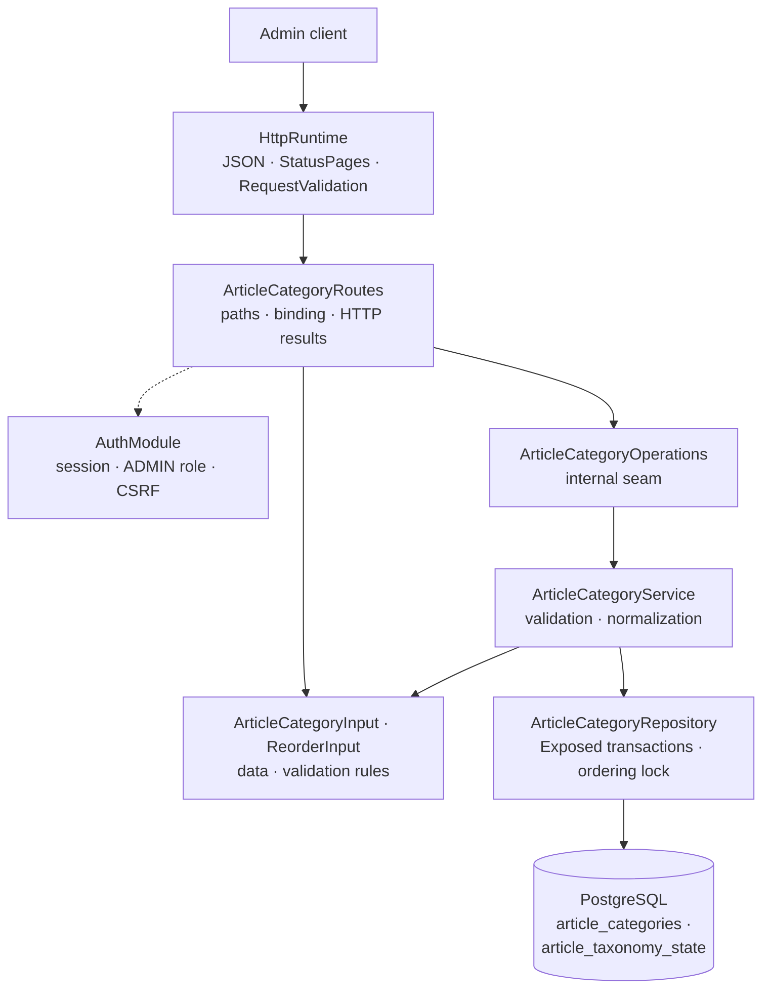

# Backend Article package

This guide explains the Kotlin code in
[`backend/modules/article/src/shop/voenix/article`](../../../backend/modules/article/src/shop/voenix/article).

The Article migration is being implemented in several tickets. This guide
currently covers the complete article database schema and the category slice
of the taxonomy. Subcategories, mugs, the public storefront routes, and the
exported `ArticleCatalog` capability arrive with the following tickets and are
documented here when they do. The plan behind the schema lives in
[`article-migration.md`](../../migration/article-migration.md).

## What this package does

The Article package owns the product catalog: the type-agnostic taxonomy
(categories and subcategories) and one table per article type, starting with
mugs.

Today it provides the authenticated admin lifecycle of *categories*: create,
read, update, delete, and an explicit reorder. Categories have a display
order that is **dense** (positions run 1, 2, 3, … without gaps) and **unique**
(no two categories share a position). Names are unique regardless of letter
case. PostgreSQL enforces all three rules, and the module never asks it
whether a rule would hold before writing.

## The five-minute mental model



The ownership rules are the ones every product module in this backend follows:

1. [`Application.kt`](../../../backend/app/src/shop/voenix/Application.kt)
   installs shared JSON, `StatusPages`, `RequestValidation` (including
   `validateArticleRequests()`), authentication, and the product modules once.
2. `ArticleCategoryRoutes` installs the auth-owned `AdminRouteProtection`
   around the complete route subtree, so authentication, the `ADMIN` role, and
   CSRF are checked before a handler parses an id or a request body.
3. `ArticleCategoryInput.validate()` and `ReorderInput.validate()` are the
   single implementation of their field rules. Ktor's `RequestValidation`
   calls them at the HTTP boundary, and `ArticleCategoryService` calls the same
   methods defensively for direct callers.
4. `ArticleCategoryService` normalizes valid data and turns expected outcomes
   into `OperationResult` values rather than exceptions.
5. `ArticleCategoryRepository` owns Exposed queries, transaction boundaries,
   the ordering lock, and the mapping of PostgreSQL error states.

## Sub-packages

Article is the second module after Account that is split into sub-packages.
The split follows responsibilities, not layers:

```text
article/
|- ArticleModule.kt
|- ReorderInput.kt
|- taxonomy/
|  |- ArticleCategory.kt
|  |- ArticleCategoryInput.kt
|  |- ArticleCategoryOperations.kt
|  |- ArticleCategoryRoutes.kt
|  `- ArticleCategoryService.kt
`- persistence/
   |- ArticleCategories.kt
   |- ArticleCategoryDeleteResult.kt
   |- ArticleCategoryOrderResult.kt
   |- ArticleCategoryRepository.kt
   |- ArticleCategoryWriteResult.kt
   `- ArticleTaxonomyState.kt
```

- the root holds the runtime handle and what every slice shares — currently
  `ReorderInput`, the request body of every reorder route;
- `taxonomy` holds categories and, from the next ticket, subcategories;
- `persistence` holds the Exposed tables, the repositories, and the ordering
  lock helper;
- `mug` will hold the admin and public mug slices.

Sub-packages are **not** visibility boundaries. The compilation module is the
real boundary, so `internal` declarations keep collaborating across
`taxonomy` and `persistence` while staying invisible to every other module.

## Production file map

- `ArticleModule` is the assembled runtime handle. `createArticleModule`
  builds the object graph, `Application.installArticleModule(database)`
  installs the routes, and `validateArticleRequests()` registers the input
  types with the shared Request Validation plugin. The handle is `internal`,
  because no other module needs the assembled instance yet.
- `ReorderInput` is the shared reorder body `{ sourceId, targetId }`.
  Categories, subcategories, and mugs order the same way, so they share one
  input and one set of rules instead of three near-identical bodies.
- `ArticleCategory` is the single representation for list, detail, create,
  update, and reorder responses. It is `internal`: being serialized by a
  public route does not make a type part of the module interface.
- `ArticleCategoryInput` is the model shared by create and update, and it owns
  the field rules and the normalization.
- `ArticleCategoryOperations` is the internal seam the routes use and route
  tests stub.
- `ArticleCategories` and `ArticleTaxonomyState` map the two PostgreSQL tables
  the category slice uses. `ArticleTaxonomyState.kt` also owns
  `lockCategoryOrderingInTransaction()`.
- `ArticleCategoryWriteResult` (`Stored`, `NotFound`, `NameConflict`),
  `ArticleCategoryDeleteResult` (`Deleted`, `NotFound`, `InUse`), and
  `ArticleCategoryOrderResult` (`Reordered`, `NotFound`, `PositionConflict`)
  keep persistence outcomes inside the repository and service. Each one exists
  because its write really has those distinct outcomes.

## HTTP API

Every route requires an authenticated user with the exact `ADMIN` role.
Mutating methods also require the shared `X-XSRF-TOKEN` header.

| Method and path | CSRF | Success response |
| --- | --- | --- |
| `GET /api/admin/articles/categories` | No | `200` with a JSON array of `ArticleCategory` values in display order |
| `POST /api/admin/articles/categories` | Yes | `201` with `ArticleCategory` and `Location` |
| `PUT /api/admin/articles/categories/order` | Yes | `200` with the complete new order |
| `GET /api/admin/articles/categories/{id}` | No | `200` with `ArticleCategory` |
| `PUT /api/admin/articles/categories/{id}` | Yes | `200` with the updated `ArticleCategory` |
| `DELETE /api/admin/articles/categories/{id}` | Yes | `204` without a body |

Lists are bare JSON arrays, not `{ "items": [...] }` wrappers. An invalid id
returns `400 Invalid article category id` after the security checks and before
any operation runs. An unknown id returns `404 Article category not found` —
including the reorder route, where the legacy backend answered `409`.

A request body carries only what a client decides:

```json
{ "name": "Mugs", "description": "Everything you can drink from", "active": true }
```

The response adds the id and the position the module decided:

```json
{
  "id": 42,
  "name": "Mugs",
  "description": "Everything you can drink from",
  "position": 3,
  "active": true
}
```

`position` is response-only. It is never accepted from a client: `POST`
appends behind the last category, `DELETE` closes the gap, and
`PUT .../order` moves one category to the place of another. `PUT .../{id}`
replaces name, description, and activation and leaves the position untouched.

The reorder body names the two categories involved:

```json
{ "sourceId": 42, "targetId": 7 }
```

The answer is the complete list in the new order, so a client never has to
reconstruct the sequence itself:

```json
[
  { "id": 7, "name": "Posters", "description": null, "position": 1, "active": true },
  { "id": 42, "name": "Mugs", "description": null, "position": 2, "active": true }
]
```

`description` comes back trimmed, and a blank description becomes `null`,
because the response is read back from the stored row.

### The three conflicts

A category write can be rejected with `409` for three different reasons, and
each route can produce only one of them. The shared `OperationResult.Conflict`
carries no reason, so the meaning is the stable message of the route:

| Route | Message |
| --- | --- |
| `POST`, `PUT .../{id}` | `Article category name already exists` |
| `DELETE .../{id}` | `Article category is used by subcategories or articles and cannot be deleted` |
| `PUT .../order` | `Article category order changed concurrently, please retry` |

## Validation and normalization

| Field | Rule |
| --- | --- |
| `name` | Required after trimming; at most 200 characters |
| `description` | Optional; at most 1000 characters after trimming |
| `active` | Optional; defaults to `true` |
| `sourceId`, `targetId` | Required; positive; different from each other |

Whether the two reorder ids exist is deliberately **not** a field rule. Only
the database can answer that, and the answer can change between the check and
the write, so an unknown id becomes `404` rather than a validation error.

After validation the service trims the name and turns a blank description into
`null`. The HTTP boundary rejects invalid input before
`ArticleCategoryOperations` is called, and the service calls the same pure
input methods for direct callers, so bypassing Ktor cannot push invalid values
into persistence.

## The database schema

Flyway migration
[`V13__create_articles.sql`](../../../backend/modules/platform/resources/db/migration/V13__create_articles.sql)
creates the complete article schema in one step, even though only the category
tables have Kotlin code so far. Three ideas shape it.

**One table per article type.** `article_mugs` merges what the legacy backend
kept in `articles` plus `article_mug_details`. A future article type gets its
own table instead of more nullable columns in a shared one.

**Two identity registries.** `article_identities` and
`article_variant_identities` carry an id, the article type, and nothing else.
They exist so that Cart, Order, and every later consumer have one foreign-key
target across all article types. Their review rule: *these tables never gain
another column*. `article_mugs` carries a constant `article_type` column and
references `article_identities (id, article_type)`, which makes "this row's
identity is registered as a mug" a database fact rather than a convention.

**Every invariant PostgreSQL can express lives in the database.** The mug
table alone declares that details are all-or-none, that measurements are
positive, that a subcategory requires a category, and that an active article
has a price, its details, and a category. Supplier and price references are
`ON DELETE RESTRICT`, and `UNIQUE (price_id)` backs the rule that a price
belongs to exactly one article.

There are deliberately **no triggers**. Cross-row invariants — at least one
default variant, an active article needs an active variant, a dense position
sequence — live in the single application write path instead, because a
constraint trigger fires at COMMIT and would turn a precise `400` into a
`500`.

## Concurrency: the ordering lock and the deferred unique rule

The display order is the interesting part of this slice, because three
different writes change it: create appends, delete compacts, and reorder
rewrites.

### Why a lock and not a lookup

A preliminary `SELECT max(position)` is not protection. Under PostgreSQL's
default `READ COMMITTED` isolation two concurrent creates read the same
maximum and then write the same position. The module therefore gives every
position writer one row to queue on:

```sql
SELECT id FROM article_taxonomy_state FOR UPDATE
```

`article_taxonomy_state` holds exactly one row and no data — the row *is* the
lock. Its single-row shape is a database rule too (`CHECK (id = 1)`), so it
cannot accidentally become a table with two anchors. Whoever arrives second
waits, and only then reads the positions it decides from, because every
following statement takes a fresh snapshot.

### Why the unique rule is deferred

Positions are unique, but the rule is declared
`UNIQUE (position) DEFERRABLE INITIALLY DEFERRED`, so PostgreSQL checks it
when the transaction commits instead of after each statement. That is what
lets a reorder write the new sequence in **one phase**:

```text
before:  First(1)  Second(2)  Third(3)  Fourth(4)
move Fourth in front of Second
writes:  Fourth := 2, Second := 3, Third := 4     (duplicates exist in between)
commit:  First(1)  Fourth(2)  Second(3)  Third(4)
```

The legacy backend needed two phases for the same move: first push every row
to a temporary high position, then write the final one. Half as many
statements, and the intermediate state is never visible to another
transaction anyway.

### How the two conflicts stay apart

Both the name rule and the position rule report SQL state `23505`, and no code
in this repository may look at a constraint name to tell them apart. What
distinguishes them is *when* PostgreSQL raises the state, so the repository
uses the **placement** of `executePostgresWrite`:

| Write | Placement | Declared outcome |
| --- | --- | --- |
| create | inside the transaction, around the insert | `NameConflict` — only a statement-time `23505` reaches it |
| update | inside the transaction, around the update | `NameConflict` — an update never writes a position |
| reorder | around the whole transaction | `PositionConflict` — only the COMMIT can raise `23505` here |
| delete | around the whole transaction | `InUse` for `23503` from the restricting foreign keys |

A `23505` that create's COMMIT raises is therefore *not* mapped: under the
ordering lock a create cannot collide on a position, so such a failure means
something is broken and becomes a `500` instead of a business-looking `409`.

`PositionConflict` is a real possibility only for a writer that ignores the
ordering lock — a manual database fix, for instance. The rejected transaction
rolled back completely, so the sequence is intact and the client may simply
retry; that is what the message says.

## Tests and verification

- `ArticleCategoryInputValidationTest` and `ReorderInputValidationTest` cover
  the field-rule matrices once.
- `ArticleCategoryRouteSecurityAndValidationTest` covers route-subtree
  protection, CSRF ordering, id binding, validation-before-operation,
  `201` + `Location`, the `204` delete, and every HTTP result mapping against
  stubbed operations.
- `ArticleCategoryAdminIntegrationTest` runs the authenticated and
  CSRF-protected flows through real Ktor routes and PostgreSQL: create with
  trimming and appending, the case-insensitive duplicate conflict on create
  and update, `404` answers, the full update, delete with gap compaction and
  the `409` caused by a referencing subcategory, and the reorder with its
  complete dense answer.
- `ArticleCategoryConcurrencyIntegrationTest` proves the ordering design:
  two concurrent reorders serialize and both succeed, a create running next to
  a reorder cannot corrupt the sequence, concurrent case-variant creates leave
  one row and one conflict, and a position written outside the ordering lock
  makes the reorder fail at COMMIT with a retryable `409`.
- `ArticleTaxonomySchemaIntegrationTest` and
  `ArticleMugSchemaIntegrationTest` prove the Flyway schema on an empty
  database, including the seeded `MUG` type, the single-row lock anchor, both
  case-insensitive name rules, the deferred position rules (the statement is
  accepted, the COMMIT is not), the identity registries, the mug completeness
  checks, the restricted references, and the single default variant per
  article. Every rule is asserted through the write it rejects and the SQL
  state that comes back, never through a constraint name.
  `ArticleTaxonomySchemaIntegrationTest` also proves the other half of the
  Flyway rule: pointed at a database without the migration, Exposed fails with
  "undefined table" and creates nothing.

Run the final backend gate from [`backend/`](../../../backend):

```sh
./kotlin do ktfmt
./kotlin check
```
