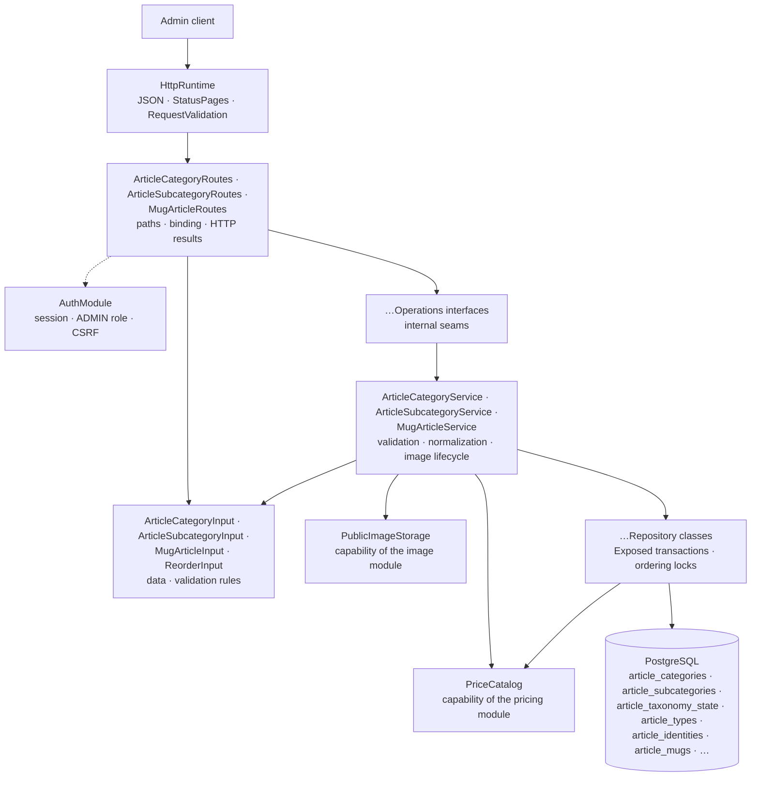

# Backend Article package

This guide explains the Kotlin code in
[`backend/modules/article/src/shop/voenix/article`](../../../backend/modules/article/src/shop/voenix/article).

The Article migration is being implemented in several tickets. This guide
currently covers the complete article database schema, the taxonomy —
categories and subcategories — and the mug **write** slice. Reading mugs, the
public storefront routes, the mug reorder route, and the exported
`ArticleCatalog` capability arrive with the following tickets and are
documented here when they do. The plan behind the schema lives in
[`article-migration.md`](../../migration/article-migration.md).

## What this package does

The Article package owns the product catalog: the type-agnostic taxonomy
(categories and subcategories) and one table per article type, starting with
mugs.

Today it provides the authenticated admin lifecycle of *categories* and
*subcategories* — create, read, update, delete, and an explicit reorder each,
plus the pre-upload of a subcategory's example image — and the write lifecycle
of *mugs*: create, update, delete, and the pre-upload of a variant's example
image.

Every one of those levels has a display order that is **dense** (positions run
1, 2, 3, … without gaps) and **unique** — globally for categories, inside the
owning category for subcategories, and per article type for mugs. Taxonomy
names are unique regardless of letter case; mugs have no name rule at all.
PostgreSQL enforces all of these rules, and the module never asks it whether a
rule would hold before writing.

A mug is more than a row. Writing one writes its identity, its variants and
their identities, and the price row it owns — all in one transaction, so a
rejected article can never leave a price behind and a rejected price can never
create an article.

## The five-minute mental model



The ownership rules are the ones every product module in this backend follows:

1. [`Application.kt`](../../../backend/app/src/shop/voenix/Application.kt)
   installs shared JSON, `StatusPages`, `RequestValidation` (including
   `validateArticleRequests()`), authentication, and the product modules once.
   It also hands Article the `PublicImageStorage` that installing Image
   returned and the `PriceCatalog` that installing Pricing returned.
2. The route objects install the auth-owned `AdminRouteProtection` around their
   complete route subtree, so authentication, the `ADMIN` role, and CSRF are
   checked before a handler parses an id or a request body.
3. The `validate()` methods of the input types are the single implementation of
   their field rules. Ktor's `RequestValidation` calls them at the HTTP
   boundary, and the services call the same methods defensively for direct
   callers.
4. The services normalize valid data, own the example-image lifecycle, and turn
   expected outcomes into `OperationResult` values rather than exceptions.
5. The repositories own Exposed queries, transaction boundaries, the ordering
   locks, and the mapping of PostgreSQL error states. The mug repository is the
   one that also holds `PriceCatalog`, because the price write has to happen
   inside the transaction it opens.

## Sub-packages

Article is the second module after Account that is split into sub-packages.
The split follows responsibilities, not layers:

```text
article/
|- ArticleModule.kt
|- ExampleImage.kt
|- ExampleImageUpload.kt
|- ReorderInput.kt
|- taxonomy/
|  |- ArticleCategory.kt
|  |- ArticleCategoryInput.kt
|  |- ArticleCategoryOperations.kt
|  |- ArticleCategoryRoutes.kt
|  |- ArticleCategoryService.kt
|  |- ArticleSubcategory.kt
|  |- ArticleSubcategoryInput.kt
|  |- ArticleSubcategoryOperations.kt
|  |- ArticleSubcategoryRoutes.kt
|  `- ArticleSubcategoryService.kt
|- mug/
|  |- MugArticle.kt
|  |- MugArticleInput.kt
|  |- MugArticleOperations.kt
|  |- MugArticleRoutes.kt
|  |- MugArticleService.kt
|  |- MugDetails.kt
|  |- MugVariant.kt
|  `- MugVariantInput.kt
`- persistence/
   |- ArticleCategories.kt
   |- ArticleCategoryDeleteResult.kt
   |- ArticleCategoryOrderResult.kt
   |- ArticleCategoryRepository.kt
   |- ArticleCategoryWriteResult.kt
   |- ArticleIdentities.kt
   |- ArticleMugDeleteResult.kt
   |- ArticleMugRepository.kt
   |- ArticleMugVariants.kt
   |- ArticleMugWriteResult.kt
   |- ArticleMugs.kt
   |- ArticleSubcategories.kt
   |- ArticleSubcategoryDeleteResult.kt
   |- ArticleSubcategoryOrderResult.kt
   |- ArticleSubcategoryRepository.kt
   |- ArticleSubcategoryWriteResult.kt
   |- ArticleTaxonomyState.kt
   |- ArticleTypes.kt
   |- ArticleVariantIdentities.kt
   `- StoredMug.kt
```

- the root holds the runtime handle and what every slice shares: `ReorderInput`
  (the body of every reorder route) and the two example-image types, which the
  mug variants will upload exactly like subcategories do;
- `taxonomy` holds categories and subcategories;
- `persistence` holds the Exposed tables, the repositories, and the ordering
  lock helpers;
- `mug` holds the mug slice: its write half today, its read and public half
  with the following tickets.

Sub-packages are **not** visibility boundaries. The compilation module is the
real boundary, so `internal` declarations keep collaborating across
`taxonomy` and `persistence` while staying invisible to every other module.

## Production file map

- `ArticleModule` is the assembled runtime handle. `createArticleModule`
  builds the object graph,
  `Application.installArticleModule(database, images, prices)` installs the
  routes, and `validateArticleRequests()` registers the input types with the
  shared Request Validation plugin. The handle is `internal`, because no other
  module needs the assembled instance yet.
- `ReorderInput` is the shared reorder body `{ sourceId, targetId }`.
  Categories, subcategories, and mugs order the same way, so they share one
  input and one set of rules instead of three near-identical bodies.
- `ExampleImage` is the answer of a pre-upload, `{ "filename": "…" }`, and
  `ExampleImageUpload` is what reading such a request produced: the image, no
  `file` part, or more bytes than the storage accepts. Both live in the root
  because the mug variants upload their example images the same way.
- `ArticleCategory` and `ArticleSubcategory` are the single representations for
  list, detail, create, update, and reorder responses. They are `internal`:
  being serialized by a public route does not make a type part of the module
  interface.
- `ArticleCategoryInput` and `ArticleSubcategoryInput` are the models shared by
  create and update, and they own the field rules and the normalization.
- `ArticleCategoryOperations` and `ArticleSubcategoryOperations` are the
  internal seams the routes use and route tests stub.
- `ArticleCategories`, `ArticleSubcategories`, and `ArticleTaxonomyState` map
  the three PostgreSQL tables the taxonomy uses. `ArticleTaxonomyState.kt` owns
  `lockCategoryOrderingInTransaction()`, and `ArticleCategories.kt` owns
  `lockCategoriesForOrderingInTransaction(ids)` — the subcategory anchors are
  the category rows themselves.
- `ArticleCategoryWriteResult` (`Stored`, `NotFound`, `NameConflict`),
  `ArticleCategoryDeleteResult` (`Deleted`, `NotFound`, `InUse`), and
  `ArticleCategoryOrderResult` (`Reordered`, `NotFound`, `PositionConflict`)
  keep persistence outcomes inside the repository and service. Each one exists
  because its write really has those distinct outcomes.
- `MugArticle` is the single admin representation of a mug, `MugArticleInput`
  the shared create/update body, and `MugDetails` serves both directions,
  because the request and the response carry the same nine measurements.
  `MugVariant` and `MugVariantInput` are two types on purpose: the id of a
  stored variant always exists, while its *absence* in a request is what asks
  for a new one.
- `ArticleTypes`, `ArticleIdentities`, `ArticleVariantIdentities`, `ArticleMugs`,
  and `ArticleMugVariants` map the five tables the mug slice writes.
  `ArticleTypes.kt` owns `lockArticleTypeForOrderingInTransaction(type)`, the
  anchor of the per-type position sequence.
- `StoredMug` is a mug together with the id of its price row. The price id is
  next to the article rather than inside it, because no article contract carries
  one and the price itself is calculated outside the transaction — persistence
  answers with the reference and the service turns it into the embedded price.
- `ArticleMugWriteResult` (`Stored`, `NotFound`, `CategoryNotFound`,
  `SubcategoryNotFound`, `SupplierNotFound`, `PriceRequired`, `UnknownVariant`)
  and `ArticleMugDeleteResult` (`Deleted`, `NotFound`) keep those outcomes
  inside persistence. `Stored` and `Deleted` also report the example images the
  write orphaned, because those files may only be deleted after the commit.
- The three subcategory results say what their writes can additionally produce:
  `ArticleSubcategoryWriteResult` adds `CategoryNotFound` and `InUse` and
  reports the example image a write replaced, and
  `ArticleSubcategoryDeleteResult.Deleted` carries the example image of the
  removed row. Both exist because the file may only be deleted after the
  transaction committed.

## HTTP API

Every route requires an authenticated user with the exact `ADMIN` role.
Mutating methods also require the shared `X-XSRF-TOKEN` header.

### Categories

| Method and path | CSRF | Success response |
| --- | --- | --- |
| `GET /api/admin/articles/categories` | No | `200` with a JSON array of `ArticleCategory` values in display order |
| `POST /api/admin/articles/categories` | Yes | `201` with `ArticleCategory` and `Location` |
| `PUT /api/admin/articles/categories/order` | Yes | `200` with the complete new order |
| `GET /api/admin/articles/categories/{id}` | No | `200` with `ArticleCategory` |
| `PUT /api/admin/articles/categories/{id}` | Yes | `200` with the updated `ArticleCategory` |
| `DELETE /api/admin/articles/categories/{id}` | Yes | `204` without a body |

Lists are bare JSON arrays, not `{ "items": [...] }` wrappers. An invalid id
returns `400 Invalid article category id` after the security checks and before
any operation runs. An unknown id returns `404 Article category not found` —
including the reorder route, where the legacy backend answered `409`.

A request body carries only what a client decides:

```json
{ "name": "Mugs", "description": "Everything you can drink from", "active": true }
```

The response adds the id and the position the module decided:

```json
{
  "id": 42,
  "name": "Mugs",
  "description": "Everything you can drink from",
  "position": 3,
  "active": true
}
```

`position` is response-only. It is never accepted from a client: `POST`
appends behind the last category, `DELETE` closes the gap, and
`PUT .../order` moves one category to the place of another. `PUT .../{id}`
replaces name, description, and activation and leaves the position untouched.

The reorder body names the two categories involved:

```json
{ "sourceId": 42, "targetId": 7 }
```

The answer is the complete list in the new order, so a client never has to
reconstruct the sequence itself:

```json
[
  { "id": 7, "name": "Posters", "description": null, "position": 1, "active": true },
  { "id": 42, "name": "Mugs", "description": null, "position": 2, "active": true }
]
```

`description` comes back trimmed, and a blank description becomes `null`,
because the response is read back from the stored row.

#### The three category conflicts

A category write can be rejected with `409` for three different reasons, and
each route can produce only one of them. The shared `OperationResult.Conflict`
carries no reason, so the meaning is the stable message of the route:

| Route | Message |
| --- | --- |
| `POST`, `PUT .../{id}` | `Article category name already exists` |
| `DELETE .../{id}` | `Article category is used by subcategories or articles and cannot be deleted` |
| `PUT .../order` | `Article category order changed concurrently, please retry` |

### Subcategories

| Method and path | CSRF | Success response |
| --- | --- | --- |
| `GET /api/admin/articles/subcategories` | No | `200` with a JSON array of every `ArticleSubcategory`, ordered by its category's display order and then by its own |
| `POST /api/admin/articles/subcategories` | Yes | `201` with `ArticleSubcategory` and `Location` |
| `POST /api/admin/articles/subcategories/example-images` | Yes | `201` with `{ "filename": "…" }` |
| `PUT /api/admin/articles/subcategories/order` | Yes | `200` with the complete new order of the affected category |
| `GET /api/admin/articles/subcategories/{id}` | No | `200` with `ArticleSubcategory` |
| `PUT /api/admin/articles/subcategories/{id}` | Yes | `200` with the updated `ArticleSubcategory` |
| `DELETE /api/admin/articles/subcategories/{id}` | Yes | `204` without a body |

A subcategory names its category on both sides of the contract:

```json
{
  "categoryId": 7,
  "name": "Classic",
  "description": "The plain ones",
  "exampleImageFilename": "0f1b2c3d-4e5f-4a6b-8c9d-0e1f2a3b4c5d.webp",
  "active": true
}
```

```json
{
  "id": 42,
  "categoryId": 7,
  "name": "Classic",
  "description": "The plain ones",
  "exampleImageFilename": "0f1b2c3d-4e5f-4a6b-8c9d-0e1f2a3b4c5d.webp",
  "position": 2,
  "active": true
}
```

The legacy backend accepted a flat `articleCategoryId` and answered with a
nested category object. The same category is already available from the
category routes, so nesting it here would only make the request and the
response disagree about the shape of one relationship.

`position` counts inside the owning category and is response-only. `POST`
appends behind the last subcategory of its category, `DELETE` closes the gap,
`PUT .../order` moves one subcategory to the place of a sibling, and a `PUT`
that changes `categoryId` appends in the new category and compacts the one it
left. The reorder body is the shared `{ sourceId, targetId }`, and its answer
is the dense list of the affected category only — a target from another
category is outside that list and therefore as unknown as a missing id.

#### The example image

Uploading and saving are two requests. `POST .../example-images` takes a
`multipart/form-data` body with a `file` part, stores it through Image's
`PublicImageStorage` (always WebP, file name a UUID with dashes) in the folder
`articles/subcategory-example-images`, and answers with the name:

```json
{ "filename": "0f1b2c3d-4e5f-4a6b-8c9d-0e1f2a3b4c5d.webp" }
```

The create and update bodies then carry that name, which keeps them plain JSON.
A body without an `exampleImageFilename` — or with `null` — means "no example
image", so that is how an image is removed; the legacy `removeExampleImage`
flag has no successor.

The `file` part is read chunk by chunk and refused as soon as it exceeds
10 MiB, so an oversized upload is rejected while it is still arriving:
`413 Example image must not exceed 10 MiB`. A body without a `file` part is
`400 An example image file part is required`; everything the image storage
rejects, such as an unsupported format, becomes the usual
`400 Validation failed` with the field errors of the storage.

While saving, a submitted file name has to look like a name the storage mints
and the file has to exist, otherwise the write is a field error on
`exampleImageFilename`. A name that is already stored on the row is exempt: it
was checked when it was written, and the file may have been swept since.

Files are cleaned up in one direction only. A file that a subcategory stops
referring to — because the image was replaced, removed, or the subcategory was
deleted — is deleted *after* the transaction committed, and a failed deletion
is only logged. A file that no subcategory ever refers to, because the write
after the upload failed, stays behind as an accepted orphan; removing those is
separate, deferred work.

#### The subcategory conflicts and the two category field errors

| Route | Status and message |
| --- | --- |
| `POST`, `PUT .../{id}` | `409 Article subcategory name already exists in this article category` |
| `DELETE .../{id}` | `409 Article subcategory is used by articles and cannot be deleted` |
| `PUT .../order` | `409 Article subcategory order changed concurrently, please retry` |
| `POST`, `PUT .../{id}` | `400 Validation failed`, `categoryId`: `Article category does not exist` |
| `PUT .../{id}` | `400 Validation failed`, `categoryId`: `Article subcategory is used by articles and cannot be moved to another category` |

The last two are field errors rather than conflicts, because both say the same
thing: the submitted `categoryId` is not a value this subcategory may take.
That also keeps every route at exactly one `409` meaning, which is what makes
the stable message of the route enough to tell the two conflicts apart. It
follows the rule Supplier already uses for a missing referenced country (see
[`persistence-error-handling.md`](persistence-error-handling.md)).

### Mugs

The mug is the first article type, and `article_mugs` is its own table rather
than a row in a shared `articles` table. The write slice is complete; the read
routes (`GET`, the list, the public storefront, and `PUT .../order`) follow in
the next ticket.

| Method and path | CSRF | Success response |
| --- | --- | --- |
| `POST /api/admin/articles/mugs` | Yes | `201` with `MugArticle` and `Location` |
| `POST /api/admin/articles/mugs/variant-example-images` | Yes | `201` with `{ "filename": "…" }` |
| `PUT /api/admin/articles/mugs/{id}` | Yes | `200` with the updated `MugArticle` |
| `DELETE /api/admin/articles/mugs/{id}` | Yes | `204` without a body |

A request carries the article, its details, its variants, and its price:

```json
{
  "name": "Classic mug",
  "descriptionShort": "A mug",
  "descriptionLong": "A classic white mug",
  "active": true,
  "categoryId": 7,
  "subcategoryId": 42,
  "supplierId": 3,
  "supplierArticleName": "Classic 300",
  "supplierArticleNumber": "4711",
  "mugDetails": {
    "heightMm": 95,
    "diameterMm": 82,
    "printTemplateWidthMm": 200,
    "printTemplateHeightMm": 90,
    "fillingQuantity": "300 ml",
    "dishwasherSafe": true,
    "documentFormatWidthMm": null,
    "documentFormatHeightMm": null,
    "documentFormatMarginBottomMm": null
  },
  "mugVariants": [
    {
      "name": "White",
      "insideColorCode": "#ffffff",
      "outsideColorCode": "#ffffff",
      "isDefault": true,
      "active": true,
      "exampleImageFilename": "0f1b2c3d-4e5f-4a6b-8c9d-0e1f2a3b4c5d.webp"
    }
  ],
  "price": { "purchaseVatId": 1, "salesVatId": 1, "salesTotalInputCents": 1490 }
}
```

The response adds what the module decided — the ids, the display position, and
the complete calculated price:

```json
{
  "id": 12,
  "position": 3,
  "name": "Classic mug",
  "…": "every submitted field, trimmed",
  "mugVariants": [ { "id": 34, "name": "White", "…": "…" } ],
  "price": { "id": 8, "salesTotal": { "net": 1252, "gross": 1490 }, "…": "…" }
}
```

Three properties of that contract are deliberate:

- **`position` is response-only.** `POST` appends behind the last mug of the
  type, `DELETE` closes the gap, and the reorder route of the read slice moves
  one mug to the place of another.
- **There is no `priceId` anywhere.** The request embeds a `PriceInput` and the
  response embeds the full `CalculatedPrice`, whose `id` is the only place a
  price id appears. This is what makes a price belong to exactly one article
  *by construction*: an id can only come into existence while an article is
  written, so no request can attach a price that belongs to someone else. The
  `UNIQUE (price_id)` rule in the database is the backstop, not the mechanism.
- **`articleType` is gone.** It said `"MUG"` on every row of a route that only
  serves mugs.

#### The variant array is a diff

`mugVariants` is not a list of new rows, it is the complete intended state:

| Entry | Effect |
| --- | --- |
| with an `id` that belongs to this article | the variant is updated |
| without an `id` | a variant is inserted |
| a stored variant the array does not mention | the variant is deleted, and its example image with it |
| with an `id` of another article | `400`, `mugVariants`: `One or more variants do not belong to this article` |

The statements run in that order for a reason. At most one variant may be the
default (a partial unique index), so the write first removes what left, then
clears the default flag on every remaining variant, and only then writes the
submitted flags. Swapping the default between two variants would otherwise
collide halfway through, even though the result is legal.

#### The price of an article

An omitted `price` keeps the price row the mug already owns, and a submitted
one is written **over that same row**, so the id a client already knows stays
valid. That is also how the legacy backend behaved. Deleting the article
deletes its price in the same transaction — the article row goes first, because
the price reference is `ON DELETE RESTRICT`.

The order of the steps is what makes the two failure directions symmetric:

```text
validate input          → 400, nothing happened
check example images    → 400, nothing happened
prices.prepare(price)   → 400 with price.* field errors, no article written
BEGIN
  lock article_types('MUG')
  lock category, look the subcategory up inside it
  write the price into this transaction
  mint the identity, write the mug, mint variant identities, write variants
COMMIT                  → any failure rolls the price back with the article
delete orphaned image files (best effort)
```

`prepare` never touches the `prices` table, so it can run before the
transaction opens; `storeInTransaction`, `replaceInTransaction`, and
`deleteInTransaction` are not suspending and therefore can only ever run inside
the transaction their caller opened.

#### Why every mug rejection is a field error

A mug write has no `409` at all. There is no unique name, and the position
cannot collide while the type anchor is locked, so a conflict would not be
something a client did — the route treats one as a broken invariant. What look
like conflicts elsewhere are field errors here:

| Field | Message | Decided by |
| --- | --- | --- |
| `categoryId` | `Article category does not exist` | the lock that found no row |
| `subcategoryId` | `Article subcategory does not exist in this article category` | the lookup inside the locked category |
| `supplierId` | `Supplier does not exist` | SQL state `23503` — the only reference left that can fail |
| `mugVariants` | `One or more variants do not belong to this article` | the diff, under the mug's row lock |
| `price` | `An active article requires a price` | the write path, which knows the stored price too |
| `mugVariants[0].exampleImageFilename` | `Example image …` | the image storage, before the transaction |

#### The variant example image

`POST .../mugs/variant-example-images` is the same pre-upload as the
subcategory one, through the same `PublicImageStorage`, into the folder
`articles/mugs/variant-example-images`, and with the same answers: `201` with
the minted name, `400` without a `file` part, `413` above 10 MiB. Create and
update then carry that name in `mugVariants[i].exampleImageFilename`.

A name that is already stored on the variant is exempt from the check, so a
swept file cannot block an unrelated update. Files a variant stops referring to
— replaced, removed, or deleted with the article — are deleted after the commit
and a failure is only logged; files no variant ever referred to stay behind as
accepted orphans.

## Validation and normalization

| Field | Rule |
| --- | --- |
| `name` | Required after trimming; at most 200 characters |
| `description` | Optional; at most 1000 characters after trimming |
| `active` | Optional; defaults to `true` |
| `categoryId` (subcategory) | Required; positive |
| `exampleImageFilename` (subcategory) | Optional; checked while saving, not as a field rule |
| `sourceId`, `targetId` | Required; positive; different from each other |
| `name` (mug) | Required after trimming; at most 255 characters |
| `descriptionShort` / `descriptionLong` (mug) | Required; at most 1000 / 5000 characters |
| `supplierArticleName`, `supplierArticleNumber` | Optional; at most 255 characters |
| `categoryId`, `subcategoryId`, `supplierId` | Optional; positive; `subcategoryId` requires `categoryId` |
| `mugDetails.*Mm` | Greater than zero; the optional document-format ones only when present |
| `mugVariants[i]` | `name`, `insideColorCode`, `outsideColorCode` required, at most 255 characters; ids positive and distinct |
| `mugVariants` | Exactly one default when the array is not empty |
| `active` (mug) | Requires mug details, at least one active variant, and a category |

The mug matrix is the legacy `ArticleRequestValidator` with three additions: an
active mug also needs a category (the legacy storefront silently hid such
articles), reference ids must be positive like everywhere else in this backend,
and the variant array may not address the same variant twice, because it is a
diff.

The fourth activation rule — an active mug needs a price — is deliberately
**not** a field rule. An update may keep a price it does not resubmit, so the
answer depends on the stored article; the write path owns that rule and answers
it as a `price` field error before PostgreSQL's CHECK would turn it into a
`500`.

Whether the two reorder ids, the category, or the named image file exist is
deliberately **not** a field rule. Only the database or the image storage can
answer that, and the answer can change between the check and the write, so an
unknown reorder id becomes `404` and the other two become the field errors
listed above — decided by the write itself, not by a lookup before it.

After validation the service trims the texts and turns blank ones into `null`.
The HTTP boundary rejects invalid input before the operations are called, and
the services call the same pure input methods for direct callers, so bypassing
Ktor cannot push invalid values into persistence.

## The database schema

Flyway migration
[`V13__create_articles.sql`](../../../backend/modules/platform/resources/db/migration/V13__create_articles.sql)
creates the complete article schema in one step. Three ideas shape it.

**One table per article type.** `article_mugs` merges what the legacy backend
kept in `articles` plus `article_mug_details`. A future article type gets its
own table instead of more nullable columns in a shared one.

**Two identity registries.** `article_identities` and
`article_variant_identities` carry an id, the article type, and nothing else.
They exist so that Cart, Order, and every later consumer have one foreign-key
target across all article types. Their review rule: *these tables never gain
another column*. `article_mugs` carries a constant `article_type` column and
references `article_identities (id, article_type)`, which makes "this row's
identity is registered as a mug" a database fact rather than a convention.

**Every invariant PostgreSQL can express lives in the database.** The mug
table alone declares that details are all-or-none, that measurements are
positive, that a subcategory requires a category, and that an active article
has a price, its details, and a category. Supplier and price references are
`ON DELETE RESTRICT`, and `UNIQUE (price_id)` backs the rule that a price
belongs to exactly one article.

There are deliberately **no triggers**. Cross-row invariants — at least one
default variant, an active article needs an active variant, a dense position
sequence — live in the single application write path instead, because a
constraint trigger fires at COMMIT and would turn a precise `400` into a
`500`.

## Concurrency: the ordering locks and the deferred unique rule

The display order is the interesting part of this slice, because four
different writes change it: create appends, delete compacts, reorder rewrites,
and a subcategory that changes its category leaves one sequence and joins
another.

### Why a lock and not a lookup

A preliminary `SELECT max(position)` is not protection. Under PostgreSQL's
default `READ COMMITTED` isolation two concurrent creates read the same
maximum and then write the same position. The module therefore gives every
position writer one row to queue on:

```sql
SELECT id FROM article_taxonomy_state FOR UPDATE
```

`article_taxonomy_state` holds exactly one row and no data — the row *is* the
lock. Its single-row shape is a database rule too (`CHECK (id = 1)`), so it
cannot accidentally become a table with two anchors. Whoever arrives second
waits, and only then reads the positions it decides from, because every
following statement takes a fresh snapshot.

Subcategory positions are dense *per category*, so the anchor is the category
row itself — one anchor per sequence, the same idea one level down:

```sql
SELECT ... FROM article_categories WHERE id = ? FOR UPDATE
```

That lock does a second job. While the target category row is held it cannot
disappear, so the reference from the subcategory to it can no longer fail. A
missing row is simply a lock that found nothing, which is where the
`categoryId` field error comes from — and what is left for SQL state `23503`
to mean is the one remaining relationship: an article uses this subcategory.

Mug positions are dense *per article type*, so their anchor is the
`article_types` row of the type — the same idea once more:

```sql
SELECT article_type FROM article_types WHERE article_type = 'MUG' FOR UPDATE
```

A mug write takes up to three locks, and always in this order, which is what
keeps it free of deadlocks with the taxonomy writers: the type anchor first
(only when a position is decided), then the category row, then the mug row
itself. The category lock does the same second job it does for subcategories —
while it is held the category cannot disappear and no subcategory can leave it,
so the only reference a mug write can still fail on is the supplier, and that
is what makes SQL state `23503` unambiguous there. The mug row lock keeps two
writers of one mug from interleaving their variant diffs.

A move locks two rows, and two moves in opposite directions would deadlock if
each took its rows in the order it happened to need them. The rows are
therefore locked one statement at a time in ascending id order. A write has to
read the subcategory before it knows which categories to lock, and the
subcategory can move in between; the transaction then notices under the lock
that it holds the wrong one and starts over instead of taking one more lock,
which keeps the ascending order — and with it the freedom from deadlocks —
intact.

### Why the unique rule is deferred

Positions are unique, but the rule is declared
`UNIQUE (position) DEFERRABLE INITIALLY DEFERRED`, so PostgreSQL checks it
when the transaction commits instead of after each statement. That is what
lets a reorder write the new sequence in **one phase**:

```text
before:  First(1)  Second(2)  Third(3)  Fourth(4)
move Fourth in front of Second
writes:  Fourth := 2, Second := 3, Third := 4     (duplicates exist in between)
commit:  First(1)  Fourth(2)  Second(3)  Third(4)
```

The legacy backend needed two phases for the same move: first push every row
to a temporary high position, then write the final one. Half as many
statements, and the intermediate state is never visible to another
transaction anyway.

### How the two conflicts stay apart

Both the name rule and the position rule report SQL state `23505`, and no code
in this repository may look at a constraint name to tell them apart. What
distinguishes them is *when* PostgreSQL raises the state, so the repository
uses the **placement** of `executePostgresWrite`:

| Write | Placement | Declared outcome |
| --- | --- | --- |
| create | inside the transaction, around the insert | `NameConflict` — only a statement-time `23505` reaches it |
| mug create and update | inside the transaction, around the writes | `SupplierNotFound` for `23503`; no `23505` is declared at all |
| update | inside the transaction, around the update | `NameConflict`; the subcategory update also declares `InUse` for `23503` |
| reorder | around the whole transaction | `PositionConflict` — only the COMMIT can raise `23505` here |
| delete | around the whole transaction | `InUse` for `23503` from the restricting foreign keys |

A `23505` that create's COMMIT raises is therefore *not* mapped: under the
ordering lock a create cannot collide on a position, so such a failure means
something is broken and becomes a `500` instead of a business-looking `409`.

The subcategory update is the one write that declares both states at once, and
it may do so because the ordering lock has already ruled the other foreign key
out. A category change writes `category_id`, which the composite key
`(subcategory_id, category_id)` of `article_mugs` references — so an article
that uses the subcategory rejects the statement itself. No query asks whether
one does.

`PositionConflict` is a real possibility only for a writer that ignores the
ordering lock — a manual database fix, for instance. The rejected transaction
rolled back completely, so the sequence is intact and the client may simply
retry; that is what the message says.

## Tests and verification

- `ArticleCategoryInputValidationTest`, `ArticleSubcategoryInputValidationTest`,
  and `ReorderInputValidationTest` cover the field-rule matrices once.
- `ExampleImageUploadTest` covers the multipart reader: the `file` part with
  its content type, other parts skipped, a body without one, exactly the
  maximum accepted, and — the point of the reader — an oversized part refused
  before the source has offered all of its bytes.
- `ArticleCategoryRouteSecurityAndValidationTest` covers route-subtree
  protection, CSRF ordering, id binding, validation-before-operation,
  `201` + `Location`, the `204` delete, and every HTTP result mapping against
  stubbed operations.
- `ArticleCategoryAdminIntegrationTest` runs the authenticated and
  CSRF-protected flows through real Ktor routes and PostgreSQL: create with
  trimming and appending, the case-insensitive duplicate conflict on create
  and update, `404` answers, the full update, delete with gap compaction and
  the `409` caused by a referencing subcategory, and the reorder with its
  complete dense answer.
- `ArticleCategoryConcurrencyIntegrationTest` proves the ordering design:
  two concurrent reorders serialize and both succeed, a create running next to
  a reorder cannot corrupt the sequence, concurrent case-variant creates leave
  one row and one conflict, and a position written outside the ordering lock
  makes the reorder fail at COMMIT with a retryable `409`.
- `ArticleSubcategoryRouteSecurityAndValidationTest` covers the same route
  contract for subcategories, plus the pre-upload: what the storage rejects, a
  body without a `file` part, and an oversized body that never reaches the
  storage.
- `ArticleSubcategoryAdminIntegrationTest` runs the flows against PostgreSQL:
  per-category appending and the list order, the case-insensitive duplicate
  that is free again in another category, `404` answers, the unknown category
  as a field error, a category change that appends in the target and compacts
  the source, the composite foreign key that refuses to move *and* to delete a
  subcategory an article uses, delete with gap compaction, the reorder with its
  dense per-category answer including a target from another category, and the
  complete image lifecycle: an unknown or malformed file name rejected while
  saving, the orphan a rejected write leaves behind, the old file deleted after
  the commit, and `null` removing the image.
- `ArticleSubcategoryConcurrencyIntegrationTest` mirrors the category
  concurrency proofs one level down, where the anchor is the category row.
- `MugArticleInputValidationTest` covers the mug field-rule matrix once,
  including the two fields the write contract must *not* have.
- `MugArticleRouteSecurityAndValidationTest` covers the mug route contract
  against stubbed operations: the protected subtree, CSRF before id binding,
  validation before any operation, `201` + `Location`, the `204` delete, every
  result mapping, and the variant pre-upload.
- `MugArticleAdminIntegrationTest` runs the write slice against PostgreSQL with
  the real pricing module: create with its price and its position, an omitted
  price that keeps the stored row and a submitted one that rewrites it in place,
  the variant diff including the default swap and every image-cleanup case, the
  three reference field errors, the invariants that cannot be reached through
  the API, both atomicity directions (a rejected price leaves no article, a
  rejected article leaves no price row, no identity, and no variant identity),
  the delete that removes article, variants, price, and files, the example-image
  checks, and the contract rule that a submitted `priceId` is never honored.
- `MugArticleConcurrencyIntegrationTest` proves the type anchor: concurrent
  creates append one after another instead of reading the same maximum twice,
  and a create running next to a delete still leaves a dense sequence.
- `ArticleTaxonomySchemaIntegrationTest` and
  `ArticleMugSchemaIntegrationTest` prove the Flyway schema on an empty
  database, including the seeded `MUG` type, the single-row lock anchor, both
  case-insensitive name rules, the deferred position rules (the statement is
  accepted, the COMMIT is not), the identity registries, the mug completeness
  checks, the restricted references, and the single default variant per
  article. Every rule is asserted through the write it rejects and the SQL
  state that comes back, never through a constraint name.
  `ArticleTaxonomySchemaIntegrationTest` also proves the other half of the
  Flyway rule: pointed at a database without the migration, Exposed fails with
  "undefined table" and creates nothing.

Run the final backend gate from [`backend/`](../../../backend):

```sh
./kotlin do ktfmt
./kotlin check
```
