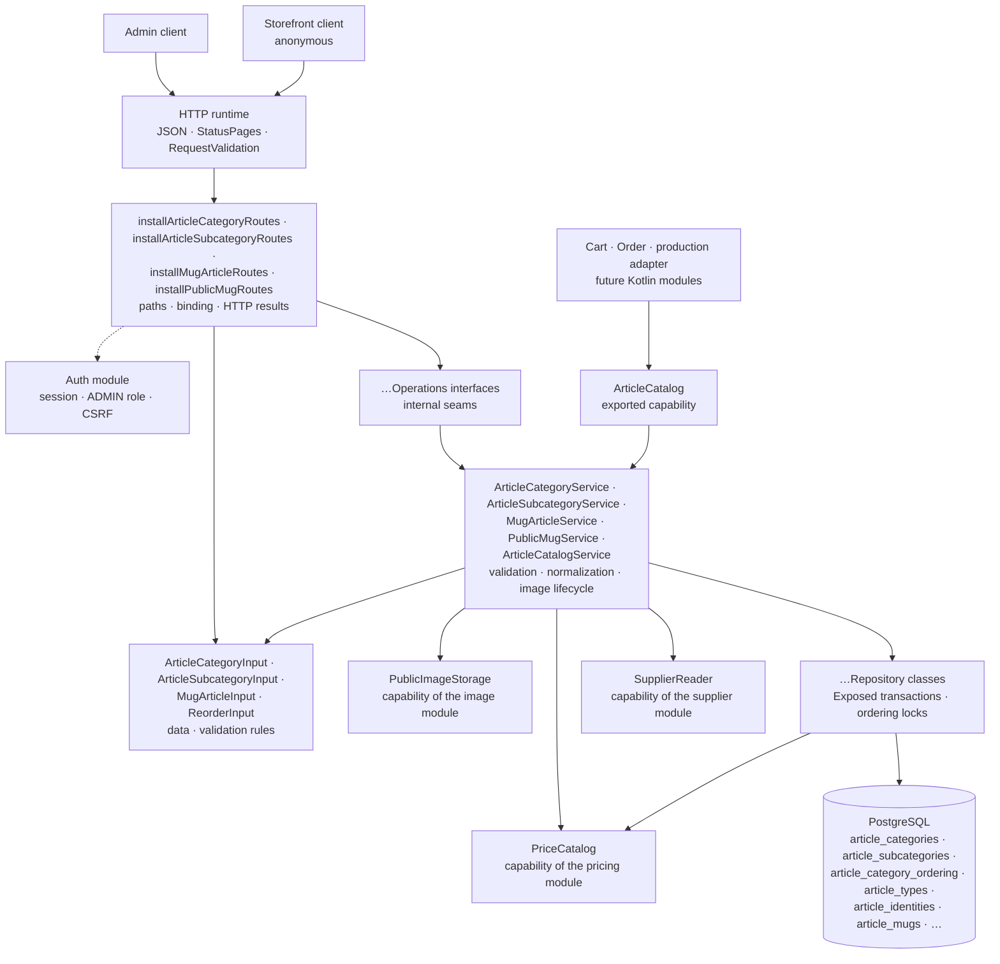

# Backend Article package

This guide explains the Kotlin code in
[`backend/modules/article/src/shop/voenix/article`](../../../backend/modules/article/src/shop/voenix/article).

This guide covers the whole module: the article database schema, the category
structure of categories and subcategories, the mug admin slice (writing **and**
reading), the two anonymous storefront routes, and the exported `ArticleCatalog`
capability. The plan and the decisions behind them live in
[`article-migration.md`](../../migration/article-migration.md); everything the
Vue frontend has to change because of them is listed in
[`article-post-migration.md`](../../migration/article-post-migration.md).

## What this package does

The Article package owns the product catalog: the shared category structure
(categories and subcategories) and one table per article type, starting with
mugs.

Today it provides the authenticated admin lifecycle of *categories* and
*subcategories*: create, read, update, delete, and an explicit reorder each,
plus the pre-upload of a subcategory's example image. It also provides the
admin lifecycle of *mugs*: the overview list, one mug in full, create, update,
delete, an explicit reorder, and the pre-upload of a variant's example image.
On top of that it serves the two anonymous storefront reads: the mugs a
customer may buy and the categories they are sorted into.

Every one of those levels has a display order that is **dense** (positions run
1, 2, 3, … without gaps) and **unique**: globally for categories, inside the
owning category for subcategories, and per article type for mugs. Category and
subcategory names are unique regardless of letter case; mugs have no name rule
at all.
PostgreSQL enforces all of these rules, and the module never asks it whether a
rule would hold before writing.

A mug is more than a row. Writing one writes its identity, its variants and
their identities, and the price row it owns, all in one transaction. A
rejected article can therefore never leave a price behind, and a rejected price
can never create an article.

The shop itself reads two of those things without a session: the list of mugs a
customer may buy and the navigation those mugs sit in. What "may buy" means is
one rule: the mug and its category are active, and the mug either has no
subcategory or an active one. Both routes apply it, so the navigation can never
lead into an empty list.

Other Kotlin modules read the catalog through one exported capability,
`ArticleCatalog`. It answers a whole batch of article-variant references at
once and is described in [The exported capability](#the-exported-capability).

## The five-minute mental model



The ownership rules are the ones every product module in this backend follows:

1. [`Application.kt`](../../../backend/app/src/shop/voenix/Application.kt)
   installs shared JSON, `StatusPages`, `RequestValidation` (including
   `validateArticleRequests()`), authentication, and the product modules once.
   It also hands Article the `publicStorage` of the `ImageModule` that
   installing Image returned, the `PriceCatalog` that installing Pricing
   returned, and the `SupplierReader` that installing Supplier returned. That
   last capability turns the supplier id of a mug into the supplier name its
   list row shows.
2. The route installers install the auth-owned `AdminRouteProtection` around their
   complete route subtree, so authentication, the `ADMIN` role, and CSRF are
   checked before a handler parses an id or a request body.
3. The `validate()` methods of the input types are the single implementation of
   their field rules. Ktor's `RequestValidation` calls them at the HTTP
   boundary, and the services call the same methods defensively for direct
   callers.
4. The services normalize valid data, own the example-image lifecycle, and turn
   expected outcomes into `OperationResult` values rather than exceptions.
5. The repositories own Exposed queries, transaction boundaries, the ordering
   locks, and the mapping of PostgreSQL error states. The mug repository is the
   one that also holds `PriceCatalog`, because the price write has to happen
   inside the transaction it opens.

## Sub-packages

Article is one of the modules that is split into sub-packages, like Account,
`email`, and `production`. The split follows responsibilities, not layers:

```text
article/
|- ArticleCatalog.kt
|- ArticleCatalogService.kt
|- ArticleModule.kt
|- ExampleImage.kt
|- ReorderInput.kt
|- category/
|  |- ArticleCategory.kt
|  |- ArticleCategoryRoutes.kt
|  |- ArticleCategoryService.kt
|  |- ArticleSubcategory.kt
|  |- ArticleSubcategoryRoutes.kt
|  `- ArticleSubcategoryService.kt
|- mug/
|  |- MugArticle.kt
|  |- MugArticleInput.kt
|  |- MugArticleRoutes.kt
|  |- MugArticleService.kt
|  |- MugDetails.kt
|  |- PublicMug.kt
|  |- PublicMugRoutes.kt
|  `- PublicMugService.kt
`- persistence/
   |- ArticleCatalogRepository.kt
   |- ArticleCategories.kt
   |- ArticleCategoryRepository.kt
   |- ArticleIdentities.kt
   |- ArticleMugRepository.kt
   |- ArticleMugs.kt
   |- ArticleSubcategoryRepository.kt
   |- ArticleTypes.kt
   |- DensePositions.kt
   `- PublicMugRepository.kt
```

- the root holds the runtime handle, the exported capability, and the public
  values that capability exchanges; the last two share `ArticleCatalog.kt`. The
  root also holds what every slice shares: `ReorderInput` (the body of every
  reorder route) and `ExampleImage` (the answer of a pre-upload, which the mug
  variants use exactly like subcategories do). Re-typing a failed
  `OperationResult` of another module is done with the platform's `asFailure()`
  from `shop.voenix.operation`;
- `category` holds categories and subcategories;
- `persistence` holds the Exposed tables, the repositories, and the ordering
  lock helpers;
- `mug` holds the mug slice: the admin half and the storefront half. They sit
  in one sub-package because the storefront answer is defined by the admin
  state. A mug is visible exactly while it and its category path are active.

Sub-packages are **not** visibility boundaries. The compilation module is the
real boundary, so `internal` declarations keep collaborating across
`category` and `persistence` while staying invisible to every other module.

### How the files are grouped

A file here is one concern, not one type. Kotlin lets declarations that belong
together share a source file, and this module groups them the way the
backend-wide rule in
[`source-file-organization.md`](source-file-organization.md) describes:

- a **domain file** holds a representation together with the small value types
  that belong to it: `ArticleCategory.kt` holds the category and the input
  that writes it, `MugArticle.kt` the three admin representations of a mug, and
  `PublicMug.kt` the four storefront ones;
- a **service file** holds the service, the seam interface it implements, and
  the private helpers of both. `MugArticleService.kt`, for example, holds
  `MugArticleService` and `MugArticleOperations`;
- a **routes file** holds the top-level `install…Routes` function with the
  HTTP helpers around it;
- a **repository file** holds the repository, the sealed results it answers
  with, and the stored value types it builds. `ArticleMugRepository.kt` holds
  `ArticleMugWriteResult`, `ArticleMugDeleteResult`, `ArticleMugOrderResult`,
  and `StoredMug` next to the writes that produce them;
- a **table file** holds the Exposed tables of one part of the schema together
  with the lock helpers that guard their positions.

A declaration keeps a file of its own when it is large enough to be a concern
by itself, or when so many components share it that no single file is its
owner: `MugDetails` (request, response, and the storefront read all use it),
`ReorderInput`, `ExampleImage`, and `isDenseBy` in `DensePositions.kt`.

Where a declaration lives is invisible to the rest of the code, because the
package does not change with the file. The list below therefore names types,
and mentions a file only where it matters which one owns a helper.

## Production file map

- `ArticleModule` is the assembled runtime handle. `createArticleModule`
  builds the object graph,
  `Application.installArticleModule(database, images, prices, suppliers)`
  installs the routes and returns the `ArticleCatalog` capability, and
  `validateArticleRequests()` registers the input types with the
  shared Request Validation plugin. The handle stays `internal`: what another
  module needs is the capability, not the assembled instance.
- `ArticleCatalog`, `ArticleVariantReference`, `CatalogVariant`, and
  `ArticleType` are the four public types of this module: the capability and
  the values it exchanges. Everything else, including every type an HTTP route
  serializes, is `internal`. `ArticleCatalogService` implements the capability
  and `ArticleCatalogRepository` performs its one stored read;
  `StoredCatalogVariant` is what that read answers, with the price as a
  reference. The section [The exported capability](#the-exported-capability)
  describes the contract itself.
- `ReorderInput` is the shared reorder body `{ sourceId, targetId }`.
  Categories, subcategories, and mugs order the same way, so they share one
  input and one set of rules instead of three near-identical bodies.
- `ExampleImage` is the answer of a pre-upload, `{ "filename": "…" }`. It lives
  in the root because the mug variants upload their example images the same way.
  Reading such a request is not this module's code any more: `ExampleImageUpload`
  and `receiveExampleImageUpload` moved into the `image` module when Prompt
  became a second consumer with the same policy, and Article now imports them
  from there (see the [Image package guide](image-package.md)).
- `ArticleCategory` and `ArticleSubcategory` are the single representations for
  list, detail, create, update, and reorder responses. They are `internal`:
  being serialized by a public route does not make a type part of the module
  interface.
- `ArticleCategoryInput` and `ArticleSubcategoryInput` are the models shared by
  create and update, and they own the field rules and the normalization.
- `ArticleCategoryOperations` and `ArticleSubcategoryOperations` are the
  internal seams the routes use and route tests stub. Each one sits in the file
  of the service that implements it, so a reader sees the promise and the
  implementation at once.
- `ArticleCategories.kt` maps the three PostgreSQL tables the category structure
  uses, `ArticleCategories`, `ArticleSubcategories`, and
  `ArticleCategoryOrdering`. It also owns the two locks that order their
  position writers: `lockCategoryOrderingInTransaction()` for the single anchor
  row, and `lockCategoriesForOrderingInTransaction(ids)` for the category rows,
  which are the anchors of the subcategory sequences themselves.
- `ArticleCategoryWriteResult` (`Stored`, `NotFound`, `NameConflict`),
  `ArticleCategoryDeleteResult` (`Deleted`, `NotFound`, `InUse`), and
  `ArticleCategoryOrderResult` (`Reordered`, `NotFound`, `PositionConflict`)
  keep persistence outcomes inside the repository and service. Each one exists
  because its write really has those distinct outcomes, and all three sit in
  `ArticleCategoryRepository.kt` next to the writes that answer with them. The
  three subcategory results do the same in `ArticleSubcategoryRepository.kt`.
- `MugArticle` is the single admin representation of a mug, `MugArticleInput`
  the shared create/update body, and `MugDetails` serves both directions,
  because the request and the response carry the same nine measurements.
  `MugVariant` and `MugVariantInput` are two types on purpose: the id of a
  stored variant always exists, while its *absence* in a request is what asks
  for a new one.
- `MugArticleListItem` is the row of the overview list and the one second
  representation the mug slice has. It is not a smaller `MugArticle`. It spells
  out what a mug only *references*, that is, the names of its category,
  subcategory, and supplier. It leaves out the descriptions, measurements,
  variants, and the calculated price that the table does not show. Answering the
  list with the full representation would mean reading every variant and
  recalculating every price for a screen that displays none of them.
- `PublicMug`, `PublicMugVariant`, `PublicMugCategory`, and
  `PublicMugSubcategory` are the storefront representations, and each of them
  differs from its admin counterpart by what a customer may not see: no supplier
  fields and no `active` flags anywhere, no admin description on a subcategory,
  and a `price` that is one number, the gross sales total in cents. Three
  fields that are nullable in `MugArticle` are not nullable here (`categoryId`,
  `mugDetails`, `price`), because the database refuses an active mug without a
  category, without its details, and without a price. That is what removed the
  legacy `price: 0` the storefront showed while the cart refused the same
  article: there is no fallback to write.
- `PublicMugOperations`, `PublicMugService`, `PublicMugRepository`, and
  `installPublicMugRoutes` are the storefront slice, separate from the admin one
  all the way down. `installPublicMugRoutes` installs its two routes **outside**
  the `authenticate` block. Anonymous access is not a rule the handlers apply;
  it is the absence of the admin subtree around them. The service below it
  needs neither the image storage nor the supplier capability, because a
  customer uploads nothing and never learns who produces a mug. The one
  capability it does use is `PriceCatalog`.
- `StoredPublicMug` is the public counterpart of `StoredMug`: a visible mug with
  the *reference* to its price instead of the amount. The amount is calculated
  by another module from the current VAT entries, so persistence answers with
  the id and the service resolves every id of the page in one
  `PriceCatalog.find`.
- `ArticleTypes`, `ArticleIdentities`, `ArticleVariantIdentities`, `ArticleMugs`,
  and `ArticleMugVariants` map the five tables the mug slice writes, in three
  files: `ArticleTypes.kt` for the type registry, `ArticleIdentities.kt` for the
  two identity registries, and `ArticleMugs.kt` for the mug row and its variant
  row. `ArticleTypes.kt` owns `lockArticleTypeForOrderingInTransaction(type)`,
  the anchor of the per-type position sequence, and `ArticleMugs.kt` owns the
  one part of that sequence that is specific to mugs: the gap compaction of a
  delete. It sits next to the table whose column it maintains, not in the
  repository that calls it. The last taken position and the dense rewrite of a
  reorder are the same work for every ordered table and live in
  `DensePositions.kt`.
- `DensePositions.kt` holds the three helpers every position sequence of this
  module is built from. `isDenseBy(position)` asks whether a stored order really
  is `1..n`; the reorders of categories, subcategories, and mugs all ask it
  before they rewrite anything. `rewriteDensePositionsInTransaction` numbers a
  list from 1 and writes only the rows whose place really changed, and
  `maxPositionInTransaction` reads the last taken place, for the whole table
  or, with a `scope`, for one category. The three take no locks and open no
  transactions: the caller runs them under the ordering lock of its sequence.
  Each is written once here instead of once per level.
- `StoredMug` is a mug together with the id of its price row. The price id is
  next to the article rather than inside it, because no article contract carries
  one and the price itself is calculated outside the transaction. Persistence
  answers with the reference and the service turns it into the embedded price.
- `ArticleMugWriteResult` (`Stored`, `NotFound`, `CategoryNotFound`,
  `SubcategoryNotFound`, `SupplierNotFound`, `PriceRequired`, `UnknownVariant`)
  and `ArticleMugDeleteResult` (`Deleted`, `NotFound`) keep those outcomes
  inside persistence. `Stored` and `Deleted` also report the example images the
  write orphaned, because those files may only be deleted after the commit.
- `ArticleMugOrderResult` (`Reordered`, `NotFound`, `PositionConflict`) is the
  outcome of the one mug write that has a conflict. `Reordered` carries the
  whole new order as list rows, still without the supplier names. The service
  fills in that one label, exactly as it does for the list.
- The three subcategory results say what their writes can produce beyond the
  category ones:
  `ArticleSubcategoryWriteResult` adds `CategoryNotFound` and `InUse` and
  reports the example image a write replaced, and
  `ArticleSubcategoryDeleteResult.Deleted` carries the example image of the
  removed row. Both exist because the file may only be deleted after the
  transaction committed.

## HTTP API

Every route under `/api/admin/articles` requires an authenticated user with the
exact `ADMIN` role. Mutating methods also require the shared `X-XSRF-TOKEN`
header. The two storefront routes under `/api/articles` are anonymous; they are
described in [The storefront](#the-storefront).

### Categories

| Method and path | CSRF | Success response |
| --- | --- | --- |
| `GET /api/admin/articles/categories` | No | `200` with a JSON array of `ArticleCategory` values in display order |
| `POST /api/admin/articles/categories` | Yes | `201` with `ArticleCategory` and `Location` |
| `PUT /api/admin/articles/categories/order` | Yes | `200` with the complete new order |
| `GET /api/admin/articles/categories/{id}` | No | `200` with `ArticleCategory` |
| `PUT /api/admin/articles/categories/{id}` | Yes | `200` with the updated `ArticleCategory` |
| `DELETE /api/admin/articles/categories/{id}` | Yes | `204` without a body |

Lists are bare JSON arrays, not `{ "items": [...] }` wrappers. An invalid id
returns `400 Invalid article category id` after the security checks and before
any operation runs. An unknown id returns `404 Article category not found`,
including on the reorder route, where the legacy backend answered `409`.

A request body carries only what a client decides:

```json
{ "name": "Mugs", "description": "Everything you can drink from", "active": true }
```

The response adds the id and the position the module decided:

```json
{
  "id": 42,
  "name": "Mugs",
  "description": "Everything you can drink from",
  "position": 3,
  "active": true
}
```

`position` is response-only. It is never accepted from a client: `POST`
appends behind the last category, `DELETE` closes the gap, and
`PUT .../order` moves one category to the place of another. `PUT .../{id}`
replaces name, description, and activation and leaves the position untouched.

The reorder body names the two categories involved:

```json
{ "sourceId": 42, "targetId": 7 }
```

The answer is the complete list in the new order, so a client never has to
reconstruct the sequence itself:

```json
[
  { "id": 7, "name": "Posters", "description": null, "position": 1, "active": true },
  { "id": 42, "name": "Mugs", "description": null, "position": 2, "active": true }
]
```

`description` comes back trimmed, and a blank description becomes `null`,
because the response is read back from the stored row.

#### The three category conflicts

A category write can be rejected with `409` for three different reasons, and
each route can produce only one of them. The shared `OperationResult.Conflict`
carries no reason, so the meaning is the stable message of the route:

| Route | Message |
| --- | --- |
| `POST`, `PUT .../{id}` | `Article category name already exists` |
| `DELETE .../{id}` | `Article category is used by subcategories or articles and cannot be deleted` |
| `PUT .../order` | `Article category order changed concurrently, please retry` |

### Subcategories

| Method and path | CSRF | Success response |
| --- | --- | --- |
| `GET /api/admin/articles/subcategories` | No | `200` with a JSON array of every `ArticleSubcategory`, ordered by its category's display order and then by its own |
| `POST /api/admin/articles/subcategories` | Yes | `201` with `ArticleSubcategory` and `Location` |
| `POST /api/admin/articles/subcategories/example-images` | Yes | `201` with `{ "filename": "…" }` |
| `PUT /api/admin/articles/subcategories/order` | Yes | `200` with the complete new order of the affected category |
| `GET /api/admin/articles/subcategories/{id}` | No | `200` with `ArticleSubcategory` |
| `PUT /api/admin/articles/subcategories/{id}` | Yes | `200` with the updated `ArticleSubcategory` |
| `DELETE /api/admin/articles/subcategories/{id}` | Yes | `204` without a body |

A subcategory names its category on both sides of the contract:

```json
{
  "categoryId": 7,
  "name": "Classic",
  "description": "The plain ones",
  "exampleImageFilename": "0f1b2c3d-4e5f-4a6b-8c9d-0e1f2a3b4c5d.webp",
  "active": true
}
```

```json
{
  "id": 42,
  "categoryId": 7,
  "name": "Classic",
  "description": "The plain ones",
  "exampleImageFilename": "0f1b2c3d-4e5f-4a6b-8c9d-0e1f2a3b4c5d.webp",
  "position": 2,
  "active": true
}
```

The legacy backend accepted a flat `articleCategoryId` and answered with a
nested category object. The same category is already available from the
category routes, so nesting it here would only make the request and the
response disagree about the shape of one relationship.

`position` counts inside the owning category and is response-only. `POST`
appends behind the last subcategory of its category, `DELETE` closes the gap,
`PUT .../order` moves one subcategory to the place of a sibling, and a `PUT`
that changes `categoryId` appends in the new category and compacts the one it
left. The reorder body is the shared `{ sourceId, targetId }`, and its answer
is the dense list of the affected category only. A target from another
category is outside that list and therefore as unknown as a missing id.

#### The example image

Uploading and saving are two requests. `POST .../example-images` takes a
`multipart/form-data` body with a `file` part, stores it through Image's
`PublicImageStorage` (always WebP, file name a UUID with dashes) in the folder
`articles/subcategory-example-images`, and answers with the name:

```json
{ "filename": "0f1b2c3d-4e5f-4a6b-8c9d-0e1f2a3b4c5d.webp" }
```

The create and update bodies then carry that name, which keeps them plain JSON.
A body without an `exampleImageFilename`, or with `null`, means "no example
image", so that is how an image is removed; the legacy `removeExampleImage`
flag has no successor.

The `file` part is read chunk by chunk and refused as soon as it exceeds
10 MiB, so an oversized upload is rejected while it is still arriving. That
rejection, a body without a `file` part, and everything the image storage
rejects (an unsupported format, a broken file) all answer the same way:
`400 Validation failed` with the message on the `file` field. See
[`image-package.md`](image-package.md) for why `413` is deliberately not used
here.

The service follows one rule here: store, check a submitted name, delete an
obsolete one after the commit. That rule is not written in this module. It lives
once in the image module's `ExampleImages`, which this slice holds one of, for
its own folder and under its own logger (see
[`image-package.md`](image-package.md#the-example-image-rule)).

While saving, a submitted file name has to look like a name the storage mints
and the file has to exist, otherwise the write is a field error on
`exampleImageFilename`. That includes a name the row already stores. It cannot
have been swept, because the sweep only removes files no row refers to. So a
stored name whose file is gone means another writer replaced it and deleted the
file, and accepting the name again would point the row at nothing.

Files are cleaned up in one direction only. A file that a subcategory stops
referring to, whether because the image was replaced or removed or because the
subcategory was deleted, is deleted *after* the transaction committed, and a
failed deletion is only logged. A file that no subcategory ever refers to,
because the write after the upload failed, stays behind as an accepted orphan;
removing those is separate, deferred work.

Nothing makes a file name exclusive: the pre-upload hands a client one name,
and two subcategories may carry it. The write therefore asks, inside its own
transaction, whether any other row still names the file before it reports it as
obsolete, so dropping one of two references keeps the picture the other one
shows.

#### The subcategory conflicts and the two category field errors

| Route | Status and message |
| --- | --- |
| `POST`, `PUT .../{id}` | `409 Article subcategory name already exists in this article category` |
| `DELETE .../{id}` | `409 Article subcategory is used by articles and cannot be deleted` |
| `PUT .../order` | `409 Article subcategory order changed concurrently, please retry` |
| `POST`, `PUT .../{id}` | `400 Validation failed`, `categoryId`: `Article category does not exist` |
| `PUT .../{id}` | `400 Validation failed`, `categoryId`: `Article subcategory is used by articles and cannot be moved to another category` |

The last two are field errors rather than conflicts, because both say the same
thing: the submitted `categoryId` is not a value this subcategory may take.
That also keeps every route at exactly one `409` meaning, which is what makes
the stable message of the route enough to tell the two conflicts apart. It
follows the rule Supplier already uses for a missing referenced country (see
[`persistence-error-handling.md`](persistence-error-handling.md)).

### Mugs

The mug is the first article type, and `article_mugs` is its own table rather
than a row in a shared `articles` table. The admin routes are below; the two
anonymous routes the shop reads are in [The storefront](#the-storefront).

| Method and path | CSRF | Success response |
| --- | --- | --- |
| `GET /api/admin/articles/mugs` | No | `200` with a JSON array of `MugArticleListItem` values in display order |
| `POST /api/admin/articles/mugs` | Yes | `201` with `MugArticle` and `Location` |
| `PUT /api/admin/articles/mugs/order` | Yes | `200` with the complete new order |
| `POST /api/admin/articles/mugs/variant-example-images` | Yes | `201` with `{ "filename": "…" }` |
| `GET /api/admin/articles/mugs/{id}` | No | `200` with `MugArticle` |
| `PUT /api/admin/articles/mugs/{id}` | Yes | `200` with the updated `MugArticle` |
| `DELETE /api/admin/articles/mugs/{id}` | Yes | `204` without a body |

An invalid id is `400 Invalid article id`, an unknown one
`404 Article not found`. Every mug route gives the same two answers.

A request carries the article, its details, its variants, and its price:

```json
{
  "name": "Classic mug",
  "descriptionShort": "A mug",
  "descriptionLong": "A classic white mug",
  "active": true,
  "categoryId": 7,
  "subcategoryId": 42,
  "supplierId": 3,
  "supplierArticleName": "Classic 300",
  "supplierArticleNumber": "4711",
  "mugDetails": {
    "heightMm": 95,
    "diameterMm": 82,
    "printTemplateWidthMm": 200,
    "printTemplateHeightMm": 90,
    "fillingQuantity": "300 ml",
    "dishwasherSafe": true,
    "documentFormatWidthMm": null,
    "documentFormatHeightMm": null,
    "documentFormatMarginBottomMm": null
  },
  "mugVariants": [
    {
      "name": "White",
      "insideColorCode": "#ffffff",
      "outsideColorCode": "#ffffff",
      "isDefault": true,
      "active": true,
      "exampleImageFilename": "0f1b2c3d-4e5f-4a6b-8c9d-0e1f2a3b4c5d.webp"
    }
  ],
  "price": { "purchaseVatId": 1, "salesVatId": 1, "salesTotalInputCents": 1490 }
}
```

The response adds what the module decided, namely the ids, the display
position, and the complete calculated price:

```json
{
  "id": 12,
  "position": 3,
  "name": "Classic mug",
  "…": "every submitted field, trimmed",
  "mugVariants": [ { "id": 34, "name": "White", "…": "…" } ],
  "price": { "id": 8, "salesTotal": { "net": 1252, "tax": 238, "gross": 1490 }, "…": "…" }
}
```

Three properties of that contract are deliberate:

- **`position` is response-only.** `POST` appends behind the last mug of the
  type, `DELETE` closes the gap, and `PUT .../order` moves one mug to the place
  of another.
- **There is no `priceId` anywhere.** The request embeds a `PriceInput` and the
  response embeds the full `CalculatedPrice`, whose `id` is the only place a
  price id appears. This is what makes a price belong to exactly one article
  *by construction*: an id can only come into existence while an article is
  written, so no request can attach a price that belongs to someone else. The
  `UNIQUE (price_id)` rule in the database is the backstop, not the mechanism.
- **`articleType` is gone.** It said `"MUG"` on every row of a route that only
  serves mugs.

#### The overview list

`GET /api/admin/articles/mugs` answers a bare array with one row per mug. The
rows come in display order, `position` first and `id` as the stable
tie-breaker:

```json
[
  {
    "id": 12,
    "position": 1,
    "name": "Classic mug",
    "active": true,
    "categoryId": 7,
    "categoryName": "Mugs",
    "subcategoryId": 42,
    "subcategoryName": "Classic",
    "supplierId": 3,
    "supplierName": "Porcelain Ltd",
    "variantCount": 2,
    "exampleImageFilename": "0f1b2c3d-4e5f-4a6b-8c9d-0e1f2a3b4c5d.webp"
  },
  {
    "id": 13,
    "position": 2,
    "name": "Draft mug",
    "active": false,
    "categoryId": null,
    "categoryName": null,
    "subcategoryId": null,
    "subcategoryName": null,
    "supplierId": null,
    "supplierName": null,
    "variantCount": 0,
    "exampleImageFilename": null
  }
]
```

`exampleImageFilename` is the picture the table shows: the image of the default
variant or, when the default has none, the image of the oldest variant that
has one. A mug without variants, or without a single variant image, has none.
That is how the legacy list chose the picture too.

A `supplierName` is `null` when the mug names no supplier *and* when the
supplier module does not answer for the id. The reference itself is always
reported, because it is what the mug stores.

**The list reads a constant number of queries.** Four statements answer it: the
mugs, the variants of *all* of them, and one per category level for the
distinct categories and subcategories they name. On top of that comes exactly
one `SupplierReader.find` call carrying every distinct supplier id of the page.
Nothing is read per row, and an integration test measures that: listing three
mugs must run the same statements as listing one.

#### Moving a mug

`PUT /api/admin/articles/mugs/order` moves one mug to the place of another. The
body is the shared reorder input, the same one the two category levels use:

```json
{ "sourceId": 12, "targetId": 9 }
```

The answer is the **complete** new order as the rows the list answers with,
supplier names included and resolved in the same single batched lookup. A
client therefore never has to reconstruct the positions it did not send:

```json
[
  { "id": 9, "position": 1, "name": "Draft mug", "…": "…" },
  { "id": 12, "position": 2, "name": "Classic mug", "…": "…" }
]
```

`order` is a literal path segment next to `/{id}`, so a reorder never reaches
the item routes. Three answers are possible besides the order itself:

| Answer | When |
| --- | --- |
| `400 Validation failed` | an id is missing, not positive, or equal to the other one |
| `404 Article not found` | one of the two ids is not in the order. This is the same answer an unknown mug gets, where the legacy backend mixed `404` and `409` |
| `409 Article order changed concurrently, please retry` | the stored sequence is not the one this move may rewrite |

The `409` is the one conflict the mug routes have, and it has two sources that
are described under [the ordering locks](#concurrency-the-ordering-locks-and-the-deferred-unique-rule):
a stored sequence that already had a gap, and a position another writer changed
while the move was written. Neither writes anything, so a retry is the right
reaction to both.

#### One mug in full

`GET /api/admin/articles/mugs/{id}` answers the same `MugArticle` that create
and update answer with: every stored field, the details, the variants, and the
embedded `price`. The amounts of that price are recalculated from the current
VAT entries on every read, so a write and a later read of the same mug agree.

Variants always come back in the same order, the default first, then by name,
then by id:

```json
{
  "id": 12,
  "position": 1,
  "name": "Classic mug",
  "descriptionShort": "A mug",
  "descriptionLong": "A classic white mug",
  "active": true,
  "categoryId": 7,
  "subcategoryId": 42,
  "supplierId": 3,
  "supplierArticleName": "Classic 300",
  "supplierArticleNumber": "4711",
  "mugDetails": { "heightMm": 95, "…": "…" },
  "mugVariants": [
    { "id": 34, "name": "White", "isDefault": true, "…": "…" },
    { "id": 35, "name": "Black", "isDefault": false, "…": "…" }
  ],
  "price": { "id": 8, "salesTotal": { "net": 1252, "tax": 238, "gross": 1490 }, "…": "…" }
}
```

Neither body carries `priceId` or `articleType`. Both response shapes are
locked by integration tests that compare the **whole** JSON document, so a
field that reappears fails the test. The embedded `price` is the one part
compared separately: its shape belongs to the pricing module, which locks it
with its own tests, and `salesTotal` is a `PriceAmount` with `net`, `tax`, and
`gross`.

#### The variant array is a diff

`mugVariants` is not a list of new rows, it is the complete intended state:

| Entry | Effect |
| --- | --- |
| with an `id` that belongs to this article | the variant is updated |
| without an `id` | a variant is inserted |
| a stored variant the array does not mention | the variant is deleted, and its example image with it |
| with an `id` of another article | `400`, `mugVariants`: `One or more variants do not belong to this article` |

The statements run in that order for a reason. At most one variant may be the
default (a partial unique index), so the write first removes what left, then
clears the default flag on every remaining variant, and only then writes the
submitted flags. Swapping the default between two variants would otherwise
collide halfway through, even though the result is legal.

#### The price of an article

An omitted `price` keeps the price row the mug already owns, and a submitted
one is written **over that same row**, so the id a client already knows stays
valid. That is also how the legacy backend behaved. Deleting the article
deletes its price in the same transaction. The article row goes first, because
the price reference is `ON DELETE RESTRICT`.

The order of the steps is what makes the two failure directions symmetric:

```text
validate input          → 400, nothing happened
check example images    → 400, nothing happened
prices.prepare(price)   → 400 with price.* field errors, no article written
BEGIN
  lock article_types('MUG')
  lock category, look the subcategory up inside it
  write the price into this transaction
  ── from here the 23503 mapping is in force ──
  mint the identity, write the mug, mint variant identities, write variants
COMMIT                  → any failure rolls the price back with the article
delete orphaned image files (best effort)
```

`prepare` never touches the `prices` table, so it can run before the
transaction opens; `storeInTransaction`, `replaceInTransaction`, and
`deleteInTransaction` are not suspending and therefore can only ever run inside
the transaction their caller opened.

The price write sits inside the transaction and **outside** the `23503`
mapping, and the line above is where that boundary runs. A price references two
VAT rows with `ON DELETE RESTRICT`, and `prepare` resolved them before the
transaction opened. A VAT deleted in between makes the price statement raise
the same state the supplier reference raises. Inside the mapping that would be
answered as `400 supplierId: Supplier does not exist`, which is simply wrong.
Outside it the VAT race stays an unexpected failure and becomes a `500`, and
the mapping keeps covering only statements whose one client-fallible reference
is the supplier.

#### Why every other mug rejection is a field error

Apart from the reorder, a mug write has no `409` at all. There is no unique
name, and the position cannot collide while the type anchor is locked, so a
conflict reaching one of these routes would not be something a client did. The
routes treat one as a broken invariant. What look like conflicts elsewhere are
field errors here:

| Field | Message | Decided by |
| --- | --- | --- |
| `categoryId` | `Article category does not exist` | the lock that found no row |
| `subcategoryId` | `Article subcategory does not exist in this article category` | the lookup inside the locked category |
| `supplierId` | `Supplier does not exist` | SQL state `23503`, the only reference left that can fail |
| `mugVariants` | `One or more variants do not belong to this article` | the diff, under the mug's row lock |
| `price` | `An active article requires a price` | the write path, which knows the stored price too |
| `mugVariants[0].exampleImageFilename` | `Example image …` | the image storage, before the transaction |

#### The variant example image

`POST .../mugs/variant-example-images` is the same pre-upload as the
subcategory one, through the same `PublicImageStorage`, into the folder
`articles/mugs/variant-example-images`, and with the same answers: `201` with
the minted name and `400 Validation failed` on the `file` field both without a
`file` part and above 10 MiB. Create and
update then carry that name in `mugVariants[i].exampleImageFilename`.

The checking and deleting are the same `ExampleImages` rule the subcategory
slice uses, with this folder and this service's logger; only the field path
differs, because it names the variant's index.

Every submitted name is checked, including one the variant already stores, for
the same reason the subcategory checks it: a stored name whose file is gone can
only mean another writer replaced it. Files a variant stops referring to,
whether replaced, removed, or deleted with the article, are deleted after the
commit and a failure is only logged; files no variant ever referred to stay
behind as accepted orphans. Two variants may name the same file, so the write
asks inside its transaction whether any variant row still names it before
reporting it as obsolete.

### The storefront

Two routes serve the shop itself. They need no session, no role, and no CSRF
token, and both answer a bare JSON array:

| Method and path | Success response |
| --- | --- |
| `GET /api/articles/mugs` | `200` with the mugs a customer may buy, in display order |
| `GET /api/articles/mugs/categories` | `200` with the categories those mugs sit in, subcategories nested |

**One visibility rule, applied by both.** A mug appears when it is `active`,
its category is set and `active`, and it either has no subcategory or an active
one. The categories route answers the categories and subcategories that those
mugs use. A category nobody sells a visible mug in is not a navigation entry a
customer could follow, and neither is an empty subcategory. Because both routes
build on the same query shape, the navigation can never lead into an empty list.

The list is the admin mug without what a customer may not see:

```json
[
  {
    "id": 12,
    "position": 1,
    "name": "Classic mug",
    "descriptionShort": "A mug",
    "descriptionLong": "A classic white mug",
    "categoryId": 7,
    "subcategoryId": 42,
    "price": 1490,
    "mugDetails": { "heightMm": 95, "…": "…" },
    "variants": [
      {
        "id": 34,
        "name": "White",
        "insideColorCode": "#ffffff",
        "outsideColorCode": "#ffffff",
        "isDefault": true,
        "exampleImageFilename": "0f1b2c3d-4e5f-4a6b-8c9d-0e1f2a3b4c5d.webp"
      }
    ]
  }
]
```

- **No supplier fields and no `active` flags.** Who produces a mug is not a
  customer's business, and both flags would be constant: the list only contains
  visible mugs, and `variants` only their active variants.
- **`price` is one number**: the gross sales total in integer cents,
  recalculated from the current VAT entries on every read. It is never absent,
  because an active mug has a price row and the database enforces that. What is
  gone is the legacy `0` *sentinel*: the legacy backend showed `price: 0` for an
  article without a price while the cart refused the very same article. A `0`
  here is now a real calculated price, because pricing accepts a zero amount and
  rejects only negative ones.
- **The variants are ordered like everywhere else**: the default first, then by
  name.
- **`position` stays**, because it *is* the order of the array.

The categories are the navigation:

```json
[
  {
    "id": 7,
    "name": "Mugs",
    "position": 1,
    "subcategories": [
      {
        "id": 42,
        "name": "Classic",
        "exampleImageFilename": "0f1b2c3d-4e5f-4a6b-8c9d-0e1f2a3b4c5d.webp",
        "position": 1
      }
    ]
  }
]
```

The legacy endpoint was `GET /api/articles/categories` and answered a map from
article type to category list, so a client had to know the string `"MUG"` to
find the mugs. The route path names the type instead (approved deviation); the
Vue adaptation is listed with every other changed contract in
[`article-post-migration.md`](../../migration/article-post-migration.md).

**Three data accesses, whatever the catalog holds.** The list runs one query
for the visible mugs with the categories that decide their visibility, one for
the active variants of all of them, and exactly one `PriceCatalog.find` for
every price of the page. An empty catalog asks the pricing module nothing at
all. The categories route is a single `DISTINCT` query over the same join.

## The exported capability

`ArticleCatalog` is the one thing another Kotlin module may use this package
for. `installArticleModule(...)` returns it, and since the Cart migration the
composition root **binds** it: a cart resolves the article and variant of every
line it renders through this capability, and refuses an add whose variant is not
`purchasable`. Order and the production adapter behind it will bind the same
capability.

```kotlin
public interface ArticleCatalog {
    public suspend fun find(
        references: Set<ArticleVariantReference>
    ): Map<ArticleVariantReference, CatalogVariant>
}
```

Set in, map out. That is the shape every reader capability in this backend has
(`CountryReader`, `VatReader`, `SupplierReader`, `PriceCatalog.find`). A cart
page, an order, or a PDF job resolves every distinct reference it holds in one
call instead of one query per line.

**The reference is a pair.** `ArticleVariantReference(articleId, variantId)` is
what a cart line and an order line store. Both halves are part of the key even
though variant ids are unique on their own: a reference whose variant belongs
to a *different* article is unknown, not silently resolved to that other
article's data. The database states the same rule one level down through the
composite foreign key of `article_variant_identities`. The article *type* is
not part of the reference; it is one of the answers.

**Unknown references are absent.** A deleted article, a variant that never
existed, and a mismatched pair all read the same way: the key is missing from
the map. Nothing is mapped to `null`, so a caller handles one case instead of
three.

**What `CatalogVariant` answers.**

| Field | Meaning |
| --- | --- |
| `articleType` | `ArticleType.MUG` today; the enum is closed, because a new type is a new table and a new branch in every consumer |
| `articleName`, `variantName` | The two names a production page and an order line print |
| `purchasable` | The whole buy rule in one flag: active article ∧ active variant ∧ price present |
| `grossSalesPriceCents` | The gross sales total in cents, recalculated from the current VAT entries; `null` when the article owns no price, never a `0` standing in for a missing one |
| `supplierId`, `supplierArticleNumber` | Who produces it and under which number. The number is article master data and therefore *not* part of `SupplierSummary` |
| `printTemplateWidthMm`, `printTemplateHeightMm`, `documentFormatWidthMm`, `documentFormatHeightMm`, `documentFormatMarginBottomMm` | The five layout measurements `ProductionItem` overrides its page size, print area, and bottom margin with |
| `outsideColorCode`, `insideColorCode` | The two colors a consumer renders a stored reference with; `null` for an article type that has no colors, which is why they are nullable although every mug variant carries both |

**The colors are the fourth question, and the boundary at the same time.**
`CatalogVariant` answers four questions: *may this be bought?*, *what does it
cost?*, *what does producing it need?*, and *what does it look like?* The last
one means what a consumer needs to render a reference it has **stored**, even
one that is no longer purchasable. A cart line, an order line, and a production
preview all name a variant a customer already chose, and they cannot get its
colors from the storefront read, which only answers articles still on offer.
Browsing copy stays out: height, diameter, filling quantity, and the dishwasher
flag help a customer *choose* an article, so they belong to the storefront
representation. The colors sit on the variant row, so an article without its
details answers them anyway; it loses the layout measurements and nothing else.

Only five of the nine mug measurements are exported. Height, diameter,
filling quantity, and the dishwasher flag describe the physical mug; they are
catalog copy for the storefront and production has no use for them. The
measurements are whole millimetres here and `Double` in `ProductionItem`.
Widening them is the adapter's job, and that adapter lives in the module that
owns the order line. **Article does not depend on `production`**, so the
capability names no production type at all.

**Purchasability is one answer, not three facts.** The legacy backend let the
storefront and the cart each combine the parts themselves, which is how a
`price: 0` article could be offered and then refused. Here the module that owns
the rule computes it, and the three reasons for `false` are distinct in the
data: the article is inactive, the variant is inactive, or no price exists. The
last one is only reachable while the article is inactive, because the database
refuses an active article without a price.

**Nothing here is a snapshot.** Every field is current master data. That is why
the Order migration must copy the supplier article number and the layout
measurements into the order line at checkout instead of reading them again at
production time (recorded in
[`article-migration.md`](../../migration/article-migration.md)).

**Two data accesses per batch.** One query joins the referenced variants with
their articles, and one `PriceCatalog.find` resolves every price of the answer.
A batch whose articles own no price asks the pricing module nothing, and an
empty reference set touches the database not at all. Unlike the routes, the
capability reports no `OperationResult`: a database failure surfaces as an
exception, because an empty map would tell a cart that its articles are gone.

## Validation and normalization

| Field | Rule |
| --- | --- |
| `name` | Required after trimming; at most 200 characters |
| `description` | Optional; at most 1000 characters after trimming |
| `active` (category, subcategory) | Optional; defaults to `true` |
| `categoryId` (subcategory) | Required; positive |
| `exampleImageFilename` (subcategory) | Optional; checked while saving, not as a field rule |
| `sourceId`, `targetId` | Required; positive; different from each other |
| `name` (mug) | Required after trimming; at most 255 characters |
| `descriptionShort` / `descriptionLong` (mug) | Required; at most 1000 / 5000 characters |
| `supplierArticleName`, `supplierArticleNumber` | Optional; at most 255 characters |
| `categoryId`, `subcategoryId`, `supplierId` | Optional; positive; `subcategoryId` requires `categoryId` |
| `mugDetails.*Mm` | Greater than zero; the optional document-format ones only when present |
| `mugVariants[i]` | `name`, `insideColorCode`, `outsideColorCode` required, at most 255 characters; ids positive and distinct |
| `mugVariants[i].active` | Optional; defaults to `false` |
| `mugVariants` | Exactly one default when the array is not empty |
| `active` (mug) | Optional; defaults to `false`; when `true` requires mug details, at least one active variant, and a category |

The two `active` defaults differ on purpose, and both are the legacy ones. A
category or subcategory row that says nothing is visible; a mug and a variant that say nothing
are not. It matters for the activation rule: an active mug needs at least one
active variant, so a variant array that never mentions `active` cannot make an
article visible by accident.

The mug matrix is the legacy `ArticleRequestValidator` with three additions: an
active mug also needs a category (the legacy storefront silently hid such
articles), reference ids must be positive like everywhere else in this backend,
and the variant array may not address the same variant twice, because it is a
diff.

The fourth activation rule, that an active mug needs a price, is deliberately
**not** a field rule. An update may keep a price it does not resubmit, so the
answer depends on the stored article; the write path owns that rule and answers
it as a `price` field error before PostgreSQL's CHECK would turn it into a
`500`.

Whether the two reorder ids, the category, or the named image file exist is
deliberately **not** a field rule. Only the database or the image storage can
answer that, and the answer can change between the check and the write, so an
unknown reorder id becomes `404` and the other two become the field errors
listed above, decided by the write itself, not by a lookup before it.

After validation the service trims the texts and turns blank ones into `null`.
The HTTP boundary rejects invalid input before the operations are called, and
the services call the same pure input methods for direct callers, so bypassing
Ktor cannot push invalid values into persistence.

## The database schema

Flyway migration
[`V13__create_articles.sql`](../../../backend/modules/platform/resources/db/migration/V13__create_articles.sql)
creates the complete article schema in one step. Three ideas shape it.

**One table per article type.** `article_mugs` merges what the legacy backend
kept in `articles` plus `article_mug_details`. A future article type gets its
own table instead of more nullable columns in a shared one.

**Two identity registries.** `article_identities` carries an id and the article
type, and nothing else. `article_variant_identities` carries an id, its
`article_id`, and the article type. The `article_id` is the point of its
composite foreign key to `article_identities (id, article_type)`, which is what
makes "this variant belongs to that article, and both are mugs" a database
fact. They exist so that Cart, Order, and every later consumer have one
foreign-key target across all article types. Their review rule: *these tables
never gain another column*. `article_mugs` carries a constant `article_type`
column and references `article_identities (id, article_type)`, which makes
"this row's identity is registered as a mug" a database fact rather than a
convention.

**Every invariant PostgreSQL can express lives in the database.** The mug
table alone declares that details are all-or-none, that measurements are
positive, that a subcategory requires a category, and that an active article
has a price, its details, and a category. Supplier and price references are
`ON DELETE RESTRICT`, and `UNIQUE (price_id)` backs the rule that a price
belongs to exactly one article.

There are deliberately **no triggers**. The cross-row invariants live in the
single application write path instead: at least one default variant, an active
article needs an active variant, a dense position sequence. A constraint
trigger fires at COMMIT and would turn a precise `400` into a `500`.

## Concurrency: the ordering locks and the deferred unique rule

The display order is the interesting part of this slice, because four
different writes change it: create appends, delete compacts, reorder rewrites,
and a subcategory that changes its category leaves one sequence and joins
another.

### Why a lock and not a lookup

A preliminary `SELECT max(position)` is not protection. Under PostgreSQL's
default `READ COMMITTED` isolation two concurrent creates read the same
maximum and then write the same position. The module therefore gives every
position writer one row to queue on:

```sql
SELECT id FROM article_category_ordering FOR UPDATE
```

`article_category_ordering` holds exactly one row and no data. The row *is* the
lock. Its single-row shape is a database rule too (`CHECK (id = 1)`), so it
cannot accidentally become a table with two anchors. Whoever arrives second
waits, and only then reads the positions it decides from, because every
following statement takes a fresh snapshot.

Subcategory positions are dense *per category*, so the anchor is the category
row itself. One anchor per sequence, the same idea one level down:

```sql
SELECT ... FROM article_categories WHERE id = ? FOR UPDATE
```

That lock does a second job. While the target category row is held it cannot
disappear, so the reference from the subcategory to it can no longer fail. A
missing row is simply a lock that found nothing, which is where the
`categoryId` field error comes from. What is left for SQL state `23503` to
mean is the one remaining relationship: an article uses this subcategory.

Mug positions are dense *per article type*, so their anchor is the
`article_types` row of the type. The same idea once more:

```sql
SELECT article_type FROM article_types WHERE article_type = 'MUG' FOR UPDATE
```

Taking that anchor is a rule of the mug repository, not a habit of one method:
**every** writer that decides a position takes it first. Create appends behind
the last mug, delete compacts the gap it leaves, and reorder rewrites the
sequence.

A mug write takes up to three locks, and always in this order, which is what
keeps it free of deadlocks with the category-structure writers: the type anchor
first (only when a position is decided), then the category row, then the mug row
itself. The category lock does the same second job it does for subcategories.
While it is held the category cannot disappear and no subcategory can leave it,
so the only reference a mug write can still fail on is the supplier, and that is
what makes SQL state `23503` unambiguous there. The mug row lock keeps two
writers of one mug from interleaving their variant diffs.

A move locks two rows, and two moves in opposite directions would deadlock if
each took its rows in the order it happened to need them. The rows are
therefore locked one statement at a time in ascending id order. A write has to
read the subcategory before it knows which categories to lock, and the
subcategory can move in between; the transaction then notices under the lock
that it holds the wrong one and starts over instead of taking one more lock,
which keeps the ascending order intact.

That order only buys freedom from deadlocks while **every** writer of more than
one category row follows it, and the category writers are the ones that have to
be made to. A reorder and a delete compaction touch their rows in the *new
display order*, which has nothing to do with the ids, and the category ordering anchor
does not help here: the subcategory and mug writers never take it, so nothing
serializes the two slices against each other. Both writes therefore lock the
stored category rows through the same ascending helper before they change one:

```sql
SELECT id FROM article_category_ordering FOR UPDATE           -- the category writers queue
SELECT ... FROM article_categories                         -- read, check, decide the new order
SELECT ... FROM article_categories WHERE id = ? FOR UPDATE -- 1, 2, 3 … ascending
UPDATE article_categories SET position = ...               -- only now, in display order
```

All rows are locked, not only the ones that will move: which rows a rewrite
touches is known after the new order is decided, and locking them in *that*
order is what the whole rule forbids. A category sequence is short, and it
cannot change under the transaction anyway, because creating or deleting a
category needs the anchor it already holds.

The row locks are taken after the read, not before it. The reorder decides from
the order it read, and a position that a writer *outside* the anchor changed in
between is caught by the deferred unique rule at COMMIT, the `409` described
below. Locking first would hide that case behind a fresh read instead.

### Why the unique rule is deferred

Positions are unique, but the rule is declared
`UNIQUE (position) DEFERRABLE INITIALLY DEFERRED`, so PostgreSQL checks it
when the transaction commits instead of after each statement. That is what
lets a reorder write the new sequence in **one phase**:

```text
before:  First(1)  Second(2)  Third(3)  Fourth(4)
move Fourth in front of Second
writes:  Fourth := 2, Second := 3, Third := 4     (duplicates exist in between)
commit:  First(1)  Fourth(2)  Second(3)  Third(4)
```

The legacy backend needed two phases for the same move: first push every row
to a temporary high position, then write the final one. Half as many
statements, and the intermediate state is never visible to another
transaction anyway.

### How the two conflicts stay apart

Both the name rule and the position rule report SQL state `23505`, and no code
in this repository may look at a constraint name to tell them apart. What
distinguishes them is *when* PostgreSQL raises the state, so the repository
uses the **placement** of `executePostgresWrite`:

| Write | Placement | Declared outcome |
| --- | --- | --- |
| create | inside the transaction, around the insert | `NameConflict`. Only a statement-time `23505` reaches it |
| mug create and update | inside the transaction, around the article statements only | `SupplierNotFound` for `23503`; no `23505` is declared at all |
| update | inside the transaction, around the update | `NameConflict`; the subcategory update also declares `InUse` for `23503` |
| reorder | around the whole transaction | `PositionConflict`. Only the COMMIT can raise `23505` here |
| delete | around the whole transaction | `InUse` for `23503` from the restricting foreign keys |

A `23505` that create's COMMIT raises is therefore *not* mapped: under the
ordering lock a create cannot collide on a position, so such a failure means
something is broken and becomes a `500` instead of a business-looking `409`.

The subcategory update is the one write that declares both states at once, and
it may do so because the ordering lock has already ruled the other foreign key
out. A category change writes `category_id`, which the composite key
`(subcategory_id, category_id)` of `article_mugs` references, so an article
that uses the subcategory rejects the statement itself. No query asks whether
one does.

`PositionConflict` is a real possibility only for a writer that ignores the
ordering lock, a manual database fix for instance. The rejected transaction
rolled back completely, so the sequence is intact and the client may simply
retry; that is what the message says.

### Why every reorder checks for gaps first

All three reorders do one more thing under their anchor before they write:
they verify that the stored positions really are `1..n` (`isDenseBy`) and
answer `409` when they are not, **without writing anything**. That is the
legacy rule (`ValidateDenseGlobalSequence`, which the legacy backend applied to
its one global sequence), and it is kept because a rewrite from a list would
otherwise repair a broken sequence silently. Every row a client sees would
jump, although it only asked to move one. A gap can only come from a writer
that bypassed the anchor, so refusing the move and leaving the evidence in
place is the honest answer. Repairing it is a deliberate act, not a side effect
of a drag-and-drop.

A reorder can therefore answer `409` for two reasons that look identical from
outside: the sequence was already gapped when it read it, or the deferred
unique rule rejected its COMMIT. Both are retryable, and neither changes a
stored row, so a client reacts to them the same way. That is why they share
one message per route.

## Tests and verification

- `ArticleCategoryInputValidationTest`, `ArticleSubcategoryInputValidationTest`,
  and `ReorderInputValidationTest` cover the field-rule matrices once.
- The multipart reader is covered by `ExampleImageUploadTest` in the `image`
  module, which is where it lives now. What the article routes add, the answers
  to a missing `file` part and to an oversized body, stays in the two route
  security tests.
- `ArticleCategoryRouteSecurityAndValidationTest` covers route-subtree
  protection, CSRF ordering, id binding, validation-before-operation,
  `201` + `Location`, the `204` delete, and every HTTP result mapping against
  stubbed operations.
- `ArticleCategoryAdminIntegrationTest` runs the authenticated and
  CSRF-protected flows through real Ktor routes and PostgreSQL: create with
  trimming and appending, the case-insensitive duplicate conflict on create
  and update, `404` answers, the full update, delete with gap compaction and
  the `409` caused by a referencing subcategory, and the reorder with its
  complete dense answer.
- `ArticleCategoryConcurrencyIntegrationTest` proves the ordering design:
  two concurrent reorders serialize and both succeed, a create running next to
  a reorder cannot corrupt the sequence, concurrent case-variant creates leave
  one row and one conflict, a manually gapped sequence is refused with a
  conflict and nothing moves, and a position written outside the ordering lock
  makes the reorder fail at COMMIT with a retryable `409`.
- `ArticleSubcategoryRouteSecurityAndValidationTest` covers the same route
  contract for subcategories, plus the pre-upload: what the storage rejects, a
  body without a `file` part, and an oversized body that never reaches the
  storage.
- `ArticleSubcategoryAdminIntegrationTest` runs the flows against PostgreSQL:
  per-category appending and the list order, the case-insensitive duplicate
  that is free again in another category, `404` answers, the unknown category
  as a field error, a category change that appends in the target and compacts
  the source, the composite foreign key that refuses to move *and* to delete a
  subcategory an article uses, delete with gap compaction, the reorder with its
  dense per-category answer including a target from another category, and the
  complete image lifecycle: an unknown or malformed file name rejected while
  saving, the orphan a rejected write leaves behind, the stored name whose file
  another writer removed, the old file deleted after the commit, `null` removing
  the image, and the file two subcategories share, which the one that drops it
  must not delete.
- `ArticleSubcategoryConcurrencyIntegrationTest` mirrors the category
  concurrency proofs one level down, where the anchor is the category row,
  including the gapped sequence that is refused before anything is written.
- `ArticleCategoryLockOrderConcurrencyIntegrationTest` proves the one rule the
  two slices share instead of an anchor: category rows are taken in ascending
  id order by everyone. A raw connection holds one row so that the writers
  provably need each other's rows, and only then releases it: once for a
  category reorder next to a subcategory move between categories, and once for
  two subcategory moves in opposite directions. A writer that took its rows in
  the order it happens to need them deadlocks in both, and `40P01` is mapped
  nowhere, so the operation fails.
- `MugArticleInputValidationTest` covers the mug field-rule matrix once,
  including the two fields the write contract must *not* have.
- `MugArticleRouteSecurityAndValidationTest` covers the mug route contract
  against stubbed operations: the protected subtree including both read routes,
  CSRF before id binding, the id binding of `GET .../{id}`, validation before
  any operation, `201` + `Location`, the bare list array a read answers without
  a CSRF token, the `204` delete, every result mapping, and the variant
  pre-upload.
  The reorder route is covered there too: that `order` is a literal segment the
  item routes never see, the validation before the operation, and the mapping of
  its own `409`.
  The storefront routes are covered in the same file, because they are the other
  half of the same operations: an anonymous client reaches both of them, gets
  bare arrays, and never touches an admin operation while doing so. The single
  error they can report is covered there too.
- `PublicMugIntegrationTest` runs the storefront half against PostgreSQL. Its
  main subject is the visibility matrix of the legacy `ArticleService` tests,
  written through the admin routes and read by a client without a session: a mug
  without a subcategory, one in an active subcategory, one in an inactive one,
  one in an inactive category, one switched off after it was written, and a
  draft. Then it reads the same list again after switching the category and the
  subcategory back on. It also compares both responses as whole JSON documents,
  names the fields the public contract must never regain (`active`, `priceId`,
  and every supplier field) while proving the supplier *is* stored, checks the
  display order by swapping two positions behind the module's back, the active
  variants with the default first, the category assignment that disappears with
  the last visible mug that used it, the empty catalog that asks the pricing
  module nothing, and that one mug and three mugs cost the same three data
  accesses, measured with the same statement-counting data source the admin list
  uses.
- `MugArticleReadIntegrationTest` runs the read slice against PostgreSQL: the
  list order (proved by swapping two positions behind the module's back), the
  complete list document compared as JSON, the example-image matrix (default
  with an image, default without one, no default at all, no variants), the
  supplier names resolved in exactly one batched lookup including an id the
  supplier module does not answer for, the detail document with its variant
  order and without `priceId` or `articleType`, the single price lookup, which
  is none at all for a mug without a price, and the `404`. Its
  statement-counting data source proves the absence of an N+1: one mug and three
  mugs run the same SQL. The reorder answer is checked there as well, because it
  is the same list: the complete new order, its supplier names from one batched
  lookup, the stored positions behind it, and the `404` for an id that is not in
  the order.
- `MugArticleAdminIntegrationTest` runs the write slice against PostgreSQL with
  the real pricing module: create with its price and its position, an omitted
  price that keeps the stored row and a submitted one that rewrites it in place,
  the three reference field errors, the invariants that cannot be reached
  through the API on create *and* on update, both atomicity directions (a
  rejected price leaves no article, a rejected article leaves no price row, no
  identity, and no variant identity), the delete that removes article, variants,
  price, and files, the omitted variant `active` that is stored as `false` and
  cannot make an article visible, and the contract rule that a submitted
  `priceId` is never honored.
- `MugArticleExampleImageIntegrationTest` owns the file half of the same slice,
  because every rule about those files is a cross-row rule: the variant diff
  with its default swap and every image-cleanup case, a malformed and an unknown
  file name rejected while saving, a name the variant already stores whose file
  another writer removed, which is rejected too and accepted again once the
  file is back, and the file two variants share, which the one that drops it
  must not delete.
- `MugArticleConcurrencyIntegrationTest` proves the type anchor, one test per
  position writer: concurrent creates append one after another instead of
  reading the same maximum twice, a create running next to a delete still
  leaves a dense sequence, two concurrent reorders serialize and both answer a
  dense order, and a create running next to a reorder cannot corrupt it. Two
  more tests describe the writer no lock can reach: a manually gapped sequence
  is refused with `409` and nothing is written, and a rotation committed outside
  the anchor makes the reorder lose the deferred unique check at COMMIT.
- `ArticleCatalogIntegrationTest` runs the exported capability against
  PostgreSQL, with every mug written through the admin routes. It resolves one
  batch that contains a purchasable variant, all three reasons for
  `purchasable = false` in three different articles (an inactive article that
  is otherwise complete, an active article with an inactive variant, and the
  draft that owns no price), an unknown variant, and a pair whose variant
  belongs to another article. The last two are absent from the answer. Each
  resolved value is compared as a whole `CatalogVariant`, so every
  `ProductionItem` field, the supplier data, the gross amount, and the two
  color codes are asserted together. The purchasable variant carries two
  *different* codes, so a swapped inside/outside mapping cannot pass, and the
  draft without details still answers its colors. Two more tests cover the lookup shape: the counting `PriceCatalog`
  records exactly one `find` per batch and none at all for a batch without
  prices, and the statement-counting data source proves that an empty reference
  set runs no SQL while unknown references cost the one article query.
  The case "an active article without a price" is deliberately missing: the
  database refuses it, so it is not a state the capability can be shown.
- `ArticleSupplierRelationshipIntegrationTest` installs Article **and**
  Supplier on one database and deletes a supplier a mug references through the
  real supplier route: `409` with the route's stable message, both rows intact,
  and a body without the constraint name, the table name, or the driver's
  wording. It also proves the other direction: an unreferenced supplier
  deletes, and the referenced one becomes deletable once its article is gone,
  after which the same call is a `404`. This closes the item the Supplier
  migration deferred (`docs/migration/supplier-post-migration.md`).
- `ArticleCategorySchemaIntegrationTest` and
  `ArticleMugSchemaIntegrationTest` prove the Flyway schema on an empty
  database, including the seeded `MUG` type, the single-row lock anchor, both
  case-insensitive name rules, the deferred position rules (the statement is
  accepted, the COMMIT is not), the identity registries, the mug completeness
  checks, the restricted references, and the single default variant per
  article. Every rule is asserted through the write it rejects and the SQL
  state that comes back, never through a constraint name.
  `ArticleCategorySchemaIntegrationTest` also proves the other half of the
  Flyway rule: pointed at a database without the migration, Exposed fails with
  "undefined table" and creates nothing.

Run the final backend gate from [`backend/`](../../../backend):

```sh
./kotlin do ktfmt
./kotlin check
```
