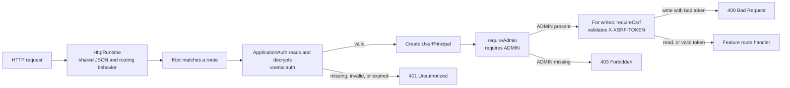

# Authentication and authorization

This guide explains how the Kotlin backend decides **who a caller is**, **what
that caller may do**, and **whether a state-changing request is safe to
process**. It is written for developers who are still learning Kotlin and Ktor.

Application-wide authentication lives in
[`shop.voenix.auth`](../../../backend/src/shop/voenix/auth). Shared HTTP runtime
behavior lives in
[`shop.voenix.http`](../../../backend/src/shop/voenix/http). Country routes use
those modules but do not implement their security behavior.

This separation is about code ownership. It did not change the public HTTP
contract, cookie format, session lifetime, role rule, CSRF behavior, or
configuration keys.

## Three terms that sound similar

- **Authentication** answers: "Who is making this request?" In this application,
  Ktor reads an encrypted session cookie and creates a `UserPrincipal`.
- **Authorization** answers: "May that user use this endpoint?" The current
  admin policy requires the exact role string `ADMIN`.
- **CSRF protection** answers: "Did the signed-in user intentionally make this
  state-changing request?" Admin writes require an additional token in a
  request header.

Authentication happens before authorization. CSRF protection is a separate
check after both of them.

## Important current limitation

The auth module can **validate and use** a `UserSession`, but it does not have a
production sign-in, sign-out, password, or user-management endpoint. It also
does not query a user database during authentication.

The `/test/sign-in` endpoints found in tests are test fixtures. They create a
session directly so a test can exercise protected routes. They are not
installed by [`Application.kt`](../../../backend/src/shop/voenix/Application.kt)
and must not be copied into production code.

This means the current module supplies the protected side of session
authentication. A complete production authentication flow still needs a
trusted component that verifies credentials and creates `UserSession` values.

## The five-minute mental model



Protected country routes perform checks in this order:

```text
valid route -> authenticated session -> ADMIN role -> CSRF for writes
            -> request parsing and validation -> country operation
```

Order matters. For example, an anonymous `POST` with an invalid body receives
`401 Unauthorized`; the application does not parse the protected body first.
A path such as `/api/admin/countries/not-a-number` does not match the numeric ID
route, so it receives `404 Not Found` before authentication runs.

## How startup is divided

Startup begins in
[`Application.module`](../../../backend/src/shop/voenix/Application.kt). It
loads database and auth settings, connects the database, and then installs
three separate concerns:

```kotlin
HttpRuntime.install(this)
ApplicationAuth.install(this, authSettings)
countryModule(database)
```

The order makes the ownership visible:

1. [`HttpRuntime`](../../../backend/src/shop/voenix/http/HttpRuntime.kt)
   installs application-wide content negotiation and optional-trailing-slash
   routing behavior.
2. [`ApplicationAuth`](../../../backend/src/shop/voenix/auth/ApplicationAuth.kt)
   installs sessions, authentication, renewal, and the antiforgery endpoint.
3. `countryModule` creates the country service and installs only country routes.

`countryModule` no longer accepts `AuthSettings` and does not install
application-wide Ktor plugins. A focused test application that uses protected
country routes installs `HttpRuntime` and `ApplicationAuth` explicitly before
installing the country module.

## The public auth interface

Protected features use the small interface on `ApplicationAuth`:

- `install(application, settings)` configures the application-wide auth
  runtime and the antiforgery endpoint;
- `PROVIDER` is the Ktor authentication-provider name used by
  `authenticate(...)`;
- `CSRF_HEADER` is the established `X-XSRF-TOKEN` header name;
- `requireAdmin(call)` enforces the application's exact `ADMIN` policy and
  writes the established `403` response when the role is missing; and
- `requireCsrf(call)` validates the user-bound token and writes the complete
  established `400 application/problem+json` response when validation fails.

The feature route does not decrypt cookies, inspect CSRF sessions, compare
tokens, or construct auth errors. Those details remain inside the auth module.

## How authentication is installed

`ApplicationAuth.install` adds four pieces of behavior:

1. `Sessions` reads and writes the authentication and CSRF cookies.
2. `Authentication` turns a valid `UserSession` into a `UserPrincipal`.
3. a sliding-renewal application plugin renews eligible active sessions; and
4. `GET /api/antiforgery/token` issues a CSRF token.

The names in this code are useful Ktor vocabulary:

- An **application plugin** adds behavior to Ktor's request pipeline.
- An **authentication provider** describes one authentication strategy. This
  provider remains named `voenix-session`.
- A **principal** is the validated identity made available to route handlers.

The auth module uses
[`caseInsensitiveRoute`](../../../backend/src/shop/voenix/http/CaseInsensitivePathRouteSelector.kt)
for its public token endpoint. That routing helper is shared HTTP behavior, so
auth does not depend on any feature package.

## The three authentication data classes

### `UserSession`: data stored in the auth cookie

[`UserSession.kt`](../../../backend/src/shop/voenix/auth/UserSession.kt)
contains:

```kotlin
@Serializable
data class UserSession(
    val userId: String,
    val roles: Set<String>,
    val issuedAtEpochSeconds: Long = Instant.now().epochSecond,
    val expiresAtEpochSeconds: Long = issuedAtEpochSeconds + 24L * 60L * 60L,
) {
    constructor(
        userId: String,
        role: String,
    ) : this(userId = userId, roles = setOf(role))
}
```

For a Kotlin beginner:

- `data class` is a class intended primarily to hold values. Kotlin generates
  helpers such as `copy`, value-based `equals`, and a readable `toString`.
- `val` makes each property read-only after construction.
- `Set<String>` stores unique role names.
- `@Serializable` allows the value to be converted to and from the cookie's
  serialized representation.
- The second `constructor` is a convenience overload for callers that have one
  role instead of a set of roles.
- Epoch seconds count seconds since 1970-01-01T00:00:00Z. They avoid local time
  zone ambiguity.

The primary constructor supplies a default `issuedAtEpochSeconds` of now and a
default `expiresAtEpochSeconds` of 24 hours later.

### `UserPrincipal`: identity available during a request

[`UserPrincipal.kt`](../../../backend/src/shop/voenix/auth/UserPrincipal.kt)
contains the same identity and lifetime values, but it has a different job. It
exists only after Ktor has accepted the session:

```kotlin
val principal = call.principal<UserPrincipal>()
```

Keeping `UserSession` and `UserPrincipal` separate makes an important boundary
visible: a cookie contains a **claim**, while a principal is the application's
**validated identity for this request**.

### `CsrfSession`: token and owning user

[`CsrfSession.kt`](../../../backend/src/shop/voenix/auth/CsrfSession.kt) stores:

```kotlin
data class CsrfSession(
    val token: String,
    val userId: String?,
)
```

The nullable type `String?` means that `userId` may be a string or `null`. It is
`null` when an anonymous caller requests a token.

## What happens to the auth cookie

The authentication cookie is named `voenix.auth`. On a protected request,
Ktor and `ApplicationAuth` perform the following work:

1. The Sessions plugin reads the cookie.
2. `SessionTransportTransformerEncrypt` verifies and decrypts its value with
   keys derived from `Auth.SessionSecret`.
3. Ktor deserializes the value as a `UserSession`.
4. The `voenix-session` provider checks
   `session.expiresAtEpochSeconds > now`.
5. A valid session is copied into a `UserPrincipal`.
6. An invalid, expired, or missing session triggers the provider's challenge.

The challenge returns `401 Unauthorized` with this shape:

```json
{
  "success": false,
  "message": "Authentication required",
  "code": null
}
```

The cookie is stored by value: identity, roles, and timestamps are inside the
encrypted and signed cookie rather than in a server-side session table.
Encryption prevents a caller from reading the values, while signing prevents a
caller from changing them without knowing the secret.

The encryption and signing key derivation remains compatible with cookies made
before auth moved out of the country package. Auth and CSRF use separate
cryptographic purposes, so a value created for one purpose cannot be reused for
the other.

## How authorization works

[`CountryRoutes.kt`](../../../backend/src/shop/voenix/country/CountryRoutes.kt)
wraps all admin routes with Ktor's authentication block:

```kotlin
authenticate(ApplicationAuth.PROVIDER) {
    caseInsensitiveRoute("/api/admin/countries") {
        // Protected handlers live here.
    }
}
```

This block proves only that there is a valid principal. Each admin handler then
applies the application-owned role policy:

```kotlin
if (!ApplicationAuth.requireAdmin(call)) return@get
```

`requireAdmin` checks whether the exact role `ADMIN` is in the principal's role
set. Role matching is case-sensitive: `ADMIN` works, but `admin` does not. A
user may have other roles as well; `{CUSTOMER, ADMIN}` is still authorized.

An authenticated user without `ADMIN` receives `403 Forbidden`:

```json
{
  "success": false,
  "message": "Admin access required",
  "code": null
}
```

The difference between the two errors is intentional:

| Status | Meaning |
| --- | --- |
| `401 Unauthorized` | The application could not authenticate the caller. |
| `403 Forbidden` | The caller is authenticated but lacks the required role. |

Despite its historical HTTP name, `401 Unauthorized` is the authentication
failure, while `403 Forbidden` is the authorization failure.

## Which routes require which checks

| Method and path | Session | `ADMIN` role | CSRF token | Owner |
| --- | --- | --- | --- | --- |
| `GET /api/countries` | No | No | No | Country |
| `GET /api/antiforgery/token` | No | No | No | Auth |
| `GET /api/admin/countries` | Yes | Yes | No | Country |
| `GET /api/admin/countries/{id}` | Yes | Yes | No | Country |
| `POST /api/admin/countries` | Yes | Yes | Yes | Country |
| `PUT /api/admin/countries/{id}` | Yes | Yes | Yes | Country |
| `DELETE /api/admin/countries/{id}` | Yes | Yes | Yes | Country |

The application treats reads as safe HTTP operations, so admin `GET` requests
do not need a CSRF token. Operations that create, change, or delete data do.

## How CSRF protection works

A browser automatically attaches matching cookies to requests. Without another
check, a malicious site could try to make a signed-in browser send an unwanted
write to this application. CSRF protection requires a secret value that the
malicious site cannot supply in a custom request header.

The client flow is:

1. Call `GET /api/antiforgery/token` after signing in.
2. Read `requestToken` from the JSON response.
3. Keep the cookies returned by the server.
4. Send the token in the `X-XSRF-TOKEN` header on an admin write.

An example response is:

```json
{
  "requestToken": "a-random-URL-safe-token"
}
```

An example write is:

```http
POST /api/admin/countries HTTP/1.1
Cookie: voenix.auth=...; XSRF-TOKEN=...
X-XSRF-TOKEN: a-random-URL-safe-token
Content-Type: application/json

{"name":"Denmark","countryCode":"DK"}
```

The auth-owned antiforgery endpoint generates 32 cryptographically random
bytes and encodes them as URL-safe Base64. It returns the token in JSON and
stores an encrypted `CsrfSession` in the `XSRF-TOKEN` cookie.

For a protected write, `ApplicationAuth.requireCsrf` requires all of the
following:

- an authenticated `UserPrincipal`;
- a readable `CsrfSession` cookie;
- the same user ID in the principal and CSRF session; and
- an `X-XSRF-TOKEN` header equal to the stored token.

The token bytes are compared with `MessageDigest.isEqual`, which avoids the
obvious timing differences of a character-by-character early-exit comparison.
A failed check returns `400 Bad Request` as `application/problem+json`.
`requireCsrf` writes that entire response itself, so feature routes cannot
accidentally create a different CSRF error contract.

The token is bound to a **user ID**, not to one particular authentication
cookie. Consequently:

- a token requested anonymously cannot be used after sign-in;
- switching from one user ID to another invalidates the previous token;
- signing in again as the same user ID does not invalidate it;
- requesting a replacement token invalidates the previous token; and
- the CSRF session has no independent timestamp.

Both auth and CSRF cookies are `HttpOnly`. Browser JavaScript therefore obtains
the CSRF token from the JSON response, not by reading the cookie.

## Cookie settings and session lifetime

[`SameAsRequestCookieTransport.kt`](../../../backend/src/shop/voenix/auth/SameAsRequestCookieTransport.kt)
applies the same transport settings to both cookies:

| Setting | Value | Why it matters |
| --- | --- | --- |
| Name | `voenix.auth` or `XSRF-TOKEN` | Separates authentication and CSRF state. |
| Path | `/` | Sends the cookie to every application route. |
| `HttpOnly` | `true` | Prevents browser JavaScript from reading it. |
| `SameSite` | `Lax` | Limits many cross-site cookie requests. |
| `Secure` | HTTPS requests only | Prevents sending the cookie over plain HTTP when Ktor sees HTTPS. |
| `Max-Age` / `Expires` | Not set | Makes it a browser-session cookie. |

`Secure` is selected from the request's origin scheme as seen by Ktor. Local
HTTP development therefore receives a non-secure cookie; production should use
HTTPS and must pass the correct request scheme to the application.

The absence of browser cookie expiration does not make an auth session valid
forever. The encrypted `UserSession` has its own server-checked expiry:

- a new session lasts 24 hours;
- after more than half of that lifetime has elapsed, any request carrying the
  still-valid session renews it for another 24 hours; and
- an expired session is rejected and is not renewed.

This is called a **sliding session**: continued activity moves the expiry time
forward. The renewal plugin is application-wide, so a request to a public route
can also renew a valid auth session.

Because roles are read from the cookie and are not reloaded from a database,
role changes and account revocation are not noticed during a session's
lifetime. The current code has no server-side session revocation list. Rotating
the session secret invalidates all existing cookies at once.

## Session-secret configuration

[`AuthSettings.kt`](../../../backend/src/shop/voenix/auth/AuthSettings.kt)
requires `Auth.SessionSecret` to contain at least 32 UTF-8 bytes. With ordinary
ASCII text, that means at least 32 characters. Startup fails if the setting is
missing, blank, or too short.

The application checks a secrets JSON file first. By default that file is
`/etc/secrets/appsettings.json`; `Secrets.AppSettingsPath` can select another
path. Its relevant structure is:

```json
{
  "Auth": {
    "SessionSecret": "replace-with-a-long-random-secret"
  }
}
```

If the file does not provide the setting, HOCON configuration falls back to
[`application.conf`](../../../backend/resources/application.conf), which
accepts this environment variable:

```text
AUTH_SESSION_SECRET
```

Use a cryptographically random production secret, keep it out of source
control and logs, and make it stable across application instances. All
instances need the same value to accept one another's cookies. Changing the
value deliberately signs every current user out because old cookies can no
longer be verified and decrypted.

The secret is used to derive keys; it is never sent to the browser.

## Adding another protected route

Install shared HTTP behavior and auth once during application composition.
Feature modules then apply the public auth interface at their routing boundary.

For an admin read, put the route inside the authentication block and check the
role before doing work:

```kotlin
authenticate(ApplicationAuth.PROVIDER) {
    get("/api/admin/example") {
        if (!ApplicationAuth.requireAdmin(call)) return@get

        call.respond(exampleService.load())
    }
}
```

For an admin write, add CSRF enforcement after the role check and before
reading the body or calling the service:

```kotlin
authenticate(ApplicationAuth.PROVIDER) {
    post("/api/admin/example") {
        if (!ApplicationAuth.requireAdmin(call)) return@post
        if (!ApplicationAuth.requireCsrf(call)) return@post

        // It is now appropriate to parse and process the protected request.
    }
}
```

`return@get` and `return@post` are **labelled returns**. They stop the current
route lambda after a guard has already written the error response. A plain
`return` cannot be used here because the handler is a lambda passed to Ktor.

Do not copy cookie, role, token, or problem-response logic into the feature.
If another real application policy is eventually needed, add an intentional
auth-owned operation rather than a feature-specific security helper.

## Shared HTTP behavior

[`HttpRuntime`](../../../backend/src/shop/voenix/http/HttpRuntime.kt) owns Ktor
behavior needed by more than one module:

- `IgnoreTrailingSlash`, which makes `/path` and `/path/` equivalent;
- JSON content negotiation with the application's existing JSON settings;
- `caseInsensitiveRoute`, which matches fixed path segments without regard to
  letter case;
- [`HttpProblemResponses.respond`](../../../backend/src/shop/voenix/http/HttpProblemResponses.kt),
  which writes the shared RFC-style problem shape; and
- [`Traceparent.continueOrCreate`](../../../backend/src/shop/voenix/http/Traceparent.kt),
  which continues a valid `traceparent` with a new span or creates a fresh one.

Auth uses these helpers for the antiforgery endpoint and CSRF rejection.
Country routes use them for route compatibility and HTTP parsing errors. The
shared package contains no country or auth policy.

## Tests that define the behavior

Auth behavior is tested through a small Ktor application rather than through a
country service stub:

| Test | Main responsibility |
| --- | --- |
| [`ApplicationAuthTest.kt`](../../../backend/test/shop/voenix/auth/ApplicationAuthTest.kt) | Authentication, exact admin policy, expiry, renewal, cookies, antiforgery issuance, identity binding, and CSRF problem responses |
| [`AuthCookieCompatibilityTest.kt`](../../../backend/test/shop/voenix/auth/AuthCookieCompatibilityTest.kt) | Preserving all serialized session field names and accepting a representative `voenix.auth` cookie created before the package extraction |
| [`AuthSettingsTest.kt`](../../../backend/test/shop/voenix/auth/AuthSettingsTest.kt) | Secrets-file precedence, HOCON fallback, missing and blank values, and the UTF-8 byte minimum |
| [`CountryRouteSecurityAndValidationTest.kt`](../../../backend/test/shop/voenix/country/CountryRouteSecurityAndValidationTest.kt) | Cross-module route matching and security-check ordering |
| [`CountryAdminCrudIntegrationTest.kt`](../../../backend/test/shop/voenix/country/CountryAdminCrudIntegrationTest.kt) | A complete authenticated and CSRF-protected country workflow against PostgreSQL |

The auth test application installs the same three layers explicitly:

```kotlin
HttpRuntime.install(this)
ApplicationAuth.install(this, AuthSettings("a-test-secret-at-least-32-bytes"))
routing {
    // Minimal public and protected test routes.
}
```

Its `/test/sign-in` route bypasses credential verification on purpose. The test
client installs `HttpCookies`, which acts like a small browser cookie jar and
returns cookies on later requests.

Run the backend quality gate from `backend/` with the repository's Kotlin
Toolchain:

```sh
./kotlin check
```

## File map

### Application composition

- [`Application.kt`](../../../backend/src/shop/voenix/Application.kt) loads
  settings and installs `HttpRuntime`, `ApplicationAuth`, and the country module
  as separate concerns.

### Authentication

- [`ApplicationAuth.kt`](../../../backend/src/shop/voenix/auth/ApplicationAuth.kt)
  configures sessions, authenticates cookies, checks the admin role, enforces
  CSRF, creates tokens, and renews sessions.
- [`AuthSettings.kt`](../../../backend/src/shop/voenix/auth/AuthSettings.kt)
  loads and validates the session secret.
- [`UserSession.kt`](../../../backend/src/shop/voenix/auth/UserSession.kt) is the
  serializable auth-cookie payload.
- [`UserPrincipal.kt`](../../../backend/src/shop/voenix/auth/UserPrincipal.kt)
  is the validated identity visible to a handler.
- [`CsrfSession.kt`](../../../backend/src/shop/voenix/auth/CsrfSession.kt) is the
  serializable CSRF-cookie payload.
- [`SameAsRequestCookieTransport.kt`](../../../backend/src/shop/voenix/auth/SameAsRequestCookieTransport.kt)
  defines cookie flags and request-aware `Secure` behavior.
- [`AuthResponse.kt`](../../../backend/src/shop/voenix/auth/AuthResponse.kt) and
  [`AntiforgeryTokenResponse.kt`](../../../backend/src/shop/voenix/auth/AntiforgeryTokenResponse.kt)
  define authentication and token response bodies.

### Shared HTTP runtime

- [`HttpRuntime.kt`](../../../backend/src/shop/voenix/http/HttpRuntime.kt)
  installs application-wide JSON and trailing-slash behavior.
- [`CaseInsensitivePathRouteSelector.kt`](../../../backend/src/shop/voenix/http/CaseInsensitivePathRouteSelector.kt)
  implements case-insensitive fixed paths.
- [`HttpProblemDetails.kt`](../../../backend/src/shop/voenix/http/HttpProblemDetails.kt),
  [`HttpProblemResponses.kt`](../../../backend/src/shop/voenix/http/HttpProblemResponses.kt),
  and [`Traceparent.kt`](../../../backend/src/shop/voenix/http/Traceparent.kt) provide the
  shared HTTP problem shape and trace IDs.

## Summary

The application trusts only encrypted, signed, non-expired session cookies. A
valid cookie becomes a `UserPrincipal`; each admin handler then requires the
exact `ADMIN` role. Admin writes additionally require a random CSRF token bound
to the same user ID. `ApplicationAuth` owns those rules and responses,
`HttpRuntime` owns common HTTP behavior, and feature packages consume their
small public interfaces. Credential verification, production sign-in/sign-out,
user lookup, and server-side revocation remain outside the current module.
