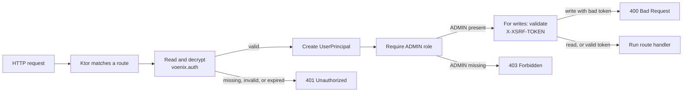

# Authentication and authorization

This guide explains how the Kotlin backend decides **who a caller is**, **what
that caller may do**, and **whether a state-changing request is safe to
process**. It is written for developers who are still learning Kotlin and Ktor.

The relevant production code lives mainly in
[`CountryAuth.kt`](../../backend/src/shop/voenix/country/CountryAuth.kt) and
[`CountryRoutes.kt`](../../backend/src/shop/voenix/country/CountryRoutes.kt).

## Three terms that sound similar

- **Authentication** answers: "Who is making this request?" In this application,
  Ktor reads an encrypted session cookie and creates a `UserPrincipal`.
- **Authorization** answers: "May that user use this endpoint?" The current
  admin endpoints require the exact role string `ADMIN`.
- **CSRF protection** answers: "Did the signed-in user intentionally make this
  state-changing request?" Admin writes require an additional token in a
  request header.

Authentication happens before authorization. CSRF protection is a separate
check after both of them.

## Important current limitation

The application can **validate and use** a `UserSession`, but it does not have a
production sign-in, sign-out, password, or user-management endpoint. It also
does not query a user database during authentication.

The `/test/sign-in` endpoints found in tests are test fixtures. They create a
session directly so a test can exercise protected routes. They are not
installed by [`Application.kt`](../../backend/src/shop/voenix/Application.kt)
and must not be copied into production code.

This means the current module supplies the protected side of session
authentication. A complete production authentication flow still needs a
trusted component that verifies credentials and creates `UserSession` values.

## The five-minute mental model



The protected country routes perform checks in this order:

```text
valid route → authenticated session → ADMIN role → CSRF for writes
            → request parsing and validation → country operation
```

Order matters. For example, an anonymous `POST` with an invalid body receives
`401 Unauthorized`; the application does not parse the protected body first.
A path such as `/api/admin/countries/not-a-number` does not match the numeric ID
route at all, so it receives `404 Not Found` before authentication runs.

## How authentication is installed

Startup begins in
[`Application.module`](../../backend/src/shop/voenix/Application.kt). It loads
`AuthSettings` and eventually calls:

```kotlin
CountryAuth.install(this, authSettings)
CountryRoutes.install(this, countries)
```

`CountryAuth.install` adds three Ktor features to the application:

1. `Sessions` knows how to read and write the authentication and CSRF cookies.
2. `Authentication` turns a valid `UserSession` into a `UserPrincipal`.
3. `SlidingSessionRenewal` renews an active authentication session after more
   than half of its lifetime has passed.

The names in this code are useful Ktor vocabulary:

- An **application plugin** adds behavior to Ktor's request pipeline.
- An **authentication provider** describes one authentication strategy. This
  provider is named `voenix-session`.
- A **principal** is the validated identity made available to route handlers.

## The three authentication data classes

### `UserSession`: data stored in the auth cookie

[`UserSession.kt`](../../backend/src/shop/voenix/country/UserSession.kt) contains:

```kotlin
@Serializable
data class UserSession(
    val userId: String,
    val roles: Set<String>,
    val issuedAtEpochSeconds: Long = Instant.now().epochSecond,
    val expiresAtEpochSeconds: Long = issuedAtEpochSeconds + 24L * 60L * 60L,
) {
    constructor(
        userId: String,
        role: String,
    ) : this(userId = userId, roles = setOf(role))
}
```

For a Kotlin beginner:

- `data class` is a class intended primarily to hold values. Kotlin generates
  helpers such as `copy`, value-based `equals`, and a readable `toString`.
- `val` makes each property read-only after construction.
- `Set<String>` stores unique role names.
- `@Serializable` allows the value to be converted to and from the cookie's
  serialized representation.
- The second `constructor` is a convenience overload for callers that have one
  role instead of a set of roles.
- Epoch seconds count seconds since 1970-01-01T00:00:00Z. They avoid local time
  zone ambiguity.

The primary constructor supplies a default `issuedAtEpochSeconds` of now and a
default `expiresAtEpochSeconds` of 24 hours later.

### `UserPrincipal`: identity available during a request

[`UserPrincipal.kt`](../../backend/src/shop/voenix/country/UserPrincipal.kt)
contains the same identity and lifetime values, but it has a different job. It
exists only after Ktor has accepted the session:

```kotlin
val principal = call.principal<UserPrincipal>()
```

Keeping `UserSession` and `UserPrincipal` separate makes an important boundary
visible: a cookie contains a **claim**, while a principal is the application's
**validated identity for this request**.

### `CsrfSession`: token and owning user

[`CsrfSession.kt`](../../backend/src/shop/voenix/country/CsrfSession.kt) stores:

```kotlin
data class CsrfSession(
    val token: String,
    val userId: String?,
)
```

The nullable type `String?` means that `userId` may be a string or `null`. It is
`null` when an anonymous caller requests a token.

## What happens to the auth cookie

The authentication cookie is named `voenix.auth`. On a protected request,
Ktor performs the following work:

1. The Sessions plugin reads the cookie.
2. `SessionTransportTransformerEncrypt` verifies and decrypts its value with
   keys derived from `Auth.SessionSecret`.
3. Ktor deserializes the value as a `UserSession`.
4. The `voenix-session` provider checks
   `session.expiresAtEpochSeconds > now`.
5. A valid session is copied into a `UserPrincipal`.
6. An invalid, expired, or missing session triggers the provider's challenge.

The challenge returns `401 Unauthorized` with this shape:

```json
{
  "success": false,
  "message": "Authentication required",
  "code": null
}
```

The cookie is stored by value: the identity, roles, and timestamps are inside
the encrypted and signed cookie rather than in a server-side session table.
Encryption prevents a caller from reading the values, while signing prevents a
caller from changing them without knowing the secret.

The code derives separate encryption and signing key material for the auth and
CSRF cookies. A value created for one purpose therefore cannot simply be used
for the other purpose.

## How authorization works

[`CountryRoutes.kt`](../../backend/src/shop/voenix/country/CountryRoutes.kt)
first wraps all admin routes with Ktor's authentication block:

```kotlin
authenticate(CountryAuth.PROVIDER) {
    caseInsensitiveRoute("/api/admin/countries") {
        // Protected handlers live here.
    }
}
```

This block proves only that there is a valid principal. Inside every admin
handler, the route then checks the role:

```kotlin
if (!CountryAuth.requireAdmin(call)) return@get
```

`requireAdmin` reads the principal and asks whether `ADMIN` is in its role set:

```kotlin
if (ADMIN_ROLE !in principal.roles) {
    // Respond with 403 and stop.
}
```

`!in` is Kotlin syntax for "is not contained in." Role matching is exact and
case-sensitive: `ADMIN` works, but `admin` does not. A user may have other roles
as well; `{CUSTOMER, ADMIN}` is still authorized.

An authenticated user without `ADMIN` receives `403 Forbidden`:

```json
{
  "success": false,
  "message": "Admin access required",
  "code": null
}
```

The difference between the two errors is intentional:

| Status | Meaning |
| --- | --- |
| `401 Unauthorized` | The application could not authenticate the caller. |
| `403 Forbidden` | The caller is authenticated but lacks the required role. |

Despite its historical HTTP name, `401 Unauthorized` is the authentication
failure, while `403 Forbidden` is the authorization failure.

## Which routes require which checks

| Method and path | Session | `ADMIN` role | CSRF token |
| --- | --- | --- | --- |
| `GET /api/countries` | No | No | No |
| `GET /api/antiforgery/token` | No | No | No |
| `GET /api/admin/countries` | Yes | Yes | No |
| `GET /api/admin/countries/{id}` | Yes | Yes | No |
| `POST /api/admin/countries` | Yes | Yes | Yes |
| `PUT /api/admin/countries/{id}` | Yes | Yes | Yes |
| `DELETE /api/admin/countries/{id}` | Yes | Yes | Yes |

The application treats reads as safe HTTP operations, so admin `GET` requests
do not need a CSRF token. Operations that create, change, or delete data do.

## How CSRF protection works

A browser automatically attaches matching cookies to requests. Without another
check, a malicious site could try to make a signed-in browser send an unwanted
write to this application. CSRF protection requires a secret value that the
malicious site cannot supply in a custom request header.

The client flow is:

1. Call `GET /api/antiforgery/token` after signing in.
2. Read `requestToken` from the JSON response.
3. Keep the cookies returned by the server.
4. Send the token in the `X-XSRF-TOKEN` header on an admin write.

An example response is:

```json
{
  "requestToken": "a-random-URL-safe-token"
}
```

An example write is:

```http
POST /api/admin/countries HTTP/1.1
Cookie: voenix.auth=...; XSRF-TOKEN=...
X-XSRF-TOKEN: a-random-URL-safe-token
Content-Type: application/json

{"name":"Denmark","countryCode":"DK"}
```

The antiforgery endpoint generates 32 cryptographically random bytes and
encodes them as URL-safe Base64. It returns the token in JSON and also stores an
encrypted `CsrfSession` in the `XSRF-TOKEN` cookie.

For a protected write, `hasValidCsrfToken` requires all of the following:

- an authenticated `UserPrincipal`;
- a readable `CsrfSession` cookie;
- the same user ID in the principal and CSRF session; and
- an `X-XSRF-TOKEN` header equal to the stored token.

The token bytes are compared with `MessageDigest.isEqual`, which avoids the
obvious timing differences of a character-by-character early-exit comparison.
A failed check returns `400 Bad Request` as `application/problem+json`.

The token is bound to a **user ID**, not to one particular authentication
cookie. Consequently:

- a token requested anonymously cannot be used after sign-in;
- switching from one user ID to another invalidates the previous token;
- signing in again as the same user ID does not invalidate it; and
- the CSRF session has no independent timestamp. A new call to the token
  endpoint replaces it with a newly generated token.

Both auth and CSRF cookies are `HttpOnly`. Browser JavaScript therefore obtains
the CSRF token from the JSON response, not by reading the cookie.

## Cookie settings and session lifetime

[`SameAsRequestCookieTransport.kt`](../../backend/src/shop/voenix/country/SameAsRequestCookieTransport.kt)
applies the same transport settings to both cookies:

| Setting | Value | Why it matters |
| --- | --- | --- |
| Name | `voenix.auth` or `XSRF-TOKEN` | Separates authentication and CSRF state. |
| Path | `/` | Sends the cookie to every application route. |
| `HttpOnly` | `true` | Prevents browser JavaScript from reading it. |
| `SameSite` | `Lax` | Limits many cross-site cookie requests. |
| `Secure` | HTTPS requests only | Prevents sending the cookie over plain HTTP when Ktor sees HTTPS. |
| `Max-Age` / `Expires` | Not set | Makes it a browser-session cookie. |

`Secure` is selected from the request's origin scheme as seen by Ktor. Local
HTTP development therefore receives a non-secure cookie; production should use
HTTPS and must pass the correct request scheme to the application.

The absence of browser cookie expiration does not make an auth session valid
forever. The encrypted `UserSession` has its own server-checked expiry:

- a new session lasts 24 hours;
- after more than half of that lifetime has elapsed, any request carrying the
  still-valid session renews it for another 24 hours; and
- an expired session is rejected and is not renewed.

This is called a **sliding session**: continued activity moves the expiry time
forward. The renewal plugin is installed application-wide, so a request to a
public route can also renew a valid auth session.

Because roles are read from the cookie and are not reloaded from a database,
role changes and account revocation are not noticed during a session's
lifetime. The current code has no server-side session revocation list. Rotating
the session secret invalidates all existing cookies at once.

## Session-secret configuration

[`AuthSettings.kt`](../../backend/src/shop/voenix/country/AuthSettings.kt)
requires `Auth.SessionSecret` to contain at least 32 UTF-8 bytes. With ordinary
ASCII text, that means at least 32 characters. Startup fails if the setting is
missing or too short.

The application checks a secrets JSON file first. By default that file is
`/etc/secrets/appsettings.json`; `Secrets.AppSettingsPath` can select another
path. Its relevant structure is:

```json
{
  "Auth": {
    "SessionSecret": "replace-with-a-long-random-secret"
  }
}
```

If the file does not provide the setting, HOCON configuration falls back to
[`application.conf`](../../backend/resources/application.conf), which accepts
either environment variable:

```text
AUTH_SESSION_SECRET
Auth__SessionSecret
```

Use a cryptographically random production secret, keep it out of source
control and logs, and make it stable across application instances. All
instances need the same value to accept one another's cookies. Changing the
value deliberately signs every current user out because old cookies can no
longer be verified and decrypted.

The secret is used to derive keys; it is never sent to the browser.

## Adding another protected route

For an admin read, put the route inside the authentication block and check the
role before doing work:

```kotlin
authenticate(CountryAuth.PROVIDER) {
    get("/api/admin/example") {
        if (!CountryAuth.requireAdmin(call)) return@get

        call.respond(exampleService.load())
    }
}
```

For an admin write inside `CountryRoutes`, use the same authentication wrapper
and add CSRF validation after the role check and before reading the body or
calling the service:

```kotlin
authenticate(CountryAuth.PROVIDER) {
    post("/api/admin/example") {
        if (!CountryAuth.requireAdmin(call)) return@post
        if (!call.requireCsrfToken()) return@post

        // It is now appropriate to parse and process the protected request.
    }
}
```

`return@get` and `return@post` are **labelled returns**. They stop the current
route lambda after a helper has already written the error response. A plain
`return` cannot be used here because the handler is a lambda passed to Ktor.

In the current code, `requireCsrfToken` is private to `CountryRoutes`. A route
in a different object cannot call it directly; shared protection should be
moved behind an intentional common API rather than duplicated.

## Tests that define the behavior

The clearest executable examples are:

- [`CountryAdminAuthorizationTest.kt`](../../backend/test/shop/voenix/country/CountryAdminAuthorizationTest.kt)
  covers anonymous, non-admin, admin, expired, renewed, HTTP, and HTTPS
  sessions.
- [`CountryRouteSecurityAndValidationTest.kt`](../../backend/test/shop/voenix/country/CountryRouteSecurityAndValidationTest.kt)
  covers check ordering, CSRF failures, and user-bound tokens.
- [`CountryAdminCrudIntegrationTest.kt`](../../backend/test/shop/voenix/country/CountryAdminCrudIntegrationTest.kt)
  follows a complete authenticated and CSRF-protected admin workflow against
  PostgreSQL.

Tests install a route like this:

```kotlin
post("/test/sign-in") {
    call.sessions.set(UserSession(userId = "11", role = "ADMIN"))
    call.respond(HttpStatusCode.OK)
}
```

This bypasses credential verification on purpose. The test client installs
`HttpCookies`, which acts like a small browser cookie jar and automatically
returns cookies on later requests.

Run the backend quality gate from `backend/` with the repository's Kotlin
toolchain:

```sh
./kotlin check
```

## File map

- [`Application.kt`](../../backend/src/shop/voenix/Application.kt) loads auth
  settings and installs auth before country routes.
- [`AuthSettings.kt`](../../backend/src/shop/voenix/country/AuthSettings.kt)
  loads and validates the session secret.
- [`CountryAuth.kt`](../../backend/src/shop/voenix/country/CountryAuth.kt)
  configures sessions, authenticates cookies, checks the admin role, creates
  CSRF tokens, and renews sessions.
- [`CountryRoutes.kt`](../../backend/src/shop/voenix/country/CountryRoutes.kt)
  applies authentication, authorization, and CSRF checks to endpoints.
- [`UserSession.kt`](../../backend/src/shop/voenix/country/UserSession.kt) is the
  serializable auth-cookie payload.
- [`UserPrincipal.kt`](../../backend/src/shop/voenix/country/UserPrincipal.kt)
  is the validated identity visible to a handler.
- [`CsrfSession.kt`](../../backend/src/shop/voenix/country/CsrfSession.kt) is the
  serializable CSRF-cookie payload.
- [`SameAsRequestCookieTransport.kt`](../../backend/src/shop/voenix/country/SameAsRequestCookieTransport.kt)
  defines cookie flags and request-aware `Secure` behavior.
- [`AuthResponse.kt`](../../backend/src/shop/voenix/country/AuthResponse.kt) and
  [`AntiforgeryTokenResponse.kt`](../../backend/src/shop/voenix/country/AntiforgeryTokenResponse.kt)
  define the authentication and token response bodies.

## Summary

The application trusts only encrypted, signed, non-expired session cookies. A
valid cookie becomes a `UserPrincipal`; each admin handler then requires the
exact `ADMIN` role. Admin writes additionally require a random CSRF token bound
to the same user ID. These checks protect the existing country endpoints, but
credential verification, production sign-in/sign-out, user lookup, and
server-side revocation are outside the current module.
