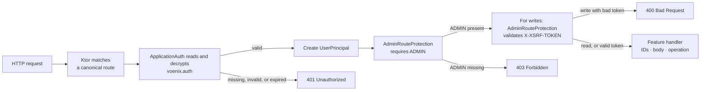

# Authentication and authorization

This guide explains how the Kotlin backend decides **who a caller is**, **what
that caller may do**, and **whether a state-changing request is safe to
process**. It is written for developers who are still learning Kotlin and Ktor.

Application-wide authentication lives in
[`shop.voenix.auth`](../../../backend/modules/platform/src/shop/voenix/auth). Shared JSON and
exception-to-response behavior lives in
[`shop.voenix.http`](../../../backend/modules/platform/src/shop/voenix/http). Feature routes use
those modules but do not implement their security behavior.

The current HTTP runtime uses normal canonical Ktor routes and a small shared
JSON error for CSRF failures. The auth cookie format, session lifetime, exact
role rule, token checks, cookie flags, key derivation, and configuration keys
remain unchanged.

## Three terms that sound similar

- **Authentication** answers: "Who is making this request?" Ktor reads an
  encrypted session cookie and creates a `UserPrincipal`.
- **Authorization** answers: "May that user use this endpoint?" The current
  admin policy requires the exact role string `ADMIN`.
- **CSRF protection** answers: "Did the signed-in user intentionally make this
  state-changing request?" Admin writes require an additional token in a
  request header.

Authentication happens before authorization. CSRF protection is a separate
check after both of them.

## Important current limitation

The auth module can **validate and use** a `UserSession`, but it does not have a
production sign-in, sign-out, password, or user-management endpoint. It also
does not query a user database during authentication.

The `/test/sign-in` endpoints found in tests are fixtures. They create a session
directly so a test can exercise protected routes. They are not installed by
[`Application.kt`](../../../backend/app/src/shop/voenix/Application.kt) and must not
be copied into production code.

The module therefore supplies the protected side of session authentication. A
complete production sign-in flow still needs a trusted component that verifies
credentials and creates `UserSession` values.

## The five-minute mental model



For a matched protected feature write, the detailed order is:

```text
authenticated session -> ADMIN role -> CSRF -> path-value conversion
                      -> JSON binding -> RequestValidation -> operation
```

Steps that do not apply are skipped. A create has no ID to convert, and an admin
read has no CSRF or request body.

Order matters. An anonymous `POST` with invalid JSON receives `401`; the body is
not bound first. The ordinary `/{id}` route matches a value such as
`not-a-number`, so authentication and role checks run before the feature
converts it to `Long`. An admin then receives `400 Invalid country id` without a
country operation running.

A non-canonical path does not match a route at all. Paths are case-sensitive and
an extra trailing slash is not accepted.

## How startup is divided

Startup begins in
[`Application.module`](../../../backend/app/src/shop/voenix/Application.kt). It
loads database and auth settings, connects the database, and installs three
separate concerns:

```kotlin
installHttpRuntime()
install(RequestValidation) {
    validateCountryRequests()
    validateVatRequests()
    validateSupplierRequests()
    validatePricingRequests()
}
ApplicationAuth.install(this, authSettings)
val countries = installCountryFeature(database)
val vats = installVatFeature(database)
installSupplierFeature(database, countries)
installPricingFeature(database, vats)
```

The ownership is visible in that order:

1. [`HttpRuntime`](../../../backend/modules/platform/src/shop/voenix/http/HttpRuntime.kt)
   installs application-wide JSON Content Negotiation and `StatusPages`.
2. [`ApplicationAuth`](../../../backend/modules/platform/src/shop/voenix/auth/ApplicationAuth.kt)
   installs sessions, authentication, renewal, and the antiforgery endpoint.
3. The feature installation functions create their internal services and
   install only their feature routes. Country and VAT return narrow reader
   capabilities that the app passes to Supplier and Pricing.

A focused test application that uses protected feature routes installs
`HttpRuntime` and `ApplicationAuth` explicitly before installing the feature.

## The public auth interface

Protected features use the small auth-owned routing interface:

- `install(application, settings)` configures the application-wide auth runtime
  and antiforgery endpoint;
- `PROVIDER` is the Ktor authentication-provider name used by
  `authenticate(...)`;
- `CSRF_HEADER` is the established `X-XSRF-TOKEN` header name;
- [`AdminRouteProtection`](../../../backend/modules/platform/src/shop/voenix/auth/AdminRouteProtection.kt)
  is installed on an authenticated admin route. It enforces the exact `ADMIN`
  policy and automatically validates CSRF for `POST`, `PUT`, `PATCH`, and
  `DELETE` requests.

Feature code does not decrypt cookies, inspect CSRF sessions, compare tokens, or
construct auth rejection payloads. It also does not repeat security guards in
each handler. Those details stay inside the auth module.

## How authentication is installed

`ApplicationAuth.install` adds four pieces of behavior:

1. `Sessions` reads and writes the authentication and CSRF cookies.
2. `Authentication` turns a valid `UserSession` into a `UserPrincipal`.
3. A sliding-renewal application plugin renews eligible active sessions.
4. `GET /api/antiforgery/token` issues a CSRF token.

The names in this code are useful Ktor vocabulary:

- An **application plugin** adds behavior to Ktor's request pipeline.
- An **authentication provider** describes one authentication strategy. This
  provider is named `voenix-session`.
- A **principal** is the validated identity available to route handlers.

The antiforgery endpoint is a normal Ktor `get` route:

```kotlin
routing {
    get("/api/antiforgery/token") {
        // Create and return a token.
    }
}
```

Only that exact canonical path is supported. For example,
`/API/ANTIFORGERY/TOKEN` and `/api/antiforgery/token/` do not match.

## The three authentication data classes

### `UserSession`: data stored in the auth cookie

[`UserSession.kt`](../../../backend/modules/platform/src/shop/voenix/auth/UserSession.kt) contains:

```kotlin
@Serializable
data class UserSession(
    val userId: String,
    val roles: Set<String>,
    val issuedAtEpochSeconds: Long = Instant.now().epochSecond,
    val expiresAtEpochSeconds: Long = issuedAtEpochSeconds + 24L * 60L * 60L,
) {
    constructor(
        userId: String,
        role: String,
    ) : this(userId = userId, roles = setOf(role))
}
```

For a Kotlin beginner:

- `data class` is intended primarily to hold values. Kotlin generates helpers
  such as `copy`, value-based `equals`, and a readable `toString`.
- `val` makes a property read-only after construction.
- `Set<String>` stores unique role names.
- `@Serializable` allows the value to be converted to and from the cookie's
  serialized representation.
- The second `constructor` is a convenience overload for callers with one role.
- Epoch seconds count seconds since 1970-01-01T00:00:00Z and avoid local-time
  ambiguity.

The primary constructor defaults `issuedAtEpochSeconds` to now and
`expiresAtEpochSeconds` to 24 hours later.

### `UserPrincipal`: identity for one request

[`UserPrincipal.kt`](../../../backend/modules/platform/src/shop/voenix/auth/UserPrincipal.kt)
contains the same identity and lifetime values, but it has a different job. It
exists only after Ktor has accepted the session:

```kotlin
val principal = call.principal<UserPrincipal>()
```

Keeping `UserSession` and `UserPrincipal` separate makes a useful boundary
visible: a cookie contains a **claim**, while a principal is the application's
**validated identity for this request**.

### `CsrfSession`: token and owning user

[`CsrfSession.kt`](../../../backend/modules/platform/src/shop/voenix/auth/CsrfSession.kt) stores:

```kotlin
data class CsrfSession(
    val token: String,
    val userId: String?,
)
```

The nullable type `String?` means `userId` may be a string or `null`. It is
`null` when an anonymous caller requests a token.

## What happens to the auth cookie

The authentication cookie is named `voenix.auth`. On a protected request, Ktor
and `ApplicationAuth` perform these steps:

1. The Sessions plugin reads the cookie.
2. `SessionTransportTransformerEncrypt` verifies and decrypts its value with
   keys derived from `Auth.SessionSecret`.
3. Ktor deserializes the value as a `UserSession`.
4. The `voenix-session` provider checks
   `session.expiresAtEpochSeconds > now`.
5. A valid session is copied into a `UserPrincipal`.
6. An invalid, expired, or missing session triggers the provider's challenge.

The challenge retains the established `401 Unauthorized` `AuthResponse`:

```json
{
  "success": false,
  "message": "Authentication required",
  "code": null
}
```

The cookie is stored by value: identity, roles, and timestamps are inside the
encrypted and signed cookie rather than in a server-side session table.
Encryption prevents a caller from reading its values. Signing prevents a caller
from changing them without knowing the secret.

Encryption and signing key derivation remains compatible with auth cookies
created before authentication was extracted into its own package. Auth and CSRF
use separate cryptographic purposes, so a value created for one purpose cannot
be reused for the other.

## How authorization works

A feature wraps protected routes with Ktor's authentication block:

```kotlin
authenticate(ApplicationAuth.PROVIDER) {
    route("/api/admin/countries") {
        install(AdminRouteProtection)

        // Protected handlers live here.
    }
}
```

The `authenticate` block proves that there is a valid principal.
`AdminRouteProtection` then runs after authentication and before any handler.
It checks whether the exact role `ADMIN` is in the principal's role set.
Matching is case-sensitive: `ADMIN` works, but `admin` does not. A user may have
other roles as well; `{CUSTOMER, ADMIN}` is authorized.

Installing the protection once on the parent route protects every child route.
This is safer than relying on every handler author to remember the same guard.
If the expected principal is unexpectedly absent, the plugin fails closed with
the established `401` response. The `authenticate` block is still required: it
validates the configured session and creates that principal.

An authenticated user without `ADMIN` retains the established `403 Forbidden`
`AuthResponse`:

```json
{
  "success": false,
  "message": "Admin access required",
  "code": null
}
```

| Status | Meaning |
| --- | --- |
| `401 Unauthorized` | The application could not authenticate the caller. |
| `403 Forbidden` | The caller is authenticated but lacks the required role. |

Despite its historical HTTP name, `401 Unauthorized` is the authentication
failure, while `403 Forbidden` is the authorization failure.

## Which routes require which checks

| Method and path | Session | `ADMIN` role | CSRF token | Owner |
| --- | --- | --- | --- | --- |
| `GET /api/countries` | No | No | No | Country |
| `GET /api/antiforgery/token` | No | No | No | Auth |
| `GET /api/admin/countries` | Yes | Yes | No | Country |
| `GET /api/admin/countries/{id}` | Yes | Yes | No | Country |
| `POST /api/admin/countries` | Yes | Yes | Yes | Country |
| `PUT /api/admin/countries/{id}` | Yes | Yes | Yes | Country |
| `DELETE /api/admin/countries/{id}` | Yes | Yes | Yes | Country |
| `GET /api/admin/vat` | Yes | Yes | No | VAT |
| `GET /api/admin/vat/{id}` | Yes | Yes | No | VAT |
| `POST /api/admin/vat` | Yes | Yes | Yes | VAT |
| `PUT /api/admin/vat/{id}` | Yes | Yes | Yes | VAT |
| `DELETE /api/admin/vat/{id}` | Yes | Yes | Yes | VAT |
| `GET /api/admin/suppliers` | Yes | Yes | No | Supplier |
| `GET /api/admin/suppliers/{id}` | Yes | Yes | No | Supplier |
| `POST /api/admin/suppliers` | Yes | Yes | Yes | Supplier |
| `PUT /api/admin/suppliers/{id}` | Yes | Yes | Yes | Supplier |
| `DELETE /api/admin/suppliers/{id}` | Yes | Yes | Yes | Supplier |

Reads are treated as safe HTTP operations, so admin `GET` requests do not need
a CSRF token. Operations that create, change, or delete data do.

## How CSRF protection works

A browser automatically attaches matching cookies to requests. Without another
check, a malicious site could try to make a signed-in browser send an unwanted
write. CSRF protection requires a secret value that the malicious site cannot
supply in a custom request header.

The client flow is:

1. Call `GET /api/antiforgery/token` after signing in.
2. Read `requestToken` from the JSON response.
3. Keep the cookies returned by the server.
4. Send the token in the `X-XSRF-TOKEN` header on an admin write.

An example token response is:

```json
{
  "requestToken": "a-random-URL-safe-token"
}
```

An example write is:

```http
POST /api/admin/countries HTTP/1.1
Cookie: voenix.auth=...; XSRF-TOKEN=...
X-XSRF-TOKEN: a-random-URL-safe-token
Content-Type: application/json

{"name":"Denmark","countryCode":"DK"}
```

The antiforgery endpoint generates 32 cryptographically random bytes and
encodes them as URL-safe Base64. It returns the token in JSON and stores an
encrypted `CsrfSession` in the `XSRF-TOKEN` cookie.

For a protected write, `AdminRouteProtection` requires all of these:

- an authenticated `UserPrincipal`;
- a readable `CsrfSession` cookie;
- the same user ID in the principal and CSRF session; and
- an `X-XSRF-TOKEN` header equal to the stored token.

The token bytes are compared with `MessageDigest.isEqual`, which avoids the
obvious timing differences of a character-by-character early-exit comparison.

A failed check returns `400 Bad Request` as `application/json` using the shared
[`ApiError`](../../../backend/modules/platform/src/shop/voenix/http/ApiError.kt):

```json
{
  "message": "Invalid CSRF token",
  "errors": {}
}
```

The response is deliberately small and contains no internal exception or
request-tracing fields. The auth module writes the entire response, so feature
routes cannot accidentally create a different CSRF contract.

The token is bound to a **user ID**, not to one particular authentication
cookie. Consequently:

- a token requested anonymously cannot be used after sign-in;
- switching from one user ID to another invalidates the previous token;
- signing in again as the same user ID does not invalidate it;
- requesting a replacement token invalidates the previous token; and
- the CSRF session has no independent timestamp.

Both auth and CSRF cookies are `HttpOnly`. Browser JavaScript therefore obtains
the CSRF token from the JSON response, not by reading the cookie.

## Cookie settings and session lifetime

[`SameAsRequestCookieTransport.kt`](../../../backend/modules/platform/src/shop/voenix/auth/SameAsRequestCookieTransport.kt)
applies the same transport settings to both cookies:

| Setting | Value | Why it matters |
| --- | --- | --- |
| Name | `voenix.auth` or `XSRF-TOKEN` | Separates authentication and CSRF state. |
| Path | `/` | Sends the cookie to every application route. |
| `HttpOnly` | `true` | Prevents browser JavaScript from reading it. |
| `SameSite` | `Lax` | Limits many cross-site cookie requests. |
| `Secure` | HTTPS requests only | Prevents sending the cookie over plain HTTP when Ktor sees HTTPS. |
| `Max-Age` / `Expires` | Not set | Makes it a browser-session cookie. |

`Secure` is selected from the request's origin scheme as seen by Ktor. Local
HTTP development receives a non-secure cookie; production should use HTTPS and
must pass the correct request scheme to the application.

The absence of browser cookie expiration does not make an auth session valid
forever. The encrypted `UserSession` has its own server-checked expiry:

- a new session lasts 24 hours;
- after more than half of that lifetime has elapsed, any request carrying the
  still-valid session renews it for another 24 hours; and
- an expired session is rejected and is not renewed.

This is a **sliding session**: continued activity moves the expiry forward. The
renewal plugin is application-wide, so a public request can also renew a valid
auth session.

Because roles are read from the cookie and are not reloaded from a database,
role changes and account revocation are not noticed during a session's
lifetime. There is no server-side session revocation list. Rotating the session
secret invalidates every existing cookie at once.

## Session-secret configuration

[`AuthSettings.kt`](../../../backend/modules/platform/src/shop/voenix/auth/AuthSettings.kt)
requires `Auth.SessionSecret` to contain at least 32 UTF-8 bytes. With ordinary
ASCII text, that means at least 32 characters. Startup fails when the setting is
missing, blank, or too short.

[`application.yaml`](../../../backend/app/resources/application.yaml) maps the
setting to this environment variable:

```text
AUTH_SESSION_SECRET
```

Use a cryptographically random production secret, keep it out of source control
and logs, and keep it stable across application instances. All instances need
the same value to accept one another's cookies. Changing it deliberately signs
every current user out because old cookies can no longer be verified and
decrypted.

The secret is used to derive keys; it is never sent to the browser.

## Adding another protected route

Install shared HTTP behavior and auth once during application composition.
Feature modules then apply the auth interface at their routing boundary.

Put related admin routes below one authenticated parent route and install
`AdminRouteProtection` on that parent:

```kotlin
authenticate(ApplicationAuth.PROVIDER) {
    route("/api/admin/example") {
        install(AdminRouteProtection)

        get {
            call.respond(exampleService.load())
        }

        post {
            val input = call.receive<ExampleInput>()
            call.respond(exampleService.create(input))
        }
    }
}
```

The plugin always checks the role. It checks CSRF automatically for `POST`,
`PUT`, `PATCH`, and `DELETE`, before a handler binds a body or calls a service.
Safe `GET` requests do not need a CSRF token.

Declare one canonical route. Do not copy cookie, role, token, or error-response
logic into the feature. Do not call the plugin's internal guards from feature
handlers. If another real application policy is needed, add an intentional
auth-owned route plugin.

## Shared HTTP behavior

[`HttpRuntime`](../../../backend/modules/platform/src/shop/voenix/http/HttpRuntime.kt) installs
two application-wide Ktor plugins:

1. **Content Negotiation** converts serializable values to and from
   `application/json`. Shared kotlinx.serialization settings include explicit
   nulls, encoded defaults, and ignored unknown input properties.
2. **StatusPages** converts common binding exceptions to the shared `ApiError`:
   unsupported media is `415`, invalid request bodies are `400`, and an
   unexpected exception is a logged generic `500`.

The final exception handler always rethrows `CancellationException`, because
coroutine cancellation must not become an HTTP response.

`HttpRuntime` does not change Ktor path matching. Feature and auth modules use
normal case-sensitive routes without optional trailing slashes.

The `ApiError` shape is shared by CSRF and feature HTTP errors. Authentication
and role failures keep `AuthResponse` because those existing client-facing
contracts were not changed.

## Tests that define the behavior

Auth behavior is tested through a small Ktor application rather than through a
country service stub:

| Test | Main responsibility |
| --- | --- |
| [`ApplicationAuthTest.kt`](../../../backend/modules/platform/test/shop/voenix/auth/ApplicationAuthTest.kt) | Authentication, exact admin policy, expiry, renewal, cookies, canonical antiforgery issuance, identity binding, and the CSRF `ApiError` |
| [`AuthCookieCompatibilityTest.kt`](../../../backend/modules/platform/test/shop/voenix/auth/AuthCookieCompatibilityTest.kt) | Preserving serialized session field names and accepting a representative `voenix.auth` cookie created before the auth package extraction |
| [`AuthSettingsTest.kt`](../../../backend/modules/platform/test/shop/voenix/auth/AuthSettingsTest.kt) | Application configuration, missing and blank values, and the UTF-8 byte minimum |
| [`CountryRouteSecurityAndValidationTest.kt`](../../../backend/modules/country/test/shop/voenix/country/CountryRouteSecurityAndValidationTest.kt) | Cross-module security ordering, canonical country routes, ID conversion, body binding, and request validation |
| [`CountryAdminCrudIntegrationTest.kt`](../../../backend/modules/country/test/shop/voenix/country/CountryAdminCrudIntegrationTest.kt) | A complete authenticated and CSRF-protected country workflow against PostgreSQL |
| [`VatRouteSecurityAndValidationTest.kt`](../../../backend/modules/vat/test/shop/voenix/vat/VatRouteSecurityAndValidationTest.kt) | VAT route-subtree protection, CSRF ordering, and validation before feature calls |
| [`VatAdminCrudIntegrationTest.kt`](../../../backend/modules/vat/test/shop/voenix/vat/VatAdminCrudIntegrationTest.kt) | A complete authenticated and CSRF-protected VAT workflow against PostgreSQL |
| [`SupplierRouteSecurityAndValidationTest.kt`](../../../backend/modules/supplier/test/shop/voenix/supplier/SupplierRouteSecurityAndValidationTest.kt) | Supplier route-subtree protection, security ordering, ID conversion, binding, and validation before feature calls |
| [`SupplierAdminCrudIntegrationTest.kt`](../../../backend/modules/supplier/test/shop/voenix/supplier/SupplierAdminCrudIntegrationTest.kt) | A complete authenticated and CSRF-protected Supplier workflow against PostgreSQL |

The auth test application installs the same shared layers explicitly:

```kotlin
installHttpRuntime()
ApplicationAuth.install(this, AuthSettings("a-test-secret-at-least-32-bytes"))
routing {
    // Minimal public and protected test routes.
}
```

Its `/test/sign-in` route bypasses credential verification on purpose. The test
client installs `HttpCookies`, which acts like a small browser cookie jar and
returns cookies on later requests.

Run the backend quality gate from `backend/`:

```sh
./kotlin check
```

## File map

### Application composition

- [`Application.kt`](../../../backend/app/src/shop/voenix/Application.kt) loads
  settings and installs `HttpRuntime`, `ApplicationAuth`, and feature modules as
  separate concerns.

### Authentication

- [`ApplicationAuth.kt`](../../../backend/modules/platform/src/shop/voenix/auth/ApplicationAuth.kt)
  configures sessions, authenticates cookies, checks the admin role, enforces
  CSRF, creates tokens, and renews sessions.
- [`AuthSettings.kt`](../../../backend/modules/platform/src/shop/voenix/auth/AuthSettings.kt)
  loads and validates the session secret.
- [`UserSession.kt`](../../../backend/modules/platform/src/shop/voenix/auth/UserSession.kt) is the
  serializable auth-cookie payload.
- [`UserPrincipal.kt`](../../../backend/modules/platform/src/shop/voenix/auth/UserPrincipal.kt) is
  the validated identity visible to a handler.
- [`CsrfSession.kt`](../../../backend/modules/platform/src/shop/voenix/auth/CsrfSession.kt) is the
  serializable CSRF-cookie payload.
- [`SameAsRequestCookieTransport.kt`](../../../backend/modules/platform/src/shop/voenix/auth/SameAsRequestCookieTransport.kt)
  defines cookie flags and request-aware `Secure` behavior.
- [`AuthResponse.kt`](../../../backend/modules/platform/src/shop/voenix/auth/AuthResponse.kt)
  defines the unchanged `401` and `403` bodies.
- [`AntiforgeryTokenResponse.kt`](../../../backend/modules/platform/src/shop/voenix/auth/AntiforgeryTokenResponse.kt)
  defines the token response.

### Shared HTTP runtime

- [`HttpRuntime.kt`](../../../backend/modules/platform/src/shop/voenix/http/HttpRuntime.kt)
  installs Content Negotiation and `StatusPages`.
- [`ApiError.kt`](../../../backend/modules/platform/src/shop/voenix/http/ApiError.kt) defines the
  small JSON error used by CSRF, request binding, and feature routes.

## Summary

The application trusts only encrypted, signed, non-expired session cookies. A
valid cookie becomes a `UserPrincipal`; every admin handler then requires the
exact `ADMIN` role. Admin writes additionally require a random CSRF token bound
to the same user ID. `ApplicationAuth` owns those rules and their responses,
while `HttpRuntime` owns JSON conversion and shared exception mapping. Feature
packages use those small interfaces and declare normal canonical Ktor routes.

Credential verification, production sign-in and sign-out, user lookup, and
server-side revocation remain outside the current module.
