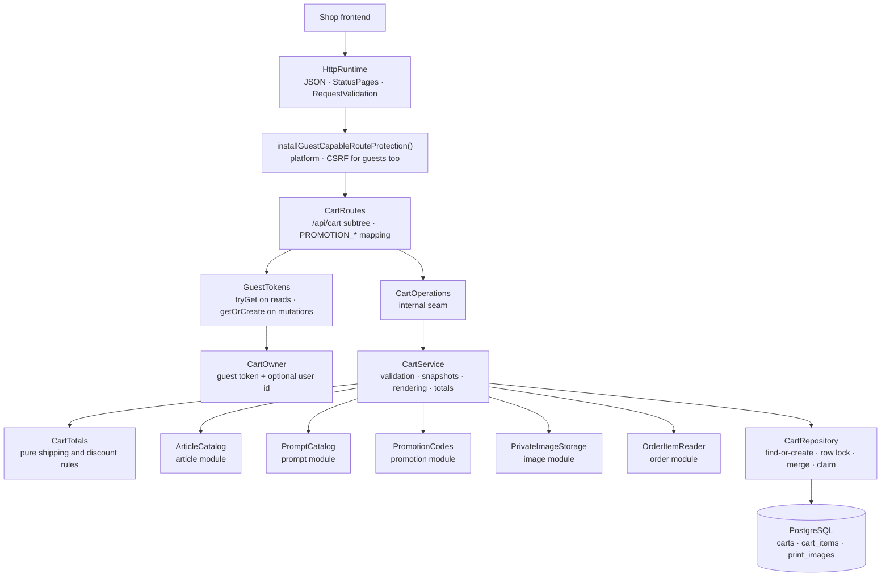

# Backend Cart package

This guide explains the Kotlin code in
[`backend/modules/cart/src/shop/voenix/cart`](../../../backend/modules/cart/src/shop/voenix/cart).

## What this package does

A visitor of the shop picks a mug, optionally a generation prompt, uploads the
image that is to be printed on it, and puts all of that into a cart. The cart
package owns that cart: the lines with the prices they were quoted at, the
uploaded print images, the coupon code the cart carries, and the totals a
checkout will later charge.

Two things make it different from the packages migrated before it:

- **Most of its callers are anonymous.** A customer fills a cart long before
  they have an account. The identity of a cart is therefore the guest session
  token from the encrypted `voenix.guest` cookie, not a user id.
- **It is the first consumer of three capabilities.** Article, Prompt, and
  Promotion each exported a capability that nothing bound yet. The cart binds
  all three, Image's private storage on top, and — since the Order migration —
  the order module's `OrderItemReader` for the reorder route.

The design decisions, the deviations from the .NET original, and the work
deliberately deferred are recorded in
[`cart-migration.md`](../../migration/cart-migration.md).

## The five-minute mental model



Read the diagram top to bottom once: a request arrives, the CSRF protection
decides whether it may mutate anything, the route turns cookies and session
into a `CartOwner`, the service decides what the cart *means*, and the
repository is the only thing that talks to the three tables.

## HTTP API

Every response except the upload is the complete recalculated cart.

| Method and path | Body | Success | Errors |
| --- | --- | --- | --- |
| `GET /api/cart` | — | `200` `CartView`; no cart yet → empty view | `500` |
| `POST /api/cart/images` | multipart, part `file` | `201` `{"id": 42}` | `400` (no part, unreadable, unsupported, too large, CSRF), `500` |
| `POST /api/cart/items` | JSON | `200` `CartView` | `400` (field rules, not purchasable, prompt unusable, foreign image, CSRF), `500` |
| `POST /api/cart/order-items/{orderItemId}` | — | `200` `CartView` | `400` (CSRF), `404` (unknown or foreign order item), `409` `ORDER_IMAGE_UNAVAILABLE`, `500` |
| `PATCH /api/cart/items/{itemId}` | `{"quantity": 1..99}` | `200` `CartView` | `400`, `404`, `500` |
| `DELETE /api/cart/items/{itemId}` | — | `200` `CartView` | `400` (CSRF), `404`, `500` |
| `POST /api/cart/promotion` | `{"promotionCode": "…"}` | `200` `CartView` | `400`/`403`/`409` with a `code`, `404`, `500` |
| `DELETE /api/cart/promotion` | — | `200` `CartView` | `400` (CSRF), `404`, `500` |

The print image itself is delivered by the image module under
`GET /api/images/guest/{size}/{id}`; see
[the image package guide](image-package.md) and the section on ports below.

An example response:

```json
{
  "id": 12,
  "items": [
    { "id": 34, "articleId": 10, "variantId": 20, "articleName": "Classic",
      "variantName": "Weiß", "outsideColorCode": "#ffffff",
      "insideColorCode": "#ff0000", "available": true, "price": 1490,
      "quantity": 2, "imageId": 77, "promptId": 5, "promptPrice": 500 }
  ],
  "subtotal": 3980,
  "shippingCost": 490,
  "discountAmount": 447,
  "total": 4023,
  "totalItems": 2,
  "appliedPromotion": { "id": 3, "name": "Sommer", "promotionCode": "SAVE10",
                        "discountType": "PERCENTAGE", "discountValue": 10 }
}
```

## Who a cart belongs to

`CartOwner` carries a guest token and an optional user id, and the two are not
symmetrical:

- the **guest token** is the identity of the cart. Every lookup goes through
  it, and the database has a unique rule on it;
- the **user id** is only ever *adopted*: when a signed-in customer mutates a
  cart that has no user yet, the cart gets one. It is never used to *find* a
  cart.

That is what makes "I filled a cart, then logged in" work without a merge
step, and it is exactly what the .NET original did. Looking a cart up by user
id would need a second uniqueness rule and would silently join two devices'
carts.

Reads and mutations differ in one more way:

```kotlin
// a mutation: the first one turns an anonymous browser into an addressable guest
CartOwner(guestToken = guestTokens.getOrCreate(call), userId = currentUserId())

// a read: no cookie, no cart — and no new guest either
guestTokens.tryGet(call)?.let { token -> CartOwner(token, currentUserId()) }
```

Looking at a cart must not create a tracked visitor, so `GET /api/cart`
answers `CartView.EMPTY` (`id: null` and zeros) when the request carries no
guest cookie, without touching the database at all.

## Why the routes own the whole `/api/cart` node

Ktor merges every registered path into one route tree. A route-scoped plugin
therefore applies to the node it is installed on **and every child of that
node** — including siblings that another module registered under the same
prefix. The cart installs the guest-capable CSRF protection on its own second
segment:

```kotlin
route("/api/cart") {
    installGuestCapableRouteProtection()
    get { … }
    post("/images") { … }
    route("/items") { … }
    route("/promotion") { … }
}
```

If the protection were installed one level higher, on `/api`, every route of
every other module would inherit it. Owning `/api/cart` keeps the blast radius
of the plugin exactly at the cart.

The protection itself is platform-owned and described in
[the authentication guide](authentication-and-authorization.md): it lets every
request through, and requires a valid CSRF pair on `POST`, `PUT`, `PATCH`, and
`DELETE` — from guests as well as from signed-in customers.

## The three-step add

`POST /api/cart/items` is the one operation with real logic behind it, and it
runs in three steps:

1. **Field rules.** `AddCartItemInput.validate()` — ids positive, quantity
   1–99. The shared Request Validation plugin runs the same rules before the
   handler, so a malformed body never reaches the service.
2. **Snapshots.** `ArticleCatalog.find` answers whether the variant may be
   bought at all and what it costs right now; `PromptCatalog
   .findSalesGrossPriceCents` does the same for the prompt. Both numbers are
   written onto the line and never change again — a later price change moves
   the shop's catalog, not a cart a customer is already looking at.
3. **The write.** `CartRepository.addItem` finds or creates the cart, checks
   that the image belongs to the caller, and merges or appends the line.

## Reorder: an ordered line becomes a cart line

`POST /api/cart/order-items/{orderItemId}` is a cart route although what it
starts from belongs to an order — because what it *produces* is a cart line.
The order module exports the lookup (`OrderItemReader`), the cart owns the
route:

```kotlin
val ordered = orderItems.find(orderItemId, owner.userId, owner.guestToken)
    ?: return OperationResult.NotFound
```

What the historical line contributes is four references — article, variant,
prompt, and print image — and nothing else. Everything else is decided again
right now, because the operation ends in the ordinary `addItem` above: the
catalog says whether the variant can still be bought and what it costs
**today** (never the price the customer paid back then), the line merges into
an identical one, and it gets its position the same way. That is why reorder
adds no second write path, and why the new line always has quantity 1 rather
than the ordered quantity.

The print image is the one thing a reorder cannot replace: it references the
very same row and copies no file. A line that carries none, an image row this
caller may not use, and an image whose file is gone are therefore all the same
answer — `409` with `ORDER_IMAGE_UNAVAILABLE`, the only conflict any cart
operation reports. A frontend branches on it to offer a fresh upload.

## Concurrency: two rules, both enforced by PostgreSQL

A cart is one of the few things a customer can hit twice at the same time —
double-clicking "add to cart" is the everyday case. Two rules keep that safe,
and neither is a preliminary read:

**One active cart per guest.** A partial unique index says so:

```sql
CREATE UNIQUE INDEX ux_carts_active_guest_session_token
    ON carts (guest_session_token)
    WHERE status = 'ACTIVE';
```

The repository inserts first and ignores a conflict, then re-selects:

```kotlin
Carts.insertIgnore { … }          // INSERT … ON CONFLICT DO NOTHING
lockedActiveCartIdInTransaction(owner.guestToken)  // SELECT … FOR UPDATE
```

Whoever loses the race simply reads the winner's cart. A `SELECT` followed by
an `INSERT` would race — the guide
[persistence-error-handling.md](persistence-error-handling.md) explains why
this codebase never protects a uniqueness rule that way.

**The cart row is the lock.** Every mutation takes `SELECT … FOR UPDATE` on
the cart before it reads anything it is about to write. Merging a line,
computing `max(position) + 1`, and adopting a user all read-then-write, so
without the lock two concurrent adds could compute the same position and one
of them would fail on `UNIQUE (cart_id, position)`. With it they queue up, and
two identical parallel adds become one line of quantity 2.

## The schema

[`V15__create_carts.sql`](../../../backend/modules/platform/resources/db/migration/V15__create_carts.sql)
creates three tables:

- **`print_images`** — the registry of uploaded print images: a unique file
  name, the guest token and/or user id that owns it, and a CHECK that there is
  at least one owner. The file itself lives in the image module's private
  storage, always as WebP.
- **`carts`** — guest token (`NOT NULL`), optional user, `status` with a CHECK
  for `ACTIVE`/`CHECKED_OUT`, and an optional `promotion_id`.
- **`cart_items`** — the lines, with the price snapshots, an optional prompt
  and print image, and a position that is unique within its cart.

Three foreign keys are worth a sentence each:

| Reference | Rule | Why |
| --- | --- | --- |
| `cart_items (variant_id, article_id)` → `article_variant_identities (id, article_id)` | `CASCADE` | The **composite** key makes "this variant belongs to that article" a database fact, so a line can never name a foreign variant |
| `cart_items.print_image_id` → `print_images` | `RESTRICT` | An image a line still points at must not vanish under it |
| `carts.promotion_id` → `promotions` | `SET NULL` | Deliberately not `RESTRICT`: the promotion module maps SQL state `23503` of a promotion delete wholesale to "this promotion has redemptions", and a second restricting reference would corrupt that answer |

Deleting a user sets `user_id` to `NULL` on both carts and print images: the
data reverts to guest-owned through the stored token instead of cascading into
lines that restrict on images.

## The upload and its compensation

`POST /api/cart/images` stores the file first and writes the row second:

```kotlin
when (val stored = printImages.store(upload.upload)) {
    is OperationResult.Success -> register(owner, stored.value.filename)
    …
}
```

A row pointing at a file that does not exist would be a broken cart line
forever; a file without a row is an orphan nobody can reach. So if the row
cannot be written, `CartService` deletes the file it just stored and answers
`500`. Orphans from an upload that is never added to a cart are accepted, like
Article's and Prompt's example-image orphans.

The uploaded bytes are read by the image module's `receiveUploadedImage()`,
which stops reading as soon as the request exceeds 10 MiB. PNG, JPEG, and WebP
are accepted and normalized to WebP; GIF is refused.

## Totals

`CartTotals` is a pure object — no database, no request — with two rules:

- **Shipping**: `0` for an empty cart and from 5000 cents on, `490` in
  between. It is calculated from the pre-discount subtotal, so applying a
  coupon can never take free shipping away again.
- **Discount**: the base is subtotal **plus** shipping. A percentage above 100
  is capped at 100, halves round up (`HALF_UP`), and the result can never
  exceed the base — a 50-euro coupon on a 10-euro cart makes it free, never
  negative.

Being pure is what lets `CartTotalsTest` cover the whole matrix, rounding
edges included, without starting PostgreSQL.

## Promotion errors: `ApiError` with a code

A coupon code can fail for seven different reasons, and the frontend has to
tell them apart. `CartPromotionResult` carries the reason out of the service,
and the route maps it to the shared `ApiError` plus the optional `code` field
the platform gained for exactly this:

```json
{ "message": "Promotion code has expired", "code": "PROMOTION_EXPIRED" }
```

| `PromotionCodeResult` | `code` | Status |
| --- | --- | --- |
| `InvalidCode` | `PROMOTION_INVALID_CODE` | 400 |
| `Inactive` | `PROMOTION_INACTIVE` | 400 |
| `NotStarted` | `PROMOTION_NOT_STARTED` | 400 |
| `Expired` | `PROMOTION_EXPIRED` | 400 |
| `LoginRequired` | `PROMOTION_LOGIN_REQUIRED` | 403 |
| `TotalExhausted` | `PROMOTION_TOTAL_EXHAUSTED` | 409 |
| `PerUserExhausted` | `PROMOTION_PER_USER_EXHAUSTED` | 409 |

The code is validated **before** anything is written, so a rejected code can
never replace the promotion a cart already carries. Only the promotion id is
stored; what the discount is worth is recalculated on every read, and whether
it may still be used is decided again at checkout.

## The two exported ports

The cart module exports no capability of its own. It exports two
implementations of *other* modules' ports, and the composition root connects
them:

- **`CartGuestImages`** implements the image module's `GuestImageResolver`.
  The delivery route asks "does this caller own image 42, and under which file
  name?", and gets a name or `null`. It must not distinguish "no such image"
  from "somebody else's image" — the route answers `404` for both, so an id
  cannot be probed for existence.
- **`CartGuestData`** offers `claim(guestToken, userId)`: the carts and print
  images of a visitor move to the account they just signed in to. It only
  touches rows that have no user yet, which makes it idempotent and keeps it
  from ever taking a row away from another account. The account module calls it
  after a login or registration, best effort — a failed claim is logged and
  never fails the login.

Neither port creates a dependency between the modules that use them: Image
defines its port, Account defines its own, and `Application.kt` binds both to
the cart.

## Composition

```kotlin
val cart = installCartModule(
    database,
    articles,          // ArticleCatalog
    prompts,           // PromptCatalog
    promotionCodes,    // PromotionCodes
    images.privateStorage,
    order.orderItems,  // OrderItemReader
    guestTokens,
)
installGuestImageRoute(images, guestTokens, cart.guestImages)
```

`CartModule` is public — unlike Article's or Prompt's handle — because the
composition root needs two values out of it after the install. Everything
behind it, the operations, the service, the repository, and the tables, stays
`internal`.

## Tests

| Test class | Level | What it pins down |
| --- | --- | --- |
| `CartInputValidationTest` | pure | the field-rule matrix of the three request bodies |
| `CartTotalsTest` | pure | shipping thresholds, percentage cap, rounding edges, fixed discounts |
| `CartServiceIntegrationTest` | service + PostgreSQL | find-or-create under two concurrent writers, adoption, merge and the 99 cap, positions, price snapshots, refusals, image ownership, the claim, rollback, cancellation, the upload compensation |
| `CartRouteSecurityAndValidationTest` | route (stub operations) | CSRF rejection *before* the operation runs, field-rule `400`s, which requests create a guest cookie |
| `CartFlowIntegrationTest` | route + PostgreSQL | whole journeys over HTTP, the exact response shape, all seven `PROMOTION_*` codes, and the reorder matrix (today's price, merge, foreign line, unusable image, unbuyable variant) |
| `GuestImageRouteIntegrationTest` | route + PostgreSQL | the image and cart modules composed: upload, delivery to the owner, `404` for everyone else, and the compensating file delete |
| `CartSchemaIntegrationTest` | Flyway + PostgreSQL | every constraint, each violated by a statement that can only trip that one rule |
| `CartCompositionIntegrationTest` (app) | app + PostgreSQL | the real composition root serves a cart and the print image uploaded into it |

Run them with:

```sh
./kotlin test --include-module cart
```

The integration tests need Docker, because they start PostgreSQL through
Testcontainers.

## What is deliberately not here

- **The `CHECKED_OUT` write path.** The column and its CHECK exist; Checkout
  writes the value.
- **`customData` and `originalPrice`.** Both were dead in the .NET source —
  one only ever held `{}`, the other always equalled the snapshot — and were
  dropped with the migration.
- **A cart merge on login.** A guest cart is adopted, never merged with an
  existing user cart; duplicates are accepted exactly as in the .NET original.
