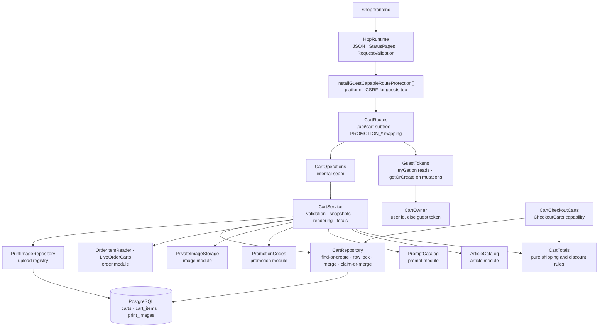

# Backend Cart package

This guide explains the Kotlin code in
[`backend/modules/cart/src/shop/voenix/cart`](../../../backend/modules/cart/src/shop/voenix/cart).

## What this package does

A visitor of the shop picks a mug, optionally a generation prompt, uploads the
image that is to be printed on it, and puts all of that into a cart. The cart
package owns that cart: the lines with the prices they were quoted at, the
uploaded print images, the coupon code the cart carries, and the totals the
checkout charges.

Two things make it different from the packages migrated before it:

- **Most of its callers are anonymous.** A customer fills a cart long before
  they have an account, so an anonymous cart is identified by the guest session
  token from the encrypted `voenix.guest` cookie. Once the customer signs in,
  their user id takes that role — the login moves the cart from the one
  identity to the other.
- **It is the first consumer of three capabilities.** Article, Prompt, and
  Promotion each exported a capability that nothing bound yet. The cart binds
  all three, Image's private storage on top, and — since the Order migration —
  two capabilities of the order module: `OrderItemReader` for the reorder route
  and `LiveOrderCarts` for the login claim.

The design decisions, the deviations from the .NET original, and the work
deliberately deferred are recorded in
[`cart-migration.md`](../../migration/cart-migration.md).

## The five-minute mental model



Read the diagram top to bottom once: a request arrives, the CSRF protection
decides whether it may mutate anything, the route turns cookies and session
into a `CartOwner`, the service decides what the cart *means*, and the two
repositories are the only things that talk to the three tables:
`CartRepository` owns `carts` and `cart_items`, `PrintImageRepository` owns the
standalone upload registry, and `CartCheckoutCarts` answers the one capability
the cart exports.

## HTTP API

Every response except the upload is the complete recalculated cart.

| Method and path | Body | Success | Errors |
| --- | --- | --- | --- |
| `GET /api/cart` | — | `200` `CartView`; no cart yet → empty view | `500` |
| `POST /api/cart/images` | multipart, part `file` | `201` `{"id": 42}` | `400` (no part, unreadable, unsupported, too large, CSRF), `500` |
| `POST /api/cart/items` | JSON | `200` `CartView` | `400` (field rules, not purchasable, prompt unusable, foreign image, CSRF), `500` |
| `POST /api/cart/order-items/{orderItemId}` | — | `200` `CartView` | `400` (CSRF), `404` (unknown or foreign order item), `409` `ORDER_IMAGE_UNAVAILABLE`, `500` |
| `PATCH /api/cart/items/{itemId}` | `{"quantity": 1..99}` | `200` `CartView` | `400`, `404`, `500` |
| `DELETE /api/cart/items/{itemId}` | — | `200` `CartView` | `400` (CSRF), `404`, `500` |
| `POST /api/cart/promotion` | `{"promotionCode": "…"}` | `200` `CartView` | `400`/`403`/`409` with a `code`, `404`, `500` |
| `DELETE /api/cart/promotion` | — | `200` `CartView` | `400` (CSRF), `404`, `500` |

The print image itself is delivered by the image module under
`GET /api/images/guest/{size}/{id}`; see
[the image package guide](image-package.md) and the section on ports below.

An example response:

```json
{
  "id": 12,
  "items": [
    { "id": 34, "articleId": 10, "variantId": 20, "articleName": "Classic",
      "variantName": "Weiß", "outsideColorCode": "#ffffff",
      "insideColorCode": "#ff0000", "available": true, "price": 1490,
      "quantity": 2, "imageId": 77, "promptId": 5, "promptPrice": 500 }
  ],
  "subtotal": 3980,
  "shippingCost": 490,
  "discountAmount": 447,
  "total": 4023,
  "totalItems": 2,
  "appliedPromotion": { "id": 3, "name": "Sommer", "promotionCode": "SAVE10",
                        "discountType": "PERCENTAGE", "discountValue": 10 }
}
```

## Who a cart belongs to

`CartOwner` carries an optional user id and an optional guest token, and which
of them identifies the cart depends on the request:

- a **signed-in** request finds and creates its cart by **user id**;
- an **anonymous** request does the same by **guest token**.

A cart therefore never carries both, and the database enforces that with a
CHECK plus one partial unique index per half. A request that carries neither
identity means no cart at all.

This is the revision of issue #77, and it replaced the original rule — "the
token is the identity of a cart, always", deviation 14 of the migration
record — for one reason: a login now rotates the `voenix.guest` cookie, so a
cart that could only be found by its token would be orphaned by the very login
that claimed it. With the user id as the identity, the rotation also becomes
the full fix it was meant to be: after signing out, the browser cannot reach
the customer's cart at all.

The guest token still matters for a signed-in caller, because two things next
to the cart keep their own ownership rule and were not changed: a print image
belongs to its token **or** its user, and so does an ordered line a reorder
starts from.

Reads and mutations differ in one more way:

```kotlin
// a mutation: the first one turns an anonymous browser into an addressable guest
CartOwner(guestToken = guestTokens.getOrCreate(call), userId = currentUserId())

// a read: neither a session nor a cookie means no cart — and no new guest either
CartOwner(guestToken = guestTokens.tryGet(call), userId = currentUserId())
```

Looking at a cart must not create a tracked visitor, so `GET /api/cart`
answers `CartView.EMPTY` (`id: null` and zeros) when the request carries
neither a session nor a guest cookie, without touching the database at all.

## The login claim: adopt, merge, or retire

The account module calls `CartGuestData.claim(guestToken, userId)` after every
successful login and registration, and the cart module answers it in one of
three ways:

- the customer has **no** active cart → the guest cart becomes theirs. It gains
  the user id and gives up the token, which is the one moment a cart changes
  identity;
- the customer **already has** an active cart → the guest cart's lines are
  merged into it and the emptied cart is retired with `status = 'MERGED'`;
- …unless that guest cart **already backs an order** — then nothing is moved at
  all and the cart is retired as it stands. The next section is about that one.

Two lines are the same line here when they carry the **same variant, the same
print image, and the same prompt**; their quantities are added and capped at 99,
exactly as an add caps a merge. Everything else becomes a line of its own,
appended behind the last position. That rule is deliberately coarser than the
one an add uses (which compares the whole snapshot, prices included): the
visitor and the customer were quoted their prices at different moments, and
showing the same mug twice for that reason would be a worse answer than one
merged line. The prompt is *not* coarsened away, because it is not a price
detail: it is what the customer is charged extra for, and merging two lines that
differ in it would drop one prompt and the money it costs from a cart the
customer had already been quoted.

The coupon follows the same principle — what the customer already had wins:

| cart of the customer | cart of the visitor | result |
| --- | --- | --- |
| has a coupon | has one too | the customer's stays |
| has none | has one | the visitor's is adopted |

An adopted coupon can still be refused later. The checkout re-validates it with
`PromotionCodes.reserve` for the *signed-in* customer, and a code with a
per-user limit this account has already used up is turned down there. That is
accepted and recoverable: the customer sees the coupon on their cart and can
drop it, exactly as if they had entered it themselves.

A retired cart also gives back the promotion capacity it may still be holding —
reservations have no expiry, and nothing would ever check that cart out again.
The release runs **inside the claim's transaction** (`PromotionCodes.release`,
the same shape a cancelled order uses), so the retired cart and its freed
capacity are one committed fact: a failure anywhere in the claim rolls both
back, and no reservation can be left stranded by a second write that did not
happen.

Both halves are idempotent. The second login of the same browser finds no guest
cart — the first one moved or retired it — and a claim can never move a row
that already belongs to somebody else. What makes "the next login claims again"
more than a hope is the login itself: it rotates the `voenix.guest` cookie only
when the claim reported success, so a claim that failed leaves the browser with
the very token its rows are still reachable under (see
[the account guide](account-package.md#the-login-rotates-the-guest-token-afterwards)).

## The guest cart that is already an order

A checkout does not always end with a closed cart. When the payment cannot be
started, the order stays `PENDING` and the cart deliberately stays `ACTIVE`, so
the customer's next attempt finds it (deviation D7 of the Checkout migration).
If that browser then signs in as a customer who already has a cart, a merge
would be the wrong answer:

- an order is deduped **per cart id** (`ux_orders_live_cart`). Moving the lines
  to another cart id would let the next checkout place a *second* order for the
  same items while the first one is still payable;
- the reservation of that cart is what the pending order's redemption consumes.
  Handing it back would take capacity away from an order that still needs it.

So the cart module asks the order module first — `LiveOrderCarts.backsLiveOrder
(cartId)`, "does this cart back an order that is not `CANCELLED`?" — and when
the answer is yes, the guest cart is retired with everything still on it: its
lines, its coupon, and its reservation. Nothing is moved and nothing is
released. What the customer sees is honest: that cart is not a cart any more, it
is an order, and the same login puts it into their order history.

The question is answered **inside the claim's transaction**, under the lock the
claim already holds on the guest cart, so no order can appear between the
question and the write that follows from it. One window stays open all the same
— a placement that commits after the read — and the checkout is what notices:
`markCheckedOut` then answers `false` for a cart it had just bought from, and
the checkout logs a `warn` (see the
[Checkout package guide](checkout-package.md)).

The adopt path is untouched by all of this. A cart that simply becomes the
customer's keeps its id, so its order stays deduped, its reservation stays
where it belongs, and a second checkout of it is answered with the order that
already exists.

## Why the routes own the whole `/api/cart` node

Ktor merges every registered path into one route tree. A route-scoped plugin
therefore applies to the node it is installed on **and every child of that
node** — including siblings that another module registered under the same
prefix. The cart installs the guest-capable CSRF protection on its own second
segment:

```kotlin
route("/api/cart") {
    installGuestCapableRouteProtection()
    get { … }
    post("/images") { … }
    route("/items") { … }
    route("/promotion") { … }
}
```

If the protection were installed one level higher, on `/api`, every route of
every other module would inherit it. Owning `/api/cart` keeps the blast radius
of the plugin exactly at the cart.

The protection itself is platform-owned and described in
[the authentication guide](authentication-and-authorization.md): it lets every
request through, and requires a valid CSRF pair on `POST`, `PUT`, `PATCH`, and
`DELETE` — from guests as well as from signed-in customers.

## The three-step add

`POST /api/cart/items` is the one operation with real logic behind it, and it
runs in three steps:

1. **Field rules.** `AddCartItemInput.validate()` — ids positive, quantity
   1–99. The shared Request Validation plugin runs the same rules before the
   handler, so a malformed body never reaches the service.
2. **Snapshots.** `ArticleCatalog.find` answers whether the variant may be
   bought at all and what it costs right now; `PromptCatalog
   .findSalesGrossPriceCents` does the same for the prompt. Both numbers are
   written onto the line and never change again — a later price change moves
   the shop's catalog, not a cart a customer is already looking at.
3. **The write.** `CartRepository.addItem` finds or creates the cart, checks
   that the image belongs to the caller, and merges or appends the line.

## Reorder: an ordered line becomes a cart line

`POST /api/cart/order-items/{orderItemId}` is a cart route although what it
starts from belongs to an order — because what it *produces* is a cart line.
The order module exports the lookup (`OrderItemReader`), the cart owns the
route:

```kotlin
val ordered = orderItems.find(orderItemId, owner.userId, owner.guestToken)
    ?: return OperationResult.NotFound
```

What the historical line contributes is four references — article, variant,
prompt, and print image — and nothing else. Everything else is decided again
right now, because the operation ends in the ordinary `addItem` above: the
catalog says whether the variant can still be bought and what it costs
**today** (never the price the customer paid back then), the line merges into
an identical one, and it gets its position the same way. That is why reorder
adds no second write path, and why the new line always has quantity 1 rather
than the ordered quantity.

The print image is the one thing a reorder cannot replace: it references the
very same row and copies no file. A line that carries none, an image row this
caller may not use, and an image whose file is gone are therefore all the same
answer — `409` with `ORDER_IMAGE_UNAVAILABLE`, the only conflict any cart
operation reports. A frontend branches on it to offer a fresh upload.

## Concurrency: two rules, both enforced by PostgreSQL

A cart is one of the few things a customer can hit twice at the same time —
double-clicking "add to cart" is the everyday case. Two rules keep that safe,
and neither is a preliminary read:

**One active cart per owner.** Two partial unique indexes say so, one per half
of the identity rule:

```sql
CREATE UNIQUE INDEX ux_carts_active_guest_session_token
    ON carts (guest_session_token)
    WHERE status = 'ACTIVE' AND guest_session_token IS NOT NULL;

CREATE UNIQUE INDEX ux_carts_active_user_id
    ON carts (user_id)
    WHERE status = 'ACTIVE' AND user_id IS NOT NULL;
```

The repository inserts first and ignores a conflict, then re-selects:

```kotlin
Carts.insertIgnore { … }                    // INSERT … ON CONFLICT DO NOTHING
lockedActiveCartIdInTransaction(owner)      // SELECT … FOR UPDATE
```

Whoever loses the race simply reads the winner's cart — or, when a checkout
committed `CHECKED_OUT` in the moment between the two statements, finds nothing
to lock and runs the pair once more, which now writes the fresh cart the
customer's next line belongs in. That retry is bounded at one attempt, exactly
like `OrderRepository.place`: a second miss needs a second checkout to commit
inside a second such window, and looping over it would trade a vanishingly rare
failure for an unbounded one. A `SELECT` followed by
an `INSERT` would race — the guide
[persistence-error-handling.md](persistence-error-handling.md) explains why
this codebase never protects a uniqueness rule that way.

**The cart row is the lock.** Every mutation takes `SELECT … FOR UPDATE` on
the cart before it reads anything it is about to write. Merging a line and
computing `max(position) + 1` both read-then-write, so without the lock two
concurrent adds could compute the same position and one of them would fail on
`UNIQUE (cart_id, position)`. With it they queue up, and two identical parallel
adds become one line of quantity 2.

The login claim locks two carts — the visitor's first, the customer's second,
always in that order — and is the one operation the user index can refuse: a
second login of the same customer may create their cart between this claim's
lock and its write. That is not protected by a preliminary read, which would
race; the claim simply repeats once, and the repetition then finds the winning
cart and merges into it. A second refusal ends in a deliberately loud `error`,
which the account module absorbs because a claim is best effort — and the login
then keeps the guest cookie, so the next one claims the same rows again.

That refusal is not left to chance in the tests either: `CartClaimIntegrationTest`
forces it by holding an uncommitted active cart for the customer on a second
connection, waiting until PostgreSQL reports the claim blocked by exactly that
connection, and only then committing. Without the interleaving the retry would
have no coverage at all — both writers of a plain two-browser race can finish
without the index ever refusing anything.

## The schema

[`V15__create_carts.sql`](../../../backend/modules/platform/resources/db/migration/V15__create_carts.sql)
creates three tables:

- **`print_images`** — the registry of uploaded print images: a unique file
  name, the guest token and/or user id that owns it, and a CHECK that there is
  at least one owner. The file itself lives in the image module's private
  storage, always as WebP.
- **`carts`** — an optional guest token, an optional user, `status` with a CHECK
  for `ACTIVE`/`CHECKED_OUT`/`MERGED`, and an optional `promotion_id`.
- **`cart_items`** — the lines, with the price snapshots, an optional prompt
  and print image, and a position that is unique within its cart.

[`V19__revise_cart_identity.sql`](../../../backend/modules/platform/resources/db/migration/V19__revise_cart_identity.sql)
is the identity revision of issue #77 on top of it: the token becomes nullable,
`MERGED` joins the status values, `ck_carts_single_owner` forbids a cart with
both identities, and the second partial unique index above is created.

Both owner columns may be `NULL` at the same time, and that state has exactly
one cause: `fk_carts_user` is `ON DELETE SET NULL`, so deleting an account
leaves its carts behind, unreachable, as the evidence the orders referencing
them need.

Three foreign keys are worth a sentence each:

| Reference | Rule | Why |
| --- | --- | --- |
| `cart_items (variant_id, article_id)` → `article_variant_identities (id, article_id)` | `CASCADE` | The **composite** key makes "this variant belongs to that article" a database fact, so a line can never name a foreign variant |
| `cart_items.print_image_id` → `print_images` | `RESTRICT` | An image a line still points at must not vanish under it |
| `carts.promotion_id` → `promotions` | `SET NULL` | Deliberately not `RESTRICT`: the promotion module maps SQL state `23503` of a promotion delete wholesale to "this promotion has redemptions", and a second restricting reference would corrupt that answer |

Deleting a user sets `user_id` to `NULL` on both carts and print images rather
than cascading into lines that restrict on images. A print image reverts to
guest-owned through the token it kept; a cart, which gave its token up when it
was claimed, simply becomes unreachable.

## The upload and its compensation

`POST /api/cart/images` stores the file first and writes the row second:

```kotlin
when (val stored = printImages.store(upload.upload)) {
    is OperationResult.Success -> register(owner, stored.value.filename)
    …
}
```

A row pointing at a file that does not exist would be a broken cart line
forever; a file without a row is an orphan nobody can reach. So if the row
cannot be written, `CartService` deletes the file it just stored and answers
`500`. Orphans from an upload that is never added to a cart are accepted, like
Article's and Prompt's example-image orphans.

The uploaded bytes are read by the image module's `receiveUploadedImage()`,
which stops reading as soon as the request exceeds 10 MiB. PNG, JPEG, and WebP
are accepted and normalized to WebP; GIF is refused.

## Totals

`CartTotals` is a pure object — no database, no request — with two rules:

- **Shipping**: `0` for an empty cart and from 5000 cents on, `490` in
  between. It is calculated from the pre-discount subtotal, so applying a
  coupon can never take free shipping away again.
- **Discount**: the base is subtotal **plus** shipping. A percentage above 100
  is capped at 100, halves round up (`HALF_UP`), and the result can never
  exceed the base — a 50-euro coupon on a 10-euro cart makes it free, never
  negative.

Every amount is a `Long`, and that is a fix rather than a taste: `price_cents`
has no upper bound in the schema and a line may hold 99 of them, so an `Int`
accumulator wrapped a large cart into a *negative* subtotal — an unaffordable
cart rendered as a free one (deviation D13 of the Checkout migration). The JSON
is unchanged; a number is a number. A single line price stays an `Int`, because
that one is a column.

Being pure is what lets `CartTotalsTest` cover the whole matrix, rounding
edges included, without starting PostgreSQL.

## Promotion errors: `ApiError` with a code

A coupon code can fail for seven different reasons, and the frontend has to
tell them apart. `CartPromotionResult` carries the reason out of the service,
and the route maps it to the shared `ApiError` plus the optional `code` field
the platform gained for exactly this. The mapping itself lives in the
promotion module as the public `PromotionCodeResult.toApiError()`, because the
checkout answers the same reasons and must answer them identically:

```json
{ "message": "Promotion code has expired", "code": "PROMOTION_EXPIRED" }
```

| `PromotionCodeResult` | `code` | Status |
| --- | --- | --- |
| `InvalidCode` | `PROMOTION_INVALID_CODE` | 400 |
| `Inactive` | `PROMOTION_INACTIVE` | 400 |
| `NotStarted` | `PROMOTION_NOT_STARTED` | 400 |
| `Expired` | `PROMOTION_EXPIRED` | 400 |
| `LoginRequired` | `PROMOTION_LOGIN_REQUIRED` | 403 |
| `TotalExhausted` | `PROMOTION_TOTAL_EXHAUSTED` | 409 |
| `PerUserExhausted` | `PROMOTION_PER_USER_EXHAUSTED` | 409 |

The code is validated **before** anything is written, so a rejected code can
never replace the promotion a cart already carries. Only the promotion id is
stored; what the discount is worth is recalculated on every read, and whether
it may still be used is decided again at checkout.

The cart names itself when it validates: `validate(code, userId, reservationKey
= cartId)`. The promotion module counts the capacity that checkouts are
currently holding, and the key is what leaves this cart's own hold out of that
count — otherwise the customer whose checkout reserved the last unit would be
told their own code is exhausted.

**Removing** the code also gives that hold back: `removePromotion` calls
`PromotionCodes.releaseAbandoned(cartId)` after the write succeeded. A checkout
can end without an order — a refused payment leaves the cart `ACTIVE` and its
reservation standing — and dropping the code is the customer's usual next move.
From then on nothing else would ever touch that reservation, and reservations
have no expiry. Replacing one code by another releases nothing on purpose: the
reservation is keyed on the cart, so the next checkout overwrites the same row.
The two writes are not one transaction, which is a deliberate trade: the release
is idempotent, and a failure between them leaves exactly the reservation the
customer already had.

## The two exported ports and the one exported capability

The cart module exports two implementations of *other* modules' ports, and the
composition root connects them:

- **`CartGuestImages`** implements the image module's `GuestImageResolver`.
  The delivery route asks "does this caller own image 42, and under which file
  name?", and gets a name or `null`. It must not distinguish "no such image"
  from "somebody else's image" — the route answers `404` for both, so an id
  cannot be probed for existence.
- **`CartGuestData`** offers `claim(guestToken, userId)`: the cart and the print
  images of a visitor move to the account they just signed in to — adopted,
  merged, or retired, as described above. It never takes a row away from another
  account, and both halves are idempotent. It is the one place in this module
  that hands two other modules' capabilities into a transaction of its own: the
  order module's `LiveOrderCarts` decides the merge, and the promotion module's
  `release` gives a retired cart's capacity back in the same commit. The account
  module calls it after a login or registration, best effort — a failed claim is
  logged and never fails the login.

Neither port creates a dependency between the modules that use them: Image
defines its port, Account defines its own, and `Application.kt` binds both to
the cart.

`CheckoutCarts` is the one capability the cart offers in its own words, and
`CartCheckoutCarts` implements it:

- `activeCart(guestToken, userId)` answers a `CheckoutCart` — the cart id, the
  promotion id, the stored lines, and the priced `subtotalCents` and
  `shippingCents`, with `discountCents(discount)` as a *method* so the capping
  and rounding stay in `CartTotals` even though the promotion is only decided
  once the checkout reserves it. Nothing is resolved live here: a checkout asks
  the catalog itself for what it puts on the order, and a second, differently
  timed answer would only be a chance to disagree. It is the very same lookup
  the cart routes use, so a signed-in checkout is answered with the customer's
  cart and an anonymous one with the token's. A cart without lines is a
  snapshot with an empty list, not `null`, so "no cart" and "empty cart" become
  the same `CART_EMPTY` answer;
- `markCheckedOut(cartId)` closes the cart with
  `UPDATE … WHERE status = 'ACTIVE'`. The predicate is the whole mechanism: the
  database decides which of two concurrent checkouts performed the transition,
  so the call is idempotent — `true` means this call did it, `false` means it
  was already done, and neither is a failure. The checkout still logs a `warn`
  for a `false`, because in *its* sequence the cart was active a moment ago:
  something else ended it while the checkout was running.

## Composition

```kotlin
val cart = installCartModule(
    database,
    articles,          // ArticleCatalog
    prompts,           // PromptCatalog
    promotionCodes,    // PromotionCodes
    images.privateStorage,
    order.orderItems,      // OrderItemReader
    order.liveOrderCarts,  // LiveOrderCarts
    guestTokens,
)
installGuestImageRoute(images, guestTokens, cart.guestImages)
```

`CartModule` is public — unlike Article's or Prompt's handle — because the
composition root needs three values out of it after the install:
`guestImages`, `guestData`, and `checkoutCarts`. Everything
behind it, the operations, the service, the repository, and the tables, stays
`internal`.

## Tests

| Test class | Level | What it pins down |
| --- | --- | --- |
| `CartInputValidationTest` | pure | the field-rule matrix of the three request bodies |
| `CartTotalsTest` | pure | shipping thresholds, percentage cap, rounding edges, fixed discounts |
| `CartServiceIntegrationTest` | service + PostgreSQL | find-or-create under two concurrent writers, the signed-in identity, merge and the 99 cap, positions, price snapshots, refusals, image ownership, rollback, cancellation, the upload compensation |
| `CartClaimIntegrationTest` | claim + PostgreSQL | the login claim: adoption, the merge with its quantity, prompt, and coupon rules, the guest cart that already backs an order, the retired cart and the reservation it releases inside the claim's transaction, two logins of the same customer racing each other, and the forced index refusal with the retry that follows it |
| `CartCheckoutIntegrationTest` | capability + PostgreSQL | the complete snapshot of a stored cart, the signed-in lookup, the idempotent close, a cart beyond `Int.MAX_VALUE` cents, and an add racing a checkout of the same cart |
| `CartRouteSecurityAndValidationTest` | route (stub operations) | CSRF rejection *before* the operation runs, field-rule `400`s, which requests create a guest cookie |
| `CartFlowIntegrationTest` | route + PostgreSQL | whole journeys over HTTP, the exact response shape, all seven `PROMOTION_*` codes, and the reorder matrix (today's price, merge, foreign line, unusable image, unbuyable variant) |
| `GuestImageRouteIntegrationTest` | route + PostgreSQL | the image and cart modules composed: upload, delivery to the owner, `404` for everyone else, and the compensating file delete |
| `CartSchemaIntegrationTest` | Flyway + PostgreSQL | every constraint, each violated by a statement that can only trip that one rule |
| `CartCompositionIntegrationTest` (app) | app + PostgreSQL | the real composition root serves a cart and the print image uploaded into it |
| `LoginClaimCompositionIntegrationTest` (app) | app + PostgreSQL | the claim's two cross-module decisions in the real composition: the merge that frees the retired cart's coupon capacity through the promotion module's transaction-joining release, and the login that retires the cart of a pending order instead of merging it |

Run them with:

```sh
./kotlin test --include-module cart
```

The integration tests need Docker, because they start PostgreSQL through
Testcontainers.

## What is deliberately not here

- **The checkout itself.** The cart answers `CheckoutCarts` and owns the
  `ACTIVE → CHECKED_OUT` transition, but who calls it, and in which order the
  promotion reservation, the order, and the payment are written, belongs to the
  checkout module — see the [Checkout package guide](checkout-package.md). It
  calls `markCheckedOut` **last**, after a payment exists or a free order was
  confirmed, so a checkout that dies halfway leaves the cart `ACTIVE`.
- **`customData` and `originalPrice`.** Both were dead in the .NET source —
  one only ever held `{}`, the other always equalled the snapshot — and were
  dropped with the migration.
- **A cart merge across two *signed-in* devices.** There is only ever one
  active cart per customer, so nothing can diverge that a merge would have to
  reconcile. The merge described above exists for exactly one moment: the
  login, where an anonymous cart meets the customer's own.
