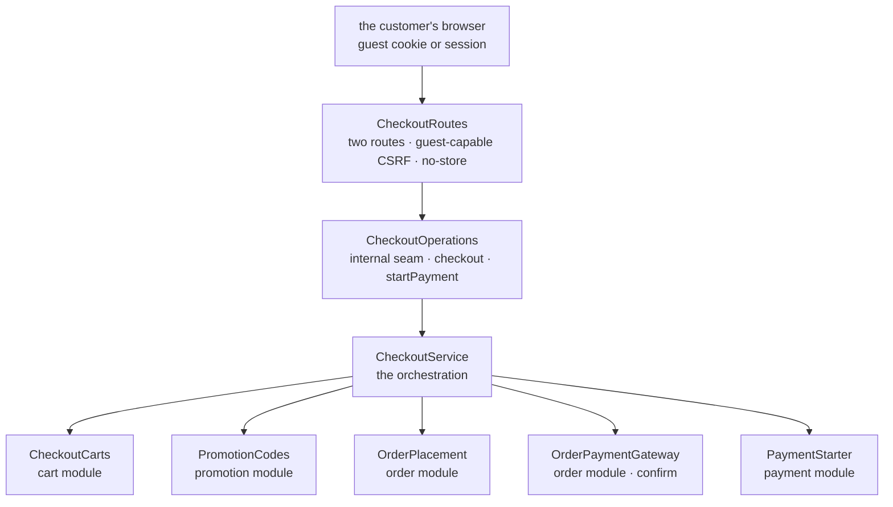

# Backend Checkout package

This guide explains the Kotlin code in
[`backend/modules/checkout/src/shop/voenix/checkout`](../../../backend/modules/checkout/src/shop/voenix/checkout).

## What this package does

It turns a filled cart into a placed order and sends the customer to pay for it.

This is the module every other customer-facing module was built towards, and it
is the smallest one in the backend:

- **no table**, no Exposed dependency, and no transaction of its own;
- **no exported capability** — its runtime handle is `internal`, because nothing
  consumes a checkout;
- **seven production types** and **two HTTP routes**.

Everything a checkout *does* is done by another module, through a capability that
module exports:

| It needs | It calls | Owner |
| --- | --- | --- |
| the priced cart, and closing it | `CheckoutCarts.activeCart` / `markCheckedOut` | cart |
| holding the coupon's capacity | `PromotionCodes.reserve` | promotion |
| placing the order, reading a payable one | `OrderPlacement.place` / `payable` | order |
| confirming a free order | `OrderPaymentGateway.confirm` | order |
| starting the payment | `PaymentStarter.start` | payment |

The decided design, every deviation from the .NET original, and the history of
the decisions live in
[`checkout-migration.md`](../../migration/checkout-migration.md); the work
deliberately left for later — the Vue frontend and the shipping-country policy —
lives in [`order-post-migration.md`](../../migration/order-post-migration.md) and
[`all-post-migration.md`](../../migration/all-post-migration.md).

## The five-minute mental model



Five facts explain almost every line of this module:

- **There is no transaction here, and there cannot be one.** Five modules commit
  five times, each inside itself. What holds the sequence together is that every
  step is safe to repeat and every gap has an owner.
- **The cart is closed last.** A checkout that dies halfway leaves an `ACTIVE`
  cart the customer can simply submit again.
- **A second submission does not place a second order.** The order module
  answers with the one that won (`AlreadyPlaced`), and the payment module answers
  with that order's stored checkout URL without calling the provider. Both
  submissions therefore receive the *same* body (deviation D15).
- **Nothing about money comes from the client.** A checkout request is two
  addresses. The prices, the shipping cost, the discount, and the total are read
  from the stored cart and the reserved promotion.
- **The guest token is read, never minted, and never logged** (deviations D8 and
  D9). Without a cookie there is no cart, which is the same answer as an empty
  one; the only identifier that reaches a log line here is the order id.

## HTTP API

| Method | Path | Who calls it | Answers |
| --- | --- | --- | --- |
| `POST` | `/api/checkout` | the storefront, signed in or as a guest | `201 {orderId, checkoutUrl\|null}` + `Location` |
| `POST` | `/api/checkout/orders/{orderId}/payment` | the storefront, for an order that was already placed | `200 {orderId, checkoutUrl}` |

Both hang below one `/api/checkout` node, and that is a decision rather than a
path style: Ktor merges paths into one route tree, so the guest-capable CSRF
protection installed on that node must not reach anything but the checkout.
Owning the second segment also lets this module own its retry path without
touching `/api/orders`, which belongs to the order module.

Both answers carry `Cache-Control: no-store`, and neither route hands out a
guest cookie.

### The request

```json
{
  "shippingAddress": {
    "firstName": "Ada", "lastName": "Lovelace",
    "street": "Musterweg", "houseNumber": "12a",
    "postalCode": "80331", "city": "München", "country": "DE",
    "email": "ada@example.org", "phone": ""
  },
  "billingAddress": null
}
```

Three details of that shape are deliberate:

- **The contact fields sit on the shipping address only** (deviation D11). The
  Vue store serializes `email` and `phone` on the billing address too; those keys
  are simply not declared in `AddressInput`, and the serializer ignores them —
  exactly what the legacy checkout did, which only ever read the shipping copies.
- **`phone: ""` means no phone** (deviation D12). The store always sends the
  field and sends an empty string when it is blank. A blank optional normalizes
  to `null` after validation; without that, every phoneless checkout would be
  rejected by the order module, which refuses a blank phone but accepts an absent
  one.
- **`billingAddress: null` is not missing data.** It is the customer saying
  "same address", and the order module resolves it into the stored columns.

The country is checked for its two-letter *shape* and nothing else. Whether the
shop ships there is an open product decision (deviation D10) recorded in
[`all-post-migration.md`](../../migration/all-post-migration.md).

### The answers

| Status | `code` | When |
| --- | --- | --- |
| `201` | — | the order exists; `checkoutUrl` is `null` for a free order |
| `400` | — | the request broke its field rules (the Request Validation plugin, before any operation runs) |
| `400` | `CART_EMPTY` | no cookie, no cart, or a cart without a line |
| `400`/`403`/`409` | `PROMOTION_*` | the coupon could not be reserved — the promotion module's own matrix |
| `409` | `CART_ITEM_UNAVAILABLE` | a line names an article variant the catalog no longer has |
| `409` | `CART_IMAGE_UNAVAILABLE` | a line names a print image that is gone |
| `409` | `CART_TOTAL_TOO_LARGE` | the cart's amounts do not fit the cents an order stores (deviation D13) |
| `502` | `PAYMENT_NOT_STARTED` | no payment was started |
| `500` | — | this module built something the order module refused, or a step answered something unusable |

The retry route answers the same body with `200` — it creates nothing — plus two
refusals of its own: `404` for an unknown **and** for a foreign order id, and
`409` with `ORDER_ALREADY_PAID` or `ORDER_NOT_PAYABLE` for an order that is paid,
cancelled, or free.

The `PROMOTION_*` rows are not translated in this module. The mapping is the
promotion module's public `PromotionCodeResult.toApiError()`, so a coupon
rejected while it is entered into the cart and the same coupon rejected while the
checkout reserves it reach the customer as the very same answer.

## The flow of a checkout

`CheckoutService.checkout` is five steps, in the one order that leaves no gap a
designed mechanism does not already cover:

1. **Read the cart.** No guest token, no cart, or an empty cart → `400
   CART_EMPTY`. A cart whose subtotal plus shipping does not fit `Int` cents →
   `409`, before anything is written, so no coupon is held for a checkout that
   could never be stored.
2. **Reserve the coupon** — only if the cart carries one. `PromotionCodes.reserve`
   runs in *its own* transaction under a lock on the promotion row and checks the
   active flag, the activity window, the eligibility, and the usage limits,
   counting redemptions **and** the reservations of other carts. A refusal ends
   the checkout with the promotion module's own answer.
3. **Place the order.** `OrderPlacement.place` opens the order module's
   transaction. A `23505` on `ux_orders_live_cart` means a concurrent submission
   won, and the answer is `AlreadyPlaced` carrying *that* order — a success, and
   the reason a double-clicked checkout is harmless.
4. **A total of zero is confirmed here and now.** `OrderPaymentGateway.confirm`
   redeems the promotion, queues production and the confirmation mail, and only
   then is the cart closed (deviation D6). The answer is `{orderId, null}`: there
   is nothing to pay.
5. **Any other total gets a payment.** `PaymentStarter.start` calls the provider
   outside any transaction and inserts the row under `ux_payments_live_order`.
   A URL closes the cart and is answered; a `null` does **not** close the cart
   and becomes `502`.

The lock order stays acyclic: `reserve` locks the promotion row and nothing else,
while a confirm or a cancel locks the order row and then the promotion row.

### Why `502` says so little

`start` answering `null` covers two different worlds, and this module cannot tell
them apart (deviation D7):

- the provider refused to create a payment → the payment module has **already**
  cancelled the order (its deviation D10), and that cancellation released the
  coupon;
- the order's live payment slot was contended away twice → the order is
  untouched and stays `PENDING` (its deviations D9 and D21).

So the message says only that the payment could not be started. It claims no
cancellation, it does not cancel anything a second time, and it leaves the cart
`ACTIVE` so the customer's next attempt finds it. Frontend copy has to stay
equally vague.

## The retry route

`POST /api/checkout/orders/{orderId}/payment` is a journey the legacy shop never
had (deviation D16). It exists because a payment that ended `FAILED`, `EXPIRED`,
or `CANCELED` falls out of `ux_payments_live_order`, so a second payment for the
same order is possible — but nothing offered the customer a way to ask for one.

- It has **no body at all**: everything the payment needs is what the order
  stored, read back as a `PayableOrder`.
- It reads **no cart** and closes none. Whatever cart that order came from was
  closed when it was placed.
- Ownership is checked by the order module, with the same rule its own reads
  use: an order of another visitor answers `404`, exactly like one that does not
  exist, and no provider call is made.
- A live payment answers its stored URL without touching the provider; a
  terminal one starts a second payment row.
- It deliberately does **not** reserve the coupon again (deviation D4). The
  reservation was released when the payment ended, so the retry competes for
  whatever capacity is left at redemption time — with the accepted worst case
  that an order becomes `PAID` without a redemption.

## The seven types

| File | What it is |
| --- | --- |
| `CheckoutModule.kt` | the internal handle, `createCheckoutModule`, the public `installCheckoutModule`, the internal route-test overload, and `validateCheckoutRequests` |
| `CheckoutOperations.kt` | the internal seam the routes call: `checkout` and `startPayment` |
| `CheckoutService.kt` | the orchestration above, split into placement and settlement helpers |
| `CheckoutRequest.kt` | the `@Serializable` input, its nested `ShippingAddressInput` and `AddressInput`, their pure `validate()`, and the normalization |
| `CheckoutResponse.kt` | `{orderId, checkoutUrl?}` — both routes answer this one shape |
| `CheckoutResult.kt` | the internal sealed result every ending is expressed as |
| `CheckoutRoutes.kt` | the two routes and the one error table |

`CheckoutResult` is a result of its own rather than the shared `OperationResult`
because a checkout composes four modules and the reason it stopped is the only
thing that tells a customer what to do next. Two refusals are deliberately absent
from it: an unexpected database failure is not mapped at all — it surfaces as an
exception the HTTP runtime answers — and a request that breaks its field rules
never reaches an operation. `Invalid` therefore does not mean "the customer sent
something wrong" but "this module assembled something the order module refused",
which is a bug and is logged as one.

## Composition

The checkout is installed **after** cart, promotion, order, and payment, and
before account:

```kotlin
installCheckoutModule(
    carts = cart.checkoutCarts,
    promotions = catalog.promotionCodes,
    orders = order.placement,
    orderPayments = order.payments,
    payments = payments.starter,
    guestTokens = guestTokens,
)
```

There is no handle to keep. `order.payments` appears here for the second time —
the payment module got it first — but the checkout uses exactly one member of it,
`confirm`, for the free order that never has a payment.

`validateCheckoutRequests()` joins the application's single `RequestValidation`
block, so a body is checked once, in one place, before any handler sees it.

## Tests

Run the module's own suites with

```sh
./kotlin test --include-module checkout
```

- `CheckoutRequestValidationTest` — the validator matrix, as pure unit tests.
- `CheckoutRouteTest` — the HTTP surface against a stub operation: the exact
  request the frontend sends today, the ignored billing contact fields, the
  explicit `null` URL of a free order, and every refusal with its status and
  stable code.
- `CheckoutServiceTest` — the orchestration against fakes: what runs, in which
  order, and above all what does *not* run after a refusal.

The journeys that need all five modules at once live in the app module
(`./kotlin test --include-module app`), against real PostgreSQL and a local
Mollie stub:

- `CheckoutFlowCompositionIntegrationTest` — the free order, the refused
  provider, the payment that was never stored, and the promotion window versus
  the promotion limits;
- `CheckoutConcurrencyCompositionIntegrationTest` — two overlapping submissions
  of one cart, two carts racing the last unit of a coupon, and two simultaneous
  retries;
- `CheckoutRetryCompositionIntegrationTest` — the retry matrix and the
  reservation lifecycle, including the terminal webhook that frees a coupon while
  the order stays `PENDING`.

## What is deliberately not here

- **The customer's order reads.** `GET /api/checkout/orders` and
  `/api/checkout/orders/{id}` were migrated as `/api/orders` by the Order
  migration; the four legacy read DTOs were not ported.
- **Any knowledge of Mollie.** The checkout receives a URL or a `null`.
- **A country list.** See the shipping-country policy in
  [`all-post-migration.md`](../../migration/all-post-migration.md).
- **A transaction, a table, or a repository.** If a change to this module seems
  to need one, the behavior almost certainly belongs to one of the four modules
  it composes.
