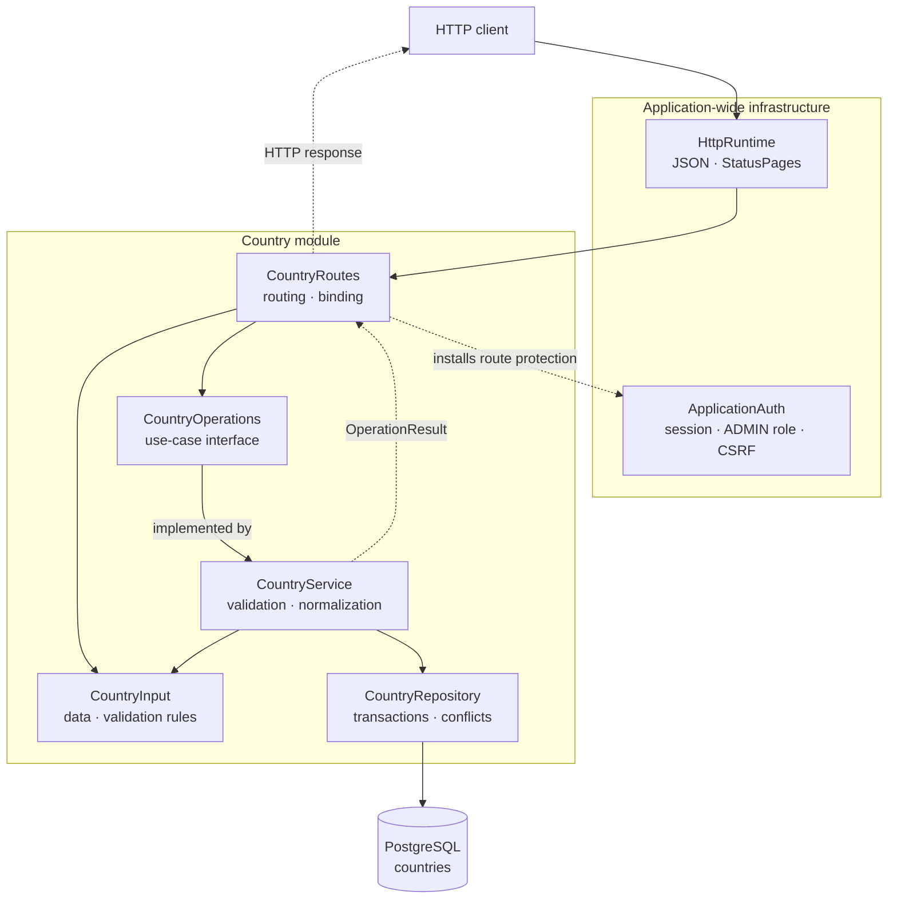

# Backend country package

This guide explains the Kotlin code in
[`backend/modules/country/src/shop/voenix/country`](../../../backend/modules/country/src/shop/voenix/country).

## What this package does

The country package provides:

- a public, read-only list of countries and telephone dial codes;
- authenticated admin endpoints for listing, creating, reading, updating, and
  deleting countries;
- validation and normalization of country input; and
- PostgreSQL persistence through Exposed.

The HTTP adapter now uses ordinary Ktor routing and JSON binding. The module
does not contain its own JSON scanner, route selector, or HTTP error hierarchy.
This keeps the package focused on country behavior.

Application-wide authentication remains in
[`shop.voenix.auth`](../../../backend/modules/platform/src/shop/voenix/auth). Shared JSON and
exception-to-response handling lives in
[`shop.voenix.http`](../../../backend/modules/platform/src/shop/voenix/http). Database startup
lives in [`shop.voenix.db`](../../../backend/modules/platform/src/shop/voenix/db).

## The five-minute mental model



Solid arrows show a request moving toward country behavior and the database.
Dotted arrows show a policy dependency or a typed result.

> **IntelliJ IDEA:** Rendering this diagram requires the separate
> [Mermaid plugin](https://plugins.jetbrains.com/plugin/20146-mermaid) and the
> Markdown preview pane. Install the plugin through **Settings | Plugins**, then
> select **Preview** or **Editor and Preview** in the Markdown editor.

The important boundaries are:

1. **Application composition owns shared HTTP mechanics.**
   `installHttpRuntime()` installs JSON content negotiation and `StatusPages`.
   The app installs one `RequestValidation` plugin and asks each module to
   register its own input types.
2. **`ApplicationAuth` owns security policy.** It authenticates sessions,
   enforces the exact `ADMIN` role, and validates CSRF tokens.
3. **The route adapter owns module HTTP behavior.** It declares paths,
   installs auth-owned protection, binds `CountryInput`, and maps
   `OperationResult` to status codes.
4. **`CountryInput.validate()` owns the field rules.** Ktor and the
   service call the same input method. Direct service callers therefore cannot
   bypass the rules, and the validation stays next to the data it examines.
5. **The service owns normalization.** It passes only valid, normalized values
   to persistence and maps repository write results to `OperationResult`.
6. **The repository owns persistence and conflict detection.** It runs small
   Exposed transactions and returns typed write results without exposing SQL
   exceptions or database object names to the service.

## Application composition

[`Application.kt`](../../../backend/app/src/shop/voenix/Application.kt) installs the
application concerns separately:

```kotlin
installHttpRuntime()
install(RequestValidation) {
    validateCountryRequests()
    // VAT, Supplier, and Pricing register their inputs here too.
}
ApplicationAuth.install(this, authSettings)
val countries = installCountryModule(database)
```

`installHttpRuntime()` installs shared JSON and `StatusPages`. The app owns the
single `RequestValidation` plugin and each module registers its own input
through a small extension such as `validateCountryRequests()`. `CountryInput`
implements the module-neutral `Validatable` interface, so shared `StatusPages`
can turn a Ktor
`RequestValidationException` back into the API's structured field-error map
without checking for concrete module types.

The country module exposes two route-installation variants:

```kotlin
fun Application.installCountryModule(database: Database): CountryReader

fun Application.installCountryModule(countries: CountryOperations)
```

The first overload creates the internal `CountryRepository` and
`CountryService`, installs the routes, and returns a `CountryReader` capability
for Supplier. The second accepts the use-case interface directly, which lets
route tests inject a small stub. Neither overload installs shared plugins or
accepts auth settings.

## The production files

The module package contains these Kotlin files:

```text
country/
|- Country.kt
|- CountryModule.kt
|- PublicCountry.kt
|- CountryInput.kt
|- CountryOperations.kt
|- CountryReader.kt
|- CountryRoutes.kt
|- CountryService.kt
|- CountryRepository.kt
|- CountryWriteResult.kt
`- Countries.kt
```

Their responsibilities are:

- [`Country.kt`](../../../backend/modules/country/src/shop/voenix/country/Country.kt) is both the
  stored domain value and the serializable admin response.
- [`PublicCountry.kt`](../../../backend/modules/country/src/shop/voenix/country/PublicCountry.kt)
  is the public response without a database ID and with a dial code.
- [`CountryInput.kt`](../../../backend/modules/country/src/shop/voenix/country/CountryInput.kt)
  is the shared create and update input. Its `validate()` method owns
  the field rules and produces the field-error map.
- [`CountryOperations.kt`](../../../backend/modules/country/src/shop/voenix/country/CountryOperations.kt)
  is the seam between HTTP and country behavior.
- [`CountryReader.kt`](../../../backend/modules/country/src/shop/voenix/country/CountryReader.kt)
  is the batch lookup capability consumed by Supplier.
- [`CountryModule.kt`](../../../backend/modules/country/src/shop/voenix/country/CountryModule.kt)
  defines the public runtime handle and owns module construction, route
  installation, and request-validation registration without exposing the
  internal object graph.
- The shared [`OperationResult`](operation-results.md) is the closed set of success and
  failure results returned by `CountryOperations`.
- [`CountryRoutes.kt`](../../../backend/modules/country/src/shop/voenix/country/CountryRoutes.kt)
  contains the internal `CountryRoutes` object and HTTP mapping.
- [`CountryService.kt`](../../../backend/modules/country/src/shop/voenix/country/CountryService.kt)
  implements normalization, the use cases, and safe database-error handling.
- [`CountryRepository.kt`](../../../backend/modules/country/src/shop/voenix/country/CountryRepository.kt)
  contains the Exposed queries, transactions, and conflict detection.
- [`CountryWriteResult.kt`](../../../backend/modules/country/src/shop/voenix/country/CountryWriteResult.kt)
  is the internal result of a repository create or update.
- [`Countries.kt`](../../../backend/modules/country/src/shop/voenix/country/Countries.kt) maps the
  existing PostgreSQL table.

The backend rule is **exactly one top-level type per Kotlin file**, with the file
named after that type. Tables, repository, service, routes, and persistence
results are internal to the `country` compilation module.

## The country interface

`CountryOperations` exposes only module types:

```kotlin
interface CountryOperations {
    suspend fun listPublic(): OperationResult<List<PublicCountry>>
    suspend fun listAdmin(): OperationResult<List<Country>>
    suspend fun get(id: Long): OperationResult<Country>
    suspend fun create(input: CountryInput): OperationResult<Country>
    suspend fun update(id: Long, input: CountryInput): OperationResult<Country>
    suspend fun delete(id: Long): OperationResult<Unit>
}
```

There are no Ktor request or response types in this interface. A future job,
command-line tool, or test can call it without pretending to be an HTTP request.

## Follow one create request

Consider an admin creating Denmark:

```json
{
  "name": " Denmark ",
  "countryCode": " dk "
}
```

The request follows this path:

1. `CountryRoutes` matches the canonical
   `POST /api/admin/countries` path.
2. Ktor authentication reads and validates the encrypted `voenix.auth` cookie.
3. `AdminRouteProtection` requires the exact `ADMIN` role.
4. For this `POST`, `AdminRouteProtection` validates the `X-XSRF-TOKEN` header.
5. `call.receive<CountryInput>()` asks Ktor Content Negotiation to deserialize
   the JSON body. Ktor's `RequestValidation` plugin then calls
   `CountryInput.validate()`.
6. If a field is invalid, Ktor throws `RequestValidationException`.
   `HttpRuntime` returns `400 Validation failed` with every field error, and
   the country operation is not called.
7. For valid input, `CountryService.create` calls the same
   `input.validate()` interface to protect direct, non-HTTP callers
   too.
8. The service trims the name and trims plus uppercases the code, producing
   `Denmark` and `DK`.
9. `CountryRepository.insert` writes the row in an Exposed transaction. If a
   unique write fails, the repository returns a generic typed `Conflict`
   result.
10. The route returns `201 Created`, the new `Country`, and the relative
   `Location` value `/api/admin/countries/{id}`.

The HTTP boundary and service both enforce the rules, but they do not contain
two rule implementations. Both call `CountryInput.validate()`. This
keeps direct service calls safe while allowing Ktor to reject an invalid HTTP
body before calling `CountryOperations`.

## HTTP API

| Method and path | Access | CSRF header | Success response |
| --- | --- | --- | --- |
| `GET /api/countries` | Public | No | `200` with a JSON array of `PublicCountry` |
| `GET /api/admin/countries` | Admin | No | `200` with a JSON array of `Country` |
| `POST /api/admin/countries` | Admin | Yes | `201` with `Country` and a relative `Location` header |
| `GET /api/admin/countries/{id}` | Admin | No | `200` with `Country` |
| `PUT /api/admin/countries/{id}` | Admin | Yes | `200` with `Country` |
| `DELETE /api/admin/countries/{id}` | Admin | Yes | `204` with no body |

The auth-owned `GET /api/antiforgery/token` endpoint supplies the CSRF token
used by admin write clients.

### Canonical paths and IDs

Routes use normal Ktor matching. Paths are case-sensitive and do not accept an
extra trailing slash. For example, `/api/countries` is valid, while
`/API/COUNTRIES` and `/api/countries/` return `404 Not Found`.

The `/{id}` path variable initially matches any single segment. The protected
handler performs security checks before converting that value with
`toLongOrNull()`:

```text
matched admin write -> authentication -> ADMIN role -> CSRF
                    -> ID conversion -> JSON binding -> country service
```

Therefore an anonymous request for
`/api/admin/countries/not-a-number` receives `401`, an authenticated non-admin
receives `403`, and an admin receives `400` with `Invalid country id`. For an
admin `PUT` or `DELETE`, CSRF is also checked before ID conversion. No country
operation runs for an invalid ID.

### Standard JSON binding

Create and update share this serializable input:

```kotlin
@Serializable
data class CountryInput(
    val name: String? = null,
    val countryCode: String? = null,
)
```

The nullable properties and defaults have a deliberate purpose. `{}` is valid
JSON and can be bound to `CountryInput`; the service can then return clear
errors for both missing fields.

The JSON contract follows the configured Ktor and kotlinx.serialization
behavior:

- requests use `application/json`;
- property names are case-sensitive, so `name` and `Name` are different;
- unknown properties are ignored because shared JSON configuration uses
  `ignoreUnknownKeys = true`;
- syntactically invalid JSON, wrong top-level values, and wrong field types
  produce a generic `400 Invalid request body`; and
- an unsupported or missing content type produces `415 Unsupported media type`.

There is no country-specific charset list or error-position reporting. Ktor's
configured converter owns decoding and binding.

## Admin and public representations

The two response types make the intended audience visible:

```text
Country:       id, name, countryCode
PublicCountry:     name, countryCode, dialCode
```

- Admin responses use `Country` directly and include the database ID.
- Public responses hide the ID, uppercase the country code, and use
  libphonenumber to add a dial code such as `+49` for `DE`.
- An unknown two-letter region is allowed but has `dialCode: null`. Validation
  checks the code's shape, not membership in an ISO list.
- Lists are ordered by stored `country_code`, then by `id`.
- List endpoints serialize the list itself. There is no surrounding object.

For example, the public endpoint starts like this:

```json
[
  {"name":"Austria","countryCode":"AT","dialCode":"+43"},
  {"name":"Belgium","countryCode":"BE","dialCode":"+32"}
]
```

## Results and HTTP errors

The shared [`OperationResult`](operation-results.md) keeps HTTP status decisions out of
the service:

```kotlin
sealed interface OperationResult<out T> {
    data class Success<T>(val value: T) : OperationResult<T>
    data class Invalid(
        val errors: ValidationErrors,
    ) : OperationResult<Nothing>

    data object NotFound : OperationResult<Nothing>
    data object Conflict : OperationResult<Nothing>
    data object UnexpectedFailure : OperationResult<Nothing>
}
```

Country failures, JSON-binding failures, unsupported media types, invalid IDs,
and CSRF failures use the shared
[`ApiError`](../../../backend/modules/platform/src/shop/voenix/http/ApiError.kt):

```kotlin
@Serializable
data class ApiError(
    val message: String,
    val errors: ValidationErrors = emptyMap(),
)
```

A validation response is small and uses the same lower-camel-case names as the
request JSON:

```json
{
  "message": "Validation failed",
  "errors": {
    "name": ["Name is required"],
    "countryCode": ["Country code is required"]
  }
}
```

| Result or failure | HTTP status | `ApiError.message` |
| --- | --- | --- |
| `NotFound` | `404` | `Country not found` |
| `Conflict` | `409` | `Country name or code already exists` |
| Invalid country input | `400` | `Validation failed`, with the field-error map |
| Invalid country ID | `400` | `Invalid country id` |
| Invalid JSON binding | `400` | `Invalid request body` |
| Unsupported content type | `415` | `Unsupported media type` |
| `UnexpectedFailure` | `500` | `Internal server error` |

The response media type is `application/json`. Database messages, serializer
details, and internal exception text are never sent to the client.

Authentication and role failures intentionally retain their auth-owned
`AuthResponse` shape. See
[Authentication and authorization](authentication-and-authorization.md).

[`HttpRuntime`](../../../backend/modules/platform/src/shop/voenix/http/HttpRuntime.kt) installs
`StatusPages` for binding and request-validation exceptions and as a final
safety net for unexpected errors. It logs unexpected failures server-side. A
`CancellationException` is always rethrown because cancellation is coroutine
control flow, not an HTTP failure.

## Validation and normalization

`CountryInput.validate()` implements these field rules directly:

| Field | Rule | Normalization |
| --- | --- | --- |
| `name` | Required after trimming; at most 255 characters | Trim surrounding whitespace |
| `countryCode` | Required; exactly two ASCII letters | Trim and uppercase with `Locale.ROOT` |

All invalid fields are returned together as `ValidationErrors`, the shared
alias for `Map<String, List<String>>`. An empty map means that the input is
valid.
`CountryInput` stays nullable so a missing JSON property can become a useful
field error. Ktor validates HTTP input during `call.receive<CountryInput>()`;
the service calls the same input method for non-HTTP callers. The service
normalizes only after that check, and the repository accepts only non-null,
normalized strings.

Country names are unique without regard to case. Country codes are normalized
to uppercase before a write and are unique as stored values.

## Conflict handling and concurrency

Country follows the shared
[persistence error-handling pattern](persistence-error-handling.md). PostgreSQL
enforces case-insensitive name and normalized code uniqueness. Any SQL state
`23505` becomes `CountryWriteResult.Conflict`, which the service maps to
`OperationResult.Conflict`. The route returns one generic `409` message without
querying which unique rule rejected the write.

Country's integration tests cover normal duplicate writes and concurrent name
and code writes. Other SQL errors still become `UnexpectedFailure`.

## Persistence and migrations

Flyway SQL migrations own the production schema. `Countries` maps the table for
queries; it does not create or alter production tables at startup.

`Database.SearchPath` selects the PostgreSQL schema used by JDBC, Flyway, and
Exposed. It defaults to `voenix` and can be overridden with
`DATABASE_SEARCH_PATH` or `Database__SearchPath`. The application supports one
lowercase schema identifier in that setting.

The `<configured schema>.countries` table contains:

| Column | PostgreSQL type | Notes |
| --- | --- | --- |
| `id` | `bigint` identity | Primary key |
| `name` | `varchar(255)` | Non-null; unique through `LOWER(name)` |
| `country_code` | `varchar(2)` | Non-null; unique |

[`V1__create_countries.sql`](../../../backend/modules/platform/resources/db/migration/V1__create_countries.sql)
creates the current indexes and seeds Germany, France, Italy, Austria, Belgium,
the Netherlands, Spain, and Sweden.

The Kotlin application supports only databases managed by these Flyway
migrations. An empty database starts with V1. An existing Kotlin database uses
its `flyway_schema_history` table to apply only pending migrations. Tables from
an older application are not adopted or baselined automatically; Flyway lets
the application startup fail instead of assuming that an unknown schema is
compatible.

When the schema changes, add a new numbered Flyway migration. Do not edit an
already-applied migration to change an existing environment.

## Repository and coroutine behavior

Each repository operation runs one Exposed `suspendTransaction` on
`Dispatchers.IO`:

- the blocking JDBC driver does not occupy a coroutine worker intended for
  non-blocking work; and
- callers can write normal sequential Kotlin while the function suspends during
  database work.

`maxAttempts = 1` disables automatic transaction retries. One repository call
therefore has one observable result.

Create and update return an internal `CountryWriteResult`. This keeps SQL state
handling inside the repository. `CountryService` maps expected write results,
catches and logs unexpected database exceptions, and returns
`OperationResult.UnexpectedFailure`. It always rethrows `CancellationException`.

## Kotlin concepts used here

- **`@Serializable`** lets Ktor and kotlinx.serialization convert
  `CountryInput`, `Country`, and `PublicCountry` to or from JSON.
- **Nullable properties** such as `String?` may contain a string or `null`.
  They let `CountryInput.validate()` explain a missing input field as
  a field error.
- **`data class`** generates value-based equality, `copy`, and a readable
  `toString` for value types.
- **`sealed interface`** limits the possible `OperationResult` implementations, so
  a route's `when` can cover every result.
- **`Nothing`** in `OperationResult<Nothing>` means a failure has no success value.
  The `out T` declaration lets the same failure be returned from any operation.
- **`suspend fun`** marks work that may pause without blocking the caller's
  thread.
- **`object`** declares one shared, stateless value. `CountryRoutes` groups the
  route installation code without creating instances.
- **`RequestValidation`** is a Ktor plugin that checks the deserialized body
  when a route calls `receive<T>()`. Invalid input raises an exception before
  the route calls the country operation.
- **`Locale.ROOT`** makes uppercasing deterministic instead of depending on the
  server's language.

## Tests and quality gate

Run backend commands from `backend/` with the repository's Kotlin Toolchain:

```sh
cd backend
./kotlin test
./kotlin check
```

`./kotlin check` is the required final quality gate. It runs tests and ktlint.
Integration tests use Testcontainers with `postgres:17-alpine`, so a
Docker-compatible container runtime must be available.

| Test | Main responsibility |
| --- | --- |
| [`CountryInputValidationTest.kt`](../../../backend/modules/country/test/shop/voenix/country/CountryInputValidationTest.kt) | Complete field rules without HTTP or a database |
| [`CountryRouteSecurityAndValidationTest.kt`](../../../backend/modules/country/test/shop/voenix/country/CountryRouteSecurityAndValidationTest.kt) | Canonical routing, security and ID ordering, standard JSON binding, `ApiError` mapping, and proving rejected requests do not reach country operations |
| [`CountryAdminCrudIntegrationTest.kt`](../../../backend/modules/country/test/shop/voenix/country/CountryAdminCrudIntegrationTest.kt) | Authenticated and CSRF-protected CRUD, direct admin arrays, and relative `Location` against PostgreSQL |
| [`CountryPublicRouteIntegrationTest.kt`](../../../backend/modules/country/test/shop/voenix/country/CountryPublicRouteIntegrationTest.kt) | Direct public arrays, sort order, seed data, canonical paths, and dial codes |
| [`CountryServiceIntegrationTest.kt`](../../../backend/modules/country/test/shop/voenix/country/CountryServiceIntegrationTest.kt) | Complete validation maps, normalization, generic conflicts, concurrency, and hidden database failures |

Route tests inject a `CountryOperations` stub. Database behavior is tested
against real PostgreSQL because unique expression indexes and SQL state `23505`
are PostgreSQL-specific.

## Safe change recipes

### Add a persisted country field

1. Add a new Flyway migration under `backend/modules/platform/resources/db/migration`.
2. Add the column mapping to `Countries` and the stored property to `Country`.
3. Decide whether the value also belongs in `PublicCountry`.
4. If clients may write it, add it to `CountryInput`, add its field rule to
   `CountryInput.validate()`, and normalize it in `CountryService`.
5. Update repository row mapping and write statements.
6. Update route, service, CRUD, and migration tests as needed.
7. Update this guide and run `./kotlin check` from `backend/`.

### Add a country operation or endpoint

1. Add the use case to `CountryOperations` using module types.
2. Implement it in `CountryService` and return `OperationResult`, not a Ktor type.
3. Add only the required persistence operation to `CountryRepository`.
4. Add the canonical Ktor route and decide whether it is public, an admin read,
   or an admin write.
5. For protected routes, use `ApplicationAuth.PROVIDER` and install
   `AdminRouteProtection` once on their common parent route. The plugin checks
   CSRF automatically for writes before a handler binds a body or calls the
   operation.
6. Extend the stub route tests and add a PostgreSQL integration test when
   persistence changes.
7. Update this guide and run `./kotlin check`.

### Change input or error behavior

Start with `CountryInputValidationTest`,
`CountryRouteSecurityAndValidationTest`, and `CountryServiceIntegrationTest`.
Keep transport binding and field rules separate:

- `HttpRuntime` maps JSON conversion and request-validation failures to
  `ApiError` responses;
- `validateCountryRequests()` registers the typed country input in the single
  application-owned `RequestValidation` plugin;
- `CountryRoutes` binds input and maps results;
- `CountryInput.validate()` is the single validation interface;
- that method also contains the only field-rule implementation; and
- `CountryService` invokes the input interface for direct callers, then
  normalizes valid values.

Do not add a second parser or copy field conditions into a route or service.

## Contributor checklist

Before finishing a country-package change, verify that:

- the public module surface stays limited to DTOs, operations, `CountryReader`,
  and module installation;
- `Countries`, `CountryRepository`, `CountryService`, and `CountryRoutes` stay
  internal;
- create and update share `CountryInput`;
- admin output uses `Country`, public output uses `PublicCountry`, and lists are
  direct JSON arrays;
- routes use canonical paths and ordinary Ktor binding;
- security checks run before ID conversion, protected body binding, and country
  operations as appropriate;
- all field conditions live in `CountryInput.validate()`;
- Ktor rejects invalid country bodies before calling `CountryOperations`;
- direct service calls still cannot bypass validation;
- repository code does not decide HTTP status codes;
- duplicate and concurrent unique writes return the generic conflict;
- unknown database failures are logged but not exposed;
- `CancellationException` is rethrown;
- auth cookie behavior remains intact;
- production schema changes use a new Flyway migration;
- developer documentation remains current and beginner-oriented; and
- `./kotlin check` passes from `backend/`.
