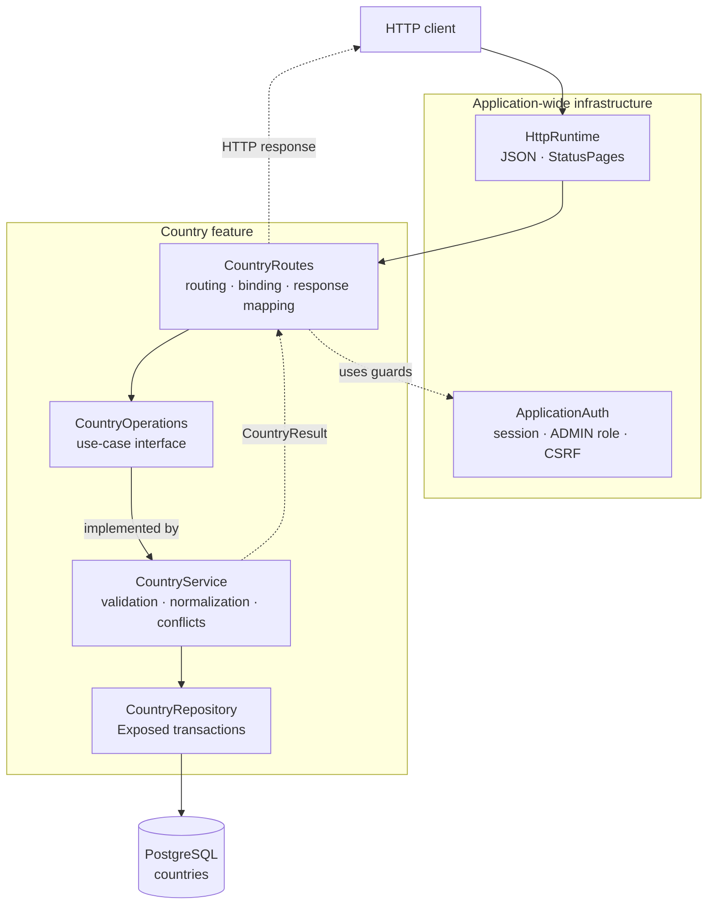

# Backend country package

This guide explains the Kotlin code in
[`backend/src/shop/voenix/country`](../../../backend/src/shop/voenix/country).
It is written for developers who are still learning Kotlin and Ktor.

## What this package does

The country package provides:

- a public, read-only list of countries and telephone dial codes;
- authenticated admin endpoints for listing, creating, reading, updating, and
  deleting countries;
- validation and normalization of country input; and
- PostgreSQL persistence through Exposed.

The HTTP adapter now uses ordinary Ktor routing and JSON binding. The feature
does not contain its own JSON scanner, route selector, or HTTP error hierarchy.
This keeps the package focused on country behavior.

Application-wide authentication remains in
[`shop.voenix.auth`](../../../backend/src/shop/voenix/auth). Shared JSON and
exception-to-response handling lives in
[`shop.voenix.http`](../../../backend/src/shop/voenix/http). Database startup
and existing-schema adoption live in
[`shop.voenix.db`](../../../backend/src/shop/voenix/db).

## The five-minute mental model



Solid arrows show a request moving toward country behavior and the database.
Dotted arrows show a policy dependency or a typed result.

> **IntelliJ IDEA:** Rendering this diagram requires the separate
> [Mermaid plugin](https://plugins.jetbrains.com/plugin/20146-mermaid) and the
> Markdown preview pane. Install the plugin through **Settings | Plugins**, then
> select **Preview** or **Editor and Preview** in the Markdown editor.

The important boundaries are:

1. **`HttpRuntime` owns shared HTTP mechanics.** It installs JSON content
   negotiation and `StatusPages` once for the application.
2. **`ApplicationAuth` owns security policy.** It authenticates sessions,
   enforces the exact `ADMIN` role, and validates CSRF tokens.
3. **The route adapter owns HTTP.** It declares paths, runs the auth guards,
   binds `CountryInput`, and maps `CountryResult` to status codes.
4. **The service owns country rules.** It validates and normalizes each write
   exactly once and classifies database conflicts.
5. **The repository owns persistence.** It runs small Exposed transactions and
   returns stored `Country` values or affected-row counts.

## Application composition

[`Application.kt`](../../../backend/src/shop/voenix/Application.kt) installs the
three application concerns separately:

```kotlin
HttpRuntime.install(this)
ApplicationAuth.install(this, authSettings)
countryModule(database)
```

The country module has two entry points:

```kotlin
fun Application.countryModule(database: Database)

fun Application.countryModule(countries: CountryOperations)
```

The first overload creates `CountryRepository` and `CountryService`. The second
accepts the use-case interface directly, which lets route tests inject a small
stub. Neither overload installs shared plugins or accepts auth settings.

## The nine production files

The feature package deliberately contains only these nine Kotlin files:

```text
country/
|- Country.kt
|- PublicCountry.kt
|- CountryInput.kt
|- CountryOperations.kt
|- CountryResult.kt
|- CountryRoutes.kt
|- CountryService.kt
|- CountryRepository.kt
`- Countries.kt
```

Their responsibilities are:

- [`Country.kt`](../../../backend/src/shop/voenix/country/Country.kt) is both the
  stored domain value and the serializable admin response.
- [`PublicCountry.kt`](../../../backend/src/shop/voenix/country/PublicCountry.kt)
  is the public response without a database ID and with a dial code.
- [`CountryInput.kt`](../../../backend/src/shop/voenix/country/CountryInput.kt)
  is the shared create and update input.
- [`CountryOperations.kt`](../../../backend/src/shop/voenix/country/CountryOperations.kt)
  is the seam between HTTP and country behavior.
- [`CountryResult.kt`](../../../backend/src/shop/voenix/country/CountryResult.kt)
  is the closed set of success and failure results.
- [`CountryRoutes.kt`](../../../backend/src/shop/voenix/country/CountryRoutes.kt)
  contains the internal `CountryRoutes` object and HTTP mapping.
- [`CountryService.kt`](../../../backend/src/shop/voenix/country/CountryService.kt)
  implements the use cases, rules, and safe database-error handling.
- [`CountryRepository.kt`](../../../backend/src/shop/voenix/country/CountryRepository.kt)
  contains the Exposed queries and transactions.
- [`Countries.kt`](../../../backend/src/shop/voenix/country/Countries.kt) maps the
  existing PostgreSQL table.

The backend rule is **exactly one top-level type per Kotlin file**, with the file
named after that type. The lower file count comes from fewer concepts, not from
putting unrelated types into one large file.

## The country interface

`CountryOperations` exposes only feature types:

```kotlin
interface CountryOperations {
    suspend fun listPublic(): CountryResult<List<PublicCountry>>
    suspend fun listAdmin(): CountryResult<List<Country>>
    suspend fun get(id: Long): CountryResult<Country>
    suspend fun create(input: CountryInput): CountryResult<Country>
    suspend fun update(id: Long, input: CountryInput): CountryResult<Country>
    suspend fun delete(id: Long): CountryResult<Unit>
}
```

There are no Ktor request or response types in this interface. A future job,
command-line tool, or test can call it without pretending to be an HTTP request.

## Follow one create request

Consider an admin creating Denmark:

```json
{
  "name": " Denmark ",
  "countryCode": " dk "
}
```

The request follows this path:

1. `CountryRoutes` matches the canonical
   `POST /api/admin/countries` path.
2. Ktor authentication reads and validates the encrypted `voenix.auth` cookie.
3. `ApplicationAuth.requireAdmin` requires the exact `ADMIN` role.
4. `ApplicationAuth.requireCsrf` validates the `X-XSRF-TOKEN` header.
5. `call.receive<CountryInput>()` asks Ktor Content Negotiation to deserialize
   the JSON body.
6. `CountryService.create` validates both fields. If either field is invalid,
   it returns every field error in one `CountryResult.Invalid`.
7. The service trims the name and trims plus uppercases the code, producing
   `Denmark` and `DK`.
8. `CountryRepository.insert` writes the row in an Exposed transaction. The
   service turns a known unique-index violation into a named conflict result.
9. The route returns `201 Created`, the new `Country`, and the relative
   `Location` value `/api/admin/countries/{id}`.

The route does not repeat field validation. This is important: every adapter
gets the same rules because validation lives behind `CountryOperations` in the
service.

## HTTP API

| Method and path | Access | CSRF header | Success response |
| --- | --- | --- | --- |
| `GET /api/countries` | Public | No | `200` with a JSON array of `PublicCountry` |
| `GET /api/admin/countries` | Admin | No | `200` with a JSON array of `Country` |
| `POST /api/admin/countries` | Admin | Yes | `201` with `Country` and a relative `Location` header |
| `GET /api/admin/countries/{id}` | Admin | No | `200` with `Country` |
| `PUT /api/admin/countries/{id}` | Admin | Yes | `200` with `Country` |
| `DELETE /api/admin/countries/{id}` | Admin | Yes | `204` with no body |

The auth-owned `GET /api/antiforgery/token` endpoint supplies the CSRF token
used by admin write clients.

### Canonical paths and IDs

Routes use normal Ktor matching. Paths are case-sensitive and do not accept an
extra trailing slash. For example, `/api/countries` is valid, while
`/API/COUNTRIES` and `/api/countries/` return `404 Not Found`.

The `/{id}` path variable initially matches any single segment. The protected
handler performs security checks before converting that value with
`toLongOrNull()`:

```text
matched admin write -> authentication -> ADMIN role -> CSRF
                    -> ID conversion -> JSON binding -> country service
```

Therefore an anonymous request for
`/api/admin/countries/not-a-number` receives `401`, an authenticated non-admin
receives `403`, and an admin receives `400` with `Invalid country id`. For an
admin `PUT` or `DELETE`, CSRF is also checked before ID conversion. No country
operation runs for an invalid ID.

### Standard JSON binding

Create and update share this serializable input:

```kotlin
@Serializable
data class CountryInput(
    val name: String? = null,
    val countryCode: String? = null,
)
```

The nullable properties and defaults have a deliberate purpose. `{}` is valid
JSON and can be bound to `CountryInput`; the service can then return clear
errors for both missing fields.

The JSON contract follows the configured Ktor and kotlinx.serialization
behavior:

- requests use `application/json`;
- property names are case-sensitive, so `name` and `Name` are different;
- unknown properties are ignored because shared JSON configuration uses
  `ignoreUnknownKeys = true`;
- syntactically invalid JSON, wrong top-level values, and wrong field types
  produce a generic `400 Invalid request body`; and
- an unsupported or missing content type produces `415 Unsupported media type`.

There is no country-specific charset list or error-position reporting. Ktor's
configured converter owns decoding and binding.

## Admin and public representations

The two response types make the intended audience visible:

```text
Country:       id, name, countryCode
PublicCountry:     name, countryCode, dialCode
```

- Admin responses use `Country` directly and include the database ID.
- Public responses hide the ID, uppercase the country code, and use
  libphonenumber to add a dial code such as `+49` for `DE`.
- An unknown two-letter region is allowed but has `dialCode: null`. Validation
  checks the code's shape, not membership in an ISO list.
- Lists are ordered by stored `country_code`, then by `id`.
- List endpoints serialize the list itself. There is no surrounding object.

For example, the public endpoint starts like this:

```json
[
  {"name":"Austria","countryCode":"AT","dialCode":"+43"},
  {"name":"Belgium","countryCode":"BE","dialCode":"+32"}
]
```

## Results and HTTP errors

`CountryResult` keeps HTTP status decisions out of the service:

```kotlin
sealed interface CountryResult<out T> {
    data class Success<T>(val value: T) : CountryResult<T>
    data class Invalid(
        val errors: Map<String, List<String>>,
    ) : CountryResult<Nothing>

    data object NotFound : CountryResult<Nothing>
    data object NameConflict : CountryResult<Nothing>
    data object CodeConflict : CountryResult<Nothing>
    data object DatabaseError : CountryResult<Nothing>
}
```

Country failures, JSON-binding failures, unsupported media types, invalid IDs,
and CSRF failures use the shared
[`ApiError`](../../../backend/src/shop/voenix/http/ApiError.kt):

```kotlin
@Serializable
data class ApiError(
    val message: String,
    val errors: Map<String, List<String>> = emptyMap(),
)
```

A validation response is small and uses the same lower-camel-case names as the
request JSON:

```json
{
  "message": "Validation failed",
  "errors": {
    "name": ["Name is required"],
    "countryCode": ["Country code is required"]
  }
}
```

| Result or failure | HTTP status | `ApiError.message` |
| --- | --- | --- |
| `NotFound` | `404` | `Country not found` |
| `NameConflict` | `409` | `Country name already exists` |
| `CodeConflict` | `409` | `Country code already exists` |
| `Invalid` | `400` | `Validation failed`, with the field-error map |
| Invalid country ID | `400` | `Invalid country id` |
| Invalid JSON binding | `400` | `Invalid request body` |
| Unsupported content type | `415` | `Unsupported media type` |
| `DatabaseError` | `500` | `Internal server error` |

The response media type is `application/json`. Database messages, serializer
details, and internal exception text are never sent to the client.

Authentication and role failures intentionally retain their auth-owned
`AuthResponse` shape. See
[Authentication and authorization](authentication-and-authorization.md).

[`HttpRuntime`](../../../backend/src/shop/voenix/http/HttpRuntime.kt) installs
`StatusPages` for binding exceptions and as a final safety net for unexpected
errors. It logs unexpected failures server-side. A `CancellationException` is
always rethrown because cancellation is coroutine control flow, not an HTTP
failure.

## Validation and normalization

`CountryService` validates a create or update once before calling the
repository:

| Field | Rule | Normalization |
| --- | --- | --- |
| `name` | Required after trimming; at most 255 characters | Trim surrounding whitespace |
| `countryCode` | Required; exactly two ASCII letters | Trim and uppercase with `Locale.ROOT` |

All invalid fields are returned together in
`Map<String, List<String>>`. This is why `CountryInput` stays nullable but the
repository accepts only non-null, normalized strings: invalid values cannot
reach persistence.

Country names are unique without regard to case. Country codes are normalized
to uppercase before a write and are unique as stored values.

## Conflict handling and concurrency

The database's unique indexes are the authority for conflicts. The service does
not perform a separate "does this exist?" query before writing; such a query
would still race with another request.

When PostgreSQL reports SQL state `23505`, the service reads the reported
constraint or index name and classifies it:

| Conflict | Current index name | Adopted legacy name |
| --- | --- | --- |
| Case-insensitive country name | `ux_countries_name_lower` | `ix_countries_name_lower` |
| Country code | `ux_countries_country_code` | `uk_countries_country_code` |

This gives concurrent duplicate writes a reliable `NameConflict` or
`CodeConflict`. An unknown unique violation is not guessed: the full exception
is logged and the service returns `DatabaseError`.

After an insert, the service builds the returned `Country` from the generated ID
and the already-normalized values. An update checks its affected-row count and
then reads the current row for the response.

## Persistence and schema adoption

Flyway SQL migrations own the production schema. `Countries` maps the table for
queries; it does not create or alter production tables at startup.

`Database.SearchPath` selects the PostgreSQL schema used by JDBC, Flyway,
Exposed, and startup adoption. It defaults to `voenix` and can be overridden
with `DATABASE_SEARCH_PATH` or `Database__SearchPath`. The application supports
one lowercase schema identifier in that setting.

The `<configured schema>.countries` table contains:

| Column | PostgreSQL type | Notes |
| --- | --- | --- |
| `id` | `bigint` identity | Primary key |
| `name` | `varchar(255)` | Non-null; unique through `LOWER(name)` |
| `country_code` | `varchar(2)` | Non-null; unique |

[`V1__create_countries.sql`](../../../backend/resources/db/migration/V1__create_countries.sql)
creates the current indexes and seeds Germany, France, Italy, Austria, Belgium,
the Netherlands, Spain, and Sweden.

[`CountrySchemaCompatibility.kt`](../../../backend/src/shop/voenix/db/CountrySchemaCompatibility.kt)
remains intentionally outside the feature package. Before Flyway baselines a
pre-existing country schema, it verifies the table, columns, primary key,
foreign-key behavior, and either the current or legacy unique-index names. A
compatible schema keeps its existing rows and references. This startup safety
is separate from the simplified Country HTTP contract.

When the schema changes, add a new numbered Flyway migration. Do not edit an
already-applied migration to change an existing environment.

## Repository and coroutine behavior

Each repository operation runs one Exposed `suspendTransaction` on
`Dispatchers.IO`:

- the blocking JDBC driver does not occupy a coroutine worker intended for
  non-blocking work; and
- callers can write normal sequential Kotlin while the function suspends during
  database work.

`maxAttempts = 1` disables automatic transaction retries. One repository call
therefore has one observable result.

`CountryService` catches and logs database exceptions, then returns
`CountryResult.DatabaseError`. It always rethrows `CancellationException`.

## Kotlin concepts used here

- **`@Serializable`** lets Ktor and kotlinx.serialization convert
  `CountryInput`, `Country`, and `PublicCountry` to or from JSON.
- **Nullable properties** such as `String?` may contain a string or `null`.
  They let the service explain a missing input field as a domain validation
  error.
- **`data class`** generates value-based equality, `copy`, and a readable
  `toString` for value types.
- **`sealed interface`** limits the possible `CountryResult` implementations, so
  a route's `when` can cover every result.
- **`Nothing`** in `CountryResult<Nothing>` means a failure has no success value.
  The `out T` declaration lets the same failure be returned from any operation.
- **`suspend fun`** marks work that may pause without blocking the caller's
  thread.
- **`object`** declares one shared, stateless value. `CountryRoutes` groups the
  route installation code without creating instances.
- **`Locale.ROOT`** makes uppercasing deterministic instead of depending on the
  server's language.

## Tests and quality gate

Run backend commands from `backend/` with the repository's Kotlin Toolchain:

```sh
cd backend
./kotlin test
./kotlin check
```

`./kotlin check` is the required final quality gate. It runs tests and ktlint.
Integration tests use Testcontainers with `postgres:17-alpine`, so a
Docker-compatible container runtime must be available.

| Test | Main responsibility |
| --- | --- |
| [`CountryRouteSecurityAndValidationTest.kt`](../../../backend/test/shop/voenix/country/CountryRouteSecurityAndValidationTest.kt) | Canonical routing, security and ID ordering, standard JSON binding, `ApiError` mapping, and proving rejected requests do not reach country operations |
| [`CountryAdminCrudIntegrationTest.kt`](../../../backend/test/shop/voenix/country/CountryAdminCrudIntegrationTest.kt) | Authenticated and CSRF-protected CRUD, direct admin arrays, and relative `Location` against PostgreSQL |
| [`CountryPublicRouteIntegrationTest.kt`](../../../backend/test/shop/voenix/country/CountryPublicRouteIntegrationTest.kt) | Direct public arrays, sort order, seed data, canonical paths, and dial codes |
| [`CountryServiceIntegrationTest.kt`](../../../backend/test/shop/voenix/country/CountryServiceIntegrationTest.kt) | Complete validation maps, normalization, both conflict types, concurrency, and hidden database failures |
| [`ExistingSchemaAdoptionIntegrationTest.kt`](../../../backend/test/shop/voenix/ExistingSchemaAdoptionIntegrationTest.kt) | Safe legacy-schema adoption, conflict classification for legacy index names, and rejection of unknown unique constraints |

Route tests inject a `CountryOperations` stub. Database behavior is tested
against real PostgreSQL because unique expression indexes, SQL state `23505`,
and reported constraint names are PostgreSQL-specific.

## Safe change recipes

### Add a persisted country field

1. Add a new Flyway migration under `backend/resources/db/migration`.
2. Add the column mapping to `Countries` and the stored property to `Country`.
3. Decide whether the value also belongs in `PublicCountry`.
4. If clients may write it, add it to `CountryInput` and validate plus normalize
   it once in `CountryService`.
5. Update repository row mapping and write statements.
6. Update route, service, CRUD, migration, and schema-adoption tests as needed.
7. Update this guide and run `./kotlin check` from `backend/`.

### Add a country operation or endpoint

1. Add the use case to `CountryOperations` using feature types.
2. Implement it in `CountryService` and return `CountryResult`, not a Ktor type.
3. Add only the required persistence operation to `CountryRepository`.
4. Add the canonical Ktor route and decide whether it is public, an admin read,
   or an admin write.
5. For protected routes, use `ApplicationAuth.PROVIDER`, `requireAdmin`, and,
   for writes, `requireCsrf` before binding a body or calling the operation.
6. Extend the stub route tests and add a PostgreSQL integration test when
   persistence changes.
7. Update this guide and run `./kotlin check`.

### Change input or error behavior

Start with `CountryRouteSecurityAndValidationTest` and
`CountryServiceIntegrationTest`. Keep transport binding and domain validation
separate:

- `HttpRuntime` maps JSON conversion failures to generic `ApiError` responses;
- `CountryRoutes` binds input and maps results; and
- `CountryService` owns all field rules and returns `CountryResult.Invalid`.

Do not add a second parser or repeat service validation in the route.

## Contributor checklist

Before finishing a country-package change, verify that:

- the feature package still has at most ten production Kotlin files;
- create and update share `CountryInput`;
- admin output uses `Country`, public output uses `PublicCountry`, and lists are
  direct JSON arrays;
- routes use canonical paths and ordinary Ktor binding;
- security checks run before ID conversion, protected body binding, and country
  operations as appropriate;
- validation and normalization happen exactly once in `CountryService`;
- repository code does not decide HTTP status codes;
- known current and legacy unique-index names map to the correct conflict;
- unknown database failures are logged but not exposed;
- `CancellationException` is rethrown;
- existing-schema adoption and auth cookie behavior remain intact;
- production schema changes use a new Flyway migration;
- developer documentation remains current and beginner-oriented; and
- `./kotlin check` passes from `backend/`.
