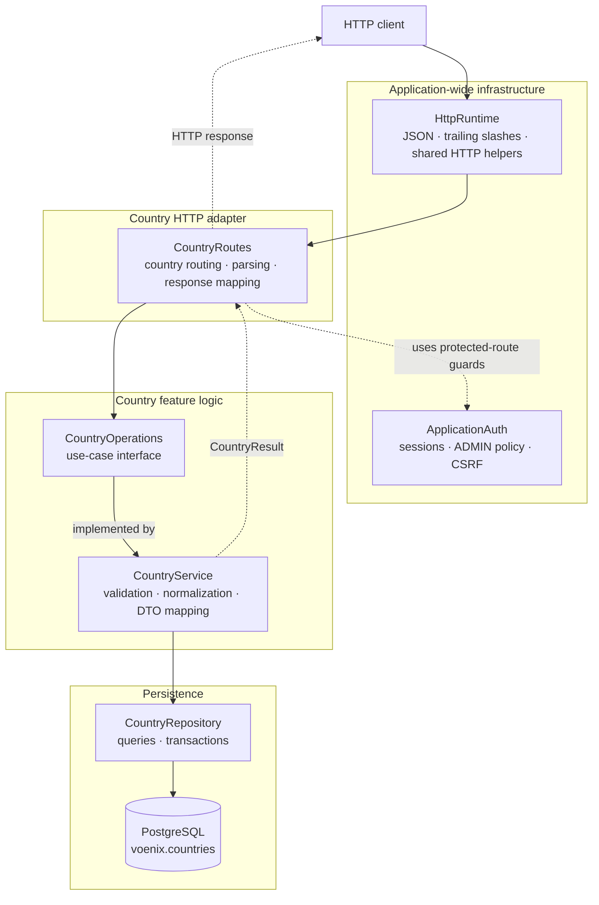

# Backend country package

This guide explains the Kotlin code in
[`backend/src/shop/voenix/country`](../../../backend/src/shop/voenix/country).
It is written for developers who are still learning Kotlin and Ktor.

## What this package does

The country package provides:

- a public, read-only list of countries and telephone dial codes;
- admin endpoints for listing, creating, reading, updating, and deleting
  countries;
- validation and normalization of country input;
- PostgreSQL persistence through Exposed; and
- HTTP and JSON behavior compatible with the backend that this Kotlin service
  replaces.

The package is a vertical slice: most code needed for the country feature lives
together instead of being split into global `controller`, `service`, and
`repository` directories.

Application-wide authentication is intentionally outside this package in
[`shop.voenix.auth`](../../../backend/src/shop/voenix/auth). Shared routing,
JSON, trace-ID, and HTTP-problem behavior lives in
[`shop.voenix.http`](../../../backend/src/shop/voenix/http). Country routes
consume those small interfaces without owning their implementation.

This package separation did not change the country API, security order, cookie
behavior, validation behavior, or database behavior.

## The five-minute mental model



Solid arrows show a country request moving toward feature behavior and the
database. Dotted arrows show a dependency or typed result rather than a direct
request step.

> **IntelliJ IDEA:** Rendering this diagram requires the separate
> [Mermaid plugin](https://plugins.jetbrains.com/plugin/20146-mermaid) and the
> Markdown preview pane. Install the plugin through **Settings | Plugins**, then
> select **Preview** or **Editor and Preview** in the Markdown editor.

The important boundaries are:

1. **The HTTP runtime is application-wide.** `HttpRuntime` installs shared JSON
   and optional-trailing-slash behavior once.
2. **Auth owns security policy.** `ApplicationAuth` authenticates sessions,
   enforces the exact `ADMIN` rule, and performs the complete CSRF check and
   rejection response.
3. **Country routes speak country HTTP.** They declare country paths, apply the
   auth guards, parse country bodies, and translate `CountryResult` values into
   HTTP responses.
4. **The service speaks country operations.** It validates, normalizes, checks
   conflicts, and maps stored countries to public or admin responses.
5. **The repository speaks PostgreSQL.** It runs Exposed queries and returns
   domain objects or affected-row counts.

[`Application.kt`](../../../backend/src/shop/voenix/Application.kt) composes
the layers at startup:

```kotlin
HttpRuntime.install(this)
ApplicationAuth.install(this, authSettings)
countryModule(database)
```

The country module itself has a smaller interface:

```kotlin
fun Application.countryModule(database: Database)

fun Application.countryModule(countries: CountryOperations)
```

The first overload creates a repository and service. The second accepts the
use-case interface directly, which lets route tests provide a small stub.
Neither overload accepts `AuthSettings` or installs application-wide Ktor
plugins.

## Follow one request through the code

Consider an admin creating Denmark with this body:

```json
{
  "name": " Denmark ",
  "countryCode": " dk "
}
```

The request follows this path:

1. [`CountryRoutes`](../../../backend/src/shop/voenix/country/CountryRoutes.kt)
   matches `POST /api/admin/countries`.
2. Ktor authentication, configured by `ApplicationAuth`, verifies that the
   encrypted `voenix.auth` cookie contains a non-expired `UserSession`.
3. `ApplicationAuth.requireAdmin` checks for the exact `ADMIN` role.
4. `ApplicationAuth.requireCsrf` checks the `X-XSRF-TOKEN` header against a
   token bound to the same user. It writes the standard rejection response if
   the token is missing or invalid.
5. `receiveValidatedFields` accepts a supported JSON content type, parses the
   body, and runs field validation.
6. `CountryService.create` normalizes the values to `Denmark` and `DK`, then
   checks for name and code conflicts.
7. `CountryRepository.insert` writes the row inside an Exposed transaction, and
   `find` reads it back.
8. The service returns `CountryResult.Success(AdminCountryDto(...))`.
9. The route returns `201 Created`, the JSON representation of the new country,
   and a `Location` header.

Notice that the route validates input and the service validates it again. This
is intentional. The route produces detailed HTTP validation responses, while
the service remains safe when called directly by a test, job, or future
non-HTTP adapter.

## HTTP API

All fixed route paths are case-insensitive and accept an optional trailing
slash. For example, `/API/COUNTRIES/` and `/api/countries` reach the same
handler. The fixed-path selector and trailing-slash configuration are shared
HTTP behavior rather than country-owned infrastructure.

| Method and path | Access | CSRF header | Success response | Route owner |
| --- | --- | --- | --- | --- |
| `GET /api/countries` | Public | No | `200` with `CountryListResponse` | Country |
| `GET /api/admin/countries` | Admin | No | `200` with `AdminCountryListResponse` | Country |
| `POST /api/admin/countries` | Admin | Yes | `201`, `AdminCountryDto`, and `Location` | Country |
| `GET /api/admin/countries/{id}` | Admin | No | `200` with `AdminCountryDto` | Country |
| `PUT /api/admin/countries/{id}` | Admin | Yes | `200` with `AdminCountryDto` | Country |
| `DELETE /api/admin/countries/{id}` | Admin | Yes | `204` with no body | Country |
| `GET /api/antiforgery/token` | Public | No | `200` with `{ "requestToken": "..." }` | Auth |

The antiforgery endpoint is included here because country admin clients use it,
but [`ApplicationAuth`](../../../backend/src/shop/voenix/auth/ApplicationAuth.kt)
installs and owns the route.

Only a path segment that can be parsed as a Kotlin `Long` matches `{id}`.
Malformed or overflowing IDs produce Ktor's normal `404` without entering the
authentication or country-operation code. The numeric selector remains
country-owned because no other feature currently needs it.

### Public and admin representations differ

The database model and the two API models serve different purposes:

```text
Country (database/domain)
|- AdminCountryDto: id, name, countryCode
`- CountryDto:      name, countryCode, dialCode
```

- Admin responses include the database ID and otherwise preserve stored values.
- Public responses hide the ID, uppercase the country code, and use
  libphonenumber to add a dial code such as `+49` for `DE`.
- An unknown two-letter region is allowed but has `dialCode: null`. Validation
  checks the shape of the code; it does not check membership in an ISO country
  list.
- Lists are ordered by stored `country_code`, then by `id`.

### Error mapping

The route converts the closed set of
[`CountryResult`](../../../backend/src/shop/voenix/country/CountryResult.kt)
values into HTTP responses:

| Result or failure | HTTP status | Response owner and shape |
| --- | --- | --- |
| `Success` | Depends on the operation | Country operation DTO |
| `NotFound` | `404` | Country `ProblemDetails` |
| `NameConflict` | `409` | Country `ProblemDetails` |
| `CodeConflict` | `409` | Country `ProblemDetails` |
| `DatabaseError` | `500` | Generic country `ProblemDetails`; database details are not leaked |
| Invalid country request body or fields | `400` | Country `ValidationProblemDetails` as `application/problem+json` |
| Missing or unsupported JSON content type | `415` | Shared `HttpProblemDetails` as `application/problem+json` |
| Missing authentication | `401` | Auth-owned `AuthResponse` |
| Authenticated without `ADMIN` | `403` | Auth-owned `AuthResponse` |
| Missing, stale, or wrong-user CSRF token | `400` | Auth-owned guard using shared `HttpProblemDetails` |

`CountryResult.Invalid` is useful when the service is called directly. If it
reaches the HTTP failure mapper, it becomes a `500`, because route validation
should already have rejected that input. Treat this as an invariant, not as the
normal validation path.

Validation and shared HTTP problem responses contain a W3C-style trace ID. A
valid `traceparent` request header keeps its trace portion and receives a new
span; otherwise the shared helper creates a fresh trace ID.

## File map

### Startup and feature boundary

- [`Application.kt`](../../../backend/src/shop/voenix/Application.kt) installs
  shared HTTP and auth behavior, creates the country repository and service,
  and installs country routes.
- [`CountryOperations.kt`](../../../backend/src/shop/voenix/country/CountryOperations.kt)
  is the interface used by the HTTP layer. Its `suspend` functions describe all
  supported country use cases.
- [`CountryResult.kt`](../../../backend/src/shop/voenix/country/CountryResult.kt)
  is a sealed result type shared by the country service and routes.

### Country HTTP layer

- [`CountryRoutes.kt`](../../../backend/src/shop/voenix/country/CountryRoutes.kt)
  declares country endpoints and maps between HTTP and feature types.
- [`CountryRequestParsing.kt`](../../../backend/src/shop/voenix/country/CountryRequestParsing.kt)
  implements the compatibility-sensitive JSON parser.
- [`LongPathSegmentRouteSelector.kt`](../../../backend/src/shop/voenix/country/LongPathSegmentRouteSelector.kt)
  only matches valid `Long` IDs.
- `ProblemDetails.kt` and `ValidationProblemDetails.kt` define country-owned
  error response bodies.

### Business and data types

- [`CountryService.kt`](../../../backend/src/shop/voenix/country/CountryService.kt)
  implements validation, normalization, conflicts, DTO mapping, and safe error
  handling.
- [`CountryValidation.kt`](../../../backend/src/shop/voenix/country/CountryValidation.kt)
  contains reusable validation and normalization functions.
- [`Country.kt`](../../../backend/src/shop/voenix/country/Country.kt) represents
  a stored country in application code.
- [`NormalizedCountry.kt`](../../../backend/src/shop/voenix/country/NormalizedCountry.kt)
  represents input after validation, trimming, and uppercasing.
- `CreateAdminCountryRequest.kt` and `UpdateAdminCountryRequest.kt` are service
  inputs. Their properties are nullable so missing JSON fields can be validated
  explicitly.
- `AdminCountryDto.kt`, `AdminCountryListResponse.kt`, `CountryDto.kt`, and
  `CountryListResponse.kt` are serializable response models.

### Persistence

- [`Countries.kt`](../../../backend/src/shop/voenix/country/Countries.kt) is the
  Exposed table mapping for `countries` in the configured database schema.
- [`CountryRepository.kt`](../../../backend/src/shop/voenix/country/CountryRepository.kt)
  contains all country queries and transaction handling.
- [`V1__create_countries.sql`](../../../backend/resources/db/migration/V1__create_countries.sql)
  creates the production table, unique indexes, and initial eight rows.
- [`CountrySchemaCompatibility.kt`](../../../backend/src/shop/voenix/db/CountrySchemaCompatibility.kt)
  is outside the feature package. It lets Flyway safely adopt a compatible
  country schema left by the former backend.

### Shared dependencies

- [`ApplicationAuth.kt`](../../../backend/src/shop/voenix/auth/ApplicationAuth.kt)
  exposes the provider, admin guard, CSRF header, and complete CSRF guard used
  by protected country routes.
- [`HttpRuntime.kt`](../../../backend/src/shop/voenix/http/HttpRuntime.kt)
  installs shared application-wide HTTP behavior.
- [`CaseInsensitivePathRouteSelector.kt`](../../../backend/src/shop/voenix/http/CaseInsensitivePathRouteSelector.kt)
  provides case-insensitive fixed paths to both auth and country routes.
- [`HttpProblemResponses.kt`](../../../backend/src/shop/voenix/http/HttpProblemResponses.kt)
  and [`Traceparent.kt`](../../../backend/src/shop/voenix/http/Traceparent.kt) provide
  the shared HTTP problem response and trace-ID behavior.

The auth module validates existing `UserSession` values; it does not verify
credentials or provide a production sign-in endpoint. Tests add `/test/sign-in`
routes only to create sessions for the scenario under test.

## Validation and normalization rules

[`countryValidationErrors`](../../../backend/src/shop/voenix/country/CountryValidation.kt)
enforces these rules before a write:

| Field | Rule | Normalization |
| --- | --- | --- |
| `name` | Required after trimming; at most 255 characters | Trim surrounding whitespace |
| `countryCode` | Required; exactly two ASCII letters | Trim and uppercase with `Locale.ROOT` |

Country names must be unique without regard to case. The service normalizes
country codes to uppercase before saving them. Unique database indexes enforce
case-insensitive name uniqueness and exact stored-code uniqueness, so
concurrent application requests cannot create duplicates.

Both unique indexes use the `ux_` prefix: `ux_countries_country_code` indexes a
column directly, while `ux_countries_name_lower` indexes the `LOWER(name)`
expression. PostgreSQL requires an index rather than a regular unique
constraint for expression-based uniqueness. V1 creates both indexes with the
consistent `ux_` convention directly.

The service performs friendly pre-write conflict checks, but those checks alone
would have a race condition: two requests could both see that a value is free.
If PostgreSQL then reports SQL state `23505` for a unique violation, the service
queries again and classifies the result as a name or code conflict.

The repository's name check uses PostgreSQL `ILIKE`. It escapes `\`, `%`, and
`_`, so user input is compared as a literal complete name rather than as a SQL
wildcard pattern.

## Why JSON parsing is more complicated than expected

For a new Ktor feature, a request is often parsed with `call.receive<MyDto>()`.
This package instead reads the body as text and examines its JSON structure.
That code preserves an existing external contract, including:

- case-insensitive property names (`name`, `Name`, and `NAME`);
- unknown properties being ignored;
- the last matching property winning when case variants are duplicated;
- specific errors for an empty body, `null`, a non-object top-level value,
  malformed JSON, and non-string fields; and
- error paths plus zero-based line and UTF-8 byte positions.

Accepted media types are `application/json`, `text/json`, and
`application/*+json`. With an explicit charset, only UTF-8, UTF-16, and UTF-16LE
are accepted.

Do not replace `CountryRequestParsing` with ordinary automatic deserialization
unless the API contract is intentionally changed and its contract tests are
updated at the same time.

## Authentication and CSRF dependency

`CountryRoutes` applies `ApplicationAuth.PROVIDER` and delegates the two policy
checks to `ApplicationAuth.requireAdmin` and `ApplicationAuth.requireCsrf`.
These checks run before protected request bodies are parsed or passed to the
country service.

The route pattern for an admin write is deliberately small:

```kotlin
authenticate(ApplicationAuth.PROVIDER) {
    post("/api/admin/example") {
        if (!ApplicationAuth.requireAdmin(call)) return@post
        if (!ApplicationAuth.requireCsrf(call)) return@post

        // Parse country input and call CountryOperations only after the guards.
    }
}
```

Country code must not read session cookies, compare tokens, or construct auth
and CSRF rejection payloads. See
[Authentication and authorization](authentication-and-authorization.md) for
the complete beginner-oriented explanation of sessions, principals, route
guards, cookies, renewal, configuration, shared HTTP behavior, and auth tests.

## Persistence and coroutine behavior

Flyway SQL migrations own the production schema. `Countries` maps the existing
table for queries; it must not be used to create or mutate the production
schema at startup.

Each repository method runs one Exposed `suspendTransaction` on
`Dispatchers.IO`. This has two useful effects:

- the blocking JDBC driver does not occupy a coroutine worker intended for
  non-blocking work; and
- callers can use normal sequential Kotlin while the function suspends during
  database work.

`maxAttempts = 1` disables automatic transaction retries. A caller therefore
receives one well-defined result for one repository call.

`CountryService` catches database exceptions, logs their details on the server,
and returns `CountryResult.DatabaseError`. It always rethrows
`CancellationException`: coroutine cancellation is a control signal and must
not be converted into an ordinary database failure.

## Kotlin concepts used here

The package is also a useful tour of common Kotlin backend patterns:

- **`data class`** generates value-based equality, `copy`, and readable
  `toString` methods. It is used for requests, domain values, and DTOs.
- **`object`** declares a single application-wide instance. `CountryRoutes` and
  the Exposed `Countries` table do not need separate instances.
- **`sealed interface`** limits implementations to a known set. A `when` over
  `CountryResult` can therefore be exhaustive without an `else` branch.
- **`Nothing`** in `CountryResult<Nothing>` means a failure contains no success
  value. Because the generic type is declared `out T`, the same failure object
  can be returned from an operation expecting any success type.
- **`suspend fun`** marks work that may pause without blocking its caller's
  thread. Routes, services, and repositories can call one another naturally.
- **Extension functions** add feature-specific operations to Ktor types. For
  example, `ApplicationCall.receiveCountryFields` reads like a built-in call
  method while remaining code owned by this package.
- **Companion objects** hold class-level constants and shared objects such as
  the service logger and libphonenumber utility.
- **`Locale.ROOT`** makes uppercasing deterministic instead of depending on the
  server's configured language.

The repository also requires exactly one top-level Kotlin type per file. A
class, data class, object, interface, sealed type, enum, or type alias must live
in a file named after that type. Top-level extension functions may share the
file with its one type, as the route-selector files demonstrate.

## Database schema

`Database.SearchPath` selects the PostgreSQL schema used by the JDBC connection,
Flyway, Exposed, and the existing-schema compatibility checks. It defaults to
`voenix` and can be overridden with `DATABASE_SEARCH_PATH` or
`Database__SearchPath`. The application currently supports one lowercase schema
identifier in the search path.

The `<configured schema>.countries` table contains:

| Column | PostgreSQL type | Notes |
| --- | --- | --- |
| `id` | `bigint` identity | Primary key |
| `name` | `varchar(255)` | Non-null; unique through `LOWER(name)` |
| `country_code` | `varchar(2)` | Non-null; unique |

The first migration seeds Germany, France, Italy, Austria, Belgium, the
Netherlands, Spain, and Sweden. Public dial codes are calculated when a response
is built; they are not stored in this table.

When the schema changes, add a new numbered Flyway migration. Do not edit an
already-applied migration merely to change an existing environment.

## Tests and how to run them

Run backend commands from `backend/` with the repository's Kotlin Toolchain,
not Gradle or Maven:

```sh
cd backend
./kotlin test
./kotlin check
```

`./kotlin check` is the required final quality gate. It runs the tests and
ktlint. The integration tests use Testcontainers with `postgres:17-alpine`, so
a Docker-compatible container runtime must be available.

The country test files divide responsibilities as follows:

| Test | Main responsibility |
| --- | --- |
| [`CountryRouteSecurityAndValidationTest.kt`](../../../backend/test/shop/voenix/country/CountryRouteSecurityAndValidationTest.kt) | Route matching, security-check ordering, JSON edge cases, result-to-HTTP mapping, trace IDs, and proving rejected requests never reach country behavior |
| [`CountryAdminCrudIntegrationTest.kt`](../../../backend/test/shop/voenix/country/CountryAdminCrudIntegrationTest.kt) | Full authenticated and CSRF-protected CRUD flow through auth, countries, and real PostgreSQL |
| [`CountryPublicRouteIntegrationTest.kt`](../../../backend/test/shop/voenix/country/CountryPublicRouteIntegrationTest.kt) | Public JSON, sort order, seed data, path compatibility, and dial codes |
| [`CountryServiceIntegrationTest.kt`](../../../backend/test/shop/voenix/country/CountryServiceIntegrationTest.kt) | Validation, normalization, conflicts, concurrency, and hidden database failures |

Auth-only behavior no longer needs a country stub. It is covered by
[`ApplicationAuthTest.kt`](../../../backend/test/shop/voenix/auth/ApplicationAuthTest.kt),
[`AuthCookieCompatibilityTest.kt`](../../../backend/test/shop/voenix/auth/AuthCookieCompatibilityTest.kt),
and [`AuthSettingsTest.kt`](../../../backend/test/shop/voenix/auth/AuthSettingsTest.kt).

Route tests still inject a stub implementation of `CountryOperations` when they
need to prove that an invalid or rejected request never reaches country
behavior. A focused protected-route setup installs the three layers explicitly:

```kotlin
HttpRuntime.install(this)
ApplicationAuth.install(this, AuthSettings("a-test-secret-at-least-32-bytes"))
countryModule(countries)
```

Service and repository behavior is tested against real PostgreSQL rather than
an in-memory database because this feature relies on PostgreSQL-specific
behavior such as `ILIKE`, functional indexes, and SQL state `23505`.

## Safe change recipes

### Add a persisted country field

1. Add a new Flyway migration under `backend/resources/db/migration`.
2. Add the column mapping to `Countries` and the property to `Country`.
3. Decide whether it belongs in the public DTO, admin DTO, or both.
4. If clients can write it, update both request types, `CountryRequestFields`,
   parsing, validation, and normalization.
5. Update repository row mapping and write statements.
6. Update service mapping and the relevant route, service, CRUD, and migration
   tests.
7. Update this guide and run `./kotlin check` from `backend/`.

### Add a country operation or endpoint

1. Add the use case to `CountryOperations`.
2. Implement it in `CountryService` and return a `CountryResult` instead of an
   HTTP type.
3. Add only the necessary query methods to `CountryRepository`.
4. Add the route and choose whether it is public, an admin read, or an admin
   write.
5. For protected routes, use `ApplicationAuth.PROVIDER`, `requireAdmin`, and,
   for writes, `requireCsrf`. Do not reproduce their behavior in country code.
6. Extend the stub route tests and add a real PostgreSQL integration test when
   persistence behavior changes.
7. Update this guide and run `./kotlin check` from `backend/`.

### Change validation or HTTP compatibility behavior

Start with the contract tests in `CountryRouteSecurityAndValidationTest` and
`CountryServiceIntegrationTest`. Error field names, messages, content types,
check ordering, property-name casing, trace IDs, and byte positions may be
observable by clients. Change them deliberately rather than as an incidental
refactor.

Application-wide JSON, trailing-slash, fixed-path, and shared problem behavior
belongs to `shop.voenix.http`. Authentication, role, cookie, and CSRF behavior
belongs to `shop.voenix.auth`. Country-specific request and result behavior
belongs here.

## Contributor checklist

Before finishing a country-package change, verify that:

- `countryModule` installs only country behavior and does not accept auth
  settings or install application-wide Ktor plugins;
- route code handles HTTP concerns but does not contain SQL;
- service code returns `CountryResult` and does not return Ktor response types;
- repository code does not decide HTTP status codes;
- writes validate and normalize before reaching PostgreSQL;
- admin routes use `ApplicationAuth` rather than reading sessions directly;
- admin writes require both the admin guard and the auth-owned CSRF guard;
- security checks run before protected body parsing and country operations;
- database exceptions are logged but not exposed to clients;
- `CancellationException` is rethrown;
- production schema changes use a new Flyway migration;
- developer documentation remains current and beginner-oriented;
- each Kotlin file contains exactly one top-level type and is named after it;
  and
- `./kotlin check` passes from `backend/`.
