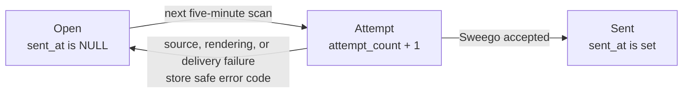

# Email module

The Email module renders and delivers the shop's transactional emails. It has
two deliberately different entry points:

- `UserEmailSender` sends an email directly for an interactive user action;
- `EmailOutbox` stores a durable business reference for unattended delivery.

Keeping these entry points separate prevents a confirmation or password-reset
link from accidentally entering the database, and prevents an Order or SFTP
notification from bypassing durable retries.

The Kotlin code lives in
[`backend/modules/email`](../../../backend/modules/email). The Flyway-owned
queue table is created by
[`V5__create_email_jobs.sql`](../../../backend/modules/platform/resources/db/migration/V5__create_email_jobs.sql).

## Package structure

The root package `shop.voenix.email` contains the public module interface:
message values, producer capabilities, settings, and runtime composition. A
caller therefore does not need to know how rendering, Sweego delivery, or the
durable worker are implemented.

The internal implementation is grouped by responsibility:

| Package | Responsibility |
| --- | --- |
| `shop.voenix.email.rendering` | Selects a template and turns typed email values into a provider-neutral message. |
| `shop.voenix.email.template` | Keeps one Kotlin template file per email type, including its subject, HTML, and plain text. |
| `shop.voenix.email.delivery` | Defines the internal delivery seam and implements its Sweego adapter. |
| `shop.voenix.email.outbox` | Persists, retries, and completes durable email jobs. |

These packages organize the implementation; they are not separate Kotlin
modules. The `email` compilation module remains the actual visibility boundary,
so its `internal` declarations can collaborate across all four packages but
cannot be imported by Auth, Order, SFTP, or the application module.

## The five-minute mental model

```mermaid
flowchart TB
    Auth["Interactive Auth operation"]
    Producer["Order or SFTP transaction"]
    Direct["UserEmailSender<br/>complete UserEmail"]
    Outbox["EmailOutbox<br/>typed reference"]
    Jobs[("PostgreSQL<br/>email_jobs")]
    Worker["EmailWorker<br/>scan + retry"]
    Source["QueuedEmailSource<br/>current business values"]
    Renderer["EmailRenderer<br/>HTML + plain text"]
    Delivery["EmailDelivery<br/>Sweego adapter"]
    Sweego["Sweego API"]

    Auth --> Direct --> Renderer
    Producer --> Outbox --> Jobs
    Jobs --> Worker
    Worker --> Source --> Worker
    Worker --> Renderer
    Renderer --> Delivery --> Sweego
```



The two paths deliberately meet only at rendering and delivery:

- the direct path carries a complete email, may contain a secret action URL,
  and never writes that email to the database;
- the queued path commits only a durable business reference with the producer's
  transaction. The worker resolves the current message values later.

`UserEmailSender` and `EmailOutbox` are the public capabilities. Rendering,
provider integration, job storage, and worker coordination remain internal to
the Email module.

## Direct user emails

The five `UserEmail` variants are account confirmation, change-email
confirmation, password reset, password-changed notification, and the warning
sent to the old address during an email change.

A future Auth operation creates a validated `EmailRecipient`, builds a complete
`EmailActionUrl`, and calls the capability:

```kotlin
userEmails.send(
    UserEmail.AccountConfirmation(
        recipient = EmailRecipient("customer@example.com"),
        confirmationUrl = EmailActionUrl(completeEncodedUrl),
    )
)
```

`EmailActionUrl.toString()` is redacted, so accidentally logging the value does
not reveal a confirmation or reset token. Email renders the URL, but never logs
or persists it.

When Email is disabled, a direct send is a no-op. When enabled, it makes exactly
one Sweego request. A successful call means that Sweego accepted the request;
it does not prove mailbox delivery. A provider or timeout failure becomes the
secret-free `EmailDeliveryException`. The owning Auth operation decides whether
that email is required or best effort.

## Durable queued emails

Only Order confirmations and producer PDF notifications use `EmailOutbox`.
The producer supplies one stable typed reference:

```kotlin
outbox.enqueue(QueuedEmailReference.OrderConfirmation(orderId))
```

This call must run inside the producer's existing Exposed transaction. Email
joins that transaction and never opens or commits an independent transaction.
If the business change rolls back, its Email job rolls back too.

The database stores the email kind and positive source ID as the job's business
identity. A unique database rule on this pair makes repeated enqueue calls
return the existing job ID. It does not store recipients, names, subjects,
template values, HTML, plain text, or Auth URLs.

## Worker lifecycle

`QueuedEmailSource` is implemented later by the Order and SFTP owning modules.
For every processing attempt it resolves the current recipient and current
business values. The worker then renders a fresh message and delivers it.
Changing an address before a retry, or deploying changed message copy, therefore
changes the next attempt without rewriting persisted message data.

The worker derives the only two job states from `sent_at`:

| State | Meaning |
| --- | --- |
| Open | `sent_at` is `NULL`; the next scan tries the job again. |
| Sent | `sent_at` is set after Sweego accepts the request. Mailbox delivery is not proven. |



One active Email worker scans all open jobs at the configured interval, five
minutes by default. Each attempted job increments `attempt_count`. A failure
leaves `sent_at` empty and stores only a bounded safe error code, so the next
scan retries it. There is no retry maximum or terminal failed state. When Email
is disabled, the worker does not scan and open jobs remain untouched.

This deliberately supports one active Email worker, not multiple application
instances processing jobs concurrently. Add claim coordination only when the
deployment actually needs more than one worker.

The queue guarantees at-least-once delivery, not exactly-once delivery. The
unique reference prevents duplicate jobs, but the worker cannot close the crash
window between Sweego acceptance and the `sent_at` update. A restart may
therefore send that job again. The stable `campaign-id` is correlation metadata,
not a claimed provider idempotency guarantee.

## Rendering and provider boundary

`EmailRenderer` selects a typed template and prepares presentation values such
as German dates and money. The templates live in `shop.voenix.email.template`:
each email type has one `*EmailTemplate.kt` file containing its subject, HTML,
and plain text. For example, the complete password-reset email lives in
`PasswordResetEmailTemplate.kt`.

HTML uses `kotlinx.html` directly, while plain text uses `buildString` through a
small shared text layout. The common branded HTML layout and its smaller
sections live beside the templates as ordinary Kotlin functions, not classpath
template resources.

Normal `kotlinx.html` text and attribute writes escape dynamic values. Keep
dynamic content on those normal DSL paths and do not introduce `unsafe` HTML.
The existing renderer tests cover escaping, complete action links, every email
variant, and the important German date and money formats. Subjects and both
bodies remain provider-neutral until the internal Sweego adapter builds its
JSON request.

The adapter always targets `https://api.sweego.io/send`, refuses redirects,
uses request/connect/socket timeouts of 30/10/30 seconds, and sends both HTML
and text with `campaign-type: transac`. It drains but does not parse, persist,
or log provider response bodies.

## Configuration

The safe committed defaults keep delivery disabled:

```yaml
Email:
  Enabled: false
  PollIntervalMinutes: 5
  ApiKey: ""
  FromEmail: ""
  FromName: "Voenix Shop"
```

The development launcher reads these environment variables:

```dotenv
EMAIL_ENABLED=false
EMAIL_POLL_INTERVAL_MINUTES=5
SWEEGO_API_KEY=
EMAIL_FROM_ADDRESS=
EMAIL_FROM_NAME='Voenix Shop'
```

API key and sender address are required only when `EMAIL_ENABLED=true`.
Configuration errors and `EmailSettings.toString()` never include the API key.
The polling interval must be between 1 and 1,440 minutes.

The application has the Email module dependency and installation seam, but it
does not start Email yet. Order and SFTP have not been migrated and cannot
supply a real `QueuedEmailSource`; installing a placeholder source would hide
missing product composition. Their deferred work is recorded in
[`email-post-migration.md`](../../migration/email-post-migration.md).

## Operations and manual cleanup

There is intentionally no public Email HTTP route, automatic cleanup worker,
or generic job framework. Operational logs use job ID, kind, attempt count,
outcome, and safe error code only.

Manual deletion has product consequences:

- deleting an open row cancels its future delivery;
- deleting a sent tombstone removes duplicate protection if the
  business event is replayed.

An authenticated operations UI, retry/cancel commands, alerts, and delivery
webhooks should be added only with a concrete support workflow.
