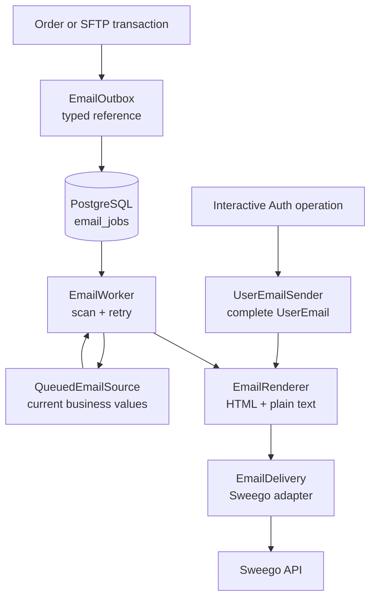
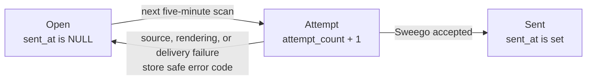

# Email module

The Email module renders and delivers the shop's transactional emails. It has
two deliberately different entry points:

- `UserEmailSender` sends an email directly for an interactive user action;
- `EmailOutbox` stores a durable business reference for unattended delivery.

Keeping these entry points separate prevents a confirmation or password-reset
link from accidentally entering the database, and prevents an Order or SFTP
notification from bypassing durable retries.

The Kotlin code lives in
[`backend/modules/email`](../../../backend/modules/email). The Flyway-owned
queue table is created by
[`V5__create_email_jobs.sql`](../../../backend/modules/platform/resources/db/migration/V5__create_email_jobs.sql).

## Package structure

The root package `shop.voenix.email` contains the public module interface:
message values, producer capabilities, settings, and runtime composition. A
caller therefore does not need to know how rendering, Sweego delivery, or the
durable worker are implemented.

The internal implementation is grouped by responsibility:

| Package | Responsibility |
| --- | --- |
| `shop.voenix.email.rendering` | Selects a template and turns typed email values into a provider-neutral message. |
| `shop.voenix.email.template` | Keeps one Kotlin template file per email type, including its subject, HTML, and plain text. |
| `shop.voenix.email.delivery` | Defines the internal delivery seam and implements its Sweego adapter. |
| `shop.voenix.email.outbox` | Persists, retries, and completes durable email jobs. |

These packages organize the implementation; they are not separate Kotlin
modules. The `email` compilation module remains the actual visibility boundary,
so its `internal` declarations can collaborate across all four packages but
cannot be imported by Auth, Order, SFTP, or the application module.

## Source files

Inside those packages the declarations are grouped by meaning, following
[Kotlin source file organization](source-file-organization.md). A file holds one
complete concern, so a small value or result type lives next to the component
that owns it instead of in a file of its own:

| File | Contents |
| --- | --- |
| `UserEmailSender.kt` | The direct-send capability, the six `UserEmail` variants it accepts, and the `EmailDeliveryException` it may throw. |
| `EmailOutbox.kt` | The queue capability, the `QueuedEmailReference` variants a producer enqueues, and the `QueuedEmailSource` seam the owning modules implement. |
| `QueuedEmail.kt` | The resolved queued messages with their addresses and items. It keeps a file of its own because its validation makes it large enough to be a concern by itself. |
| `EmailRecipient.kt` | The validated address value type, used by every other file. |
| `EmailActionUrl.kt` | The validated, self-redacting link value type, used by every other file. |
| `EmailSettings.kt` | Reading and validating the module's configuration. |
| `EmailService.kt` | The one implementation behind both public capabilities. |
| `EmailModule.kt` | The runtime handle plus `createEmailModule` and `installEmailModule`. |
| `rendering/EmailRenderer.kt` | The renderer, the `UserEmailRenderer` and `QueuedEmailRenderer` seams it implements, and the `RenderedEmail` result they return. |
| `delivery/EmailDelivery.kt` | The internal delivery seam and its `EmailDeliveryResult`. |
| `delivery/SweegoEmailDelivery.kt` | The Sweego adapter, its file-private client configuration `configureSweegoClient()`, and the `SweegoSendRequest` JSON body it sends. |
| `outbox/EmailJobRepository.kt` | The job repository, the `email_jobs` table object, and the internal `EmailJob` row type. |
| `outbox/EmailWorker.kt` | The scanning, retry, and completion loop. |
| `template/*.kt` | One file per email type, plus the shared `HtmlEmailLayout` and `TextEmailLayout`. |
| `template/EmailTemplateFormatting.kt` | The German presentation formatting: the `dd.MM.yyyy` date, money in cents as `12,34 €`, free shipping as `Kostenlos`, and a discount with its leading minus. |
| `template/EmailTemplateCopy.kt` | Sentences that more than one email says, currently the durable-link hint shared by the order confirmation and the shipping notification. |

## The five-minute mental model


```mermaid
flowchart TB
    Auth["Interactive Auth operation"]
    Producer["Order or SFTP transaction"]
    Direct["UserEmailSender<br/>complete UserEmail"]
    Outbox["EmailOutbox<br/>typed reference"]
    Jobs[("PostgreSQL<br/>email_jobs")]
    Worker["EmailWorker<br/>scan + retry"]
    Source["QueuedEmailSource<br/>current business values"]
    Renderer["EmailRenderer<br/>HTML + plain text"]
    Delivery["EmailDelivery<br/>Sweego adapter"]
    Sweego["Sweego API"]

    Auth --> Direct --> Renderer
    Producer --> Outbox --> Jobs
    Jobs --> Worker
    Worker --> Source --> Worker
    Worker --> Renderer
    Renderer --> Delivery --> Sweego
```

The two paths deliberately meet only at rendering and delivery:

- the direct path carries a complete email, may contain a secret action URL,
  and never writes that email to the database;
- the queued path commits only a durable business reference with the producer's
  transaction. The worker resolves the current message values later.

`UserEmailSender` and `EmailOutbox` are the public capabilities. Rendering,
provider integration, job storage, and worker coordination remain internal to
the Email module.

## Direct user emails

The six `UserEmail` variants are account confirmation, change-email
confirmation, password reset, the supplier invitation, the password-changed
notification, and the warning sent to the old address during an email change.

`SupplierInvitation` is the mail an administrator triggers when creating a
supplier login. It carries a set-password link, never a password, and it is a
variant of its own on purpose: it links to the same page as `PasswordReset`,
but the reset copy says "you requested this", which is wrong for someone who
was invited. One link, two different texts — so two templates.

A future Auth operation creates a validated `EmailRecipient`, builds a complete
`EmailActionUrl`, and calls the capability:

```kotlin
userEmails.send(
    UserEmail.AccountConfirmation(
        recipient = EmailRecipient("customer@example.com"),
        confirmationUrl = EmailActionUrl(completeEncodedUrl),
    )
)
```

`EmailActionUrl.toString()` is redacted, so accidentally logging the value does
not reveal a confirmation or reset token. Email renders the URL, but never logs
or persists it.

When Email is disabled, a direct send is a no-op. When enabled, it makes exactly
one Sweego request. A successful call means that Sweego accepted the request;
it does not prove mailbox delivery. A provider or timeout failure becomes the
secret-free `EmailDeliveryException`. The owning Auth operation decides whether
that email is required or best effort.

`EmailDeliveryException` is the *only* failure a caller may treat as "the email
provider let us down". It is the module's public promise, which is why its
constructor is public too: a test fake of `UserEmailSender` has to be able to
signal exactly this. Everything else that can escape a send — a rendering
failure, a malformed `EmailActionUrl` — is a bug, not an external dependency,
and callers must let it travel on to their own internal-failure path instead of
folding it into the same result. The account module does exactly that: it
catches `EmailDeliveryException` for its required mails and answers `502`,
while any other exception ends as a plain `500` (see
[`account-package.md`](account-package.md)).

## Durable queued emails

Four mails use `EmailOutbox`: the order confirmation, the producer PDF
notification, the shipping notification the customer receives when a package
leaves a supplier (issue #119), and — since the print-on-demand channel
(issue #205) — the operations alert that asks a human to look at one production
job. The producer supplies one stable typed reference — the Order ID for a
confirmation, the production delivery ID for a producer PDF notification, the
production **job** ID for a shipping notification and for an ops alert:

```kotlin
outbox.enqueue(QueuedEmailReference.OrderConfirmation(orderId))
outbox.enqueue(QueuedEmailReference.ProducerPdfNotification(deliveryId))
outbox.enqueue(QueuedEmailReference.ShippingNotification(jobId))
outbox.enqueue(QueuedEmailReference.SpodOpsAlert(jobId))
```

The ops alert is the one mail this shop sends to itself, to the configured
`production.spod.alertEmail`. Three situations enqueue it — the partner
cancelled the order, the partner flagged it as needing action, or the
submission stage quarantined the job as `OUTCOME_UNKNOWN` — and because all
three share the kind and the job id, an operator gets **one** mail per job
however many of them arrive. Its reason travels as a bounded enum
(`QueuedEmail.SpodOpsAlert.Reason`), so nothing a provider wrote can reach a
rendered mail.

The shipping notification is keyed by the job and not by the order on purpose:
an order can be split across suppliers, each split ships its own package, and
each package is its own mail. The unique `(kind, source_id)` rule therefore
means "one shipping mail per shipped job", which is exactly the business rule
the ship write needs.

This call must run inside the producer's existing Exposed transaction. Email
joins that transaction and never opens or commits an independent transaction.
If the business change rolls back, its Email job rolls back too.

Which business change that is, is the producer's decision. The shipping
notification belongs to the transaction that sets `production_jobs.shipped_at`
(see the [Production package](production-package.md)). Since issue #110 the
order confirmation is enqueued by the **placement** transaction, not by the
payment: the mail carries the customer's permanent link to their order
(`{frontend.baseUrl}/order/{token}`), and they need it whatever the payment then
does — a failed payment is exactly the case where they want to look. The
producer PDF notification is unchanged and belongs to its delivery. Details in
the [Order package](order-package.md).

The mail of an order carries its permanent link as an `EmailActionUrl` field on
`QueuedEmail.OrderConfirmation` — never as a `String`. The queued mail is a data
class, so its generated `toString` prints every field, and the value type is
what keeps a bearer link out of a log line. The HTML variant renders it as the
action button ("Bestellung ansehen") plus the copyable link, and the text
variant appends it; both carry the same sentence explaining that the mail is
worth keeping, that the link does not expire, and that whoever holds it can read
that one order. The wording is payment-neutral throughout, because the mail goes
out before anything is known about the payment.

The database stores the email kind and positive source ID as the job's business
identity. A unique database rule on this pair makes repeated enqueue calls
return the existing job ID. It does not store recipients, names, subjects,
template values, HTML, plain text, or Auth URLs.

A check constraint bounds the kind column to the kinds the application knows.
It lists four: `ORDER_CONFIRMATION`, `PRODUCER_PDF_NOTIFICATION`,
`SHIPPING_NOTIFICATION` (issue #119), and `SPOD_OPS_ALERT` (issue #205, added
by `V25__production_channel_reported_shipping.sql`, which replaces the
constraint `V5` created). Adding a kind therefore always means a migration that
rewrites that constraint.

On the Kotlin side those four names live in exactly one place: next to
`QueuedEmailReference` in `EmailOutbox.kt`, as the `kind` property (reference to
stored name) and `String.toQueuedEmailReference` (stored name back to
reference). The forward `when` is exhaustive over the sealed reference type, so
a new reference variant fails to compile until it has a stored name; the
reverse direction reads an arbitrary string and cannot be compile-checked, so
the kind round-trip test pins that every variant survives both directions, and
an unknown stored name fails loudly instead of being silently skipped.

## Worker lifecycle

`QueuedEmailSource` is implemented by the owning modules — Production resolves
`ProducerPdfNotification`, `ShippingNotification`, **and** `SpodOpsAlert`
references through one combined source (see the [Production package](production-package.md)) and Order
resolves `OrderConfirmation` references (see the
[Order package](order-package.md)). For every processing attempt it resolves the current
recipient and current business values. The worker then renders a fresh message and delivers it.
Changing an address before a retry, or deploying changed message copy, therefore
changes the next attempt without rewriting persisted message data.

The worker derives the only two job states from `sent_at`:

| State | Meaning |
| --- | --- |
| Open | `sent_at` is `NULL`; the next scan tries the job again. |
| Sent | `sent_at` is set after Sweego accepts the request. Mailbox delivery is not proven. |


```mermaid
flowchart LR
    Open["Open<br/>sent_at is NULL"]
    Attempt["Attempt<br/>attempt_count + 1"]
    Sent["Sent<br/>sent_at is set"]

    Open -->|"next five-minute scan"| Attempt
    Attempt -->|"source, rendering, or delivery failure<br/>store safe error code"| Open
    Attempt -->|"Sweego accepted"| Sent
```

One active Email worker scans all open jobs at the configured interval, five
minutes by default. It launches on `ApplicationStarted`, after the composition
root has installed every module and bound both branches of the aggregated
source, so the first scan never observes a partially wired
`QueuedEmailSource`. Application shutdown cancels the worker and closes the
Sweego client. Each attempted job increments `attempt_count`. A failure
leaves `sent_at` empty and stores only a bounded safe error code, so the next
scan retries it. There is no retry maximum or terminal failed state. When Email
is disabled, the worker does not scan and open jobs remain untouched.

This deliberately supports one active Email worker, not multiple application
instances processing jobs concurrently. Add claim coordination only when the
deployment actually needs more than one worker.

The queue guarantees at-least-once delivery, not exactly-once delivery. The
unique reference prevents duplicate jobs, but the worker cannot close the crash
window between Sweego acceptance and the `sent_at` update. A restart may
therefore send that job again. The stable `campaign-id` is correlation metadata,
not a claimed provider idempotency guarantee.

## Rendering and provider boundary

`EmailRenderer` selects a typed template and maps the typed email onto that
template's `Content`. The templates live in `shop.voenix.email.template`: each
email type has one `*EmailTemplate.kt` file containing its subject, HTML, and
plain text. For example, the complete password-reset email lives in
`PasswordResetEmailTemplate.kt`.

How dates and money read in German is owned by the template package, not by
the renderer. `EmailTemplateFormatting` turns dates and cent amounts into the
strings the templates print (`14.08.2026`, `12,34 €`, `Kostenlos` for free
shipping), and `EmailTemplateCopy` holds a sentence that two mails say the same
way, so the second copy cannot drift from the first. The renderer keeps the
arithmetic, such as multiplying a unit price by its quantity, and still
assembles the producer greeting from the optional producer name.

HTML uses `kotlinx.html` directly, while plain text uses `buildString` through a
small shared text layout. The common branded HTML layout and its smaller
sections live beside the templates as ordinary Kotlin functions, not classpath
template resources.

Normal `kotlinx.html` text and attribute writes escape dynamic values. Keep
dynamic content on those normal DSL paths and do not introduce `unsafe` HTML.
The existing renderer tests cover escaping, complete action links, every email
variant, and the important German date and money formats. Subjects and both
bodies remain provider-neutral until the internal Sweego adapter builds its
JSON request.

The adapter targets `https://api.sweego.io/send` (the fixed default of
`EmailSettings.sendUrl`) and sends both HTML and text with
`campaign-type: transac`. It drains but does not parse, persist, or log
provider response bodies.

The client's own settings live in the file-private `configureSweegoClient()`,
which holds everything about the client that is a decision rather than an
engine — no automatic success check, the JSON encoding rules,
`followRedirects = false`, and request/connect/socket timeouts of 30/10/30
seconds. The adapter builds its own client from it through two constructors. One takes just the settings
and uses the CIO engine a deployment runs on; the other takes an
`HttpClientEngine` a caller supplies — a test's `MockEngine` — and applies the
same configuration around it. Who owns the engine follows from which one was
used: an engine that came from a *factory* is Ktor's, so `close()` closes it
along with the client, while an engine *instance* stays the property of
whoever created it and `close()` leaves it alone. Because a test never rebuilds
the configuration, every test request runs the deployment's own: one test reads
the timeouts back off a request the adapter itself made (Ktor attaches them as
`HttpTimeoutCapability`), and another answers with a `302` and a `Location`
header and asserts that this becomes `PROVIDER_HTTP_302` after exactly one
request. Walking that redirect would replay the whole message, the API key
header included, against a URL the adapter never chose. Note what that test
pins and what it cannot: the reported outcome, not the flag. Ktor never walks a
redirect on a `POST` whatever `followRedirects` says, so for this adapter the
flag is a second lock, set because the reason is the adapter's own.

## Configuration

The safe committed defaults keep delivery disabled:

```yaml
email:
  enabled: false
  pollIntervalMinutes: 5
  apiKey: ""
  fromEmail: ""
  fromName: "Voenix Shop"
```

The development launcher reads these environment variables:

```dotenv
EMAIL_ENABLED=false
EMAIL_POLL_INTERVAL_MINUTES=5
SWEEGO_API_KEY=
EMAIL_FROM_ADDRESS=
EMAIL_FROM_NAME='Voenix Shop'
```

API key and sender address are required only when `EMAIL_ENABLED=true`.
Configuration errors and `EmailSettings.toString()` never include the API key.
The polling interval must be between 1 and 1,440 minutes.

The application installs and operates the Email module: `Application.kt` loads
`EmailSettings` before Flyway runs (an invalid enabled configuration fails the
startup cleanly), calls `installEmailModule` exactly once with the app-owned
`AggregatedQueuedEmailSource`, and hands only the exported `UserEmailSender`
and `EmailOutbox` capabilities to consuming modules. That aggregate has two
branches, one per owning module rather than one per kind: Production's combined
source (all three of its kinds) and, since the Order migration, the order
module's confirmation resolver. A branch
that is not bound yet fails retryably (`SOURCE_UNAVAILABLE`), which now only
covers the startup moment between the two installs. The remaining consumer work
is recorded in
[`email-post-migration.md`](../../migration/email-post-migration.md).

`EmailSettings` also has a `sendUrl` constructor parameter that is deliberately
never read from the application configuration: deployments always target the
Sweego default, while the application-composition test points the real adapter
at a local stub server so the quality gate never sends real email.

## Operations and manual cleanup

There is intentionally no public Email HTTP route, automatic cleanup worker,
or generic job framework. Operational logs use job ID, kind, attempt count,
outcome, and safe error code only.

Manual deletion has product consequences:

- deleting an open row cancels its future delivery;
- deleting a sent tombstone removes duplicate protection if the
  business event is replayed.

An authenticated operations UI, retry/cancel commands, alerts, and delivery
webhooks should be added only with a concrete support workflow.
