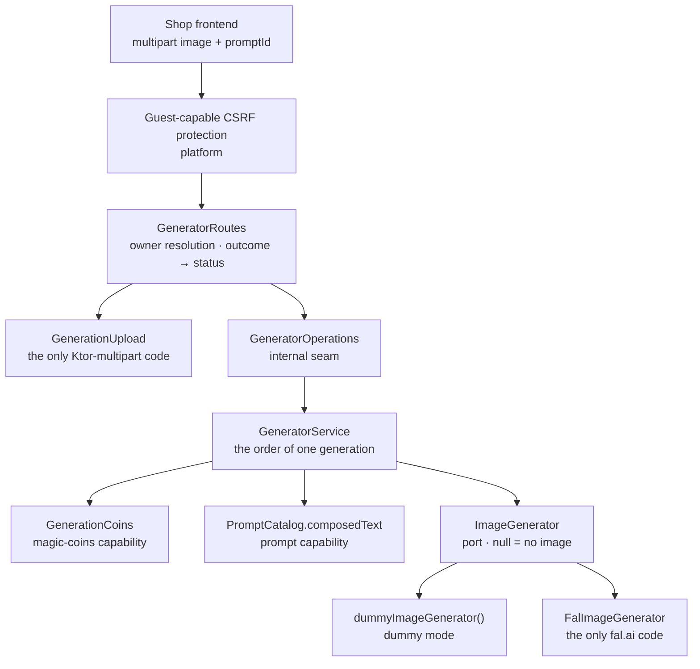

# Backend Generator package

This guide explains the Kotlin code in
[`backend/modules/generator/src/shop/voenix/generator`](../../../backend/modules/generator/src/shop/voenix/generator).

## What this package does

A visitor uploads a photo, picks a prompt, and gets an AI-generated image back.
That is the whole module: **one endpoint, one operation, no database table.**

```
POST /api/generator/generate   →   raw image bytes
```

Everything the endpoint needs it borrows from other modules:

- the prompt text comes from the prompt module's `PromptCatalog`;
- the coin balance comes from the magic-coins module's `GenerationCoins`;
- the visitor's identity comes from `platform` (session cookie or guest cookie);
- the generated image comes from fal.ai, over HTTP.

The module stores nothing. A generated image is answered and forgotten — it
becomes a durable object only when the customer later puts it into a cart, and
that is the cart module's print-image registry, not this one's.

The migration record with all decisions and approved deviations is
[`generator-migration.md`](../../migration/generator-migration.md).

## The five-minute mental model



Read the picture from the middle: `GeneratorService` is the only place that
knows *the order* of a generation, and it knows nothing about HTTP, multipart,
or fal.ai. Ktor lives in `GeneratorRoutes` and `GenerationUpload`, the network
lives in `FalImageGenerator`, and both are reachable from the service only
through small interfaces. That is why the service can be tested with three
plain fakes and no server at all.

## HTTP API

| Method and path | Auth | Body | Success |
| --- | --- | --- | --- |
| `POST /api/generator/generate` | anonymous **or** signed in, CSRF token required | `multipart/form-data` with a file part `image` and a form field `promptId` | `200` with the raw image bytes and the generated image's `Content-Type` |

There is no JSON envelope and no `Content-Disposition` header, because the
frontend store `frontend/src/stores/shop/imageGeneration.ts` reads the response
as a `Blob`. The failures are:

| Status | When | Body |
| --- | --- | --- |
| `400` | no `image` part, an empty one, one larger than 10 MiB, a content type that is not JPEG/PNG/WebP, or a missing/non-numeric `promptId` | `{"message": "Validation failed", "errors": {"image": ["…"]}}` |
| `402` | the visitor cannot afford a generation | `{"message": "Not enough Magic Coins", "code": "INSUFFICIENT_MAGIC_COINS"}` |
| `404` | the prompt is unknown, inactive, archived, or textless | `{"message": "Prompt not found"}` |
| `502` | fal.ai refused, answered without an image, answered unreadably, was unreachable, or the result could not be downloaded | `{"message": "Generator API error"}` |
| `500` | anything unexpected on our side, including a failing balance lookup | `{"message": "Internal server error"}` |

The `code` on the `402` is a contract: the storefront reads it to open its own
"buy more coins" dialog. Every other error is identified by its status alone.

## The order of one generation

`GeneratorService` runs five steps, and the order of the middle three is a
product decision rather than an implementation detail:

1. **Check the upload.** A rejected upload never touches the balance.
2. **Check the balance** through `GenerationCoins.hasEnoughForGeneration`.
3. **Load the prompt** through `PromptCatalog.composedText(promptId)`.
4. **Generate** through the `ImageGenerator` port.
5. **Spend one coin** through `GenerationCoins.trySpendForGeneration`.

The coin check happens *before* the prompt is loaded, so a visitor with an
empty balance is told so instead of being sent looking for a prompt they could
not use anyway. The spend happens *after* the generation, so nobody pays for an
image the provider never delivered.

Two details in that flow are easy to get wrong and are therefore worth reading
in the source:

- **A broken balance lookup is never an empty balance.**
  `hasEnoughForGeneration` answers an
  [`OperationResult`](operation-results.md), not a `Boolean`, precisely so that
  a database failure becomes a `500` instead of a `402`. Answering a defect on
  our side with "not enough Magic Coins" would ask the customer to pay for it.
- **The spend runs inside `withContext(NonCancellable)`.** When the visitor
  closes the tab, the request coroutine is cancelled, and every suspending step
  of an ordinary spend would abort. The one case in which that happens is the
  case where the image has already been produced *and paid for at the
  provider* — exactly the case that must be charged. If the spend still fails,
  the service only logs a warning: the image exists, and withholding it would
  punish the customer for a defect on our side.

`GenerationOutcome` is the sealed type carrying the five endings. The module
does not use the shared `OperationResult` for its own answers, because three of
them — a payment answer, an upstream answer, and an unusable prompt that is not
the missing resource of the request path — have no equivalent there.

## Who pays

The owner of the balance is resolved by the magic-coins module's public helper:

```kotlin
val owner = call.magicCoinsOwner(guestTokens)
```

A signed-in customer pays from their own balance; everyone else pays from the
balance behind the encrypted `voenix.guest` cookie, which is created on the
spot when the request does not carry a usable one. That rule exists exactly
once, in `magic-coins` — see the
[MagicCoins package guide](magic-coins-package.md) and
[Authentication and authorization](authentication-and-authorization.md).

## The upload: bounded while it arrives

`GenerationUpload` is the only file in the module that knows Ktor multipart. It
reads both parts in whatever order the client sent them, because a multipart
body has no required part order.

The image part is collected **chunk by chunk**, and collecting stops as soon as
the bytes would exceed 10 MiB. An oversized upload is therefore refused while it
is still arriving, and the server never holds a body it has already decided to
reject. Afterwards the remaining parts are read and thrown away: a client that
is still sending needs a reader on the other end, or the `400` never reaches it.

The part name `image` is also the field name of every rejection concerning it,
from one constant — so an error can never name a field the reader does not look
for. The image module's `FILE_PART_NAME` set that precedent; see the
[Image package guide](image-package.md).

## Dummy mode and the fal.ai adapter

`ImageGenerator` is a one-method port: an image and a prompt go in, an image
comes out, and `null` means "the provider did not deliver an image". Four very
different failures collapse into that one absent case, because the service can
do exactly one thing about any of them. The *reason* is logged where it is
known — inside the adapter.

There are two implementations, and the choice is made exactly once, at the
composition seam:

- **`dummyImageGenerator()`** hands the uploaded image straight back. It is a
  lambda, not a class, because that is all it does. The coin check and the spend
  still run: the point of dummy mode is to avoid provider cost, not to change
  what the endpoint does.
- **`FalImageGenerator`** is the only code in this backend that knows fal.ai.
  It posts the upload as a `data:` URI to
  `https://fal.run/fal-ai/nano-banana-2/edit` with the header
  `Authorization: Key <key>`, then downloads the image from the URL the answer
  names.

Four properties of the adapter are deliberate:

- **No retry.** Every attempt costs money, and a retry would pay twice for a
  call that may well have succeeded on the provider's side.
- **The download is treated as hostile.** The result URL must be HTTPS, the API
  key is never sent to the download host, and the body is collected chunk by
  chunk up to the same 10 MiB a visitor may upload.
- **The result content type is allowlisted.** What the provider reports is used
  only when it is JPEG, PNG, or WebP; anything else becomes `image/jpeg`.
- **Provider error bodies are not logged.** An error body is provider output and
  may quote back what was sent to it — including the key. Only the status is
  logged.

`aspect_ratio` is the constant `"16:9"`, kept from the legacy application. It is
recorded as an open product question for mug printing, not as a technical
choice.

## Configuration

Two keys, both read in `GeneratorSettings` before Flyway runs, so a bad
configuration fails startup cleanly without touching the database:

| Key | Environment variable | Default |
| --- | --- | --- |
| `Generator.DummyMode` | `GENERATOR_DUMMY_MODE` | `false` |
| `Generator.ApiKey` | `FAL_API_KEY` | empty |

A deployment that is not in dummy mode **must** carry an API key; without one,
startup fails with a clear message. The default is deliberately the strict one:
defaulting to dummy mode would let a deployment that forgot its key start up and
hand every customer their own photo back. Local development sets
`GENERATOR_DUMMY_MODE=true` — see
[Running the development server](running-the-development-server.md).

The fal.ai URL is a constructor override only, never a configuration key (the
`EmailSettings.sendUrl` precedent). Deployments always call fal.ai, adapter tests
point the client at a local stub, and no configuration mistake can make the
quality gate spend real money. `GeneratorSettings.toString()` never renders the
key.

## Composition

```kotlin
installGeneratorModule(generatorSettings, prompts, coins, guestTokens)
```

That public function is the module's whole seam. It picks the dummy generator or
the fal.ai adapter from the settings, assembles the service and routes behind the
internal `GeneratorModule` handle, and installs the routes under the guest-capable
CSRF protection. When the adapter is the real one, the handle also closes its
HTTP client on `ApplicationStopped` — the dummy has nothing to close.

The handle itself is `internal`, because the module exports **no capability**:
nothing in this backend asks the generator for anything, the storefront does.
See [Backend compile-time modules](module-architecture.md) for where the call
sits in the composition root.

## Tests and verification

The module has no table, so almost everything is proven without a database:

- [`GeneratorSettingsTest`](../../../backend/modules/generator/test/shop/voenix/generator/GeneratorSettingsTest.kt)
  — the API key is required unless dummy mode is on, the URL must be absolute,
  and the key never appears in `toString()`.
- [`GeneratorServiceTest`](../../../backend/modules/generator/test/shop/voenix/generator/GeneratorServiceTest.kt)
  — the five-step order through recording fakes; no spend on any failure path; a
  failed spend keeping the image; a broken balance lookup becoming a `500`; the
  content-type allowlist including its casing; a cancelled request still being
  charged.
- [`GenerationUploadTest`](../../../backend/modules/generator/test/shop/voenix/generator/GenerationUploadTest.kt)
  — both part orders, a missing and an empty image, a missing or unreadable
  prompt id, and an image one byte past the limit.
- [`GeneratorRoutesTest`](../../../backend/modules/generator/test/shop/voenix/generator/GeneratorRoutesTest.kt)
  — every outcome's status and body, including the `402` code string and the raw
  bytes of a success. Its CSRF test asserts that the operations stub was **not
  invoked**, which is what makes "rejected before anything happens" provable
  rather than a claim about a status code.
- [`FalImageGeneratorTest`](../../../backend/modules/generator/test/shop/voenix/generator/FalImageGeneratorTest.kt)
  — a `MockEngine` asserts the exact request fal.ai receives, and every way the
  provider can disappoint becomes an absent image.
- [`GenerationCoinsIntegrationTest`](../../../backend/modules/magic-coins/test/shop/voenix/magiccoins/GenerationCoinsIntegrationTest.kt)
  in `magic-coins` — the exported capability spends exactly one coin and refuses
  at zero, against real PostgreSQL.
- [`GeneratorCompositionIntegrationTest`](../../../backend/app/test/shop/voenix/GeneratorCompositionIntegrationTest.kt)
  in `app` — the composed application in dummy mode: multipart in, identical
  bytes out, guest cookie issued, and the balance really moving from 10 to 9 in
  the database.

No test ever calls the real fal.ai API. The URL is not configurable, and the
composition test runs in dummy mode.

Run the focused module tests from [`backend/`](../../../backend):

```sh
./kotlin do ktfmt
./kotlin test --include-module generator
```

## What is deliberately not here

- **No table, no repository, no Flyway migration.** The module is stateless.
- **No print-image registration.** A generated image becomes durable only when
  the customer adds it to a cart; that is the cart module's business.
- **No rate limiting.** Deleting the guest cookie grants a fresh starting
  balance, so the anonymous, cost-incurring endpoint can be used repeatedly. The
  legacy application had the same gap; closing it is an open product decision
  recorded in [`all-post-migration.md`](../../migration/all-post-migration.md).
- **No exception hierarchy.** The legacy `GeneratorException` family is replaced
  by the sealed `GenerationOutcome`.
