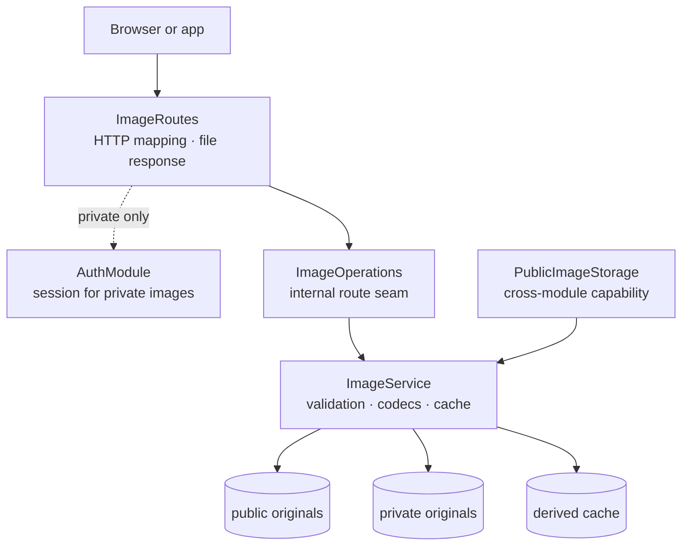

# Backend Image package

This guide explains the Kotlin code in
[`backend/modules/image/src/shop/voenix/image`](../../../backend/modules/image/src/shop/voenix/image).

## What this package does

The Image module reads JPEG, PNG, and WebP originals from configured local
directories, resizes them without cropping, writes derived files into a cache,
and serves those files through public and authenticated private routes. It also
exports `PublicImageStorage` so future Prompt and Article modules can store and
delete public images without knowing filesystem paths.

The first slice deliberately has no database table and no guest-image route.
Cart owns guest tokens, ownership records, and the future
`/api/images/guest/{size}/{id}` integration. The remaining consumer work is
tracked in
[`image-post-migration.md`](../../migration/image-post-migration.md).

## The five-minute mental model



`ImageService` is intentionally a deep module. Path containment, symbolic-link
checks, byte and pixel limits, decoding, resizing, encoding, cache freshness,
atomic publication, and cache cleanup stay together. A generic filesystem
interface would split those related rules without providing a second storage
adapter.

## Production file map

The package contains fourteen production types, with one top-level type per
file:

```text
image/
|- ImageCodec.kt
|- ImageFiles.kt
|- ImageModule.kt
|- ImageOperations.kt
|- ImageResource.kt
|- ImageRoutes.kt
|- ImageService.kt
|- ImageSettings.kt
|- ImageSize.kt
|- ImageUpload.kt
|- ImageVisibility.kt
|- PublicImageFolder.kt
|- PublicImageStorage.kt
`- StoredPublicImage.kt
```

- `ImageModule` is the internal runtime handle. `createImageModule` assembles
  one `ImageService`, and the public `installImageModule` composition function
  installs its routes and returns only `PublicImageStorage`.
- `ImageCodec` owns concrete JPEG/PNG/WebP inspection, decoding, and encoding.
  `ImageFiles` owns concrete safe-path, cache-file, and atomic-move operations.
  Both remain internal implementation collaborators, not generic adapter
  interfaces.
- `ImageOperations` and `ImageResource` are internal HTTP test and delivery
  seams. They never cross a compilation-module boundary.
- `PublicImageStorage`, `PublicImageFolder`, `ImageUpload`, and
  `StoredPublicImage` form the small public Kotlin API used by future consumer
  modules.
- `ImageSettings` validates and creates the three roots once during startup.
- `ImageSize` owns the `width` and `widthxheight` syntax and the fit-within
  resize rule.
- `ImageVisibility` selects the original root and HTTP cache policy.

The public storage API uses the shared `OperationResult<T>`. It does not expose
`Path`, Ktor multipart types, cache filenames, or codec-specific classes.

## Configuration and roots

The application reads three environment-backed values:

| Configuration | Environment variable | Development default |
| --- | --- | --- |
| `Image.PublicRoot` | `IMAGE_PUBLIC_ROOT` | `./data/images/public` |
| `Image.PrivateRoot` | `IMAGE_PRIVATE_ROOT` | `./data/images/private` |
| `Image.CacheRoot` | `IMAGE_CACHE_ROOT` | `./data/images/cache` |

Relative values are resolved once against the application's working directory.
Production deployments should use absolute mounted paths. Startup creates
missing directories and then converts each root to its real absolute path. It
fails when a root is a file, is not writable, or overlaps another root. The
service can therefore compare every later path against a stable boundary.

Public and private originals are authoritative. Cached files may be deleted at
any time and are recreated on demand.

## Delivery routes

| Method and path | Access | Successful cache policy |
| --- | --- | --- |
| `GET /api/images/public/{size}/{filename...}` | Anonymous | `public, max-age=86400` |
| `GET /api/images/private/{size}/{filename...}` | Any authenticated session | `private, max-age=3600` |

`size` is either one positive width such as `300` or a positive box such as
`300x200`. Each dimension is limited to 4096 pixels. The complete image is
scaled as large as possible inside the requested bounds while preserving its
aspect ratio; the operation does not crop or pad and may upscale a smaller
original.

The filename may contain safe nested forward-slash segments. Absolute paths,
empty segments, `.` and `..`, backslashes, unsupported extensions, and symbolic
links escaping the selected root are rejected. Only `.jpg`, `.jpeg`, `.png`,
and `.webp` delivery names are supported.

Successful responses use Ktor `LocalPathContent`. Route-scoped
`ConditionalHeaders` and `PartialContent` provide `Last-Modified`, ETag,
`304 Not Modified`, `Accept-Ranges`, and `206 Partial Content` behavior. Errors
use the shared `ApiError` JSON shape:

- invalid size, filename, or format returns `400`;
- a missing original returns `404` even when a stale cache file exists;
- an anonymous private request returns the auth-owned `401`; and
- an unexpected codec or I/O failure returns `500` without exposing paths or
  provider details.

## Decode and upload limits

Public storage accepts declared `image/jpeg`, `image/png`, or `image/webp`
content from 1 byte through 10 MiB. The declared type must match the format
detected from the bytes. A successful store ignores the source filename,
preserves the dimensions, and returns a generated lowercase UUID-style
`.webp` filename.

Before fully decoding an image, ImageIO reads its dimensions and rejects more
than 40,000,000 pixels. The two limits protect different resources:

- 10 MiB bounds request and compressed-buffer size;
- 40 megapixels bounds the main decoded pixel buffer, which alone can require
  about 160 MB at four bytes per pixel.

At most two decode/resize/encode jobs run at once in one application process.
This is a deliberately small safety limit for print-sized source images, not a
request limit. Requests for already-generated cache files do not consume a
processing slot.

## Cache and concurrency behavior

Derived paths are partitioned by visibility, canonical size, and relative
filename:

```text
cache/
|- public/<size>/<nested filename>
`- private/<size>/<nested filename>
```

Every read checks the original before checking the cache. A cached file is
fresh only when its modification time is at least the original's modification
time. Replacing an original at the same path therefore regenerates the derived
file on the next request.

Concurrent misses for one cache key share a keyed coroutine mutex and perform
a second freshness check inside the lock. Different keys may proceed
independently, subject to the two global processing slots. A derived image is
written to a unique temporary file in the destination directory and moved into
place with a required atomic filesystem move. If the filesystem cannot provide
that guarantee, the operation fails and removes the temporary file. Callers
never observe a partially encoded cache file, and unused keyed locks are
removed safely.

Deleting through `PublicImageStorage` is idempotent. It removes the public
original and every public size derivation for that folder and filename, so a
consumer never needs to know the cache layout. Deletion and final cache
publication share a per-original lock: a derivation that was already queued
cannot recreate cache content after deletion returns. The same publication
step rechecks the original's file identity, size, and modification time so a
concurrent replacement cannot mark stale pixels as fresh.

## Codecs and runtime

Scrimage `4.6.6` supplies immutable fit-within resizing. WebP ImageIO `0.11.0`
supplies native libwebp support for ImageIO. The module uses explicit output
settings: JPEG quality 85, PNG compression level 6, and lossy WebP quality 85
with alpha quality 100, method 4, threading, and Sharp YUV enabled.

The native codec was smoke-tested on macOS ARM and Linux ARM64 with JDK 25 in
the glibc-based Temurin image pinned by
`scripts/smoke-image-runtime-linux-arm64.sh`. The script loads the built Image
module JAR, calls the production `ImageCodec` and `ImageSize`, and verifies
JPEG, PNG, WebP, and fit-within resizing through the resolved runtime
dependencies. Alpine/musl is not an approved backend runtime for this module.
Deployments on JDK 25 should pass `--enable-native-access=ALL-UNNAMED` to the
JVM for the native codec.

## Tests and verification

- `ImageSizeTest` covers parsing boundaries, aspect ratios, box fitting, and
  upscaling.
- `PublicImageFolderTest` and `ImageSettingsTest` cover trusted construction
  and root startup rules.
- `ImageServiceTest` covers formats, visibility, traversal and symlink safety,
  cache hits and invalidation, concurrent misses, upload validation, public
  storage, deletion/generation races, concurrent source replacement, byte and
  pixel boundaries, lock cleanup, and cancellation.
- `ImageRoutesTest` covers anonymous versus authenticated access, shared error
  mapping, headers, conditional responses, and ranges.
- `ImageCodecRuntimeSmokeTest` proves JPEG, PNG, WebP, and Scrimage behavior on
  the JVM; the isolated Linux smoke test additionally proves the bundled
  native libwebp artifact on the approved runtime family.

Run focused feedback and then the complete backend gate from
[`backend/`](../../../backend):

```sh
./kotlin test --include-module image
./kotlin do ktfmt
./kotlin check
```

After building the app, the native Linux ARM64 check accepts the built module
JAR and the exact runtime dependency closure resolved by the toolchain:

```sh
scripts/smoke-image-runtime-linux-arm64.sh \
  build/tasks/_image_jarJvm/image-jvm.jar \
  /path/to/webp-imageio-0.11.0.jar \
  /path/to/scrimage-core-4.6.6.jar \
  /path/to/kotlin-stdlib-2.4.0.jar \
  /path/to/remaining-runtime.jar
```
