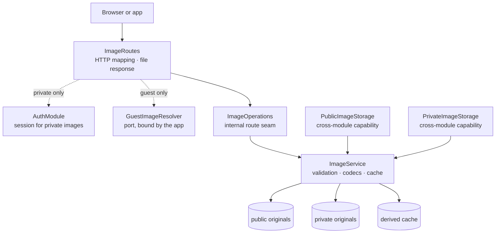

# Backend Image package

This guide explains the Kotlin code in
[`backend/modules/image/src/shop/voenix/image`](../../../backend/modules/image/src/shop/voenix/image).

## What this package does

The Image module reads JPEG, PNG, and WebP originals from configured local
directories, resizes them without cropping, writes derived files into a cache,
and serves those files through public, authenticated private, and guest routes.
It also exports two storage capabilities so other modules can store and delete
images without knowing filesystem paths — `PublicImageStorage` for images
anyone may see and `PrivateImageStorage` for print images only their owner may
see — plus the multipart reader those modules use to receive a pre-upload.
Article and Prompt use the public one for their example images; Cart uses the
private one for print images.

The module still has no database table. It does not know who owns a private
image: the guest route asks a `GuestImageResolver` that the owning module
implements and the composition root binds. The remaining consumer work is
tracked in
[`image-post-migration.md`](../../migration/image-post-migration.md).

## The five-minute mental model


```mermaid
flowchart TB
    Client["Browser or app"]
    Auth["AuthModule<br/>session for private images"]
    Routes["ImageRoutes<br/>HTTP mapping · file response"]
    Resolver["GuestImageResolver<br/>port, bound by the app"]
    Operations["ImageOperations<br/>internal route seam"]
    Service["ImageService<br/>validation · codecs · cache"]
    PublicStorage["PublicImageStorage<br/>cross-module capability"]
    PrivateStorage["PrivateImageStorage<br/>cross-module capability"]
    PublicRoot[("public originals")]
    PrivateRoot[("private originals")]
    CacheRoot[("derived cache")]

    Client --> Routes
    Routes -. private only .-> Auth
    Routes -. guest only .-> Resolver
    Routes --> Operations --> Service
    PublicStorage --> Service
    PrivateStorage --> Service
    Service --> PublicRoot
    Service --> PrivateRoot
    Service --> CacheRoot
```

`ImageService` is intentionally a deep module. Path containment, symbolic-link
checks, byte and pixel limits, decoding, resizing, encoding, cache freshness,
atomic publication, and cache cleanup stay together. A generic filesystem
interface would split those related rules without providing a second storage
adapter.

## Production file map

The package contains eighteen production types, with one top-level type per
file:

```text
image/
|- GuestImageResolver.kt
|- ImageCodec.kt
|- ImageFiles.kt
|- ImageModule.kt
|- ImageOperations.kt
|- ImageResource.kt
|- ImageRoutes.kt
|- ImageService.kt
|- ImageSettings.kt
|- ImageSize.kt
|- ImageUpload.kt
|- ImageVisibility.kt
|- PrivateImageStorage.kt
|- PublicImageFolder.kt
|- PublicImageStorage.kt
|- StoredPrivateImage.kt
|- StoredPublicImage.kt
`- UploadedImage.kt
```

- `ImageModule` is the runtime handle. `createImageModule` assembles one
  `ImageService`, and the public `installImageModule` composition function
  installs the public and private routes and returns the handle with its two
  storage capabilities. The handle is public because the composition root has
  to hand those capabilities to consumer modules and hand the module back to
  `installGuestImageRoute`.
- `ImageCodec` owns concrete JPEG/PNG/WebP inspection, decoding, and encoding.
  `ImageFiles` owns concrete safe-path, cache-file, and atomic-move operations.
  Both remain internal implementation collaborators, not generic adapter
  interfaces.
- `ImageOperations` and `ImageResource` are internal HTTP test and delivery
  seams. They never cross a compilation-module boundary.
- `PublicImageStorage`, `PublicImageFolder`, `ImageUpload`,
  `StoredPublicImage`, `PrivateImageStorage`, and `StoredPrivateImage` form the
  small public Kotlin API used by the consumer modules.
- `PrivateImageStorage` differs from the public capability in one way that
  matters: it names no folder. Private originals live in one image-owned
  directory (`print-images`) below the private root, so a caller hands over
  bytes and receives a file name, and hands a file name back to check or delete
  one. Only the guest route ever combines that folder with a name.
- `originalPaths(filenames)` is the one call that answers with `Path` values
  instead of names, and it exists for a consumer that has to *read* the bytes:
  the production PDF renders the print image of every ordered line. Without it
  the order module would have to know the private root and build the path
  itself — with it, it hands over the names it stored and receives ready paths,
  so the root, the folder, and the containment check stay here. Set in, map
  out, like `ArticleCatalog.find`: a deleted file, a name that never existed,
  and a name that is not a plain file name at all are all simply **absent**
  from the map, so a caller handles one case. The paths are a snapshot — the
  file may be deleted right after the call, so a reader still has to survive an
  unreadable path.
- `GuestImageResolver` is the port the guest route asks whether a caller owns a
  private image. It is defined here so image needs no dependency on the module
  that owns the ownership records, and it is deliberately blunt: image id plus
  whatever identity the request carried, in — stored file name or `null`, out.
  What the answer means is the other module's rule, and the cart's is worth
  knowing here: a guest token identifies an image only while it is unclaimed,
  and a claimed image belongs to its user — so a browser that keeps its guest
  cookie after a logout is answered `404` for the customer's uploads (see
  [the cart package guide](cart-package.md#who-a-cart-belongs-to)).
- `UploadedImage` and `receiveUploadedImage` belong to that API too. They read
  the `file` part of a multipart pre-upload request and answer with the image,
  "no `file` part", or "more bytes than the storage accepts". The reader stops
  taking bytes as soon as they would exceed `ImageUpload.MAX_BYTES`, so an
  oversized upload is refused while it is still arriving. It started as an
  article-local file and moved here when Prompt became the second consumer with
  the same policy: reading such a request is the image module's business, while
  the answer each route sends stays that route's own decision. It was called
  `ExampleImageUpload` until Cart became the third consumer and uploaded print
  images rather than examples.

  `respondUploadRejection` is the answer, and it is the same one everywhere:
  `400` with the message scoped to the `file` field. Joe decided this on
  2026-07-30, after the routes had disagreed — Cart answered `400`, while
  Prompt, MugArticle, and ArticleSubcategory answered `413 Payload Too Large`.

  Two things follow from that decision, and both are worth knowing before you
  add a fifth upload endpoint:

  - **`413` is not this layer's status.** It belongs to a body limit enforced
    before any handler runs, by Ktor or a reverse proxy. Everything the image
    pipeline itself refuses — no `file` part, too many bytes, unsupported
    format, empty, undecodable, too many pixels — is a rule of the pipeline and
    answers `400`. A client cannot act differently on the two anyway: both mean
    "show the customer what is wrong with the file they picked".
  - **The field name is the part name.** Both are `FILE_PART_NAME`, one public
    constant in `UploadedImage.kt`, so the field a client is told about cannot
    drift away from the part the reader actually looks for. This is why the
    field is `file` and not `image`: the older endpoints reported `image` while
    reading a part called `file`.

  So all four endpoints now answer a rejected upload identically, whether the
  reader refused it or the storage did:

  ```json
  { "message": "Validation failed", "errors": { "file": ["Image must not exceed 10 MiB"] } }
  ```
- `ImageSettings` validates and creates the three roots once during startup.
- `ImageSize` owns the `width` and `widthxheight` syntax and the fit-within
  resize rule.
- `ImageVisibility` selects the original root and HTTP cache policy.

The public storage API uses the shared `OperationResult<T>`. It exposes no Ktor
multipart types, cache filenames, or codec-specific classes, and the only
`Path` that ever leaves the module is the resolved original of
`PrivateImageStorage.originalPaths`. The rule behind that is precise: a
consumer may *receive* a path it has to read, it may never *derive* one — no
module outside Image knows a storage root or joins a folder with a file name.

## Configuration and roots

The application reads three environment-backed values:

| Configuration | Environment variable | Development default |
| --- | --- | --- |
| `Image.PublicRoot` | `IMAGE_PUBLIC_ROOT` | `./data/images/public` |
| `Image.PrivateRoot` | `IMAGE_PRIVATE_ROOT` | `./data/images/private` |
| `Image.CacheRoot` | `IMAGE_CACHE_ROOT` | `./data/images/cache` |

Relative values are resolved once against the application's working directory.
Production deployments should use absolute mounted paths. Startup creates
missing directories and then converts each root to its real absolute path. It
fails when a root is a file, is not writable, or overlaps another root. The
service can therefore compare every later path against a stable boundary.

Public and private originals are authoritative. Cached files may be deleted at
any time and are recreated on demand.

## Delivery routes

| Method and path | Access | Successful cache policy |
| --- | --- | --- |
| `GET /api/images/public/{size}/{filename...}` | Anonymous | `public, max-age=86400` |
| `GET /api/images/private/{size}/{filename...}` | Any authenticated session | `private, max-age=3600` |
| `GET /api/images/guest/{size}/{id}` | Whoever the resolver accepts | `private, max-age=3600` |

The guest route is installed by its own composition step,
`installGuestImageRoute(images, guestTokens, resolver)`, because the resolver
belongs to a module installed after image. It hangs on the same `/api/images`
routing node, so it inherits that node's conditional-header and range handling.

It is the one delivery route that is *not* inside an `authenticate` block: it
has to serve a guest who has no session at all. It reads whatever identity the
request happens to carry — a decryptable guest cookie through
`GuestTokens.tryGet`, which never creates one, and a logged-in user through the
session — and asks the resolver. Its rules:

- the resolver answers `null` → `404`, whether the image does not exist or
  belongs to somebody else, so an id cannot be probed for existence;
- a non-numeric id → `404` for the same reason;
- an owned image with an unparseable size → `400`;
- never a `Set-Cookie`: looking at an image must not create a guest session.

`size` is either one positive width such as `300` or a positive box such as
`300x200`. Each dimension is limited to 4096 pixels. The complete image is
scaled as large as possible inside the requested bounds while preserving its
aspect ratio; the operation does not crop or pad and may upscale a smaller
original.

The filename may contain safe nested forward-slash segments. Absolute paths,
empty segments, `.` and `..`, backslashes, unsupported extensions, and symbolic
links escaping the selected root are rejected. Only `.jpg`, `.jpeg`, `.png`,
and `.webp` delivery names are supported.

Successful responses use Ktor `LocalPathContent`. Route-scoped
`ConditionalHeaders` and `PartialContent` provide `Last-Modified`, ETag,
`304 Not Modified`, `Accept-Ranges`, and `206 Partial Content` behavior. Errors
use the shared `ApiError` JSON shape:

- invalid size, filename, or format returns `400`;
- a missing original returns `404` even when a stale cache file exists;
- an anonymous private request returns the auth-owned `401`; and
- an unexpected codec or I/O failure returns `500` without exposing paths or
  provider details.

## Decode and upload limits

Both storage capabilities share one write path, so their acceptance rules
cannot drift apart. They accept declared `image/jpeg`, `image/png`, or
`image/webp` content from 1 byte through 10 MiB. The declared type must match
the format detected from the bytes; GIF is rejected either way, on the declared
content type or while decoding. A successful store ignores the source filename,
preserves the dimensions, and returns a generated lowercase UUID-with-dashes
`.webp` filename.

Before fully decoding an image, ImageIO reads its dimensions and rejects more
than 40,000,000 pixels. The two limits protect different resources:

- 10 MiB bounds request and compressed-buffer size;
- 40 megapixels bounds the main decoded pixel buffer, which alone can require
  about 160 MB at four bytes per pixel.

Both are limits on what this module *processes*. What a client may put on the
wire at all is bounded once for the whole application, at 30,000,000 bytes, and
a body past that never reaches an upload route — see
[Request size limits](request-size-limits.md).

At most two decode/resize/encode jobs run at once in one application process.
This is a deliberately small safety limit for print-sized source images, not a
request limit. Requests for already-generated cache files do not consume a
processing slot.

## Cache and concurrency behavior

Derived paths are partitioned by visibility, canonical size, and relative
filename:

```text
cache/
|- public/<size>/<nested filename>
`- private/<size>/<nested filename>
```

Every read checks the original before checking the cache. A cached file is
fresh only when its modification time is at least the original's modification
time. Replacing an original at the same path therefore regenerates the derived
file on the next request.

Concurrent misses for one cache key share a keyed coroutine mutex and perform
a second freshness check inside the lock. Different keys may proceed
independently, subject to the two global processing slots. A derived image is
written to a unique temporary file in the destination directory and moved into
place with a required atomic filesystem move. If the filesystem cannot provide
that guarantee, the operation fails and removes the temporary file. Callers
never observe a partially encoded cache file, and unused keyed locks are
removed safely.

Deleting through either storage capability is idempotent. It removes the
original and every size derivation of the matching visibility, so a consumer
never needs to know the cache layout. Deletion and final cache
publication share a per-original lock: a derivation that was already queued
cannot recreate cache content after deletion returns. The same publication
step rechecks the original's file identity, size, and modification time so a
concurrent replacement cannot mark stale pixels as fresh.

## Codecs and runtime

Scrimage `4.6.6` supplies immutable fit-within resizing. WebP ImageIO `0.11.0`
supplies native libwebp support for ImageIO. The module uses explicit output
settings: JPEG quality 85, PNG compression level 6, and lossy WebP quality 85
with alpha quality 100, method 4, threading, and Sharp YUV enabled.

The native codec was smoke-tested on macOS ARM and Linux ARM64 with JDK 25 in
the glibc-based Temurin image pinned by
`scripts/smoke-image-runtime-linux-arm64.sh`. The script loads the built Image
module JAR, calls the production `ImageCodec` and `ImageSize`, and verifies
JPEG, PNG, WebP, and fit-within resizing through the resolved runtime
dependencies. Alpine/musl is not an approved backend runtime for this module.
Deployments on JDK 25 should pass `--enable-native-access=ALL-UNNAMED` to the
JVM for the native codec.

## Tests and verification

- `ImageSizeTest` covers parsing boundaries, aspect ratios, box fitting, and
  upscaling.
- `PublicImageFolderTest` and `ImageSettingsTest` cover trusted construction
  and root startup rules.
- `ImageServiceTest` covers formats, visibility, traversal and symlink safety,
  cache hits and invalidation, concurrent misses, upload validation, public
  storage, deletion/generation races, concurrent source replacement, byte and
  pixel boundaries, lock cleanup, and cancellation.
- `PrivateImageStorageTest` covers the print-image round trip through delivery
  and deletion, WebP normalization of all three accepted inputs, GIF rejection
  however it is offered, the byte and pixel limits, and file names that are not
  plain names.
- `ImageRoutesTest` covers anonymous versus authenticated access, shared error
  mapping, headers, conditional responses, and ranges.
- `GuestImageRouteTest` covers the guest route's ownership matrix against a
  fake resolver: guest owner and logged-in owner served, foreign, unknown, and
  non-numeric ids all a plain `404`, an invalid size a `400`, never a
  `Set-Cookie`, and the inherited conditional headers.
- `UploadedImageTest` covers the multipart reader: the `file` part with
  its content type, other parts skipped, a body without one, exactly the
  maximum accepted, and — the point of the reader — an oversized part refused
  before the source has offered all of its bytes.
- `ImageCodecRuntimeSmokeTest` proves JPEG, PNG, WebP, and Scrimage behavior on
  the JVM; the isolated Linux smoke test additionally proves the bundled
  native libwebp artifact on the approved runtime family.

Run focused feedback and then the complete backend gate from
[`backend/`](../../../backend):

```sh
./kotlin test --include-module image
./kotlin do ktfmt
./kotlin check
```

After building the app, the native Linux ARM64 check accepts the built module
JAR and the exact runtime dependency closure resolved by the toolchain:

```sh
scripts/smoke-image-runtime-linux-arm64.sh \
  build/tasks/_image_jarJvm/image-jvm.jar \
  /path/to/webp-imageio-0.11.0.jar \
  /path/to/scrimage-core-4.6.6.jar \
  /path/to/kotlin-stdlib-2.4.0.jar \
  /path/to/remaining-runtime.jar
```
