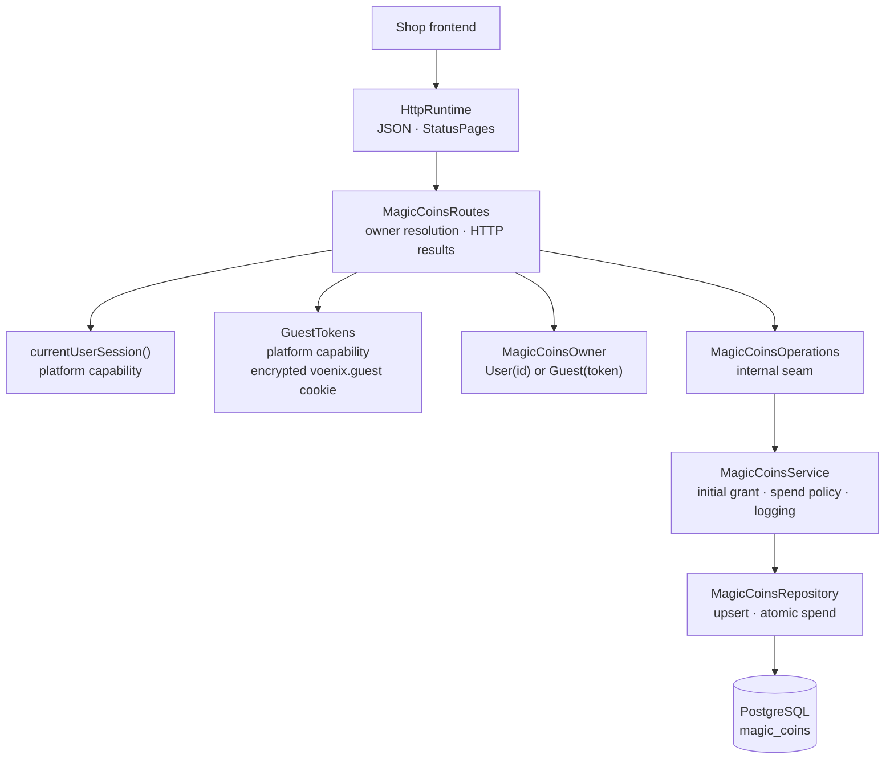

# Backend MagicCoins package

This guide explains the Kotlin code in
[`backend/modules/magic-coins/src/shop/voenix/magiccoins`](../../../backend/modules/magic-coins/src/shop/voenix/magiccoins).

## What this package does

Shop visitors pay for AI image generation with Magic Coins. Every visitor —
guest or signed-in customer — owns one coin balance. The MagicCoins package
provides the public balance endpoint, creates the balance with an initial
grant of 10 coins on first contact, and contains the atomic spend logic that
the future Generator module will use to charge 1 coin per generation.

The spend logic is deliberately `internal` and has no HTTP endpoint yet. It is
implemented and tested now so that the Generator migration only has to export
and wire it. The follow-up decisions are recorded in
[`magic-coins-migration.md`](../../migration/magic-coins-migration.md).

## The five-minute mental model



Reading a balance always works, even for a visitor the shop has never seen:
the repository creates the row with 10 coins when it does not exist yet.

## Who owns a balance

`MagicCoinsOwner` is a sealed interface with exactly two implementations:

- `MagicCoinsOwner.User(id)` for a signed-in customer. The route uses the
  platform helper `currentUserSession()` and accepts the session's user id
  only when it parses as a positive `Long`.
- `MagicCoinsOwner.Guest(token)` for everyone else. The token comes from the
  platform `GuestTokens` capability, which stores it in the encrypted,
  HttpOnly `voenix.guest` cookie (SameSite=Lax, 30 days, path `/api`). A
  missing, tampered, or undecryptable cookie simply produces a fresh guest —
  never an error.

Because the type is sealed, every `when` over an owner is complete at compile
time. There is no state where both or neither owner kind is set in Kotlin
code, and the database enforces the same rule with an XOR check constraint.

There is deliberately no balance merge when a guest later signs in; the .NET
source has none either.

## HTTP API

| Method and path | Auth | Success | Notes |
| --- | --- | --- | --- |
| `GET /api/magic-coins/balance` | anonymous | `200` `{"balance": <int>}` | Always sends `Cache-Control: no-store`; issues the guest cookie on first contact |

The response shape and route path match the .NET backend exactly, so the
existing frontend store `frontend/src/stores/shop/magicCoins.ts` works
unchanged. Unexpected database failures become the standard
`500` `{"message": "Internal server error"}` response; the .NET-specific `503`
mapping was an approved deviation.

## Persistence: let PostgreSQL resolve the races

Two visitors — or two browser tabs — can hit the balance endpoint at the same
moment. The package pushes both race conditions into single SQL statements
instead of application-level locking:

- **Get-or-create** runs `INSERT … ON CONFLICT DO NOTHING` (Exposed's
  `insertIgnore`) followed by a select. When two requests race, the partial
  unique indexes let exactly one insert win and both requests read the same
  row afterwards.
- **Spend** runs `UPDATE magic_coins SET balance = balance - 1 WHERE … AND
  balance >= 1` and judges success by the affected-row count. With 1 coin left
  and two concurrent spends, PostgreSQL serializes the row update, the second
  update matches zero rows, and the balance can never go negative. The
  `balance >= 0` check constraint is the final safety net.

The check-then-spend flow around a future generation is deliberately not one
transaction. That preserves the .NET product decision: a failed deduction
after a successful generation only logs a warning or error with owner context
(a free generation is acceptable; a paid failure is not).

The `magic_coins` table is created by the Flyway migration
[`V10__create_magic_coins.sql`](../../../backend/modules/platform/resources/db/migration/V10__create_magic_coins.sql).
`user_id` has no foreign key yet because the Kotlin schema has no `users`
table; the relationship arrives with the Auth/User migration.

## Runtime composition

`MagicCoinsModule`, `createMagicCoinsModule`, and
`Application.installMagicCoinsModule` follow the standard module composition.
Only the installation function is public; it takes the shared `Database` and a
platform `GuestTokens` instance:

```kotlin
installMagicCoinsModule(database, GuestTokens(authSettings))
```

Everything else in the package — the table object, repository, service,
operations interface, routes, and the response model — is `internal`. The
constants (initial balance 10, generation cost 1) are implementation details
of `MagicCoinsService`.

## Tests and verification

All behavior is proven against real PostgreSQL through the shared
Testcontainers fixture:

- [`MagicCoinsBalanceRouteIntegrationTest`](../../../backend/modules/magic-coins/test/shop/voenix/magiccoins/MagicCoinsBalanceRouteIntegrationTest.kt)
  covers the response contract, the `no-store` header, the initial grant, the
  stable balance on repeated reads, guest-cookie issuance, the
  tampered-cookie fallback, user-owned balances, the guest fallback for
  non-numeric session user ids, and concurrent first requests creating
  exactly one row.
- [`MagicCoinsSpendIntegrationTest`](../../../backend/modules/magic-coins/test/shop/voenix/magiccoins/MagicCoinsSpendIntegrationTest.kt)
  calls the internal service directly: successful spend, refusal at zero
  balance, and concurrent spends with 1 coin left where exactly one wins.
- [`MagicCoinsSchemaIntegrationTest`](../../../backend/modules/magic-coins/test/shop/voenix/magiccoins/MagicCoinsSchemaIntegrationTest.kt)
  proves the XOR owner constraint, the non-negative balance constraint, and
  both partial unique indexes.
- [`GuestTokensTest`](../../../backend/modules/platform/test/shop/voenix/auth/GuestTokensTest.kt)
  in `platform` covers the guest-cookie round-trip, its attributes, and the
  fresh-guest fallback for undecryptable cookies.

Run the quality gate from [`backend/`](../../../backend):

```sh
./kotlin do ktfmt
./kotlin check
```
