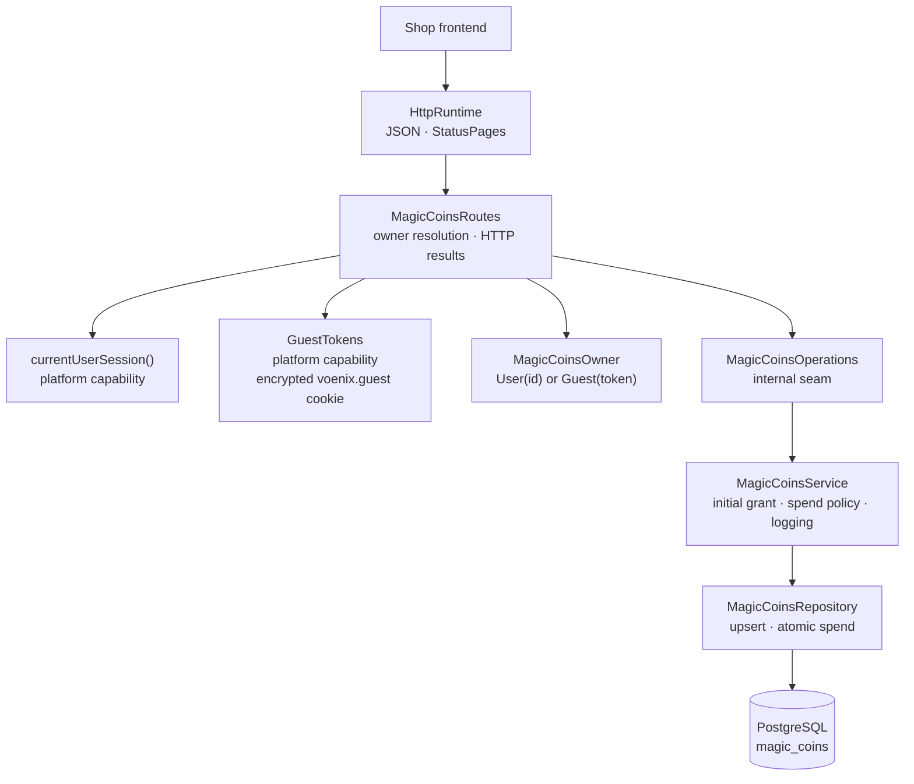

# Backend MagicCoins package

This guide explains the Kotlin code in
[`backend/modules/magic-coins/src/shop/voenix/magiccoins`](../../../backend/modules/magic-coins/src/shop/voenix/magiccoins).

## What this package does

Shop visitors pay for AI image generation with Magic Coins. Every visitor —
guest or signed-in customer — owns one coin balance. The MagicCoins package
provides the public balance endpoint, creates the balance with an initial
grant of 10 coins on first contact, and contains the atomic spend logic the
Generator module charges 1 coin per generation with.

The spend logic has no HTTP endpoint of its own. It leaves the module through
the exported `GenerationCoins` capability, which the Generator migration of
2026-07-30 bound to its only consumer (see
[`generator-package.md`](generator-package.md) and
[`magic-coins-migration.md`](../../migration/magic-coins-migration.md)).

## The five-minute mental model


```mermaid
flowchart TB
    Client["Shop frontend"]
    Http["HttpRuntime<br/>JSON · StatusPages"]
    Routes["MagicCoinsRoutes<br/>owner resolution · HTTP results"]
    Session["currentUserSession()<br/>platform capability"]
    Guest["GuestTokens<br/>platform capability<br/>encrypted voenix.guest cookie"]
    Owner["MagicCoinsOwner<br/>User(id) or Guest(token)"]
    Operations["MagicCoinsOperations<br/>internal seam"]
    Service["MagicCoinsService<br/>initial grant · spend policy · logging"]
    Repository["MagicCoinsRepository<br/>upsert · atomic spend"]
    Table[("PostgreSQL<br/>magic_coins")]

    Client --> Http --> Routes
    Routes --> Session
    Routes --> Guest
    Routes --> Owner
    Routes --> Operations
    Operations --> Service
    Service --> Repository
    Repository --> Table
```

Reading a balance always works, even for a visitor the shop has never seen:
the repository creates the row with 10 coins when it does not exist yet.

## Who owns a balance

`MagicCoinsOwner` is a **public** sealed interface with exactly two
implementations. It is public because it is the parameter of the exported
capability below: a module that charges coins has to name the owner it charges.
Its two cases carry nothing but that identity, so nothing about how balances are
stored leaves the module with them.

- `MagicCoinsOwner.User(id)` for a signed-in customer. The route uses the
  platform helper `currentUserSession()` and accepts the session's user id
  only when it parses as a positive `Long`.
- `MagicCoinsOwner.Guest(token)` for everyone else. The token comes from the
  platform `GuestTokens` capability, which stores it in the encrypted,
  HttpOnly `voenix.guest` cookie (SameSite=Lax, 30 days, path `/api`). A
  missing, tampered, or undecryptable cookie simply produces a fresh guest —
  never an error.

Because the type is sealed, every `when` over an owner is complete at compile
time. There is no state where both or neither owner kind is set in Kotlin
code, and the database enforces the same rule with an XOR check constraint.

There is deliberately no balance merge when a guest later signs in; the .NET
source has none either.

The rule for turning a request into an owner lives in exactly one place, the
public helper next to the type:

```kotlin
public fun ApplicationCall.magicCoinsOwner(guestTokens: GuestTokens): MagicCoinsOwner
```

The balance route uses it, and so does the Generator. Without it the two would
each carry their own copy of "signed-in user, else a guest cookie created on the
spot", and the copies would drift — a session user id that is not a positive
number would fall back to the guest path in one module and not in the other.

## The exported GenerationCoins capability

`GenerationCoins` is the one capability this module exports: what a module that
runs a paid AI image generation may do with a visitor's balance.

```kotlin
public interface GenerationCoins {
    public suspend fun hasEnoughForGeneration(owner: MagicCoinsOwner): OperationResult<Boolean>
    public suspend fun trySpendForGeneration(owner: MagicCoinsOwner): Boolean
}
```

The two return types are different on purpose:

- `hasEnoughForGeneration` answers an
  [`OperationResult`](operation-results.md), so a database failure can never
  reach the caller as "no balance". Answering a broken database with "not enough
  Magic Coins" would charge a customer for a defect that is not theirs.
- `trySpendForGeneration` answers a plain `Boolean`, because the caller can do
  exactly one thing about any negative outcome — an empty balance and a database
  failure alike: log it and keep the image it has already produced. A richer
  failure type would be a distinction without a consequence; the reason is logged
  with the owner context inside this module.

There is deliberately **no combined check-and-spend**. The expensive external
generation call sits between the two, so combining them would either pull the
image provider into this module or hold a database transaction open across a
long network call. Exact accounting under concurrency would need a
reserve/commit model, which is out of scope; the reasoning is recorded in
[`generator-migration.md`](../../migration/generator-migration.md).

Reading a balance is not part of the capability. It stays internal, because this
module owns the only endpoint that reports it.

## HTTP API

| Method and path | Auth | Success | Notes |
| --- | --- | --- | --- |
| `GET /api/magic-coins/balance` | anonymous | `200` `{"balance": <int>}` | Always sends `Cache-Control: no-store`; issues the guest cookie on first contact |

The response shape and route path match the .NET backend exactly, so the
existing frontend store `frontend/src/stores/shop/magicCoins.ts` works
unchanged. Unexpected database failures become the standard
`500` `{"message": "Internal server error"}` response; the .NET-specific `503`
mapping was an approved deviation.

## Persistence: let PostgreSQL resolve the races

Two visitors — or two browser tabs — can hit the balance endpoint at the same
moment. The package pushes both race conditions into single SQL statements
instead of application-level locking:

- **Get-or-create** runs `INSERT … ON CONFLICT DO NOTHING` (Exposed's
  `insertIgnore`) followed by a select. When two requests race, the partial
  unique indexes let exactly one insert win and both requests read the same
  row afterwards.
- **Spend** runs `UPDATE magic_coins SET balance = balance - 1 WHERE … AND
  balance >= 1` and judges success by the affected-row count. With 1 coin left
  and two concurrent spends, PostgreSQL serializes the row update, the second
  update matches zero rows, and the balance can never go negative. The
  `balance >= 0` check constraint is the final safety net.

The check-then-spend flow around a generation is deliberately not one
transaction. That preserves the .NET product decision: a failed deduction
after a successful generation only logs a warning or error with owner context
(a free generation is acceptable; a paid failure is not).

The `magic_coins` table is created by the Flyway migration
[`V10__create_magic_coins.sql`](../../../backend/modules/platform/resources/db/migration/V10__create_magic_coins.sql).
`user_id` has no foreign key yet because the Kotlin schema has no `users`
table; the relationship arrives with the Auth/User migration.

## Runtime composition

`MagicCoinsModule`, `createMagicCoinsModule`, and
`Application.installMagicCoinsModule` follow the standard module composition.
Only the installation function is public; it takes the shared `Database` and a
platform `GuestTokens` instance and **returns the exported capability**:

```kotlin
val coins: GenerationCoins = installMagicCoinsModule(database, GuestTokens(authSettings))
```

The composition root hands that return value to the generator module, which is
its only consumer. `MagicCoinsOperations` — the internal operations seam — simply
extends `GenerationCoins`, so there is one implementation
(`MagicCoinsService`) rather than an adapter that would only forward calls.

Everything else in the package — the table object, repository, service,
operations interface, routes, and the response model — is `internal`, and so is
the `logDescription` extension that renders an owner for a log line, because
only this module logs about balances. The constants (initial balance 10,
generation cost 1) are implementation details of `MagicCoinsService`.

## Tests and verification

All behavior is proven against real PostgreSQL through the shared
Testcontainers fixture:

- [`MagicCoinsBalanceRouteIntegrationTest`](../../../backend/modules/magic-coins/test/shop/voenix/magiccoins/MagicCoinsBalanceRouteIntegrationTest.kt)
  covers the response contract, the `no-store` header, the initial grant, the
  stable balance on repeated reads, guest-cookie issuance, the
  tampered-cookie fallback, user-owned balances, the guest fallback for
  non-numeric session user ids, and concurrent first requests creating
  exactly one row.
- [`MagicCoinsBalanceRouteFailureTest`](../../../backend/modules/magic-coins/test/shop/voenix/magiccoins/MagicCoinsBalanceRouteFailureTest.kt)
  installs the routes with a failing operations stub and proves that an
  unexpected failure becomes the standard `500` response while keeping
  `Cache-Control: no-store`.
- [`MagicCoinsSpendIntegrationTest`](../../../backend/modules/magic-coins/test/shop/voenix/magiccoins/MagicCoinsSpendIntegrationTest.kt)
  calls the internal service directly: successful spend, refusal at zero
  balance, concurrent spends with 1 coin left where exactly one wins, and an
  unavailable database becoming `UnexpectedFailure` for reads and a logged,
  unspent `false` for the spend attempt.
- [`GenerationCoinsIntegrationTest`](../../../backend/modules/magic-coins/test/shop/voenix/magiccoins/GenerationCoinsIntegrationTest.kt)
  proves the exported capability itself: one generation costs exactly one coin,
  and a balance of zero refuses the next one.
- [`MagicCoinsSchemaIntegrationTest`](../../../backend/modules/magic-coins/test/shop/voenix/magiccoins/MagicCoinsSchemaIntegrationTest.kt)
  proves the XOR owner constraint, the non-negative balance constraint, and
  both partial unique indexes.
- [`GuestTokensTest`](../../../backend/modules/platform/test/shop/voenix/auth/GuestTokensTest.kt)
  in `platform` covers the guest-cookie round-trip, its attributes, and the
  fresh-guest fallback for undecryptable cookies.

Run the quality gate from [`backend/`](../../../backend):

```sh
./kotlin do ktfmt
./kotlin check
```
