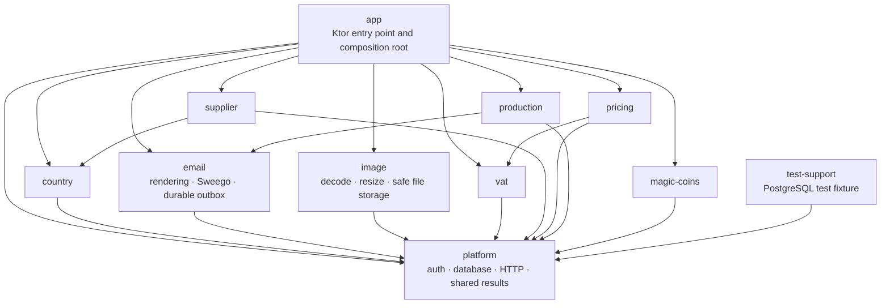

# Backend compile-time modules

The backend is one deployable Ktor application built from several Kotlin
compilation modules. The module boundaries are part of the architecture: code
can import only declarations exposed by a declared dependency, and `internal`
declarations are visible only inside their own module.

Run every command in this guide from [`backend/`](../../../backend).

## Package, Kotlin module, runtime handle, and Ktor module

These similar terms describe different roles:

- A **Kotlin package** is the namespace written at the top of a `.kt` file,
  for example `package shop.voenix.country`. Packages organize names but do
  not stop another package from importing a public declaration.
- A **Kotlin compilation module** is one Toolchain module with its own
  `module.yaml`, sources, dependencies, and compilation. This is the boundary
  used by Kotlin's `internal` visibility.
- A **runtime module handle** is an assembled object such as `CountryModule`.
  A `create...Module` factory constructs the handle and hides the repository,
  service, and route object graph behind it. The handle does not create another
  compilation boundary or deployment.
- A **Ktor module** is a runtime function such as `Application.module()` that
  installs plugins and routes into a running server. Calling several module
  installation functions does not create more deployments or compilation
  boundaries.

The backend keeps familiar package names, compiles them in separate Kotlin
modules, and composes them into one Ktor application at runtime.

## The module graph



The production dependencies are deliberately asymmetric:

| Module | Production dependencies | Responsibility |
| --- | --- | --- |
| `platform` | none | Authentication, database startup, HTTP runtime, validation bridge, and shared operation results |
| `country` | `platform` | Country API and country lookup capability |
| `email` | `platform` | Direct user email, reference-only durable outbox, rendering, provider delivery, and worker lifecycle |
| `image` | `platform` | Image decoding, resizing, safe local storage, derived-file caching, and public/private delivery |
| `vat` | `platform` | VAT API and VAT lookup capability |
| `supplier` | `platform`, `country` | Supplier API; enriches suppliers through `CountryReader` |
| `pricing` | `platform`, `vat` | Pricing API; resolves VAT through `VatReader` |
| `production` | `platform`, `email` | Production PDFs, per-supplier delivery jobs, SFTP delivery, and the producer notification enqueued through `EmailOutbox` (see the [Production package guide](production-package.md)) |
| `magic-coins` | `platform` | Public Magic Coins balance API and the internal atomic spend logic for the future Generator module (see the [MagicCoins package guide](magic-coins-package.md)) |
| `app` | all production modules | Configuration and runtime composition only |
| `test-support` | `platform` | Reusable PostgreSQL integration-test fixture; never a production dependency |

[`project.yaml`](../../../backend/project.yaml) registers these modules and the
three quality-plugin modules. The former root application manifest no longer
exists, so `backend/` is only the Toolchain project root.

## Physical layout

```text
backend/
|- backend.module-template.yaml
|- libs.versions.toml
|- project.yaml
|- app/
|  |- module.yaml
|  |- src/shop/voenix/Application.kt
|  |- resources/
|  `- test/
|- modules/
|  |- platform/
|  |- country/
|  |- email/
|  |- image/
|  |- vat/
|  |- supplier/
|  |- pricing/
|  |- magic-coins/
|  |- production/
|  `- test-support/
`- plugins/
```

Each module owns its `src`, optional `resources`, and optional `test`
directories. The global Flyway chain belongs to
[`platform/resources/db/migration`](../../../backend/modules/platform/resources/db/migration)
because `platform` owns database startup and migration. Module packages keep
their existing names, such as `shop.voenix.country`; the physical source root
determines the compilation module.

External dependency coordinates and versions live in the shared
[`libs.versions.toml`](../../../backend/libs.versions.toml) catalog. A module
still declares only the libraries it actually consumes, but refers to them by
aliases such as `$libs.ktor.server.core` or `$libs.exposed.jdbc`. Updating a
version in the catalog therefore keeps every consuming module aligned without
adding dependencies to modules that do not need them.

The `app` module still enables the Toolchain's Ktor integration, but disables
its automatic BOM with `applyBom: false`. Otherwise the built-in Ktor setting
and the project catalog would both act as version authorities. All explicit
Ktor dependencies now take their version exclusively from the project catalog.

## Public surfaces and internal implementation

A module should expose a small capability, not its object graph. Module table
objects, repositories, services, routes, row mappings, persistence result
types, and HTTP-only request and response models are `internal`. A type being
serialized by a public HTTP route does not make it part of the Kotlin module's
public interface. This prevents another module from bypassing the owning
module's rules even when both packages are in the same repository.

The important cross-module capabilities are:

- `CountryReader.find(ids)` returns countries for Supplier enrichment;
- `EmailModule` exports only `UserEmailSender` and `EmailOutbox`; the app-owned
  `AggregatedQueuedEmailSource` composes the `QueuedEmailSource` from the
  modules that resolve queued references (Production supplies the
  producer-notification branch, the future Order migration supplies the rest);
- `ProductionModule` exports `ProductionPdfGenerator`, `ProductionOutbox`, and
  the producer-notification resolver, and owns the single delivery worker;
- `ImageModule` exports only `PublicImageStorage`; future Prompt and Article
  modules use it without learning filesystem or cache paths;
- `VatReader.list()` and `VatReader.find(ids)` provide VAT values to Pricing;
- every product module has an `XModule` runtime handle and a factory, with only
  the handles needed by another compilation module declared public;
- authentication has an internal `AuthModule` runtime handle inside the
  `platform` compilation module;
- `platform` exports the guest-identity capability next to `AuthModule`:
  `GuestTokens` issues and reads the encrypted `voenix.guest` cookie, and
  `currentUserSession()` returns the valid session of the current call.
  MagicCoins resolves balance owners through both; Cart and Generator reuse
  them later;
- each runtime module exposes an `install...Module` function for Ktor
  composition;
- each module with validated request bodies exposes a `validate...Requests`
  function so `app` can install Ktor Request Validation exactly once; and
- operation interfaces and their route-test installation overloads are
  internal seams. Tests in the same compilation module can still provide
  small stubs through them.

Both reader lookup functions accept a `Set<Long>` and return a map. A caller
can therefore resolve every distinct reference with one module call instead of
performing one query per result row. `supplier` cannot import `Countries`, and
`pricing` cannot import `ValueAddedTaxes`; the Kotlin compiler enforces that
those table objects are internal to their owner.

`supplier` exports its `country` dependency because its public installation
function accepts `CountryReader`. `pricing` exports `vat` because its public
installation function accepts `VatReader`. Their HTTP request and response
models remain internal. Other module dependencies are not exported.

Runtime handles have the narrowest visibility and interface required by their
consumers. `CountryModule` and `VatModule` are public because integration code
in other compilation modules needs their reader capabilities. `SupplierModule`
and `PricingModule` are internal because they currently export no runtime
capability. They still use the same factory-and-handle composition pattern.
This difference does not make Country or VAT more of a module than Supplier or
Pricing.

The `platform` compilation module deliberately has no single `PlatformModule`
runtime handle. It contains several independent foundations: authentication,
database lifecycle, HTTP runtime, validation, and shared result types. Bundling
those concerns into one handle would couple focused HTTP and authentication
tests to unrelated database setup. `AuthModule` has its own runtime handle
because it captures `AuthSettings` and installs one cohesive authentication
runtime. The handle and its factory remain internal because no other
compilation module needs an instance capability. Product routes depend only on
the public `AuthRouting` constants and the two route protections,
`installAdminRouteProtection()` and `installAuthenticatedRouteProtection()`.
`HttpRuntime` and `DatabaseFactory` keep their separate interfaces.

The internal operation overloads of `install...Module` are focused route-test
seams. They let a test in the owning compilation module install routes with a
small operation stub without constructing the production database
implementation. Production composition uses the public database overload,
which creates and installs the runtime handle.

## Application composition

[`Application.kt`](../../../backend/app/src/shop/voenix/Application.kt) is the
composition root. It performs these steps:

1. read database, authentication, and Image-root configuration;
2. connect to PostgreSQL and run the Flyway chain;
3. install the shared HTTP runtime and one Request Validation plugin;
4. install authentication and then Image's public and authenticated private routes;
5. install Country and VAT and retain their reader capabilities;
6. pass those capabilities to Supplier and Pricing;
7. install Production's destination admin routes;
8. install MagicCoins with a `GuestTokens` capability built from the
   authentication settings; and
9. close the database pool when startup fails or the application stops.

The Email dependency and `installEmailModule` seam already exist, but the
composition root deliberately does not install it — and installs only
Production's destination routes rather than the full Production module —
until the migrated Order module supplies a real `ProductionSource`. This
avoids placeholder workers that appear healthy while no queued business data
can be resolved. The late-bound `QueuedEmailSource` composition for that
moment already exists and is tested: the app-owned
`AggregatedQueuedEmailSource` delegates producer-notification references to
Production once both modules are installed.

The application does not construct or import a module's repository, service,
or routes. Each module factory assembles those internal details itself.

## Explicit public APIs

Every product and test-support module applies
[`backend.module-template.yaml`](../../../backend/backend.module-template.yaml).
It selects Kotlin 2.4, provisions JDK 25, targets JVM 25, and enables strict
explicit API mode:

```yaml
settings:
  kotlin:
    freeCompilerArgs:
      - -Xexplicit-api=strict
```

Production declarations that cross a module boundary must therefore state
their visibility and public return types. Missing declarations fail
compilation instead of silently increasing a module's API. Test classes are
`internal`; tests can still access their module's internal production code.

## Test support

[`PostgresIntegrationTest`](../../../backend/modules/test-support/src/shop/voenix/testing/PostgresIntegrationTest.kt)
starts PostgreSQL, creates a Hikari data source, and runs the complete Flyway
chain. Product and app modules depend on `test-support` only through
`test-dependencies`. Testcontainers is declared only in `test-support`, so it
cannot leak into production runtime classpaths.

## Working with modules

The normal full gate remains:

```sh
./kotlin do ktfmt
./kotlin check
```

For focused feedback, select one or more modules:

```sh
./kotlin test --include-module country
./kotlin test --include-module image
./kotlin test --include-module supplier --include-module pricing
./kotlin build --module app
```

Useful inspection commands are:

```sh
./kotlin show modules
./kotlin show dependencies --module supplier
./kotlin show settings --module pricing
```

## Adding a module or dependency

When a new module needs its own compile-time boundary:

1. create `backend/modules/<name>/module.yaml`, `src/`, and `test/`;
2. apply `../../backend.module-template.yaml` and enable Detekt, ktfmt, and
   Ktlint in the manifest;
3. register the module in `backend/project.yaml`;
4. declare only the production dependencies required by its public behavior,
   using aliases from `backend/libs.versions.toml`; add a catalog entry first
   when a new external library is required;
5. put PostgreSQL and other reusable fixtures in `test-dependencies`, normally
   through `test-support`;
6. expose only capabilities and composition functions needed by another
   compilation module; keep HTTP-only DTOs, operation interfaces, tables,
   repositories, services, and routes internal; and
7. run a focused module test followed by the full gate.

Do not add a dependency to obtain an internal implementation type. If a real
consumer needs behavior from another module, add the narrowest useful reader
or operation to the owning module instead.
