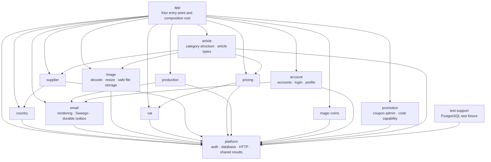

# Backend compile-time modules

The backend is one deployable Ktor application built from several Kotlin
compilation modules. The module boundaries are part of the architecture: code
can import only declarations exposed by a declared dependency, and `internal`
declarations are visible only inside their own module.

Run every command in this guide from [`backend/`](../../../backend).

## Package, Kotlin module, runtime handle, and Ktor module

These similar terms describe different roles:

- A **Kotlin package** is the namespace written at the top of a `.kt` file,
  for example `package shop.voenix.country`. Packages organize names but do
  not stop another package from importing a public declaration.
- A **Kotlin compilation module** is one Toolchain module with its own
  `module.yaml`, sources, dependencies, and compilation. This is the boundary
  used by Kotlin's `internal` visibility.
- A **runtime module handle** is an assembled object such as `CountryModule`.
  A `create...Module` factory constructs the handle and hides the repository,
  service, and route object graph behind it. The handle does not create another
  compilation boundary or deployment.
- A **Ktor module** is a runtime function such as `Application.module()` that
  installs plugins and routes into a running server. Calling several module
  installation functions does not create more deployments or compilation
  boundaries.

The backend keeps familiar package names, compiles them in separate Kotlin
modules, and composes them into one Ktor application at runtime.

## The module graph


```mermaid
flowchart TD
    App["app<br/>Ktor entry point and composition root"]
    Platform["platform<br/>auth · database · HTTP · shared results"]
    Country["country"]
    Email["email<br/>rendering · Sweego · durable outbox"]
    Image["image<br/>decode · resize · safe file storage"]
    Vat["vat"]
    Supplier["supplier"]
    Pricing["pricing"]
    Production["production"]
    MagicCoins["magic-coins"]
    Account["account<br/>accounts · login · profile"]
    Promotion["promotion<br/>coupon admin · code capability"]
    Article["article<br/>category structure · article types"]
    TestSupport["test-support<br/>PostgreSQL test fixture"]

    App --> Platform
    App --> Account
    App --> Country
    App --> Email
    App --> Image
    App --> Vat
    App --> Supplier
    App --> Pricing
    App --> Production
    App --> MagicCoins
    App --> Promotion
    App --> Article
    Country --> Platform
    Email --> Platform
    Image --> Platform
    Vat --> Platform
    Supplier --> Platform
    Supplier --> Country
    Pricing --> Platform
    Pricing --> Vat
    Production --> Platform
    Production --> Email
    MagicCoins --> Platform
    Account --> Platform
    Account --> Email
    Promotion --> Platform
    Article --> Platform
    Article --> Image
    Article --> Pricing
    Article --> Supplier
    TestSupport --> Platform
```

The production dependencies are deliberately asymmetric:

| Module | Production dependencies | Responsibility |
| --- | --- | --- |
| `platform` | none | Authentication, database startup, HTTP runtime, validation bridge, and shared operation results |
| `country` | `platform` | Country API and country lookup capability |
| `email` | `platform` | Direct user email, reference-only durable outbox, rendering, provider delivery, and worker lifecycle |
| `image` | `platform` | Image decoding, resizing, safe local storage, derived-file caching, and public/private delivery |
| `vat` | `platform` | VAT API and VAT lookup capability |
| `supplier` | `platform`, `country` | Supplier API; enriches suppliers through `CountryReader`; exports the `SupplierReader` capability that labels another module's rows with supplier names (see the [Supplier package guide](supplier-package.md)) |
| `pricing` | `platform`, `vat` | Pricing API; resolves VAT through `VatReader`; exports the `PriceCatalog` capability that lets an owning module write a price inside its own transaction (see the [Pricing package guide](pricing-package.md)) |
| `production` | `platform`, `email` | Production PDFs, per-supplier delivery jobs, SFTP delivery, and the producer notification enqueued through `EmailOutbox` (see the [Production package guide](production-package.md)) |
| `magic-coins` | `platform` | Public Magic Coins balance API and the internal atomic spend logic for the future Generator module (see the [MagicCoins package guide](magic-coins-package.md)) |
| `account` | `platform`, `email` | User accounts, registration and login, profile and addresses, password and e-mail changes; the trusted creator of `UserSession` values (see the [Account package guide](account-package.md)) |
| `promotion` | `platform` | Coupon-promotion admin API and the exported `PromotionCodes` capability that validates and atomically redeems codes for the future Cart, Order, and Checkout modules (see the [Promotion package guide](promotion-package.md)) |
| `article` | `platform`, `image`, `pricing`, `supplier` | Product catalog: the shared category structure and one table per article type. Currently the category and subcategory admin APIs and the complete mug admin slice, including the two example-image pre-uploads that write through Image's `PublicImageStorage`, the embedded price that Pricing's `PriceCatalog` writes into the article's own transaction, and the supplier names that `SupplierReader` resolves for a whole list page at once, the two anonymous storefront reads, and the exported `ArticleCatalog` capability that resolves a batch of article-variant references for the future Cart, Order, and production adapters (see the [Article package guide](article-package.md)) |
| `app` | all production modules | Configuration and runtime composition only |
| `test-support` | `platform` | Reusable PostgreSQL integration-test fixture; never a production dependency |

[`project.yaml`](../../../backend/project.yaml) registers these modules and the
three quality-plugin modules. The former root application manifest no longer
exists, so `backend/` is only the Toolchain project root.

## Physical layout

```text
backend/
|- backend.module-template.yaml
|- libs.versions.toml
|- project.yaml
|- app/
|  |- module.yaml
|  |- src/shop/voenix/Application.kt
|  |- resources/
|  `- test/
|- modules/
|  |- platform/
|  |- account/
|  |- country/
|  |- email/
|  |- image/
|  |- vat/
|  |- supplier/
|  |- pricing/
|  |- magic-coins/
|  |- production/
|  |- promotion/
|  |- article/
|  `- test-support/
`- plugins/
```

Each module owns its `src`, optional `resources`, and optional `test`
directories. The global Flyway chain belongs to
[`platform/resources/db/migration`](../../../backend/modules/platform/resources/db/migration)
because `platform` owns database startup and migration. Module packages keep
their existing names, such as `shop.voenix.country`; the physical source root
determines the compilation module.

External dependency coordinates and versions live in the shared
[`libs.versions.toml`](../../../backend/libs.versions.toml) catalog. A module
still declares only the libraries it actually consumes, but refers to them by
aliases such as `$libs.ktor.server.core` or `$libs.exposed.jdbc`. Updating a
version in the catalog therefore keeps every consuming module aligned without
adding dependencies to modules that do not need them.

The `app` module still enables the Toolchain's Ktor integration, but disables
its automatic BOM with `applyBom: false`. Otherwise the built-in Ktor setting
and the project catalog would both act as version authorities. All explicit
Ktor dependencies now take their version exclusively from the project catalog.

## Public surfaces and internal implementation

A module should expose a small capability, not its object graph. Module table
objects, repositories, services, routes, row mappings, persistence result
types, and HTTP-only request and response models are `internal`. A type being
serialized by a public HTTP route does not make it part of the Kotlin module's
public interface. This prevents another module from bypassing the owning
module's rules even when both packages are in the same repository.

The important cross-module capabilities are:

- `CountryReader.find(ids)` returns countries for Supplier enrichment;
- `EmailModule` exports only `UserEmailSender` and `EmailOutbox`; the app-owned
  `AggregatedQueuedEmailSource` composes the `QueuedEmailSource` from the
  modules that resolve queued references (Production supplies the
  producer-notification branch, the future Order migration supplies the rest);
- `ProductionModule` exports `ProductionPdfGenerator`, `ProductionOutbox`, and
  the producer-notification resolver, and owns the single delivery worker;
- `ImageModule` exports only `PublicImageStorage`; Article stores its
  example images through it, and the future Prompt module will do the same,
  without either of them learning filesystem or cache paths;
- `VatReader.list()` and `VatReader.find(ids)` provide VAT values to Pricing;
- `SupplierReader.find(ids)` returns `SupplierSummary` values — id and name
  only — so a module that references suppliers can label its rows in one
  lookup. The supplier article number is article master data and stays on the
  article row, so it is deliberately not part of this projection. Article binds
  the capability: its mug list resolves every distinct supplier of the page in
  one call, so `article` depends on `supplier` and re-exports it, because
  `installArticleModule` names `SupplierReader` in its signature;
- `PricingModule` exports `PriceCatalog`, the capability an owning module uses
  to keep its own row and its price in one transaction. `prepare(input)`
  validates, resolves VAT, and calculates without touching `prices`;
  `storeInTransaction`, `replaceInTransaction`, and `deleteInTransaction` are
  intentionally not suspending, so they can only run statements in the
  transaction their caller already opened and can never start a second one;
  `find(ids)` is the batched read for list projections. Its `PriceInput`,
  `CalculatedPrice`, `PriceAmount`, `PriceCalculationMode`, `PurchaseActiveRow`,
  and `SalesActiveRow` types are public for that exchange, while the table,
  repository, service, and routes stay internal. Article binds the capability:
  its mug repository opens one transaction, and the price write joins it, which
  is why a rejected article can never leave a price row behind. `article`
  therefore depends on `pricing` and re-exports it, because
  `installArticleModule(database, images, prices, suppliers)` names
  `PriceCatalog` in its signature;
- `ArticleModule` exports `ArticleCatalog`, the batched lookup from the
  references another module stores — an `ArticleVariantReference` is the
  `(articleId, variantId)` pair a cart line, an order line, and a production
  item all carry — to a `CatalogVariant`: article type, article and variant
  name, the single `purchasable` flag (active article, active variant, price
  present), the gross sales total in cents, the supplier id and supplier
  article number, and the five mug layout measurements a `ProductionItem` is
  built from. `article` does **not** depend on `production`; the module that
  owns an order line adapts the value. Unknown references, and references whose
  variant belongs to another article, are absent from the answer rather than
  mapped to `null`. `installArticleModule` already returns the capability, but
  the composition root discards it until Cart or Order is migrated;
- `PromotionModule` exports `PromotionCodes`, which validates a
  customer-entered coupon code and redeems it atomically. It is the one place
  the coupon rules live, so Cart, Order, and Checkout cannot each grow their
  own. `installPromotionModule` already returns it, but the composition root
  discards the value until the first of those modules is migrated;
- every product module has an `XModule` runtime handle and a factory, with only
  the handles needed by another compilation module declared public;
- authentication has an internal `AuthModule` runtime handle inside the
  `platform` compilation module;
- `platform` exports the guest-identity capability next to `AuthModule`:
  `GuestTokens` issues and reads the encrypted `voenix.guest` cookie, and
  `currentUserSession()` returns the valid session of the current call.
  MagicCoins resolves balance owners through both; Cart and Generator reuse
  them later;
- each runtime module exposes an `install...Module` function for Ktor
  composition;
- each module with validated request bodies exposes a `validate...Requests`
  function so `app` can install Ktor Request Validation exactly once; and
- operation interfaces and their route-test installation overloads are
  internal seams. Tests in the same compilation module can still provide
  small stubs through them.

Every reader lookup function accepts a `Set<Long>` and returns a map. A caller
can therefore resolve every distinct reference with one module call instead of
performing one query per result row. `supplier` cannot import `Countries`, and
`pricing` cannot import `ValueAddedTaxes`; the Kotlin compiler enforces that
those table objects are internal to their owner. `SupplierReader` applies the
same rule to `supplier` itself: the article list reads supplier names through
the capability, never through `Suppliers`.

`supplier` exports its `country` dependency because its public installation
function accepts `CountryReader`. `article` exports both `pricing` and
`supplier` for the same reason. `pricing` exports `vat` because its public
installation function accepts `VatReader` and its public `CalculatedPrice`
carries both `Vat` values. Supplier's request and response models remain
internal — `SupplierReader` returns the separate, narrow `SupplierSummary`
instead of the `Supplier` admin representation; Pricing's are public only
because `PriceCatalog` exchanges exactly those values with an owning module.
Other module dependencies are not exported.

Runtime handles have the narrowest visibility and interface required by their
consumers. `CountryModule` and `VatModule` are public because integration code
in other compilation modules needs their reader capabilities. `SupplierModule`,
`PricingModule`, `PromotionModule`, and `ArticleModule` are internal: a
capability is returned by the installation function, so no caller needs the
assembled handle itself. They still use the same factory-and-handle
composition pattern. This
difference does not make Country or VAT more of a module than Supplier,
Pricing, Promotion, or Article.

The `platform` compilation module deliberately has no single `PlatformModule`
runtime handle. It contains several independent foundations: authentication,
database lifecycle, HTTP runtime, validation, and shared result types. Bundling
those concerns into one handle would couple focused HTTP and authentication
tests to unrelated database setup. `AuthModule` has its own runtime handle
because it captures `AuthSettings` and installs one cohesive authentication
runtime. The handle and its factory remain internal because no other
compilation module needs an instance capability. Product routes depend only on
the public `AuthRouting` constants and the two route protections,
`installAdminRouteProtection()` and `installAuthenticatedRouteProtection()`.
`HttpRuntime` and `DatabaseFactory` keep their separate interfaces.

The internal operation overloads of `install...Module` are focused route-test
seams. They let a test in the owning compilation module install routes with a
small operation stub without constructing the production database
implementation. Production composition uses the public database overload,
which creates and installs the runtime handle.

## Application composition

[`Application.kt`](../../../backend/app/src/shop/voenix/Application.kt) is the
composition root. It performs these steps:

1. read database, authentication, Image-root, Email, and Production
   configuration — every settings object is created before Flyway runs, so an
   invalid configuration fails the startup cleanly without touching the
   database;
2. connect to PostgreSQL and run the Flyway chain;
3. install the shared HTTP runtime and one Request Validation plugin;
4. install authentication and then Image's public and authenticated private
   routes, keeping the returned `PublicImageStorage` for Article;
5. install Country and VAT and retain their reader capabilities;
6. pass those capabilities to Supplier and Pricing; both returned capabilities,
   Supplier's `SupplierReader` and Pricing's `PriceCatalog`, are kept for
   Article;
7. install Promotion; its returned `PromotionCodes` capability is deliberately
   discarded, because no migrated module consumes coupon codes yet;
8. install Article with Image's `PublicImageStorage`, Pricing's `PriceCatalog`,
   and Supplier's `SupplierReader`; it owns the category structure, the complete
   mug admin slice, and the anonymous storefront reads. Its returned
   `ArticleCatalog` capability is deliberately discarded for the same reason
   Promotion's is: no migrated module resolves article references yet;
9. install Email exactly once with the app-owned
   `AggregatedQueuedEmailSource`, keeping only the exported `UserEmailSender`
   and `EmailOutbox` capabilities;
10. install the full Production module — destination admin routes, PDF
   generation, delivery worker — wired to Email's real outbox, and bind
   `ProductionModule.producerNotifications` into the aggregated queued source;
11. install Account with Email's `UserEmailSender`, so every registration,
    password, and e-mail-change mail leaves through the one direct-delivery
    seam;
12. install MagicCoins with a `GuestTokens` capability built from the
    authentication settings; and
13. close the database pool when startup fails or the application stops.

The Email worker launches on `ApplicationStarted`, after the composition root
has finished the wiring above, so its first scan never observes a partially
bound queued source. Until the Order migration supplies a real
`ProductionSource`, the composition root passes a source whose every load
fails with an `IllegalStateException`; both workers record that as the
retryable `SOURCE_UNAVAILABLE`, so nothing is silently dropped and the
order-confirmation branch of the app-owned `AggregatedQueuedEmailSource`
stays open until the Order migration binds it.
`EmailRuntimeCompositionIntegrationTest` proves this composition end to end
against real PostgreSQL: an enqueued producer notification travels through the
bound Production resolver and the real Sweego adapter to a local stub server.

The application does not construct or import a module's repository, service,
or routes. Each module factory assembles those internal details itself.

## Explicit public APIs

Every product and test-support module applies
[`backend.module-template.yaml`](../../../backend/backend.module-template.yaml).
It selects Kotlin 2.4, provisions JDK 25, targets JVM 25, and enables strict
explicit API mode:

```yaml
settings:
  kotlin:
    freeCompilerArgs:
      - -Xexplicit-api=strict
```

Production declarations that cross a module boundary must therefore state
their visibility and public return types. Missing declarations fail
compilation instead of silently increasing a module's API. Test classes are
`internal`; tests can still access their module's internal production code.

## Test support

[`PostgresIntegrationTest`](../../../backend/modules/test-support/src/shop/voenix/testing/PostgresIntegrationTest.kt)
starts PostgreSQL, creates a Hikari data source, and runs the complete Flyway
chain. Product and app modules depend on `test-support` only through
`test-dependencies`. Testcontainers is declared only in `test-support`, so it
cannot leak into production runtime classpaths.

## Working with modules

The normal full gate remains:

```sh
./kotlin do ktfmt
./kotlin check
```

For focused feedback, select one or more modules:

```sh
./kotlin test --include-module country
./kotlin test --include-module image
./kotlin test --include-module supplier --include-module pricing
./kotlin build --module app
```

Useful inspection commands are:

```sh
./kotlin show modules
./kotlin show dependencies --module supplier
./kotlin show settings --module pricing
```

## Adding a module or dependency

When a new module needs its own compile-time boundary:

1. create `backend/modules/<name>/module.yaml`, `src/`, and `test/`;
2. apply `../../backend.module-template.yaml` and enable Detekt, ktfmt, and
   Ktlint in the manifest;
3. register the module in `backend/project.yaml`;
4. declare only the production dependencies required by its public behavior,
   using aliases from `backend/libs.versions.toml`; add a catalog entry first
   when a new external library is required;
5. put PostgreSQL and other reusable fixtures in `test-dependencies`, normally
   through `test-support`;
6. expose only capabilities and composition functions needed by another
   compilation module; keep HTTP-only DTOs, operation interfaces, tables,
   repositories, services, and routes internal; and
7. run a focused module test followed by the full gate.

Do not add a dependency to obtain an internal implementation type. If a real
consumer needs behavior from another module, add the narrowest useful reader
or operation to the owning module instead.
