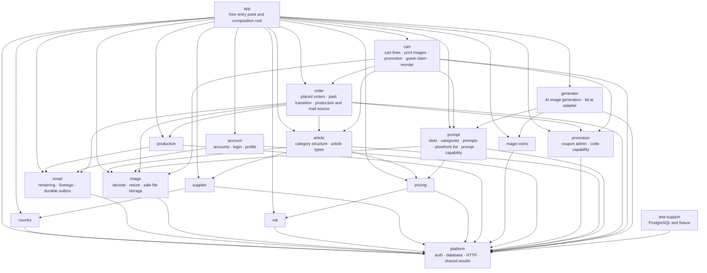

# Backend compile-time modules

The backend is one deployable Ktor application built from several Kotlin
compilation modules. The module boundaries are part of the architecture: code
can import only declarations exposed by a declared dependency, and `internal`
declarations are visible only inside their own module.

Run every command in this guide from [`backend/`](../../../backend).

## Package, Kotlin module, runtime handle, and Ktor module

These similar terms describe different roles:

- A **Kotlin package** is the namespace written at the top of a `.kt` file,
  for example `package shop.voenix.country`. Packages organize names but do
  not stop another package from importing a public declaration.
- A **Kotlin compilation module** is one Toolchain module with its own
  `module.yaml`, sources, dependencies, and compilation. This is the boundary
  used by Kotlin's `internal` visibility.
- A **runtime module handle** is an assembled object such as `CountryModule`.
  A `create...Module` factory constructs the handle and hides the repository,
  service, and route object graph behind it. The handle does not create another
  compilation boundary or deployment.
- A **Ktor module** is a runtime function such as `Application.module()` that
  installs plugins and routes into a running server. Calling several module
  installation functions does not create more deployments or compilation
  boundaries.

The backend keeps familiar package names, compiles them in separate Kotlin
modules, and composes them into one Ktor application at runtime.

## The module graph


```mermaid
flowchart TD
    App["app<br/>Ktor entry point and composition root"]
    Platform["platform<br/>auth · database · HTTP · shared results"]
    Country["country"]
    Email["email<br/>rendering · Sweego · durable outbox"]
    Image["image<br/>decode · resize · safe file storage"]
    Vat["vat"]
    Supplier["supplier"]
    Pricing["pricing"]
    Production["production"]
    MagicCoins["magic-coins"]
    Account["account<br/>accounts · login · profile"]
    Promotion["promotion<br/>coupon admin · code capability"]
    Article["article<br/>category structure · article types"]
    Prompt["prompt<br/>slots · categories · prompts · storefront list · prompt capability"]
    Order["order<br/>placed orders · paid transition · production and mail source"]
    Cart["cart<br/>cart lines · print images · promotion · guest claim · reorder"]
    Generator["generator<br/>AI image generation · fal.ai adapter"]
    TestSupport["test-support<br/>PostgreSQL test fixture"]

    App --> Platform
    App --> Account
    App --> Country
    App --> Email
    App --> Image
    App --> Vat
    App --> Supplier
    App --> Pricing
    App --> Production
    App --> MagicCoins
    App --> Promotion
    App --> Article
    App --> Prompt
    App --> Order
    App --> Cart
    App --> Generator
    Country --> Platform
    Email --> Platform
    Image --> Platform
    Vat --> Platform
    Supplier --> Platform
    Supplier --> Country
    Pricing --> Platform
    Pricing --> Vat
    Production --> Platform
    Production --> Email
    MagicCoins --> Platform
    Account --> Platform
    Account --> Email
    Promotion --> Platform
    Article --> Platform
    Article --> Image
    Article --> Pricing
    Article --> Supplier
    Prompt --> Platform
    Prompt --> Image
    Prompt --> Pricing
    Order --> Platform
    Order --> Image
    Order --> Article
    Order --> Promotion
    Order --> Production
    Order --> Email
    Cart --> Platform
    Cart --> Image
    Cart --> Article
    Cart --> Prompt
    Cart --> Promotion
    Cart --> Order
    Generator --> Platform
    Generator --> Prompt
    Generator --> MagicCoins
    TestSupport --> Platform
```

The production dependencies are deliberately asymmetric:

| Module | Production dependencies | Responsibility |
| --- | --- | --- |
| `platform` | none | Authentication, database startup, HTTP runtime, validation bridge, and shared operation results |
| `country` | `platform` | Country API and country lookup capability |
| `email` | `platform` | Direct user email, reference-only durable outbox, rendering, provider delivery, and worker lifecycle |
| `image` | `platform` | Image decoding, resizing, safe local storage, derived-file caching, and public/private delivery |
| `vat` | `platform` | VAT API and VAT lookup capability |
| `supplier` | `platform`, `country` | Supplier API; enriches suppliers through `CountryReader`; exports the `SupplierReader` capability that labels another module's rows with supplier names (see the [Supplier package guide](supplier-package.md)) |
| `pricing` | `platform`, `vat` | Pricing API; resolves VAT through `VatReader`; exports the `PriceCatalog` capability that lets an owning module write a price inside its own transaction (see the [Pricing package guide](pricing-package.md)) |
| `production` | `platform`, `email` | Production PDFs, per-supplier delivery jobs, SFTP delivery, and the producer notification enqueued through `EmailOutbox` (see the [Production package guide](production-package.md)) |
| `magic-coins` | `platform` | Public Magic Coins balance API, the atomic spend logic, and the exported `GenerationCoins` capability the Generator charges a generation with (see the [MagicCoins package guide](magic-coins-package.md)) |
| `account` | `platform`, `email` | User accounts, registration and login, profile and addresses, password and e-mail changes; the trusted creator of `UserSession` values, and the definer of the `GuestDataClaims` port it calls best effort after a successful login or registration (see the [Account package guide](account-package.md)) |
| `promotion` | `platform` | Coupon-promotion admin API and the exported `PromotionCodes` capability that validates and atomically redeems codes for Cart, Order, and the future Checkout module (see the [Promotion package guide](promotion-package.md)) |
| `article` | `platform`, `image`, `pricing`, `supplier` | Product catalog: the shared category structure and one table per article type. Currently the category and subcategory admin APIs and the complete mug admin slice, including the two example-image pre-uploads that write through Image's `PublicImageStorage`, the embedded price that Pricing's `PriceCatalog` writes into the article's own transaction, and the supplier names that `SupplierReader` resolves for a whole list page at once, the two anonymous storefront reads, and the exported `ArticleCatalog` capability that resolves a batch of article-variant references for Cart, Order, and the production adapters (see the [Article package guide](article-package.md)) |
| `prompt` | `platform`, `image`, `pricing` | Generation prompts: the prompt category structure, the prompts themselves, and the slots a prompt is composed of. The slot, slot-variant, category, and subcategory admin APIs plus the prompt admin API with the embedded price that Pricing's `PriceCatalog` writes into the prompt's own transaction and the example-image pre-upload that writes through Image's `PublicImageStorage`, the anonymous storefront list `GET /api/prompts` that never answers with a prompt text, and the exported `PromptCatalog` capability that composes a prompt's generation text and prices a batch of prompts for Cart and Generator (see the [Prompt package guide](prompt-package.md)) |
| `order` | `platform`, `image`, `article`, `promotion`, `production`, `email` | Placed orders: the immutable snapshot of what was bought, the customer's own order reads, the admin production-PDF downloads, the transactional `PENDING → PAID` transition with the redemption, production request, and confirmation mail that join its commit, and the four capabilities it exports — `OrderGuestData`, `OrderItemReader`, and the `ProductionSource` and `QueuedEmailSource` implementations Production and Email had been waiting for (see the [Order package guide](order-package.md)) |
| `cart` | `platform`, `image`, `article`, `prompt`, `promotion`, `order` | The customer's cart: the anonymous or signed-in cart itself, its lines with their price snapshots, the print-image pre-upload that writes through Image's `PrivateImageStorage`, the coupon code it carries, the reorder route that turns an ordered line back into a cart line through Order's `OrderItemReader`, and the two ports it exports — the guest-image resolver Image's delivery route needs and the guest-data claim Account calls after a login (see the [Cart package guide](cart-package.md)) |
| `generator` | `platform`, `prompt`, `magic-coins` | AI image generation: the one anonymous-capable `POST /api/generator/generate` endpoint, the order of a generation (check the upload, check the balance, load the prompt, generate, spend), and the fal.ai adapter behind an `ImageGenerator` port whose dummy variant serves local development. The module is stateless — it owns no table and exports no capability (see the [Generator package guide](generator-package.md)) |
| `app` | all production modules | Configuration and runtime composition only |
| `test-support` | `platform` | Reusable PostgreSQL integration-test fixture; never a production dependency |

[`project.yaml`](../../../backend/project.yaml) registers these modules and the
three quality-plugin modules. The former root application manifest no longer
exists, so `backend/` is only the Toolchain project root.

## Physical layout

```text
backend/
|- backend.module-template.yaml
|- libs.versions.toml
|- project.yaml
|- app/
|  |- module.yaml
|  |- src/shop/voenix/Application.kt
|  |- resources/
|  `- test/
|- modules/
|  |- platform/
|  |- account/
|  |- country/
|  |- email/
|  |- image/
|  |- vat/
|  |- supplier/
|  |- pricing/
|  |- magic-coins/
|  |- production/
|  |- promotion/
|  |- article/
|  |- prompt/
|  |- order/
|  |- cart/
|  |- generator/
|  `- test-support/
`- plugins/
```

Each module owns its `src`, optional `resources`, and optional `test`
directories. The global Flyway chain belongs to
[`platform/resources/db/migration`](../../../backend/modules/platform/resources/db/migration)
because `platform` owns database startup and migration. Module packages keep
their existing names, such as `shop.voenix.country`; the physical source root
determines the compilation module.

External dependency coordinates and versions live in the shared
[`libs.versions.toml`](../../../backend/libs.versions.toml) catalog. A module
still declares only the libraries it actually consumes, but refers to them by
aliases such as `$libs.ktor.server.core` or `$libs.exposed.jdbc`. Updating a
version in the catalog therefore keeps every consuming module aligned without
adding dependencies to modules that do not need them.

The `app` module still enables the Toolchain's Ktor integration, but disables
its automatic BOM with `applyBom: false`. Otherwise the built-in Ktor setting
and the project catalog would both act as version authorities. All explicit
Ktor dependencies now take their version exclusively from the project catalog.

## Public surfaces and internal implementation

A module should expose a small capability, not its object graph. Module table
objects, repositories, services, routes, row mappings, persistence result
types, and HTTP-only request and response models are `internal`. A type being
serialized by a public HTTP route does not make it part of the Kotlin module's
public interface. This prevents another module from bypassing the owning
module's rules even when both packages are in the same repository.

The important cross-module capabilities are:

- `CountryReader.find(ids)` returns countries for Supplier enrichment;
- `EmailModule` exports only `UserEmailSender` and `EmailOutbox`; the app-owned
  `AggregatedQueuedEmailSource` composes the `QueuedEmailSource` from the
  modules that resolve queued references (Production supplies the
  producer-notification branch, Order the order-confirmation branch — both
  bound since the Order migration of 2026-07-31);
- `ProductionModule` exports `ProductionPdfGenerator`, `ProductionOutbox`, and
  the producer-notification resolver, and owns the single delivery worker. Its
  `ProductionSource` port is implemented by the order module and bound by the
  composition root through the app-owned `LateBoundProductionSource`;
- `ImageModule` exports `PublicImageStorage`, `PrivateImageStorage`, and the
  multipart `UploadedImage` reader next to them; Article and Prompt store their
  example images through the public one and Cart stores print images through the
  private one, without any of them learning filesystem or cache paths. The
  ownership question of a private image travels the other way, through the
  `GuestImageResolver` port that Image defines and the composition root binds,
  so the guest delivery route needs no Image-to-Cart dependency;
- `VatReader.list()` and `VatReader.find(ids)` provide VAT values to Pricing;
- `SupplierReader.find(ids)` returns `SupplierSummary` values — id and name
  only — so a module that references suppliers can label its rows in one
  lookup. The supplier article number is article master data and stays on the
  article row, so it is deliberately not part of this projection. Article binds
  the capability: its mug list resolves every distinct supplier of the page in
  one call, so `article` depends on `supplier` and re-exports it, because
  `installArticleModule` names `SupplierReader` in its signature;
- `PricingModule` exports `PriceCatalog`, the capability an owning module uses
  to keep its own row and its price in one transaction. `prepare(input)`
  validates, resolves VAT, and calculates without touching `prices`;
  `storeInTransaction`, `replaceInTransaction`, and `deleteInTransaction` are
  intentionally not suspending, so they can only run statements in the
  transaction their caller already opened and can never start a second one;
  `find(ids)` is the batched read for list projections. Its `PriceInput`,
  `CalculatedPrice`, `PriceAmount`, `PriceCalculationMode`, `PurchaseActiveRow`,
  and `SalesActiveRow` types are public for that exchange, while the table,
  repository, service, and routes stay internal. Article binds the capability:
  its mug repository opens one transaction, and the price write joins it, which
  is why a rejected article can never leave a price row behind. `article`
  therefore depends on `pricing` and re-exports it, because
  `installArticleModule(database, images, prices, suppliers)` names
  `PriceCatalog` in its signature;
- `ArticleModule` exports `ArticleCatalog`, the batched lookup from the
  references another module stores — an `ArticleVariantReference` is the
  `(articleId, variantId)` pair a cart line, an order line, and a production
  item all carry — to a `CatalogVariant`: article type, article and variant
  name, the single `purchasable` flag (active article, active variant, price
  present), the gross sales total in cents, the supplier id and supplier
  article number, and the five mug layout measurements a `ProductionItem` is
  built from. `article` does **not** depend on `production`; the module that
  owns an order line adapts the value. Unknown references, and references whose
  variant belongs to another article, are absent from the answer rather than
  mapped to `null`. `installArticleModule` returns the capability and the
  composition root binds it to Cart, which resolves the article and the variant
  of every line it renders, and to Order, which snapshots those values at
  placement and asks the same capability for the current supplier when
  production loads the order;
- `PromptModule` exports `PromptCatalog` with the two answers another module
  needs about a prompt it references: `composedText(promptId)` returns the
  generation text — the prompt's own text plus the text of every slot variant it
  uses, ordered by slot and joined by a blank line, or `null` when the prompt is
  unknown, inactive, archived, or textless — and
  `findSalesGrossPriceCents(promptIds)` returns the current gross sales amount in
  integer cents per usable prompt, resolved through one batched
  `PriceCatalog.find`. Ineligible ids are absent instead of mapped to `0`,
  because `0` is a price a shop may charge. Both deliberately ignore the category
  and subcategory `active` flags that the storefront list checks, so a prompt in
  a deactivated category stays generatable and buyable by id.
  `installPromptModule` returns the capability; the composition root binds it to
  Cart, which snapshots a prompt's price when a line is added, and to Generator,
  which composes the text it sends to the image model. Both halves are bound
  since the Generator migration of 2026-07-30;
- `PromotionModule` exports `PromotionCodes`, which validates a
  customer-entered coupon code and redeems it atomically. It is the one place
  the coupon rules live, so Cart, Order, and Checkout cannot each grow their
  own. `installPromotionModule` returns it and the composition root binds it to
  Cart, which validates an entered code and renders the promotion a cart has
  stored, and to Order, whose paid transition calls `redeem(promotionId,
  userId, orderId)` **inside its own transaction**, so a redemption exists
  exactly if the payment does;
- `ImageModule`'s `PrivateImageStorage` additionally exports
  `originalPaths(filenames)`, the one place a consumer receives a `Path`
  instead of a name: production has to read the bytes of a print image, and
  without this call the order module would have to know the private root and
  build the path itself. It does not — it hands over the names it stored and
  receives ready paths, so the root, the image-owned folder, and the
  containment check all stay inside Image. Set in, map out, like
  `ArticleCatalog.find`: a name the storage cannot answer for is absent from
  the map;
- `OrderModule` exports four things, and only one of them is a capability the
  order module invented. `OrderGuestData` is Account's `GuestDataClaims` for
  order rows (by guest token and by the confirmed e-mail address of a login),
  `OrderItemReader` is the ownership-checked lookup Cart's reorder route builds
  a new cart line from, `productionSource` is Production's `ProductionSource`,
  and `orderConfirmations` is the order branch of Email's `QueuedEmailSource`.
  The last two are ports *earlier* modules declared and left open, which is why
  they are exported rather than installed. `OrderModule` is therefore public
  like `CartModule`; the operations, service, repository, and tables behind it
  stay internal;
- `CartModule` exports `CartGuestImages` and `CartGuestData`, the two ports the
  cart *implements* for other modules rather than a capability it offers:
  `CartGuestImages` is Image's `GuestImageResolver`, so the guest delivery route
  can ask who owns a print image without Image depending on Cart, and
  `CartGuestData.claim(guestToken, userId)` moves the carts and print images of a
  visitor to the account they just signed in to. The composition root binds
  both, so the cart module depends on neither consumer;
- `MagicCoinsModule` exports `GenerationCoins`, the capability a module that runs
  a paid image generation charges a visitor with:
  `hasEnoughForGeneration(owner)` answers an `OperationResult<Boolean>`, so an
  infrastructure failure can never reach the caller as "no balance", and
  `trySpendForGeneration(owner)` answers a plain `Boolean`, because a caller can
  do exactly one thing about any negative outcome — log it and keep the image it
  already produced. Reading a balance is deliberately not part of it; that stays
  internal, because the module owns the only endpoint that reports it.
  `MagicCoinsOwner` and the `ApplicationCall.magicCoinsOwner(guestTokens)` helper
  are public for the same reason: a consumer has to name the owner it charges,
  and the rule for resolving that owner from a session or a guest cookie exists
  exactly once. `installMagicCoinsModule(database, guestTokens)` returns the
  capability and the composition root binds it to Generator, its only consumer.
  A combined check-and-spend was rejected: the expensive provider call sits
  between the two;
- the `generator` module exports **nothing**. Its handle, service, routes, and
  outcome type are all internal, because no other compilation module asks it for
  anything — only the storefront does. `installGeneratorModule` returns `Unit`;
- every product module has an `XModule` runtime handle and a factory, with only
  the handles needed by another compilation module declared public;
- authentication has an internal `AuthModule` runtime handle inside the
  `platform` compilation module;
- `platform` exports the guest-identity capability next to `AuthModule`:
  `GuestTokens` issues and reads the encrypted `voenix.guest` cookie, and
  `currentUserSession()` returns the valid session of the current call.
  MagicCoins, Cart, and Generator resolve owners through both — a cart mutation
  creates the guest cookie with `getOrCreate`, a cart read only looks for one
  with `tryGet`, and a generation creates it through
  `ApplicationCall.magicCoinsOwner`;
- each runtime module exposes an `install...Module` function for Ktor
  composition;
- each module with validated request bodies exposes a `validate...Requests`
  function so `app` can install Ktor Request Validation exactly once; and
- operation interfaces and their route-test installation overloads are
  internal seams. Tests in the same compilation module can still provide
  small stubs through them.

Every reader lookup function accepts a `Set<Long>` and returns a map. A caller
can therefore resolve every distinct reference with one module call instead of
performing one query per result row. `supplier` cannot import `Countries`, and
`pricing` cannot import `ValueAddedTaxes`; the Kotlin compiler enforces that
those table objects are internal to their owner. `SupplierReader` applies the
same rule to `supplier` itself: the article list reads supplier names through
the capability, never through `Suppliers`.

`supplier` exports its `country` dependency because its public installation
function accepts `CountryReader`. `article` exports both `pricing` and
`supplier` for the same reason. `pricing` exports `vat` because its public
installation function accepts `VatReader` and its public `CalculatedPrice`
carries both `Vat` values. Supplier's request and response models remain
internal — `SupplierReader` returns the separate, narrow `SupplierSummary`
instead of the `Supplier` admin representation; Pricing's are public only
because `PriceCatalog` exchanges exactly those values with an owning module.
`prompt` exports `pricing` for the same reason `article` does: its public
installation function accepts `PriceCatalog`. `generator` exports both `prompt`
and `magic-coins`, because its public installation function accepts
`PromptCatalog` and `GenerationCoins`. `order` exports `image`, `article`,
`promotion`, `production`, and `email`, because `installOrderModule` names a
capability of each of them in its signature, and `cart` exports `order`,
because `installCartModule` names `OrderItemReader`. Other module dependencies
are not exported.

Runtime handles have the narrowest visibility and interface required by their
consumers. `CountryModule` and `VatModule` are public because integration code
in other compilation modules needs their reader capabilities. `SupplierModule`,
`PricingModule`, `PromotionModule`, `ArticleModule`, and `PromptModule` are
internal: a capability is returned by the installation function, so no caller
needs the assembled handle itself. `CartModule` and `OrderModule` are public for
the opposite reason: the composition root needs two exported ports out of the
cart and four out of the order module after the install, so a single return
value would not do. They still use the same factory-and-handle
composition pattern. This
difference does not make Country or VAT more of a module than Supplier,
Pricing, Promotion, Article, or Prompt.

The `platform` compilation module deliberately has no single `PlatformModule`
runtime handle. It contains several independent foundations: authentication,
database lifecycle, HTTP runtime, validation, and shared result types. Bundling
those concerns into one handle would couple focused HTTP and authentication
tests to unrelated database setup. `AuthModule` has its own runtime handle
because it captures `AuthSettings` and installs one cohesive authentication
runtime. The handle and its factory remain internal because no other
compilation module needs an instance capability. Product routes depend only on
the public `AuthRouting` constants and the two route protections,
`installAdminRouteProtection()` and `installAuthenticatedRouteProtection()`.
`HttpRuntime` and `DatabaseFactory` keep their separate interfaces.

The internal operation overloads of `install...Module` are focused route-test
seams. They let a test in the owning compilation module install routes with a
small operation stub without constructing the production database
implementation. Production composition uses the public database overload,
which creates and installs the runtime handle.

## Application composition

[`Application.kt`](../../../backend/app/src/shop/voenix/Application.kt) is the
composition root. It performs these steps:

1. read database, authentication, Image-root, Email, Production, Account, and
   Generator configuration — every settings object is created before Flyway runs,
   so an invalid configuration fails the startup cleanly without touching the
   database. The Generator settings are the sharpest example: a deployment that
   is not in dummy mode and carries no fal.ai key fails here, not on the first
   customer request;
2. connect to PostgreSQL and run the Flyway chain;
3. install the shared HTTP runtime and one Request Validation plugin;
4. install authentication, build the one `GuestTokens` capability that Cart and
   MagicCoins share, and then install Image's public and authenticated private
   routes, keeping the returned `ImageModule` handle: its `publicStorage` for
   Article and Prompt, its `privateStorage` for Cart, and the handle itself for
   the later `installGuestImageRoute` step;
5. install Country and VAT and retain their reader capabilities;
6. pass those capabilities to Supplier and Pricing; both returned capabilities
   are kept — Pricing's `PriceCatalog` for Article and Prompt, Supplier's
   `SupplierReader` for Article alone;
7. install Promotion and keep its returned `PromotionCodes` capability for Cart;
8. install Article with Image's `PublicImageStorage`, Pricing's `PriceCatalog`,
   and Supplier's `SupplierReader`; it owns the category structure, the complete
   mug admin slice, and the anonymous storefront reads. Its returned
   `ArticleCatalog` capability is kept for Cart;
9. install Prompt with Image's `PublicImageStorage` and Pricing's
   `PriceCatalog`; it owns the slot, category, and prompt admin APIs including
   the example-image pre-upload and the anonymous storefront list, and a prompt
   and the price it owns are written in one transaction exactly as an article and
   its price are. Its returned `PromptCatalog` capability is kept for Cart and
   Generator;
10. create the app-owned `LateBoundProductionSource` and install the email
   runtime with it (`installEmailRuntime`, shared with the composition tests):
   Email exactly once with the app-owned `AggregatedQueuedEmailSource`, then
   the full Production module — destination admin routes, PDF generation,
   delivery worker — wired to Email's real outbox, and finally
   `ProductionModule.producerNotifications` bound into the aggregated queued
   source. Only `UserEmailSender`, `EmailOutbox`, and the production handle are
   kept;
11. install Order with Article's `ArticleCatalog`, Promotion's
   `PromotionCodes`, Production's outbox and PDF generator, Email's outbox,
   Image's `PrivateImageStorage`, and `GuestTokens` — and then close the two
   ports that were opened before it existed: `order.productionSource` into the
   late-bound source and `order.orderConfirmations` into the aggregate. This is
   the step the install order is built around: the order module consumes what
   production and email export, while production consumes what only the order
   module can implement;
12. install Cart with the three catalog capabilities, Image's
   `PrivateImageStorage`, Order's `OrderItemReader` for the reorder route, and
   `GuestTokens`, and then install Image's guest delivery route with the
   returned `CartModule.guestImages`. The route belongs to Image and the
   ownership records to Cart, so connecting them is its own step that runs once
   both sides exist;
13. install Account with Email's `UserEmailSender`, so every registration,
    password, and e-mail-change mail leaves through the one direct-delivery
    seam, and with `IndependentGuestDataClaims(cart.guestData::claim,
    order.guestData::claim)`: the account module knows *when* a claim happens,
    the cart and the order module own the rows, and this binding is the only
    place the three meet. Its branches run independently, so a cart that cannot
    be moved never costs the customer their order history;
14. install MagicCoins with the same `GuestTokens` capability and keep its
    returned `GenerationCoins` capability;
15. install Generator with its settings, Prompt's `PromptCatalog`, MagicCoins'
    `GenerationCoins`, and the same `GuestTokens` — the second consumer of the
    prompt catalog and the only consumer of the coin capability. Whether the
    module talks to fal.ai or hands the upload back unchanged is decided inside
    it, from the settings alone; and
16. close the database pool when startup fails or the application stops.

The Email worker launches on `ApplicationStarted`, after the composition root
has finished the wiring above, so its first scan never observes a partially
bound queued source. Both late bindings keep their fail-loud behavior for the
few milliseconds of startup between the two installs: an unbound
`LateBoundProductionSource` and an unbound branch of the
`AggregatedQueuedEmailSource` throw `IllegalStateException`, which every
production stage and the email worker record as the retryable
`SOURCE_UNAVAILABLE`. Nothing is silently dropped, and answering `null` is
deliberately avoided — production would read that as "this order does not
exist".
`EmailRuntimeCompositionIntegrationTest` proves this composition end to end
against real PostgreSQL: an enqueued producer notification travels through the
bound Production resolver and the real Sweego adapter to a local stub server.
`CartCompositionIntegrationTest` does the same for the cart half of the
wiring: the composed application answers `GET /api/cart`, refuses an
upload without a CSRF token, and then delivers the uploaded print image through
Image's guest route — which only works when the cart-owned resolver really is
bound to it. `GeneratorCompositionIntegrationTest` closes the last binding the
same way: in dummy mode the composed application answers a multipart generation
with the uploaded bytes, issues the guest cookie, and moves that guest's balance
from 10 to 9 in the real database — which only works when the prompt catalog and
the coin capability are both really bound to the generator.
`OrderCompositionIntegrationTest` and `OrderConfirmationRuntimeIntegrationTest`
close the four bindings of the Order migration the same way: production reaches
real order data through the late-bound source, a login moves order rows by
guest token *and* by confirmed e-mail address, the cart's reorder route reads a
real ordered line, and an enqueued order confirmation is resolved by the order
module and delivered by the mail worker.

The application does not construct or import a module's repository, service,
or routes. Each module factory assembles those internal details itself.

## Explicit public APIs

Every product and test-support module applies
[`backend.module-template.yaml`](../../../backend/backend.module-template.yaml).
It selects Kotlin 2.4, provisions JDK 25, targets JVM 25, and enables strict
explicit API mode:

```yaml
settings:
  kotlin:
    freeCompilerArgs:
      - -Xexplicit-api=strict
```

Production declarations that cross a module boundary must therefore state
their visibility and public return types. Missing declarations fail
compilation instead of silently increasing a module's API. Test classes are
`internal`; tests can still access their module's internal production code.

## Test support

[`PostgresIntegrationTest`](../../../backend/modules/test-support/src/shop/voenix/testing/PostgresIntegrationTest.kt)
starts PostgreSQL, creates a Hikari data source, and runs the complete Flyway
chain. Product and app modules depend on `test-support` only through
`test-dependencies`. Testcontainers is declared only in `test-support`, so it
cannot leak into production runtime classpaths.

## Working with modules

The normal full gate remains:

```sh
./kotlin do ktfmt
./kotlin check
```

For focused feedback, select one or more modules:

```sh
./kotlin test --include-module country
./kotlin test --include-module image
./kotlin test --include-module cart
./kotlin test --include-module supplier --include-module pricing
./kotlin build --module app
```

Useful inspection commands are:

```sh
./kotlin show modules
./kotlin show dependencies --module supplier
./kotlin show settings --module pricing
```

## Adding a module or dependency

When a new module needs its own compile-time boundary:

1. create `backend/modules/<name>/module.yaml`, `src/`, and `test/`;
2. apply `../../backend.module-template.yaml` and enable Detekt, ktfmt, and
   Ktlint in the manifest;
3. register the module in `backend/project.yaml`;
4. declare only the production dependencies required by its public behavior,
   using aliases from `backend/libs.versions.toml`; add a catalog entry first
   when a new external library is required;
5. put PostgreSQL and other reusable fixtures in `test-dependencies`, normally
   through `test-support`;
6. expose only capabilities and composition functions needed by another
   compilation module; keep HTTP-only DTOs, operation interfaces, tables,
   repositories, services, and routes internal; and
7. run a focused module test followed by the full gate.

Do not add a dependency to obtain an internal implementation type. If a real
consumer needs behavior from another module, add the narrowest useful reader
or operation to the owning module instead.
