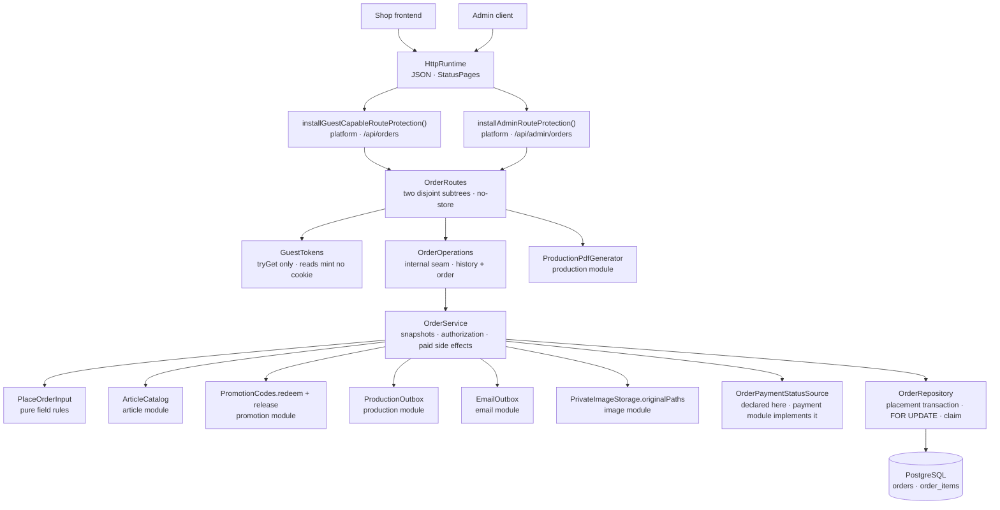

# Backend Order package

This guide explains the Kotlin code in
[`backend/modules/order/src/shop/voenix/order`](../../../backend/modules/order/src/shop/voenix/order).

## What this package does

When a customer has paid, the shop needs a record of what they bought that
nothing can change afterwards. The order package owns that record: the placed
order with its addresses and amounts, its lines with the names and prices the
customer saw, the transitions to `PAID` and `CANCELLED`, and the two things a
paid order sets in motion — the production request and the confirmation mail.

Three properties make it different from the packages migrated before it:

- **An order is a snapshot, not a view.** A cart line renders live catalog
  data; an order line stores it. Renaming an article, changing its price, or
  deleting it altogether must never rewrite what a customer bought.
- **It closes four ports that other modules left open.** Production and email
  were migrated long before an order existed and each declared an interface for
  it. Cart deferred its reorder endpoint, and account deferred the order half
  of its guest-data claim. This module supplies all four, and the composition
  root connects them.
- **Its two most important operations have no HTTP surface.** Placing an order
  belongs to the checkout module; the payment writes belong to the payment
  module. Both live here and both answer with their own result type rather than
  an HTTP shape, and both are exported as an interface this module declares,
  implements, and hands on: `OrderPlacement` to the checkout module, and
  `OrderPaymentGateway` to the payment module, which has called it since
  2026-08-01.

The design decisions, the deviations from the .NET original, and the work
deliberately deferred are recorded in
[`order-migration.md`](../../migration/order-migration.md); the frontend and
cross-module follow-ups live in
[`order-post-migration.md`](../../migration/order-post-migration.md).

## The five-minute mental model



Read it top to bottom once: a request arrives on one of two deliberately
separate route subtrees, the route turns session and guest cookie into an
identity, the service decides what an order *means*, and the repository is the
only thing that touches the two tables.

## HTTP API

| Method and path | Protection | Success | Errors |
| --- | --- | --- | --- |
| `GET /api/orders` | guest-capable | `200` — a direct JSON array of orders, newest first | `500` |
| `GET /api/orders/{orderId}` | guest-capable | `200` `OrderView` | `404` (unknown **and** foreign), `500` |
| `GET /api/admin/orders/{orderId}/production-pdfs` | admin | `200` — array of `{ "supplierId": 3, "fileName": "ORD-42.pdf" }` | `404`, `409` with a `PRODUCTION_PDF_*` code, `500` |
| `GET /api/admin/orders/{orderId}/production-pdfs/{supplierId}` | admin | `200` `application/pdf` as an attachment | `404`, `409`, `500` |

Every response carries `Cache-Control: no-store`. An order answer is personal,
and a shared cache holding one is exactly the vulnerability the legacy PDF
endpoint had.

The list and the detail route answer the same representation — an order is
small and complete, so a list entry without its lines would only force a second
request per order:

```json
{
  "orderId": 42,
  "createdAt": "2026-07-30T09:12:44Z",
  "status": "PAID",
  "paymentStatus": "PAID",
  "subtotal": 3980,
  "shippingCost": 490,
  "discountAmount": 400,
  "total": 4070,
  "items": [
    {
      "orderItemId": 7,
      "articleId": 3,
      "variantId": 9,
      "articleName": "Tasse Klassik",
      "variantName": "Weiß/Blau",
      "quantity": 2,
      "price": 1490,
      "promptPrice": 500,
      "imageId": 12
    }
  ]
}
```

No route of this module takes a request body, so the module registers no
`validateOrderRequests`.

`paymentStatus` is the one field that does not come from this module's tables.
It is one of `OPEN`, `PENDING`, `AUTHORIZED`, `PAID`, `FAILED`, `CANCELED`,
`EXPIRED` — Mollie's vocabulary, uppercased — or `null` when the order has no
payment at all: a free order, or one whose checkout was never started. Note the
spelling: the payment value `CANCELED` carries **one** L while the order
`status` value `CANCELLED` carries two. That is deliberate and must not be
"fixed": Mollie cancelling a payment and the shop cancelling an order are two
different facts written by two different systems, and one spelling would make a
status string silently valid on the wrong side.

The two routes fill the field differently, and the difference is the whole
design of `OrderPaymentStatusSource`:

| Route | Call | What it costs |
| --- | --- | --- |
| `GET /api/orders` | `stored(orderIds)` | one batch read, **never** a provider call — a history of twenty orders must not become twenty HTTP requests |
| `GET /api/orders/{orderId}` | `refreshed(orderId)` | may ask Mollie about a payment that is still `OPEN`, `PENDING`, or `AUTHORIZED`, and may confirm the order when Mollie says it was paid |

That refresh is the fallback for a webhook that never arrived: the customer
looking at their order is what repairs it. A provider that cannot be reached is
answered with the stored status and a WARN, never with a `502`.

Because the refresh may pay the order *during* the read, the detail read is
written in two steps: the ownership-filtered read first — nothing is ever
refreshed for an order the caller does not own — and, when that refresh answered
`PAID` while the row still said `PENDING`, one more read of the same order. Only
then does the answer describe a single moment in time; otherwise the repairing
response would carry `"status":"PENDING"` next to `"paymentStatus":"PAID"` and
contradict itself.

## Who may read an order

One rule answers every read, and the repository expresses it once:

```kotlin
// this order is the caller's …
Orders.userId eq userId                                   // … because they own it, or
(Orders.userId.isNull() and (Orders.guestSessionToken eq guestToken))  // … because they placed it
```

Three consequences are worth spelling out:

- **A guest token stops working once the order is claimed.** The `user_id IS
  NULL` half is what makes that true. A shared or stolen cookie can therefore
  never reach an account's history.
- **A caller with no identity at all matches nothing**, not everything: the
  predicate becomes `FALSE`, and `GET /api/orders` answers an empty array.
- **Unknown and foreign are the same answer.** Every miss is `404`, including
  an id that is not even a number — telling the two apart is the information an
  attacker probes for.

Reading never creates a guest cookie: the routes use `GuestTokens.tryGet`, so
looking at an order history does not turn an anonymous visitor into a tracked
one.

## Why the routes own two separate subtrees

Ktor merges every registered path into one route tree, and a route-scoped
plugin reaches every descendant of the node it is installed on. Hanging the
admin downloads under `/api/orders` would therefore have put the guest-capable
protection above them. The module registers two disjoint nodes instead:

```kotlin
route("/api/orders") { installGuestCapableRouteProtection(); … }

authenticate(AuthRouting.PROVIDER) {
    route("/api/admin/orders") { installAdminRouteProtection(); … }
}
```

The legacy PDF endpoint was anonymous — its admin attribute was commented out —
so every order's production data, addresses included, was readable by order id.
That is deviation D1, and the second node is what fixes it.

## Placing an order

`place(input)` has no route: the checkout module is its caller, and it reaches
it through the exported `OrderPlacement` capability. It runs in three steps.

1. **Field rules.** `PlaceOrderInput.validate()` is pure. It checks the
   address lengths, the two-letter country code, the e-mail shape, the line
   bounds — and two rules that are easy to miss: an order needs *someone to
   show itself to* (a guest token or a user id, the same rule as the table's
   owner CHECK), and its money must describe its own lines (`subtotal` is the
   sum of `(price + promptPrice) × quantity`). Nothing in the database checks
   the second one, so the validator does.
2. **The catalog snapshot.** `ArticleCatalog.find` resolves every
   `(articleId, variantId)` pair of the order in one call, and *every*
   reference has to come back. The legacy checkout stored an empty article name
   for a deleted article and produced an order nobody could ever produce; here
   the placement is refused with `UnknownArticleReference` (deviation D18).
   What the snapshot copies onto the line is the article and variant name, the
   supplier article number, and the five print measurements.
3. **The write.** One transaction inserts the order and all of its lines, in
   the customer's own order (`position`, unique per order).

A `null` billing address is not missing data — it is the customer saying "same
as shipping", and `effectiveBillingAddress` stores the shipping values in the
billing columns.

`OrderPlacementResult` names the outcomes:

| Result | Meaning |
| --- | --- |
| `Placed(order)` | The order exists now |
| `AlreadyPlaced(order)` | This cart already had a live order; use it |
| `Invalid(errors)` | The input broke its own field rules; nothing was written |
| `UnknownArticleReference` | A line names a variant the catalog does not know |
| `UnknownPrintImage` | A line names a print image that does not exist |

Both successes carry a `PayableOrder` — the order id, the total, the contact
fields, and the two stored addresses — and not the internal `OrderView`. A
payment has no use for lines or a status, and keeping the customer's own view
`internal` is what stops it leaking into another module.

`AlreadyPlaced` is a *success*, and it is what makes a double checkout
harmless. Nothing in the service prevents it — the partial unique index does
(see [The schema](#the-schema)), and the repository turns the resulting SQL
state `23505` into the order that won the race. A preliminary "does this cart
have an order?" query would race and is deliberately absent. The answer is
always the **winning stored order**, so a second, edited submission is silently
answered with what the first one stored (deviation D15 of the Checkout
migration).

## Reading an order that still has to be paid

`payable(orderId, userId, guestToken)` is the second half of `OrderPlacement`,
and it exists for one journey: the customer whose payment failed and who wants
to try again. It is a pure read of the stored snapshot under the *same*
ownership rule as the customer's own order reads, and it answers five things:

| Result | Meaning |
| --- | --- |
| `Payable(order)` | Pending, owned by the caller, and it costs money |
| `NotFound` | Unknown id **or** somebody else's — deliberately the same answer |
| `AlreadyPaid` | The order is `PAID`; there is nothing left to pay |
| `Cancelled` | The order is `CANCELLED`; it will never be paid |
| `Free` | The total is zero: it is confirmed without a payment |

Unknown and foreign ids being indistinguishable is what keeps an id from being
probed — and what makes sure no provider call is ever made on a stranger's
behalf.

## Confirming a payment

`markPaid(orderId)` is the write behind `OrderPaymentGateway.confirm`, which is
what the payment module calls. Everything it does happens in **one**
transaction:

```kotlin
SELECT … FROM orders WHERE id = ? FOR UPDATE   // before the status is read
  → PAID?      AlreadyPaid,  nothing happens twice
  → CANCELLED? Cancelled,    the order stays cancelled
  → PENDING?   redeem the promotion · UPDATE status · request production · enqueue the mail
```

The lock is taken *before* the status it decides from is read, so two payment
confirmations of the same order queue up instead of both seeing `PENDING`. The
lock order is always orders → promotions; nothing in this module takes them the
other way round.

The redemption, the production request, and the confirmation mail all join that
same transaction. They are not consequences that happen afterwards — they are
part of the same decision, which is why "the order was paid" and "its side
effects exist" are one committed fact and no compensation code exists anywhere
in the module. The legacy processor fired them after the commit through an
unchecked channel write (deviation D11).

Two results are deliberate departures from the legacy processor:

- **`Cancelled`.** The legacy code would have paid a cancelled order silently.
- **`PromotionRefused(reason)` is a paid order.** When the coupon's usage limit
  turns out to be exhausted at payment time, the money has already been taken.
  Refusing would leave the customer charged and never delivered — the legacy
  outcome, where the order stayed `PENDING` forever. The order becomes `PAID`
  without a redemption and the service logs a warning naming the reason the
  promotion module gave (Joe's decision of 2026-07-31, deviation D22).

An unexpected database failure is not a result at all: it surfaces as an
exception and rolls the transaction back, exactly like every other internal
capability of this codebase.

## Cancelling an order

`markCancelled(orderId)` is the write behind `OrderPaymentGateway.cancel`, and
it is the mirror image of the one above — same lock, same shape, and exactly
one side effect:

```kotlin
SELECT … FROM orders WHERE id = ? FOR UPDATE   // before the status is read
  → PAID?      REFUSED,          the order stays paid
  → CANCELLED? ALREADY_APPLIED,  nothing happens twice
  → PENDING?   release the promotion reservation · UPDATE status = 'CANCELLED'
```

That release is deviation D3 of the Checkout migration. An order that stops
being live stops holding its promotion's capacity, in the very same commit, so
a rolled back cancellation keeps both. It runs only for an order that *has* a
promotion — the locked row carries the cart the reservation is keyed on — and
only on the `PENDING → CANCELLED` transition, so neither early return above can
release anything.

## When a payment ends without the order

`paymentEnded(orderId)` is the third write of `OrderPaymentGateway`, and it is
the one that changes no status at all. A payment that failed, expired, or was
cancelled by the customer leaves the order `PENDING`, because the customer may
still start a second one. What *does* end is the promotion capacity the
checkout is holding for that order's cart: the reservation is released in its
own transaction, so the unit is free for somebody else while this order waits
(deviation D4).

The order row is locked first all the same, which keeps the lock order of this
module acyclic — always orders → promotions — and keeps a release from
overtaking a running confirmation whose redemption is about to consume that
very reservation. An unknown order, an order without a promotion, and a
reservation that is already gone are all the same no-op, which is what makes a
redelivered notification harmless. The payment module leans on that: it notifies
on *every* delivery that finds the payment terminal, because a redelivery is the
only retry a lost release has.

The shared lock is the reason both writes are transactions of their own: a
confirmation and a cancellation of one order are two writers of one row, so
whoever comes second decides from what the first one committed. The order ends
in exactly one status, and its side effects are the ones that status implies.

`PAID` is the state a cancellation must never leave: the money moved, and the
production request and the confirmation mail already exist. The service logs a
warning and answers `REFUSED`, which the payment module turns into the manual
refund case (deviation D14 of the Payment migration).

A cancelled order falls out of `ux_orders_live_cart`, so the customer can check
that cart out again. That is also what made one situation reachable that never
was before: a placement can hit the index, and by the time it reads the order
that refused it, that order can be cancelled. `place` therefore retries the
insert **once** — a second conflict without a live order would mean the index
and the re-read disagree, which is a bug to see rather than to loop over.

## The two read paths that are not a customer

Production and the confirmation mail come back for the order *after* it was
paid, and both read the stored order again on every attempt through
`StoredOrder`. Neither carries an ownership predicate — a worker is not a
customer — which is why that read is the only one in the module that no route
can reach.

`productionData(orderId)` builds the `ProductionData` the production module
lays its PDFs out from, and three of its values are deliberately *not* stored:

| Value | Where it comes from | Why |
| --- | --- | --- |
| `supplierId` | resolved live through `ArticleCatalog` | An article with no supplier assigned yet must stay repairable: production reports the item as retryably invalid, an admin assigns the supplier, and the same request succeeds on the next scan (deviation D24) |
| `imagePath` | `PrivateImageStorage.originalPaths` by file name | Where private originals live is the image module's secret; this module stores a name and never builds a path |
| `orderDate` | `created_at` converted to `Europe/Berlin` | An order placed at 00:30 Berlin time belongs to that Berlin day; production and the mail take the date from the same place, so they can never name different days |

A missing supplier and a missing image file are both `null`, which production
records as retryable. A storage that cannot answer *at all* is a different
thing and must not look like one: it throws, and the worker retries.

`orderConfirmation(reference)` builds the `QueuedEmail.OrderConfirmation` the
same way. Everything the customer paid for stays what it was; only the
recipient is read fresh, so an address corrected between two attempts reaches
them. Subtotal and discount are stored columns rather than the "total minus
shipping" the legacy mail computed — deviation D12, without which the first
100 % coupon would have retried forever against the old
`total >= shipping` invariant.

## The schema

[`V16__create_orders.sql`](../../../backend/modules/platform/resources/db/migration/V16__create_orders.sql)
creates two tables and closes two references other migrations deferred.

- **`orders`** — the cart it was placed from, the guest token and/or user it
  belongs to, an optional promotion, the status, typed shipping and billing
  address columns, e-mail and phone, and the four amounts.
- **`order_items`** — one row per line: `position`, the article and variant
  ids, the name and price snapshots, the supplier article number, the five
  measurements, and the prompt and print-image references.

Four rules are worth a sentence each:

| Rule | Why |
| --- | --- |
| `article_id` and `variant_id` carry **no** catalog foreign key | An order must survive the deletion of the article it was placed for. A deliberate asymmetry to `cart_items`, whose lines are a live selection |
| `CHECK (total = subtotal + shipping - discount)`, all amounts non-negative | The amounts are stored, not derived, so the database is what keeps them one consistent statement |
| partial unique index `ux_orders_live_cart` on `(cart_id) WHERE status <> 'CANCELLED'` | One live order per cart. A cancelled order falls out of the index, so a cart whose payment failed can be checked out again |
| `orders.promotion_id` and `order_items.print_image_id` are `RESTRICT` | A promotion an order used, and an image an order prints, must not vanish under it |

`user_id` is `ON DELETE SET NULL`, like every other customer-owned row: the
record survives the account. The consequence is recorded as deviation D25 — the
order becomes visible to the guest cookie again — and is accepted because no
account-deletion feature exists yet.

The migration also adds `promotion_redemptions.order_id` (`NOT NULL`, unique,
`RESTRICT`) and the `production_requests.order_id` foreign key. Both were
deferred by their own migrations because `orders` did not exist; both are
stronger than the legacy schema, where the redemption's order id was nullable.

Indexes exist for exactly the queries the module runs: `(user_id, created_at
DESC)` for the history, `(guest_session_token)` for a guest's history, and a
partial `LOWER(email) WHERE user_id IS NULL` for the claim at login.

## The six exported capabilities

`OrderModule` is public because the composition root passes what it exports
onward after the install. Everything behind them — operations, service,
repository, tables — stays `internal`.

- **`OrderGuestData.claim(userId, guestToken, email)`** implements the account
  module's `GuestDataClaims` for order rows. It moves orders of that guest
  token *and* orders of that confirmed address, both only where `user_id IS
  NULL`, which makes it idempotent and keeps it from ever taking an order away
  from another account. The address handle is what lets a customer who ordered
  on their phone find that order after registering on their laptop; it is
  passed on login only, because a claim by an unproven address would hand a
  stranger's orders to whoever typed their e-mail (deviation D21).
- **`OrderItemReader.find(orderItemId, userId, guestToken)`** is what the cart
  needs to put an ordered line back into a cart: article, variant, prompt, and
  print image, and nothing else. It returns `null` for unknown *and* foreign
  ids. The prices are absent on purpose — a reorder is charged at today's
  catalog price (deviation D13) — and so is the quantity, because a reorder is
  a normal add of one line, not a replay of the old order.
- **`placement`** is `OrderPlacement`, the two calls the checkout module is
  given: `place(input)` and `payable(orderId, userId, guestToken)`. Like the
  gateway below it is declared *and* implemented here, because what an order
  is, what it snapshots, and who may see it are this module's decisions. The
  caller hands in a `PlaceOrderInput` it has already priced and receives a
  `PayableOrder`; everything else stays inside.
- **`payments`** is `OrderPaymentGateway`, the three writes the payment module
  is given: `confirm(orderId)`, `cancel(orderId)`, and `paymentEnded(orderId)`.
  The first two answer the four
  `OrderPaymentOutcome` values `APPLIED`, `ALREADY_APPLIED`, `UNKNOWN_ORDER`,
  and `REFUSED`. It is the one export this module both *declares and*
  implements, because an order status is this module's decision. The five
  internal `PaidOrderResult` values are mapped onto those four here, and
  `PromotionRefused` maps to `APPLIED`: a paid order without a redeemed coupon
  is a promotion problem this module logs, not a failed payment (deviation D13
  of the Payment migration).
- **`productionSource`** is the production module's `ProductionSource`, and
- **`orderConfirmations`** is the email module's `QueuedEmailSource` for
  `OrderConfirmation` references. Both are plain lambdas over the service:
  they are the *consumers'* interfaces, so a class per port would only add a
  name for the same call.

The traffic in the other direction is one *consumed* capability that this
module also declares: `OrderPaymentStatusSource`, implemented by the payment
module and handed in at install time as `payments`. Declaring it here rather
than in payment is the same rule as `OrderPaymentGateway` — the cart re-exports
this module, so an interface owned by payment would drag the Mollie integration
into every order consumer.

## Composition

```kotlin
val productionSource = LateBoundProductionSource()
val paymentStatus = LateBoundPaymentStatus()
val emails = installEmailRuntime(database, settings.email, settings.production, productionSource)
val order = installOrderModule(
    database = database,
    articles = articles,               // ArticleCatalog
    promotions = promotionCodes,       // PromotionCodes
    productionOutbox = emails.production.outbox,
    emailOutbox = emails.emailOutbox,
    printImages = images.privateStorage,
    payments = paymentStatus,          // OrderPaymentStatusSource
    productionPdfs = emails.production.pdfGenerator,
    guestTokens = guestTokens,
)
productionSource.bind(order.productionSource)
emails.bindOrderConfirmations(order.orderConfirmations)

val payments = installPaymentModule(database, settings.mollie, order.payments)
paymentStatus.bind(payments.statusSource)
```

The first line is the interesting one. Production and email are installed
*before* the order module, because the order module consumes their outboxes and
the PDF generator — while production needs a `ProductionSource` only this
module can implement. That is a wiring cycle, and the composition root is the
one honest place to break it: `LateBoundProductionSource` is handed to
production at install time and receives the real implementation two lines
later. Until then a load fails with `IllegalStateException`, which every
production stage and the email worker record as the retryable
`SOURCE_UNAVAILABLE` — deliberately the same behavior the pre-Order stub had.
Answering `null` would be the dangerous alternative, because production reads
that as "this order does not exist".

`LateBoundPaymentStatus` is the same pattern once more, and the second half of
the same knot: the payment module is installed *after* order because it needs
`order.payments` (the `OrderPaymentGateway`), while an order read needs
payment's status source. Order is installed with the late-bound source, payment
is installed, and the `bind` closes the loop. Between the two lines a status
read fails with `IllegalStateException` rather than answering `null` — `null`
is the contracted word for "this order has no payment", and a customer who just
paid must never be told that.

The cart is installed after the order module and receives `order.orderItems`;
the account module receives `IndependentGuestDataClaims(cart.guestData::claim,
order.guestData::claim)`, which runs the two claims separately so that a cart
that cannot be moved never costs the customer their order history.

## Tests

| Test class | Level | What it pins down |
| --- | --- | --- |
| `OrderInputValidationTest` | pure | the whole field-rule matrix of `PlaceOrderInput`, including the owner rule and the money-describes-its-lines rule |
| `OrderPlacementIntegrationTest` | service + PostgreSQL | what a placement writes: the snapshots, catalog-change isolation, the billing fallback, the line order, and the placements that must write nothing at all |
| `OrderPaymentIntegrationTest` | service + PostgreSQL | `markPaid` idempotency, `Cancelled`, `PromotionRefused`-still-paid, rollback leaving no redemption/production/email row, cancellation rethrow, that no guest token ever reaches a log line, and the exported 5→4 outcome mapping |
| `OrderCancellationIntegrationTest` | service + PostgreSQL | the cancel transition matrix, the cancelled order freeing its cart, the reservation released in the same commit, and the refused cancellation of a paid order with its warning |
| `OrderPaymentEndedIntegrationTest` | service + PostgreSQL | `paymentEnded` releasing the reservation while the order stays `PENDING`, and the four cases that must be no-ops: a redelivery, an order without a promotion, an unknown id, and an order already paid |
| `OrderPlacementCapabilityIntegrationTest` | service + PostgreSQL | the exported `OrderPlacement` read off the module handle: the `PayableOrder` a placement answers, `AlreadyPlaced` answering the winning stored order, and the whole `payable` matrix including the foreign-order `NotFound` |
| `OrderAccessIntegrationTest` | service + PostgreSQL | the authorization rule, history ordering, the guest-token and e-mail claim, the reorder reader, and the module handle |
| `OrderConcurrencyIntegrationTest` | service + PostgreSQL | two parallel placements for one cart, two parallel `markPaid`, the redemption-limit race, a confirmation against a cancellation, and a placement against a cancellation of the same cart — each with both writers really concurrent |
| `OrderSchemaIntegrationTest` | Flyway + PostgreSQL | every CHECK, foreign key, and unique rule, each violated by a statement that can only trip that one rule |
| `OrderProductionSourceTest` | service + PostgreSQL | snapshot fidelity against a changed catalog, live supplier resolution, missing supplier and missing image file as `null`, item order by `position` |
| `OrderConfirmationMailTest` | service + PostgreSQL | the mail is rebuilt from the stored order per attempt: changed recipient reaches the customer, amounts do not move, Berlin order date across midnight |
| `OrderRouteSecurityAndValidationTest` | route (stub operations) | admin routes closed before any generation, which identity each read is answered for, unparsable ids answered without asking an operation |
| `OrderFlowIntegrationTest` | route + PostgreSQL | whole journeys over HTTP: the exact wire shape (`paymentStatus` included), history ordering, the ownership matrix, and the PDF download |
| `PaymentCompositionIntegrationTest` (app) | app + PostgreSQL | the two Payment bindings: a webhook pays a real order, and an order answer carries a `paymentStatus` — which only a bound `LateBoundPaymentStatus` can produce |
| `OrderCompositionIntegrationTest` (app) | app + PostgreSQL | three of the four bindings against the real composition root: production source, order claim by token and by e-mail, cart reorder |
| `OrderConfirmationRuntimeIntegrationTest` (app) | app + PostgreSQL | the fourth: an enqueued confirmation is resolved by the order module and delivered by the mail worker |
| `IndependentGuestDataClaimsTest` (app) | pure | the cart and order claims run independently, and the order branch also runs without a guest cookie |

The service-level classes are slices of one subject, so they share
their stage: `OrderServiceTestBase` migrates and seeds the database, wires the
service to the fakes in `OrderTestSupport`, and captures the module's log.

Run them with:

```sh
./kotlin test --include-module order
```

The integration tests need Docker, because they start PostgreSQL through
Testcontainers.

## What is deliberately not here

- **Checkout orchestration.** Loading the cart, calculating the totals,
  checking the address, re-checking the promotion before payment, and writing
  `carts.status = 'CHECKED_OUT'` belong to the checkout module — see the
  [Checkout package guide](checkout-package.md). `PlaceOrderInput` arrives with
  the amounts already decided. (There is no country list to validate against:
  the shape of the two-letter code is all anybody checks, and whether the shop
  ships there is an open product decision.)
- **Payment.** What a payment *does* to an order lives here — the three writes
  of `OrderPaymentGateway` — and so does the vocabulary an order answer carries:
  `OrderPaymentStatus` and `OrderPaymentStatusSource` are declared here so that
  no consumer of an order ever compiles against the Mollie integration. The
  payment itself — the `payments` table, the provider call, the webhook — is
  the payment module's, and this module never learns that a provider exists.
- **Promotion capacity reservation itself.** The reservation is a promotion-
  owned row (`promotion_reservations`), and this module only ends one: through
  the redemption of a paid order, through the cancellation of an order, and
  through `paymentEnded`. Taking a reservation belongs to the checkout module,
  which calls `PromotionCodes.reserve` before it places the order; see
  [`checkout-migration.md`](../../migration/checkout-migration.md).
- **`custom_data` and the `SHIPPED` status.** Both were dead in the .NET
  source — one only ever held `{}`, the other was never written — and were
  dropped with the migration (deviations D6 and D7).
