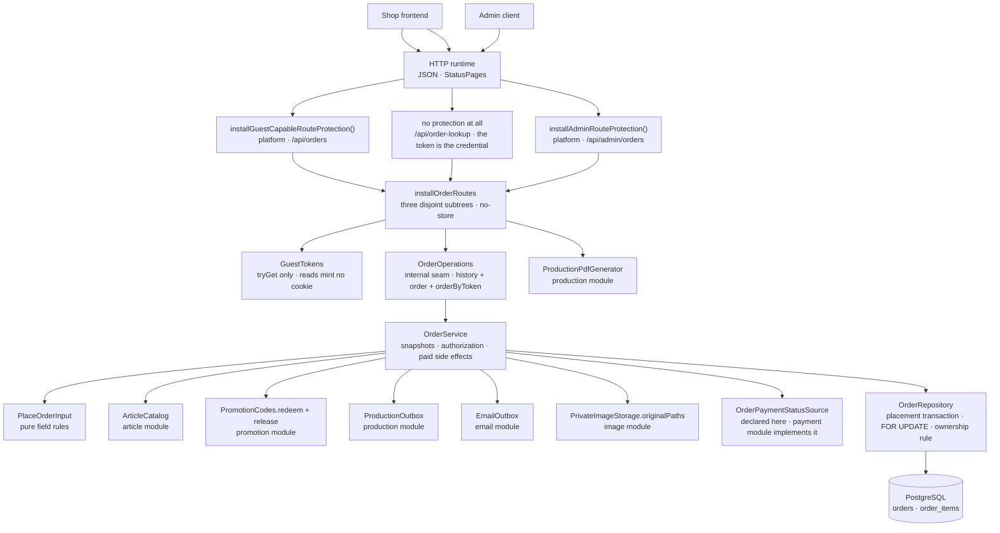

# Backend Order package

This guide explains the Kotlin code in
[`backend/modules/order/src/shop/voenix/order`](../../../backend/modules/order/src/shop/voenix/order).

## What this package does

When a customer has paid, the shop needs a record of what they bought that
nothing can change afterwards. The order package owns that record: the placed
order with its addresses and amounts, its lines with the names and prices the
customer saw, the transitions to `PAID` and `CANCELLED`, and the two things a
paid order sets in motion — the production request and the confirmation mail.

Three properties make it different from the packages migrated before it:

- **An order is a snapshot, not a view.** A cart line renders live catalog
  data; an order line stores it. Renaming an article, changing its price, or
  deleting it altogether must never rewrite what a customer bought.
- **It closes three ports that other modules left open.** Production and email
  were migrated long before an order existed and each declared an interface for
  it, and cart deferred its reorder endpoint. This module supplies all three,
  and the composition root connects them.
- **Its two most important operations have no HTTP surface.** Placing an order
  belongs to the checkout module; the payment writes belong to the payment
  module. Both live here and both answer with their own result type rather than
  an HTTP shape, and both are exported as an interface this module declares,
  implements, and hands on: `OrderPlacement` to the checkout module, and
  `OrderPaymentGateway` to the payment module, which has called it since
  2026-08-01.

The design decisions, the deviations from the .NET original, and the work
deliberately deferred are recorded in
[`order-migration.md`](../../migration/order-migration.md); the frontend and
cross-module follow-ups live in
[`order-post-migration.md`](../../migration/order-post-migration.md).

## The five-minute mental model



Read it top to bottom once: a request arrives on one of three deliberately
separate route subtrees, the route turns session and guest cookie into an
identity — or, on the lookup node, hands the access token on unchanged — the
service decides what an order *means*, and the repository is the only thing
that touches the two tables.

## Production file map

```text
order/
|- Order.kt
|- OrderAccessToken.kt
|- OrderItemReader.kt
|- OrderModule.kt
|- OrderPaymentGateway.kt
|- OrderPaymentStatusSource.kt
|- OrderPlacement.kt
|- OrderRepository.kt
|- OrderRoutes.kt
|- OrderService.kt
|- PlaceOrderInput.kt
`- StoredOrder.kt
```

A file groups the declarations that belong to one concern, as described in
[Kotlin source file organization](source-file-organization.md). That is why the
list is much shorter than the list of types: a small value type lives in the
file of the component that owns it, and a result type lives with the component
that produces it.

- `Order.kt` is what an order *is* for the customer: `OrderView`, the one
  representation the history, the detail read, and the mail link all answer
  with, its lines (`OrderLineView`), and the three-value lifecycle
  `OrderStatus`. All three are `internal` — being serialized by a public route
  does not make a type part of the module interface.
- `OrderAccessToken.kt` holds the bearer credential of one order together with
  `OrderLinks`, the one place that turns it into the
  `{frontend.baseUrl}/order/{token}` link the confirmation mail carries. Token
  and link are one concern: the link is safe to build without escaping
  *because* the token is URL-safe Base64.
- `StoredOrder.kt` is the *inside* view of an order — everything the two
  workers read back, plus `berlinOrderDate`, the single conversion from the
  stored instant to the customer-facing day. It keeps a file of its own because
  repository and service share it equally, so neither is its natural owner.
- `PlaceOrderInput.kt` holds the checkout's input with its `Address` and `Line`
  and the whole pure `validate()` rule set. It is a concern of its own and long
  enough to stay one file.
- `OrderPlacement.kt` is the checkout seam and everything it exchanges: the
  interface, `OrderPlacementResult`, `PayableOrderResult`, and the
  `PayableOrder` snapshot both results carry, together with the conversion that
  builds one from a committed input.
- `OrderPaymentGateway.kt` is the payment seam and its whole vocabulary: the
  three writes, the four exported `OrderPaymentOutcome` words, and the five
  internal `PaidOrderResult` values they are mapped from. The mapping is easier
  to check when both ends of it are in one file.
- `OrderPaymentStatusSource.kt` holds the one capability this module *consumes*
  and declares itself, next to the `OrderPaymentStatus` vocabulary its answers
  are written in.
- `OrderItemReader.kt` stays a file of its own because it is a public seam
  another module compiles against — the cart looks it up by name for its
  reorder route.
- `OrderRepository.kt` holds everything about persistence: the repository with
  its four transactions, the `Orders`, `OrderItems`, and `PrintImages` table
  objects it is the only caller of, the internal `Insertion` result of the
  placing transaction, and the private row mappers and the ownership predicate
  every read shares.
- `OrderService.kt` holds the service and the internal `OrderOperations` seam it
  implements for the routes — the seam lives next to the one class that
  implements it, and route tests stub it.
- `OrderRoutes.kt` holds `installOrderRoutes` with the three disjoint route
  subtrees, the `ProductionPdfInfo` body the admin list answers with, and the
  `ProductionPdfError` → HTTP table. Nothing outside the HTTP layer uses either.
- `OrderModule.kt` is wiring only: the runtime handle, `createOrderModule`, and
  the public `installOrderModule`.

## HTTP API

| Method and path | Protection | Success | Errors |
| --- | --- | --- | --- |
| `GET /api/orders` | guest-capable | `200` — a direct JSON array of orders, newest first | `500` |
| `GET /api/orders/{orderId}` | guest-capable | `200` `OrderView` | `404` (unknown **and** foreign), `500` |
| `GET /api/order-lookup/{token}` | none — the token is the credential | `200` `OrderView` | `404` (malformed, unknown, **and** missing token), `500` |
| `GET /api/admin/orders/{orderId}/production-pdfs` | admin | `200` — array of `{ "supplierId": 3, "fileName": "ORD-42.pdf" }` | `404`, `409` with a `PRODUCTION_PDF_*` code, `500` |
| `GET /api/admin/orders/{orderId}/production-pdfs/{supplierId}` | admin | `200` `application/pdf` as an attachment | `404`, `409`, `500` |

Every response carries `Cache-Control: no-store`. An order answer is personal,
and a shared cache holding one is exactly the vulnerability the legacy PDF
endpoint had.

The list and the detail route answer the same representation — an order is
small and complete, so a list entry without its lines would only force a second
request per order:

```json
{
  "orderId": 42,
  "createdAt": "2026-07-30T09:12:44Z",
  "status": "PAID",
  "paymentStatus": "PAID",
  "subtotal": 3980,
  "shippingCost": 490,
  "discountAmount": 400,
  "total": 4070,
  "items": [
    {
      "orderItemId": 7,
      "articleId": 3,
      "variantId": 9,
      "articleName": "Tasse Klassik",
      "variantName": "Weiß/Blau",
      "quantity": 2,
      "price": 1490,
      "promptPrice": 500,
      "imageId": 12
    }
  ]
}
```

No route of this module takes a request body, so the module registers no
`validateOrderRequests`.

`paymentStatus` is the one field that does not come from this module's tables.
It is one of `OPEN`, `PENDING`, `AUTHORIZED`, `PAID`, `FAILED`, `CANCELED`,
`EXPIRED` — Mollie's vocabulary, uppercased — or `null` when the order has no
payment at all: a free order, or one whose checkout was never started. Note the
spelling: the payment value `CANCELED` carries **one** L while the order
`status` value `CANCELLED` carries two. That is deliberate and must not be
"fixed": Mollie cancelling a payment and the shop cancelling an order are two
different facts written by two different systems, and one spelling would make a
status string silently valid on the wrong side.

The two routes fill the field differently, and the difference is the whole
design of `OrderPaymentStatusSource`:

| Route | Call | What it costs |
| --- | --- | --- |
| `GET /api/orders` | `stored(orderIds)` | one batch read, **never** a provider call — a history of twenty orders must not become twenty HTTP requests |
| `GET /api/orders/{orderId}` | `refreshed(orderId)` | may ask Mollie about a payment that is still `OPEN`, `PENDING`, or `AUTHORIZED`, and may confirm the order when Mollie says it was paid |
| `GET /api/order-lookup/{token}` | `stored(setOf(orderId))` | one read, **never** a provider call — an anonymous request must not be able to make the shop talk to Mollie |

That refresh is the fallback for a webhook that never arrived: the customer
looking at their order is what repairs it. A provider that cannot be reached is
answered with the stored status and a WARN, never with a `502`.

Because the refresh may pay the order *during* the read, the detail read is
written in two steps: the ownership-filtered read first — nothing is ever
refreshed for an order the caller does not own — and, when that refresh answered
`PAID` while the row still said `PENDING`, one more read of the same order. Only
then does the answer describe a single moment in time; otherwise the repairing
response would carry `"status":"PENDING"` next to `"paymentStatus":"PAID"` and
contradict itself.

## Who may read an order

One rule answers every read, and the repository expresses it once:

```kotlin
// this order is the caller's …
Orders.userId eq userId                                   // … because they own it, or
(Orders.userId.isNull() and (Orders.guestSessionToken eq guestToken))  // … because they placed it
```

An order belongs to the account it was placed with. `user_id` is written once,
by the placement, and nothing ever changes it afterwards — since issue #110
there is no login claim that could move a row to an account.

Three consequences are worth spelling out:

- **A guest cookie opens only orders that never belonged to an account.** That
  is what the `user_id IS NULL` half is for, and it is not redundant: a
  signed-in checkout stores *both* handles — the account and the guest cookie
  of that browser — and the cookie is not rotated at logout. Without the
  clause, the cookie left behind would keep opening the account's order. The
  same clause also covers the day an account is deleted, because
  `fk_orders_user` is `ON DELETE SET NULL`.
- **A caller with no identity at all matches nothing**, not everything: the
  predicate becomes `FALSE`, and `GET /api/orders` answers an empty array.
- **Unknown and foreign are the same answer.** Every miss is `404`, including
  an id that is not even a number — telling the two apart is the information an
  attacker probes for.

Reading never creates a guest cookie: the routes use `GuestTokens.tryGet`, so
looking at an order history does not turn an anonymous visitor into a tracked
one.

One read does not use this rule at all, and that is deliberate: the token
lookup. It carries no identity, because the access token *is* the credential —
see [The access token and the permanent
link](#the-access-token-and-the-permanent-link).

## The access token and the permanent link

Since issue #110 there is no login claim, and a guest cookie expires after 30
days. Without a second handle, the guest who ordered without an account would
simply lose their order. The access token is that handle, and it is what the
confirmation mail links to:

```
mail link   {frontend.baseUrl}/order/{token}
API call    GET /api/order-lookup/{token}
```

`OrderAccessToken` is the type, modeled on the email module's
`EmailActionUrl`:

| Property | Value | Why |
| --- | --- | --- |
| Source | 32 bytes from `SecureRandom` | 256 bits — guessing is not a threat model, it is arithmetic |
| Shape | URL-safe Base64 without padding, exactly 43 characters | survives a URL path with no escaping at all |
| Constructor | `private` | a token comes from `generate()` or from a string that has the right shape, never from anywhere else |
| `toString()` | `OrderAccessToken([REDACTED])` | it is a bearer credential; a log line that quotes it hands the order to whoever reads that log |
| `invoke(rawValue)` | the token, or `null` | a URL segment that is not shaped like a token names no order — that is a `404`, never a `400` |
| Serialization | none, deliberately | a type that cannot be serialized cannot end up in a JSON answer by accident |

Every order gets one — account orders included (Joe's decision 2 in issue
#110). An account order is therefore readable through its own mail link without
a login: read-only, that one order, and no access to the account.

The repository generates a token **per insert attempt** and the column is
`NOT NULL` and unique. A collision would be a `23505` like any other, and the
placement's existing bounded retry is what repairs it: `placeOnce` finds no live
order for the cart, answers `null`, and the second attempt inserts with a
*fresh* token. Nothing matches on a constraint name to get there — see
[`persistence-error-handling.md`](persistence-error-handling.md).

The lookup route is its own top-level node, and its security model is the
opposite of `/api/orders`:

- **no protection plugin, no session, no cookie, no CSRF.** The request carries
  a credential in its path and nothing else, and the route mints no guest
  cookie — following a mail link must not turn the reader into a tracked
  visitor;
- **`Cache-Control: no-store`**, like every other order answer;
- **one `404` for every miss** — malformed token, unknown token, no token at
  all. Never a `400`, never a `403`: the difference is the only feedback a probe
  could get;
- **`paymentStatus` from `stored(...)`, never `refreshed(...)`.** An anonymous
  endpoint must not be able to drive outbound provider calls;
- **no rate limit.** This is a documented decision, not an oversight. The
  limiter in this codebase is a *cost gate* — it guards requests that make the
  shop spend money or CPU on an external system — and this route spends
  nothing. What a limiter would otherwise buy is protection against
  enumeration, and 256 bits already make enumeration impossible. Revisit only
  if the route ever gains a cost.
- **The token never travels back.** No API answer contains it, which the flow
  test pins over all three read routes (risk R5 of issue #110).

The accepted trade-off of putting the token in the path rather than in a
fragment: it appears in reverse-proxy request logs. Mitigated by `no-store`,
`Referrer-Policy: no-referrer` on the page, the redacting type, and no
application-side logging of the token.

## Why the routes own three separate subtrees

Ktor merges every registered path into one route tree, and a route-scoped
plugin reaches every descendant of the node it is installed on. Hanging the
admin downloads under `/api/orders` would therefore have put the guest-capable
protection above them, and hanging the token lookup there would have put it
under a plugin it must not have. The module registers three disjoint nodes
instead:

```kotlin
route("/api/orders") { installGuestCapableRouteProtection(); … }

route("/api/order-lookup") { … }   // no plugin at all: the token is the credential

authenticate(AuthRouting.PROVIDER) {
    route("/api/admin/orders") { installAdminRouteProtection(); … }
}
```

The legacy PDF endpoint was anonymous — its admin attribute was commented out —
so every order's production data, addresses included, was readable by order id.
That is deviation D1, and the second node is what fixes it.

## Placing an order

`place(input)` has no route: the checkout module is its caller, and it reaches
it through the exported `OrderPlacement` capability. It runs in three steps.

1. **Field rules.** `PlaceOrderInput.validate()` is pure. It checks the
   address lengths, the two-letter country code, the e-mail shape, the line
   bounds — and two rules that are easy to miss: an order needs *someone to
   show itself to* (a guest token or a user id, the same rule as the table's
   owner CHECK), and its money must describe its own lines (`subtotal` is the
   sum of `(price + promptPrice) × quantity`). Nothing in the database checks
   the second one, so the validator does.
2. **The catalog snapshot.** `ArticleCatalog.find` resolves every
   `(articleId, variantId)` pair of the order in one call, and *every*
   reference has to come back. The legacy checkout stored an empty article name
   for a deleted article and produced an order nobody could ever produce; here
   the placement is refused with `UnknownArticleReference` (deviation D18).
   What the snapshot copies onto the line is the article type, the article and
   variant name, the supplier article number, and the five print measurements.
   The type is on that list since t-shirts joined mugs (issue #205): it decides
   *how* a line is produced — a mug becomes a page of a PDF, a shirt an order at
   a print-on-demand partner — so an order that is already under way must not be
   able to change channel because an admin retyped or deleted the article. A
   t-shirt line stores `NULL` in all five measurements, because those are PDF
   layout overrides and a shirt has no page to lay out.
3. **The write.** One transaction inserts the order, all of its lines in the
   customer's own order (`position`, unique per order), **and the confirmation
   mail** — `emailOutbox.enqueue(QueuedEmailReference.OrderConfirmation(id))`
   runs inside that very transaction.

A `null` billing address is not missing data — it is the customer saying "same
as shipping", and `effectiveBillingAddress` stores the shipping values in the
billing columns.

### Why the confirmation mail hangs on the placement

Until issue #110 the mail was enqueued by `markPaid`. It moved to the placement
(Joe's decision 3), and the production request stayed behind:

| Write | Side effects in its transaction |
| --- | --- |
| placement | the confirmation mail |
| `markPaid` | the promotion redemption, the production request |

The reason is the link the mail carries. It is the customer's durable handle to
their order (see [The access token and the permanent
link](#the-access-token-and-the-permanent-link)), and a customer whose payment
failed needs it *most* — that is the order they want to look at. Waiting for a
payment would hand out the handle exactly when it is least needed.

Because the enqueue is inside the placing transaction, a placement that rolls
back leaves no mail and a committed order can never be without one. The mail
worker resolves the order again per attempt, so it always mails the link the
order carries now.

The accepted edge, documented in the plan of issue #110: an order that is
cancelled right after placement — a payment that could not even be created —
still triggers its confirmation mail. The link then shows the real, cancelled
status, which is why the template's wording is payment-neutral: it confirms
that the order *arrived*, never that it was paid.

`OrderPlacementResult` names the outcomes:

| Result | Meaning |
| --- | --- |
| `Placed(order)` | The order exists now |
| `AlreadyPlaced(order)` | This cart already had a live order; use it |
| `Invalid(errors)` | The input broke its own field rules; nothing was written |
| `UnknownArticleReference` | A line names a variant the catalog does not know |
| `UnknownPrintImage` | A line names a print image that does not exist |

Both successes carry a `PayableOrder` — the order id, the total, the contact
fields, and the two stored addresses — and not the internal `OrderView`. A
payment has no use for lines or a status, and keeping the customer's own view
`internal` is what stops it leaking into another module.

`AlreadyPlaced` is a *success*, and it is what makes a double checkout
harmless. Nothing in the service prevents it — the partial unique index does
(see [The schema](#the-schema)), and the repository turns the resulting SQL
state `23505` into the order that won the race. A preliminary "does this cart
have an order?" query would race and is deliberately absent. The answer is
always the **winning stored order**, so a second, edited submission is silently
answered with what the first one stored (deviation D15 of the Checkout
migration).

## Reading an order that still has to be paid

`payable(orderId, userId, guestToken)` is the second half of `OrderPlacement`,
and it exists for one journey: the customer whose payment failed and who wants
to try again. It is a pure read of the stored snapshot under the *same*
ownership rule as the customer's own order reads, and it answers five things:

| Result | Meaning |
| --- | --- |
| `Payable(order)` | Pending, owned by the caller, and it costs money |
| `NotFound` | Unknown id **or** somebody else's — deliberately the same answer |
| `AlreadyPaid` | The order is `PAID`; there is nothing left to pay |
| `Cancelled` | The order is `CANCELLED`; it will never be paid |
| `Free` | The total is zero: it is confirmed without a payment |

Unknown and foreign ids being indistinguishable is what keeps an id from being
probed — and what makes sure no provider call is ever made on a stranger's
behalf.

## Confirming a payment

`markPaid(orderId)` is the write behind `OrderPaymentGateway.confirm`, which is
what the payment module calls. Everything it does happens in **one**
transaction:

```kotlin
SELECT … FROM orders WHERE id = ? FOR UPDATE   // before the status is read
  → PAID?      AlreadyPaid,  nothing happens twice
  → CANCELLED? Cancelled,    the order stays cancelled
  → PENDING?   redeem the promotion · UPDATE status · request production
```

The lock is taken *before* the status it decides from is read, so two payment
confirmations of the same order queue up instead of both seeing `PENDING`. The
lock order is always orders → promotions; nothing in this module takes them the
other way round.

The redemption and the production request both join that same transaction. They
are not consequences that happen afterwards — they are part of the same
decision, which is why "the order was paid" and "its side effects exist" are one
committed fact and no compensation code exists anywhere in the module. The
legacy processor fired them after the commit through an unchecked channel write
(deviation D11).

The confirmation mail is *not* in that list any more: since issue #110 it
belongs to the placement (see [Why the confirmation mail hangs on the
placement](#why-the-confirmation-mail-hangs-on-the-placement)). A payment
therefore enqueues no mail at all, and a rolled-back payment does not take the
placement's mail with it.

Two results are deliberate departures from the legacy processor:

- **`Cancelled`.** The legacy code would have paid a cancelled order silently.
- **`PromotionRefused(reason)` is a paid order.** When the coupon's usage limit
  turns out to be exhausted at payment time, the money has already been taken.
  Refusing would leave the customer charged and never delivered — the legacy
  outcome, where the order stayed `PENDING` forever. The order becomes `PAID`
  without a redemption and the service logs a warning naming the reason the
  promotion module gave (Joe's decision of 2026-07-31, deviation D22).

An unexpected database failure is not a result at all: it surfaces as an
exception and rolls the transaction back, exactly like every other internal
capability of this codebase.

## Cancelling an order

`markCancelled(orderId)` is the write behind `OrderPaymentGateway.cancel`, and
it is the mirror image of the one above — same lock, same shape, and exactly
one side effect:

```kotlin
SELECT … FROM orders WHERE id = ? FOR UPDATE   // before the status is read
  → PAID?      REFUSED,          the order stays paid
  → CANCELLED? ALREADY_APPLIED,  nothing happens twice
  → PENDING?   release the promotion reservation · UPDATE status = 'CANCELLED'
```

That release is deviation D3 of the Checkout migration. An order that stops
being live stops holding its promotion's capacity, in the very same commit, so
a rolled back cancellation keeps both. It runs only for an order that *has* a
promotion — the locked row carries the cart the reservation is keyed on — and
only on the `PENDING → CANCELLED` transition, so neither early return above can
release anything.

## When a payment ends without the order

`paymentEnded(orderId)` is the third write of `OrderPaymentGateway`, and it is
the one that changes no status at all. A payment that failed, expired, or was
cancelled by the customer leaves the order `PENDING`, because the customer may
still start a second one. What *does* end is the promotion capacity the
checkout is holding for that order's cart: the reservation is released in its
own transaction, so the unit is free for somebody else while this order waits
(deviation D4).

The order row is locked first all the same, which keeps the lock order of this
module acyclic — always orders → promotions — and keeps a release from
overtaking a running confirmation whose redemption is about to consume that
very reservation. An unknown order, an order without a promotion, and a
reservation that is already gone are all the same no-op, which is what makes a
redelivered notification harmless. The payment module leans on that: it notifies
on *every* delivery that finds the payment terminal, because a redelivery is the
only retry a lost release has.

The shared lock is the reason both writes are transactions of their own: a
confirmation and a cancellation of one order are two writers of one row, so
whoever comes second decides from what the first one committed. The order ends
in exactly one status, and its side effects are the ones that status implies.

`PAID` is the state a cancellation must never leave: the money moved, and the
production request already exists. The service logs a
warning and answers `REFUSED`, which the payment module turns into the manual
refund case (deviation D14 of the Payment migration).

A cancelled order falls out of `ux_orders_live_cart`, so the customer can check
that cart out again. That is also what made one situation reachable that never
was before: a placement can hit the index, and by the time it reads the order
that refused it, that order can be cancelled. `place` therefore retries the
insert **once** — a second conflict without a live order would mean the index
and the re-read disagree, which is a bug to see rather than to loop over.

## The two read paths that are not a customer

Production comes back for the order after it was *paid* and the confirmation
mail after it was *placed*, and both read the stored order again on every
attempt through `StoredOrder`. Neither carries an ownership predicate — a worker is not a
customer — which is why that read is the only one in the module that no route
can reach.

`StoredOrder` carries the `accessToken` along with the row, so the confirmation
mail can build its permanent link without a second query. It is an
`OrderAccessToken` and not a string, which is what keeps the data class's own
generated `toString` from printing a bearer credential.

`OrderLinks` turns that token into the link, and it lives in this module for the
same reason `AccountMailer` builds the account links: the frontend *path* is
knowledge of whoever sends the customer there, while the *host* is one
application-wide setting. It is built in `createOrderModule` from the
`FrontendBaseUrl` the composition root hands in:

```kotlin
orderUrl(token) = EmailActionUrl(base.value + "/order/" + token.value)
```

The result is an `EmailActionUrl`, not a string, and `QueuedEmail.OrderConfirmation`
carries it as one — the queued mail is a data class, and a string field would
print the link in every `toString` the mail ever reaches. Nothing is
percent-encoded, because a token is URL-safe Base64 already.

`productionData(orderId)` builds the `ProductionData` the production module
produces from, and four of its values are deliberately *not* stored:

| Value | Where it comes from | Why |
| --- | --- | --- |
| `supplierId` | resolved live through `ArticleCatalog` | An article with no supplier assigned yet must stay repairable: production reports the item as retryably invalid, an admin assigns the supplier, and the same request succeeds on the next scan (deviation D24) |
| `spodProduct` | the **same** `ArticleCatalog` answer | The three ids the print-on-demand partner names a product by are current master data, so a correction reaches an order that is still waiting to be submitted. The snapshotted `variantName` next to it is what lets the submitting adapter refuse when the live ids no longer describe what was ordered |
| `imagePath` | `PrivateImageStorage.originalPaths` by file name | Where private originals live is the image module's secret; this module stores a name and never builds a path |
| `orderDate` | `created_at` converted to `Europe/Berlin` | An order placed at 00:30 Berlin time belongs to that Berlin day; production and the mail take the date from the same place, so they can never name different days |

The customer's `customerEmail` and `customerPhone` come from the order row and
are on this view alone: the print-on-demand channel puts both on the order it
creates, while the fulfillment view a supplier reads carries neither and stays
minimal.

A missing supplier and a missing image file are both `null`, which production
records as retryable. A storage that cannot answer *at all* is a different
thing and must not look like one: it throws, and the worker retries.

`orderConfirmation(reference)` builds the `QueuedEmail.OrderConfirmation` the
same way. Everything the customer paid for stays what it was; only the
recipient is read fresh, so an address corrected between two attempts reaches
them. Subtotal and discount are stored columns rather than the "total minus
shipping" the legacy mail computed — deviation D12, without which the first
100 % coupon would have retried forever against the old
`total >= shipping` invariant.

## The schema

[`V16__create_orders.sql`](../../../backend/modules/platform/resources/db/migration/V16__create_orders.sql)
creates two tables and closes two references other migrations deferred.

- **`orders`** — the cart it was placed from, the guest token and/or user it
  belongs to, an optional promotion, the access token, the status, typed
  shipping and billing address columns, e-mail and phone, and the four amounts.
- **`order_items`** — one row per line: `position`, the article and variant
  ids, the snapshotted `article_type`, the name and price snapshots, the
  supplier article number, the five measurements, and the prompt and
  print-image references. `article_type` was added by `V21` and backfilled with
  `'MUG'`; it carries no foreign key either, for the same reason the two ids do
  not.

Five rules are worth a sentence each:

| Rule | Why |
| --- | --- |
| `article_id` and `variant_id` carry **no** catalog foreign key | An order must survive the deletion of the article it was placed for. A deliberate asymmetry to `cart_items`, whose lines are a live selection |
| `CHECK (total = subtotal + shipping - discount)`, all amounts non-negative | The amounts are stored, not derived, so the database is what keeps them one consistent statement |
| partial unique index `ux_orders_live_cart` on `(cart_id) WHERE status <> 'CANCELLED'` | One live order per cart. A cancelled order falls out of the index, so a cart whose payment failed can be checked out again |
| `access_token text NOT NULL` with unique index `ux_orders_access_token` | Every order — account orders included — has a durable handle, and a token names at most one order. It is the index the placement's collision retry leans on |
| `orders.promotion_id` and `order_items.print_image_id` are `RESTRICT` | A promotion an order used, and an image an order prints, must not vanish under it |

`user_id` is `ON DELETE SET NULL`, like every other customer-owned row: the
record survives the account. The consequence is recorded as deviation D25 — the
order becomes visible to the guest cookie again — and is accepted because no
account-deletion feature exists yet.

The migration also adds `promotion_redemptions.order_id` (`NOT NULL`, unique,
`RESTRICT`) and the `production_requests.order_id` foreign key. Both were
deferred by their own migrations because `orders` did not exist; both are
stronger than the legacy schema, where the redemption's order id was nullable.

Indexes exist for exactly the queries the module runs: `(user_id, created_at
DESC)` for the history, `(guest_session_token)` for a guest's history, and the
unique `(access_token)` for the mail link. The
partial `LOWER(email) WHERE user_id IS NULL` index that answered the e-mail
branch of the login claim disappeared with the claim itself (issue #110).

## The seven exported capabilities

`OrderModule` is public because the composition root passes what it exports
onward after the install. Everything behind them — operations, service,
repository, tables — stays `internal`.

- **`OrderItemReader.find(orderItemId, userId, guestToken)`** is what the cart
  needs to put an ordered line back into a cart: article, variant, prompt, and
  print image, and nothing else. It returns `null` for unknown *and* foreign
  ids. The prices are absent on purpose — a reorder is charged at today's
  catalog price (deviation D13) — and so is the quantity, because a reorder is
  a normal add of one line, not a replay of the old order.
- **`placement`** is `OrderPlacement`, the two calls the checkout module is
  given: `place(input)` and `payable(orderId, userId, guestToken)`. Like the
  gateway below it is declared *and* implemented here, because what an order
  is, what it snapshots, and who may see it are this module's decisions. The
  caller hands in a `PlaceOrderInput` it has already priced and receives a
  `PayableOrder`; everything else stays inside.
- **`payments`** is `OrderPaymentGateway`, the three writes the payment module
  is given: `confirm(orderId)`, `cancel(orderId)`, and `paymentEnded(orderId)`.
  The first two answer the four
  `OrderPaymentOutcome` values `APPLIED`, `ALREADY_APPLIED`, `UNKNOWN_ORDER`,
  and `REFUSED`. It is the one export this module both *declares and*
  implements, because an order status is this module's decision. The five
  internal `PaidOrderResult` values are mapped onto those four here, and
  `PromotionRefused` maps to `APPLIED`: a paid order without a redeemed coupon
  is a promotion problem this module logs, not a failed payment (deviation D13
  of the Payment migration).
- **`productionSource`** is the production module's `ProductionSource`,
- **`fulfillmentOrders`** is the production module's `FulfillmentOrderSource`,
- **`shippingNotificationOrders`** is the production module's
  `ShippingNotificationOrderSource`, and
- **`orderConfirmations`** is the email module's `QueuedEmailSource` for
  `OrderConfirmation` references. All four are plain lambdas over the service
  or the repository: they are the *consumers'* interfaces, so a class per port
  would only add a name for the same call.

`fulfillmentOrders` is deliberately a second, much narrower production port
next to `productionSource`. What a supplier's screen may show is not what the
PDF renderer needs, so `OrderRepository.fulfillmentOrders(orderIds)` selects
exactly nine columns — order id, `created_at`, and the seven shipping-address
and recipient-name fields — for a whole list page in one statement. No e-mail
address, no phone number, no amount, and no access token is ever *read*, which
is what makes the data minimization of the supplier surface structural instead
of a filter someone has to remember. The order date is the Berlin calendar day
from the shared `berlinOrderDate`, the same one the production PDF and the
confirmation mail print.

`shippingNotificationOrders` is the third narrow port in that family, and it
answers the customer half of the mail a supplier's shipment triggers: the
recipient's e-mail address, their first name, and the permanent order link.
The link matters more than it looks: it is handed over as a ready-built
`EmailActionUrl`, so the order **access token never crosses the boundary** —
production mails the link without ever being able to log or store the
credential behind it. Like the confirmation mail, every value is read again per
attempt, so a corrected address reaches the next send; `null` means the order
is gone and the e-mail worker retries later. See the
[Production package](production-package.md) for what production combines it
with.

The traffic in the other direction is one *consumed* capability that this
module also declares: `OrderPaymentStatusSource`, implemented by the payment
module and handed in at install time as `payments`. Declaring it here rather
than in payment is the same rule as `OrderPaymentGateway` — the cart re-exports
this module, so an interface owned by payment would drag the Mollie integration
into every order consumer.

## Composition

```kotlin
val productionSource = LateBoundProductionSource()
val paymentStatus = LateBoundPaymentStatus()
val emails = installEmailRuntime(database, settings.email, settings.production, productionSource)
val order = installOrderModule(
    database = database,
    frontendBaseUrl = settings.frontend.baseUrl,
    articles = articles,               // ArticleCatalog
    promotions = promotionCodes,       // PromotionCodes
    productionOutbox = emails.production.outbox,
    emailOutbox = emails.emailOutbox,
    printImages = images.privateStorage,
    payments = paymentStatus,          // OrderPaymentStatusSource
    productionPdfs = emails.production.pdfGenerator,
    guestTokens = guestTokens,
)
productionSource.bind(order.productionSource)
emails.bindOrderConfirmations(order.orderConfirmations)

val payments = installPaymentModule(database, settings.mollie, order.payments)
paymentStatus.bind(payments.statusSource)
```

The first line is the interesting one. Production and email are installed
*before* the order module, because the order module consumes their outboxes and
the PDF generator — while production needs a `ProductionSource` only this
module can implement. That is a wiring cycle, and the composition root is the
one honest place to break it: `LateBoundProductionSource` is handed to
production at install time and receives the real implementation two lines
later. Until then a load fails with `IllegalStateException`, which every
production stage and the email worker record as the retryable
`SOURCE_UNAVAILABLE` — deliberately the same behavior the pre-Order stub had.
Answering `null` would be the dangerous alternative, because production reads
that as "this order does not exist".

`LateBoundPaymentStatus` is the same pattern once more, and the second half of
the same knot: the payment module is installed *after* order because it needs
`order.payments` (the `OrderPaymentGateway`), while an order read needs
payment's status source. Order is installed with the late-bound source, payment
is installed, and the `bind` closes the loop. Between the two lines a status
read fails with `IllegalStateException` rather than answering `null` — `null`
is the contracted word for "this order has no payment", and a customer who just
paid must never be told that.

`frontendBaseUrl` is the module's only setting: `frontend.baseUrl`, read once
by `ApplicationSettings` and shared with the account module, which mails its
links over the same host. `createOrderModule` turns it into the `OrderLinks` the
service builds the confirmation mail's link with.

The cart is installed after the order module and receives `order.orderItems`.
Nothing is handed to the account module any more: issue #110 removed the login
claim, so no module moves rows to an account after a sign-in.

## Tests

| Test class | Level | What it pins down |
| --- | --- | --- |
| `OrderInputValidationTest` | pure | the whole field-rule matrix of `PlaceOrderInput`, including the owner rule and the money-describes-its-lines rule |
| `OrderAccessTokenTest` | pure | the token type: 43 URL-safe characters, never repeating, `toString` redaction, and the strings that are not a token |
| `OrderPlacementIntegrationTest` | service + PostgreSQL | what a placement writes: the snapshots (the article type of every line included, with a t-shirt line proving the five measurements stay `NULL`), catalog-change isolation, the billing fallback, the line order, the placements that must write nothing at all, one access token per order, the forced token collision that is retried instead of reported as `AlreadyPlaced`, and the confirmation mail — exactly one per placed order, none for a refused placement, and an order that is not placed at all when its enqueue fails |
| `OrderPaymentIntegrationTest` | service + PostgreSQL | `markPaid` idempotency, `Cancelled`, `PromotionRefused`-still-paid, rollback leaving no redemption and no production request, that a payment enqueues no mail and never takes the placement's one back, cancellation rethrow, that no guest token ever reaches a log line, and the exported 5→4 outcome mapping |
| `OrderCancellationIntegrationTest` | service + PostgreSQL | the cancel transition matrix, the cancelled order freeing its cart, the reservation released in the same commit, and the refused cancellation of a paid order with its warning |
| `OrderPaymentEndedIntegrationTest` | service + PostgreSQL | `paymentEnded` releasing the reservation while the order stays `PENDING`, and the four cases that must be no-ops: a redelivery, an order without a promotion, an unknown id, and an order already paid |
| `OrderPlacementCapabilityIntegrationTest` | service + PostgreSQL | the exported `OrderPlacement` read off the module handle: the `PayableOrder` a placement answers, `AlreadyPlaced` answering the winning stored order, and the whole `payable` matrix including the foreign-order `NotFound` |
| `OrderAccessIntegrationTest` | service + PostgreSQL | the authorization rule, history ordering, the guest cookie of a signed-in checkout staying shut out of the account's order, the reorder reader, and the module handle |
| `OrderConcurrencyIntegrationTest` | service + PostgreSQL | two parallel placements for one cart, two parallel `markPaid`, the redemption-limit race, a confirmation against a cancellation, and a placement against a cancellation of the same cart — each with both writers really concurrent |
| `OrderSchemaIntegrationTest` | Flyway + PostgreSQL | every CHECK, foreign key, and unique rule, each violated by a statement that can only trip that one rule — including `access_token` being `NOT NULL` and `ux_orders_access_token` existing by name |
| `OrderProductionSourceTest` | service + PostgreSQL | snapshot fidelity against a changed catalog, live supplier **and SPOD product** resolution, the stored e-mail and phone number on the production view, missing supplier and missing image file as `null`, item order by `position` |
| `OrderConfirmationMailTest` | service + PostgreSQL | the mail is rebuilt from the stored order per attempt: changed recipient reaches the customer, amounts do not move, Berlin order date across midnight, and the permanent link is built from the token the order carries *now* |
| `OrderShippingNotificationSourceTest` | service + PostgreSQL | the port the shipping mail is built from: recipient, greeting name, and the permanent link — read again per attempt, redacted in `toString`, `null` for an unknown order |
| `OrderRouteSecurityAndValidationTest` | route (stub operations) | admin routes closed before any generation, which identity each read is answered for, unparsable ids answered without asking an operation, and the lookup route's uniform `404` including the request with no token at all |
| `OrderFlowIntegrationTest` | route + PostgreSQL | whole journeys over HTTP: the exact wire shape (`paymentStatus` included), history ordering, the ownership matrix, the PDF download, the mail link read without any identity and without a payment refresh, and the token-leak pin over all three read routes |
| `PaymentCompositionIntegrationTest` (app) | app + PostgreSQL | the two Payment bindings: a webhook pays a real order, and an order answer carries a `paymentStatus` — which only a bound `LateBoundPaymentStatus` can produce |
| `OrderCompositionIntegrationTest` (app) | app + PostgreSQL | two of the three bindings against the real composition root: production source and cart reorder |
| `OrderConfirmationRuntimeIntegrationTest` (app) | app + PostgreSQL | the third: the confirmation of a *placed* (not yet paid) order is resolved by the order module and delivered by the mail worker, permanent link included |

The service-level classes are slices of one subject, so they share
their stage: `OrderServiceTestBase` migrates and seeds the database, wires the
service to the fakes in `OrderTestSupport`, and captures the module's log.

Run them with:

```sh
./kotlin test --include-module order
```

The integration tests need Docker, because they start PostgreSQL through
Testcontainers.

## What is deliberately not here

- **Checkout orchestration.** Loading the cart, calculating the totals,
  checking the address, re-checking the promotion before payment, and writing
  `carts.status = 'CHECKED_OUT'` belong to the checkout module — see the
  [Checkout package guide](checkout-package.md). `PlaceOrderInput` arrives with
  the amounts already decided. (There is no country list to validate against:
  the shape of the two-letter code is all anybody checks, and whether the shop
  ships there is an open product decision.)
- **Payment.** What a payment *does* to an order lives here — the three writes
  of `OrderPaymentGateway` — and so does the vocabulary an order answer carries:
  `OrderPaymentStatus` and `OrderPaymentStatusSource` are declared here so that
  no consumer of an order ever compiles against the Mollie integration. The
  payment itself — the `payments` table, the provider call, the webhook — is
  the payment module's, and this module never learns that a provider exists.
- **Promotion capacity reservation itself.** The reservation is a promotion-
  owned row (`promotion_reservations`), and this module only ends one: through
  the redemption of a paid order, through the cancellation of an order, and
  through `paymentEnded`. Taking a reservation belongs to the checkout module,
  which calls `PromotionCodes.reserve` before it places the order; see
  [`checkout-migration.md`](../../migration/checkout-migration.md).
- **`custom_data` and the `SHIPPED` status.** Both were dead in the .NET
  source — one only ever held `{}`, the other was never written — and were
  dropped with the migration (deviations D6 and D7).
