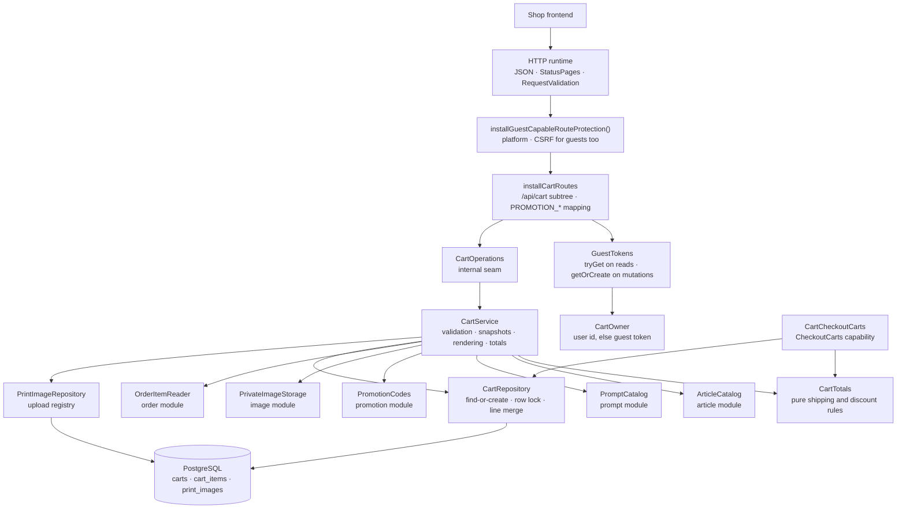

# The Cart package

This guide explains the Kotlin code in
[`backend/modules/cart/src/shop/voenix/cart`](../../../../backend/modules/cart/src/shop/voenix/cart).

## What this package does

A visitor of the shop picks an article — a mug or a t-shirt — optionally a
generation prompt, uploads the image that is to be printed on it, and puts all
of that into a cart. The cart
package owns that cart: the lines with the prices they were quoted at, the
uploaded print images, the coupon code the cart carries, and the totals the
checkout charges.

Two things make it different from the packages migrated before it:

- **Most of its callers are anonymous.** A customer fills a cart long before
  they have an account, so an anonymous cart is identified by the guest session
  token from the encrypted `voenix.guest` cookie. A signed-in customer's cart is
  identified by their user id instead, and the two never mix: a cart keeps the
  identity it was created with for life.
- **It is the first consumer of three capabilities.** Article, Prompt, and
  Promotion each exported a capability that nothing bound yet. The cart binds
  all three, Image's private storage on top, and, since the Order migration,
  one capability of the order module: `OrderItemReader` for the reorder route.

The design decisions, the deviations from the .NET original, and the work
deliberately deferred are recorded in
[`cart-migration.md`](../../../migration/cart-migration.md).

## The five-minute mental model



Read the diagram top to bottom once. A request arrives, the CSRF protection
decides whether it may mutate anything, the route turns cookies and session
into a `CartOwner`, and the service decides what the cart *means*. The two
repositories are the only things that talk to the three tables:
`CartRepository` owns `carts` and `cart_items`, `PrintImageRepository` owns the
standalone upload registry, and `CartCheckoutCarts` answers the one capability
the cart exports.

## Production file map

The package holds its production types in eight files. A file is one concern,
not one type: a component keeps the small value and result types it owns next
to itself, as
[Kotlin source file organization](../conventions/source-file-organization.md) describes.

```text
cart/
|- Cart.kt
|- CartModule.kt
|- CartRepository.kt
|- CartRoutes.kt
|- CartService.kt
|- CartTotals.kt
|- CheckoutCarts.kt
`- PrintImageRepository.kt
```

| File | What lives in it |
| --- | --- |
| `Cart.kt` | the rendered cart as `CartView`, `CartLine`, and `AppliedPromotion`, plus `CartOwner`, who it belongs to |
| `CartRoutes.kt` | `installCartRoutes` with the three request bodies it validates and the `PrintImageId` the upload answers |
| `CartService.kt` | `CartService`, the internal `CartOperations` seam, and `CartPromotionResult` |
| `CartRepository.kt` | `CartRepository`, the `carts` and `cart_items` tables, the stored `StoredCart`, and `CartWriteResult` |
| `PrintImageRepository.kt` | the upload registry, its `print_images` table, and `CartGuestImages` |
| `CartTotals.kt` | the pure shipping and discount arithmetic, shared with the checkout |
| `CheckoutCarts.kt` | the exported `CheckoutCarts` capability, its `CheckoutCart` snapshot, and `CartCheckoutCarts` |
| `CartModule.kt` | the runtime handle, the composition functions, and the request-validation registration |

## HTTP API

Every response except the upload is the complete recalculated cart.

| Method and path | Body | Success | Errors |
| --- | --- | --- | --- |
| `GET /api/cart` | none | `200` `CartView`; no cart yet → empty view | `500` |
| `POST /api/cart/images` | multipart, part `file` | `201` `{"id": 42}` | `400` (no part, unreadable, unsupported, too large, CSRF), `500` |
| `POST /api/cart/items` | JSON | `200` `CartView` | `400` (field rules, not purchasable, prompt unusable, foreign image, CSRF), `500` |
| `POST /api/cart/order-items/{orderItemId}` | none | `200` `CartView` | `400` (CSRF), `404` (unknown or foreign order item), `409` `ORDER_IMAGE_UNAVAILABLE`, `500` |
| `PATCH /api/cart/items/{itemId}` | `{"quantity": 1..99}` | `200` `CartView` | `400`, `404`, `500` |
| `DELETE /api/cart/items/{itemId}` | none | `200` `CartView` | `400` (CSRF), `404`, `500` |
| `POST /api/cart/promotion` | `{"promotionCode": "…"}` | `200` `CartView` | `400`/`403`/`409` with a `code`, `404`, `500` |
| `DELETE /api/cart/promotion` | none | `200` `CartView` | `400` (CSRF), `404`, `500` |

The print image itself is delivered by the image module under
`GET /api/images/guest/{size}/{id}`; see
[the image package guide](image-package.md) and the section on ports below.

An example response:

```json
{
  "id": 12,
  "items": [
    { "id": 34, "articleId": 10, "variantId": 20, "articleType": "MUG",
      "articleName": "Classic",
      "variantName": "Weiß", "outsideColorCode": "#ffffff",
      "insideColorCode": "#ff0000", "available": true, "price": 1490,
      "quantity": 2, "imageId": 77, "promptId": 5, "promptPrice": 500 }
  ],
  "subtotal": 3980,
  "shippingCost": 490,
  "discountAmount": 447,
  "total": 4023,
  "totalItems": 2,
  "appliedPromotion": { "id": 3, "name": "Sommer", "promotionCode": "SAVE10",
                        "discountType": "PERCENTAGE", "discountValue": 10 }
}
```

`price` and `promptPrice` are snapshots taken when the line was added; the rest
of a line is **current master data, resolved on every read** in one batched
`ArticleCatalog.find` call. `articleType` is part of that live half (issue
#205): `cart_items` stores only the article and variant ids — the type comes
from the catalog — and it is what a client switches on to render the line, a
`"MUG"` with its two colour codes or a `"TSHIRT"` whose colour and size are in
its `variantName` (`"Black / M"`). A line whose reference the catalog no longer
answers keeps its snapshot price and renders with `articleType: null`, `null`
names, and `available: false` instead of disappearing. The `CheckoutCart`
snapshot this package hands the checkout carries no type for the same reason —
it is a list of references and amounts — which is why the checkout asks the
catalog itself when it needs to know whether a cart holds a shirt (see the
[Checkout package guide](checkout-package.md)).

## Who a cart belongs to

`CartOwner` carries an optional user id and an optional guest token, and which
of them identifies the cart depends on the request:

- a **signed-in** request finds and creates its cart by **user id**;
- an **anonymous** request does the same by **guest token**.

A cart therefore never carries both, and the database enforces that with a
CHECK plus one partial unique index per half. A request that carries neither
identity means no cart at all.

This is the revision of issue #77, and it replaced the original rule of
deviation 14 of the migration record: "the token is the identity of a cart,
always".
Since issue #110 removed the login claim, the separation is permanent: **a
login changes no cart row.** The visitor's cart stays the token's, the
customer's cart stays the account's, and signing in simply shows the other one.
The browser keeps its `voenix.guest` cookie across login, logout, and
registration, so the guest cart is still there when the customer signs out
again.

The guest token still matters for a signed-in caller, because two things next
to the cart carry an ownership rule of their own: a print image and an ordered
line a reorder starts from. Both follow the same rule, and it is not a plain
"token **or** user": the token identifies a row that has **no user**, and a row
that carries a user id belongs to that user alone.

For print images the difference is not academic, because an upload made while
signed in stores *both* owners: the table requires at least one owner and
`fk_print_images_user` is `ON DELETE SET NULL`, so a user-only row would vanish
with the account. `ownershipPredicate` therefore compares the token only against
rows whose `user_id` is `NULL`. Without that guard the next person on a shared
browser could fetch the previous customer's uploads through
`GET /api/images/guest/{size}/{id}` and attach them to a cart of their own.
The cookie is never renewed and never rotated.

Reads and mutations differ in one more way:

```kotlin
// a mutation: the first one turns an anonymous browser into an addressable guest
CartOwner(guestToken = guestTokens.getOrCreate(call), userId = currentUserId())

// a read: neither a session nor a cookie means no cart, and no new guest either
CartOwner(guestToken = guestTokens.tryGet(call), userId = currentUserId())
```

Looking at a cart must not create a tracked visitor, so `GET /api/cart`
answers `CartView.EMPTY` (`id: null` and zeros) when the request carries
neither a session nor a guest cookie, without touching the database at all.

## Why the routes own the whole `/api/cart` node

Ktor merges every registered path into one route tree. A route-scoped plugin
therefore applies to the node it is installed on **and every child of that
node**, including siblings that another module registered under the same
prefix. The cart installs the guest-capable CSRF protection on its own second
segment:

```kotlin
route("/api/cart") {
    installGuestCapableRouteProtection()
    get { … }
    post("/images") { … }
    route("/items") { … }
    route("/promotion") { … }
}
```

If the protection were installed one level higher, on `/api`, every route of
every other module would inherit it. Owning `/api/cart` keeps the blast radius
of the plugin exactly at the cart.

The protection itself is platform-owned and described in
[the authentication guide](../conventions/authentication-and-authorization.md). It lets every
request through and requires a valid CSRF pair on `POST`, `PUT`, `PATCH`, and
`DELETE`, from guests as well as from signed-in customers.

## The three-step add

`POST /api/cart/items` is the one operation with real logic behind it, and it
runs in three steps:

1. **Field rules.** `AddCartItemInput.validate()` checks that the ids are
   positive and the quantity is 1 to 99. The shared Request Validation plugin
   runs the same rules before the handler, so a malformed body never reaches
   the service.
2. **Snapshots.** `ArticleCatalog.find` answers whether the variant may be
   bought at all and what it costs right now; `PromptCatalog
   .findSalesGrossPriceCents` does the same for the prompt. Both numbers are
   written onto the line and never change again. A later price change moves
   the shop's catalog, not a cart a customer is already looking at.
3. **The write.** `CartRepository.addItem` finds or creates the cart, checks
   that the image belongs to the caller, and merges or appends the line.

## Reorder: an ordered line becomes a cart line

`POST /api/cart/order-items/{orderItemId}` is a cart route although what it
starts from belongs to an order, because what it *produces* is a cart line.
The order module exports the lookup (`OrderItemReader`), the cart owns the
route:

```kotlin
val ordered = orderItems.find(orderItemId, owner.userId, owner.guestToken)
    ?: return OperationResult.NotFound
```

The historical line contributes exactly four references: article, variant,
prompt, and print image. Everything else is decided again
right now, because the operation ends in the ordinary `addItem` above: the
catalog says whether the variant can still be bought and what it costs
**today** (never the price the customer paid back then), the line merges into
an identical one, and it gets its position the same way. That is why reorder
adds no second write path, and why the new line always has quantity 1 rather
than the ordered quantity.

The print image is the one thing a reorder cannot replace: it references the
very same row and copies no file. A line that carries none, an image row this
caller may not use, and an image whose file is gone are therefore all the same
answer: `409` with `ORDER_IMAGE_UNAVAILABLE`, the only conflict any cart
operation reports. A frontend branches on it to offer a fresh upload.

## Concurrency: two rules, both enforced by PostgreSQL

A cart is one of the few things a customer can hit twice at the same time.
Double-clicking "add to cart" is the everyday case. Two rules keep that safe,
and neither is a preliminary read:

**One active cart per owner.** Two partial unique indexes say so, one per half
of the identity rule:

```sql
CREATE UNIQUE INDEX ux_carts_active_guest_session_token
    ON carts (guest_session_token)
    WHERE status = 'ACTIVE' AND guest_session_token IS NOT NULL;

CREATE UNIQUE INDEX ux_carts_active_user_id
    ON carts (user_id)
    WHERE status = 'ACTIVE' AND user_id IS NOT NULL;
```

The repository inserts first and ignores a conflict, then re-selects:

```kotlin
Carts.insertIgnore { … }                    // INSERT … ON CONFLICT DO NOTHING
lockedActiveCartIdInTransaction(owner)      // SELECT … FOR UPDATE
```

`lockedActiveCartIdInTransaction` is `private`, like every other
`…InTransaction` helper of this file: it only makes sense inside a
`database.write { … }` block, and nothing outside `CartRepository.kt` calls
it. The one exception is `ownsPrintImageInTransaction` in
`PrintImageRepository.kt`, which is `internal` because a second file, this
repository's `addItem`, has to ask it inside the same transaction, and Kotlin
has no visibility narrower than `internal` that reaches across files.

Whoever loses the race simply reads the winner's cart. When a checkout
committed `CHECKED_OUT` in the moment between the two statements, the loser
finds nothing to lock and runs the pair once more, which now writes the fresh
cart the customer's next line belongs in. That retry is bounded at one
attempt, exactly like `OrderRepository.place`: a second miss needs a second checkout to commit
inside a second such window, and looping over it would trade a vanishingly rare
failure for an unbounded one. A `SELECT` followed by an `INSERT` would race.
The guide [persistence-error-handling.md](../conventions/persistence-error-handling.md)
explains why this codebase never protects a uniqueness rule that way.

**The cart row is the lock.** Every mutation takes `SELECT … FOR UPDATE` on
the cart before it reads anything it is about to write. Merging a line and
computing `max(position) + 1` both read-then-write, so without the lock two
concurrent adds could compute the same position and one of them would fail on
`UNIQUE (cart_id, position)`. With it they queue up, and two identical parallel
adds become one line of quantity 2.

Every mutation of this module locks exactly one cart row, which is why there is
no lock order to agree on and no deadlock to avoid.

## The schema

[`V15__create_carts.sql`](../../../../backend/modules/platform/resources/db/migration/V15__create_carts.sql)
creates three tables:

- **`print_images`** holds the registry of uploaded print images: a unique file
  name, the guest token and/or user id that owns it, and a CHECK that there is
  at least one owner. Both columns are filled for an upload made while signed
  in, and the ownership check reads them in one order only: the user id if there
  is one, the token only while there is none. The file itself lives in the image
  module's private storage, always as WebP.
- **`carts`** holds an optional guest token, an optional user, `status` with a
  CHECK for `ACTIVE`/`CHECKED_OUT`, `ck_carts_single_owner` against a cart with
  both identities, one partial unique index per identity over active carts, and
  an optional `promotion_id`.
- **`cart_items`** holds the lines, with the price snapshots, an optional prompt
  and print image, and a position that is unique within its cart.

The identity rules of issue #77 arrived in a migration of their own and were
folded back into `V15` when the claim was removed (issue #110), so the file
describes the target state in one piece. `CartSchemaIntegrationTest` pins
`ck_carts_single_owner` and both `ux_carts_active_*` indexes by name, because a
fold that silently dropped one of them would leave every behavioural test green.

Both owner columns may be `NULL` at the same time, and that state has exactly
one cause: `fk_carts_user` is `ON DELETE SET NULL`, so deleting an account
leaves its carts behind, unreachable, as the evidence the orders referencing
them need.

Three foreign keys are worth a sentence each:

| Reference | Rule | Why |
| --- | --- | --- |
| `cart_items (variant_id, article_id)` → `article_variant_identities (id, article_id)` | `CASCADE` | The **composite** key makes "this variant belongs to that article" a database fact, so a line can never name a foreign variant |
| `cart_items.print_image_id` → `print_images` | `RESTRICT` | An image a line still points at must not vanish under it |
| `carts.promotion_id` → `promotions` | `SET NULL` | Deliberately not `RESTRICT`: the promotion module maps SQL state `23503` of a promotion delete wholesale to "this promotion has redemptions", and a second restricting reference would corrupt that answer |

Deleting a user sets `user_id` to `NULL` on both carts and print images rather
than cascading into lines that restrict on images. A print image reverts to
guest-owned through the token it kept; a cart of that account, which never had a
token, simply becomes unreachable. It stays as the evidence the orders that
reference it need.

## The upload and its compensation

`POST /api/cart/images` stores the file first and writes the row second:

```kotlin
when (val stored = printImages.store(upload.upload)) {
    is OperationResult.Success -> register(owner, stored.value.filename)
    …
}
```

A row pointing at a file that does not exist would be a broken cart line
forever; a file without a row is an orphan nobody can reach. So if the row
cannot be written, `CartService` deletes the file it just stored and answers
`500`. Orphans from an upload that is never added to a cart are accepted, like
Article's and Prompt's example-image orphans.

The uploaded bytes are read by the image module's `receiveUploadedImage()`,
which stops reading as soon as the request exceeds 10 MiB. PNG, JPEG, and WebP
are accepted and normalized to WebP; GIF is refused.

## Totals

`CartTotals` is a pure object: no database, no request. It has two rules:

- **Shipping**: `0` for an empty cart and from 5000 cents on, `490` in
  between. It is calculated from the pre-discount subtotal, so applying a
  coupon can never take free shipping away again.
- **Discount**: the base is subtotal **plus** shipping. A percentage above 100
  is capped at 100, halves round up (`HALF_UP`), and the result can never
  exceed the base. A 50-euro coupon on a 10-euro cart makes it free, never
  negative.

Every amount is a `Long`, and that is a fix rather than a taste: `price_cents`
has no upper bound in the schema and a line may hold 99 of them, so an `Int`
accumulator wrapped a large cart into a *negative* subtotal, and an unaffordable
cart rendered as a free one (deviation D13 of the Checkout migration). The JSON
is unchanged; a number is a number. A single line price stays an `Int`, because
that one is a column.

Being pure is what lets `CartTotalsTest` cover the whole matrix, rounding
edges included, without starting PostgreSQL.

## Promotion errors: `ApiError` with a code

A coupon code can fail for seven different reasons, and the frontend has to
tell them apart. `CartPromotionResult` carries the reason out of the service,
and the route maps it to the shared `ApiError` plus the optional `code` field
the platform gained for exactly this. The mapping itself lives in the
promotion module as the public `PromotionCodeResult.toApiError()`, because the
checkout answers the same reasons and must answer them identically:

```json
{ "message": "Promotion code has expired", "code": "PROMOTION_EXPIRED" }
```

| `PromotionCodeResult` | `code` | Status |
| --- | --- | --- |
| `InvalidCode` | `PROMOTION_INVALID_CODE` | 400 |
| `Inactive` | `PROMOTION_INACTIVE` | 400 |
| `NotStarted` | `PROMOTION_NOT_STARTED` | 400 |
| `Expired` | `PROMOTION_EXPIRED` | 400 |
| `LoginRequired` | `PROMOTION_LOGIN_REQUIRED` | 403 |
| `TotalExhausted` | `PROMOTION_TOTAL_EXHAUSTED` | 409 |
| `PerUserExhausted` | `PROMOTION_PER_USER_EXHAUSTED` | 409 |

The code is validated **before** anything is written, so a rejected code can
never replace the promotion a cart already carries. Only the promotion id is
stored; what the discount is worth is recalculated on every read, and whether
it may still be used is decided again at checkout.

The cart names itself when it validates: `validate(code, userId, reservationKey
= cartId)`. The promotion module counts the capacity that checkouts are
currently holding, and the key is what leaves this cart's own hold out of that
count. Otherwise the customer whose checkout reserved the last unit would be
told their own code is exhausted.

**Removing** the code also gives that hold back: `removePromotion` calls
`PromotionCodes.releaseAbandoned(cartId)` after the write succeeded. A checkout
can end without an order: a refused payment leaves the cart `ACTIVE` and its
reservation standing. Dropping the code is then the customer's usual next move.
From then on nothing else would ever touch that reservation, and reservations
have no expiry. Replacing one code by another releases nothing on purpose: the
reservation is keyed on the cart, so the next checkout overwrites the same row.
The two writes are not one transaction, which is a deliberate trade: the release
is idempotent, and a failure between them leaves exactly the reservation the
customer already had.

## The one exported port and the one exported capability

The cart module exports one implementation of *another* module's port, and the
composition root connects them:

- **`CartGuestImages`** implements the image module's `GuestImageResolver`.
  The delivery route asks "does this caller own image 42, and under which file
  name?", and gets a name or `null`. It must not distinguish "no such image"
  from "somebody else's image". The route answers `404` for both, so an id
  cannot be probed for existence.

The port creates no dependency between the two modules that use it: Image
defines it, and `Application.kt` binds it to the cart.

`CheckoutCarts` is the one capability the cart offers in its own words, and
`CartCheckoutCarts` implements it:

- `activeCart(guestToken, userId)` answers a `CheckoutCart`: the cart id, the
  promotion id, the stored lines, and the priced `subtotalCents` and
  `shippingCents`. `discountCents(discount)` is a *method*, so the capping
  and rounding stay in `CartTotals` even though the promotion is only decided
  once the checkout reserves it. Nothing is resolved live here: a checkout asks
  the catalog itself for what it puts on the order, and a second, differently
  timed answer would only be a chance to disagree. It is the very same lookup
  the cart routes use, so a signed-in checkout is answered with the customer's
  cart and an anonymous one with the token's. A cart without lines is a
  snapshot with an empty list, not `null`, so "no cart" and "empty cart" become
  the same `CART_EMPTY` answer;
- `markCheckedOut(cartId)` closes the cart with
  `UPDATE … WHERE status = 'ACTIVE'`. The predicate is the whole mechanism: the
  database decides which of two concurrent checkouts performed the transition,
  so the call is idempotent: `true` means this call did it, `false` means it
  was already done, and neither is a failure. The checkout still logs a `warn`
  for a `false`, because in *its* sequence the cart was active a moment ago:
  a concurrent checkout of the very same cart ended it while this one was
  running, and since issue #110 that is the only thing that can.

## Composition

```kotlin
val cart = installCartModule(
    database,
    articles,          // ArticleCatalog
    prompts,           // PromptCatalog
    promotionCodes,    // PromotionCodes
    images.privateStorage,
    order.orderItems,  // OrderItemReader
    guestTokens,
)
installGuestImageRoute(images, guestTokens, cart.guestImages)
```

`CartModule` is public, unlike Article's or Prompt's handle, because the
composition root needs two values out of it after the install:
`guestImages` and `checkoutCarts`. Everything
behind it, the operations, the service, the repository, and the tables, stays
`internal`.

## Tests

| Test class | Level | What it pins down |
| --- | --- | --- |
| `CartInputValidationTest` | pure | the field-rule matrix of the three request bodies |
| `CartTotalsTest` | pure | shipping thresholds, percentage cap, rounding edges, fixed discounts |
| `CartServiceIntegrationTest` | service + PostgreSQL | find-or-create under two concurrent writers, the signed-in identity, merge and the 99 cap, positions, price snapshots, the per-line article type, refusals, image ownership, rollback, cancellation, the upload compensation |
| `CartCheckoutIntegrationTest` | capability + PostgreSQL | the complete snapshot of a stored cart, the signed-in lookup, the idempotent close, a cart beyond `Int.MAX_VALUE` cents, and an add racing a checkout of the same cart |
| `CartRouteSecurityAndValidationTest` | route (stub operations) | CSRF rejection *before* the operation runs, field-rule `400`s, which requests create a guest cookie |
| `CartFlowIntegrationTest` | route + PostgreSQL | whole journeys over HTTP, the exact response shape, all seven `PROMOTION_*` codes, and the reorder matrix (today's price, merge, foreign line, unusable image, unbuyable variant) |
| `GuestImageRouteIntegrationTest` | route + PostgreSQL | the image and cart modules composed: upload, delivery to the owner, `404` for everyone else, the signed-in upload that the kept guest token no longer reaches after a logout, and the compensating file delete |
| `CartSchemaIntegrationTest` | Flyway + PostgreSQL | every constraint, each violated by a statement that can only trip that one rule, plus the three cart-identity rules pinned by name |
| `CartCompositionIntegrationTest` (app) | app + PostgreSQL | the real composition root serves a cart and the print image uploaded into it, the CSRF token a client has to re-fetch after signing in, and the login that changes no cart row |

Run them with:

```sh
./kotlin test --include-module cart
```

The integration tests need Docker, because they start PostgreSQL through
Testcontainers.

## What is deliberately not here

- **The checkout itself.** The cart answers `CheckoutCarts` and owns the
  `ACTIVE → CHECKED_OUT` transition, but who calls it, and in which order the
  promotion reservation, the order, and the payment are written, belongs to the
  checkout module. See the [Checkout package guide](checkout-package.md). It
  calls `markCheckedOut` **last**, after a payment exists or a free order was
  confirmed, so a checkout that dies halfway leaves the cart `ACTIVE`.
- **`customData` and `originalPrice`.** Both were dead in the .NET source and
  were dropped with the migration: one only ever held `{}`, the other always
  equalled the snapshot.
- **Any cart merge at all.** There is only ever one active cart per customer,
  so two signed-in devices cannot diverge; and the guest cart a customer filled
  before signing in is deliberately left alone (issue #110). The lines, coupon,
  and print images a login used to move now simply stay where they are, and the
  customer fills their account's cart from scratch.
