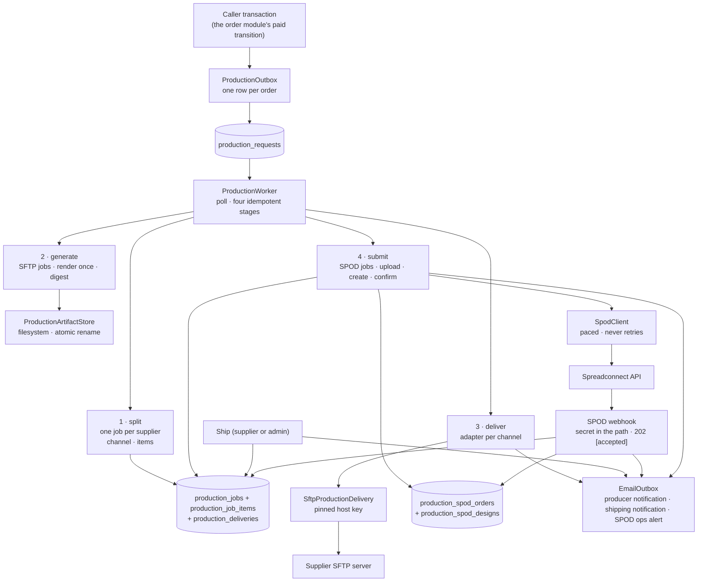
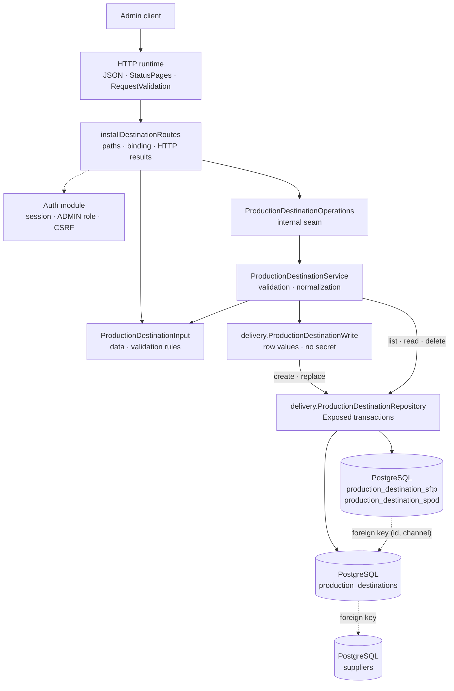

# The Production package

This guide explains the Kotlin code in
[`backend/modules/production/src/shop/voenix/production`](../../../../backend/modules/production/src/shop/voenix/production).

## Contents

- [What this package does](#what-this-package-does)
- [The five-minute mental model](#the-five-minute-mental-model)
- [Production file map](#production-file-map)
- [Destination management](#destination-management)
  - [Routes](#routes)
  - [The write-only secrets](#the-write-only-secrets)
  - [Validation rules](#validation-rules)
  - [Persistence and typed constraint results](#persistence-and-typed-constraint-results)
- [The production PDF](#the-production-pdf)
  - [The public contract](#the-public-contract)
  - [The document layout](#the-document-layout)
  - [Typed, retryable failures](#typed-retryable-failures)
  - [How images get into the PDF: ImageIO, not PDFBox's file sniffing](#how-images-get-into-the-pdf-imageio-not-pdfboxs-file-sniffing)
  - [Legacy fixture comparison](#legacy-fixture-comparison)
- [The durable request and the split worker](#the-durable-request-and-the-split-worker)
  - [Why an outbox](#why-an-outbox)
  - [The three tables](#the-three-tables)
  - [What the supplier fulfillment feature added to the schema](#what-the-supplier-fulfillment-feature-added-to-the-schema)
  - [What the second channel added to the schema](#what-the-second-channel-added-to-the-schema)
  - [What the print-on-demand channel added to the schema](#what-the-print-on-demand-channel-added-to-the-schema)
  - [The worker](#the-worker)
- [Artifact generation](#artifact-generation)
  - [Exactly once, then immutable](#exactly-once-then-immutable)
  - [Crash safety](#crash-safety)
  - [Generation error codes](#generation-error-codes)
  - [Digest verification on load](#digest-verification-on-load)
- [Delivery](#delivery)
  - [The adapter seam and the deliverer](#the-adapter-seam-and-the-deliverer)
  - [Delivery error codes](#delivery-error-codes)
  - [The SFTP adapter](#the-sftp-adapter)
- [Print-on-demand submission](#print-on-demand-submission)
- [Producer notification](#producer-notification)
  - [Atomic enqueue with `delivered_at`](#atomic-enqueue-with-delivered_at)
  - [The resolver](#the-resolver)
  - [Composition wiring](#composition-wiring)
- [Fulfillment](#fulfillment)
  - [The item snapshot](#the-item-snapshot)
  - [What a supplier may see](#what-a-supplier-may-see)
  - [The endpoints](#the-endpoints)
  - [Reporting a shipment](#reporting-a-shipment)
  - [A shipment the channel reports](#a-shipment-the-channel-reports)
  - [Undoing a shipment](#undoing-a-shipment)
  - [The customer's shipping mail](#the-customers-shipping-mail)
  - [Visibility and the three PDF conflicts](#visibility-and-the-three-pdf-conflicts)
  - [Batching](#batching)
- [Composition](#composition)
- [Tests](#tests)

## What this package does

The Production module turns a paid order into production PDFs and delivers
them to the involved suppliers. Its place in the module graph
(`production -> platform, email, supplier`) is described in
[the module architecture](../conventions/module-architecture.md); the migration brief and
decision record live in
[`production-migration.md`](../../../migration/production-migration.md).

The module owns eight responsibilities:

- **Destination management.** Admin CRUD for a supplier's delivery
  accounts, one per channel (`SFTP` push, `SPOD` API). Destinations are
  database rows, not static configuration. Changing a supplier's delivery
  setup is an admin API call, never a deployment. See
  [destination management](#destination-management).
- **On-demand production PDF.** From one order, render one PDF per involved
  supplier: an address page plus one page per physical item. See
  [the production PDF](#the-production-pdf).
- **The durable request and the split worker.** A caller (the order module's
  paid transition, since the Order migration) triggers production with one cheap
  database row; a single background worker later splits it into one job per
  involved supplier, with the job's item lines and its snapshotted fulfillment
  channel, plus one delivery per enabled destination of an SFTP supplier. A
  supplier without an enabled destination still gets its job (the fulfillment
  page is the fallback); only the push delivery is skipped. See
  [the durable request and the split worker](#the-durable-request-and-the-split-worker).
- **The immutable artifact.** The worker generates the PDF of each **SFTP**
  job exactly once, persists it on the local filesystem, and records only
  metadata (SHA-256 digest, `generated_at`, `prepared_at`) in the database.
  Every later delivery and retry provably ships the same bytes. See
  [artifact generation](#artifact-generation).
- **SFTP delivery.** The worker pushes every generated artifact to the
  supplier's enabled destinations through a channel-neutral adapter seam. The
  SFTP adapter verifies the pinned host key, uploads to a temporary name, and
  renames to the final `ORD-{orderId}.pdf`; `delivered_at` is set only after
  the server confirmed acceptance. See [delivery](#delivery).
- **The producer notification.** After a successful delivery, an
  informational email to the producer is enqueued through the email module's
  `EmailOutbox`, atomically with `delivered_at`. See
  [producer notification](#producer-notification).
- **Print-on-demand submission.** The second channel's counterpart of
  artifact generation and delivery: a t-shirt job's designs are uploaded, the
  partner's order is created, its id is persisted, and the order is confirmed.
  It has its own guide, [SPOD fulfillment](spod-fulfillment.md).
- **Fulfillment.** What a supplier and an admin work with: the job list, the
  item snapshot behind it, the PDF download, the one ship write **every**
  reporter goes through (a supplier, an admin, and the partner's webhook), and
  the customer's shipping notification that joins that write's transaction.
  See [fulfillment](#fulfillment).

## The five-minute mental model



One durable row triggers everything the worker does. The fulfillment half
starts from an HTTP request instead, where a supplier, an admin, or the
partner's webhook reports a shipment and writes the same `production_jobs` row
and the same `EmailOutbox`
the worker uses. The worker owns retry state in PostgreSQL, the filesystem
owns the immutable bytes, and only confirmed external acceptance closes a
delivery. Every stage is idempotent and every failure is a bounded, retryable
error code. No raw exception message, credential, or remote path is ever
persisted.

## Production file map

Files group declarations that belong together, following
[the source file organization guide](../conventions/source-file-organization.md). A component
shares its file with the small types it owns: a service with the seam it
implements and the results it returns, a repository with its Exposed table
objects and read models, routes with the request and response types only they
use. So the file to open is the *concern* you are after, not the type name.

The package root holds the module's public contract and the admin destination
surface:

| File | Contents |
| --- | --- |
| [`ProductionModule.kt`](../../../../backend/modules/production/src/shop/voenix/production/ProductionModule.kt) | The runtime handle, `createProductionModule`, the public `installProductionModule` and the `installProductionModule(database)` integration-test seam, `validateProductionRequests`, and `ProductionSettings` with its optional `ProductionSpodSettings` (webhook secret and ops alert address). |
| [`ProductionData.kt`](../../../../backend/modules/production/src/shop/voenix/production/ProductionData.kt) | The production view of one order, `ProductionData` and `ProductionItem`, plus the `ProductionSource` port that resolves it. |
| [`ProductionPdfGenerator.kt`](../../../../backend/modules/production/src/shop/voenix/production/ProductionPdfGenerator.kt) | The on-demand PDF capability and everything it answers with: `ProductionPdfResult`, `ProductionPdfDocument`, `ProductionPdfError`. |
| [`ProductionOutbox.kt`](../../../../backend/modules/production/src/shop/voenix/production/ProductionOutbox.kt) | The durable production trigger a caller transaction joins. |
| [`ProductionNaming.kt`](../../../../backend/modules/production/src/shop/voenix/production/ProductionNaming.kt) | The `ORD-{orderId}` label and file name every layer shares. The print-on-demand reference `ORD-{orderId}-JOB-{jobId}` is *not* here: it belongs to the `spod` package that invents and parses it. |
| [`ProductionQueuedEmails.kt`](../../../../backend/modules/production/src/shop/voenix/production/ProductionQueuedEmails.kt) | Production's one branch of the application's queued-email source. |
| [`ProductionDestinationService.kt`](../../../../backend/modules/production/src/shop/voenix/production/ProductionDestinationService.kt) | Destination validation and normalization, together with the `ProductionDestinationOperations` seam it implements. The request body becomes a `ProductionDestinationWrite` plus a separate secret. |
| [`DestinationRoutes.kt`](../../../../backend/modules/production/src/shop/voenix/production/DestinationRoutes.kt) | The admin routes with their HTTP types: `ProductionDestinationInput` with its `SftpDestinationInput`/`SpodDestinationInput` blocks and validation rules, and the secret-free `ProductionDestination` response. |
| [`spod/SpodAccess.kt`](../../../../backend/modules/spod/src/shop/voenix/spod/SpodAccess.kt) | In the `spod` module: `SpodAccess`, and `SpodEnvironment` with the two SPOD installations and the base URL each one derives in code. |

The `delivery` sub-package is the background half. It holds durable state,
the worker stages, and the channel adapters:

| File | Contents |
| --- | --- |
| [`ProductionRequestRepository.kt`](../../../../backend/modules/production/src/shop/voenix/production/delivery/ProductionRequestRepository.kt) | Request persistence and the transactional split, with the `production_requests` table and `OpenProductionRequest`. |
| [`ProductionJobRepository.kt`](../../../../backend/modules/production/src/shop/voenix/production/delivery/ProductionJobRepository.kt) | Generation state of the SFTP jobs, with the `production_jobs` and `production_job_items` tables and `OpenProductionJob`. |
| [`ProductionDeliveryRepository.kt`](../../../../backend/modules/production/src/shop/voenix/production/delivery/ProductionDeliveryRepository.kt) | Delivery state with the `production_deliveries` table, `OpenProductionDelivery`, the secret-carrying `ProductionDeliveryDestination` with its `Sftp`/`Spod` variants, and the `ProducerNotificationContext` its notification read returns. |
| [`ProductionDestinationRepository.kt`](../../../../backend/modules/production/src/shop/voenix/production/delivery/ProductionDestinationRepository.kt) | Destination persistence across `production_destinations` and the per-channel `production_destination_sftp`/`production_destination_spod` tables, with `ProductionChannels`, the `ProductionDestinationWrite` input model, `StoredProductionDestination`, and the typed write and delete results. |
| [`ProductionWorker.kt`](../../../../backend/modules/production/src/shop/voenix/production/delivery/ProductionWorker.kt) | The polling loop and the split stage. |
| [`ProductionArtifactGenerator.kt`](../../../../backend/modules/production/src/shop/voenix/production/delivery/ProductionArtifactGenerator.kt) | The generation stage. |
| [`ProductionDeliverer.kt`](../../../../backend/modules/production/src/shop/voenix/production/delivery/ProductionDeliverer.kt) | The delivery stage with the `ProductionDeliveryAdapter` seam and the `ProductionDeliveryResult`/`ProductionDeliveryError` vocabulary it speaks. |
| [`ProducerNotificationResolver.kt`](../../../../backend/modules/production/src/shop/voenix/production/delivery/ProducerNotificationResolver.kt) | The producer mail resolver. |
| [`ProductionSourceResolution.kt`](../../../../backend/modules/production/src/shop/voenix/production/delivery/ProductionSourceResolution.kt) | `resolveOrder` and the cancellation rethrow every stage shares. |
| [`sftp/SftpProductionDelivery.kt`](../../../../backend/modules/production/src/shop/voenix/production/delivery/sftp/SftpProductionDelivery.kt) | The SFTP adapter and its single blocking upload attempt. |
| [`spod/SpodClient.kt`](../../../../backend/modules/spod/src/shop/voenix/spod/SpodClient.kt) | In the `spod` module since ADR 0003, shared with the article module's catalog sync: the print-on-demand HTTP adapter with its eight calls (five of them this module's), the request pacer, the request and response shapes, and the `SpodResult`/`SpodError` vocabulary (see the [SPOD package guide](spod-package.md)). |
| [`spod/SpodOrderSubmitter.kt`](../../../../backend/modules/production/src/shop/voenix/production/delivery/spod/SpodOrderSubmitter.kt) | The submission stage with its creation and confirmation halves, and the `SpodSubmissionError` codes. |
| [`spod/SpodOrderRepository.kt`](../../../../backend/modules/production/src/shop/voenix/production/delivery/spod/SpodOrderRepository.kt) | Remote-order state with the `production_spod_orders` and `production_spod_designs` tables, `OpenSpodJob`, and the supplier's destination read. |
| [`spod/PrintImagePng.kt`](../../../../backend/modules/production/src/shop/voenix/production/delivery/spod/PrintImagePng.kt) | WebP → PNG inside production, with the pixel cap, the byte budget, and `PrintImageError`. |
| [`spod/SpodOpsAlertResolver.kt`](../../../../backend/modules/production/src/shop/voenix/production/delivery/spod/SpodOpsAlertResolver.kt) | The ops alert of one job: the bounded reason it is derived from, and the configured alert address it goes to. |

The `pdf` sub-package renders and stores the document:

| File | Contents |
| --- | --- |
| [`ProductionPdfRenderer.kt`](../../../../backend/modules/production/src/shop/voenix/production/pdf/ProductionPdfRenderer.kt) | The PDFBox renderer plus what it produces: `ProductionPdf` and `ProductionPdfRenderResult`. |
| [`PdfPageCanvas.kt`](../../../../backend/modules/production/src/shop/voenix/production/pdf/PdfPageCanvas.kt) | The physical layout constants and the low-level text drawing. |
| [`ProductionPdfService.kt`](../../../../backend/modules/production/src/shop/voenix/production/pdf/ProductionPdfService.kt) | On-demand generation across the involved suppliers. |
| [`ProductionArtifactStore.kt`](../../../../backend/modules/production/src/shop/voenix/production/pdf/ProductionArtifactStore.kt) | Filesystem persistence and `ProductionArtifactLoadResult`. |
| [`Sha256.kt`](../../../../backend/modules/production/src/shop/voenix/production/pdf/Sha256.kt) | The digest helper the renderer and the store both use. |

The `fulfillment` sub-package is the human half:

| File | Contents |
| --- | --- |
| [`FulfillmentRoutes.kt`](../../../../backend/modules/production/src/shop/voenix/production/fulfillment/FulfillmentRoutes.kt) | Both HTTP subtrees plus the `ShipJobInput` body and its validation rules; the carrier field is parsed once, into the file-private `CarrierField`. |
| [`FulfillmentOperations.kt`](../../../../backend/modules/production/src/shop/voenix/production/fulfillment/FulfillmentOperations.kt) | The seam the routes call and everything it speaks: `FulfillmentJobStatus`, `Shipment`, the `SupplierIdentityView`/`SupplierJobView`/`AdminJobView`/`FulfillmentItemView` answers, `FulfillmentArtifactResult`, `ShipResult`, and `ShipActor`, the sealed reporter of a shipment (`User` or `Channel`). |
| [`FulfillmentService.kt`](../../../../backend/modules/production/src/shop/voenix/production/fulfillment/FulfillmentService.kt) | One batched assembly (`FulfillmentBatch`) behind both lists and the answer of a ship request, and the one ship path of all three reporters. It also implements `SpodWebhookOperations`, so the partner's callback is handled by the same class that serves the two job surfaces. |
| [`FulfillmentRepository.kt`](../../../../backend/modules/production/src/shop/voenix/production/fulfillment/FulfillmentRepository.kt) | The job reads and the guarded ship write, with `StoredFulfillmentJob` and `ShipWriteResult`. |
| [`FulfillmentOrder.kt`](../../../../backend/modules/production/src/shop/voenix/production/fulfillment/FulfillmentOrder.kt) | The order header a page shows and the `FulfillmentOrderSource` port it comes through. |
| [`ShippingNotificationResolver.kt`](../../../../backend/modules/production/src/shop/voenix/production/fulfillment/ShippingNotificationResolver.kt) | The customer's mail, with the `ShippingNotificationOrderSource` port and its `ShippingNotificationOrder`. |
| [`ShippingCarrier.kt`](../../../../backend/modules/production/src/shop/voenix/production/fulfillment/ShippingCarrier.kt) | The bounded carrier list, the tracking links built from it, and `ofReportedName`, which maps whatever a provider calls a carrier onto that list. |
| [`SpodWebhookRoutes.kt`](../../../../backend/modules/production/src/shop/voenix/production/fulfillment/SpodWebhookRoutes.kt) | The partner's inbound callback: the secret compared before the body is read, the `202 [accepted]` ack, and the payload reduced to bounded values. |
| [`ProductionFulfillment.kt`](../../../../backend/modules/production/src/shop/voenix/production/fulfillment/ProductionFulfillment.kt) | `installProductionFulfillment`, this module's second install function. |

## Destination management

A destination is one way of reaching a supplier's producer: an **SFTP**
account a finished production PDF is pushed to, or a **SPOD** account an order
is submitted to through the print-on-demand API. An admin can list, create,
read, fully replace, and delete destinations through authenticated routes.

Every channel has its own shape, so a destination is stored as two rows: the
base row in `production_destinations` with identity, supplier, channel, label,
`enabled`, and the notification fields, plus exactly one detail row in the
table of its channel (`production_destination_sftp` or
`production_destination_spod`). The API mirrors that shape: a body and a
response carry the block of their channel and nothing else. The channel itself
is fixed at creation: a replace that names a different one is refused with a
`channel` field error, because open `production_deliveries` rows point at the
destination and nothing would invalidate them if the channel underneath them
changed.

The channel's secret (the SFTP password, the SPOD access token) is strictly
**write-only**: it can be set and replaced through the API, but it never
appears in any response, log line, or error message.



The structure mirrors the Supplier package: routes bind HTTP, the service
validates and normalizes, the repository owns Exposed transactions, and every
expected failure is a typed `OperationResult`. Persistence lives in the
`delivery` sub-package because destinations belong to the delivery worker;
the admin-facing types live at the package root.

The `ProductionDestinationWrite` step in the middle is where the HTTP world
ends. Every field of `ProductionDestinationInput` and of its two blocks is
nullable, because a client may leave anything out; the write model has exactly
the values the rows need: every required one non-null and already trimmed,
only the two optional notification fields nullable. It also carries the
channel in its shape: `ProductionDestinationWrite.detail` is a sealed
`ProductionDestinationDetail.Sftp` or `.Spod`, the same detail type a read
answers with, because both directions carry the identical fields, and the
destination's `channel` is read off that detail rather than stored twice. The
service is the only place that turns one into the other (`toWrite()`), which
is why no file under `delivery` imports the HTTP type, and why writing the
rows (`copyFrom(write)`) needs no `checkNotNull` any more. Reads and the
delete never touch the write model; they call the repository directly. The
same split is used by the VAT package (`VatWrite`).

### Routes

All routes sit under the shared admin protection
(`installAdminRouteProtection`), so authentication, the `ADMIN` role, and CSRF
are enforced before any handler runs:

| Method and path | Success | Purpose |
| --- | --- | --- |
| `GET /api/admin/production/destinations` | `200` | List every destination, ordered by supplier then id |
| `POST /api/admin/production/destinations` | `201` + `Location` | Create a destination |
| `GET /api/admin/production/destinations/{id}` | `200` | Read one destination |
| `PUT /api/admin/production/destinations/{id}` | `200` | Fully replace a destination |
| `POST /api/admin/production/destinations/{id}/sync-articles` | `200` | Sync this destination's t-shirt catalog from the Spreadconnect backoffice |
| `DELETE /api/admin/production/destinations/{id}` | `204` | Delete an unreferenced destination |

### Syncing the t-shirt catalog of a destination

`POST …/{id}/sync-articles` is the trigger of the sync described in the
[Article package guide](article-package.md#t-shirts) (ADR 0003). The run itself
belongs to the article module, which owns the tables it writes; this module owns
the button, because a run is scoped to one destination's token. The service does
the one read the sync cannot do itself — the supplier, the installation, and the
token — and hands over a `SpodCatalogSource`. It opens no transaction of its
own.

The admin **waits** for the answer: a sync is a few seconds of partner calls,
not a job to watch, and there is no polling and no background machinery.

| Answer | When |
| --- | --- |
| `200` with the `TshirtSyncReport` | the run happened — including a run whose `status` is `FAILED`, because a failed run still reports why |
| `404 Production destination not found` | no destination with that id |
| `409` with code `CHANNEL_WITHOUT_CATALOG` | the destination is an `SFTP` one: *Only print-on-demand destinations have a t-shirt catalog to sync* |
| `409` with code `SYNC_RUNNING` | that destination is already syncing: *This destination is already syncing; wait for that run to finish* |
| `500` | the route itself broke — a database failure while reading the destination, for instance. A run that reached the partner and came back empty-handed is not this: that is the `200` above with `status: "FAILED"` |

A **disabled** destination may still sync (Joe, decision D5 on issue #224):
only the channel is checked. Preparing next season's catalog on a destination
that is switched off is a normal thing to do, and a sync writes nothing a
customer sees — a run never activates an article.

A body carries the shared fields plus the block of its channel:

```json
{
  "supplierId": 1,
  "channel": "SPOD",
  "label": "Spreadconnect",
  "enabled": true,
  "spod": { "environment": "STAGING", "accessToken": "…", "timeoutSeconds": 30 }
}
```

An `SFTP` body brings `sftp` instead, with `host`, `port`, `username`,
`password`, `hostKeyFingerprint`, `remotePath`, and `timeoutSeconds`. A
response has the same shape with the secret removed and the other channel's
block `null`.

### The write-only secrets

Both channels keep their secret out of every read path in the same layered
way; `sftp.password` and `spod.accessToken` are one mechanism, not two:

1. The response models `SftpDestinationDetails` and `SpodDestinationDetails`
   have no secret property, so serialization cannot include one.
2. `ProductionDestinationRepository` never selects the `password` or
   `access_token` column when reading. The stored model
   `StoredProductionDestination` cannot even hold a secret in memory.
3. `SftpDestinationInput.toString()` and `SpodDestinationInput.toString()`
   replace the secret with `[redacted]`. This matters because Ktor's
   `RequestValidationException` message embeds the offending input's
   `toString()`, and `ProductionDestinationInput` prints its blocks through
   theirs.
4. Service log messages contain ids only, never field values.
5. The write model `ProductionDestinationWrite` has no secret property either.
   The secret travels only as an argument of the two write calls,
   `insert(write, secret)` and `update(id, write, newSecret)`, so it exists as
   a plain `String` on the way to the database and in no object that could be
   printed. The argument types also state the rule: creating a destination
   needs a `String`, replacing one takes a `String?` where `null` means "keep
   the stored secret".

Replacing a destination keeps the stored secret when the request omits it (or
sends `null` or a blank value). Sending a new value replaces it. Creating a
destination requires one; a replace never does, because the channel, and with
it the detail row holding the secret, cannot change. A non-blank secret is
stored exactly as typed and never trimmed: spaces at either end may be part of
it.

### Validation rules

`ProductionDestinationInput.validate()` implements the field matrix:

- `supplierId`, `channel`, and `label` are required of every destination.
- `channel` accepts `SFTP` and `SPOD`. The database enforces the same set with
  a check constraint; a new channel is a deliberate schema change.
- The body must carry **exactly** the block of its channel: `sftp` for `SFTP`,
  `spod` for `SPOD`, and not the other one. A missing or foreign block is a
  `channel` field error, because the channel is what makes the rest of the body
  right or wrong. An unknown channel says nothing about the blocks at all;
  which ones belong to it is then unanswerable.
- Detail errors are reported under the block: `sftp.host`,
  `spod.accessToken`, and so on.
- In the `sftp` block, `host`, `username`, `hostKeyFingerprint`, and
  `timeoutSeconds` are required. `hostKeyFingerprint` is mandatory because
  every SFTP connection must verify the pinned host key. There is no
  permissive fallback. `port` must be between 1 and 65535 and defaults to 22,
  and `remotePath` defaults to `/`.
- In the `spod` block, `environment` (`PRODUCTION` or `STAGING`) and
  `timeoutSeconds` are required, and the token is bounded at 512 characters.
  There is **no** base-URL field: `SpodEnvironment` derives the URL in code, so
  no admin input can point fulfillment at an arbitrary host.
- `timeoutSeconds` must be between 1 and 3600 in both blocks.
- `notificationEmail` is optional but must look like an email address.
- The **channel and the supplier are fixed after creation.** A `PUT` that names
  another one is a field error — `channel`: *Channel cannot be changed after
  creation*, `supplierId`: *Supplier cannot be changed after creation*. The
  supplier rule joined the older channel rule with ADR 0003: a synced t-shirt
  carries the supplier of the destination it came from, so moving a destination
  to another supplier would silently re-own every shirt it wrote.
- `enabled` defaults to `true`. Disabling a destination
  (`"enabled": false` in a `PUT`) is the operational off-switch: the rows and
  their credentials survive, but the delivery worker skips it with the
  retryable code `DESTINATION_DISABLED`.

### Persistence and typed constraint results

The Flyway migrations `V6__create_production_destinations.sql` and
`V22__production_destination_channels.sql` build the three tables in the
platform-owned global chain. `V22` is where the single wide table became a base
table plus one detail table per channel: it copies every configured SFTP
destination into `production_destination_sftp` before dropping the columns, so
no destination has to be re-entered.

PostgreSQL enforces the shape:

- The supplier foreign key, and the channel check `IN ('SFTP', 'SPOD')`.
- The alternate key `UNIQUE (id, channel)` on the base table, which the detail
  tables reference with the composite foreign key `(id, channel)` and
  `ON DELETE CASCADE`. Together with each detail table's constant `channel`
  column and its `CHECK`, a detail row can only ever belong to a base row of
  its own channel, and deleting a destination takes its detail row with it.
- Every detail column is `NOT NULL` in its own table, with the port and timeout
  ranges next to the columns they bound and the environment check
  `IN ('PRODUCTION', 'STAGING')`.
- A partial unique index over `supplier_id WHERE enabled AND channel = 'SPOD'`:
  a supplier is reached through at most one enabled SPOD account, while a
  disabled successor may be prepared next to it.

Expected constraint failures become typed results through the shared
[`executePostgresWrite`](../conventions/persistence-error-handling.md) helper, which matches
SQL states, never constraint names:

- An insert or update with an unknown `supplierId` maps to
  `SupplierNotFound`, which the API returns as a `400` with a `supplierId`
  field error.
- A unique violation on a write maps to `EnabledSpodExists`, the only unique
  rule a destination write can break, and the API answers `400` with a
  `channel` field error naming the enabled SPOD destination in the way.
- A delete blocked by a foreign key maps to `InUse` and a
  `409 Conflict` response. `production_deliveries` references destinations
  with `ON DELETE RESTRICT`, so `enabled = false` is the only way to switch
  off a destination that has delivery history. Since `V27` a second table
  references it the same way: `article_tshirts.spod_destination_id`, so a
  destination that ever synced shirts can be disabled but not deleted.

The reverse direction is protected too: deleting a Supplier that still owns
destinations returns `409` from the Supplier API (see
[`supplier-package.md`](supplier-package.md)).

## The production PDF

### The public contract

The PDF capability is defined entirely by public types in
`shop.voenix.production`, and no PDF-library type ever crosses the module
boundary (a test enforces this):

- `ProductionSource` resolves the immutable order/item/image inputs for one
  order. Since the Order migration of 2026-07-31 the order module implements
  it; module tests still use an in-memory lambda.
- `ProductionData` and `ProductionItem` carry the shipping address, the
  customer's e-mail address and optional phone number, the items in explicit
  source order, each item's supplier, quantity, generated image path, the
  optional mug-layout overrides in millimetres, and the optional
  `SpodProductRef`, the three ids the print-on-demand partner names a
  printable product by. An item answers one *or* the other: a mug has the
  measurements and no SPOD product, a t-shirt the SPOD product and no
  measurements.
- The contact data is on this view only. `FulfillmentOrder`, the view a
  supplier reads, deliberately carries neither and is not widened by it: a
  supplier surface cannot leak what it never receives.
- `SpodProductRef` is production's **own** value type, structurally identical to
  the article module's. The repetition is deliberate: production owns this port
  and must not make every consumer of it depend on the catalog for three
  numbers. The order module depends on both and is the one place that
  translates. It is also the one field of `ProductionItem` that is *not* a
  snapshot. Like `supplierId` it is resolved live on every load, which is why
  the submitting adapter compares the snapshotted `variantName` against what it
  reads today.
- `ProductionPdfGenerator.generate(orderId)` is the on-demand capability for
  the authorized download. It returns a typed `ProductionPdfResult`:
  `Generated` with one `ProductionPdfDocument` per involved supplier,
  `OrderNotFound`, or `GenerationFailed` with a `ProductionPdfError`.
- Every `ProductionPdfDocument` has the stable producer-facing file name
  `ORD-{orderId}.pdf`, media type `application/pdf`, the raw bytes, and their
  SHA-256 hex digest. The name repeats across suppliers of one order by
  design: a supplier only ever receives its own documents, so the name stays
  unique per destination.

### The document layout

`pdf.ProductionPdfRenderer` recreates the legacy layout with Apache PDFBox:

1. An address page of 239 mm x 99 mm: the shipping address centered, the
   order label `ORD-{orderId}` reading bottom-to-top in a narrow left column.
2. One page per **physical** item: an item with quantity 3 becomes three
   pages. The left column shows `ORD-{orderId} ({index}/{total})` with a
   stable 1-based index **within the supplier's job**. The right column shows
   `article | supplier article number | variant` reading top-to-bottom (the
   supplier number is left out when blank). The generated image sits between
   the columns; a print template confines its width, puts it on the bottom
   margin, and centers it, otherwise it is centered in the full area. Items
   may override the page size via the document-format fields.

Text uses the Liberation Sans font bundled inside the PDFBox jar, which
covers extended Latin plus Cyrillic; the bold address name is approximated
with fill-plus-stroke because no bold face is bundled.

### Typed, retryable failures

A missing production image is **never** a silently blank page. The decision
record makes it a typed, retryable failure. `ProductionPdfError` is the
bounded error vocabulary (and the later job table's safe error codes):
`MISSING_IMAGE`, `UNREADABLE_IMAGE`, `INVALID_SOURCE` (non-positive quantity
or measurement, or an item without a supplier), and `RENDER_FAILURE` (details
go to the log, never into the result).

### How images get into the PDF: ImageIO, not PDFBox's file sniffing

The renderer decodes every image file with `ImageIO.read` and embeds the
resulting raster with `LosslessFactory.createFromImage`, the same path PDFBox
itself uses for PNG.

The obvious alternative, `PDImageXObject.createFromFileByContent`, is
deliberately **not** used: PDFBox 3.0.5 sniffs the file content first and only
routes JPEG, TIFF, BMP, GIF, and PNG onward to ImageIO. A WebP file is a RIFF
container, so it is rejected before ImageIO is ever asked, even with a WebP
reader registered. Since print images are stored as WebP only, that path would
make every production PDF fail. Going through ImageIO consults every registered
reader, and `webp-imageio` is a runtime dependency of this module so its reader
is on the application classpath.

A file that no reader claims (or that fails to decode) still maps to the
retryable `UNREADABLE_IMAGE`. `ProductionPdfWebpSourceTest` proves a WebP
original renders; the analysis and the decision are in
[`cart-migration.md`](../../../migration/cart-migration.md) under "WebP
production PDFs".

### Legacy fixture comparison

`ProductionPdfLegacyFixtureTest` compares rendered page images (never raw
bytes) against reference PDFs from the legacy system. Fixtures are dropped
into
[`testResources/legacy-production-pdfs`](../../../../backend/modules/production/testResources/legacy-production-pdfs/README.md);
until they are delivered the test skips itself and says so.

## The durable request and the split worker

### Why an outbox

Payment completion has already taken the customer's money, so nothing that
happens on the production side may abort that transaction. The trigger is
therefore the same shape as the email outbox: `ProductionOutbox.request(orderId)`
joins the **caller's** Exposed transaction and inserts one minimal reference
row: no source resolution, no routing, no PDF work. If the caller rolls
back, no request exists. The unique `order_id` makes the call idempotent:
repeated and concurrent calls return the same stable request id (reprints and
complaints become new orders). A non-positive order id fails fast with
`IllegalArgumentException` before touching the database.

### The three tables

Flyway migrations `V7` to `V9` add the durable delivery state to the
platform-owned chain:

- `production_requests` holds one row per order (unique `order_id`), with
  `attempt_count`, a bounded `last_error_code`, and a nullable
  `processed_at`. Open/processed state derives from the timestamp; there is
  no in-progress status that could strand.
- `production_jobs` holds one row per request and supplier (unique
  `(request_id, supplier_id)`), carrying the job's `fulfillment_channel`, the
  producer-facing `file_name` (`ORD-{orderId}.pdf`), the generation metadata
  (`content_sha256`, `generated_at`, generation attempts and error code), and
  the channel-neutral `prepared_at`. A check constraint keeps digest and
  timestamp together: both are `NULL` while the job is open and both are set
  once the artifact exists. There is no half-generated state.
- `production_deliveries` holds one row per job and destination (unique
  `(production_job_id, destination_id)`), with `attempt_count`,
  `last_error_code`, and `delivered_at`.

The destination side of the schema is two more tables:
`production_destination_sftp` and `production_destination_spod` hold the
channel-specific half of a destination and hang off `production_destinations`
by the composite key `(id, channel)`; see
[persistence and typed constraint results](#persistence-and-typed-constraint-results).

The foreign keys along the *lifecycle* (request → job → delivery, and
`production_spod_orders` → job) are `ON DELETE RESTRICT`: nothing that a job
depends on may vanish under it. The rows that only *describe* their owner
cascade instead, because they have no life of their own: the two
destination detail tables with their owning `production_destinations` row,
`production_job_items` with its job, and `production_spod_designs` with its
`production_spod_orders` row. In particular a destination that is referenced by
deliveries can never be hard-deleted. The admin API maps that to
`409 Conflict`, and `enabled = false`
remains the operational off-switch. The database also enforces non-negative
counters and a positive `order_id`.

### What the supplier fulfillment feature added to the schema

`V8` carries four more columns and one more table, prepared by the first
ticket of the supplier fulfillment feature (issue #119) and filled by the
later ones:

- `production_jobs.shipped_at`, `shipped_by_user_id`, `shipping_carrier`, and
  `tracking_number` record one package leaving a supplier. Two check
  constraints keep the record honest: as long as `shipped_at` is `NULL` the
  other three must be `NULL` too, and the carrier must be one of `DHL`, `DPD`,
  `GLS`, `HERMES`, `UPS`, `DEUTSCHE_POST`, `OTHER`. The shop builds tracking
  links from that bounded list itself instead of accepting a URL from a
  caller. Three partial indexes serve the lists: open jobs by
  `(supplier_id, id)`, shipped ones by `(supplier_id, shipped_at DESC, id
  DESC)`, and shipped ones by `(shipped_at DESC, id DESC)` for the admin
  lists, which read across every supplier and so cannot use an index whose
  first column is `supplier_id`. The `id` is in there because `shipped_at` is
  not unique: two jobs reported in one transaction share a timestamp, and a
  capped list on a non-total order could drop one row and show another twice.
  The foreign key to `users` is added by `V11`, where the table exists, and is
  `ON DELETE SET NULL`: deleting a login must not delete the shipment.
- `production_job_items` holds the item lines of one job: position, article
  and variant name, optional supplier article number, quantity. They are
  snapshotted in the same transaction that creates the job, so a supplier page
  shows what the job was split into and not today's master data. (Until `V23`
  they were written one stage later, with the generated PDF; see
  [the item snapshot](#the-item-snapshot).) The rows are parts of the job, not
  records of their own: primary key `(production_job_id, position)` and
  `ON DELETE CASCADE`.

### What the second channel added to the schema

`V23__production_job_channels.sql` gives a job the two columns its lifecycle
needs once a PDF is no longer the only way to produce one
([ADR 0002](../../../adr/0002-production-fulfillment-channels.md), decisions 1
and 2):

- `fulfillment_channel` (`SFTP` | `SPOD`, `NOT NULL`, no default) is how this
  job is produced, decided by the split from the supplier's enabled
  destinations and frozen from then on. Routing stays live master data; a job
  already in flight never changes its lifecycle halfway through.
- `prepared_at` is the channel-neutral "ready to ship": set together with
  `generated_at` on an SFTP job, set when the remote order is confirmed on a
  SPOD job. The shipping check constraint requires it (a shipped job is
  always a prepared job), and the guarded ship update reads it instead of
  `generated_at`.

Existing rows are backfilled `'SFTP'` with `prepared_at = generated_at`,
which is what they were.

### What the print-on-demand channel added to the schema

`V24__production_spod_orders.sql` gives a SPOD job the two tables its remote
lifecycle needs
([ADR 0002](../../../adr/0002-production-fulfillment-channels.md), decisions 2
and 4). `production_spod_orders` holds one row per job (the partner's order
id, the creation state, the ambiguity counter, the confirmation, and the
remote state) and `production_spod_designs` one row per item position with
the design that was uploaded for it. Why the columns are shaped that way, and
why the order id gets a transaction of its own, is the subject of
[SPOD fulfillment](spod-fulfillment.md).

`V25__production_channel_reported_shipping.sql` adds the other half: a
shipment nobody in this shop pressed a button for. `production_jobs` gains
`shipped_by_channel` (the fulfillment channel that reported it, today only
`'SPOD'`) and `shipping_carrier_reported` (the carrier name the partner sent,
verbatim and admin-visible). Both stay `NULL` until the job is shipped, and the
shipping-consistency CHECK additionally refuses a row that names *both* a user
and a channel: a shipment has one reporter. It is deliberately "never both"
rather than an exclusive-or, because `shipped_by_user_id` is `ON DELETE SET
NULL`: deleting a supplier login must not be refused by a job that login once
shipped. The same migration adds `SPOD_OPS_ALERT` to the bounded kind list of
`email_jobs`.

### The worker

`delivery.ProductionWorker` follows the email worker pattern: one instance,
started by `ProductionModule.startWorker`, polling PostgreSQL in a coroutine loop
with one attempt per non-overlapping scan and unbounded attempts. Every scan
runs four idempotent stages: the **split** below, then
[artifact generation](#artifact-generation), then [delivery](#delivery), then
the [print-on-demand submission](spod-fulfillment.md). The last three divide
the jobs between them by channel: generation and delivery only ever see an
`SFTP` job, submission only ever a `SPOD` one. The split:

1. Scan open requests (`processed_at IS NULL`) in ascending id order and
   increment the attempt counter.
2. Resolve the order through the `ProductionSource`.
3. Group the order's items by supplier: suppliers in first-appearance order,
   items inside a supplier in source order, which is the same list the
   renderer of an SFTP job filters out for itself.
4. In **one** transaction: read the enabled destinations of every supplier (a
   snapshot, so later destination changes affect later orders), create every
   job with its channel and its item lines, create the deliveries of the SFTP
   jobs, and mark the request processed. A supplier with an enabled SPOD
   destination gets a `SPOD` job and **no** deliveries at all: that channel
   pushes no document anywhere. Everybody else gets an `SFTP` job, including
   a supplier without any enabled destination, which then gets no delivery
   rows either: the artifact is generated and the supplier fulfillment page
   shows the order and serves the PDF, so a supplier that is not (yet)
   connected to a push channel can work from the page alone. Because both the
   channel and the deliveries are a snapshot, configuring a destination later
   does not change an already split request. It affects later orders only.

Routing problems are retryable background failures, never crashes and never
partial splits. The request stays open with a safe, bounded error code and
recovers on a later scan once an admin fixes the configuration:

| Code | Meaning | Typical recovery |
| --- | --- | --- |
| `SOURCE_NOT_FOUND` | The source knows no such order | Order data arrives |
| `SOURCE_INVALID` | The source rejected the order or returned inconsistent data (wrong order id, no items) | Order data is corrected |
| `SOURCE_UNAVAILABLE` | The source threw unexpectedly | Infrastructure heals |
| `ITEM_WITHOUT_SUPPLIER` | An item's article has no supplier assigned | Admin assigns the supplier |
| `SPLIT_FAILED` | The split transaction failed unexpectedly | Infrastructure heals |

The all-or-nothing rule exists for a manufacturing reason: if jobs were
created for the resolvable suppliers while one item still lacks a supplier, a
later assignment fix could attach that item to a job whose artifact was
already generated, and the item would silently never reach production. A
missing destination is different. The supplier is known and the job's content
is complete; only the push channel is absent, so the job is created and merely
logged as delivery-less.

Every insert in the split ignores duplicates on its unique identity, so a
repeated split heals instead of conflicting. `CancellationException` is
always rethrown. Shutdown never records a failure; unfinished work simply
stays open and the next start picks it up.

Because an item may genuinely have no supplier yet,
`ProductionItem.supplierId` is nullable. Production never guesses a route:
the split records `ITEM_WITHOUT_SUPPLIER`, and the on-demand PDF generation
reports `INVALID_SOURCE` for such an order.

## Artifact generation

### Exactly once, then immutable

`delivery.ProductionArtifactGenerator` is the second worker stage. It scans
the open **SFTP** jobs (`generated_at IS NULL AND fulfillment_channel =
'SFTP'`) in ascending id order (a SPOD job has no document to produce and is
left to its own submission stage), increments the
generation attempt counter (one attempt per scan), renders the supplier's PDF
through the shared `ProductionPdfRenderer`, and persists it:

1. The bytes go to the filesystem first: `pdf.ProductionArtifactStore` writes
   a temporary file **in the final directory** and atomically renames it to
   `{artifactRoot}/{jobId}/ORD-{orderId}.pdf`. A partially written PDF is
   never visible under the final path. The job id in the path keeps two
   suppliers' PDFs of the same order apart even though both carry the same
   producer-facing `file_name`.
2. The database commit comes second: `content_sha256`, `generated_at`,
   `prepared_at`, and a cleared error code, guarded by `generated_at IS
   NULL`, so the metadata of a generated artifact can never be overwritten.
   `prepared_at` is set in the same statement because for this channel the
   document existing *is* the job becoming shippable.

Once `generated_at` is set the job is closed: later scans skip it, and no
change to master data or images ever touches the bytes again. That is the
single-source-of-truth guarantee. Every destination and every retry ships
provably identical bytes, and the digest in the database proves it.

### Crash safety

A crash between the file write and the database commit leaves an open job
plus an orphaned file. The next scan simply regenerates and atomically
replaces the file, then commits, idempotent by construction. The recorded
digest therefore always describes the bytes under the final path. (The
regenerated bytes may differ from the orphan when source data changed in
between; that is correct, because the generation never completed.)

### Generation error codes

Failures are retryable background failures with bounded codes in
`last_generation_error_code`; the job stays open and recovers on a later
scan. The source codes are the same as in the split
(`SOURCE_NOT_FOUND`, `SOURCE_INVALID`, `SOURCE_UNAVAILABLE`, from the shared
helper `resolveOrder`), the render codes are the `ProductionPdfError` names
(`MISSING_IMAGE`, `UNREADABLE_IMAGE`, `INVALID_SOURCE`, `RENDER_FAILURE`),
and a failed filesystem write is `ARTIFACT_WRITE_FAILED`. As everywhere,
`CancellationException` is rethrown and never recorded.

### Digest verification on load

`ProductionArtifactStore.load(jobId, fileName, expectedSha256)` is how the
delivery stage obtains the bytes: it recomputes the SHA-256 and
returns a typed `ProductionArtifactLoadResult`: `Loaded` with the bytes,
`Missing` when no file exists, or `DigestMismatch` when the file no longer
hashes to the recorded digest. Tampered or corrupted artifacts can never
silently reach a supplier.

## Delivery

### The adapter seam and the deliverer

`delivery.ProductionDeliveryAdapter` is the channel-neutral seam to the
true-external world. An adapter names its `channel` (`SFTP` on this path),
receives the destination, the producer-facing file name, and the immutable
artifact bytes, and answers with a typed `ProductionDeliveryResult`: `Accepted`
only after the remote system confirmed acceptance of the complete file under
its final name, or `Failed` with a bounded `ProductionDeliveryError`. The
deliverer picks the adapter by the destination's channel, so the SFTP adapter
only ever sees a `ProductionDeliveryDestination.Sftp`; anything else is a
wiring bug and fails loudly rather than being handled. Adding a push channel
later means a new adapter plus destination configuration and a Flyway
check-constraint change. The worker algorithm stays untouched.

`delivery.ProductionDeliverer` is the third worker stage. It builds the
channel registry from the adapter list (a duplicate channel registration is
a wiring bug and rejected at construction) and, per scan, walks the open
deliveries in ascending id order, but only those whose job artifact already
exists, so an attempt counter always counts real delivery attempts. For
every row it increments the attempt counter (one attempt per scan, unbounded
attempts), resolves the destination, loads the artifact with digest
verification, calls the adapter, and records the outcome. `delivered_at` is
set only on `Accepted`; every failure keeps the row open with a bounded
code, and the failure of one destination never blocks a sibling delivery.

The destination read on this path is one of only two that include the channel's
secret, because the adapter must authenticate; the other is the SPOD
submission's own read in `SpodOrderRepository.destination(...)`. No admin read
ever answers a secret. It lives in
`delivery.ProductionDeliveryRepository` as the process-only model
`ProductionDeliveryDestination`, a sealed pair of `Sftp` and `Spod` variants
that is never serialized and redacts its secret in `toString()`. The read takes
the channel from the base row and the rest from that channel's detail table.

### Delivery error codes

Failures are retryable background failures with bounded codes in
`production_deliveries.last_error_code`; the row stays open and recovers on
a later scan. As everywhere, `CancellationException` is rethrown and never
recorded.

| Code | Meaning | Typical recovery |
| --- | --- | --- |
| `DESTINATION_DISABLED` | The destination is switched off | Admin re-enables it |
| `DESTINATION_MISSING` | The destination row is gone (defensive; FK restrict prevents it) | Configuration is repaired |
| `UNSUPPORTED_CHANNEL` | No adapter is registered for the destination's channel | Wiring is fixed |
| `ARTIFACT_MISSING` | The artifact file disappeared from disk | File is restored |
| `ARTIFACT_DIGEST_MISMATCH` | The file no longer hashes to the recorded digest | File is restored |
| `CONNECTION_FAILED` | Resolution, TCP connect, or connect timeout failed | Network/server heals |
| `HOST_KEY_REJECTED` | The server key did not match the pinned fingerprint | Admin verifies and updates the fingerprint |
| `AUTH_FAILED` | The server rejected the credentials, or authentication never completed | Admin fixes the credentials |
| `TRANSFER_FAILED` | The upload or rename failed after authentication | Remote path/permissions are fixed |
| `DELIVERY_FAILED` | The adapter threw unexpectedly | Infrastructure heals |

No raw exception message, credential, or remote path is ever persisted. The
adapter returns enum values, and the deliverer writes only their names.
Details go to the server log.

### The SFTP adapter

`delivery.sftp.SftpProductionDelivery` implements the `SFTP` channel with
Apache MINA SSHD:

1. **Pinned host key, always.** The client's `ServerKeyVerifier` computes
   the SHA-256 fingerprint of the presented server key and compares it with
   the destination's `hostKeyFingerprint` (with or without the `SHA256:`
   prefix; a blank or foreign-algorithm value never matches). A mismatch
   closes the connection before any credential is sent. There is no
   permissive fallback, no known-hosts file, and no `~/.ssh/config`
   influence (`HostConfigEntryResolver.EMPTY`).
2. **Password authentication only** (`UserAuthPasswordFactory`), with the
   destination's stored password.
3. **Temporary upload plus rename.** The bytes go to
   `{remotePath}/{fileName}.part` (overwriting a stale temp file from an
   earlier crashed attempt), an existing final file from an earlier
   at-least-once delivery is removed, then the temp file is renamed to the
   final `ORD-{orderId}.pdf`. A hotfolder consumer never sees a partial
   file under the final name.
4. **The destination timeout bounds everything**: connect, authentication,
   and session idle time.

Failures map to the bounded vocabulary by the stage reached: connect
problems become `CONNECTION_FAILED`, authentication problems (including a
server that never completes the handshake) `AUTH_FAILED`, and everything
after authentication `TRANSFER_FAILED`; a rejected host key always wins as
`HOST_KEY_REJECTED`. Cancellation interrupts the blocking transfer and
propagates.

External delivery remains **at least once**: the process can lose power
after the server accepted the file but before PostgreSQL recorded success.
The stable final name makes the retry overwrite the same file, but a
producer hotfolder may have consumed it in between.

## Print-on-demand submission

The fourth worker stage is the other channel's answer to the two stages above:
where an SFTP job renders a document and pushes it, a SPOD job uploads its
designs, creates the partner's order, persists the id it answers with, and
confirms it. That confirmation is what sets `prepared_at`.

Everything about it is in its own guide: the submission protocol and why its
steps are ordered the way they are, the paced `SpodClient`, the WebP → PNG
conversion with its two budgets, the two tables, and the full list of bounded
error codes. See **[SPOD fulfillment](spod-fulfillment.md)**.

## Producer notification

Email is not a delivery channel. After a successful delivery, the producer
merely gets an informational email without attachment, and only when the
destination configures a notification address. Exactly one module owns the
retries of one external send: Production for the file transfer
(`production_deliveries`), Email for the notification mail (`email_jobs`).
There is never a second state machine for the same delivery.

### Atomic enqueue with `delivered_at`

`ProductionDeliveryRepository.completeDelivery` runs one transaction that
sets `delivered_at` and, iff the destination has a `notification_email` at
that moment, enqueues `QueuedEmailReference.ProducerPdfNotification(deliveryId)`
through the public `EmailOutbox`, which joins the caller transaction.
"Delivered + notification enqueued" is therefore one commit: if the enqueue
fails, `delivered_at` rolls back and the delivery stays open for a later
scan (the external upload is at least once anyway, and the overwrite under
the stable final name is harmless). The update guards on
`delivered_at IS NULL`, so at most one enqueue can ever happen per delivery;
the email module's unique reference constraint deduplicates on top of that.

### The resolver

`delivery.ProducerNotificationResolver` is one half of Production's
`QueuedEmailSource` branch, exposed together with the shipping resolver as
`ProductionModule.queuedEmails`. Per send attempt
it freshly resolves the delivery into current values: recipient and optional
producer name from the destination's notification configuration, the
destination label, the delivered file name, and, through `ProductionSource`,
the order date plus the supplier's physical item count (quantities of the
job supplier's items summed, exactly what the delivered PDF contains).
`null` (unknown delivery, destination gone, address cleared, unknown order)
is the email worker's retryable `SOURCE_NOT_FOUND`; a reference of a foreign
kind is a wiring bug and rejected with `IllegalArgumentException`. The values
themselves come as a `ProducerNotificationContext`, which lives next to the
read that fills it in `ProductionDeliveryRepository`.

### Composition wiring

`installEmailModule` needs a `QueuedEmailSource` at installation while
Production needs the returned `EmailOutbox`. That is a wiring-order concern
only, absorbed by the app-owned late-bound aggregate
[`AggregatedQueuedEmailSource`](../../../../backend/app/src/shop/voenix/EmailRuntime.kt):
the application installs the email module with the aggregate, creates the
Production module with the email outbox, and then binds
`ProductionModule.queuedEmails` via `bindProductionEmails`.
Resolving before binding throws `IllegalStateException`, which the email
worker records as the retryable `SOURCE_UNAVAILABLE`. Compile-time
dependencies stay acyclic: `production -> email -> platform`.
`Application.kt` performs exactly this wiring, and the app-level
`EmailRuntimeCompositionIntegrationTest` proves it end to end: an enqueued
producer notification is resolved through the bound resolver and delivered by
the email worker against real PostgreSQL.

## Fulfillment

Everything so far happens without a human. Fulfillment is the part someone
looks at: a supplier signs in, sees the packages it has to build, prints the
document for each of them, and reports what it shipped, which is what tells
the customer their package is on its way.
The code lives in the sub-package
[`fulfillment`](../../../../backend/modules/production/src/shop/voenix/production/fulfillment).

### The item snapshot

A supplier's screen must show what the job *is*, not what the catalog says
today. Reading today's master data would break that: an article renamed or
reassigned to another supplier last week would change what a job from last
month appears to contain.

So the lines are stored with the job. In the **same transaction** that creates
it, the split, `ProductionRequestRepository.completeSplit` inserts one
`production_job_items` row per line of that supplier's share: article name,
variant name, supplier article number (a blank one becomes `NULL`, because
the PDF prints nothing for it either), quantity, and the 1-based `position`
of the line inside that share. A `position` is not a page number: the renderer
prints one page per physical unit, so a line with quantity 2 spans two printed
pages. The list is the one the split grouped by supplier, which is the same
list the renderer filters out for itself, so nobody filters the order twice
and hopes the two filters agree.

The anchor used to be the artifact generation, which made the snapshot
provably the PDF's content. ADR 0002 moved it to the split, because a SPOD job
has no PDF to anchor anything to and the supplier page must still show its
lines. The accepted consequence: on an SFTP job a catalog rename in the
minutes between split and generation can make the page and the document
disagree about a *name*. They can never disagree about *what* was ordered,
because both come from the same immutable order data.

Two properties follow from the single transaction, and both are tested:

- **Exactly once.** Every insert of the split ignores duplicates on its
  identity, and an item's identity is `(production_job_id, position)`. However
  often the worker scans, the snapshot is written once.
- **All or nothing.** A crash before the commit rolls the job, its lines, and
  its deliveries back together; the next scan writes them as one.

### What a supplier may see

Data minimization here is structural, not a filter someone has to remember.
The item lines come from the snapshot above, and the order header comes
through a port that cannot carry anything else:

```kotlin
public fun interface FulfillmentOrderSource {
    public suspend fun find(orderIds: Set<Long>): Map<Long, FulfillmentOrder>
}
```

`FulfillmentOrder` has exactly nine fields: order id, the Berlin order date,
the recipient's first and last name, and the five shipping-address fields.
No e-mail address, no phone number, no prices, no billing address, no access
token, no items. Production declares the port, the order module implements it
with one batched read and exports it as `OrderModule.fulfillmentOrders`. Set
in, map out, unknown ids absent. That is the same shape as
`SupplierReader.find`.

Because the type carries nothing else, no route can leak anything else. A pin
test asserts that the words `email`, `phone`, `price`, `total`, and
`accessToken` never appear in a supplier answer.

### The endpoints

All of them answer with `Cache-Control: no-store`, because a job answer names
a customer and their address, and a shared cache holding it would hand one
supplier another one's page.

| Method and path | Who | Answers |
| --- | --- | --- |
| `GET /api/supplier/me` | supplier | `{ supplierId, supplierName }` |
| `GET /api/supplier/production-jobs?status=OPEN\|SHIPPED` | supplier | a bare array of `SupplierJobView` |
| `GET /api/supplier/production-jobs/{jobId}/pdf` | supplier | the stored PDF as `attachment; filename="ORD-{orderId}.pdf"` |
| `GET /api/admin/production/jobs?status=&supplierId=` | admin | a bare array of `AdminJobView` |
| `GET /api/admin/production/jobs/{jobId}/pdf` | admin | the same download, for every supplier's job |
| `POST /api/supplier/production-jobs/{jobId}/ship` | supplier | the updated `SupplierJobView` |
| `POST /api/admin/production/jobs/{jobId}/ship` | admin | the updated `AdminJobView`, for every supplier's job |
| `POST /api/production/webhooks/spod/{secret}` | nobody with a session, only the partner | always `202` with the body `[accepted]` |

The last row is the odd one out and stays that way on purpose: it is outside
both protected subtrees, it has no session and no CSRF token, the secret in its
path is its whole authentication, and it answers no data at all, so the
`no-store` rule above is about the two job surfaces, not about it. The
[SPOD fulfillment guide](spod-fulfillment.md) describes it in full.

`status` defaults to `OPEN`; an unknown name is a `400` with the code
`INVALID_STATUS`, an unusable `supplierId` a `400` with `INVALID_SUPPLIER_ID`.
Open jobs are ordered by id (FIFO, since a supplier works its queue front to
back), shipped jobs by `shipped_at DESC, id DESC` and **capped at the 100 most
recent**. The shipped tab is a recent-history view, and paging is deferred
until someone needs the older rows. The id is part of that order because
`shipped_at` is not unique. Without a tie-breaker a capped list could cut
between two jobs of the same second and drop one while repeating another.

The open list carries **no cap on purpose**. It is the work still to be done,
and a job that is not shown is a job nobody repairs. A silent limit would hide
the oldest, most stuck jobs behind the newest ones and look like an empty
queue. Should the open backlog ever make the page slow, the answer is paging
or a filter with a sensible default, never a cap the caller cannot see.

The supplier's scope is never a query parameter. It comes from
`installSupplierRouteProtection`, which resolves `users.supplier_id` on every
request, and the operations take it as an argument they cannot be called
without. A job id that belongs to another supplier is answered exactly like
one that never existed, `404` with the same body, and so is an id that is not
a number at all.

### Reporting a shipment

The one write of this surface. Both endpoints take the same optional body and
reach the same service path, `FulfillmentService.ship(jobId, actorUserId,
supplierScope, shipment)`, with the supplier passing its own id as the scope
and the admin passing `null`. One step deeper they meet the webhook: all three
reporters end in `FulfillmentRepository.ship(jobId, actor, supplierScope,
shipment)`, where `actor` is a `ShipActor.User` for a human and
`ShipActor.Channel("SPOD")` for the partner's callback:

```json
{ "carrier": "DHL", "trackingNumber": "00340434161094042557" }
```

Both fields are optional and independent, blank counts as absent, and a
tracking number is at most 128 characters without control characters. The
carrier must be one of the seven names of `ShippingCarrier`, which is the same
list the database CHECK holds: `DHL`, `DPD`, `GLS`, `HERMES`, `UPS`,
`DEUTSCHE_POST`, `OTHER`. There is deliberately **no** `trackingUrl` field: the
notification mail leaves under the shop's name, so the shop builds the link
from its own per-carrier template, and `OTHER` simply shows the number as text
(decision J2 of issue #119). Accepting a URL would hand anybody with a supplier
login a phishing link in a mail the customer trusts.

The carrier name has exactly one parser. `ShipJobInput` turns the raw field
into a small `CarrierField`, which is either absent, a known carrier, or an
unknown name. Both the validation and the conversion into the `Shipment` the
service ships with go through that one parser, so no request can be accepted
by one and refused by the other. The unknown branch of the conversion is not a silent `carrier = null`
but an `IllegalStateException`. Validation already refused the name, and
`RequestValidation` runs before any route body sees the request, so reaching
that branch means the validation is no longer wired in front of the route. That
is a wiring bug, and it fails loudly instead of quietly shipping a package
without a carrier.

Everything the write decides happens in one guarded statement:

```sql
UPDATE production_jobs
SET shipped_at = now(), shipped_by_user_id = ?, shipped_by_channel = ?,
    shipping_carrier = ?, shipping_carrier_reported = ?, tracking_number = ?
WHERE id = ? AND shipped_at IS NULL AND prepared_at IS NOT NULL [AND supplier_id = ?]
```

If it touches one row, `QueuedEmailReference.ShippingNotification(jobId)` is
enqueued through the public `EmailOutbox` **in the same transaction**. This is
the `completeDelivery` pattern again: shipped and notified are one commit, and a
failing enqueue rolls the shipment back. If it touches none, the row is read
back inside the same transaction to say why, which is the whole error matrix:

| Situation | Answer |
| --- | --- |
| unknown job, or a job of another supplier | `404`, the same body as an unknown id |
| already shipped (a second click, or a race) | `409`, code `ALREADY_SHIPPED` |
| not prepared yet | `409`, code `NOT_READY` |

The `prepared_at IS NOT NULL` guard is decision J1 of issue #119, made
channel-neutral by ADR 0002: there is nothing to have packed before the job is
prepared. No PDF was generated for an SFTP job, no remote order was confirmed
for a SPOD one. A human ship stays allowed for both channels; on a SPOD job it
is the admin's fallback when the partner's shipping webhook never arrives. Two
concurrent ships of one job therefore end as one `200`, one `409`, and exactly
one queued mail. The unique `(kind, source_id)` rule of
the email module deduplicates on top of the guard.

`shipped_by_user_id` records the acting user: the supplier login, or the
administrator who shipped on a supplier's behalf. The foreign key is
`ON DELETE SET NULL`, so deleting a login never deletes the shipment.

### A shipment the channel reports

A print-on-demand job is shipped by the partner, and it says so through the
webhook `POST /api/production/webhooks/spod/{secret}`. That callback runs
through **this very transaction**: same guards, same conflict semantics, same
customer mail. The only difference is the reporter, `ShipActor.Channel("SPOD")`
instead of `ShipActor.User(id)`, which writes `shipped_by_channel` and leaves
`shipped_by_user_id` NULL. The carrier the partner names is mapped onto the
bounded `ShippingCarrier` list case- and separator-insensitively and falls back
to `OTHER`, with the raw name kept in `shipping_carrier_reported` for an
operator; the partner's own tracking URL is discarded. Everything that arrives
in that body is bounded before it is stored, because it is a stranger's text:
a tracking number of at most 128 characters and free of control characters, a
reported carrier name and a reference of at most 128 characters.

Shipping is not all the callback carries. `Order.cancelled` and
`Order.needs-action` write the partner's state to `production_spod_orders` and
enqueue **one** ops alert per job, and the job the event is about is found by
the partner's order id first, by this shop's own `ORD-{orderId}-JOB-{jobId}`
reference second. The latter is checked against the order id *and* the channel
of the job it claims, because the body is untrusted. The route, its secret
handling, and the ops alert mails live in
[SPOD fulfillment](spod-fulfillment.md).

### Undoing a shipment

There is no un-ship endpoint, and that is deliberate. The mail is the point of
no return, not the row. Once the shipment commits, a customer notification is
queued, and the e-mail worker picks it up on its next scan, five minutes by
default.

So the only real undo is operational and time-boxed: delete the **open**
`email_jobs` row (`email_kind = 'SHIPPING_NOTIFICATION'`, `source_id` = the job
id, `sent_at IS NULL`) before that scan, then clear the six shipping columns
of the job by hand. After the mail went out, the customer has been told, and
the honest repair is to write to them, not to change the row behind it.

### The customer's shipping mail

`fulfillment.ShippingNotificationResolver` is production's second
`QueuedEmailSource` branch. Per attempt it combines two sides:

- production's own rows: the shipped job, its `production_job_items` snapshot,
  the carrier and the tracking number, plus the tracking URL derived from
  `ShippingCarrier`;
- the order module's answer to the port production declares for it:

```kotlin
public fun interface ShippingNotificationOrderSource {
    public suspend fun load(orderId: Long): ShippingNotificationOrder?
}
```

`ShippingNotificationOrder` carries three fields: the recipient's e-mail
address, their first name, and the ready-built `EmailActionUrl` of the
permanent order page. The access token itself never crosses the boundary. The
order module builds the link and hands over the result. `null` anywhere
(unknown job, job not shipped, no snapshot, unknown order) is the email
worker's retryable `SOURCE_NOT_FOUND`; a reference of a foreign kind is a
wiring bug and rejected with `IllegalArgumentException`.

The German template lives next to the others in the email module
(`ShippingNotificationEmailTemplate.kt`). It is supplier-neutral, because the
customer ordered from the shop and never learns which workshop packed the box.
It says that *one package* is on its way and that further packages get their
own mail, never that the order is complete, and it lists the shipped article,
variant, and quantity **without any price**.

### Visibility and the three PDF conflicts

A job appears in both lists **from the split on**, not from the generation
on, with its item lines, which the split writes. An un-generated job is
listed with `pdfAvailable: false`; the admin view also carries
`fulfillmentChannel`, `generationAttemptCount`, `lastGenerationErrorCode`, the
print-on-demand half (`externalReference`, the partner's own order id, and
`remoteState`), and who reported the shipment (`shippedByUserId` for a human,
`shippedByChannel` for a callback, plus the raw `shippingCarrierReported`
next to the mapped `shippingCarrier`), so a job stuck on `MISSING_IMAGE` is
diagnosable instead of invisible. What the view does *not* carry is the
submission's own `attemptCount` and `lastErrorCode`; a SPOD job that never
gets prepared is read in the database, as the
[ops runbook](spod-fulfillment.md#reading-a-jobs-state) shows. That is the
whole reason to list it: a job nobody can see is a job nobody repairs. The
channel is what makes that state readable: an SFTP job without a PDF is late,
a SPOD job without one is normal.

A SPOD job has no document resource at all, so its PDF address answers `404`
like any other address that does not exist. The three conflicts below are
states of a document that is late, gone, or wrong. Promising one of them for
a job that will never have a PDF would say "come back later", forever.

The download loads through `ProductionArtifactStore.load(jobId, fileName,
sha256)`, so it verifies the digest before it serves a single byte. Its three
non-success outcomes become `409`s with their own stable codes:

| Situation | Code |
| --- | --- |
| the job exists, its artifact does not yet | `ARTIFACT_NOT_GENERATED` |
| the digest says there is an artifact, the file is gone | `ARTIFACT_MISSING` |
| the file exists but is not the generated one | `ARTIFACT_DIGEST_MISMATCH` |

None of the three is a server bug and none is the caller's fault, which is
why none of them is a `500`.

### Batching

A read loads its jobs once and hands them to the one loader of
`FulfillmentService`, `batch(jobs)`. It resolves *all* of their order ids with
one `FulfillmentOrderSource` call and reads *all* of their item lines with one
repository query, and returns them as a single `FulfillmentBatch`. The admin
list also resolves *all* of their supplier ids with one `SupplierReader.find`
call **before** it maps; that call is the only reason this module depends on
the supplier module. An empty page skips all of it: no jobs means no call at
all.

That one batch is rendered in two ways, which sit next to each other in the
code because they differ in exactly one decision, what a job whose order
header is missing means:

- `listed(view)` builds a page: such a row is logged and dropped, because the
  rest of the page is worth more than a failed answer, and a shipping label
  without an address would be worse than a missing row.
- `only(view)` builds the single answer of a ship request: it throws, because
  the shipment is already committed at that point, so a missing header is a
  broken foreign key and must be loud.

The `view` lambdas are deliberately **not** `suspend`. A call-out from inside a
mapping is the failure mode a batched read falls into silently; here it does not
compile. Anything a view needs beyond the batch, such as the admin's supplier
names, is resolved before the call. The integration tests count the calls on
top of that: one batched call per list, one for the answer of a ship request,
none for an empty page.

## Composition

`ProductionModule` is the runtime handle; it exposes the public
`pdfGenerator`, `outbox`, and `queuedEmails`, and `startWorker` starts
the single background worker (a second `startWorker` fails, and
`ApplicationStopped` cancels the worker job). The application installs the
full module with the public `installProductionModule(database, settings,
emailOutbox, source)`, which installs the admin destination routes and then
calls `startWorker`. That call does not sit in `Application.kt` but in
[`EmailRuntime.kt`](../../../../backend/app/src/shop/voenix/EmailRuntime.kt),
because production's mail branches have to exist before the email module is
installed; `Application.kt` calls `installEmailRuntime` and registers
`validateProductionRequests()` inside `RequestValidation`, exactly
like the other modules. `ProductionSettings` carries the artifact root, the
production-owned private directory for generated PDFs, configured as
`production.artifactRoot` (default `./data/production/artifacts`, with no
environment-variable override), and the optional `production.spod` block, the
webhook secret and the ops alert address of the print-on-demand channel
(`PRODUCTION_SPOD_WEBHOOK_SECRET` / `PRODUCTION_SPOD_ALERT_EMAIL` in the
container configuration). Both `production.spod` values are validated
together: one without the other fails the startup, the secret must be at least
32 characters, and `toString` redacts it. See the
[SPOD ops runbook](spod-fulfillment.md#the-ops-runbook). The email outbox is
the `EmailOutbox` of the installed email module. The `ProductionSource` is the
order module's. The order module is installed *after* production, because it
consumes this module's outbox and PDF generator, so the application passes the
app-owned `LateBoundProductionSource` and binds the real implementation two
lines later. An unbound load fails with `IllegalStateException`, which the
worker stages record as the retryable `SOURCE_UNAVAILABLE`, so a job picked up
during those startup milliseconds is retried rather than lost. Standalone
tests assemble a full module with `createProductionModule(database,
artifactRoot, emailOutbox, spodClient, spod, productionSource)`, where `spod`
is the same optional `ProductionSpodSettings`, so a test that wants to see the
ops alert has to hand the factory an alert address. The factory registers the
real SFTP adapter by default;
tests may pass their own adapter list through the `deliveryAdapters`
parameter, and their own `MockEngine`-backed `SpodClient` through
`spodClient`. The client is the one collaborator the module owns a connection
pool for, so `startWorker` closes it on `ApplicationStopped` together with
cancelling the worker job.

`queuedEmails` is **one** source for all three of this module's mail kinds. The
application aggregate has one branch per owning module, not one per kind:
production knows which of its own resolvers a reference belongs to, and the
composition root should not have to. Its producer half and its print-on-demand
ops-alert half are ready when the module is created; its shipping half is bound
later, from inside the module, by the fulfillment install below. Resolving before that binding throws
`IllegalStateException`, which the worker records as the retryable
`SOURCE_UNAVAILABLE`.

The fulfillment surface has its **own** public install function,
`installProductionFulfillment(production, database, settings, orders,
shippingOrders, suppliers, accounts, emailOutbox)`. It is a second install of
the same module rather than part of `installProductionModule`, because it
consumes what the worker cannot wait for: the order module's
`fulfillmentOrders` and `shippingNotificationOrders`, the catalog's
`SupplierReader`, and the account module's `SupplierAccounts`. `Application.kt`
therefore calls it right after the order module is installed and its ports are
bound, with the same database, the same `ProductionSettings`, and the same
`EmailOutbox`, so the download reads the artifacts the worker wrote and the
shipment shares its commit with the mail. It is also where the module's own
shipping-mail branch is bound, on the `ProductionModule` handed to it, and
where the print-on-demand webhook route is installed, outside every auth
subtree, on the secret from the same settings. That install also refuses to
start a deployment that has a SPOD destination but no `production.spod` block:
a channel whose shipments arrive by webhook cannot report a single one without
the secret that authorizes the callback.
Splitting the install is what keeps the composition a single pass without a
third late-bound port.

## Tests

- `ProductionPdfRendererTest` proves the physical layout: PDF magic bytes,
  page count per quantity, millimetre page sizes and overrides, rotated text
  directions, image placement (rendered to pixels), and the stable file
  name/digest.
- `ProductionPdfGeneratorTest` drives the public capability with an in-memory
  source: not-found results, multi-supplier separation with per-job
  numbering, every typed failure, and Unicode round-trips.
- `ProductionPublicApiTest` guards that no PDF-library type leaks into the
  public API.
- `ProductionPdfWebpSourceTest` pins the WebP path described above: the reader
  is registered, ImageIO reads the file, and a WebP original renders into the
  PDF. The reader comes from `webp-imageio`, which `module.yaml` declares as a
  `runtime-only` production dependency. The test therefore proves the real
  application classpath, not a test-only arrangement.
- `ProductionPdfLegacyFixtureTest` holds the rendered-image comparison
  harness for legacy reference PDFs (skips itself until fixtures exist).
- `ProductionDestinationInputValidationTest` covers the field-rule matrix and
  the redacted `toString`.
- `ProductionDestinationRouteSecurityAndValidationTest` covers route-subtree
  protection, CSRF ordering, id binding, validation-before-operation, HTTP
  result mapping, and that validation errors never echo a secret.
- `ProductionDestinationAdminCrudIntegrationTest` runs the authenticated CRUD
  workflow of **both** channels through real Ktor routes and Testcontainers
  PostgreSQL, including the Flyway migration on an empty database, applied
  defaults, the write-only password and access token (checked directly against
  the database columns), the typed unknown-supplier result, the refused second
  enabled SPOD destination, bodies whose block does not match their channel,
  disabling, and deletion.
- `ProductionSchemaIntegrationTest` additionally proves the per-channel tables
  by SQL state (composite foreign key, both constant-channel checks, the
  ranges, the partial unique index, the cascade) and migrates a schema of its
  own across `V22` to prove that a configured SFTP destination is copied into
  its detail table instead of being lost.
- `SupplierServiceIntegrationTest` proves the supplier-side delete conflict.
- `FulfillmentShipIntegrationTest` drives the ship write over real Ktor routes
  against Testcontainers PostgreSQL: the whole state matrix (`200`, both
  `409`s, `404`), the admin ship-on-behalf and its recorded actor, that a SPOD
  job refuses until it is prepared and then ships without ever having a
  document, that a failing enqueue rolls the shipment back, and that two
  concurrent ships end as one shipment, one conflict, and one queued mail.
- `ShippingNotificationResolverIntegrationTest` covers the customer mail's two
  sides: the snapshot and the derived tracking link, the number-as-text case of
  `OTHER`, every retryable `null`, and the foreign reference kind.
- `ShippingCarrierTest` pins the bounded carrier list against the database
  CHECK and the shape of the links built from it;
  `ShipJobInputValidationTest` covers the body rules.
- `ProductionQueuedEmailsTest` proves the combined queued-email source: each
  kind reaches its own resolver, an unbound shipping branch is retryable, and
  an order confirmation is refused.
- `ProductionOutboxIntegrationTest` proves the outbox contract against
  Testcontainers PostgreSQL: one minimal row per order, commit/rollback with
  the caller transaction, identical ids for repeated and concurrent calls,
  and the fail-fast on non-positive order ids.
- `ProductionSchemaIntegrationTest` proves the `V7` to `V9` identities, counter
  checks, that referenced destinations, suppliers, and requests cannot be
  hard-deleted, the bounded `fulfillment_channel` with its missing default,
  that an unprepared job cannot be shipped, and both channel migrations:
  the copied SFTP destinations and the `SFTP` / `prepared_at` job backfill.
- `ProductionWorkerIntegrationTest` proves the split: multi-supplier
  partitioning with enabled-destination fan-out, the item lines written with
  the jobs, the channel decided from the supplier's destinations (a mixed
  order becomes one SFTP job with deliveries and one SPOD job without, and
  the generation stage never picks the latter up), idempotent re-scans, the
  safe error codes with their recovery paths, rethrown cancellation, and the
  polling cadence.
- `PrintImagePngTest`, `SpodClientTest`,
  `SpodOrderSubmissionIntegrationTest`, `SpodWebhookRouteTest`, and
  `SpodWebhookIntegrationTest` cover the print-on-demand channel; what
  each of them pins is listed in
  [SPOD fulfillment](spod-fulfillment.md#tests).
- `ProductionSpodSettingsTest` covers the settings of that channel on their
  own: a half-filled block is refused, the secret has a minimum length, and
  neither `toString` shows it.
- `ProductionJobItemSnapshotIntegrationTest` proves the item snapshot: each
  job stores its own supplier's lines and no other's, the lines exist from
  the split on even when the generation fails, later scans insert no
  duplicates, and a supplier reassignment plus an article rename move no
  written snapshot.
- `FulfillmentRouteSecurityAndValidationTest` proves the route order for both
  subtrees: anonymous and wrongly-roled callers are refused before any id is
  bound or any read happens, an admin is not a supplier and a supplier is not
  an admin, a status a caller invents is a `400`, an unusable job id is the
  same `404` as an unknown one, and the three artifact states map onto their
  conflict codes.
- `FulfillmentIntegrationTest` runs both lists and both downloads through real
  Ktor routes and Testcontainers PostgreSQL: own versus foreign jobs, the
  un-generated job that is still listed, the SPOD job that is listed with its
  lines and has no PDF address at all, the `fulfillmentChannel` of the admin
  rows, the data-minimization pin, the admin list across suppliers with its
  filter, the digest-verified download, and one batched order-header and
  supplier-name call per page.
- `ProductionArtifactStoreTest` proves the filesystem contract: the
  job-scoped path, no leftover temp files, atomic replacement, digest
  verification on load (including hex case, missing files, and tampered
  bytes), and rejected path traversal.
- `ProductionArtifactGenerationIntegrationTest` proves the generation stage:
  the artifact exists exactly once with matching digest metadata and later
  scans skip the closed job, changed master data and images never change the
  bytes, safe error codes with attempt counting and recovery, and the
  idempotent healing of a crash between file write and database commit.
- `ProductionDeliveryIntegrationTest` proves the delivery stage against
  Testcontainers PostgreSQL: stable id order with one attempt per scan and
  closed rows skipped, independent sibling failures with unbounded retries,
  the disabled-destination recovery, waiting for the artifact, the safe
  artifact/adapter/channel codes (never a raw message), rejected duplicate
  adapter registration, rethrown cancellation, and one end-to-end run in
  which the worker delivers a generated artifact to an embedded SFTP server
  with digest-equal remote bytes. It also proves the notification contract:
  a configured address enqueues exactly one email job in the commit that
  sets `delivered_at` (no re-enqueue on later scans, nothing for addressless
  destinations), and a failing enqueue rolls `delivered_at` back and
  recovers.
- `ProducerNotificationResolverIntegrationTest` proves the resolver:
  recipient, destination label, order date, and the supplier's summed item
  count from a delivered job; `null` for unknown deliveries, cleared
  addresses (with recovery after reconfiguration), and unknown orders; and
  the rejected foreign reference kind.
- `AggregatedQueuedEmailSourceTest` (app) proves the late-bound composition:
  producer references delegate to the bound production resolver, resolving
  before binding fails retryably, and a second binding is rejected.
- `SftpProductionDeliveryTest` proves the adapter against an embedded
  Apache MINA SSHD server: exact remote path and final name without leftover
  temp files, overwrite of stale temp and earlier final files, rejected
  wrong/blank/foreign-algorithm fingerprints before any credential is sent,
  wrong-password classification, quick bounded failures for closed ports and
  silent servers (destination timeout), and interruptible cancellation.
- `ProductionModuleLifecycleTest` proves that `startWorker` starts exactly one
  worker (a second start fails) and that the running worker processes a
  durable request end to end.

Shared fixtures live next to the tests: `ProductionPdfTestSupport` for the
renderer/generator tests and `ProductionDeliveryTestSupport` for the delivery
integration tests (SQL helpers, table resets, destination inserts, and the
sample order builders).

Run the final backend gate from [`backend/`](../../../../backend):

```sh
./kotlin do ktfmt
./kotlin check
```
