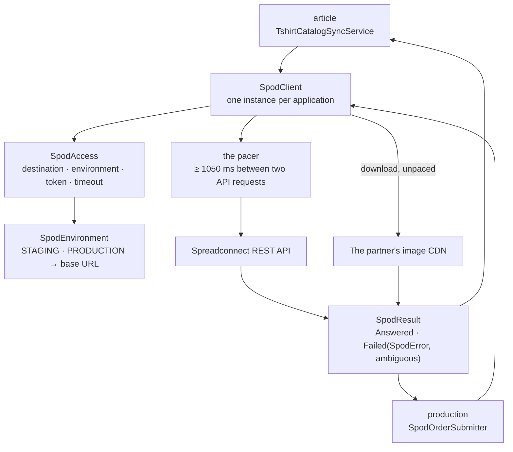

# The SPOD package

This guide explains the Kotlin code in
[`backend/modules/spod/src/shop/voenix/spod`](../../../../backend/modules/spod/src/shop/voenix/spod).

## What this package does

The SPOD package is the one place in this backend that knows the HTTP API of
the print-on-demand partner **Spreadconnect (SPOD)**. It owns the client, the
vocabulary of a provider call (`SpodAccess`, `SpodEnvironment`, `SpodResult`,
`SpodError`), the request and response shapes of the eight calls, and the one
piece of interpretation the partner's answers need, `parseColorHex`.

It is a **leaf module**: it depends on no other module of this backend, not
even `platform`. It owns no table, installs no route, and has no runtime
handle. What it has is one class, `SpodClient`, and two modules consume it:

- `production` submits an order through it — upload a design, create the order
  in state `NEW`, read it, confirm it, and ask which placements a product type
  offers (see [SPOD fulfillment](spod-fulfillment.md));
- `article` reads the merchant's backoffice catalog through it and turns it
  into this shop's t-shirts — list the articles, read a size chart, download an
  image one of those answers points at (see the
  [Article package guide](article-package.md#t-shirts)).

The client used to live inside `production`. It moved here when the t-shirt
catalog became synced data
([ADR 0003, decision 5](../../../adr/0003-spod-backoffice-as-t-shirt-source.md)):
two modules needed the same client, and the alternative — `article` depending
on `production`, or a second client next to the first — would either have
inverted the layering or split the partner's request budget in two.

## The five-minute mental model



The ownership rules are:

1. **There is exactly one `SpodClient` per application.**
   [`Application.kt`](../../../../backend/app/src/shop/voenix/Application.kt)
   creates it and hands the same instance to the catalog runtime (which passes
   it to `installArticleModule`) and to the production module. The partner
   allows 60 requests per minute for the whole account, so one pacer has to
   hold that budget for every module and every supplier at once.
2. **Where to talk and how to authenticate is a property of the call**, not of
   the client. Every API call takes a `SpodAccess` and reads the installation,
   the token, and the timeout off it.
3. **Nothing the partner wrote leaves this module as text.** A call answers
   `SpodResult.Answered(value)` or `SpodResult.Failed(error, ambiguous)`, and
   `SpodError` is a four-entry enum. A provider body, a token, or a URL can
   therefore never reach a log line or a persisted column of a consumer.
4. **The module never decides what to do about a failure.** It never retries,
   never deactivates anything, never writes. Retrying belongs to the
   database-backed production worker; degrading belongs to the sync run.

## File map

| File | Contents |
| --- | --- |
| [`SpodClient.kt`](../../../../backend/modules/spod/src/shop/voenix/spod/SpodClient.kt) | The eight calls, the pacer, the response judgements, the order request shapes, `SpodResult`, and `SpodError`. |
| [`SpodAccess.kt`](../../../../backend/modules/spod/src/shop/voenix/spod/SpodAccess.kt) | `SpodAccess` — one destination row's installation, token, and timeout — and `SpodEnvironment` with the base URL each entry derives. |
| [`SpodCatalog.kt`](../../../../backend/modules/spod/src/shop/voenix/spod/SpodCatalog.kt) | The catalog answers (`SpodCatalogPage`, `SpodCatalogArticle`, `SpodCatalogVariant`, `SpodCatalogImage`, `SpodSizeChart`), the downloaded `SpodBinary`, and `parseColorHex`. |

## The HTTP API

This module serves **no** HTTP route. It is a client, not a surface: it has no
`install…Module` function, no routes file, and no runtime handle. Its "API" is
the eight calls it makes outwards.

| Call | Partner endpoint | Answers |
| --- | --- | --- |
| `uploadDesign(access, fileName, png)` | `POST /designs/upload` | the design id the print image was filed under |
| `createOrder(access, request)` | `POST /orders` | the partner's order id, always created in state `NEW` |
| `getOrder(access, orderId)` | `GET /orders/{id}` | the order's state |
| `confirmOrder(access, orderId)` | `POST /orders/{id}/confirm` | nothing; this is the moment production is ordered |
| `availableHotspots(access, productTypeId, designId)` | `GET /productTypes/{id}/hotspots/design/{designId}` | the placement names this product type offers |
| `articles(access, limit, offset)` | `GET /articles` | one page of the merchant's backoffice articles |
| `sizeChart(access, productTypeId)` | `GET /productTypes/{id}/size-chart` | the `sizeImageUrl` of that product type |
| `download(url, timeoutSeconds)` | the URL a previous answer carried | the image bytes and their content type |

The first five produce an order and are described step by step in
[SPOD fulfillment](spod-fulfillment.md); the last three read the catalog and
are what a sync run is built from.

## The four rules of the client

These four sentences shape every line of `SpodClient.kt`.

**Nothing the provider wrote is ever logged, and neither is anything of ours
that is secret.** Not an error body, not a decoder message — a
`kotlinx.serialization` message quotes the input it stumbled over, so the
message *is* the untrusted content — not the access token, and not the request
URL. What reaches a log line is this adapter's own context (a destination id, a
call name, a host) plus, at most, the HTTP status *number*.

**This client never retries.** Retries belong to the database-backed worker.
That is not a style preference: the partner offers no idempotency key for
`POST /orders`, so a blind retry inside the adapter could create a second real
order whose id nobody knows. `SpodResult.Failed.ambiguous` is how the adapter
tells its caller which failures left the outcome undecided — a `4xx` is the
partner saying "I did not do this" (`ambiguous = false`), while a timeout, a
reset connection, an unreadable answer, and every `5xx` are all `true`.

**Requests are paced, not throttled after the fact.** The pacer keeps at least
**1050 ms** between any two API requests the client makes, measured on
`System.nanoTime` behind a mutex that is held *across* the wait, so concurrent
callers queue up instead of all sleeping the same interval and then firing
together. 60 requests per minute would be exactly 1000 ms; the extra 50 ms
absorbs the jitter between reading the clock and the request leaving. A `429`
that happens anyway is the retryable `SpodError.RATE_LIMITED`.

**Where to talk and how to authenticate travels with the call.** Every API call
takes a `SpodAccess(destinationId, environment, accessToken, timeoutSeconds)`
and derives its URL from `SpodEnvironment`, never from a column — no admin
input can point this shop at an arbitrary host. `SpodAccess.toString()` redacts
the token, and `destinationId` is the only part of it that may be logged.

The client's `Json` is lenient and ignores unknown keys, because the partner
answers ids as numbers in some fields and as quoted strings in others, and
because its answers carry far more than what is read here.

## The download is the one documented exception

`download(url, timeoutSeconds)` is the only call whose URL does **not** come
from `SpodEnvironment`. It comes out of an answer the partner gave this shop —
a mockup image of a colour, or a size chart — so it is *bounded* instead of
trusted (ADR 0003, decision 5):

- **https only.** A `http` URL, a relative one, or anything that is not a URL
  is refused before a request goes out.
- **No redirect is followed.** The client is configured that way for every
  call: this API never answers with a redirect, so a redirect is a refusal to
  be judged, not a route to be walked. Walking it would replay the request
  against a URL this adapter never chose.
- **No access token is sent.** The CDN does not ask for one, and a token sent
  to a host this adapter did not choose would be a token given away.
- **Only an image is accepted.** The answer's content type must be an
  `image/*` one.
- **At most 10 MiB is read**, whatever the answer's `Content-Length` claims.
  The channel is cancelled the moment the cap is exceeded — this is an answer,
  not a request, and refusing to keep paying for it is the point of the cap.
  It is the same 10 MiB a visitor may upload: a mockup of a shirt has no
  business being larger than the picture printed on it.
- **It is not paced.** The 60-per-minute budget belongs to the API; pacing a
  few hundred CDN images behind it would make a sync take minutes for nothing.

Only the host of the URL may be logged, and only on a refusal — the host is
picked apart by hand rather than parsed, so a partner-written
`https://secret@host/` cannot put that `secret` in a log line. A URL or an
answer that is not a usable image becomes `PROVIDER_ANSWER_UNREADABLE`; there
is deliberately no error code of its own, because every caller acts on all
three refusals in the same way.

## The catalog answers are read leniently

Two decisions run through every type in `SpodCatalog.kt`, both from ADR 0003.

**Every field except an id has a default.** The partner documents neither which
fields are optional nor what a sparse article looks like, and a sync that
refuses to decode a page is a sync that writes nothing at all. A missing field
becomes an empty value — a variant without a colour, an article without images
— and the judgement (skip it, deactivate it, warn about it) happens in the sync
run, where it belongs. An id has no default, because an article or a variant
without identity is nothing this shop could store or match.

**Ids are strings.** `{"id": 42}` and `{"id": "42"}` are one and the same
article, which is what the lenient `Json` buys. The three *product* ids —
`productTypeId`, `appearanceId`, `sizeId` — are `Long` instead: they are what
an order is placed with, so they stay numbers all the way down.

`parseColorHex(value)` is the one interpretation this module performs. The
partner's `appearanceColorValue` is undocumented, and two things are known from
its answers: a two-tone garment lists its colours separated by commas, and a
colour may or may not carry the `#`. Only the first colour is taken (a shop
swatch shows one), three- and six-digit hex are both accepted
case-insensitively, and the result is normalized to lowercase `#rrggbb`, so two
spellings of one colour are one value in the database. Anything else answers
`null`, and the sync makes that colour's variants inactive with a bounded
warning instead of inventing a colour a customer would order by.

## Composition

The module has no `install…Module` function. The composition root creates the
one client and passes it on:

```kotlin
// Application.kt
installModules(databaseFactory.connectAndMigrate(), settings, spod ?: SpodClient())
```

`Application.install(application, mollie, spod)` takes an optional client so a
composition test can point the whole application at a `MockEngine`; a
deployment passes nothing and gets the CIO-backed client. From there the
instance travels to `installCatalogRuntime(database, publicStorage, spod)`,
which hands it to `installArticleModule`, and to the production module, which
also **closes** it when the application stops.

Both consuming modules declare the dependency as `exported`, because their own
public signatures name types of this module: `installArticleModule` and
`createProductionModule` take a `SpodClient`, `TshirtCatalogSync` takes a
`SpodAccess`, and the sync report answers a `SpodError`.

## Tests

The module's tests drive the real client against a `MockEngine`, which is how
the exact request, the header, and the pacer's arithmetic are observable at
all.

- `SpodClientTest` — the exact request of every one of the eight calls
  including the `X-SPOD-ACCESS-TOKEN` header, an id answered as a number
  reading like a quoted one, the pacer's waiting arithmetic on a fake clock,
  `429` → `RATE_LIMITED`, a `4xx` known versus a `5xx` ambiguous, the article
  listing paging with `limit`/`offset` until the count is reached, the four
  refusals of `download` (not https, not an image, over the cap, refused by the
  host), that image downloads are *not* paced while the catalog calls are, and
  that neither the token nor a URL nor a provider body ever reaches a log line.
- `ParseColorHexTest` — three- and six-digit hex with and without `#`, the
  first colour of a two-tone value, the normalization to lowercase, and the
  values that answer `null`.

The behaviour of the consumers is tested where it lives: the submission
protocol in `production`, the sync run in `article`. Both do it through
`SpodClient(engine)`, the module's blessed public test seam — see
[Visibility is never widened only for a test](../conventions/module-architecture.md#visibility-is-never-widened-only-for-a-test).

Run them with:

```sh
./kotlin test --include-module spod
```
