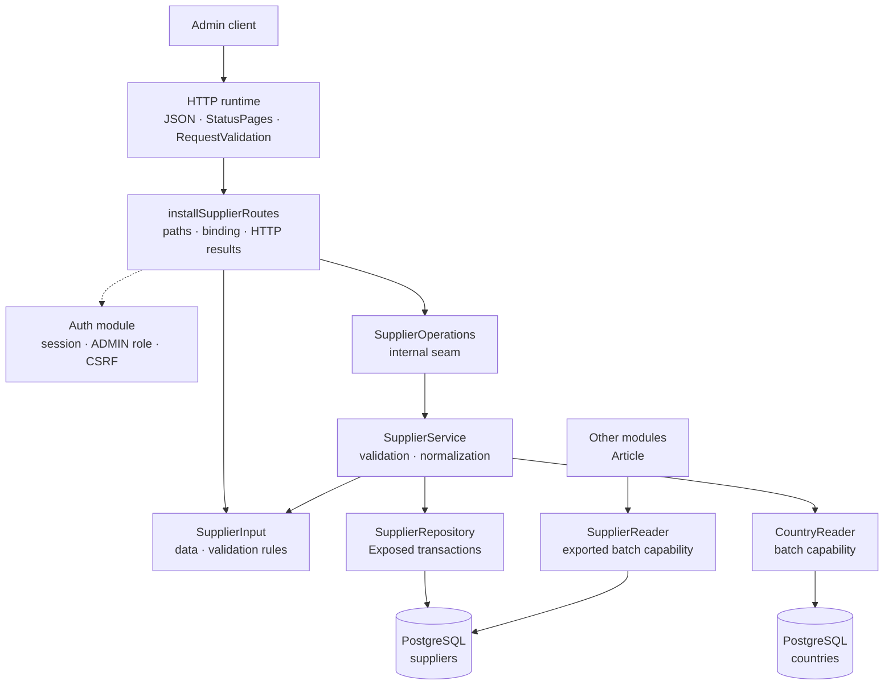

# The Supplier package

This guide explains the Kotlin code in
[`backend/modules/supplier/src/shop/voenix/supplier`](../../../../backend/modules/supplier/src/shop/voenix/supplier).

## What this package does

The Supplier package provides authenticated admin endpoints for listing,
creating, reading, fully replacing, and deleting suppliers. It validates and
normalizes supplier input and stores suppliers in PostgreSQL through Exposed.

Suppliers may refer to a country. The database keeps that relationship valid
and clears it automatically when the country is deleted. Other modules refer to
suppliers as well: the production tables, since the Article migration the
`article_mugs.supplier_id` column, and since the supplier fulfillment feature
the `users.supplier_id` link of a supplier login. Those references are what a
Supplier delete has to respect, and the follow-up work of the Supplier
migration is tracked in
[`supplier-post-migration.md`](../../../migration/supplier-post-migration.md).

The package also exports one capability to other compilation modules:
`SupplierReader.find(ids)` resolves a whole set of supplier references in one
batch. A module that lists rows referencing suppliers uses it to label those
rows without importing the supplier table or repository.

## The five-minute mental model



The important ownership rules are:

1. [`Application.kt`](../../../../backend/app/src/shop/voenix/Application.kt) installs
   shared JSON, `StatusPages`, `RequestValidation`, authentication, and the
   product modules once.
2. `installSupplierRoutes` installs the auth-owned `AdminRouteProtection`
   around the complete Supplier route subtree. Authentication, the `ADMIN` role, and CSRF
   are checked before a handler parses an ID or request body.
3. `SupplierInput.validate()` is the validation interface used by Ktor
   and `SupplierService`, and it implements the field rules next to the data it
   examines.
4. `SupplierService` normalizes valid data and turns expected outcomes into
   `OperationResult` values rather than exceptions.
5. `SupplierRepository` owns Exposed queries and transaction boundaries for
   the Supplier table only.
6. `SupplierService` resolves nested country values through the public
   `CountryReader` capability. Supplier cannot import the Country table or
   repository because those declarations are internal to the Country module.
   Create and update do not resolve the country themselves: they hand the
   repository's write result to the service's own suspending mapper, and that
   mapper looks the country up for a stored supplier that has a country ID.
7. `SupplierRepository` also implements the public `SupplierReader` capability.
   Other modules receive that interface from `installSupplierModule` and never
   see the repository type itself. This is the same shape Supplier consumes
   from Country, one level up.

## Production file map

The package contains thirteen production types in six files. Each file is one
concern, not one type: closely related declarations, such as a component and the
value types it produces, live together, following
[`source-file-organization.md`](../conventions/source-file-organization.md).

```text
supplier/
|- Supplier.kt
|- SupplierModule.kt
|- SupplierReader.kt
|- SupplierRepository.kt
|- SupplierRoutes.kt
`- SupplierService.kt
```

- `Supplier.kt` holds the module's two data types. `Supplier` is the internal
  detailed stored and admin HTTP representation; `SupplierInput` is the internal
  model shared by create and full replacement and owns its field rules through
  `validate()`. They are the read and the write side of the same concept, and
  every layer of the module speaks both.
- `SupplierService.kt` holds the service and the internal `SupplierOperations`
  seam it implements for the routes.
- `SupplierRepository.kt` holds everything about persistence: the repository,
  the `Suppliers` table object that maps the PostgreSQL table for Exposed, the
  `StoredSupplier` row type (the Supplier row without a nested cross-module
  object), and the `SupplierWriteResult` and `SupplierDeleteResult` outcomes,
  which stay internal to the repository and service implementation.
- `SupplierRoutes.kt` holds `installSupplierRoutes` and the private
  `ApplicationCall` helpers that turn an `OperationResult` into an HTTP answer.
- `SupplierReader.kt` holds the public batch-lookup capability together with
  `SupplierSummary`, the narrow public value it returns. It keeps a file of its
  own because it is the seam other modules compile against.
- `SupplierModule.kt` is wiring only: the internal `SupplierModule` runtime
  handle that owns the assembled implementation and hands out the exported
  `SupplierReader` without exposing its object graph to `app`, plus
  `installSupplierModule`, which installs the routes, and the request-validation
  function.

The shared [`OperationResult`](../conventions/operation-results.md) describes success,
validation, missing rows, conflicts, and unexpected failures.

The existing serializable `Country` type is reused for the nested country
representation because it has exactly the required `id`, `name`, and
`countryCode` meaning. `Supplier` itself remains internal even though it is an
HTTP response model. The module manifest exports the Country dependency
because the public `installSupplierModule` composition function accepts a
`CountryReader`.

## HTTP API

Every route requires an authenticated user with the exact `ADMIN` role.
Mutating methods also require the shared `X-XSRF-TOKEN` header.

| Method and path | CSRF | Success response |
| --- | --- | --- |
| `GET /api/admin/suppliers` | No | `200` with a JSON array of `Supplier` values |
| `POST /api/admin/suppliers` | Yes | `201` with `Supplier` and `Location` |
| `GET /api/admin/suppliers/{id}` | No | `200` with `Supplier` |
| `PUT /api/admin/suppliers/{id}` | Yes | `200` with the replaced `Supplier` |
| `DELETE /api/admin/suppliers/{id}` | Yes | `204` with no body |

The create response uses a relative location such as
`/api/admin/suppliers/42`. Invalid IDs return `400 Invalid supplier id` after
security checks and before a Supplier operation is called.

### `PUT` is a full replacement

`PUT /api/admin/suppliers/{id}` deliberately uses replacement semantics. The
same `SupplierInput` type is used for `POST` and `PUT`:

- `name` is always required;
- every optional property becomes the submitted value or `null`;
- an omitted optional JSON property also binds as `null`; and
- old optional values are not retained.

For example, replacing a Supplier with this body clears its previous address,
country, contact data, email, and website:

```json
{
  "name": "Globex"
}
```

The Vue Supplier dialog already sends every editable property as either a
value or `null`, so it is compatible with this contract. There is intentionally
no Missing-versus-null serializer and no partial-update behavior hidden behind
`PUT`.

## Validation and normalization

`SupplierInput.validate()` implements the field rules and returns lower
camel case field names for the shared `ApiError.errors` map.

| Field | Rule |
| --- | --- |
| `name` | Required after trimming; at most 255 characters |
| `postalCode` | Optional; at most 20 characters after trimming |
| `email` | Optional; at most 255 characters and a valid email shape |
| Other text fields | Optional; at most 255 characters after trimming |
| `countryId` | Optional; a non-null value must reference an existing country |

Optional blank text is valid and is stored as `null`. Nonblank text is trimmed
only after the whole input has passed validation. The email check requires one
`@`, nonempty text on both sides, and no whitespace. Obscure framework-specific
.NET email-parser edge cases are not part of the migrated contract.

The HTTP boundary rejects invalid input before `SupplierOperations` is called.
The service calls the same pure input method for direct callers, so bypassing
Ktor cannot send invalid or non-normalized values to persistence.

## Representation and ordering

The same `Supplier` representation is used for list, detail, create, and update
responses. It contains all editable fields plus both `countryId` and the nested
`country` value. Shared JSON configuration includes explicit `null` properties.
The list endpoint returns these values directly as a JSON array instead of
wrapping them in an `items` object. This keeps the Supplier API consistent with
the other simple list endpoints and avoids separate list-only models.

Suppliers are ordered by stored `name` and then `id`, which gives stable
ordering when names are equal. The repository loads Supplier rows without
joining a foreign module's table. The service collects every distinct country
ID and calls `CountryReader.find(ids)` once, so a list does not issue one
country query per Supplier.

## The exported `SupplierReader` capability

`installSupplierModule(database, countries)` returns a `SupplierReader`:

```kotlin
public interface SupplierReader {
    public suspend fun find(ids: Set<Long>): Map<Long, SupplierSummary>
}
```

It is the same set-in, map-out shape as `CountryReader` and `VatReader`. A
caller collects every distinct supplier ID of its own result page and resolves
them with one call instead of one query per row. An empty set is answered
without a database round trip, and an unknown ID is absent from the map rather
than mapped to `null`, so a dangling reference reads exactly like a missing
one.

`SupplierSummary` carries only `id` and `name`. It is deliberately not the
`Supplier` admin representation:

- A consumer that references suppliers needs to *label* its rows. Contact data,
  address, and the nested country belong to supplier administration and would
  turn every consumer into a second supplier UI.
- Everything an article knows about *its own* relationship to a supplier, the
  supplier article number and the supplier article name, is article master
  data stored in the article row. Production reads those values from the order
  or article side, never from this capability. `ProductionItem` therefore needs
  `supplierId` and `supplierArticleNumber` from the article, plus nothing from
  `SupplierReader`.

`SupplierRepository` implements the interface directly, so the capability reads
the same table as the admin routes and cannot drift from it. The composition
root binds the returned reader into the Article module:
`installArticleModule(database, images, prices, suppliers)` in
[`Application.kt`](../../../../backend/app/src/shop/voenix/Application.kt) passes
it on, and the mug list uses it to label its rows with supplier names.

## Persistence and transactions

Flyway migration
[`V3__create_suppliers.sql`](../../../../backend/modules/platform/resources/db/migration/V3__create_suppliers.sql)
creates the table, its generated `bigint` ID, text-length limits, ordering
index, country lookup index, and optional country foreign key.

The country foreign key uses `ON DELETE SET NULL`. PostgreSQL is the
concurrency-safe authority: create and update do not rely on a preliminary
country-existence query. SQL state `23503` during those writes becomes
`SupplierWriteResult.CountryNotFound`; constraint names and provider messages
are never exposed. The service maps that internal persistence result to
`OperationResult.Invalid` with a `countryId` field error. The route returns the
usual `400` validation response, so clients can show `Country not found` next
to the country field. An update and its detail read happen in one transaction,
so a bad country rolls back every submitted replacement value.

`SupplierRepository` does not state its transaction boundaries itself. It calls
the shared `Database.read` and `Database.write` helpers from the platform
module, and every method hands one of them its query: `database.read { … }`
for a read-only transaction, `database.write { … }` for a writing one.
Country, VAT, and Payment run their queries through the same two helpers, so
the default transaction policy is described in one place; see
[Persistence error handling](../conventions/persistence-error-handling.md).

Supplier rows and their Country enrichment intentionally use two read
snapshots. A compile-time module boundary prevents Supplier from recreating the
former cross-module SQL join, and an atomic cross-table snapshot is not needed
for this admin master-data view. If a Country is deleted after Supplier rows
are loaded but before `CountryReader` runs, that one response can retain the
previous `countryId` while returning `country: null`. The next read observes
PostgreSQL's `ON DELETE SET NULL` result and returns both values as `null`.
`SupplierServiceIntegrationTest` controls this race explicitly. The list still
uses one Supplier query and one batched Country query, never one transaction or
query per Supplier.

Supplier names are deliberately not unique. The source behavior allows equal
names, and the stable secondary `id` ordering keeps their list order
deterministic.

Four tables reference suppliers with `ON DELETE RESTRICT`:
`production_destinations`, `production_jobs`, `article_mugs` through its
`supplier_id` column, and `users` through the nullable `users.supplier_id` link
of a supplier login (the last one since the supplier fulfillment feature, issue
#119).
Deleting a Supplier that is still referenced by any of them therefore returns
`SupplierDeleteResult.InUse` from the repository, which the service maps to
`OperationResult.Conflict` and the route maps to
`409 Supplier is in use and cannot be deleted`. The referencing row has to be
removed first: the production destination or job (see
[`production-package.md`](production-package.md)), the mug that names the
supplier (see [`article-package.md`](article-package.md)), or the supplier login
(see [`account-package.md`](account-package.md)).
`ArticleSupplierRelationshipIntegrationTest` proves the article half end to
end, including that the `409` body leaks neither the constraint name nor the
table name.

Unexpected database failures are logged internally and become the generic
`500 Internal server error` API response. Coroutine cancellation is always
rethrown.

## Tests

- `SupplierInputValidationTest` covers the complete field-rule matrix once.
- `SupplierRouteSecurityAndValidationTest` covers route-subtree protection,
  CSRF ordering, binding, validation-before-operation, and HTTP result mapping.
- `SupplierServiceIntegrationTest` uses PostgreSQL for normalization, Country
  enrichment, ordering, full replacement, rollback, country FK behavior,
  deletion, the production-destination delete conflict, the documented
  split-snapshot race, hidden database errors, and one batched Country lookup
  per list.
- `SupplierAdminCrudIntegrationTest` runs the authenticated and
  CSRF-protected CRUD workflow through real Ktor routes and PostgreSQL.
- `SupplierReaderIntegrationTest` covers the exported capability against
  PostgreSQL: a batch of several suppliers, unknown IDs left out of the result,
  and an empty set answered without touching the database.
- `ApplicationDatabaseIntegrationTest` verifies that the complete Flyway chain
  builds a clean configured schema during application startup.

Run the final backend gate from [`backend/`](../../../../backend):

```sh
./kotlin do ktfmt
./kotlin check
```
