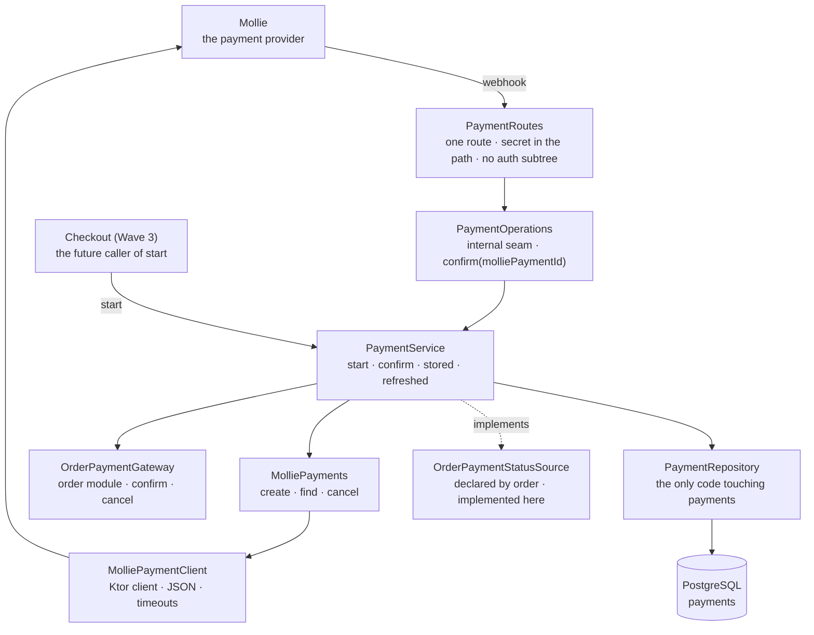

# Backend Payment package

This guide explains the Kotlin code in
[`backend/modules/payment/src/shop/voenix/payment`](../../../backend/modules/payment/src/shop/voenix/payment).

## What this package does

It collects the money for an order, through Mollie, and tells the order module
when that money has arrived.

The module is deliberately small on the outside. It has

- **one** HTTP route — the Mollie webhook,
- **one** exported capability — `PaymentModule.statusSource`, which is the order
  module's `OrderPaymentStatusSource`, and
- **one** internal entry point — `PaymentService.start`, whose caller arrives
  with the Wave-3 Checkout migration.

The two legacy endpoints, `POST /api/payments` and `GET /api/payments/{id}`, are
**not** migrated (deviation D1): neither had a consumer, the first let any
signed-in caller name their own amount, and the second answered any payment by
id to any signed-in caller.

The decided design, every deviation from the .NET original, and the history of
the decisions live in
[`payment-migration.md`](../../migration/payment-migration.md); the work
deliberately left for later lives in
[`payment-post-migration.md`](../../migration/payment-post-migration.md).

## The five-minute mental model



Read the picture as three jobs, because that is exactly how `PaymentService` is
written:

- A **payment** is one *attempt* at collecting the money for one order. An order
  can have several attempts over its life; at most one of them is *live* at a
  time.
- Which one is live is decided by the partial unique index
  `ux_payments_live_order`, not by a column and not by code. A payment that
  failed, was cancelled, or expired falls out of the index, so a retry becomes a
  second payment for the **same** order (deviation D9).
- `start` is idempotent by that index: a double-clicked checkout ends as one row
  and one checkout URL, and the attempt that lost the race has its provider
  payment cancelled.
- The webhook trusts nothing it is sent. It reads the payment id out of the body
  and asks Mollie what the status is; a forged `status=PAID` changes nothing.
- A terminal payment status **never** cancels the order (deviation D9). Only a
  provider that refused to create a payment at all does (deviation D10) — in
  that case there is nothing to pay with.
- The `paymentStatus` an order answer carries comes from here, through
  `OrderPaymentStatusSource`.
- The status vocabulary is the order module's `OrderPaymentStatus`, not a type of
  this module. `payments.status` stores exactly those seven words. Which of them
  are *terminal* is this module's business alone, because only its partial unique
  index cares.

## The spelling trap: `CANCELED` vs `CANCELLED`

Two words in this system look like a typo of each other and are not:

| Word | Where it lives | What it means |
| --- | --- | --- |
| `CANCELED` — **one** L | `payments.status`, `OrderPaymentStatus.CANCELED` | Mollie cancelled the *payment* |
| `CANCELLED` — **two** Ls | `orders.status`, `OrderStatus.CANCELLED` | this shop cancelled the *order* |

`CANCELED` is Mollie's American spelling and arrives from their API; `CANCELLED`
is the order module's own word. Do not "fix" either one. Unifying them would
make a status string silently valid on the wrong side, and the two facts are
genuinely different: a cancelled payment leaves the order `PENDING` and the
customer keeps their order.

The schema test asserts the trap directly: `payments`' status `CHECK` accepts all
seven Mollie words and **rejects** `CANCELLED`.

## HTTP API

| Method | Path | Who calls it | Answers |
| --- | --- | --- | --- |
| `POST` | `/api/payments/webhook/{secret}` | Mollie, and nobody else | `200` empty; `403`; `400`; `502`; `500` |

The request is form-encoded and carries exactly one field this backend reads:

```
POST /api/payments/webhook/<secret>
Content-Type: application/x-www-form-urlencoded

id=tr_WDqYK6vllg
```

The full outcome table — what one delivery does and which status it produces:

| Situation | Response |
| --- | --- |
| Wrong webhook secret | `403`, nothing read at all |
| No secret segment (`POST /api/payments/webhook`) | `404` — the route simply does not match (deviation D23) |
| Missing or blank `id` | `400` |
| Mollie unreachable, unreadable, or reporting a status word this module does not know | `502`, so Mollie redelivers |
| Status recorded, not `PAID` | `200` |
| `PAID`, and the order module applied it (or had applied an earlier delivery) | `200` |
| `PAID`, but Mollie's amount differs from the stored `amount_cents` | order **not** confirmed, ERROR, `200` (deviation D11) |
| `PAID` for an order that is `CANCELLED` | `200` + ERROR naming order id, payment ids and amount — a human refunds it (deviation D14) |
| The status write was refused by `ux_payments_live_order` (a dead payment reporting itself next to a live one) | `SUPERSEDED`: ERROR "may have been charged twice", the order is still confirmed on `PAID`, `200` |
| Database failure | `500`, so Mollie redelivers |
| Unknown Mollie payment id | `200` + WARN (deviation D2; legacy answered `404`) |

Five outcomes answer `200` on purpose. A webhook answer is a message to *Mollie*
about whether to redeliver, not a report to a human — and everything in that list
is already handled as far as software can handle it, so a redelivery would only
repeat the same log line every few minutes. The two non-`200` answers are exactly
the two a redelivery can genuinely fix. The other half of the type is therefore
the **log**: every non-routine outcome names its evidence at WARN or ERROR. The
deferred admin anomaly page is what will one day list them without anybody
reading a log.

The seven outcomes live on `PaymentConfirmation`, and `PaymentRoutes` holds the
one and only mapping from an outcome to an HTTP status.

## The webhook secret

Mollie has no session and sends no CSRF token, so the route deliberately installs
**none** of the application's auth or CSRF subtrees. The secret path segment
takes their place. It was Joe's condition for answering an unknown payment id
with `200` (deviations D2/D3): if anybody could reach the route, "unknown id →
200" would be a free probe.

Four rules make it a credential rather than a URL decoration:

1. `MollieSettings` requires at least **16 characters** (deviation D22) — a
   guessable secret is the same hole as none. A generated UUID clears that
   comfortably.
2. The comparison happens **before anything else**: before the body is read,
   before Mollie is called, before the database is touched. A wrong secret costs
   a string comparison and nothing more.
3. The comparison is **constant-time** (`MessageDigest.isEqual`). A timing side
   channel is exactly how a secret in a URL would be guessed.
4. `MollieSettings.toString()` redacts it next to the API key, and the webhook
   URL must be `https://` — plaintext would hand the secret to anyone on the
   path, since the secret *is* part of the address.

A request without the secret segment does not match the route at all and is
Ktor's plain `404` (deviation D23). Nothing is read or processed either way.

## Starting a payment

`PaymentService.start(request)` is `internal` and has no route; its caller
arrives with the Wave-3 Checkout migration. It answers the URL the customer is
sent to, or `null` when no payment could be started.

`PaymentRequest` is the module boundary made explicit: order id, amount in cents,
e-mail, optional phone, and the two addresses. The payment module **never reads
`orders`** — Checkout knows what it just placed and hands exactly that over, so
the provider request is built from one consistent snapshot.

The four steps:

1. **The order already has a live payment** → answer that payment's stored
   `checkout_url`, with no provider call at all. This is the double-clicked
   checkout, and it is the reason `checkout_url` is stored (deviation D6).
2. **Otherwise** Mollie creates a payment under a fresh `Idempotency-Key`, and
   the row is inserted through `executePostgresWrite`.
3. **The index refuses the insert** (`23505`): a concurrent `start` won. The
   winner is re-read in a *fresh* transaction — the one that hit the conflict is
   dead — its URL is answered, and *this* attempt's provider payment is cancelled
   at Mollie. An open payment nobody will ever be sent to is the one thing that
   could still take the customer's money twice. In a very narrow window that
   re-read comes back empty, because the winner turned terminal in between; the
   honest answer is then "no payment started" and a WARN, not the URL of a
   payment this attempt just cancelled (deviation D21).
4. **Mollie refuses or cannot be reached** → `orders.cancel(orderId)`, the
   compensation the legacy checkout performed, moved in here (deviation D10),
   plus a WARN naming order id and idempotency key, and `null` to the caller.

Everything from a successful creation onwards runs under one
`withContext(NonCancellable)` (deviation D20). The provider has a payment by
then, and a customer who closed the tab must not leave it behind — without it,
every suspending step of the cleanup, starting with the dispatch to the IO
dispatcher, would abort in exactly the case the cleanup exists for.

The amount is checked with `require`, not with a result value: the caller is a
module, not an HTTP client, so a non-positive amount is a bug in Checkout. The
database's `CHECK` says the same thing one layer down.

## Reading a status: stored versus refreshed

`PaymentService` implements the order module's `OrderPaymentStatusSource` with
two calls, and the split is the whole design:

| Call | Used by | Cost |
| --- | --- | --- |
| `stored(orderIds)` | `GET /api/orders` | one batch query, **never** a provider call — a history of twenty orders must not become twenty HTTP requests |
| `refreshed(orderId)` | `GET /api/orders/{orderId}` | may ask Mollie about *one* payment, and may confirm the order |

`refreshed` asks Mollie only when the stored status is `OPEN`, `PENDING`, or
`AUTHORIZED` — the three statuses from which the next thing that happens is a
webhook this backend may miss. `PAID` is deliberately not among them (this shop
tracks no refunds), and the three terminal ones never move again.

That refresh is the **missed-webhook fallback**, and it is load-bearing: a
webhook that never arrived would otherwise leave a paid order `PENDING` forever,
and the customer opening their order is what repairs it. What happens on a `PAID`
nobody knew about is *exactly* what a webhook does — the same code path — so the
amount check (D11) and the paid-but-cancelled rule (D14) hold whichever of the
two learned it first.

A provider that cannot be reached is **not** an error here (deviation D12): the
stored status is a truthful answer and gets a WARN. A display read must not turn
into a `502` because Mollie is slow.

Which row is "the order's payment" needs a rule, because an order can have
several: the live payment if there is one — the index guarantees at most one —
and otherwise the last attempt made. An order whose only payment expired
therefore answers `EXPIRED` rather than nothing.

## The schema

`payments`, created by
[`V17__create_payments.sql`](../../../backend/modules/platform/resources/db/migration/V17__create_payments.sql).

| Column | Why it looks like this |
| --- | --- |
| `id` | The payment's own identity. The order points *at* nothing; `payments.order_id` points at the order (deviation D8), because an order outlives its payments |
| `order_id` | `NOT NULL`, foreign key `ON DELETE RESTRICT` — an order somebody may have been charged for must not vanish under its payment record |
| `mollie_payment_id` | `varchar(64)`, `UNIQUE` (deviation D7). The webhook looks a payment up by exactly this |
| `status` | One of the seven `OrderPaymentStatus` words, enforced by `ck_payments_status` |
| `amount_cents` | What this shop *asked* for, so the webhook can compare it with what Mollie says was paid (deviation D11). `CHECK (amount_cents > 0)` |
| `checkout_url` | `NOT NULL` (deviation D6): the repeated `start` answers it instead of creating a second payment |
| `created_at`, `updated_at` | `updated_at` moves only when the status actually changed, so a redelivered `PAID` leaves it alone |

Two indexes carry meaning of their own:

```sql
CREATE UNIQUE INDEX ux_payments_live_order
    ON payments (order_id)
    WHERE status NOT IN ('FAILED','CANCELED','EXPIRED');

CREATE INDEX ix_payments_order_id ON payments (order_id);
```

`ux_payments_live_order` is the module's central rule written as a database
object: **one live payment per order**. A second live payment for one order fails
with `23505` instead of charging twice, while a payment that ended terminally
falls out of the index so a Wave-3 retry may start a fresh one for the same
order. `PaymentRepository` reports both refusals as values rather than
exceptions, because both are a race and not a bug — see
[`persistence-error-handling.md`](persistence-error-handling.md).

`ix_payments_order_id` serves the order-history batch read.

Four legacy columns are gone: `currency` (always `'EUR'`; the whole system is EUR
cents — deviation D4), `description` (always `Order #<id>`, built at send time)
and `redirect_url` (derivable from the settings plus the order id), both
write-only (deviation D5).

## The Mollie adapter

`MolliePayments` is the port — `create`, `find`, and a best-effort `cancel` — and
`MolliePaymentClient` is the Ktor-client implementation of it, built on the same
pattern as `FalImageGenerator` in the generator module.

Every way a provider call can go wrong ends in `null` or `false`: a refusal, an
unreadable answer, a timeout, an unreachable host, and a status word this module
does not know all mean the same thing to the service — "Mollie did not tell me
anything I can act on". Only `CancellationException` passes through, because the
request ending is not a provider failure.

There is no Mollie SDK. Two endpoints do not justify one, and the repo's
provider-logging rule would not be enforceable through it: **no provider body, no
decoder message, and no unknown status value may ever reach a log line** (see
[`backend/CLAUDE.md`](../../../backend/CLAUDE.md)). The port is the place where
that rule is enforceable, and `MolliePaymentClientTest` asserts it against the
captured log.

Details worth knowing when you touch the adapter:

- The amount is `BigDecimal.valueOf(cents, 2).toPlainString()` — never
  locale-dependent formatting. A German default locale must not send `40,70`.
- The phone number is normalized to E.164 through libphonenumber; an invalid
  number, or one without a `+` and without a country, is simply left out.
- Street and house number are two fields in this shop and one line for Mollie;
  they are joined here, not by the caller.
- The redirect URL gets `orderId` appended through `URLBuilder`, so a configured
  URL that already carries a query still works (deviation D19).
- `metadata` carries `{"orderId": n}`, and the currency constant is `EUR`.
- Every create attempt carries a fresh `Idempotency-Key` (deviation D17). Mollie
  caches a key for an hour, replays it for an identical repeat, refuses the same
  key with different parameters, and refuses a concurrent second use — a
  per-attempt key is the one choice compatible with all of that while still
  protecting a retried *transport* from creating two payments.
- Timeouts are short: 5 s connect, 10 s request and socket.

## Configuration

`MollieSettings` reads the `Mollie:` block of
[`application.yaml`](../../../backend/app/resources/application.yaml):

| Key | Environment variable | Rule |
| --- | --- | --- |
| `ApiKey` | `MOLLIE_API_KEY` | not blank |
| `RedirectUrl` | `MOLLIE_REDIRECT_URL` | absolute `http(s)://` URL — where the customer comes back to |
| `WebhookUrl` | `MOLLIE_WEBHOOK_URL` | absolute **HTTPS** URL — the address Mollie calls back on, secret segment included |
| `WebhookSecret` | `MOLLIE_WEBHOOK_SECRET` | at least 16 characters, and the last segment of `WebhookUrl` |

Every value is validated in the constructor, so a misconfigured deployment fails
*before* Flyway touches the database — the rule the auth and e-mail settings
follow, and one that matters more here than anywhere else: a shop that starts
without a working payment integration takes orders it can never collect money
for.

`apiUrl` is a constructor parameter and deliberately **not** a configuration key.
Deployments always talk to Mollie; only tests point the client at a local stub.
The composition test reaches it through an `internal` `module(mollie:
MollieSettings)` overload of the composition root (deviation D24) — a test seam,
not a configuration surface.

There is **no dummy mode** (deviation D16). A payment provider that silently
answers "paid" without money moving is the one stub whose accidental activation
in production nobody would notice until the bank statement. Local development
uses a Mollie test key and a tunnel; the setup is written down in
[`payment-post-migration.md`](../../migration/payment-post-migration.md).

## Composition

The payment module is installed **after** the order module and receives that
module's `OrderPaymentGateway`:

```kotlin
val paymentStatus = LateBoundPaymentStatus()
val order = installOrderModule(…, payments = paymentStatus, …)

val payments = installPaymentModule(database, settings.mollie, order.payments)
paymentStatus.bind(payments.statusSource)
```

The compile-time edge runs **`payment → order`**. The order module declares the
exchange vocabulary — `OrderPaymentStatus`, `OrderPaymentGateway`,
`OrderPaymentOutcome`, `OrderPaymentStatusSource` — and this module implements
the parts that need Mollie. The direction matters because `cart` re-exports
`order`: with the edge the other way round, every consumer of an order would
compile against the Mollie integration.

That leaves one knot, and `LateBoundPaymentStatus` is the honest place to break
it: payment needs `order.payments` at install time, while an order read needs
payment's status source. Order is installed with the late-bound source, payment
is installed, and `bind` closes the loop. Between those two lines a status read
fails with `IllegalStateException` rather than answering `null` — `null` is the
contracted word for "this order has no payment", and a customer who just paid
must never be told that. It is the third late-bound port in the composition root,
after `LateBoundProductionSource` and the order branch of the aggregated queued
e-mail source.

`installPaymentModule` also builds the Ktor HTTP client and closes it on
`ApplicationStopped`; that is why the adapter is constructed there and not inside
`createPaymentModule`.

## Tests

| Test class | Level | What it pins down |
| --- | --- | --- |
| `PaymentSchemaIntegrationTest` | Flyway + PostgreSQL | every constraint and both indexes, each violated by a statement that can trip only that one rule — including the `CANCELLED`/`CANCELED` trap |
| `PaymentIdempotencyIntegrationTest` | service + PostgreSQL | the `start` races: one row and one URL for two concurrent calls, the loser cancelled, zero provider calls on a sequential repeat, a second payment after a `FAILED` one, and both compensations on a cancelled coroutine |
| `PaymentWebhookIntegrationTest` | service + PostgreSQL | what one delivery does to payment *and* order: repeated `PAID`, amount mismatch, paid-but-cancelled, superseded, and the terminal statuses that leave the order `PENDING` |
| `PaymentStatusIntegrationTest` | service + PostgreSQL | the batch read's zero provider calls, the refresh matrix over all seven statuses, the refresh that confirms an order, and the provider failure that degrades to the stored status |
| `PaymentRoutesTest` | route (stub operations) | the secret (a wrong one refused before anything is read, and no near miss accepted), the untrusted body, the missing id, the outcome → status table, and that the webhook needs no CSRF token while a protected route still refuses one without |
| `MolliePaymentClientTest` | pure + mock engine | the provider contract: amount formatting under a comma-decimal locale, the phone matrix, the full JSON body, the redirect URL, the idempotency header, and that nothing the provider wrote reaches a log line |
| `MollieSettingsTest` | pure | the configuration rules and the redacting `toString` |
| `PaymentCompositionIntegrationTest` (app) | app + PostgreSQL | both bindings against the real composition root: a webhook pays a real order, and `GET /api/orders/{id}` then answers `"paymentStatus": "PAID"` |

The service-level classes share their stage through `PaymentServiceTestBase` and
the fakes in `PaymentTestSupport`.

Run them with:

```sh
./kotlin test --include-module payment
```

The integration tests need Docker, because they start PostgreSQL through
Testcontainers.

## What is deliberately not here

- **Creating a payment over HTTP.** `POST /api/payments` and
  `GET /api/payments/{id}` are not migrated (deviation D1). Starting a payment is
  a module capability that Checkout calls, not something a client asks for.
- **A dummy mode.** Deviation D16, see [Configuration](#configuration).
- **Cancelling an order because a payment failed.** A `FAILED`, `EXPIRED`, or
  `CANCELED` payment leaves the order `PENDING`, and the customer keeps their
  order across attempts (deviation D9). Only a provider that refused to create a
  payment at all takes the order back.
- **Refunds.** Nothing in this shop tracks them, which is why `PAID` is never
  refreshed and why a paid-but-cancelled order ends in an ERROR log and a human.
- **Reading orders.** The module never touches `orders`; it is *told* what to
  charge for, and it writes to an order only through `OrderPaymentGateway`.
- **The checkout orchestration** — the cart, the totals, the address validation,
  `carts.status = 'CHECKED_OUT'`, and the retry-payment flow — belongs to the
  Wave-3 Checkout migration; see
  [`payment-post-migration.md`](../../migration/payment-post-migration.md).
