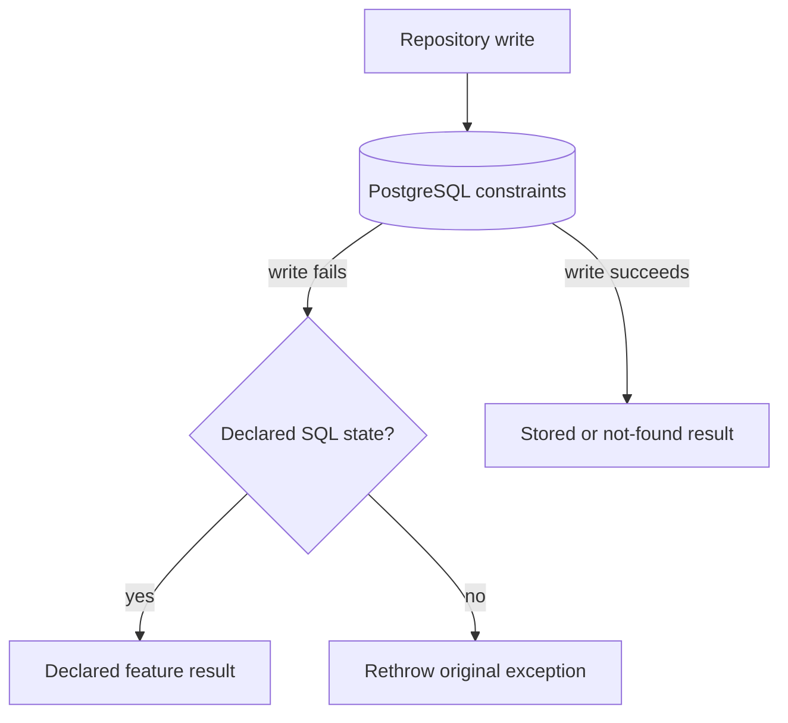

# Backend persistence error handling

This guide explains how Kotlin repositories turn expected PostgreSQL
constraint failures into typed feature results.

## The rule

Let PostgreSQL enforce unique business rules. A repository can declare that SQL
state `23505` returns the feature's generic `Conflict` result. It can also
declare an expected result for SQL state `23503`, which reports a foreign-key
violation. Rethrow every SQL error that the repository did not declare.

Do not inspect or return a database constraint name, index name, or localized
error message. Names such as `ux_countries_name_lower` are schema implementation
details and may change during a migration. They are useful in server logs, but
they are not part of the service or HTTP interface.

## The five-minute mental model



The database remains the concurrency-safe authority. Two requests may both
reach a write at the same time, but a unique database rule allows only one of
them to succeed.

## Shared implementation

[`PostgresWrite`](../../../backend/src/shop/voenix/db/PostgresWrite.kt) contains
the shared flow:

```kotlin
internal object PostgresWrite {
    suspend fun <T : Any> execute(
        uniqueViolation: T? = null,
        foreignKeyViolation: T? = null,
        operation: suspend () -> T,
    ): T =
        try {
            operation()
        } catch (exception: SQLException) {
            when {
                exception.hasSqlState("23505") && uniqueViolation != null ->
                    uniqueViolation
                exception.hasSqlState("23503") && foreignKeyViolation != null ->
                    foreignKeyViolation
                else -> throw exception
            }
        }
}
```

A repository supplies its own typed result and keeps the write operation as
Kotlin's trailing lambda:

```kotlin
execute(uniqueViolation = CountryWriteResult.Conflict) {
    // Run the insert or update transaction.
}
```

`PostgresWrite` searches the exception chain for the declared PostgreSQL SQL
states. The module does not know feature types, tables, or schema object names.
An omitted result means that the repository does not expect that violation, so
the original `SQLException` is rethrown. The bound `T : Any` excludes `null`
from feature results, which lets the optional parameters use `null` only to mean
"not declared".

Supplier uses the same shared mechanism for its optional country reference:

```kotlin
execute(foreignKeyViolation = SupplierResult.CountryNotFound) {
    // Insert or update the supplier.
}
```

A future write with both kinds of expected failure could declare both results
without nesting helper functions:

```kotlin
execute(
    uniqueViolation = ProductWriteResult.Conflict,
    foreignKeyViolation = ProductWriteResult.CountryNotFound,
) {
    // Run a write that can violate either rule.
}
```

Here SQL state `23503` means that the submitted country no longer exists. This
mapping is useful only because Supplier currently has exactly one foreign-key
reference during create and update. A future unrelated foreign key must not be
silently reported as a missing country.

Repositories call Exposed's JDBC `suspendTransaction` directly. JDBC operations
still block while the driver communicates with PostgreSQL, so repositories wrap
the transaction in `withContext(Dispatchers.IO)`. Reads can also ask PostgreSQL
for a read-only transaction:

```kotlin
withContext(Dispatchers.IO) {
    suspendTransaction(db = database, readOnly = true) {
        maxAttempts = 1
        Countries.selectAll()
    }
}
```

Feature-specific transaction policies stay in the feature repository. VAT, for
example, has a small `serializableTransaction` helper that configures
serializable isolation and three attempts. This keeps the reason for the
stronger policy next to the code that moves the default VAT entry.

## Why there is no preliminary lookup

This sequence can happen when a lookup is the only protection:

```text
request A: value does not exist
request B: value does not exist
request A: insert succeeds
request B: insert succeeds
```

A unique database rule prevents the second insert. A repository therefore does
not need an extra lookup before or after a failed write just to produce a more
specific conflict message.

## Deliberate trade-off

Every `23505` from a Country write that declares `uniqueViolation` becomes the
same feature conflict. Country does not say whether the name or country code was
duplicated. A future unique rule also automatically produces that generic
conflict.

This loses field-specific detail, but it keeps the persistence interface small
and avoids a second transaction after a failed write. The HTTP response must
use a generic message such as `Country name or code already exists` and must
not include the PostgreSQL object name.

## Tests

For a feature with unique writes, test:

1. a normal duplicate create or update returns `Conflict`;
2. concurrent duplicate writes leave one stored row and one `Conflict`; and
3. a non-unique SQL error is still rethrown and becomes `DatabaseError`.
