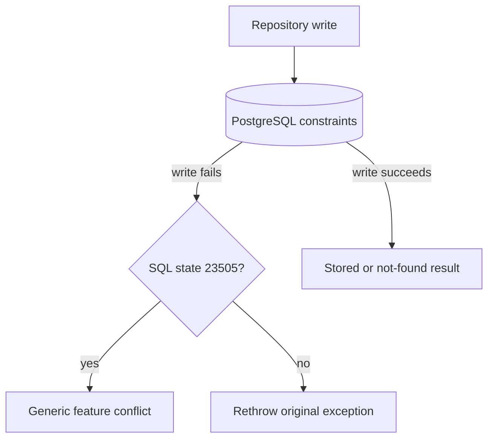

# Backend persistence error handling

This guide explains how Kotlin repositories turn expected PostgreSQL
constraint failures into typed feature results.

## The rule

Let PostgreSQL enforce unique business rules. When a write fails with SQL state
`23505`, return the feature's generic `Conflict` result. Rethrow every other SQL
error.

Do not inspect or return a database constraint name, index name, or localized
error message. Names such as `ux_countries_name_lower` are schema implementation
details and may change during a migration. They are useful in server logs, but
they are not part of the service or HTTP interface.

## The five-minute mental model



The database remains the concurrency-safe authority. Two requests may both
reach a write at the same time, but a unique database rule allows only one of
them to succeed.

## Shared implementation

[`PostgresWrite`](../../../backend/src/shop/voenix/db/PostgresWrite.kt) contains
the shared flow:

```kotlin
internal object PostgresWrite {
    suspend fun <T : Any> writeOrConflict(
        conflict: T,
        operation: suspend () -> T,
    ): T = writeOrSqlState("23505", conflict, operation)

    suspend fun <T : Any> writeOrForeignKeyViolation(
        foreignKeyViolation: T,
        operation: suspend () -> T,
    ): T = writeOrSqlState("23503", foreignKeyViolation, operation)

    // One private helper runs the write and searches the exception chain.
}
```

A repository supplies its own typed result and keeps the write as Kotlin's
trailing lambda:

```kotlin
writeOrConflict(conflict = CountryWriteResult.Conflict) {
    // Run the insert or update transaction.
}
```

Its private helper searches the exception chain for PostgreSQL SQL state
`23505`. The module does not know feature types, tables, or schema object names.

Supplier uses the same shared mechanism for its optional country reference:

```kotlin
writeOrForeignKeyViolation(SupplierResult.CountryNotFound) {
    // Insert or update the supplier.
}
```

Here SQL state `23503` means that the submitted country no longer exists. This
mapping is useful only because Supplier currently has exactly one foreign-key
reference during create and update. A future unrelated foreign key must not be
silently reported as a missing country.

Repositories call Exposed's JDBC `suspendTransaction` directly. JDBC operations
still block while the driver communicates with PostgreSQL, so repositories wrap
the transaction in `withContext(Dispatchers.IO)`. Reads can also ask PostgreSQL
for a read-only transaction:

```kotlin
withContext(Dispatchers.IO) {
    suspendTransaction(db = database, readOnly = true) {
        maxAttempts = 1
        Countries.selectAll()
    }
}
```

Feature-specific transaction policies stay in the feature repository. VAT, for
example, has a small `serializableTransaction` helper that configures
serializable isolation and three attempts. This keeps the reason for the
stronger policy next to the code that moves the default VAT entry.

## Why there is no preliminary lookup

This sequence can happen when a lookup is the only protection:

```text
request A: value does not exist
request B: value does not exist
request A: insert succeeds
request B: insert succeeds
```

A unique database rule prevents the second insert. A repository therefore does
not need an extra lookup before or after a failed write just to produce a more
specific conflict message.

## Deliberate trade-off

Every `23505` becomes the same feature conflict. For example, Country does not
say whether the name or country code was duplicated. A future unique rule also
automatically produces that generic conflict.

This loses field-specific detail, but it keeps the persistence interface small
and avoids a second transaction after a failed write. The HTTP response must
use a generic message such as `Country name or code already exists` and must
not include the PostgreSQL object name.

## Tests

For a feature with unique writes, test:

1. a normal duplicate create or update returns `Conflict`;
2. concurrent duplicate writes leave one stored row and one `Conflict`; and
3. a non-unique SQL error is still rethrown and becomes `DatabaseError`.
