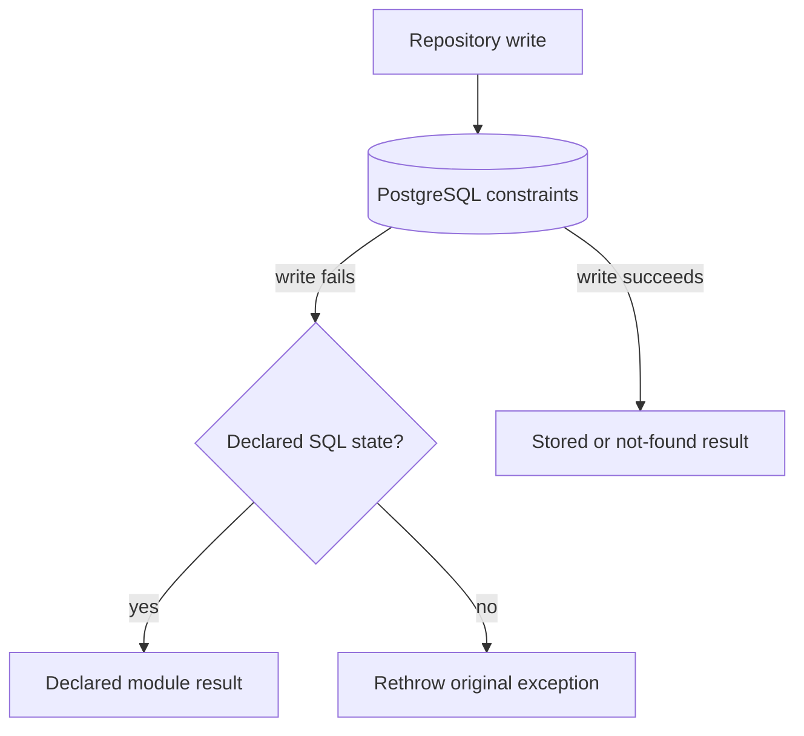

# Backend persistence error handling

This guide explains how Kotlin repositories turn expected PostgreSQL
constraint failures into typed module-specific results.

## The rule

Let PostgreSQL enforce unique business rules. A repository can declare that SQL
state `23505` returns the module's generic `Conflict` result. It can also
declare an expected result for SQL state `23503`, which reports a foreign-key
violation. Rethrow every SQL error that the repository did not declare.

Do not inspect or return a database constraint name, index name, or localized
error message. Names such as `ux_countries_name_lower` are schema implementation
details and may change during a migration. They are useful in server logs, but
they are not part of the service or HTTP interface.

## The five-minute mental model


```mermaid
flowchart TD
    Repository["Repository write"]
    Database[("PostgreSQL constraints")]
    SqlState{"Declared SQL state?"}
    Stored["Stored or not-found result"]
    Expected["Declared module result"]
    Unexpected["Rethrow original exception"]

    Repository --> Database
    Database -->|"write succeeds"| Stored
    Database -->|"write fails"| SqlState
    SqlState -->|"yes"| Expected
    SqlState -->|"no"| Unexpected
```

The database remains the concurrency-safe authority. Two requests may both
reach a write at the same time, but a unique database rule allows only one of
them to succeed.

## Shared implementation

[`executePostgresWrite`](../../../backend/modules/platform/src/shop/voenix/db/PostgresWrite.kt)
contains the shared flow. It is a generic public function in `platform`, so
module repositories can use it without exposing any module type back to
`platform`:

```kotlin
public suspend fun <T : Any> executePostgresWrite(
    uniqueViolation: T? = null,
    foreignKeyViolation: T? = null,
    operation: suspend () -> T,
): T
```

A repository supplies its own typed result and keeps the write operation as
Kotlin's trailing lambda:

```kotlin
executePostgresWrite(uniqueViolation = CountryWriteResult.Conflict) {
    // Run the insert or update transaction.
}
```

`executePostgresWrite` searches the exception chain for the declared PostgreSQL SQL
states. The platform implementation does not know product-module types, tables,
or schema object names.
An omitted result means that the repository does not expect that violation, so
the original `SQLException` is rethrown. The bound `T : Any` excludes `null`
from module results, which lets the optional parameters use `null` only to mean
"not declared".

Supplier uses the same shared mechanism for its optional country reference:

```kotlin
executePostgresWrite(foreignKeyViolation = SupplierWriteResult.CountryNotFound) {
    // Insert or update the supplier.
}
```

A future write with both kinds of expected failure could declare both results
without nesting helper functions:

```kotlin
executePostgresWrite(
    uniqueViolation = ProductWriteResult.Conflict,
    foreignKeyViolation = ProductWriteResult.CountryNotFound,
) {
    // Run a write that can violate either rule.
}
```

Here SQL state `23503` means that the submitted country no longer exists. This
mapping is useful only because Supplier currently has exactly one foreign-key
reference during create and update. The service maps the internal write result
to an `OperationResult.Invalid` field error, which becomes a normal `400`
validation response. A future unrelated foreign key must not be silently
reported as a missing country.

A foreign key fails a write from two sides, and both use the same mapping. The
example above is the insert side: the referenced row is missing. The other side
is a delete that child rows still reference. Those foreign keys are
`ON DELETE RESTRICT`, so PostgreSQL rejects the delete with the same SQL state:

```kotlin
executePostgresWrite(foreignKeyViolation = VatDeleteResult.InUse) {
    // Delete the VAT entry.
}
```

The condition is the same in both cases: only one relationship can fail this
write, so `23503` identifies the outcome without inspecting a constraint name.
A delete is usually the easier case, because every child table that restricts
it produces the same "still in use" answer.

Repositories do not spell out the default transaction policy themselves. It
lives in one place, the platform file
[`Transactions.kt`](../../../backend/modules/platform/src/shop/voenix/db/Transactions.kt),
which exports two extension functions on Exposed's `Database`:

```kotlin
internal suspend fun list(): List<Country> = database.read {
    Countries.selectAll().map(::toCountry)
}

internal suspend fun delete(id: Long): Int = database.write {
    Countries.deleteWhere { Countries.id eq id }
}
```

Both helpers wrap the transaction in `withContext(Dispatchers.IO)`, because the
JDBC driver blocks the thread it runs on while it talks to PostgreSQL, and both
set `maxAttempts = 1`, so Exposed never silently retries a call. `read`
additionally asks PostgreSQL for a read-only transaction, which makes the
database reject an accidental write instead of performing it.

A repository therefore names the transaction it wants and writes the query, and
nothing else. Choosing the I/O dispatcher is not a repository decision any more;
`Transactions.kt` owns it.

The exception is a module that needs a *different* policy, not the default
one. Such a policy stays in the module repository and calls Exposed's
`suspendTransaction` itself. VAT, for example, has a small
`serializableTransaction` helper that configures serializable isolation and
three attempts. This keeps the reason for the stronger policy next to the code
that moves the default VAT entry.

## How long a statement may wait

PostgreSQL bounds every statement the application runs. The bounds are set once,
in the Hikari pool that
[`DatabaseFactory`](../../../backend/modules/platform/src/shop/voenix/db/DatabaseFactory.kt)
creates, and no module overrides them:

| Setting | Value | What it bounds |
| --- | --- | --- |
| `lock_timeout` | `10s` | waiting for a row or table lock another transaction holds |
| `statement_timeout` | `30s` | one statement's own execution |

The pool passes them to the JDBC driver as the connection option
`-c lock_timeout=10s -c statement_timeout=30s`, so PostgreSQL applies them from
each connection's first statement on. Without `lock_timeout`, an insert that
queues behind an uncommitted competitor on a unique index waits exactly as long
as that competitor's transaction lives — which is not a duration this
application controls.

The migration run is the deliberate exception. Flyway opens its own connections
from the plain JDBC URL rather than borrowing the pool, because creating an
index on a large table is a single statement that may honestly run for minutes.
The advisory lock that serializes concurrent starts uses a plain `DriverManager`
connection for the same reason.

Both bounds apply per statement, not per request or per background sweep. The
email worker's outbox scan runs many short statements in a long-lived loop, and
the payment compensation phase runs one short write inside a `NonCancellable`
region; neither holds a single statement open for 30 seconds.

When a bound fires, PostgreSQL aborts the statement and the driver raises an
`SQLException` — SQL state `55P03` for a lock timeout, `57014` for a statement
timeout. Neither state is one a repository declares, so `executePostgresWrite`
rethrows it, `Logger.databaseOperation` logs it, and the service answers with
`OperationResult.UnexpectedFailure`. A timeout therefore needs no handling of
its own: it is an unexpected persistence failure like any other, and the log
entry carries the SQL state.

## Why there is no preliminary lookup

This sequence can happen when a lookup is the only protection:

```text
request A: value does not exist
request B: value does not exist
request A: insert succeeds
request B: insert succeeds
```

A unique database rule prevents the second insert. A repository therefore does
not need an extra lookup before or after a failed write just to produce a more
specific conflict message.

## Deliberate trade-off

Every `23505` from a Country write that declares `uniqueViolation` becomes the
same module conflict. Country does not say whether the name or country code was
duplicated. A future unique rule also automatically produces that generic
conflict.

This loses field-specific detail, but it keeps the persistence interface small
and avoids a second transaction after a failed write. The HTTP response must
use a generic message such as `Country name or code already exists` and must
not include the PostgreSQL object name.

## Tests

For a module with unique writes, test:

1. a normal duplicate create or update returns `Conflict`;
2. concurrent duplicate writes leave one stored row and one `Conflict`; and
3. a non-unique SQL error is still rethrown and becomes `UnexpectedFailure`.
