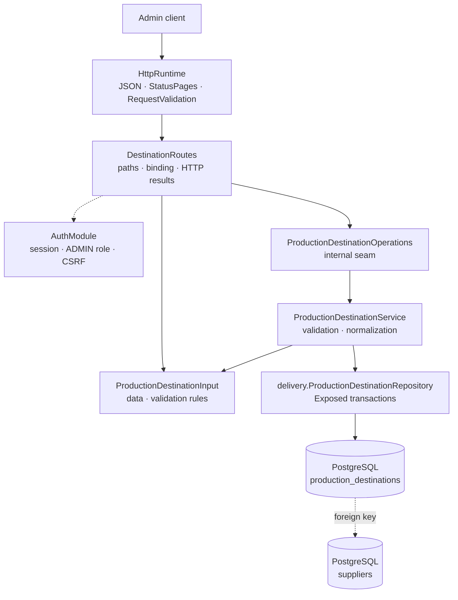

# Backend Production package

This guide explains the Kotlin code in
[`backend/modules/production/src/shop/voenix/production`](../../../backend/modules/production/src/shop/voenix/production).

## What this package does

The Production module will own production-PDF generation and delivery to
suppliers. The migration brief and decision record live in
[`production-migration.md`](../../migration/production-migration.md).

The second delivered slice is the **on-demand production PDF**: from one
order, the module renders one PDF per involved supplier — an address page
plus one page per physical item. See
[the production PDF](#the-production-pdf) below.

The first delivered slice is the admin management of **production
destinations**: the SFTP accounts of a supplier to which finished production
PDFs will later be delivered. An admin can list, create, read, fully replace,
and delete destinations through authenticated routes. Destinations are
database rows, not static configuration — changing a supplier's delivery
setup is an admin API call, never a deployment.

The SFTP password is strictly **write-only**: it can be set and replaced
through the API, but it never appears in any response, log line, or error
message.

## The five-minute mental model



The structure mirrors the Supplier package: routes bind HTTP, the service
validates and normalizes, the repository owns Exposed transactions, and every
expected failure is a typed `OperationResult`. Persistence lives in the
`delivery` sub-package because destinations belong to the future delivery
worker; the admin-facing types live at the package root.

## Routes

All routes sit under the shared admin protection
(`installAdminRouteProtection`), so authentication, the `ADMIN` role, and CSRF
are enforced before any handler runs:

| Method and path | Success | Purpose |
| --- | --- | --- |
| `GET /api/admin/production/destinations` | `200` | List every destination, ordered by supplier then id |
| `POST /api/admin/production/destinations` | `201` + `Location` | Create a destination |
| `GET /api/admin/production/destinations/{id}` | `200` | Read one destination |
| `PUT /api/admin/production/destinations/{id}` | `200` | Fully replace a destination |
| `DELETE /api/admin/production/destinations/{id}` | `204` | Delete an unreferenced destination |

## The write-only password

The password protection is layered so that no single mistake can leak it:

1. The response model `ProductionDestination` has no password property, so
   serialization cannot include one.
2. `ProductionDestinationRepository` never selects the password column when
   reading. The stored model `StoredProductionDestination` cannot even hold a
   password in memory.
3. `ProductionDestinationInput.toString()` replaces the password with
   `[redacted]`. This matters because Ktor's `RequestValidationException`
   message embeds the offending input's `toString()`.
4. Service log messages contain ids only, never field values.

Replacing a destination keeps the stored password when the request omits the
`password` field (or sends `null` or a blank value). Sending a new value
replaces it. Creating a destination requires a password.

## Validation rules

`ProductionDestinationInput.validate()` implements the field matrix:

- `supplierId`, `channel`, `label`, `host`, `username`,
  `hostKeyFingerprint`, and `timeoutSeconds` are required.
- `channel` currently accepts only `SFTP`. The database enforces the same
  set with a check constraint; new channels are a deliberate schema change.
- `hostKeyFingerprint` is mandatory because every future SFTP connection must
  verify the pinned host key — there is no permissive fallback.
- `port` must be between 1 and 65535 and defaults to 22.
- `timeoutSeconds` must be between 1 and 3600.
- `notificationEmail` is optional but must look like an email address.
- `remotePath` defaults to `/`.
- `enabled` defaults to `true`. Disabling a destination
  (`"enabled": false` in a `PUT`) is the operational off-switch: the row and
  its credentials survive, but the future delivery worker will skip it.

## Persistence and typed constraint results

The Flyway migration `V6__create_production_destinations.sql` creates the
table in the platform-owned global chain. PostgreSQL enforces the supplier
foreign key, the channel check, and the port/timeout ranges.

Expected constraint failures become typed results through the shared
[`executePostgresWrite`](persistence-error-handling.md) helper — SQL states,
never constraint names:

- An insert or update with an unknown `supplierId` maps to
  `SupplierNotFound`, which the API returns as a `400` with a `supplierId`
  field error.
- A delete blocked by a foreign key maps to `InUse` and a
  `409 Conflict` response. No table references destinations yet, but the
  upcoming `production_deliveries` table will use exactly this path, making
  `enabled = false` the only way to switch off a destination that has
  history.

The reverse direction is protected too: deleting a Supplier that still owns
destinations returns `409` from the Supplier API (see
[`supplier-package.md`](supplier-package.md)).

## The production PDF

### The public contract

The PDF capability is defined entirely by public types in
`shop.voenix.production` — no PDF-library type ever crosses the module
boundary (a test enforces this):

- `ProductionSource` resolves the immutable order/item/image inputs for one
  order. The real implementation arrives with the Order migration; module
  tests use an in-memory lambda.
- `ProductionData` and `ProductionItem` carry the shipping address, the items
  in explicit source order, each item's supplier, quantity, generated image
  path, and the optional mug-layout overrides in millimetres.
- `ProductionPdfGenerator.generate(orderId)` is the on-demand capability for
  the authorized download. It returns a typed `ProductionPdfResult`:
  `Generated` with one `ProductionPdfDocument` per involved supplier,
  `OrderNotFound`, or `GenerationFailed` with a `ProductionPdfError`.
- Every `ProductionPdfDocument` has the stable producer-facing file name
  `ORD-{orderId}.pdf`, media type `application/pdf`, the raw bytes, and their
  SHA-256 hex digest. The name repeats across suppliers of one order by
  design: a supplier only ever receives its own documents, so the name stays
  unique per destination.

### The document layout

`pdf.ProductionPdfRenderer` recreates the legacy layout with Apache PDFBox:

1. An address page of 239 mm x 99 mm: the shipping address centered, the
   order label `ORD-{orderId}` reading bottom-to-top in a narrow left column.
2. One page per **physical** item: an item with quantity 3 becomes three
   pages. The left column shows `ORD-{orderId} ({index}/{total})` with a
   stable 1-based index **within the supplier's job**. The right column shows
   `article | supplier article number | variant` reading top-to-bottom (the
   supplier number is left out when blank). The generated image sits between
   the columns; a print template confines its width, puts it on the bottom
   margin, and centers it, otherwise it is centered in the full area. Items
   may override the page size via the document-format fields.

Text uses the Liberation Sans font bundled inside the PDFBox jar, which
covers extended Latin plus Cyrillic; the bold address name is approximated
with fill-plus-stroke because no bold face is bundled.

### Typed, retryable failures

A missing production image is **never** a silently blank page — the decision
record makes it a typed, retryable failure. `ProductionPdfError` is the
bounded error vocabulary (and the later job table's safe error codes):
`MISSING_IMAGE`, `UNREADABLE_IMAGE`, `INVALID_SOURCE` (non-positive quantity
or measurement), and `RENDER_FAILURE` (details go to the log, never into the
result).

### Legacy fixture comparison

`ProductionPdfLegacyFixtureTest` compares rendered page images (never raw
bytes) against reference PDFs from the legacy system. Fixtures are dropped
into
[`testResources/legacy-production-pdfs`](../../../backend/modules/production/testResources/legacy-production-pdfs/README.md);
until they are delivered the test skips itself and says so.

## Module wiring

`ProductionModule` is the runtime handle; it exposes the public
`pdfGenerator`. Because a real `ProductionSource` only arrives with the Order
migration, the application currently installs just the destination routes
with `installProductionModule(database)` and registers
`validateProductionRequests()` inside `RequestValidation`, exactly like the
other modules in
[`Application.kt`](../../../backend/app/src/shop/voenix/Application.kt).
Standalone tests assemble a full module with `createProductionModule(database,
productionSource)`. The delivery worker and SFTP adapter from the migration
brief will extend this module in later tickets.

## Tests and verification

- `ProductionPdfRendererTest` proves the physical layout: PDF magic bytes,
  page count per quantity, millimetre page sizes and overrides, rotated text
  directions, image placement (rendered to pixels), and the stable file
  name/digest.
- `ProductionPdfGeneratorTest` drives the public capability with an in-memory
  source: not-found results, multi-supplier separation with per-job
  numbering, every typed failure, and Unicode round-trips.
- `ProductionPublicApiTest` guards that no PDF-library type leaks into the
  public API.
- `ProductionPdfLegacyFixtureTest` holds the rendered-image comparison
  harness for legacy reference PDFs (skips itself until fixtures exist).
- `ProductionDestinationInputValidationTest` covers the field-rule matrix and
  the redacted `toString`.
- `ProductionDestinationRouteSecurityAndValidationTest` covers route-subtree
  protection, CSRF ordering, id binding, validation-before-operation, HTTP
  result mapping, and that validation errors never echo the password.
- `ProductionDestinationAdminCrudIntegrationTest` runs the authenticated CRUD
  workflow through real Ktor routes and Testcontainers PostgreSQL, including
  the Flyway migration on an empty database, applied defaults, the write-only
  password (checked directly against the database column), the typed
  unknown-supplier result, disabling, and deletion.
- `SupplierServiceIntegrationTest` proves the supplier-side delete conflict.

Run the final backend gate from [`backend/`](../../../backend):

```sh
./kotlin do ktfmt
./kotlin check
```
