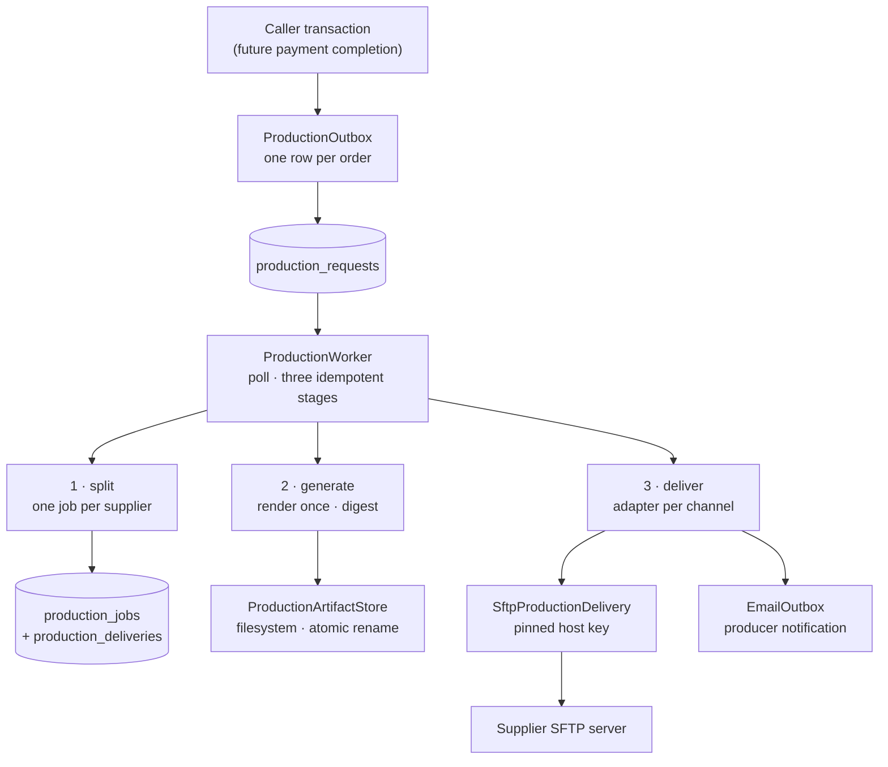
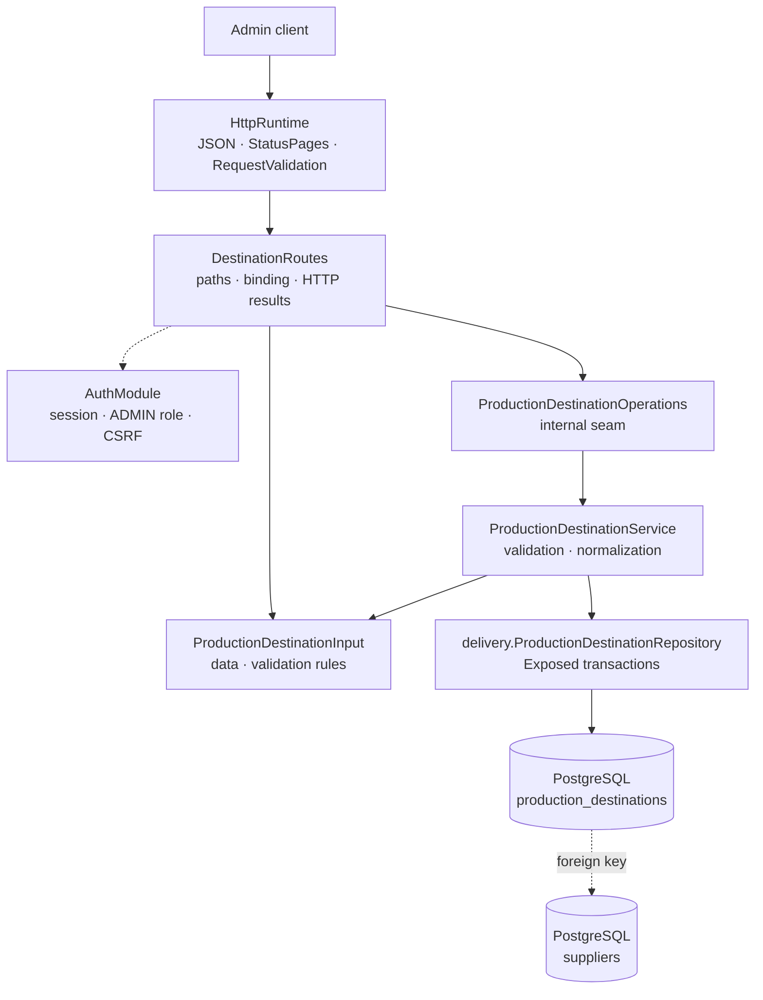

# Backend Production package

This guide explains the Kotlin code in
[`backend/modules/production/src/shop/voenix/production`](../../../backend/modules/production/src/shop/voenix/production).

## What this package does

The Production module turns a paid order into production PDFs and delivers
them to the involved suppliers. Its place in the module graph
(`production -> platform, email`) is described in
[the module architecture](module-architecture.md); the migration brief and
decision record live in
[`production-migration.md`](../../migration/production-migration.md).

The module owns six responsibilities:

- **Destination management** — admin CRUD for a supplier's delivery
  accounts. Destinations are database rows, not static configuration:
  changing a supplier's delivery setup is an admin API call, never a
  deployment. See [destination management](#destination-management).
- **On-demand production PDF** — from one order, render one PDF per involved
  supplier: an address page plus one page per physical item. See
  [the production PDF](#the-production-pdf).
- **The durable request and the split worker** — a caller (the future
  payment-completion transaction) triggers production with one cheap database
  row; a single background worker later splits it into one job per involved
  supplier plus one delivery per enabled destination. See
  [the durable request and the split worker](#the-durable-request-and-the-split-worker).
- **The immutable artifact** — the worker generates each job's PDF exactly
  once, persists it on the local filesystem, and records only metadata
  (SHA-256 digest, `generated_at`) in the database. Every later delivery and
  retry provably ships the same bytes. See
  [artifact generation](#artifact-generation).
- **SFTP delivery** — the worker pushes every generated artifact to the
  supplier's enabled destinations through a channel-neutral adapter seam. The
  SFTP adapter verifies the pinned host key, uploads to a temporary name, and
  renames to the final `ORD-{orderId}.pdf`; `delivered_at` is set only after
  the server confirmed acceptance. See [delivery](#delivery).
- **The producer notification** — after a successful delivery, an
  informational email to the producer is enqueued through the email module's
  `EmailOutbox`, atomically with `delivered_at`. See
  [producer notification](#producer-notification).

## The five-minute mental model



One durable row triggers everything; the worker owns retry state in
PostgreSQL, the filesystem owns the immutable bytes, and only confirmed
external acceptance closes a delivery. Every stage is idempotent and every
failure is a bounded, retryable error code — no raw exception message,
credential, or remote path is ever persisted.

## Destination management

Destinations are the SFTP accounts of a supplier to which finished
production PDFs are delivered. An admin can list, create, read, fully
replace, and delete destinations through authenticated routes.

The SFTP password is strictly **write-only**: it can be set and replaced
through the API, but it never appears in any response, log line, or error
message.



The structure mirrors the Supplier package: routes bind HTTP, the service
validates and normalizes, the repository owns Exposed transactions, and every
expected failure is a typed `OperationResult`. Persistence lives in the
`delivery` sub-package because destinations belong to the delivery worker;
the admin-facing types live at the package root.

### Routes

All routes sit under the shared admin protection
(`installAdminRouteProtection`), so authentication, the `ADMIN` role, and CSRF
are enforced before any handler runs:

| Method and path | Success | Purpose |
| --- | --- | --- |
| `GET /api/admin/production/destinations` | `200` | List every destination, ordered by supplier then id |
| `POST /api/admin/production/destinations` | `201` + `Location` | Create a destination |
| `GET /api/admin/production/destinations/{id}` | `200` | Read one destination |
| `PUT /api/admin/production/destinations/{id}` | `200` | Fully replace a destination |
| `DELETE /api/admin/production/destinations/{id}` | `204` | Delete an unreferenced destination |

### The write-only password

The password protection is layered so that no single mistake can leak it:

1. The response model `ProductionDestination` has no password property, so
   serialization cannot include one.
2. `ProductionDestinationRepository` never selects the password column when
   reading. The stored model `StoredProductionDestination` cannot even hold a
   password in memory.
3. `ProductionDestinationInput.toString()` replaces the password with
   `[redacted]`. This matters because Ktor's `RequestValidationException`
   message embeds the offending input's `toString()`.
4. Service log messages contain ids only, never field values.

Replacing a destination keeps the stored password when the request omits the
`password` field (or sends `null` or a blank value). Sending a new value
replaces it. Creating a destination requires a password.

### Validation rules

`ProductionDestinationInput.validate()` implements the field matrix:

- `supplierId`, `channel`, `label`, `host`, `username`,
  `hostKeyFingerprint`, and `timeoutSeconds` are required.
- `channel` currently accepts only `SFTP`. The database enforces the same
  set with a check constraint; new channels are a deliberate schema change.
- `hostKeyFingerprint` is mandatory because every SFTP connection must
  verify the pinned host key — there is no permissive fallback.
- `port` must be between 1 and 65535 and defaults to 22.
- `timeoutSeconds` must be between 1 and 3600.
- `notificationEmail` is optional but must look like an email address.
- `remotePath` defaults to `/`.
- `enabled` defaults to `true`. Disabling a destination
  (`"enabled": false` in a `PUT`) is the operational off-switch: the row and
  its credentials survive, but the delivery worker skips it with the
  retryable code `DESTINATION_DISABLED`.

### Persistence and typed constraint results

The Flyway migration `V6__create_production_destinations.sql` creates the
table in the platform-owned global chain. PostgreSQL enforces the supplier
foreign key, the channel check, and the port/timeout ranges.

Expected constraint failures become typed results through the shared
[`executePostgresWrite`](persistence-error-handling.md) helper — SQL states,
never constraint names:

- An insert or update with an unknown `supplierId` maps to
  `SupplierNotFound`, which the API returns as a `400` with a `supplierId`
  field error.
- A delete blocked by a foreign key maps to `InUse` and a
  `409 Conflict` response. `production_deliveries` references destinations
  with `ON DELETE RESTRICT`, so `enabled = false` is the only way to switch
  off a destination that has delivery history.

The reverse direction is protected too: deleting a Supplier that still owns
destinations returns `409` from the Supplier API (see
[`supplier-package.md`](supplier-package.md)).

## The production PDF

### The public contract

The PDF capability is defined entirely by public types in
`shop.voenix.production` — no PDF-library type ever crosses the module
boundary (a test enforces this):

- `ProductionSource` resolves the immutable order/item/image inputs for one
  order. The real implementation arrives with the Order migration; module
  tests use an in-memory lambda.
- `ProductionData` and `ProductionItem` carry the shipping address, the items
  in explicit source order, each item's supplier, quantity, generated image
  path, and the optional mug-layout overrides in millimetres.
- `ProductionPdfGenerator.generate(orderId)` is the on-demand capability for
  the authorized download. It returns a typed `ProductionPdfResult`:
  `Generated` with one `ProductionPdfDocument` per involved supplier,
  `OrderNotFound`, or `GenerationFailed` with a `ProductionPdfError`.
- Every `ProductionPdfDocument` has the stable producer-facing file name
  `ORD-{orderId}.pdf`, media type `application/pdf`, the raw bytes, and their
  SHA-256 hex digest. The name repeats across suppliers of one order by
  design: a supplier only ever receives its own documents, so the name stays
  unique per destination.

### The document layout

`pdf.ProductionPdfRenderer` recreates the legacy layout with Apache PDFBox:

1. An address page of 239 mm x 99 mm: the shipping address centered, the
   order label `ORD-{orderId}` reading bottom-to-top in a narrow left column.
2. One page per **physical** item: an item with quantity 3 becomes three
   pages. The left column shows `ORD-{orderId} ({index}/{total})` with a
   stable 1-based index **within the supplier's job**. The right column shows
   `article | supplier article number | variant` reading top-to-bottom (the
   supplier number is left out when blank). The generated image sits between
   the columns; a print template confines its width, puts it on the bottom
   margin, and centers it, otherwise it is centered in the full area. Items
   may override the page size via the document-format fields.

Text uses the Liberation Sans font bundled inside the PDFBox jar, which
covers extended Latin plus Cyrillic; the bold address name is approximated
with fill-plus-stroke because no bold face is bundled.

### Typed, retryable failures

A missing production image is **never** a silently blank page — the decision
record makes it a typed, retryable failure. `ProductionPdfError` is the
bounded error vocabulary (and the later job table's safe error codes):
`MISSING_IMAGE`, `UNREADABLE_IMAGE`, `INVALID_SOURCE` (non-positive quantity
or measurement, or an item without a supplier), and `RENDER_FAILURE` (details
go to the log, never into the result).

### Legacy fixture comparison

`ProductionPdfLegacyFixtureTest` compares rendered page images (never raw
bytes) against reference PDFs from the legacy system. Fixtures are dropped
into
[`testResources/legacy-production-pdfs`](../../../backend/modules/production/testResources/legacy-production-pdfs/README.md);
until they are delivered the test skips itself and says so.

## The durable request and the split worker

### Why an outbox

Payment completion has already taken the customer's money, so nothing that
happens on the production side may abort that transaction. The trigger is
therefore the same shape as the email outbox: `ProductionOutbox.request(orderId)`
joins the **caller's** Exposed transaction and inserts one minimal reference
row — no source resolution, no routing, no PDF work. If the caller rolls
back, no request exists. The unique `order_id` makes the call idempotent:
repeated and concurrent calls return the same stable request id (reprints and
complaints become new orders). A non-positive order id fails fast with
`IllegalArgumentException` before touching the database.

### The three tables

Flyway migrations `V7`–`V9` add the durable delivery state to the
platform-owned chain:

- `production_requests` — one row per order (unique `order_id`), with
  `attempt_count`, a bounded `last_error_code`, and a nullable
  `processed_at`. Open/processed state derives from the timestamp; there is
  no in-progress status that could strand.
- `production_jobs` — one row per request and supplier (unique
  `(request_id, supplier_id)`), carrying the producer-facing
  `file_name` (`ORD-{orderId}.pdf`) plus the generation metadata
  (`content_sha256`, `generated_at`, generation attempts and error code). A
  check constraint keeps digest and timestamp together: both are `NULL` while
  the job is open and both are set once the artifact exists — there is no
  half-generated state.
- `production_deliveries` — one row per job and destination (unique
  `(production_job_id, destination_id)`), with `attempt_count`,
  `last_error_code`, and `delivered_at`.

All foreign keys are `ON DELETE RESTRICT`. In particular a destination that
is referenced by deliveries can never be hard-deleted — the admin API maps
that to `409 Conflict`, and `enabled = false` remains the operational
off-switch. The database also enforces non-negative counters and a positive
`order_id`.

### The worker

`delivery.ProductionWorker` follows the email worker pattern: one instance,
started by `ProductionModule.install`, polling PostgreSQL in a coroutine loop
with one attempt per non-overlapping scan and unbounded attempts. Every scan
runs three idempotent stages: the **split** below, then
[artifact generation](#artifact-generation), then [delivery](#delivery). The
split:

1. Scan open requests (`processed_at IS NULL`) in ascending id order and
   increment the attempt counter.
2. Resolve the order through the `ProductionSource`.
3. Determine the distinct suppliers in first-appearance order.
4. In **one** transaction: read the enabled destinations of every supplier (a
   snapshot — later destination changes affect later orders), create every
   job and every delivery, and mark the request processed. All or nothing: if
   any supplier has no enabled destination, nothing is written.

Routing problems are retryable background failures, never crashes and never
partial splits. The request stays open with a safe, bounded error code and
recovers on a later scan once an admin fixes the configuration:

| Code | Meaning | Typical recovery |
| --- | --- | --- |
| `SOURCE_NOT_FOUND` | The source knows no such order | Order data arrives |
| `SOURCE_INVALID` | The source rejected the order or returned inconsistent data (wrong order id, no items) | Order data is corrected |
| `SOURCE_UNAVAILABLE` | The source threw unexpectedly | Infrastructure heals |
| `ITEM_WITHOUT_SUPPLIER` | An item's article has no supplier assigned | Admin assigns the supplier |
| `NO_ENABLED_DESTINATION` | An involved supplier has no enabled destination | Admin enables or creates one |
| `SPLIT_FAILED` | The split transaction failed unexpectedly | Infrastructure heals |

The all-or-nothing rule exists for a manufacturing reason: if jobs were
created for the resolvable suppliers while one item still lacks a route, a
later configuration fix could attach that item to a job whose artifact was
already generated — and the item would silently never reach production.

Every insert in the split ignores duplicates on its unique identity, so a
repeated split heals instead of conflicting. `CancellationException` is
always rethrown — shutdown never records a failure, unfinished work simply
stays open and the next start picks it up.

Because an item may genuinely have no supplier yet,
`ProductionItem.supplierId` is nullable. Production never guesses a route:
the split records `ITEM_WITHOUT_SUPPLIER`, and the on-demand PDF generation
reports `INVALID_SOURCE` for such an order.

## Artifact generation

### Exactly once, then immutable

`delivery.ProductionArtifactGenerator` is the second worker stage. It scans
the open jobs (`generated_at IS NULL`) in ascending id order, increments the
generation attempt counter (one attempt per scan), renders the supplier's PDF
through the shared `ProductionPdfRenderer`, and persists it:

1. The bytes go to the filesystem first: `pdf.ProductionArtifactStore` writes
   a temporary file **in the final directory** and atomically renames it to
   `{artifactRoot}/{jobId}/ORD-{orderId}.pdf`. A partially written PDF is
   never visible under the final path. The job id in the path keeps two
   suppliers' PDFs of the same order apart even though both carry the same
   producer-facing `file_name`.
2. The database commit comes second: `content_sha256`, `generated_at`, and a
   cleared error code — guarded by `generated_at IS NULL`, so the metadata of
   a generated artifact can never be overwritten.

Once `generated_at` is set the job is closed: later scans skip it, and no
change to master data or images ever touches the bytes again. That is the
single-source-of-truth guarantee — every destination and every retry ships
provably identical bytes, and the digest in the database proves it.

### Crash safety

A crash between the file write and the database commit leaves an open job
plus an orphaned file. The next scan simply regenerates and atomically
replaces the file, then commits — idempotent by construction. The recorded
digest therefore always describes the bytes under the final path. (The
regenerated bytes may differ from the orphan when source data changed in
between; that is correct, because the generation never completed.)

### Generation error codes

Failures are retryable background failures with bounded codes in
`last_generation_error_code`; the job stays open and recovers on a later
scan. The source codes are the same as in the split
(`SOURCE_NOT_FOUND`, `SOURCE_INVALID`, `SOURCE_UNAVAILABLE` — shared helper
`resolveOrder`), the render codes are the `ProductionPdfError` names
(`MISSING_IMAGE`, `UNREADABLE_IMAGE`, `INVALID_SOURCE`, `RENDER_FAILURE`),
and a failed filesystem write is `ARTIFACT_WRITE_FAILED`. As everywhere,
`CancellationException` is rethrown and never recorded.

### Digest verification on load

`ProductionArtifactStore.load(jobId, fileName, expectedSha256)` is how the
delivery stage obtains the bytes: it recomputes the SHA-256 and
returns a typed `ProductionArtifactLoadResult` — `Loaded` with the bytes,
`Missing` when no file exists, or `DigestMismatch` when the file no longer
hashes to the recorded digest. Tampered or corrupted artifacts can never
silently reach a supplier.

## Delivery

### The adapter seam and the deliverer

`delivery.ProductionDeliveryAdapter` is the channel-neutral seam to the
true-external world. An adapter names its `channel` (`SFTP` today), receives
the destination, the producer-facing file name, and the immutable artifact
bytes, and answers with a typed `ProductionDeliveryResult`: `Accepted` only
after the remote system confirmed acceptance of the complete file under its
final name, or `Failed` with a bounded `ProductionDeliveryError`. Adding a
channel later (for example real PDF-by-email) means a new adapter plus
destination configuration and a Flyway check-constraint change — the worker
algorithm stays untouched.

`delivery.ProductionDeliverer` is the third worker stage. It builds the
channel registry from the adapter list (a duplicate channel registration is
a wiring bug and rejected at construction) and, per scan, walks the open
deliveries in ascending id order — but only those whose job artifact already
exists, so an attempt counter always counts real delivery attempts. For
every row it increments the attempt counter (one attempt per scan, unbounded
attempts), resolves the destination, loads the artifact with digest
verification, calls the adapter, and records the outcome. `delivered_at` is
set only on `Accepted`; every failure keeps the row open with a bounded
code, and the failure of one destination never blocks a sibling delivery.

The destination read on this path is the only one that includes the
password, because the adapter must authenticate. It lives in
`delivery.ProductionDeliveryRepository` as the process-only model
`ProductionDeliveryDestination`, which is never serialized and redacts the
password in its `toString()`.

### Delivery error codes

Failures are retryable background failures with bounded codes in
`production_deliveries.last_error_code`; the row stays open and recovers on
a later scan. As everywhere, `CancellationException` is rethrown and never
recorded.

| Code | Meaning | Typical recovery |
| --- | --- | --- |
| `DESTINATION_DISABLED` | The destination is switched off | Admin re-enables it |
| `DESTINATION_MISSING` | The destination row is gone (defensive; FK restrict prevents it) | Configuration is repaired |
| `UNSUPPORTED_CHANNEL` | No adapter is registered for the destination's channel | Wiring is fixed |
| `ARTIFACT_MISSING` | The artifact file disappeared from disk | File is restored |
| `ARTIFACT_DIGEST_MISMATCH` | The file no longer hashes to the recorded digest | File is restored |
| `CONNECTION_FAILED` | Resolution, TCP connect, or connect timeout failed | Network/server heals |
| `HOST_KEY_REJECTED` | The server key did not match the pinned fingerprint | Admin verifies and updates the fingerprint |
| `AUTH_FAILED` | The server rejected the credentials, or authentication never completed | Admin fixes the credentials |
| `TRANSFER_FAILED` | The upload or rename failed after authentication | Remote path/permissions are fixed |
| `DELIVERY_FAILED` | The adapter threw unexpectedly | Infrastructure heals |

No raw exception message, credential, or remote path is ever persisted: the
adapter returns enum values, and the deliverer writes only their names.
Details go to the server log.

### The SFTP adapter

`delivery.sftp.SftpProductionDelivery` implements the `SFTP` channel with
Apache MINA SSHD:

1. **Pinned host key, always.** The client's `ServerKeyVerifier` computes
   the SHA-256 fingerprint of the presented server key and compares it with
   the destination's `hostKeyFingerprint` (with or without the `SHA256:`
   prefix; a blank or foreign-algorithm value never matches). A mismatch
   closes the connection before any credential is sent — there is no
   permissive fallback, no known-hosts file, and no `~/.ssh/config`
   influence (`HostConfigEntryResolver.EMPTY`).
2. **Password authentication only** (`UserAuthPasswordFactory`), with the
   destination's stored password.
3. **Temporary upload plus rename.** The bytes go to
   `{remotePath}/{fileName}.part` (overwriting a stale temp file from an
   earlier crashed attempt), an existing final file from an earlier
   at-least-once delivery is removed, then the temp file is renamed to the
   final `ORD-{orderId}.pdf`. A hotfolder consumer never sees a partial
   file under the final name.
4. **The destination timeout bounds everything**: connect, authentication,
   and session idle time.

Failures map to the bounded vocabulary by the stage reached — connect
problems become `CONNECTION_FAILED`, authentication problems (including a
server that never completes the handshake) `AUTH_FAILED`, and everything
after authentication `TRANSFER_FAILED`; a rejected host key always wins as
`HOST_KEY_REJECTED`. Cancellation interrupts the blocking transfer and
propagates.

External delivery remains **at least once**: the process can lose power
after the server accepted the file but before PostgreSQL recorded success.
The stable final name makes the retry overwrite the same file, but a
producer hotfolder may have consumed it in between.

## Producer notification

Email is not a delivery channel — after a successful delivery, the producer
merely gets an informational email without attachment, and only when the
destination configures a notification address. Exactly one module owns the
retries of one external send: Production for the file transfer
(`production_deliveries`), Email for the notification mail (`email_jobs`).
There is never a second state machine for the same delivery.

### Atomic enqueue with `delivered_at`

`ProductionDeliveryRepository.completeDelivery` runs one transaction that
sets `delivered_at` and — iff the destination has a `notification_email` at
that moment — enqueues `QueuedEmailReference.ProducerPdfNotification(deliveryId)`
through the public `EmailOutbox`, which joins the caller transaction.
"Delivered + notification enqueued" is therefore one commit: if the enqueue
fails, `delivered_at` rolls back and the delivery stays open for a later
scan (the external upload is at least once anyway, and the overwrite under
the stable final name is harmless). The update guards on
`delivered_at IS NULL`, so at most one enqueue can ever happen per delivery;
the email module's unique reference constraint deduplicates on top of that.

### The resolver

`delivery.ProducerNotificationResolver` is Production's `QueuedEmailSource`
branch, exposed as `ProductionModule.producerNotifications`. Per send attempt
it freshly resolves the delivery into current values: recipient and optional
producer name from the destination's notification configuration, the
destination label, the delivered file name, and — through `ProductionSource`
— the order date plus the supplier's physical item count (quantities of the
job supplier's items summed, exactly what the delivered PDF contains).
`null` (unknown delivery, destination gone, address cleared, unknown order)
is the email worker's retryable `SOURCE_NOT_FOUND`; a reference of a foreign
kind is a wiring bug and rejected with `IllegalArgumentException`.

### Composition wiring

`installEmailModule` needs a `QueuedEmailSource` at installation while
Production needs the returned `EmailOutbox` — a wiring-order concern only,
absorbed by the app-owned late-bound aggregate
[`AggregatedQueuedEmailSource`](../../../backend/app/src/shop/voenix/AggregatedQueuedEmailSource.kt):
the application installs the email module with the aggregate, creates the
Production module with the email outbox, and then binds
`ProductionModule.producerNotifications` via `bindProducerNotifications`.
Resolving before binding throws `IllegalStateException`, which the email
worker records as the retryable `SOURCE_UNAVAILABLE`. Compile-time
dependencies stay acyclic: `production -> email -> platform`.
`Application.kt` performs exactly this wiring, and the app-level
`EmailRuntimeCompositionIntegrationTest` proves it end to end: an enqueued
producer notification is resolved through the bound resolver and delivered by
the email worker against real PostgreSQL.

## Module wiring

`ProductionModule` is the runtime handle; it exposes the public
`pdfGenerator`, `outbox`, and `producerNotifications`, and `install` starts
the single background worker (a second `install` fails, and
`ApplicationStopped` cancels the worker job). The application installs the
full module with the public `installProductionModule(database, settings,
emailOutbox, source)` in
[`Application.kt`](../../../backend/app/src/shop/voenix/Application.kt) and
registers `validateProductionRequests()` inside `RequestValidation`, exactly
like the other modules. `ProductionSettings` carries the artifact root — the
production-owned private directory for generated PDFs, configured as
`Production.ArtifactRoot` (`PRODUCTION_ARTIFACT_ROOT`, default
`./data/production/artifacts`) — and the email outbox is the `EmailOutbox` of
the installed email module. Because a real `ProductionSource` only arrives
with the Order migration, the application currently passes a source whose
every load fails with `IllegalStateException`; the worker stages record that
as the retryable `SOURCE_UNAVAILABLE`, and no order-backed work exists until
the Order migration enqueues it. Standalone tests assemble a full module with
`createProductionModule(database, artifactRoot, emailOutbox,
productionSource)`. The factory registers the real SFTP adapter by default;
tests may pass their own adapter list through the `deliveryAdapters`
parameter.

## Tests and verification

- `ProductionPdfRendererTest` proves the physical layout: PDF magic bytes,
  page count per quantity, millimetre page sizes and overrides, rotated text
  directions, image placement (rendered to pixels), and the stable file
  name/digest.
- `ProductionPdfGeneratorTest` drives the public capability with an in-memory
  source: not-found results, multi-supplier separation with per-job
  numbering, every typed failure, and Unicode round-trips.
- `ProductionPublicApiTest` guards that no PDF-library type leaks into the
  public API.
- `ProductionPdfLegacyFixtureTest` holds the rendered-image comparison
  harness for legacy reference PDFs (skips itself until fixtures exist).
- `ProductionDestinationInputValidationTest` covers the field-rule matrix and
  the redacted `toString`.
- `ProductionDestinationRouteSecurityAndValidationTest` covers route-subtree
  protection, CSRF ordering, id binding, validation-before-operation, HTTP
  result mapping, and that validation errors never echo the password.
- `ProductionDestinationAdminCrudIntegrationTest` runs the authenticated CRUD
  workflow through real Ktor routes and Testcontainers PostgreSQL, including
  the Flyway migration on an empty database, applied defaults, the write-only
  password (checked directly against the database column), the typed
  unknown-supplier result, disabling, and deletion.
- `SupplierServiceIntegrationTest` proves the supplier-side delete conflict.
- `ProductionOutboxIntegrationTest` proves the outbox contract against
  Testcontainers PostgreSQL: one minimal row per order, commit/rollback with
  the caller transaction, identical ids for repeated and concurrent calls,
  and the fail-fast on non-positive order ids.
- `ProductionSchemaIntegrationTest` proves the `V7`–`V9` identities, counter
  checks, and that referenced destinations, suppliers, and requests cannot be
  hard-deleted.
- `ProductionWorkerIntegrationTest` proves the split: multi-supplier
  partitioning with enabled-destination fan-out, idempotent re-scans, the
  safe error codes with their recovery paths, rethrown cancellation, and the
  polling cadence.
- `ProductionArtifactStoreTest` proves the filesystem contract: the
  job-scoped path, no leftover temp files, atomic replacement, digest
  verification on load (including hex case, missing files, and tampered
  bytes), and rejected path traversal.
- `ProductionArtifactGenerationIntegrationTest` proves the generation stage:
  the artifact exists exactly once with matching digest metadata and later
  scans skip the closed job, changed master data and images never change the
  bytes, safe error codes with attempt counting and recovery, and the
  idempotent healing of a crash between file write and database commit.
- `ProductionDeliveryIntegrationTest` proves the delivery stage against
  Testcontainers PostgreSQL: stable id order with one attempt per scan and
  closed rows skipped, independent sibling failures with unbounded retries,
  the disabled-destination recovery, waiting for the artifact, the safe
  artifact/adapter/channel codes (never a raw message), rejected duplicate
  adapter registration, rethrown cancellation, and one end-to-end run in
  which the worker delivers a generated artifact to an embedded SFTP server
  with digest-equal remote bytes. It also proves the notification contract:
  a configured address enqueues exactly one email job in the commit that
  sets `delivered_at` (no re-enqueue on later scans, nothing for addressless
  destinations), and a failing enqueue rolls `delivered_at` back and
  recovers.
- `ProducerNotificationResolverIntegrationTest` proves the resolver:
  recipient, destination label, order date, and the supplier's summed item
  count from a delivered job; `null` for unknown deliveries, cleared
  addresses (with recovery after reconfiguration), and unknown orders; and
  the rejected foreign reference kind.
- `AggregatedQueuedEmailSourceTest` (app) proves the late-bound composition:
  producer references delegate to the bound production resolver, resolving
  before binding fails retryably, and a second binding is rejected.
- `SftpProductionDeliveryTest` proves the adapter against an embedded
  Apache MINA SSHD server: exact remote path and final name without leftover
  temp files, overwrite of stale temp and earlier final files, rejected
  wrong/blank/foreign-algorithm fingerprints before any credential is sent,
  wrong-password classification, quick bounded failures for closed ports and
  silent servers (destination timeout), and interruptible cancellation.
- `ProductionModuleLifecycleTest` proves that `install` starts exactly one
  worker (a second install fails) and that the running worker processes a
  durable request end to end.

Shared fixtures live next to the tests: `ProductionPdfTestSupport` for the
renderer/generator tests and `ProductionDeliveryTestSupport` for the delivery
integration tests (SQL helpers, table resets, destination inserts, and the
sample order builders).

Run the final backend gate from [`backend/`](../../../backend):

```sh
./kotlin do ktfmt
./kotlin check
```
