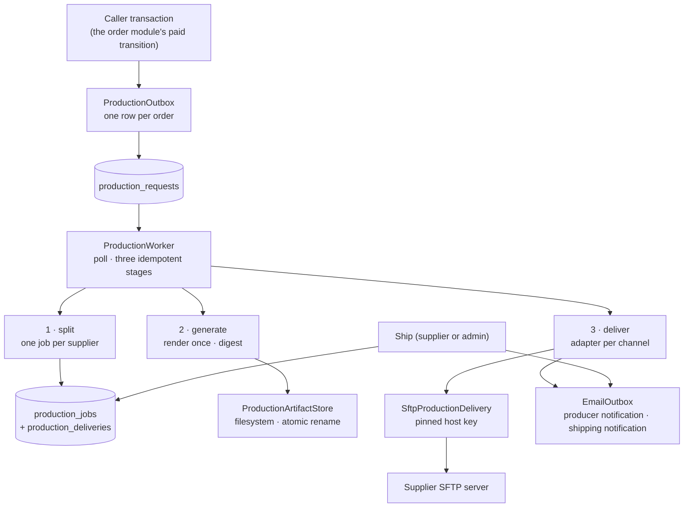
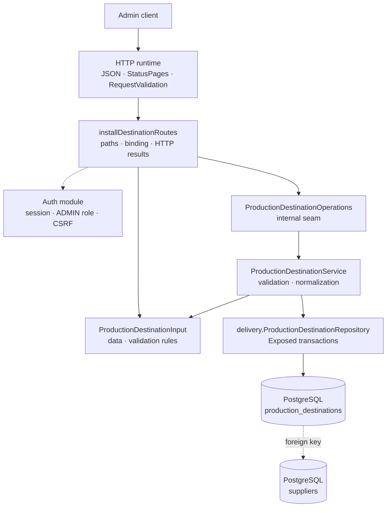

# Backend Production package

This guide explains the Kotlin code in
[`backend/modules/production/src/shop/voenix/production`](../../../backend/modules/production/src/shop/voenix/production).

## What this package does

The Production module turns a paid order into production PDFs and delivers
them to the involved suppliers. Its place in the module graph
(`production -> platform, email, supplier`) is described in
[the module architecture](module-architecture.md); the migration brief and
decision record live in
[`production-migration.md`](../../migration/production-migration.md).

The module owns seven responsibilities:

- **Destination management** — admin CRUD for a supplier's delivery
  accounts. Destinations are database rows, not static configuration:
  changing a supplier's delivery setup is an admin API call, never a
  deployment. See [destination management](#destination-management).
- **On-demand production PDF** — from one order, render one PDF per involved
  supplier: an address page plus one page per physical item. See
  [the production PDF](#the-production-pdf).
- **The durable request and the split worker** — a caller (the order module's
  paid transition, since the Order migration) triggers production with one cheap
  database row; a single background worker later splits it into one job per involved
  supplier plus one delivery per enabled destination — a supplier without an
  enabled destination still gets its job (the fulfillment page is the fallback),
  only the push delivery is skipped. See
  [the durable request and the split worker](#the-durable-request-and-the-split-worker).
- **The immutable artifact** — the worker generates each job's PDF exactly
  once, persists it on the local filesystem, and records only metadata
  (SHA-256 digest, `generated_at`) in the database. Every later delivery and
  retry provably ships the same bytes. See
  [artifact generation](#artifact-generation).
- **SFTP delivery** — the worker pushes every generated artifact to the
  supplier's enabled destinations through a channel-neutral adapter seam. The
  SFTP adapter verifies the pinned host key, uploads to a temporary name, and
  renames to the final `ORD-{orderId}.pdf`; `delivered_at` is set only after
  the server confirmed acceptance. See [delivery](#delivery).
- **The producer notification** — after a successful delivery, an
  informational email to the producer is enqueued through the email module's
  `EmailOutbox`, atomically with `delivered_at`. See
  [producer notification](#producer-notification).
- **Fulfillment** — what a supplier and an admin work with: the job list, the
  item snapshot behind it, the PDF download, the one ship write both of them
  report a shipment through, and the customer's shipping notification that
  joins that write's transaction. See [fulfillment](#fulfillment).

## The five-minute mental model


```mermaid
flowchart TB
    Caller["Caller transaction<br/>(the order module's paid transition)"]
    Outbox["ProductionOutbox<br/>one row per order"]
    Requests[("production_requests")]
    Worker["ProductionWorker<br/>poll · three idempotent stages"]
    Split["1 · split<br/>one job per supplier"]
    Jobs[("production_jobs<br/>+ production_deliveries")]
    Generate["2 · generate<br/>render once · digest"]
    Store["ProductionArtifactStore<br/>filesystem · atomic rename"]
    Deliver["3 · deliver<br/>adapter per channel"]
    Sftp["SftpProductionDelivery<br/>pinned host key"]
    Server["Supplier SFTP server"]
    Email["EmailOutbox<br/>producer notification · shipping notification"]
    Ship["Ship (supplier or admin)"]

    Caller --> Outbox --> Requests --> Worker
    Worker --> Split --> Jobs
    Worker --> Generate --> Store
    Worker --> Deliver --> Sftp --> Server
    Deliver --> Email
    Ship --> Jobs
    Ship --> Email
```

One durable row triggers everything the worker does — the fulfillment half
starts from an HTTP request instead, where a supplier or an admin reports a
shipment and writes the same `production_jobs` row and the same `EmailOutbox`
the worker uses. The worker owns retry state in PostgreSQL, the filesystem
owns the immutable bytes, and only confirmed external acceptance closes a
delivery. Every stage is idempotent and every failure is a bounded, retryable
error code — no raw exception message, credential, or remote path is ever
persisted.

## Where the code lives

Files group declarations that belong together, following
[the source file organization guide](source-file-organization.md): a component
shares its file with the small types it owns — a service with the seam it
implements and the results it returns, a repository with its Exposed table
objects and read models, routes with the request and response types only they
use. So the file to open is the *concern* you are after, not the type name.

The package root holds the module's public contract and the admin destination
surface:

| File | Contents |
| --- | --- |
| [`ProductionModule.kt`](../../../backend/modules/production/src/shop/voenix/production/ProductionModule.kt) | The runtime handle, `createProductionModule`, the public `installProductionModule` and the `installProductionModule(database)` integration-test seam, `validateProductionRequests`, and `ProductionSettings`. |
| [`ProductionData.kt`](../../../backend/modules/production/src/shop/voenix/production/ProductionData.kt) | The production view of one order — `ProductionData` and `ProductionItem` — plus the `ProductionSource` port that resolves it. |
| [`ProductionPdfGenerator.kt`](../../../backend/modules/production/src/shop/voenix/production/ProductionPdfGenerator.kt) | The on-demand PDF capability and everything it answers with: `ProductionPdfResult`, `ProductionPdfDocument`, `ProductionPdfError`. |
| [`ProductionOutbox.kt`](../../../backend/modules/production/src/shop/voenix/production/ProductionOutbox.kt) | The durable production trigger a caller transaction joins. |
| [`ProductionNaming.kt`](../../../backend/modules/production/src/shop/voenix/production/ProductionNaming.kt) | The `ORD-{orderId}` label and file name every layer shares. |
| [`ProductionQueuedEmails.kt`](../../../backend/modules/production/src/shop/voenix/production/ProductionQueuedEmails.kt) | Production's one branch of the application's queued-email source. |
| [`ProductionDestinationService.kt`](../../../backend/modules/production/src/shop/voenix/production/ProductionDestinationService.kt) | Destination validation and normalization, plus the `ProductionDestinationOperations` seam it implements. |
| [`DestinationRoutes.kt`](../../../backend/modules/production/src/shop/voenix/production/DestinationRoutes.kt) | The admin routes with their HTTP types: `ProductionDestinationInput` including its validation rules, and the password-free `ProductionDestination` response. |

The `delivery` sub-package is the background half — durable state, the worker
stages, and the channel adapters:

| File | Contents |
| --- | --- |
| [`ProductionRequestRepository.kt`](../../../backend/modules/production/src/shop/voenix/production/delivery/ProductionRequestRepository.kt) | Request persistence and the transactional split, with the `production_requests` table and `OpenProductionRequest`. |
| [`ProductionJobRepository.kt`](../../../backend/modules/production/src/shop/voenix/production/delivery/ProductionJobRepository.kt) | Generation state and the item snapshot, with the `production_jobs` and `production_job_items` tables and `OpenProductionJob`. |
| [`ProductionDeliveryRepository.kt`](../../../backend/modules/production/src/shop/voenix/production/delivery/ProductionDeliveryRepository.kt) | Delivery state with the `production_deliveries` table, `OpenProductionDelivery`, and the password-carrying `ProductionDeliveryDestination`. |
| [`ProductionDestinationRepository.kt`](../../../backend/modules/production/src/shop/voenix/production/delivery/ProductionDestinationRepository.kt) | Destination persistence with the `production_destinations` table, `StoredProductionDestination`, and the typed write and delete results. |
| [`ProductionWorker.kt`](../../../backend/modules/production/src/shop/voenix/production/delivery/ProductionWorker.kt) | The polling loop and the split stage. |
| [`ProductionArtifactGenerator.kt`](../../../backend/modules/production/src/shop/voenix/production/delivery/ProductionArtifactGenerator.kt) | The generation stage. |
| [`ProductionDeliverer.kt`](../../../backend/modules/production/src/shop/voenix/production/delivery/ProductionDeliverer.kt) | The delivery stage with the `ProductionDeliveryAdapter` seam and the `ProductionDeliveryResult`/`ProductionDeliveryError` vocabulary it speaks. |
| [`ProducerNotificationResolver.kt`](../../../backend/modules/production/src/shop/voenix/production/delivery/ProducerNotificationResolver.kt) | The producer mail resolver and the context values it reads. |
| [`ProductionSourceResolution.kt`](../../../backend/modules/production/src/shop/voenix/production/delivery/ProductionSourceResolution.kt) | `resolveOrder` and the cancellation rethrow every stage shares. |
| [`sftp/SftpProductionDelivery.kt`](../../../backend/modules/production/src/shop/voenix/production/delivery/sftp/SftpProductionDelivery.kt) | The SFTP adapter and its single blocking upload attempt. |

The `pdf` sub-package renders and stores the document:

| File | Contents |
| --- | --- |
| [`ProductionPdfRenderer.kt`](../../../backend/modules/production/src/shop/voenix/production/pdf/ProductionPdfRenderer.kt) | The PDFBox renderer plus what it produces: `ProductionPdf` and `ProductionPdfRenderResult`. |
| [`PdfPageCanvas.kt`](../../../backend/modules/production/src/shop/voenix/production/pdf/PdfPageCanvas.kt) | The physical layout constants and the low-level text drawing. |
| [`ProductionPdfService.kt`](../../../backend/modules/production/src/shop/voenix/production/pdf/ProductionPdfService.kt) | On-demand generation across the involved suppliers. |
| [`ProductionArtifactStore.kt`](../../../backend/modules/production/src/shop/voenix/production/pdf/ProductionArtifactStore.kt) | Filesystem persistence and `ProductionArtifactLoadResult`. |
| [`Sha256.kt`](../../../backend/modules/production/src/shop/voenix/production/pdf/Sha256.kt) | The digest helper the renderer and the store both use. |

The `fulfillment` sub-package is the human half:

| File | Contents |
| --- | --- |
| [`FulfillmentRoutes.kt`](../../../backend/modules/production/src/shop/voenix/production/fulfillment/FulfillmentRoutes.kt) | Both HTTP subtrees plus the `ShipJobInput` body and its validation rules. |
| [`FulfillmentOperations.kt`](../../../backend/modules/production/src/shop/voenix/production/fulfillment/FulfillmentOperations.kt) | The seam the routes call and everything it speaks: `FulfillmentJobStatus`, `Shipment`, the `SupplierIdentityView`/`SupplierJobView`/`AdminJobView`/`FulfillmentItemView` answers, `FulfillmentArtifactResult`, and `ShipResult`. |
| [`FulfillmentService.kt`](../../../backend/modules/production/src/shop/voenix/production/fulfillment/FulfillmentService.kt) | Page assembly with its batching rule, and the one ship path of both surfaces. |
| [`FulfillmentRepository.kt`](../../../backend/modules/production/src/shop/voenix/production/fulfillment/FulfillmentRepository.kt) | The job reads and the guarded ship write, with `StoredFulfillmentJob` and `ShipWriteResult`. |
| [`FulfillmentOrder.kt`](../../../backend/modules/production/src/shop/voenix/production/fulfillment/FulfillmentOrder.kt) | The order header a page shows and the `FulfillmentOrderSource` port it comes through. |
| [`ShippingNotificationResolver.kt`](../../../backend/modules/production/src/shop/voenix/production/fulfillment/ShippingNotificationResolver.kt) | The customer's mail, with the `ShippingNotificationOrderSource` port and its `ShippingNotificationOrder`. |
| [`ShippingCarrier.kt`](../../../backend/modules/production/src/shop/voenix/production/fulfillment/ShippingCarrier.kt) | The bounded carrier list and the tracking links built from it. |
| [`ProductionFulfillment.kt`](../../../backend/modules/production/src/shop/voenix/production/fulfillment/ProductionFulfillment.kt) | `installProductionFulfillment`, this module's second install function. |

## Destination management

Destinations are the SFTP accounts of a supplier to which finished
production PDFs are delivered. An admin can list, create, read, fully
replace, and delete destinations through authenticated routes.

The SFTP password is strictly **write-only**: it can be set and replaced
through the API, but it never appears in any response, log line, or error
message.


```mermaid
flowchart TB
    Client["Admin client"]
    Http["HTTP runtime<br/>JSON · StatusPages · RequestValidation"]
    Auth["Auth module<br/>session · ADMIN role · CSRF"]
    Routes["installDestinationRoutes<br/>paths · binding · HTTP results"]
    Input["ProductionDestinationInput<br/>data · validation rules"]
    Operations["ProductionDestinationOperations<br/>internal seam"]
    Service["ProductionDestinationService<br/>validation · normalization"]
    Repository["delivery.ProductionDestinationRepository<br/>Exposed transactions"]
    Destinations[("PostgreSQL<br/>production_destinations")]
    Suppliers[("PostgreSQL<br/>suppliers")]

    Client --> Http --> Routes
    Routes -.-> Auth
    Routes --> Input
    Routes --> Operations
    Operations --> Service
    Service --> Input
    Service --> Repository
    Repository --> Destinations
    Destinations -.->|"foreign key"| Suppliers
```

The structure mirrors the Supplier package: routes bind HTTP, the service
validates and normalizes, the repository owns Exposed transactions, and every
expected failure is a typed `OperationResult`. Persistence lives in the
`delivery` sub-package because destinations belong to the delivery worker;
the admin-facing types live at the package root.

### Routes

All routes sit under the shared admin protection
(`installAdminRouteProtection`), so authentication, the `ADMIN` role, and CSRF
are enforced before any handler runs:

| Method and path | Success | Purpose |
| --- | --- | --- |
| `GET /api/admin/production/destinations` | `200` | List every destination, ordered by supplier then id |
| `POST /api/admin/production/destinations` | `201` + `Location` | Create a destination |
| `GET /api/admin/production/destinations/{id}` | `200` | Read one destination |
| `PUT /api/admin/production/destinations/{id}` | `200` | Fully replace a destination |
| `DELETE /api/admin/production/destinations/{id}` | `204` | Delete an unreferenced destination |

### The write-only password

The password protection is layered so that no single mistake can leak it:

1. The response model `ProductionDestination` has no password property, so
   serialization cannot include one.
2. `ProductionDestinationRepository` never selects the password column when
   reading. The stored model `StoredProductionDestination` cannot even hold a
   password in memory.
3. `ProductionDestinationInput.toString()` replaces the password with
   `[redacted]`. This matters because Ktor's `RequestValidationException`
   message embeds the offending input's `toString()`.
4. Service log messages contain ids only, never field values.

Replacing a destination keeps the stored password when the request omits the
`password` field (or sends `null` or a blank value). Sending a new value
replaces it. Creating a destination requires a password.

### Validation rules

`ProductionDestinationInput.validate()` implements the field matrix:

- `supplierId`, `channel`, `label`, `host`, `username`,
  `hostKeyFingerprint`, and `timeoutSeconds` are required.
- `channel` currently accepts only `SFTP`. The database enforces the same
  set with a check constraint; new channels are a deliberate schema change.
- `hostKeyFingerprint` is mandatory because every SFTP connection must
  verify the pinned host key — there is no permissive fallback.
- `port` must be between 1 and 65535 and defaults to 22.
- `timeoutSeconds` must be between 1 and 3600.
- `notificationEmail` is optional but must look like an email address.
- `remotePath` defaults to `/`.
- `enabled` defaults to `true`. Disabling a destination
  (`"enabled": false` in a `PUT`) is the operational off-switch: the row and
  its credentials survive, but the delivery worker skips it with the
  retryable code `DESTINATION_DISABLED`.

### Persistence and typed constraint results

The Flyway migration `V6__create_production_destinations.sql` creates the
table in the platform-owned global chain. PostgreSQL enforces the supplier
foreign key, the channel check, and the port/timeout ranges.

Expected constraint failures become typed results through the shared
[`executePostgresWrite`](persistence-error-handling.md) helper — SQL states,
never constraint names:

- An insert or update with an unknown `supplierId` maps to
  `SupplierNotFound`, which the API returns as a `400` with a `supplierId`
  field error.
- A delete blocked by a foreign key maps to `InUse` and a
  `409 Conflict` response. `production_deliveries` references destinations
  with `ON DELETE RESTRICT`, so `enabled = false` is the only way to switch
  off a destination that has delivery history.

The reverse direction is protected too: deleting a Supplier that still owns
destinations returns `409` from the Supplier API (see
[`supplier-package.md`](supplier-package.md)).

## The production PDF

### The public contract

The PDF capability is defined entirely by public types in
`shop.voenix.production` — no PDF-library type ever crosses the module
boundary (a test enforces this):

- `ProductionSource` resolves the immutable order/item/image inputs for one
  order. Since the Order migration of 2026-07-31 the order module implements
  it; module tests still use an in-memory lambda.
- `ProductionData` and `ProductionItem` carry the shipping address, the items
  in explicit source order, each item's supplier, quantity, generated image
  path, and the optional mug-layout overrides in millimetres.
- `ProductionPdfGenerator.generate(orderId)` is the on-demand capability for
  the authorized download. It returns a typed `ProductionPdfResult`:
  `Generated` with one `ProductionPdfDocument` per involved supplier,
  `OrderNotFound`, or `GenerationFailed` with a `ProductionPdfError`.
- Every `ProductionPdfDocument` has the stable producer-facing file name
  `ORD-{orderId}.pdf`, media type `application/pdf`, the raw bytes, and their
  SHA-256 hex digest. The name repeats across suppliers of one order by
  design: a supplier only ever receives its own documents, so the name stays
  unique per destination.

### The document layout

`pdf.ProductionPdfRenderer` recreates the legacy layout with Apache PDFBox:

1. An address page of 239 mm x 99 mm: the shipping address centered, the
   order label `ORD-{orderId}` reading bottom-to-top in a narrow left column.
2. One page per **physical** item: an item with quantity 3 becomes three
   pages. The left column shows `ORD-{orderId} ({index}/{total})` with a
   stable 1-based index **within the supplier's job**. The right column shows
   `article | supplier article number | variant` reading top-to-bottom (the
   supplier number is left out when blank). The generated image sits between
   the columns; a print template confines its width, puts it on the bottom
   margin, and centers it, otherwise it is centered in the full area. Items
   may override the page size via the document-format fields.

Text uses the Liberation Sans font bundled inside the PDFBox jar, which
covers extended Latin plus Cyrillic; the bold address name is approximated
with fill-plus-stroke because no bold face is bundled.

### Typed, retryable failures

A missing production image is **never** a silently blank page — the decision
record makes it a typed, retryable failure. `ProductionPdfError` is the
bounded error vocabulary (and the later job table's safe error codes):
`MISSING_IMAGE`, `UNREADABLE_IMAGE`, `INVALID_SOURCE` (non-positive quantity
or measurement, or an item without a supplier), and `RENDER_FAILURE` (details
go to the log, never into the result).

### How images get into the PDF: ImageIO, not PDFBox's file sniffing

The renderer decodes every image file with `ImageIO.read` and embeds the
resulting raster with `LosslessFactory.createFromImage` — the same path PDFBox
itself uses for PNG.

The obvious alternative, `PDImageXObject.createFromFileByContent`, is
deliberately **not** used: PDFBox 3.0.5 sniffs the file content first and only
routes JPEG, TIFF, BMP, GIF, and PNG onward to ImageIO. A WebP file is a RIFF
container, so it is rejected before ImageIO is ever asked — even with a WebP
reader registered. Since print images are stored as WebP only, that path would
make every production PDF fail. Going through ImageIO consults every registered
reader, and `webp-imageio` is a runtime dependency of this module so its reader
is on the application classpath.

A file that no reader claims (or that fails to decode) still maps to the
retryable `UNREADABLE_IMAGE`. `ProductionPdfWebpSourceTest` proves a WebP
original renders; the analysis and the decision are in
[`cart-migration.md`](../../migration/cart-migration.md) under "WebP
production PDFs".

### Legacy fixture comparison

`ProductionPdfLegacyFixtureTest` compares rendered page images (never raw
bytes) against reference PDFs from the legacy system. Fixtures are dropped
into
[`testResources/legacy-production-pdfs`](../../../backend/modules/production/testResources/legacy-production-pdfs/README.md);
until they are delivered the test skips itself and says so.

## The durable request and the split worker

### Why an outbox

Payment completion has already taken the customer's money, so nothing that
happens on the production side may abort that transaction. The trigger is
therefore the same shape as the email outbox: `ProductionOutbox.request(orderId)`
joins the **caller's** Exposed transaction and inserts one minimal reference
row — no source resolution, no routing, no PDF work. If the caller rolls
back, no request exists. The unique `order_id` makes the call idempotent:
repeated and concurrent calls return the same stable request id (reprints and
complaints become new orders). A non-positive order id fails fast with
`IllegalArgumentException` before touching the database.

### The three tables

Flyway migrations `V7`–`V9` add the durable delivery state to the
platform-owned chain:

- `production_requests` — one row per order (unique `order_id`), with
  `attempt_count`, a bounded `last_error_code`, and a nullable
  `processed_at`. Open/processed state derives from the timestamp; there is
  no in-progress status that could strand.
- `production_jobs` — one row per request and supplier (unique
  `(request_id, supplier_id)`), carrying the producer-facing
  `file_name` (`ORD-{orderId}.pdf`) plus the generation metadata
  (`content_sha256`, `generated_at`, generation attempts and error code). A
  check constraint keeps digest and timestamp together: both are `NULL` while
  the job is open and both are set once the artifact exists — there is no
  half-generated state.
- `production_deliveries` — one row per job and destination (unique
  `(production_job_id, destination_id)`), with `attempt_count`,
  `last_error_code`, and `delivered_at`.

The foreign keys between these tables are all `ON DELETE RESTRICT`. In
particular a destination that is referenced by deliveries can never be
hard-deleted — the admin API maps that to `409 Conflict`, and `enabled = false`
remains the operational off-switch. The database also enforces non-negative
counters and a positive `order_id`.

### What the supplier fulfillment feature added to the schema

`V8` carries four more columns and one more table, prepared by the first
ticket of the supplier fulfillment feature (issue #119) and filled by the
later ones:

- `production_jobs.shipped_at`, `shipped_by_user_id`, `shipping_carrier`, and
  `tracking_number` record one package leaving a supplier. Two check
  constraints keep the record honest: as long as `shipped_at` is `NULL` the
  other three must be `NULL` too, and the carrier must be one of `DHL`, `DPD`,
  `GLS`, `HERMES`, `UPS`, `DEUTSCHE_POST`, `OTHER` — the shop builds tracking
  links from that bounded list itself instead of accepting a URL from a
  caller. Three partial indexes serve the lists: open jobs by
  `(supplier_id, id)`, shipped ones by `(supplier_id, shipped_at DESC, id
  DESC)`, and — for the admin lists, which read across every supplier and so
  cannot use an index whose first column is `supplier_id` — shipped ones by
  `(shipped_at DESC, id DESC)`. The `id` is in there because `shipped_at` is
  not unique: two jobs reported in one transaction share a timestamp, and a
  capped list on a non-total order could drop one row and show another twice.
  The foreign key to `users` is added by `V11`, where the table exists, and is
  `ON DELETE SET NULL`: deleting a login must not delete the shipment.
- `production_job_items` holds the item lines of one job — position, article
  and variant name, optional supplier article number, quantity — snapshotted
  in the same transaction that stores the generated artifact, so a supplier
  page can only ever show what the immutable PDF shows. The rows are parts of
  the job, not records of their own: primary key `(production_job_id,
  position)` and `ON DELETE CASCADE`.

### The worker

`delivery.ProductionWorker` follows the email worker pattern: one instance,
started by `ProductionModule.install`, polling PostgreSQL in a coroutine loop
with one attempt per non-overlapping scan and unbounded attempts. Every scan
runs three idempotent stages: the **split** below, then
[artifact generation](#artifact-generation), then [delivery](#delivery). The
split:

1. Scan open requests (`processed_at IS NULL`) in ascending id order and
   increment the attempt counter.
2. Resolve the order through the `ProductionSource`.
3. Determine the distinct suppliers in first-appearance order.
4. In **one** transaction: read the enabled destinations of every supplier (a
   snapshot — later destination changes affect later orders), create every
   job and every delivery, and mark the request processed. A supplier without
   an enabled destination still gets its job, just without delivery rows: the
   artifact is generated and the supplier fulfillment page shows the order
   and serves the PDF, so a supplier that is not (yet) connected to a push
   channel can work from the page alone. Because the deliveries are a
   snapshot, enabling a destination later does not create deliveries for
   already split requests — it affects later orders only.

Routing problems are retryable background failures, never crashes and never
partial splits. The request stays open with a safe, bounded error code and
recovers on a later scan once an admin fixes the configuration:

| Code | Meaning | Typical recovery |
| --- | --- | --- |
| `SOURCE_NOT_FOUND` | The source knows no such order | Order data arrives |
| `SOURCE_INVALID` | The source rejected the order or returned inconsistent data (wrong order id, no items) | Order data is corrected |
| `SOURCE_UNAVAILABLE` | The source threw unexpectedly | Infrastructure heals |
| `ITEM_WITHOUT_SUPPLIER` | An item's article has no supplier assigned | Admin assigns the supplier |
| `SPLIT_FAILED` | The split transaction failed unexpectedly | Infrastructure heals |

The all-or-nothing rule exists for a manufacturing reason: if jobs were
created for the resolvable suppliers while one item still lacks a supplier, a
later assignment fix could attach that item to a job whose artifact was
already generated — and the item would silently never reach production. A
missing destination is different: the supplier is known, the job's content is
complete, only the push channel is absent — so the job is created and merely
logged as delivery-less.

Every insert in the split ignores duplicates on its unique identity, so a
repeated split heals instead of conflicting. `CancellationException` is
always rethrown — shutdown never records a failure, unfinished work simply
stays open and the next start picks it up.

Because an item may genuinely have no supplier yet,
`ProductionItem.supplierId` is nullable. Production never guesses a route:
the split records `ITEM_WITHOUT_SUPPLIER`, and the on-demand PDF generation
reports `INVALID_SOURCE` for such an order.

## Artifact generation

### Exactly once, then immutable

`delivery.ProductionArtifactGenerator` is the second worker stage. It scans
the open jobs (`generated_at IS NULL`) in ascending id order, increments the
generation attempt counter (one attempt per scan), renders the supplier's PDF
through the shared `ProductionPdfRenderer`, and persists it:

1. The bytes go to the filesystem first: `pdf.ProductionArtifactStore` writes
   a temporary file **in the final directory** and atomically renames it to
   `{artifactRoot}/{jobId}/ORD-{orderId}.pdf`. A partially written PDF is
   never visible under the final path. The job id in the path keeps two
   suppliers' PDFs of the same order apart even though both carry the same
   producer-facing `file_name`.
2. The database commit comes second: `content_sha256`, `generated_at`, and a
   cleared error code — guarded by `generated_at IS NULL`, so the metadata of
   a generated artifact can never be overwritten.

Once `generated_at` is set the job is closed: later scans skip it, and no
change to master data or images ever touches the bytes again. That is the
single-source-of-truth guarantee — every destination and every retry ships
provably identical bytes, and the digest in the database proves it.

### Crash safety

A crash between the file write and the database commit leaves an open job
plus an orphaned file. The next scan simply regenerates and atomically
replaces the file, then commits — idempotent by construction. The recorded
digest therefore always describes the bytes under the final path. (The
regenerated bytes may differ from the orphan when source data changed in
between; that is correct, because the generation never completed.)

### Generation error codes

Failures are retryable background failures with bounded codes in
`last_generation_error_code`; the job stays open and recovers on a later
scan. The source codes are the same as in the split
(`SOURCE_NOT_FOUND`, `SOURCE_INVALID`, `SOURCE_UNAVAILABLE` — shared helper
`resolveOrder`), the render codes are the `ProductionPdfError` names
(`MISSING_IMAGE`, `UNREADABLE_IMAGE`, `INVALID_SOURCE`, `RENDER_FAILURE`),
and a failed filesystem write is `ARTIFACT_WRITE_FAILED`. As everywhere,
`CancellationException` is rethrown and never recorded.

### Digest verification on load

`ProductionArtifactStore.load(jobId, fileName, expectedSha256)` is how the
delivery stage obtains the bytes: it recomputes the SHA-256 and
returns a typed `ProductionArtifactLoadResult` — `Loaded` with the bytes,
`Missing` when no file exists, or `DigestMismatch` when the file no longer
hashes to the recorded digest. Tampered or corrupted artifacts can never
silently reach a supplier.

## Delivery

### The adapter seam and the deliverer

`delivery.ProductionDeliveryAdapter` is the channel-neutral seam to the
true-external world. An adapter names its `channel` (`SFTP` today), receives
the destination, the producer-facing file name, and the immutable artifact
bytes, and answers with a typed `ProductionDeliveryResult`: `Accepted` only
after the remote system confirmed acceptance of the complete file under its
final name, or `Failed` with a bounded `ProductionDeliveryError`. Adding a
channel later (for example real PDF-by-email) means a new adapter plus
destination configuration and a Flyway check-constraint change — the worker
algorithm stays untouched.

`delivery.ProductionDeliverer` is the third worker stage. It builds the
channel registry from the adapter list (a duplicate channel registration is
a wiring bug and rejected at construction) and, per scan, walks the open
deliveries in ascending id order — but only those whose job artifact already
exists, so an attempt counter always counts real delivery attempts. For
every row it increments the attempt counter (one attempt per scan, unbounded
attempts), resolves the destination, loads the artifact with digest
verification, calls the adapter, and records the outcome. `delivered_at` is
set only on `Accepted`; every failure keeps the row open with a bounded
code, and the failure of one destination never blocks a sibling delivery.

The destination read on this path is the only one that includes the
password, because the adapter must authenticate. It lives in
`delivery.ProductionDeliveryRepository` as the process-only model
`ProductionDeliveryDestination`, which is never serialized and redacts the
password in its `toString()`.

### Delivery error codes

Failures are retryable background failures with bounded codes in
`production_deliveries.last_error_code`; the row stays open and recovers on
a later scan. As everywhere, `CancellationException` is rethrown and never
recorded.

| Code | Meaning | Typical recovery |
| --- | --- | --- |
| `DESTINATION_DISABLED` | The destination is switched off | Admin re-enables it |
| `DESTINATION_MISSING` | The destination row is gone (defensive; FK restrict prevents it) | Configuration is repaired |
| `UNSUPPORTED_CHANNEL` | No adapter is registered for the destination's channel | Wiring is fixed |
| `ARTIFACT_MISSING` | The artifact file disappeared from disk | File is restored |
| `ARTIFACT_DIGEST_MISMATCH` | The file no longer hashes to the recorded digest | File is restored |
| `CONNECTION_FAILED` | Resolution, TCP connect, or connect timeout failed | Network/server heals |
| `HOST_KEY_REJECTED` | The server key did not match the pinned fingerprint | Admin verifies and updates the fingerprint |
| `AUTH_FAILED` | The server rejected the credentials, or authentication never completed | Admin fixes the credentials |
| `TRANSFER_FAILED` | The upload or rename failed after authentication | Remote path/permissions are fixed |
| `DELIVERY_FAILED` | The adapter threw unexpectedly | Infrastructure heals |

No raw exception message, credential, or remote path is ever persisted: the
adapter returns enum values, and the deliverer writes only their names.
Details go to the server log.

### The SFTP adapter

`delivery.sftp.SftpProductionDelivery` implements the `SFTP` channel with
Apache MINA SSHD:

1. **Pinned host key, always.** The client's `ServerKeyVerifier` computes
   the SHA-256 fingerprint of the presented server key and compares it with
   the destination's `hostKeyFingerprint` (with or without the `SHA256:`
   prefix; a blank or foreign-algorithm value never matches). A mismatch
   closes the connection before any credential is sent — there is no
   permissive fallback, no known-hosts file, and no `~/.ssh/config`
   influence (`HostConfigEntryResolver.EMPTY`).
2. **Password authentication only** (`UserAuthPasswordFactory`), with the
   destination's stored password.
3. **Temporary upload plus rename.** The bytes go to
   `{remotePath}/{fileName}.part` (overwriting a stale temp file from an
   earlier crashed attempt), an existing final file from an earlier
   at-least-once delivery is removed, then the temp file is renamed to the
   final `ORD-{orderId}.pdf`. A hotfolder consumer never sees a partial
   file under the final name.
4. **The destination timeout bounds everything**: connect, authentication,
   and session idle time.

Failures map to the bounded vocabulary by the stage reached — connect
problems become `CONNECTION_FAILED`, authentication problems (including a
server that never completes the handshake) `AUTH_FAILED`, and everything
after authentication `TRANSFER_FAILED`; a rejected host key always wins as
`HOST_KEY_REJECTED`. Cancellation interrupts the blocking transfer and
propagates.

External delivery remains **at least once**: the process can lose power
after the server accepted the file but before PostgreSQL recorded success.
The stable final name makes the retry overwrite the same file, but a
producer hotfolder may have consumed it in between.

## Producer notification

Email is not a delivery channel — after a successful delivery, the producer
merely gets an informational email without attachment, and only when the
destination configures a notification address. Exactly one module owns the
retries of one external send: Production for the file transfer
(`production_deliveries`), Email for the notification mail (`email_jobs`).
There is never a second state machine for the same delivery.

### Atomic enqueue with `delivered_at`

`ProductionDeliveryRepository.completeDelivery` runs one transaction that
sets `delivered_at` and — iff the destination has a `notification_email` at
that moment — enqueues `QueuedEmailReference.ProducerPdfNotification(deliveryId)`
through the public `EmailOutbox`, which joins the caller transaction.
"Delivered + notification enqueued" is therefore one commit: if the enqueue
fails, `delivered_at` rolls back and the delivery stays open for a later
scan (the external upload is at least once anyway, and the overwrite under
the stable final name is harmless). The update guards on
`delivered_at IS NULL`, so at most one enqueue can ever happen per delivery;
the email module's unique reference constraint deduplicates on top of that.

### The resolver

`delivery.ProducerNotificationResolver` is one half of Production's
`QueuedEmailSource` branch, exposed together with the shipping resolver as
`ProductionModule.queuedEmails`. Per send attempt
it freshly resolves the delivery into current values: recipient and optional
producer name from the destination's notification configuration, the
destination label, the delivered file name, and — through `ProductionSource`
— the order date plus the supplier's physical item count (quantities of the
job supplier's items summed, exactly what the delivered PDF contains).
`null` (unknown delivery, destination gone, address cleared, unknown order)
is the email worker's retryable `SOURCE_NOT_FOUND`; a reference of a foreign
kind is a wiring bug and rejected with `IllegalArgumentException`.

### Composition wiring

`installEmailModule` needs a `QueuedEmailSource` at installation while
Production needs the returned `EmailOutbox` — a wiring-order concern only,
absorbed by the app-owned late-bound aggregate
[`AggregatedQueuedEmailSource`](../../../backend/app/src/shop/voenix/EmailRuntime.kt):
the application installs the email module with the aggregate, creates the
Production module with the email outbox, and then binds
`ProductionModule.queuedEmails` via `bindProductionEmails`.
Resolving before binding throws `IllegalStateException`, which the email
worker records as the retryable `SOURCE_UNAVAILABLE`. Compile-time
dependencies stay acyclic: `production -> email -> platform`.
`Application.kt` performs exactly this wiring, and the app-level
`EmailRuntimeCompositionIntegrationTest` proves it end to end: an enqueued
producer notification is resolved through the bound resolver and delivered by
the email worker against real PostgreSQL.

## Fulfillment

Everything so far happens without a human. Fulfillment is the part someone
looks at: a supplier signs in, sees the packages it has to build, prints the
document for each of them, and reports what it shipped — which is what tells
the customer their package is on its way.
The code lives in the sub-package
[`fulfillment`](../../../backend/modules/production/src/shop/voenix/production/fulfillment).

### The item snapshot

A supplier's screen must show exactly what its PDF contains, and a PDF is
immutable from the moment it exists. Reading today's master data would break
that: an article renamed or reassigned to another supplier last week would
change what a document from last month appears to contain.

So the lines are stored with the document. In the **same transaction** that
records `content_sha256` and `generated_at`,
`ProductionJobRepository.completeGeneration` inserts one
`production_job_items` row per rendered line — article name, variant name,
supplier article number (a blank one becomes `NULL`, because the PDF prints
nothing for it either), quantity, and the 1-based `position` of the line
inside the supplier's share of the order. A `position` is not a page number:
the renderer prints one page per physical unit, so a line with quantity 2
spans two printed pages. The rows come from the very list the renderer used:
`ProductionPdfRenderResult.Rendered` carries its supplier-filtered `items`
along with the bytes, so nobody has to filter the order a second time and
hope the two filters agree.

Two properties follow from the single transaction, and both are tested:

- **Exactly once.** The metadata update is guarded by `generated_at IS NULL`.
  Only the attempt that actually closes the job inserts the rows, so however
  often the worker scans, the snapshot is written once.
- **Crash-safe.** A crash before the commit rolls the digest and the lines
  back together. The next scan re-renders and re-inserts them as one — the
  rows always describe the bytes the digest names.

### What a supplier may see

Data minimization here is structural, not a filter someone has to remember.
The item lines come from the snapshot above, and the order header comes
through a port that cannot carry anything else:

```kotlin
public fun interface FulfillmentOrderSource {
    public suspend fun find(orderIds: Set<Long>): Map<Long, FulfillmentOrder>
}
```

`FulfillmentOrder` has exactly nine fields: order id, the Berlin order date,
the recipient's first and last name, and the five shipping-address fields.
No e-mail address, no phone number, no prices, no billing address, no access
token, no items. Production declares the port, the order module implements it
with one batched read and exports it as `OrderModule.fulfillmentOrders`. Set
in, map out, unknown ids absent — the same shape as `SupplierReader.find`.

Because the type carries nothing else, no route can leak anything else. A pin
test asserts that the words `email`, `phone`, `price`, `total`, and
`accessToken` never appear in a supplier answer.

### The endpoints

All of them answer with `Cache-Control: no-store`: a job answer names a
customer and their address, and a shared cache holding it would hand one
supplier another one's page.

| Method and path | Who | Answers |
| --- | --- | --- |
| `GET /api/supplier/me` | supplier | `{ supplierId, supplierName }` |
| `GET /api/supplier/production-jobs?status=OPEN\|SHIPPED` | supplier | a bare array of `SupplierJobView` |
| `GET /api/supplier/production-jobs/{jobId}/pdf` | supplier | the stored PDF as `attachment; filename="ORD-{orderId}.pdf"` |
| `GET /api/admin/production/jobs?status=&supplierId=` | admin | a bare array of `AdminJobView` |
| `GET /api/admin/production/jobs/{jobId}/pdf` | admin | the same download, for every supplier's job |
| `POST /api/supplier/production-jobs/{jobId}/ship` | supplier | the updated `SupplierJobView` |
| `POST /api/admin/production/jobs/{jobId}/ship` | admin | the updated `AdminJobView`, for every supplier's job |

`status` defaults to `OPEN`; an unknown name is a `400` with the code
`INVALID_STATUS`, an unusable `supplierId` a `400` with `INVALID_SUPPLIER_ID`.
Open jobs are ordered by id (FIFO — a supplier works its queue front to
back), shipped jobs by `shipped_at DESC, id DESC` and **capped at the 100 most
recent**: the shipped tab is a recent-history view, and paging is deferred
until someone needs the older rows. The id is part of that order because
`shipped_at` is not unique — without a tie-breaker a capped list could cut
between two jobs of the same second and drop one while repeating another.

The open list carries **no cap on purpose**. It is the work still to be done,
and a job that is not shown is a job nobody repairs: a silent limit would hide
the oldest, most stuck jobs behind the newest ones and look like an empty
queue. Should the open backlog ever make the page slow, the answer is paging
or a filter with a sensible default — never a cap the caller cannot see.

The supplier's scope is never a query parameter. It comes from
`installSupplierRouteProtection`, which resolves `users.supplier_id` on every
request, and the operations take it as an argument they cannot be called
without. A job id that belongs to another supplier is answered exactly like
one that never existed — `404`, same body — and so is an id that is not a
number at all.

### Reporting a shipment

The one write of this surface. Both endpoints take the same optional body and
reach the same service path — `ship(jobId, actorUserId, supplierScope)` — with
the supplier passing its own id as the scope and the admin passing `null`:

```json
{ "carrier": "DHL", "trackingNumber": "00340434161094042557" }
```

Both fields are optional and independent, blank counts as absent, and a
tracking number is at most 128 characters without control characters. The
carrier must be one of the seven names of `ShippingCarrier` — `DHL`, `DPD`,
`GLS`, `HERMES`, `UPS`, `DEUTSCHE_POST`, `OTHER` — which is the same list the
database CHECK holds. There is deliberately **no** `trackingUrl` field: the
notification mail leaves under the shop's name, so the shop builds the link
from its own per-carrier template, and `OTHER` simply shows the number as text
(decision J2 of issue #119). Accepting a URL would hand anybody with a supplier
login a phishing link in a mail the customer trusts.

Everything the write decides happens in one guarded statement:

```sql
UPDATE production_jobs
SET shipped_at = now(), shipped_by_user_id = ?, shipping_carrier = ?, tracking_number = ?
WHERE id = ? AND shipped_at IS NULL AND generated_at IS NOT NULL [AND supplier_id = ?]
```

If it touches one row, `QueuedEmailReference.ShippingNotification(jobId)` is
enqueued through the public `EmailOutbox` **in the same transaction** — the
`completeDelivery` pattern again: shipped and notified are one commit, and a
failing enqueue rolls the shipment back. If it touches none, the row is read
back inside the same transaction to say why, which is the whole error matrix:

| Situation | Answer |
| --- | --- |
| unknown job, or a job of another supplier | `404`, the same body as an unknown id |
| already shipped (a second click, or a race) | `409`, code `ALREADY_SHIPPED` |
| no generated artifact yet | `409`, code `NOT_READY` |

The `generated_at IS NOT NULL` guard is decision J1 of issue #119: a supplier
ships what the PDF describes, so there is nothing to have packed before the
document exists. Two concurrent ships of one job therefore end as one `200`,
one `409`, and exactly one queued mail — the unique `(kind, source_id)` rule of
the email module deduplicates on top of the guard.

`shipped_by_user_id` records the acting user: the supplier login, or the
administrator who shipped on a supplier's behalf. The foreign key is
`ON DELETE SET NULL`, so deleting a login never deletes the shipment.

### Undoing a shipment

There is no un-ship endpoint, and that is deliberate: the mail is the point of
no return, not the row. Once the shipment commits, a customer notification is
queued, and the e-mail worker picks it up on its next scan — five minutes by
default.

So the only real undo is operational and time-boxed: delete the **open**
`email_jobs` row (`email_kind = 'SHIPPING_NOTIFICATION'`, `source_id` = the job
id, `sent_at IS NULL`) before that scan, then clear the four shipping columns
of the job by hand. After the mail went out, the customer has been told, and
the honest repair is to write to them — not to change the row behind it.

### The customer's shipping mail

`fulfillment.ShippingNotificationResolver` is production's second
`QueuedEmailSource` branch. Per attempt it combines two sides:

- production's own rows — the shipped job, its `production_job_items` snapshot,
  the carrier and the tracking number, plus the tracking URL derived from
  `ShippingCarrier`;
- the order module's answer to the port production declares for it:

```kotlin
public fun interface ShippingNotificationOrderSource {
    public suspend fun load(orderId: Long): ShippingNotificationOrder?
}
```

`ShippingNotificationOrder` carries three fields: the recipient's e-mail
address, their first name, and the ready-built `EmailActionUrl` of the
permanent order page. The access token itself never crosses the boundary — the
order module builds the link and hands over the result. `null` anywhere
(unknown job, job not shipped, no snapshot, unknown order) is the email
worker's retryable `SOURCE_NOT_FOUND`; a reference of a foreign kind is a
wiring bug and rejected with `IllegalArgumentException`.

The German template lives next to the others in the email module
(`ShippingNotificationEmailTemplate.kt`). It is supplier-neutral — the customer
ordered from the shop and never learns which workshop packed the box — it says
that *one package* is on its way and that further packages get their own mail,
never that the order is complete, and it lists the shipped article, variant,
and quantity **without any price**.

### Visibility and the three PDF conflicts

A job appears in both lists **from the split on**, not from the generation
on. An un-generated job is listed with `pdfAvailable: false` and an empty
item list; the admin view additionally carries `generationAttemptCount` and
`lastGenerationErrorCode`, so a job stuck on `MISSING_IMAGE` is diagnosable
instead of invisible. That is the whole reason to list it: a job nobody can
see is a job nobody repairs.

The download loads through `ProductionArtifactStore.load(jobId, fileName,
sha256)`, so it verifies the digest before it serves a single byte. Its three
non-success outcomes become `409`s with their own stable codes:

| Situation | Code |
| --- | --- |
| the job exists, its artifact does not yet | `ARTIFACT_NOT_GENERATED` |
| the digest says there is an artifact, the file is gone | `ARTIFACT_MISSING` |
| the file exists but is not the generated one | `ARTIFACT_DIGEST_MISMATCH` |

None of the three is a server bug and none is the caller's fault, which is
why none of them is a `500`.

### Batching

A list page reads its jobs once, then resolves *all* of their order ids with
one `FulfillmentOrderSource` call and *all* of their item lines with one
repository query. The admin list additionally resolves *all* of their
supplier ids with one `SupplierReader.find` — the only reason this module
depends on the supplier module. No loop in `FulfillmentService` calls out,
and the integration test counts the calls to keep it that way.

## Module wiring

`ProductionModule` is the runtime handle; it exposes the public
`pdfGenerator`, `outbox`, and `queuedEmails`, and `install` starts
the single background worker (a second `install` fails, and
`ApplicationStopped` cancels the worker job). The application installs the
full module with the public `installProductionModule(database, settings,
emailOutbox, source)` in
[`Application.kt`](../../../backend/app/src/shop/voenix/Application.kt) and
registers `validateProductionRequests()` inside `RequestValidation`, exactly
like the other modules. `ProductionSettings` carries the artifact root — the
production-owned private directory for generated PDFs, configured as
`production.artifactRoot` (`PRODUCTION_ARTIFACT_ROOT`, default
`./data/production/artifacts`) — and the email outbox is the `EmailOutbox` of
the installed email module. The `ProductionSource` is the order
module's, and because the order module is installed *after* production — it
consumes this module's outbox and PDF generator — the application passes the
app-owned `LateBoundProductionSource` and binds the real implementation two
lines later. An unbound load fails with `IllegalStateException`, which the
worker stages record as the retryable `SOURCE_UNAVAILABLE`, so a job picked up
during those startup milliseconds is retried rather than lost. Standalone tests assemble a full module with
`createProductionModule(database, artifactRoot, emailOutbox,
productionSource)`. The factory registers the real SFTP adapter by default;
tests may pass their own adapter list through the `deliveryAdapters`
parameter.

`queuedEmails` is **one** source for both of this module's mail kinds. The
application aggregate has one branch per owning module, not one per kind:
production knows which of its own resolvers a reference belongs to, and the
composition root should not have to. Its producer half is ready when the module
is created; its shipping half is bound later, from inside the module, by the
fulfillment install below. Resolving before that binding throws
`IllegalStateException`, which the worker records as the retryable
`SOURCE_UNAVAILABLE`.

The fulfillment surface has its **own** public install function,
`installProductionFulfillment(production, database, settings, orders,
shippingOrders, suppliers, accounts, emailOutbox)`. It is a second install of
the same module rather than part of `installProductionModule`, because it
consumes what the worker cannot wait for: the order module's
`fulfillmentOrders` and `shippingNotificationOrders`, the catalog's
`SupplierReader`, and the account module's `SupplierAccounts`. `Application.kt`
therefore calls it right after the order module is installed and its ports are
bound — with the same database, the same `ProductionSettings`, and the same
`EmailOutbox`, so the download reads the artifacts the worker wrote and the
shipment shares its commit with the mail. It is also where the module's own
shipping-mail branch is bound, on the `ProductionModule` handed to it.
Splitting the install is what keeps the composition a single pass without a
third late-bound port.

## Tests and verification

- `ProductionPdfRendererTest` proves the physical layout: PDF magic bytes,
  page count per quantity, millimetre page sizes and overrides, rotated text
  directions, image placement (rendered to pixels), and the stable file
  name/digest.
- `ProductionPdfGeneratorTest` drives the public capability with an in-memory
  source: not-found results, multi-supplier separation with per-job
  numbering, every typed failure, and Unicode round-trips.
- `ProductionPublicApiTest` guards that no PDF-library type leaks into the
  public API.
- `ProductionPdfWebpSourceTest` pins the WebP path described above: the reader
  is registered, ImageIO reads the file, and a WebP original renders into the
  PDF. The reader comes from `webp-imageio`, which `module.yaml` declares as a
  `runtime-only` production dependency — the test therefore proves the real
  application classpath, not a test-only arrangement.
- `ProductionPdfLegacyFixtureTest` holds the rendered-image comparison
  harness for legacy reference PDFs (skips itself until fixtures exist).
- `ProductionDestinationInputValidationTest` covers the field-rule matrix and
  the redacted `toString`.
- `ProductionDestinationRouteSecurityAndValidationTest` covers route-subtree
  protection, CSRF ordering, id binding, validation-before-operation, HTTP
  result mapping, and that validation errors never echo the password.
- `ProductionDestinationAdminCrudIntegrationTest` runs the authenticated CRUD
  workflow through real Ktor routes and Testcontainers PostgreSQL, including
  the Flyway migration on an empty database, applied defaults, the write-only
  password (checked directly against the database column), the typed
  unknown-supplier result, disabling, and deletion.
- `SupplierServiceIntegrationTest` proves the supplier-side delete conflict.
- `FulfillmentShipIntegrationTest` drives the ship write over real Ktor routes
  against Testcontainers PostgreSQL: the whole state matrix (`200`, both
  `409`s, `404`), the admin ship-on-behalf and its recorded actor, that a
  failing enqueue rolls the shipment back, and that two concurrent ships end as
  one shipment, one conflict, and one queued mail.
- `ShippingNotificationResolverIntegrationTest` covers the customer mail's two
  sides: the snapshot and the derived tracking link, the number-as-text case of
  `OTHER`, every retryable `null`, and the foreign reference kind.
- `ShippingCarrierTest` pins the bounded carrier list against the database
  CHECK and the shape of the links built from it;
  `ShipJobInputValidationTest` covers the body rules.
- `ProductionQueuedEmailsTest` proves the combined queued-email source: each
  kind reaches its own resolver, an unbound shipping branch is retryable, and
  an order confirmation is refused.
- `ProductionOutboxIntegrationTest` proves the outbox contract against
  Testcontainers PostgreSQL: one minimal row per order, commit/rollback with
  the caller transaction, identical ids for repeated and concurrent calls,
  and the fail-fast on non-positive order ids.
- `ProductionSchemaIntegrationTest` proves the `V7`–`V9` identities, counter
  checks, and that referenced destinations, suppliers, and requests cannot be
  hard-deleted.
- `ProductionWorkerIntegrationTest` proves the split: multi-supplier
  partitioning with enabled-destination fan-out, idempotent re-scans, the
  safe error codes with their recovery paths, rethrown cancellation, and the
  polling cadence.
- `ProductionJobItemSnapshotIntegrationTest` proves the item snapshot: each
  job stores its own supplier's lines and no other's, a failed attempt stores
  nothing, the healed attempt stores them exactly once, later scans insert no
  duplicates, and a supplier reassignment plus an article rename never move a
  generated snapshot.
- `FulfillmentRouteSecurityAndValidationTest` proves the route order for both
  subtrees: anonymous and wrongly-roled callers are refused before any id is
  bound or any read happens, an admin is not a supplier and a supplier is not
  an admin, a status a caller invents is a `400`, an unusable job id is the
  same `404` as an unknown one, and the three artifact states map onto their
  conflict codes.
- `FulfillmentIntegrationTest` runs both lists and both downloads through real
  Ktor routes and Testcontainers PostgreSQL: own versus foreign jobs, the
  un-generated job that is still listed, the data-minimization pin, the admin
  list across suppliers with its filter, the digest-verified download, and one
  batched order-header and supplier-name call per page.
- `ProductionArtifactStoreTest` proves the filesystem contract: the
  job-scoped path, no leftover temp files, atomic replacement, digest
  verification on load (including hex case, missing files, and tampered
  bytes), and rejected path traversal.
- `ProductionArtifactGenerationIntegrationTest` proves the generation stage:
  the artifact exists exactly once with matching digest metadata and later
  scans skip the closed job, changed master data and images never change the
  bytes, safe error codes with attempt counting and recovery, and the
  idempotent healing of a crash between file write and database commit.
- `ProductionDeliveryIntegrationTest` proves the delivery stage against
  Testcontainers PostgreSQL: stable id order with one attempt per scan and
  closed rows skipped, independent sibling failures with unbounded retries,
  the disabled-destination recovery, waiting for the artifact, the safe
  artifact/adapter/channel codes (never a raw message), rejected duplicate
  adapter registration, rethrown cancellation, and one end-to-end run in
  which the worker delivers a generated artifact to an embedded SFTP server
  with digest-equal remote bytes. It also proves the notification contract:
  a configured address enqueues exactly one email job in the commit that
  sets `delivered_at` (no re-enqueue on later scans, nothing for addressless
  destinations), and a failing enqueue rolls `delivered_at` back and
  recovers.
- `ProducerNotificationResolverIntegrationTest` proves the resolver:
  recipient, destination label, order date, and the supplier's summed item
  count from a delivered job; `null` for unknown deliveries, cleared
  addresses (with recovery after reconfiguration), and unknown orders; and
  the rejected foreign reference kind.
- `AggregatedQueuedEmailSourceTest` (app) proves the late-bound composition:
  producer references delegate to the bound production resolver, resolving
  before binding fails retryably, and a second binding is rejected.
- `SftpProductionDeliveryTest` proves the adapter against an embedded
  Apache MINA SSHD server: exact remote path and final name without leftover
  temp files, overwrite of stale temp and earlier final files, rejected
  wrong/blank/foreign-algorithm fingerprints before any credential is sent,
  wrong-password classification, quick bounded failures for closed ports and
  silent servers (destination timeout), and interruptible cancellation.
- `ProductionModuleLifecycleTest` proves that `install` starts exactly one
  worker (a second install fails) and that the running worker processes a
  durable request end to end.

Shared fixtures live next to the tests: `ProductionPdfTestSupport` for the
renderer/generator tests and `ProductionDeliveryTestSupport` for the delivery
integration tests (SQL helpers, table resets, destination inserts, and the
sample order builders).

Run the final backend gate from [`backend/`](../../../backend):

```sh
./kotlin do ktfmt
./kotlin check
```
