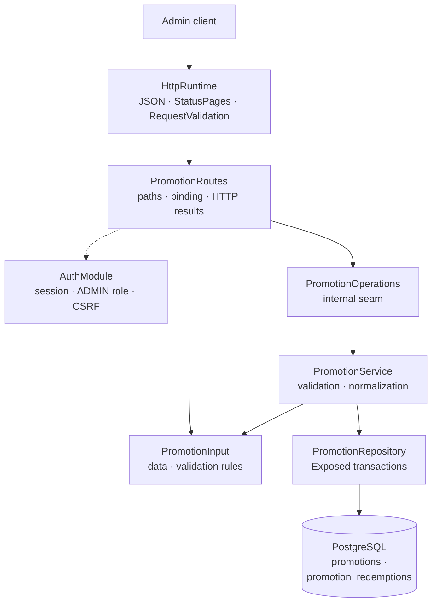

# Backend Promotion package

This guide explains the Kotlin code in
[`backend/modules/promotion/src/shop/voenix/promotion`](../../../backend/modules/promotion/src/shop/voenix/promotion).

## What this package does

The Promotion package provides authenticated admin endpoints for listing,
reading, and creating promotions: coupon codes with a percentage or
fixed-amount discount, an optional activity window, and optional usage
limits. Coupon codes are unique regardless of letter case, and PostgreSQL
enforces that invariant.

The module is being migrated in slices (see
[`promotion-migration.md`](../../migration/promotion-migration.md)). Update,
delete, and the exported `PromotionCodes` capability (`validate` and atomic
`redeem` for the future Cart/Order/Checkout modules) arrive with the
follow-up issues of the migration epic.

## The five-minute mental model



The important ownership rules are:

1. [`Application.kt`](../../../backend/app/src/shop/voenix/Application.kt)
   installs shared JSON, `StatusPages`, `RequestValidation` (including
   `validatePromotionRequests()`), authentication, and the product modules
   once.
2. `PromotionRoutes` installs the auth-owned `AdminRouteProtection` around the
   complete route subtree. Authentication, the `ADMIN` role, and CSRF are
   checked before a handler parses an ID or request body.
3. `PromotionInput.validate()` is the single implementation of the field-rule
   matrix. Ktor's `RequestValidation` calls it at the HTTP boundary, and
   `PromotionService` calls the same method defensively for direct callers.
4. `PromotionService` normalizes valid data (trimming) and turns expected
   outcomes into `OperationResult` values rather than exceptions.
5. `PromotionRepository` owns Exposed queries, transaction boundaries, and the
   derived `coupon_code_normalized` column (the uppercased code that carries
   the unique constraint).

## Production file map

```text
promotion/
|- Discount.kt
|- Promotion.kt
|- PromotionInput.kt
|- PromotionModule.kt
|- PromotionOperations.kt
|- PromotionRedemptions.kt
|- PromotionRepository.kt
|- PromotionRoutes.kt
|- PromotionService.kt
|- PromotionWriteResult.kt
`- Promotions.kt
```

- `Promotion` is the single admin representation for list, detail, and create
  responses, including the computed `redemptionCount` and `isLocked`.
- `Discount` is a public sealed interface (`Percentage` / `FixedAmount`). On
  the wire it serializes as `discountType` (`PERCENTAGE`/`FIXED_AMOUNT`) plus
  `discountValue`.
- `PromotionInput` is the internal model shared by create and the upcoming
  full replacement; it owns the field rules through `validate()`.
- `PromotionOperations` is the internal seam used by the routes and stubbed in
  route tests.
- `PromotionWriteResult` keeps persistence outcomes (`Stored`, `CodeConflict`)
  internal to the repository and service.
- `Promotions` and `PromotionRedemptions` map the PostgreSQL tables for
  Exposed.

## HTTP API

Every route requires an authenticated user with the exact `ADMIN` role.
Mutating methods also require the shared `X-XSRF-TOKEN` header.

| Method and path | CSRF | Success response |
| --- | --- | --- |
| `GET /api/admin/promotions` | No | `200` with a JSON array of `Promotion` values ordered by name, then id |
| `POST /api/admin/promotions` | Yes | `201` with `Promotion` and `Location` |
| `GET /api/admin/promotions/{id}` | No | `200` with `Promotion` |

The create response uses a relative location such as
`/api/admin/promotions/42`. Invalid IDs return `400 Invalid promotion id`
after security checks and before a promotion operation is called. A coupon
code that differs only in letter case from an existing one returns
`409 Coupon code is already in use`.

## Validation and normalization

`PromotionInput.validate()` implements the field rules and returns lower
camel case field names for the shared `ApiError.errors` map.

| Field | Rule |
| --- | --- |
| `name` | Required after trimming; at most 255 characters |
| `couponCode` | Required after trimming; at most 64 characters |
| `discountType` | Required; `PERCENTAGE` or `FIXED_AMOUNT` |
| `discountValue` | Required; positive. Percentage: at most 100 with at most two decimal places. Fixed amount: whole cents, at most 9999999999 (the `numeric(12,2)` column capacity) |
| `startsAt`, `endsAt` | Optional ISO-8601 timestamps; `startsAt` must not be after `endsAt` |
| `usageLimitTotal`, `usageLimitPerUser` | Optional; positive when set |

After validation the service trims `name` and `couponCode`. The repository
derives `coupon_code_normalized` by uppercasing the trimmed code and converts
the timestamps to UTC, so `2026-06-01T00:00:00+02:00` is stored and returned
as `2026-05-31T22:00:00Z`.

The HTTP boundary rejects invalid input before `PromotionOperations` is
called. The service calls the same pure input method for direct callers, so
bypassing Ktor cannot send invalid or non-normalized values to persistence.

## Persistence and concurrency

Flyway migration
[`V12__create_promotions.sql`](../../../backend/modules/platform/resources/db/migration/V12__create_promotions.sql)
creates both tables with check constraints for the discount and the usage
limits, the unique constraint `ux_promotions_coupon_code_normalized`, and the
redemption foreign key with `ON DELETE RESTRICT`.

PostgreSQL is the concurrency-safe authority for code uniqueness: create does
not run a preliminary existence query. When two requests race with the same
(or a case-variant) code, exactly one insert succeeds; the other fails with
SQL state `23505`, which `executePostgresWrite` maps to
`PromotionWriteResult.CodeConflict` and the route maps to `409`. Constraint
names and provider messages are never inspected or exposed (see
[`persistence-error-handling.md`](persistence-error-handling.md)).

Unexpected database failures are logged internally and become the generic
`500 Internal server error` API response. Coroutine cancellation is always
rethrown.

## Tests and verification

- `PromotionInputValidationTest` covers the complete field-rule matrix once.
- `PromotionRouteSecurityAndValidationTest` covers route-subtree protection,
  CSRF ordering, binding, validation-before-operation, `201` + `Location`,
  and HTTP result mapping against stubbed operations.
- `PromotionAdminCrudIntegrationTest` runs the authenticated and
  CSRF-protected flows through real Ktor routes and PostgreSQL: list
  ordering and redemption counts, create with trimming and code
  normalization, the case-insensitive duplicate conflict, two concurrent
  creates, and defensive service validation.
- `PromotionSchemaIntegrationTest` proves the Flyway schema: constraints,
  the restricting foreign key, the case-insensitive unique index, and the
  check constraints.

Run the final backend gate from [`backend/`](../../../backend):

```sh
./kotlin do ktfmt
./kotlin check
```
