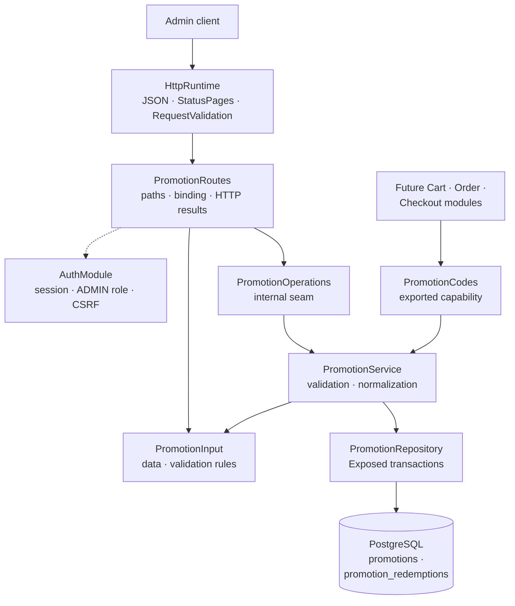

# Backend Promotion package

This guide explains the Kotlin code in
[`backend/modules/promotion/src/shop/voenix/promotion`](../../../backend/modules/promotion/src/shop/voenix/promotion).

## What this package does

The Promotion package provides the authenticated admin lifecycle of
promotions: coupon codes with a percentage or fixed-amount discount, an
optional activity window, and optional usage limits. Coupon codes are unique
regardless of letter case, and PostgreSQL enforces that invariant.

A promotion that has been redeemed at least once is *locked*: its
configuration can no longer be changed and it can no longer be deleted, so
that recorded redemptions keep referring to the terms customers actually used.
An administrator may still activate or deactivate a locked promotion.

Next to the admin surface the package exports the `PromotionCodes`
capability: `validate` answers what a customer-entered code is worth right
now, and `redeem` records a redemption atomically. The capability has no HTTP
surface of its own; the future Cart, Order, and Checkout modules consume it
so that the coupon rules exist exactly once in the system.

## The five-minute mental model


```mermaid
flowchart TB
    Client["Admin client"]
    Http["HttpRuntime<br/>JSON · StatusPages · RequestValidation"]
    Auth["AuthModule<br/>session · ADMIN role · CSRF"]
    Routes["PromotionRoutes<br/>paths · binding · HTTP results"]
    Input["PromotionInput<br/>data · validation rules"]
    Operations["PromotionOperations<br/>internal seam"]
    Codes["PromotionCodes<br/>exported capability"]
    Consumer["Future Cart · Order ·<br/>Checkout modules"]
    Service["PromotionService<br/>validation · normalization"]
    Repository["PromotionRepository<br/>Exposed transactions"]
    Promotions[("PostgreSQL<br/>promotions ·<br/>promotion_redemptions")]

    Client --> Http --> Routes
    Routes -.-> Auth
    Routes --> Input
    Routes --> Operations
    Consumer --> Codes
    Operations --> Service
    Codes --> Service
    Service --> Input
    Service --> Repository
    Repository --> Promotions
```

The important ownership rules are:

1. [`Application.kt`](../../../backend/app/src/shop/voenix/Application.kt)
   installs shared JSON, `StatusPages`, `RequestValidation` (including
   `validatePromotionRequests()`), authentication, and the product modules
   once.
2. `PromotionRoutes` installs the auth-owned `AdminRouteProtection` around the
   complete route subtree. Authentication, the `ADMIN` role, and CSRF are
   checked before a handler parses an ID or request body.
3. `PromotionInput.validate()` is the single implementation of the field-rule
   matrix. Ktor's `RequestValidation` calls it at the HTTP boundary, and
   `PromotionService` calls the same method defensively for direct callers.
4. `PromotionService` normalizes valid data (trimming) and turns expected
   outcomes into `OperationResult` values rather than exceptions.
5. `PromotionRepository` owns Exposed queries, transaction boundaries, and the
   derived `coupon_code_normalized` column (the uppercased code that carries
   the unique constraint).
6. `PromotionService` implements both seams: `PromotionOperations` for the
   admin routes and `PromotionCodes` for other modules. One class means the
   coupon rules cannot drift between the two.

## Production file map

```text
promotion/
|- Discount.kt
|- Promotion.kt
|- PromotionCodeResult.kt
|- PromotionCodes.kt
|- PromotionDeleteResult.kt
|- PromotionInput.kt
|- PromotionModule.kt
|- PromotionOperations.kt
|- PromotionRedemptions.kt
|- PromotionRepository.kt
|- PromotionRoutes.kt
|- PromotionService.kt
|- PromotionWriteResult.kt
`- Promotions.kt
```

- `Promotion` is the single admin representation for list, detail, create, and
  update responses, including the computed `redemptionCount` and `isLocked`.
- `Discount` is a public sealed interface (`Percentage` / `FixedAmount`). On
  the wire it serializes as `discountType` (`PERCENTAGE`/`FIXED_AMOUNT`) plus
  `discountValue`. `Discount.kt` also owns the two discriminator constants
  used by the input rules and the repository mapping.
- `PromotionInput` is the internal model shared by create and update; it owns
  the field rules through `validate()` and the configuration comparison
  `changesOnlyActivationOf()` that the lock semantics need.
- `PromotionOperations` is the internal seam used by the routes and stubbed in
  route tests.
- `PromotionCodes` is the public seam other modules consume, and
  `PromotionCodeResult` its typed answer (`Applicable` plus the seven failure
  reasons). `PromotionCodeResult.kt` also owns `Promotion.usageFailure`, the one
  implementation of the usage-limit rules that validation and redemption share.
- `PromotionWriteResult` keeps write outcomes (`Stored`, `NotFound`,
  `CodeConflict`, `Locked`) and `PromotionDeleteResult` the delete outcomes
  (`Deleted`, `NotFound`, `Redeemed`) internal to the repository and service.
- `Promotions` and `PromotionRedemptions` map the PostgreSQL tables for
  Exposed.

## HTTP API

Every route requires an authenticated user with the exact `ADMIN` role.
Mutating methods also require the shared `X-XSRF-TOKEN` header.

| Method and path | CSRF | Success response |
| --- | --- | --- |
| `GET /api/admin/promotions` | No | `200` with a JSON array of `Promotion` values ordered by name, then id |
| `POST /api/admin/promotions` | Yes | `201` with `Promotion` and `Location` |
| `GET /api/admin/promotions/{id}` | No | `200` with `Promotion` |
| `PUT /api/admin/promotions/{id}` | Yes | `200` with the updated `Promotion` |
| `DELETE /api/admin/promotions/{id}` | Yes | `204` without a body |

The create response uses a relative location such as
`/api/admin/promotions/42`. Invalid IDs return `400 Invalid promotion id`
after security checks and before a promotion operation is called. A coupon
code that differs only in letter case from an existing one returns
`409 Coupon code is already in use`.

`PUT` replaces every field, so it uses the same request body and the same
rules as `POST`. Its conflict response is
`409 Coupon code is already in use or the promotion is locked`. The shared
`OperationResult.Conflict` carries no reason, so one message covers both
causes; a client can tell them apart because it already knows `isLocked` from
the representation.

`DELETE` answers `404` for an unknown id and
`409 Promotion has redemptions and cannot be deleted` for a locked promotion.

## The exported PromotionCodes capability

`installPromotionModule(database)` returns a `PromotionCodes` instance. The
composition root does not bind it yet; the Cart, Order, and Checkout
migrations will.

```kotlin
public interface PromotionCodes {
    public suspend fun validate(code: String, userId: Long? = null): PromotionCodeResult

    public suspend fun redeem(promotionId: Long, userId: Long? = null): PromotionCodeResult
}
```

Both operations answer with a `PromotionCodeResult`: either
`Applicable(id, name, couponCode, discount)` or one of seven reasons.

| Reason | Meaning |
| --- | --- |
| `InvalidCode` | No promotion carries this code, or the promotion no longer exists |
| `Inactive` | The promotion is switched off |
| `NotStarted` | The activity window has not begun |
| `Expired` | The activity window has ended |
| `LoginRequired` | The promotion limits usage per user, and the caller is a guest |
| `TotalExhausted` | The total usage limit is used up |
| `PerUserExhausted` | This customer has used up their personal allowance |

`validate` is the advisory answer for the moment a customer enters a code. It
trims the input and matches case-insensitively, so `"  sommer25 "` finds
`SOMMER25`. It then applies two rule groups in this order: availability
(`Inactive`, `NotStarted`, `Expired`) and usage limits (`LoginRequired`,
`TotalExhausted`, `PerUserExhausted`). Both window boundaries belong to the
window, and the clock behind it is the `java.time.Clock` passed to
`installPromotionModule`, so tests can place "now" exactly on a boundary.

The order inside the second group is behavior, not style. A guest entering a
per-user-limited code is told that a login is required *even when the total
limit is already exhausted*, because logging in may still let them use the
code. That precedence was extracted from the legacy tests and is covered by
its own test.

`redeem` is the authority **over the usage limits**, and only over those. It
re-checks them under a lock and records the redemption in one transaction, so
a promotion with `usage_limit_total = N` can never be redeemed more than N
times. A guest (`userId = null`) may redeem a promotion that only carries a
total limit; that is why `promotion_redemptions.user_id` is nullable.

`redeem` deliberately does *not* re-check the active flag or the activity
window. That follows the migration spec, but it has a consequence worth
knowing: a cart that was validated before the end date and checked out after
it can still redeem the promotion. Nothing consumes the capability yet, so
nothing is broken today — but the Cart and Checkout migrations must decide
whether they re-run `validate` at checkout time or whether `redeem` grows the
window check. See
[`promotion-post-migration.md`](../../migration/promotion-post-migration.md).

Unlike the admin operations, the capability does not map unexpected database
failures to a result value. They surface as exceptions, so the consuming
module answers them with its own error policy instead of receiving a
business-looking failure reason for an infrastructure problem.

## Validation and normalization

`PromotionInput.validate()` implements the field rules and returns lower
camel case field names for the shared `ApiError.errors` map.

| Field | Rule |
| --- | --- |
| `name` | Required after trimming; at most 255 characters |
| `couponCode` | Required after trimming; at most 64 characters |
| `discountType` | Required; `PERCENTAGE` or `FIXED_AMOUNT` |
| `discountValue` | Required; positive. Percentage: at most 100 with at most two decimal places. Fixed amount: whole cents, at most 9999999999 (the `numeric(12,2)` column capacity) |
| `startsAt`, `endsAt` | Optional ISO-8601 timestamps; `startsAt` must not be after `endsAt` |
| `usageLimitTotal`, `usageLimitPerUser` | Optional; positive when set |

After validation the service trims `name` and `couponCode`. The repository
derives `coupon_code_normalized` by uppercasing the trimmed code and converts
the timestamps to UTC, so `2026-06-01T00:00:00+02:00` is stored and returned
as `2026-05-31T22:00:00Z`.

The HTTP boundary rejects invalid input before `PromotionOperations` is
called. The service calls the same pure input method for direct callers, so
bypassing Ktor cannot send invalid or non-normalized values to persistence.

## Persistence and concurrency

Flyway migration
[`V12__create_promotions.sql`](../../../backend/modules/platform/resources/db/migration/V12__create_promotions.sql)
creates both tables with check constraints for the discount and the usage
limits, the unique constraint `ux_promotions_coupon_code_normalized`, and the
redemption foreign key with `ON DELETE RESTRICT`.

PostgreSQL is the concurrency-safe authority for code uniqueness: create does
not run a preliminary existence query. When two requests race with the same
(or a case-variant) code, exactly one insert succeeds; the other fails with
SQL state `23505`, which `executePostgresWrite` maps to
`PromotionWriteResult.CodeConflict` and the route maps to `409`. Constraint
names and provider messages are never inspected or exposed (see
[`persistence-error-handling.md`](persistence-error-handling.md)).

Unexpected database failures are logged internally and become the generic
`500 Internal server error` API response. Coroutine cancellation is always
rethrown.

### Both writers lock the promotion row

Two operations write against the usage state of a promotion: the admin update
(which must reject a configuration change once a redemption exists) and
`redeem` (which must not hand out capacity twice). Both start their
transaction the same way:

```sql
SELECT * FROM promotions WHERE id = ? FOR UPDATE
```

The lock is what serializes them. Whichever transaction arrives second waits,
and only *then* issues its counting query. Under the default `READ COMMITTED`
isolation every statement takes a fresh snapshot, so that count already
contains everything the first transaction committed while the second one was
waiting.

The admin update then decides in one place:

1. No row: `PromotionWriteResult.NotFound`.
2. No redemptions: the full update runs.
3. Redemptions exist, but the submitted input matches the stored configuration
   and only `isActive` differs (`PromotionInput.changesOnlyActivationOf`):
   a statement writes just that column.
4. Otherwise `PromotionWriteResult.Locked`, which the route maps to `409`.

The configuration comparison is deliberately tolerant about notation rather
than about meaning: timestamps are compared as instants and the discount as a
number, so `2026-01-01T01:00:00+01:00` and `10` count as unchanged against the
stored `2026-01-01T00:00:00Z` and `10.00`.

`redeem` uses the same lock to re-read the usage counts, applies
`Promotion.usageFailure`, and inserts the redemption. A promotion with
`usage_limit_total = 1` can therefore never be redeemed twice: the second
transaction only gets to count after the first one has committed its
redemption.

#### Why a guard inside the writing statement is not enough

An earlier version let the writing statement decide, with a subquery guard:

```sql
UPDATE promotions SET ... WHERE id = ? AND NOT EXISTS (
    SELECT id FROM promotion_redemptions WHERE promotion_id = ?
)
```

That guard is not a constraint, and it does not survive a concurrent
redemption. Under `READ COMMITTED` the statement evaluates `NOT EXISTS`
against its own snapshot. If a redemption commits afterwards, PostgreSQL does
not re-evaluate the subquery: the concurrent transaction only *locked* the
promotion row rather than updating it, so there is no re-check at all, and
even when there is one it is the locked row that gets re-read, not other
tables. The update would then reconfigure a promotion that has just been
redeemed. `PromotionCodesIntegrationTest` contains that exact race and fails
against the old implementation.

Delete needs no lock of its own. `promotion_redemptions` references
`promotions` with `ON DELETE RESTRICT`, so PostgreSQL rejects the delete with
SQL state `23503`, which `executePostgresWrite` maps to
`PromotionDeleteResult.Redeemed`. A delete racing a redemption blocks on the
same row lock and then hits the foreign key, because the constraint is real.

## Tests and verification

- `PromotionInputValidationTest` covers the complete field-rule matrix once.
- `PromotionRouteSecurityAndValidationTest` covers route-subtree protection,
  CSRF ordering, binding, validation-before-operation, `201` + `Location`,
  `204` delete, and HTTP result mapping against stubbed operations.
- `PromotionAdminCrudIntegrationTest` runs the authenticated and
  CSRF-protected flows through real Ktor routes and PostgreSQL: list
  ordering and redemption counts, create with trimming and code
  normalization, the case-insensitive duplicate conflict on create and on
  update, two concurrent creates, the full update of an unredeemed promotion,
  the rejected configuration change and the accepted activation change on a
  redeemed one, delete with its `204`, `404`, and `409` outcomes, and
  defensive service validation.
- `PromotionCodesIntegrationTest` covers the exported capability: the
  resolved code with trimming and case-insensitive matching, every failure
  reason, the login hint taking precedence over an exhausted total limit, both
  window boundaries, the recorded redemption including a guest redemption,
  limit re-checks in `redeem`, two concurrent redeems against a total limit of
  one, and an admin update racing a redemption.
- `PromotionSchemaIntegrationTest` proves the Flyway schema: constraints,
  the restricting foreign key, the case-insensitive unique index, and the
  check constraints.

Run the final backend gate from [`backend/`](../../../backend):

```sh
./kotlin do ktfmt
./kotlin check
```
