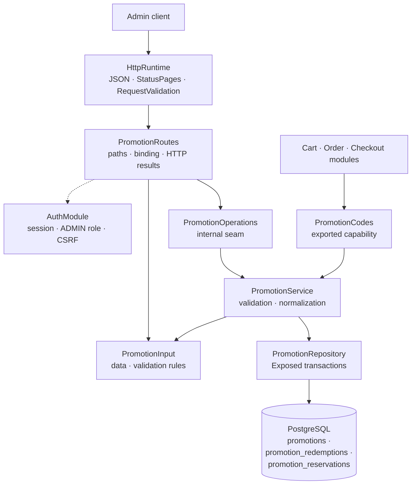

# Backend Promotion package

This guide explains the Kotlin code in
[`backend/modules/promotion/src/shop/voenix/promotion`](../../../backend/modules/promotion/src/shop/voenix/promotion).

## What this package does

The Promotion package provides the authenticated admin lifecycle of
promotions: coupon codes with a percentage or fixed-amount discount, an
optional activity window, and optional usage limits. Coupon codes are unique
regardless of letter case, and PostgreSQL enforces that invariant.

A promotion that has been redeemed at least once is *locked*: its
configuration can no longer be changed and it can no longer be deleted, so
that recorded redemptions keep referring to the terms customers actually used.
An administrator may still activate or deactivate a locked promotion.

Next to the admin surface the package exports the `PromotionCodes`
capability: `validate` answers what a customer-entered code is worth right
now, `reserve` holds its capacity while a checkout runs, `release` gives that
hold back, `redeem` records a redemption atomically, and `find` resolves
promotion ids a consumer has already stored. The capability has no HTTP
surface of its own; Cart validates and renders codes, Checkout reserves them,
and Order redeems them when a payment is confirmed — so that the coupon rules
exist exactly once in the system.

## The five-minute mental model


```mermaid
flowchart TB
    Client["Admin client"]
    Http["HttpRuntime<br/>JSON · StatusPages · RequestValidation"]
    Auth["AuthModule<br/>session · ADMIN role · CSRF"]
    Routes["PromotionRoutes<br/>paths · binding · HTTP results"]
    Input["PromotionInput<br/>data · validation rules"]
    Operations["PromotionOperations<br/>internal seam"]
    Codes["PromotionCodes<br/>exported capability"]
    Consumer["Cart · Order · Checkout modules"]
    Service["PromotionService<br/>validation · normalization"]
    Repository["PromotionRepository<br/>Exposed transactions"]
    Promotions[("PostgreSQL<br/>promotions ·<br/>promotion_redemptions ·<br/>promotion_reservations")]

    Client --> Http --> Routes
    Routes -.-> Auth
    Routes --> Input
    Routes --> Operations
    Consumer --> Codes
    Operations --> Service
    Codes --> Service
    Service --> Input
    Service --> Repository
    Repository --> Promotions
```

The important ownership rules are:

1. [`Application.kt`](../../../backend/app/src/shop/voenix/Application.kt)
   installs shared JSON, `StatusPages`, `RequestValidation` (including
   `validatePromotionRequests()`), authentication, and the product modules
   once.
2. `PromotionRoutes` installs the auth-owned `AdminRouteProtection` around the
   complete route subtree. Authentication, the `ADMIN` role, and CSRF are
   checked before a handler parses an ID or request body.
3. `PromotionInput.validate()` is the single implementation of the field-rule
   matrix. Ktor's `RequestValidation` calls it at the HTTP boundary, and
   `PromotionService` calls the same method defensively for direct callers.
4. `PromotionService` normalizes valid data (trimming) and turns expected
   outcomes into `OperationResult` values rather than exceptions.
5. `PromotionRepository` owns the transaction boundaries, the row locks, and
   the rules that span more than one table; the single-table statements live
   with the table object they touch. The derived `coupon_code_normalized`
   column (the uppercased code that carries the unique constraint) is written
   through `normalizedCouponCode` in `Promotions.kt`, so storing a code and
   looking one up cannot disagree.
6. `PromotionService` implements both seams: `PromotionOperations` for the
   admin routes and `PromotionCodes` for other modules. One class means the
   coupon rules cannot drift between the two.

## Production file map

```text
promotion/
|- Promotion.kt
|- PromotionCodeResult.kt
|- PromotionCodes.kt
|- PromotionInput.kt
|- PromotionModule.kt
|- PromotionRedemptions.kt
|- PromotionRepository.kt
|- PromotionReservations.kt
|- PromotionRoutes.kt
|- PromotionService.kt
`- Promotions.kt
```

A file groups the declarations that belong to one concern, as described in
[Kotlin source file organization](source-file-organization.md). That is why the
list is shorter than the list of types: a small value type lives in the file of
the component that owns it, and a result type lives with the component that
produces it.

- `Promotion` is the single admin representation for list, detail, create, and
  update responses, including the computed `redemptionCount` and `isLocked`. It
  is `internal`: being serialized by a public route does not make a type part of
  the module interface, and no other module needs it — the coupon-code seam
  carries its own fields in `PromotionCodeResult.Applicable`. Its `startsAt` and
  `endsAt` are `java.time.Instant?`, written to JSON as timestamp strings by the
  shared
  [`InstantIso8601Serializer`](../../../backend/modules/platform/src/shop/voenix/json/InstantIso8601Serializer.kt).
  The activity window is compared against the clock, so it carries the parsed
  type rather than a string that every reader parses again.
- `Discount` is a public sealed interface (`Percentage` / `FixedAmount`) that
  keeps the rule "a percentage is at most 100, a fixed amount is whole cents"
  attached to the value instead of scattering it over the code that reads it.
  It serializes as a two-field object, `discountType`
  (`PERCENTAGE`/`FIXED_AMOUNT`) plus `discountValue` — see
  [the body shapes below](#request-and-response-bodies). It shares
  `Promotion.kt` with the promotion it belongs to, together with the two
  discriminator constants used by the input rules and the repository mapping.
- `PromotionInput` is the internal model shared by create and update; it owns
  the field rules through `validate()` and the configuration comparison
  `changesOnlyActivationOf()` that the lock semantics need.
- `PromotionOperations` is the internal seam used by the routes and stubbed in
  route tests. It lives in `PromotionService.kt`, next to the one class that
  implements it.
- `PromotionCodes` is the public seam other modules consume, and
  `PromotionCodeResult` its typed answer (`Applicable` plus the seven failure
  reasons). `PromotionCodeResult.kt` also owns the three rules that would
  otherwise drift apart: `Promotion.usageFailure` (the usage limits, shared by
  validation, reservation, and redemption), `Promotion.availabilityFailure` (the
  active flag and the activity window, shared by validation and reservation),
  and the public `PromotionCodeResult.toApiError()` — the status and the stable
  `code` every consumer answers a rejected coupon with.
- `PromotionWriteResult` keeps write outcomes (`Stored`, `NotFound`,
  `CodeConflict`, `Locked`) and `PromotionDeleteResult` the delete outcomes
  (`Deleted`, `NotFound`, `InUse`) internal to the repository and service. Both
  live in `PromotionRepository.kt`, because the repository is what produces
  them.
- `Promotions`, `PromotionRedemptions`, and `PromotionReservations` map the
  three PostgreSQL tables for Exposed, and each file also owns the statements
  against its own table: reading a promotion row (locked or not), counting and
  inserting redemptions, and holding, counting, or releasing a reservation.
  Unlike a module with a single table, they stay out of `PromotionRepository.kt`:
  one file for the repository plus three tables would stop being one concern.
  They are all `…InTransaction` functions — they run in whatever transaction
  the caller opened, which is why the transaction boundary stays a decision of
  `PromotionRepository` alone.

## HTTP API

Every route requires an authenticated user with the exact `ADMIN` role.
Mutating methods also require the shared `X-XSRF-TOKEN` header.

| Method and path | CSRF | Success response |
| --- | --- | --- |
| `GET /api/admin/promotions` | No | `200` with a JSON array of `Promotion` values ordered by name, then id |
| `POST /api/admin/promotions` | Yes | `201` with `Promotion` and `Location` |
| `GET /api/admin/promotions/{id}` | No | `200` with `Promotion` |
| `PUT /api/admin/promotions/{id}` | Yes | `200` with the updated `Promotion` |
| `DELETE /api/admin/promotions/{id}` | Yes | `204` without a body |

The create response uses a relative location such as
`/api/admin/promotions/42`. Invalid IDs return `400 Invalid promotion id`
after security checks and before a promotion operation is called. A coupon
code that differs only in letter case from an existing one returns
`409 Coupon code is already in use`.

`PUT` replaces every field, so it uses the same request body and the same
rules as `POST`. Its conflict response is
`409 Coupon code is already in use or the promotion is locked`. The shared
`OperationResult.Conflict` carries no reason, so one message covers both
causes; a client can tell them apart because it already knows `isLocked` from
the representation.

`DELETE` answers `404` for an unknown id and
`409 Promotion is still in use and cannot be deleted` for a promotion that a
redemption or an order still references.

### Request and response bodies

A request body is flat. Every field may be omitted, and every field except
`isActive` may also be `null`; `validate()` then decides whether the resulting
value is allowed. `isActive` is the one field declared non-nullable
(`Boolean = false`), so omitting it means `false` — a promotion you forget to
switch on stays switched off — while sending an explicit `null` for it is a
parse error rather than a field error:

```json
{
  "name": "Summer sale",
  "couponCode": "Summer10",
  "discountType": "PERCENTAGE",
  "discountValue": 10,
  "startsAt": null,
  "endsAt": null,
  "usageLimitTotal": 100,
  "usageLimitPerUser": 1,
  "isActive": true
}
```

A response body groups the discount into a nested object, because `Promotion`
holds the sealed `Discount` value rather than a loose type/value pair:

```json
{
  "id": 42,
  "name": "Summer sale",
  "couponCode": "Summer10",
  "discount": { "discountType": "PERCENTAGE", "discountValue": 10.00 },
  "startsAt": null,
  "endsAt": null,
  "usageLimitTotal": 100,
  "usageLimitPerUser": 1,
  "isActive": true,
  "redemptionCount": 0,
  "isLocked": false
}
```

The two shapes are therefore **not** symmetric: a client sends `discountType`
and `discountValue` at the top level and reads them back under `discount`.
That asymmetry is a consequence of two decisions that are each sound on their
own — the domain type keeps its invariants (so the response follows the type)
and the validation error keys stay the flat `discountValue` the legacy
frontend already knows (so the request stays flat). Flattening the response
too would need a hand-written serializer for `Promotion`, which the migration
guide's compatibility checkpoint does not allow without approval. The
frontend adaptation task therefore has to map the discount in one direction
only; the open decision is recorded in
[`promotion-migration.md`](../../migration/promotion-migration.md).

Three values come back in a different notation than they were sent, all of
them because the response is read back from the stored row:

- `couponCode` and `name` are trimmed, but `couponCode` keeps its original
  letter case. Only the internal `coupon_code_normalized` column is
  uppercased, so `"  Sommer25  "` is stored and returned as `"Sommer25"` while
  the uniqueness rule sees `SOMMER25`.
- `discountValue` gains the two decimal places of the `numeric(12,2)` column:
  `500` comes back as `500.00`.
- `startsAt` and `endsAt` are normalized to UTC, so
  `"2026-06-01T00:00:00+02:00"` comes back as `"2026-05-31T22:00:00Z"`.

Because the stored value always equals the accepted value, the input rules
reject the two cases where the column would silently change it: a percentage
with more than two decimal places, and a fixed amount above the column's
capacity.

## The exported PromotionCodes capability

`installPromotionModule(database)` returns a `PromotionCodes` instance. Since
the Cart migration the composition root **binds** it: applying a coupon code to
a cart runs `validate`, and rendering a cart that has one stored runs `find`.
`redeem` is bound too since the Order migration: `OrderRepository.markPaid`
calls it while it turns an order into a paid one. `redeem` and `release` must
run **inside the caller's transaction** — they belong to the caller's decision
and commit and roll back with it — and fail with `IllegalStateException`
outside of one. `releaseAbandoned` is the same delete for callers that own no
transaction at all: it opens its own.

```kotlin
public interface PromotionCodes {
    public suspend fun validate(
        code: String,
        userId: Long? = null,
        reservationKey: Long? = null,
    ): PromotionCodeResult

    public suspend fun reserve(
        promotionId: Long,
        cartId: Long,
        userId: Long? = null,
    ): PromotionCodeResult

    public suspend fun release(cartId: Long)

    public suspend fun releaseAbandoned(cartId: Long)

    public suspend fun redeem(
        promotionId: Long,
        orderId: Long,
        cartId: Long,
        userId: Long? = null,
    ): PromotionCodeResult

    public suspend fun find(
        promotionIds: Set<Long>
    ): Map<Long, PromotionCodeResult.Applicable>
}
```

`validate`, `reserve`, and `redeem` answer with a `PromotionCodeResult`: either
`Applicable(id, name, couponCode, discount)` or one of seven reasons.

| Reason | Meaning |
| --- | --- |
| `InvalidCode` | No promotion carries this code, or the promotion no longer exists |
| `Inactive` | The promotion is switched off |
| `NotStarted` | The activity window has not begun |
| `Expired` | The activity window has ended |
| `LoginRequired` | The promotion limits usage per user, and the caller is a guest |
| `TotalExhausted` | The total usage limit is used up |
| `PerUserExhausted` | This customer has used up their personal allowance |

`validate` is the advisory answer for the moment a customer enters a code. It
trims the input and matches case-insensitively, so `"  sommer25 "` finds
`SOMMER25`. It then applies two rule groups in this order: availability
(`Inactive`, `NotStarted`, `Expired`) and usage limits (`LoginRequired`,
`TotalExhausted`, `PerUserExhausted`). Both window boundaries belong to the
window, and the clock behind it is the `java.time.Clock` passed to
`installPromotionModule`, so tests can place "now" exactly on a boundary.

The order inside the second group is behavior, not style. A guest entering a
per-user-limited code is told that a login is required *even when the total
limit is already exhausted*, because logging in may still let them use the
code. That precedence was extracted from the legacy tests and is covered by
its own test.

`redeem` is the authority **over the usage limits**, and only over those. It
re-checks them under a lock and records the redemption in one transaction, so
a promotion with `usage_limit_total = N` can never be redeemed more than N
times. A guest (`userId = null`) may redeem a promotion that only carries a
total limit; that is why `promotion_redemptions.user_id` is nullable.

`redeem` deliberately does *not* re-check the active flag or the activity
window — `reserve` does, when the checkout starts. The split is a decision, not
an omission: a promotion that expires between the checkout and the payment must
still be redeemed, because the customer has already been charged by then. Were
the window checked here, the result would be a *paid* order without a
redemption, which the order module has a name for
(`PaidOrderResult.PromotionRefused`).

### The reservation lifecycle

A usage limit is only honest if it also counts the checkouts that are running
right now. `reserve` is what makes them countable: it writes one row into
`promotion_reservations`, keyed on the **cart**, and every limit check counts
those rows next to the recorded redemptions.

```text
validate ──▶ reserve ──▶ redeem              the payment succeeded
  (cart)     (checkout)  │
                         ├─▶ release          the order was cancelled, or its
                         │                    payment ended terminally
                         └─▶ releaseAbandoned the placement refused, or the
                                              customer removed the code
```

- `reserve` runs in its own transaction, under the same `FOR UPDATE` lock on
  the promotion row that `redeem` takes, and re-checks everything: the active
  flag, the window, the customer eligibility, and the limits. Two carts racing
  the last unit therefore produce exactly one holder.
- The cart is the identity, so `cart_id` is unique. A cart reserving again —
  a repeated checkout — overwrites its own row, and every count excludes the
  caller's own cart. Nobody can lose the capacity they are holding.
- `redeem` inserts the redemption and deletes the reservation of the same cart
  in the caller's transaction, so the capacity moves from in-flight to recorded
  without being counted twice or being free in between.
- `release` is the other ending: one idempotent `DELETE`, also inside the
  caller's transaction.
- `releaseAbandoned` is that same `DELETE` in a transaction of its own, for the
  two callers that have none to join: the checkout module — which owns no
  database — when the placement refuses the order it had already reserved for,
  and the cart when the customer removes the coupon. Both are checkout attempts
  that gave the coupon up, and neither leaves behind anything that could ever
  release the hold otherwise. No lock on the promotion row is taken: giving
  capacity back cannot overshoot a limit.
- `validate` takes the cart as its `reservationKey` and counts the reservations
  of every other cart, which is why an exhausted promotion is refused at the
  moment the code is entered rather than only at checkout.

A reservation has **no expiry** (checkout migration deviation D2). It ends
through `redeem`, `release`, or `releaseAbandoned` and through nothing else,
which is deliberate and has an accepted cost: a crash between the reservation
and its order, or a terminal payment webhook that is never delivered at all,
leaves a row that holds capacity until an administrator removes it.

`find` is the reader half of the capability, in the shape every reader in this
backend has: set in, map out. A cart that has stored a `promotion_id` resolves
it — together with every other id of the same page — in one call, and gets the
name, the code, and the discount as they are configured **now**. It has no
expected failure at all: an id that names no promotion is simply absent from
the map instead of mapping to `null`, and an empty set is answered without
touching the database. No availability rule is applied here, because "may this
still be used?" is what `validate` and, decisively, `redeem` answer.

Unlike the admin operations, the capability does not map unexpected database
failures to a result value. They surface as exceptions, so the consuming
module answers them with its own error policy instead of receiving a
business-looking failure reason for an infrastructure problem.

## Validation and normalization

`PromotionInput.validate()` implements the field rules and returns lower
camel case field names for the shared `ApiError.errors` map.

| Field | Rule |
| --- | --- |
| `name` | Required after trimming; at most 255 characters |
| `couponCode` | Required after trimming; at most 64 characters |
| `discountType` | Required; `PERCENTAGE` or `FIXED_AMOUNT` |
| `discountValue` | Required; positive. Percentage: at most 100 with at most two decimal places. Fixed amount: whole cents, at most 9999999999 (the `numeric(12,2)` column capacity) |
| `startsAt`, `endsAt` | Optional ISO-8601 timestamps; `startsAt` must not be after `endsAt` |
| `usageLimitTotal`, `usageLimitPerUser` | Optional; positive when set |

After validation the service trims `name` and `couponCode`. The repository
derives `coupon_code_normalized` by uppercasing the trimmed code and converts
the timestamps to UTC, so `2026-06-01T00:00:00+02:00` is stored and returned
as `2026-05-31T22:00:00Z`.

The HTTP boundary rejects invalid input before `PromotionOperations` is
called. The service calls the same pure input method for direct callers, so
bypassing Ktor cannot send invalid or non-normalized values to persistence.

## Persistence and concurrency

Flyway migration
[`V12__create_promotions.sql`](../../../backend/modules/platform/resources/db/migration/V12__create_promotions.sql)
creates the first two tables with check constraints for the discount and the
usage limits, the unique constraint `ux_promotions_coupon_code_normalized`, and
the redemption foreign key with `ON DELETE RESTRICT`.

[`V18__create_promotion_reservations.sql`](../../../backend/modules/platform/resources/db/migration/V18__create_promotion_reservations.sql)
adds `promotion_reservations`, whose three foreign keys each answer a deletion
differently: the promotion is `RESTRICT` (a promotion somebody is checking out
with must not vanish), the cart is `CASCADE` (the reservation is a property of
that cart), and the user is `SET NULL` (the capacity stays held after the
account is deleted). `cart_id` is unique, which is what makes a repeated
reservation an update instead of a second unit.

PostgreSQL is the concurrency-safe authority for code uniqueness: create does
not run a preliminary existence query. When two requests race with the same
(or a case-variant) code, exactly one insert succeeds; the other fails with
SQL state `23505`, which `executePostgresWrite` maps to
`PromotionWriteResult.CodeConflict` and the route maps to `409`. Constraint
names and provider messages are never inspected or exposed (see
[`persistence-error-handling.md`](persistence-error-handling.md)).

Unexpected database failures are logged internally and become the generic
`500 Internal server error` API response. Coroutine cancellation is always
rethrown.

### Both writers lock the promotion row

Three operations write against the usage state of a promotion: the admin update
(which must reject a configuration change once a redemption exists), `reserve`,
and `redeem` (neither of which must hand out capacity twice). All three start
their transaction the same way:

```sql
SELECT * FROM promotions WHERE id = ? FOR UPDATE
```

The lock is what serializes them. Whichever transaction arrives second waits,
and only *then* issues its counting query. Under the default `READ COMMITTED`
isolation every statement takes a fresh snapshot, so that count already
contains everything the first transaction committed while the second one was
waiting.

The admin update then decides in one place:

1. No row: `PromotionWriteResult.NotFound`.
2. No redemptions: the full update runs.
3. Redemptions exist, but the submitted input matches the stored configuration
   and only `isActive` differs (`PromotionInput.changesOnlyActivationOf`):
   a statement writes just that column.
4. Otherwise `PromotionWriteResult.Locked`, which the route maps to `409`.

The configuration comparison is deliberately tolerant about notation rather
than about meaning: timestamps are compared as instants and the discount as a
number, so `2026-01-01T01:00:00+01:00` and `10` count as unchanged against the
stored `2026-01-01T00:00:00Z` and `10.00`.

`redeem` uses the same lock to re-read the usage counts, applies
`Promotion.usageFailure`, and inserts the redemption. A promotion with
`usage_limit_total = 1` can therefore never be redeemed twice: the second
transaction only gets to count after the first one has committed its
redemption. `reserve` works exactly the same way one step earlier, which is why
two carts racing the last unit end with one reservation and one
`TotalExhausted`.

#### Why a guard inside the writing statement is not enough

An earlier version let the writing statement decide, with a subquery guard:

```sql
UPDATE promotions SET ... WHERE id = ? AND NOT EXISTS (
    SELECT id FROM promotion_redemptions WHERE promotion_id = ?
)
```

That guard is not a constraint, and it does not survive a concurrent
redemption. Under `READ COMMITTED` the statement evaluates `NOT EXISTS`
against its own snapshot. If a redemption commits afterwards, PostgreSQL does
not re-evaluate the subquery: the concurrent transaction only *locked* the
promotion row rather than updating it, so there is no re-check at all, and
even when there is one it is the locked row that gets re-read, not other
tables. The update would then reconfigure a promotion that has just been
redeemed. `PromotionCodesIntegrationTest` contains that exact race and fails
against the old implementation.

Delete needs no lock of its own. `promotion_redemptions` references
`promotions` with `ON DELETE RESTRICT`, so PostgreSQL rejects the delete with
SQL state `23503`, which `executePostgresWrite` maps to
`PromotionDeleteResult.InUse`. A delete racing a redemption blocks on the
same row lock and then hits the foreign key, because the constraint is real.
The result is deliberately generic: since the Order migration `orders`
restricts the delete too, and SQL state `23503` cannot say which of the two
references held the promotion back without reading a constraint name.

## Tests and verification

- `PromotionInputValidationTest` covers the complete field-rule matrix once.
- `PromotionRouteSecurityAndValidationTest` covers route-subtree protection,
  CSRF ordering, binding, validation-before-operation, `201` + `Location`,
  `204` delete, and HTTP result mapping against stubbed operations.
- `PromotionAdminCrudIntegrationTest` runs the authenticated and
  CSRF-protected flows through real Ktor routes and PostgreSQL: list
  ordering and redemption counts, create with trimming and code
  normalization, the case-insensitive duplicate conflict on create and on
  update, two concurrent creates, the full update of an unredeemed promotion,
  the rejected configuration change and the accepted activation change on a
  redeemed one, delete with its `204`, `404`, and `409` outcomes, and
  defensive service validation.
- `PromotionCodesIntegrationTest` covers the exported capability: the
  resolved code with trimming and case-insensitive matching, every failure
  reason, the login hint taking precedence over an exhausted total limit, both
  window boundaries, the recorded redemption including a guest redemption,
  limit re-checks in `redeem`, two concurrent redeems against a total limit of
  one, and an admin update racing a redemption. Two tests cover `find`: a
  batch of stored ids resolves to the current master data with the unknown id
  absent, and the statement-counting data source proves that an empty id set
  runs no SQL.
- `PromotionReservationsIntegrationTest` covers the reservation lifecycle: what
  a reservation holds, that re-reserving the same cart never counts twice, the
  window and eligibility checks of `reserve`, two concurrent reserves of the
  last unit, the per-user count, `redeem` consuming the reservation of its own
  cart (and leaving it in place when the caller rolls back), `redeem` counting
  other carts while ignoring the window, `release` — outside a transaction an
  `IllegalStateException`, inside one idempotent — and `releaseAbandoned`, which
  needs no transaction, is idempotent, and frees the last unit for another cart.
- `PromotionSchemaIntegrationTest` proves the Flyway schema: the restricting
  foreign key, the case-insensitive unique index, the check constraints, and
  the reservation table with its three differently-answering foreign keys.
  Each one is asserted through the write it rejects and the SQL state that
  comes back, never through its constraint name — a name is an implementation
  detail that renaming should be free to change, and no test may pin one.
  Indexes are the exception, because they change no observable behavior: their
  names are all a test can assert.

Run the final backend gate from [`backend/`](../../../backend):

```sh
./kotlin do ktfmt
./kotlin check
```
