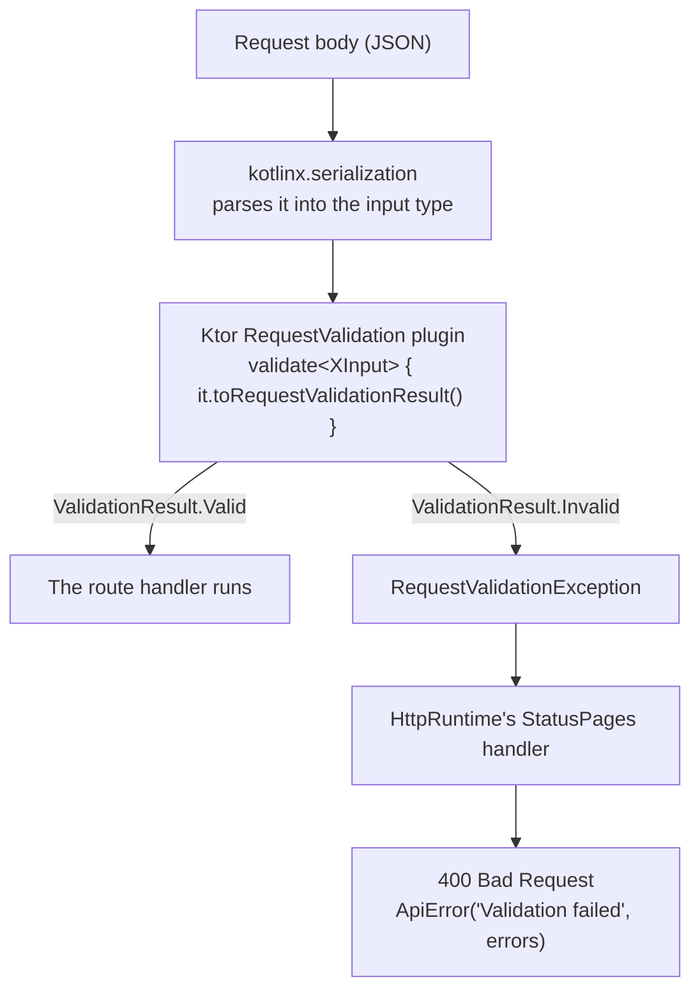

# Request validation

This guide explains how the backend checks the body of an incoming request
before a service ever sees it: which types are involved, how a rejected body
becomes a `400` answer, and how the shared
[`buildValidationErrors`](../../../backend/modules/platform/src/shop/voenix/validation/ValidationErrorsBuilder.kt)
builder collects the field messages.

## The two types every input uses

Both live in the `platform` module, in the package `shop.voenix.validation`:

```kotlin
public interface Validatable {
    public fun validate(): ValidationErrors
}

/** Validation messages grouped by lower-camel-case field name. */
public typealias ValidationErrors = Map<String, List<String>>
```

A request type implements `Validatable` and returns its field errors. An empty
map means "this body is fine". The same `ValidationErrors` alias is what
`OperationResult.Invalid` carries, so a rule that only a service can check
(does this id exist? is this file really uploaded?) reports in exactly the same
shape as a field rule — see
[Shared operation results](operation-results.md).

### Why every request field is nullable

Look at any input type and you will see that even the required fields are
declared nullable with a default:

```kotlin
@Serializable
internal data class PromptSlotInput(val name: String? = null) : Validatable
```

That is deliberate. If `name` were a non-null `String`, a body without it would
fail during *deserialization*, and the client would get a kotlinx-serialization
message about a missing field — text no client can act on, and text that quotes
the payload back. With a nullable field the body parses, `validate()` runs, and
the client gets `name: ["Name is required"]`, which is a real contract.

## The round trip of a rejected body



Each module registers its request types once, in a
`RequestValidationConfig` extension that the composition root calls:

```kotlin
public fun RequestValidationConfig.validateAccountRequests() {
    validate<RegisterInput> { input -> input.toRequestValidationResult() }
    validate<LoginInput> { input -> input.toRequestValidationResult() }
    // …
}
```

`toRequestValidationResult()` is the bridge between our map and Ktor's own
result type. Ktor's `ValidationResult.Invalid` only holds a flat list of
strings, so the bridge flattens the map — but the field keys are not lost,
because the error handler in `HttpRuntime.kt` reaches back to the original
value and calls `validate()` once more to build the response body:

```kotlin
exception<RequestValidationException> { call, cause ->
    call.respond(
        HttpStatusCode.BadRequest,
        ApiError(
            message = "Validation failed",
            errors = (cause.value as? Validatable)?.validate().orEmpty(),
        ),
    )
}
```

So the client always sees one shape: status `400`, message `Validation failed`,
and an `errors` object keyed by field name.

## Collecting the messages: `buildValidationErrors`

A `validate()` implementation runs several small rules and each of them may add
a message. The shared builder is what they add to:

```kotlin
public class ValidationErrorsBuilder {
    public fun add(field: String, message: String)
    public fun addAll(field: String, messages: List<String>)
    public fun addAll(errors: ValidationErrors)
    public fun build(): ValidationErrors
}

public inline fun buildValidationErrors(build: ValidationErrorsBuilder.() -> Unit): ValidationErrors
```

`buildValidationErrors { … }` reads like Kotlin's own `buildMap { … }`, which
is what it replaced. It is `inline`, so a suspending call may appear inside the
block. Fields and messages keep the order in which the rules ran, and `build()`
returns a snapshot — a builder kept across calls can safely be built more than
once.

### Before and after

The old shape, from `MugArticleInput`, built a `MutableMap` directly and needed
its own private `add`/`addAll` extensions at the bottom of the file:

```kotlin
override fun validate(): ValidationErrors = buildMap {
    requiredText("name", "Name", name, MAXIMUM_NAME_LENGTH)
    // …
    mugDetails?.validate()?.forEach { (field, messages) -> addAll(field, messages) }
}

private fun MutableMap<String, List<String>>.requiredText(/* … */) {
    when {
        value.isNullOrBlank() -> add(field, "$displayName is required")
        // …
    }
}
```

The new shape uses the platform builder, and the private rules become
extensions on `ValidationErrorsBuilder`:

```kotlin
override fun validate(): ValidationErrors = buildValidationErrors {
    requiredText("name", "Name", name, MAXIMUM_NAME_LENGTH)
    // …
    mugDetails?.validate()?.let { addAll(it) }
}

private fun ValidationErrorsBuilder.requiredText(/* … */) {
    when {
        value.isNullOrBlank() -> add(field, "$displayName is required")
        // …
    }
}
```

Nothing about the HTTP contract changes: the same field keys, the same message
texts.

## The one rule to remember: adding never overwrites

`add` appends to what a field already collected. That is the whole reason the
builder exists, and it fixed a real bug.

`ReorderInput` checks two things about `targetId`: that it is positive, and
that it differs from `sourceId`. With the old `put`, a body of
`{"sourceId": 0, "targetId": 0}` let the second rule *overwrite* the first, and
the client was told the ids must differ while never learning that `0` is not a
usable id at all:

```kotlin
// old — the second put replaces the first
put("targetId", listOf("TargetId must be positive"))
put("targetId", listOf("TargetId must be different from SourceId"))
```

With the builder, both messages arrive:

```json
{
  "message": "Validation failed",
  "errors": {
    "sourceId": ["SourceId must be positive"],
    "targetId": [
      "TargetId must be positive",
      "TargetId must be different from SourceId"
    ]
  }
}
```

Both `ReorderInputValidationTest` files pin exactly this input.

## Nested inputs

A request body that contains another object does not re-implement that object's
rules. The nested type has its own `validate()`, and the outer one merges the
result with `addAll(errors)`:

```kotlin
mugDetails?.validate()?.let { addAll(it) }
mugVariants.forEachIndexed { index, variant -> addAll(variant.validate(index)) }
```

The nested type owns its field *paths* too, which is why
`MugVariantInput.validate(index)` takes the index: its keys read
`mugVariants[0].name`, so the client can point at the entry that is wrong.
Because merging never overwrites, an outer rule and a nested rule can both
report on the same key without either message disappearing.

## What is deliberately not shared

The builder is shared. The **field rules are not**. There is no platform-wide
`requiredText`, `positiveId`, or email check, and that is a decision, not an
omission: the message texts are part of each module's HTTP contract, and today
several modules word the same rule differently. Unifying them in a shared
helper would silently change what clients receive.

When a rule really is shared *within* a module, the sanctioned pattern is a
plain function returning `List<String>`, as in
[`AccountFieldRules.kt`](../../../backend/modules/account/src/shop/voenix/account/AccountFieldRules.kt):

```kotlin
internal fun accountPasswordErrors(value: String?): List<String> =
    when {
        value.isNullOrEmpty() -> listOf("Password is required")
        value.length < MINIMUM_PASSWORD_LENGTH -> listOf("Password must be at least 8 characters")
        else -> emptyList()
    }
```

A caller feeds it straight into the builder with
`addAll("password", accountPasswordErrors(password))` — an empty list adds no
key, so the valid case needs no `if`.

## Adoption status

The builder is the way every `validate()` implementation collects its errors:
every module builds its field errors this way, and no
`buildMap { put(field, listOf(message)) }` implementation is left in the
backend. A new input type adds to that — never to a raw map.
