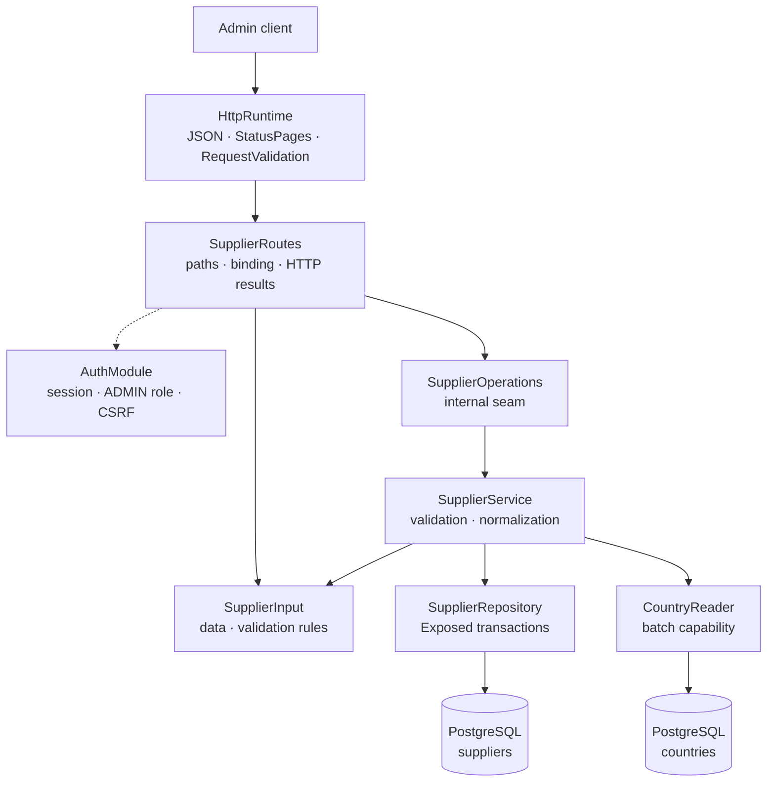

# Backend Supplier package

This guide explains the Kotlin code in
[`backend/modules/supplier/src/shop/voenix/supplier`](../../../backend/modules/supplier/src/shop/voenix/supplier).

## What this package does

The Supplier package provides authenticated admin endpoints for listing,
creating, reading, fully replacing, and deleting suppliers. It validates and
normalizes supplier input and stores suppliers in PostgreSQL through Exposed.

Suppliers may refer to a country. The database keeps that relationship valid
and clears it automatically when the country is deleted. The Article module is
not part of this migration, so the production schema does not yet contain an
Article-to-Supplier foreign key. The deferred work is tracked in
[`supplier-post-migration.md`](../../migration/supplier-post-migration.md).

## The five-minute mental model



The important ownership rules are:

1. [`Application.kt`](../../../backend/app/src/shop/voenix/Application.kt) installs
   shared JSON, `StatusPages`, `RequestValidation`, authentication, and the
   product modules once.
2. `SupplierRoutes` installs the auth-owned `AdminRouteProtection` around the
   complete Supplier route subtree. Authentication, the `ADMIN` role, and CSRF
   are checked before a handler parses an ID or request body.
3. `SupplierInput.validate()` is the validation interface used by Ktor
   and `SupplierService`, and it implements the field rules next to the data it
   examines.
4. `SupplierService` normalizes valid data and turns expected outcomes into
   `OperationResult` values rather than exceptions.
5. `SupplierRepository` owns Exposed queries and transaction boundaries for
   the Supplier table only.
6. `SupplierService` resolves nested country values through the public
   `CountryReader` capability. Supplier cannot import the Country table or
   repository because those declarations are internal to the Country module.

## Production file map

The package contains ten production types, with one top-level type per file:

```text
supplier/
|- StoredSupplier.kt
|- Supplier.kt
|- SupplierModule.kt
|- SupplierInput.kt
|- SupplierOperations.kt
|- SupplierRepository.kt
|- SupplierRoutes.kt
|- SupplierService.kt
|- SupplierWriteResult.kt
`- Suppliers.kt
```

- `Supplier` is the internal detailed stored and admin HTTP representation.
- `StoredSupplier` is the internal Supplier row without a nested cross-module
  object.
- The internal `SupplierModule` is the runtime handle that owns the assembled
  implementation and installs routes without exposing its object graph to
  `app`.
- `SupplierInput` is the internal model shared by create and full replacement
  and owns its field rules through `validate()`.
- `SupplierOperations` is the internal seam used by the routes.
- The shared [`OperationResult`](operation-results.md) describes success,
  validation, missing rows, conflicts, and unexpected failures.
- `SupplierWriteResult` keeps persistence outcomes internal to the repository
  and service implementation.
- `Suppliers` maps the PostgreSQL table for Exposed.

The existing serializable `Country` type is reused for the nested country
representation because it has exactly the required `id`, `name`, and
`countryCode` meaning. `Supplier` itself remains internal even though it is an
HTTP response model. The module manifest exports the Country dependency
because the public `installSupplierModule` composition function accepts a
`CountryReader`.

## HTTP API

Every route requires an authenticated user with the exact `ADMIN` role.
Mutating methods also require the shared `X-XSRF-TOKEN` header.

| Method and path | CSRF | Success response |
| --- | --- | --- |
| `GET /api/admin/suppliers` | No | `200` with a JSON array of `Supplier` values |
| `POST /api/admin/suppliers` | Yes | `201` with `Supplier` and `Location` |
| `GET /api/admin/suppliers/{id}` | No | `200` with `Supplier` |
| `PUT /api/admin/suppliers/{id}` | Yes | `200` with the replaced `Supplier` |
| `DELETE /api/admin/suppliers/{id}` | Yes | `204` with no body |

The create response uses a relative location such as
`/api/admin/suppliers/42`. Invalid IDs return `400 Invalid supplier id` after
security checks and before a Supplier operation is called.

### `PUT` is a full replacement

`PUT /api/admin/suppliers/{id}` deliberately uses replacement semantics. The
same `SupplierInput` type is used for `POST` and `PUT`:

- `name` is always required;
- every optional property becomes the submitted value or `null`;
- an omitted optional JSON property also binds as `null`; and
- old optional values are not retained.

For example, replacing a Supplier with this body clears its previous address,
country, contact data, email, and website:

```json
{
  "name": "Globex"
}
```

The Vue Supplier dialog already sends every editable property as either a
value or `null`, so it is compatible with this contract. There is intentionally
no Missing-versus-null serializer and no partial-update behavior hidden behind
`PUT`.

## Validation and normalization

`SupplierInput.validate()` implements the field rules and returns lower
camel case field names for the shared `ApiError.errors` map.

| Field | Rule |
| --- | --- |
| `name` | Required after trimming; at most 255 characters |
| `postalCode` | Optional; at most 20 characters after trimming |
| `email` | Optional; at most 255 characters and a valid email shape |
| Other text fields | Optional; at most 255 characters after trimming |
| `countryId` | Optional; a non-null value must reference an existing country |

Optional blank text is valid and is stored as `null`. Nonblank text is trimmed
only after the whole input has passed validation. The email check requires one
`@`, nonempty text on both sides, and no whitespace. Obscure framework-specific
.NET email-parser edge cases are not part of the migrated contract.

The HTTP boundary rejects invalid input before `SupplierOperations` is called.
The service calls the same pure input method for direct callers, so bypassing
Ktor cannot send invalid or non-normalized values to persistence.

## Representation and ordering

The same `Supplier` representation is used for list, detail, create, and update
responses. It contains all editable fields plus both `countryId` and the nested
`country` value. Shared JSON configuration includes explicit `null` properties.
The list endpoint returns these values directly as a JSON array instead of
wrapping them in an `items` object. This keeps the Supplier API consistent with
the other simple list endpoints and avoids separate list-only models.

Suppliers are ordered by stored `name` and then `id`, which gives stable
ordering when names are equal. The repository loads Supplier rows without
joining a foreign module's table. The service collects every distinct country
ID and calls `CountryReader.find(ids)` once, so a list does not issue one
country query per Supplier.

## Persistence and transactions

Flyway migration
[`V3__create_suppliers.sql`](../../../backend/modules/platform/resources/db/migration/V3__create_suppliers.sql)
creates the table, its generated `bigint` ID, text-length limits, ordering
index, country lookup index, and optional country foreign key.

The country foreign key uses `ON DELETE SET NULL`. PostgreSQL is the
concurrency-safe authority: create and update do not rely on a preliminary
country-existence query. SQL state `23503` during those writes becomes
`SupplierWriteResult.CountryNotFound`; constraint names and provider messages
are never exposed. The service maps that internal persistence result to
`OperationResult.Invalid` with a `countryId` field error. The route returns the
usual `400` validation response, so clients can show `Country not found` next
to the country field. An update and its detail read happen in one transaction,
so a bad country rolls back every submitted replacement value.

Supplier rows and their Country enrichment intentionally use two read
snapshots. A compile-time module boundary prevents Supplier from recreating the
former cross-module SQL join, and an atomic cross-table snapshot is not needed
for this admin master-data view. If a Country is deleted after Supplier rows
are loaded but before `CountryReader` runs, that one response can retain the
previous `countryId` while returning `country: null`. The next read observes
PostgreSQL's `ON DELETE SET NULL` result and returns both values as `null`.
`SupplierServiceIntegrationTest` controls this race explicitly. The list still
uses one Supplier query and one batched Country query, never one transaction or
query per Supplier.

Supplier names are deliberately not unique. The source behavior allows equal
names, and the stable secondary `id` ordering keeps their list order
deterministic.

The `production_destinations` table references suppliers with
`ON DELETE RESTRICT`. Deleting a Supplier that still owns a production
destination therefore returns `SupplierDeleteResult.InUse` from the
repository, which the service maps to `OperationResult.Conflict` and the
route maps to `409 Supplier is in use and cannot be deleted`. The
destination has to be removed first (see
[`production-package.md`](production-package.md)). There is currently no
`articles` table or Article foreign key; that relationship belongs to the
Article migration.

Unexpected database failures are logged internally and become the generic
`500 Internal server error` API response. Coroutine cancellation is always
rethrown.

## Tests and verification

- `SupplierInputValidationTest` covers the complete field-rule matrix once.
- `SupplierRouteSecurityAndValidationTest` covers route-subtree protection,
  CSRF ordering, binding, validation-before-operation, and HTTP result mapping.
- `SupplierServiceIntegrationTest` uses PostgreSQL for normalization, Country
  enrichment, ordering, full replacement, rollback, country FK behavior,
  deletion, the production-destination delete conflict, the documented
  split-snapshot race, hidden database errors, and one batched Country lookup
  per list.
- `SupplierAdminCrudIntegrationTest` runs the authenticated and
  CSRF-protected CRUD workflow through real Ktor routes and PostgreSQL.
- `ApplicationDatabaseIntegrationTest` verifies that the complete Flyway chain
  builds a clean configured schema during application startup.

Run the final backend gate from [`backend/`](../../../backend):

```sh
./kotlin do ktfmt
./kotlin check
```
