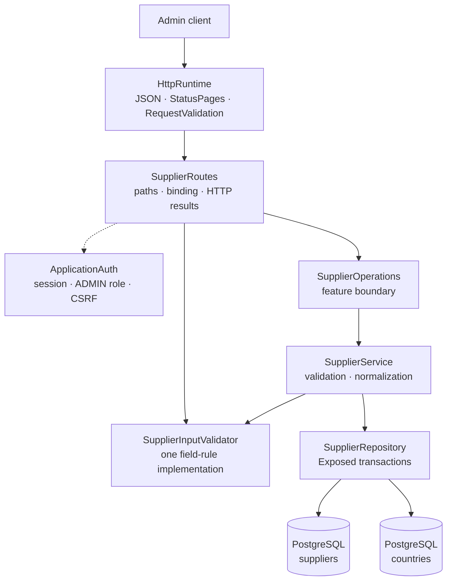

# Backend Supplier package

This guide explains the Kotlin code in
[`backend/src/shop/voenix/supplier`](../../../backend/src/shop/voenix/supplier).

## What this package does

The Supplier package provides authenticated admin endpoints for listing,
creating, reading, fully replacing, and deleting suppliers. It validates and
normalizes supplier input and stores suppliers in PostgreSQL through Exposed.

Suppliers may refer to a country. The database keeps that relationship valid
and clears it automatically when the country is deleted. The Article module is
not part of this migration, so the production schema does not yet contain an
Article-to-Supplier foreign key. The deferred work is tracked in
[`supplier-post-migration.md`](../../migration/supplier-post-migration.md).

## The five-minute mental model



The important ownership rules are:

1. [`Application.kt`](../../../backend/src/shop/voenix/Application.kt) installs
   shared JSON, `StatusPages`, `RequestValidation`, authentication, and feature
   modules once.
2. `SupplierRoutes` installs the auth-owned `AdminRouteProtection` around the
   complete Supplier route subtree. Authentication, the `ADMIN` role, and CSRF
   are checked before a handler parses an ID or request body.
3. `SupplierInputValidator` is the only implementation of field rules. Ktor
   uses it during request binding, and `SupplierService` uses it again for
   direct callers.
4. `SupplierService` normalizes valid data and turns expected outcomes into
   `SupplierResult` values rather than exceptions.
5. `SupplierRepository` owns Exposed queries and transaction boundaries.

## Production file map

The package contains eleven production types, with one top-level type per
file:

```text
supplier/
|- Supplier.kt
|- SupplierInput.kt
|- SupplierInputValidator.kt
|- SupplierListItem.kt
|- SupplierListResponse.kt
|- SupplierOperations.kt
|- SupplierRepository.kt
|- SupplierResult.kt
|- SupplierRoutes.kt
|- SupplierService.kt
`- Suppliers.kt
```

- `Supplier` is the detailed stored and admin representation.
- `SupplierListItem` is the smaller table-row representation.
- `SupplierListResponse` preserves the client-facing `{ "items": [...] }`
  wrapper.
- `SupplierInput` is shared by create and full replacement.
- `SupplierOperations` is the narrow boundary used by the routes.
- `SupplierResult` describes success, validation, missing rows, missing
  countries, referenced suppliers, and hidden database failures.
- `Suppliers` maps the PostgreSQL table for Exposed.

The existing serializable `Country` type is reused for the nested country
representation because it has exactly the required `id`, `name`, and
`countryCode` meaning.

## HTTP API

Every route requires an authenticated user with the exact `ADMIN` role.
Mutating methods also require the shared `X-XSRF-TOKEN` header.

| Method and path | CSRF | Success response |
| --- | --- | --- |
| `GET /api/admin/suppliers` | No | `200` with `SupplierListResponse` |
| `POST /api/admin/suppliers` | Yes | `201` with `Supplier` and `Location` |
| `GET /api/admin/suppliers/{id}` | No | `200` with `Supplier` |
| `PUT /api/admin/suppliers/{id}` | Yes | `200` with the replaced `Supplier` |
| `DELETE /api/admin/suppliers/{id}` | Yes | `204` with no body |

The create response uses a relative location such as
`/api/admin/suppliers/42`. Invalid IDs return `400 Invalid supplier id` after
security checks and before a Supplier operation is called.

### `PUT` is a full replacement

`PUT /api/admin/suppliers/{id}` deliberately uses replacement semantics. The
same `SupplierInput` type is used for `POST` and `PUT`:

- `name` is always required;
- every optional property becomes the submitted value or `null`;
- an omitted optional JSON property also binds as `null`; and
- old optional values are not retained.

For example, replacing a Supplier with this body clears its previous address,
country, contact data, email, and website:

```json
{
  "name": "Globex"
}
```

The Vue Supplier dialog already sends every editable property as either a
value or `null`, so it is compatible with this contract. There is intentionally
no Missing-versus-null serializer and no partial-update behavior hidden behind
`PUT`.

## Validation and normalization

`SupplierInputValidator` returns lower camel case field names for the shared
`ApiError.errors` map.

| Field | Rule |
| --- | --- |
| `name` | Required after trimming; at most 255 characters |
| `postalCode` | Optional; at most 20 characters after trimming |
| `email` | Optional; at most 255 characters and a valid email shape |
| Other text fields | Optional; at most 255 characters after trimming |
| `countryId` | Optional; a non-null value must reference an existing country |

Optional blank text is valid and is stored as `null`. Nonblank text is trimmed
only after the whole input has passed validation. The email check requires one
`@`, nonempty text on both sides, and no whitespace. Obscure framework-specific
.NET email-parser edge cases are not part of the migrated contract.

The HTTP boundary rejects invalid input before `SupplierOperations` is called.
The service repeats the same pure validation for direct callers, so bypassing
Ktor cannot send invalid or non-normalized values to persistence.

## Representations and ordering

The detailed representation contains all editable fields plus both
`countryId` and the nested `country` value. Shared JSON configuration includes
explicit `null` properties.

The list endpoint returns only:

```text
id, name, contactPerson, city, country, email
```

`contactPerson` joins the nonblank `title`, `firstName`, and `lastName` with a
single space. It is `null` when all three are absent. Suppliers are ordered by
stored `name` and then `id`, which gives stable ordering when names are equal.
The repository loads each list or detail result with one left join instead of
issuing one country query per Supplier.

## Persistence and transactions

Flyway migration
[`V3__create_suppliers.sql`](../../../backend/resources/db/migration/V3__create_suppliers.sql)
creates the table, its generated `bigint` ID, text-length limits, ordering
index, country lookup index, and optional country foreign key.

The country foreign key uses `ON DELETE SET NULL`. PostgreSQL is the
concurrency-safe authority: create and update do not rely on a preliminary
country-existence query. SQL state `23503` during those writes becomes
`SupplierResult.CountryNotFound`; constraint names and provider messages are
never exposed. An update and its detail read happen in one transaction, so a
bad country rolls back every submitted replacement value.

Supplier names are deliberately not unique. The source behavior allows equal
names, and the stable secondary `id` ordering keeps their list order
deterministic.

There is currently no `articles` table or Article foreign key. The delete path
already maps a future foreign-key violation to `SupplierResult.InUse`, and the
route maps that result to `409`, but the current production schema cannot yet
produce that state.

Unexpected database failures are logged internally and become the generic
`500 Internal server error` API response. Coroutine cancellation is always
rethrown.

## Tests and verification

- `SupplierInputValidatorTest` covers the complete field-rule matrix once.
- `SupplierRouteSecurityAndValidationTest` covers route-subtree protection,
  CSRF ordering, binding, validation-before-operation, and HTTP result mapping.
- `SupplierServiceIntegrationTest` uses PostgreSQL for normalization, joins,
  ordering, full replacement, rollback, country FK behavior, deletion, and
  hidden database errors.
- `SupplierAdminCrudIntegrationTest` runs the authenticated and
  CSRF-protected CRUD workflow through real Ktor routes and PostgreSQL.
- `ApplicationDatabaseIntegrationTest` verifies that the complete Flyway chain
  builds a clean configured schema during application startup.

Run the final backend gate from [`backend/`](../../../backend):

```sh
./kotlin do ktfmt
./kotlin check
```
