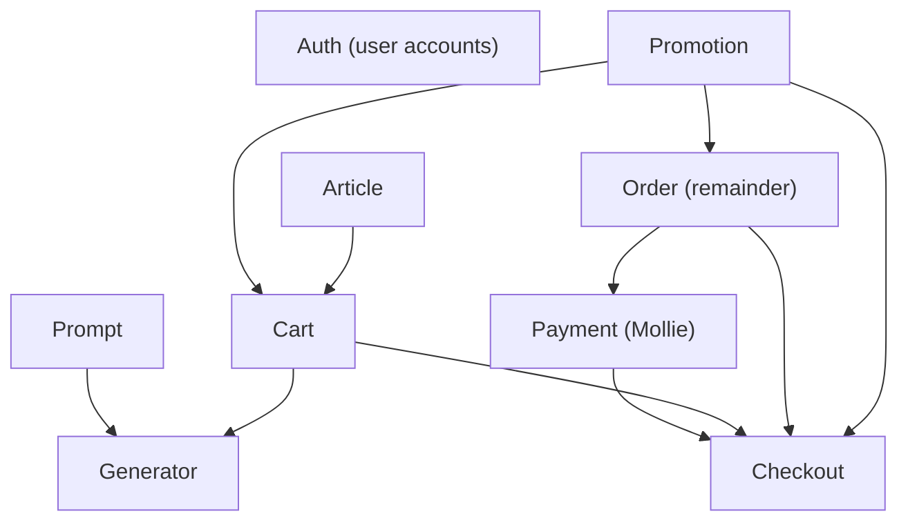

# Migration roadmap

This file tracks which legacy .NET features are still waiting for migration
and in which order they should be migrated. The order is derived from the
`using Voenix.Features.*` dependencies in the legacy source at
`/Users/joe/projects/joto-ai/voenix-shop/backend/Voenix.Api/Features`.

General migration rules remain in
[`module-migration-guide.md`](module-migration-guide.md). Each migration still
gets its own record copied from [`migration-base.md`](migration-base.md).

## Already migrated

| Kotlin module | Legacy source |
| --- | --- |
| `country` | `Features/Country` |
| `vat` | `Features/Vat` |
| `supplier` | `Features/Supplier` |
| `pricing` | `Features/Pricing` |
| `email` | `Features/Email` |
| `image` | `Features/Image` |
| `magic-coins` | `Features/MagicCoins` |
| `production` | `Features/SftpUpload` plus `Order/PdfDocument.cs`, `Order/Services/PdfService.cs`, `Order/Services/PaidOrderProcessor.cs` |
| `platform` (auth) | Session, CSRF, and guest-token infrastructure, including the `Features/Antiforgery` endpoint (`GET /api/antiforgery/token`) |

`Features/Antiforgery` therefore needs no migration of its own.

## Remaining features and their blockers

Sizes are the legacy line counts and only indicate relative effort. "User
references" means the feature only touches `Auth.Domain` for user ids and
roles; the platform module already provides `UserPrincipal` and admin route
protection, so such a reference does not block a migration.

| Legacy feature | ~Lines | Blocked by (not yet migrated) |
| --- | ---: | --- |
| Auth (user accounts) | 700 | nothing (cart claim on login lands with Cart) |
| Promotion | 1,200 | nothing |
| Article | 4,000 | nothing (Pricing and Image are migrated) |
| Prompt | 4,350 | nothing (Pricing and Image are migrated) |
| Cart | 1,000 | Article, Promotion |
| Order (remainder) | ~300 | Promotion |
| Generator | 290 | Prompt, Cart |
| Payment (Mollie) | 450 | Order |
| Checkout | 440 | Payment, Order, Cart, Promotion |

"Order (remainder)" is what `Features/Order` still owns after the production
migration: the `Order`/`OrderItem` domain and the PDF download endpoint in
`PdfController`.

## Migration order

Waves group features whose blockers are all migrated once the previous wave
is done. Features inside a wave are independent of each other and may be
migrated in any order, or in parallel worktrees.

### Wave 1 — no open blockers

1. **Auth (user accounts)** — login, registration, password reset, email
   confirmation, profile, and addresses. Email and Country are already
   migrated. `GuestDataClaimService` also claims guest carts; that part is
   deferred to the Cart migration and must be recorded as deferred work in
   the Auth migration record.
2. **Promotion** — small and self-contained; unblocks Cart and Order.
3. **Article** — large; depends only on migrated modules.
4. **Prompt** — large; depends only on migrated modules.

Auth and Promotion first: they are small, and Promotion unblocks the whole
order path. Article and Prompt are the two big blocks and can run in
parallel with everything else in this wave.

### Wave 2

5. **Cart** — needs Article and Promotion. Also picks up the deferred guest
   cart claim from the Auth migration.
6. **Order (remainder)** — needs Promotion; hooks into the migrated
   `production` module instead of the legacy SFTP/PDF services.

### Wave 3

7. **Generator** — needs Prompt and Cart; MagicCoins and guest tokens are
   already migrated.
8. **Payment (Mollie)** — needs Order.

### Wave 4

9. **Checkout** — the integration point of Cart, Order, Payment, and
   Promotion; deliberately last so it composes finished modules instead of
   stubs.

Once Checkout is migrated, the legacy backend has no remaining features and
can be retired.

## Keeping this file current

When a migration lands, move its row into the "Already migrated" table and
remove it from the waves. If a migration discovers a new dependency, update
the graph and the waves instead of working around it.
