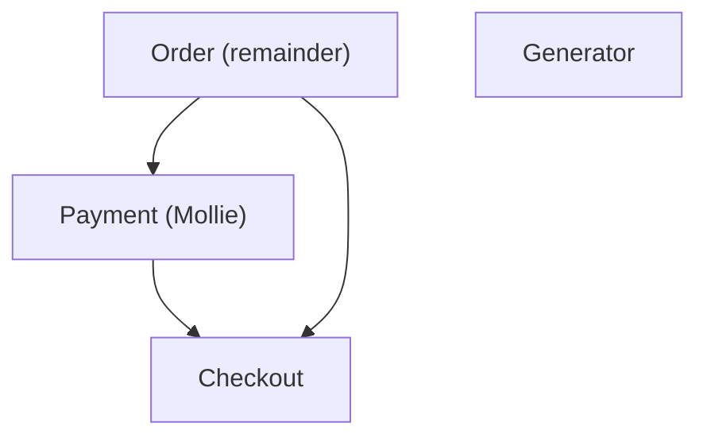

# Migration roadmap

This file tracks which legacy .NET features are still waiting for migration
and in which order they should be migrated. The order is derived from the
`using Voenix.Features.*` dependencies in the legacy source at
`/Users/joe/projects/joto-ai/voenix-shop/backend/Voenix.Api/Features`.

General migration rules remain in
[`module-migration-guide.md`](module-migration-guide.md). Each migration still
gets its own record copied from [`migration-base.md`](migration-base.md).

## Already migrated

| Kotlin module | Legacy source |
| --- | --- |
| `country` | `Features/Country` |
| `vat` | `Features/Vat` |
| `supplier` | `Features/Supplier` |
| `pricing` | `Features/Pricing` |
| `email` | `Features/Email` |
| `image` | `Features/Image` |
| `magic-coins` | `Features/MagicCoins` |
| `production` | `Features/SftpUpload` plus `Order/PdfDocument.cs`, `Order/Services/PdfService.cs`, `Order/Services/PaidOrderProcessor.cs` |
| `platform` (auth) | Session, CSRF, and guest-token infrastructure, including the `Features/Antiforgery` endpoint (`GET /api/antiforgery/token`) |
| `account` | `Features/Auth` plus `Configuration/AuthConfiguration.cs` and the Auth mappings in the exception handler; the guest-data claim is deferred to the Cart migration (see [`account-migration.md`](account-migration.md)) |
| `article` | `Features/Article` plus the article-owned parts of `Features/Pricing` and the two example-image pipelines; exports the `ArticleCatalog` capability that Cart, Order, and the production adapter consume. The Vue frontend adaptation, the orphaned example-image sweep, and the order snapshot of production data are deferred (see [`article-post-migration.md`](article-post-migration.md)). The implementation is complete; the council verification of the module record is still open |
| `prompt` | `Features/Prompt` plus the prompt-owned parts of `Features/Pricing` and the example-image pipeline; exports the `PromptCatalog` capability that Generator (composed generation text) and Cart (gross sales price in cents) consume. The Vue frontend adaptation and a few smaller follow-ups are deferred (see [`prompt-post-migration.md`](prompt-post-migration.md)). The implementation is complete; the council verification of the module record is still open |
| `promotion` | `Features/Promotion`; exports the `PromotionCodes` capability. The usage-limit check that `Order/Services/PaidOrderProcessor.cs` duplicated now lives only in this module's `redeem`, but that file itself migrates with Order. Capacity reservation by in-flight orders, `promotion_redemptions.order_id`, and the customer-facing shape of the `PROMOTION_*` errors are deferred (see [`promotion-migration.md`](promotion-migration.md)) |
| `cart` | `Features/Cart` plus the guest-data claim deferred by Account (`Auth/Services/GuestDataClaimService.cs`), the guest image service and route from `Features/Image`, and the Cart/Promotion mappings in the exception handler. It owns the print-image registry (`print_images`, legacy `GeneratedEditedImage`) that Order and Generator depend on, exports the `CartGuestImages` and `CartGuestData` capabilities, and fixes the customer-facing wire format of the `PROMOTION_*` failures. The reorder endpoint and the order claims are deferred to Order, the `CHECKED_OUT` write path to Checkout, and the Vue frontend adaptation plus the MagicCoins guest-balance claim remain open (see [`cart-migration.md`](cart-migration.md)) |

`Features/Antiforgery` therefore needs no migration of its own.

## Remaining features and their blockers

Sizes are the legacy line counts and only indicate relative effort. "User
references" means the feature only touches `Auth.Domain` for user ids and
roles; the platform module already provides `UserPrincipal` and admin route
protection, so such a reference does not block a migration.

| Legacy feature | ~Lines | Blocked by (not yet migrated) |
| --- | ---: | --- |
| Order (remainder) | ~300 | nothing (Cart is migrated) |
| Generator | 290 | nothing (Cart and Prompt are migrated) |
| Payment (Mollie) | 450 | Order |
| Checkout | 440 | Payment, Order |

"Order (remainder)" is what `Features/Order` still owns after the production
migration: the `Order`/`OrderItem` domain and the PDF download endpoint in
`PdfController`.

Both blockers of Order are resolved now. They were easy to miss, because its
`using` list names neither feature — they came from the data it has to supply,
not from its imports (corrected on 2026-07-26; Article resolved on 2026-07-28,
Cart on 2026-07-30):

- **Article — resolved.** Order has to bind the real `ProductionSource`, which
  today is a stub in `Application.kt` whose every load fails. The contract it
  must fill is `ProductionItem`: `supplierId`, `supplierArticleNumber`,
  `articleName`, `variantName`, and the five mug layout measurements. The
  migrated `article` module answers all of them through `ArticleCatalog`. Order
  must *snapshot* the supplier article number and the measurements at checkout
  instead of reading them at production time (see
  [`article-post-migration.md`](article-post-migration.md)).
- **Cart — resolved.** `ProductionItem.imagePath` points at the generated
  image, and `order_items.generated_edited_image_id` references it. That entity
  lived in the legacy Cart feature
  (`Features/Cart/Domain/GeneratedEditedImage.cs`) and is now the `cart`
  module's `print_images` table, which Order references instead. Order still
  owes the original-image read path the PDF pipeline needs, and it owns the
  reorder endpoint and the order claims the Cart migration deferred (see
  [`cart-migration.md`](cart-migration.md)).

The schema is not a blocker: legacy `order_items` has a foreign key to
`orders` only, and `article_id`/`variant_id` are plain indexed columns.
Tables and repository could be pulled forward, but without the production
source, the PDF endpoint, and the redemption trigger there is nothing to gain
from it.

```mermaid
graph TD
    Order["Order (remainder)"] --> Payment["Payment (Mollie)"]
    Payment --> Checkout
    Order --> Checkout
    Generator
```

Generator has no edge at all any more: nothing blocks it and it blocks nothing.

## Migration order

Waves group features whose blockers are all migrated once the previous wave
is done. Features inside a wave are independent of each other and may be
migrated in any order, or in parallel worktrees.

### Wave 1 — no open blockers

Five Wave-1 items are already done: Auth (module `account`, 2026-07-24),
Promotion (module `promotion`, 2026-07-26), which exports the `PromotionCodes`
capability that Order and Checkout consume, Article (module `article`,
2026-07-28), which exports the `ArticleCatalog` capability, Prompt (module
`prompt`, 2026-07-28), which exports the `PromptCatalog` capability, and Cart
(module `cart`, 2026-07-30), which picked up Auth's deferred guest-data claim
and whose `print_images` table promoted both remaining Wave-1 items into this
wave.

1. **Order (remainder)** — its blocker Cart is migrated. It hooks into the
   migrated `production` module instead of the legacy SFTP/PDF services by
   binding the real `ProductionSource`, binds the still-open order branch of
   the app-owned `AggregatedQueuedEmailSource`, and calls
   `PromotionCodes.redeem` when an order is paid — with eligibility and limits
   only, exactly as legacy `PaidOrderProcessor` does. It also owns the deferred
   `promotion_redemptions.order_id` column (see
   [`promotion-post-migration.md`](promotion-post-migration.md)) and the
   reorder endpoint, order claims, and original-image read path that Cart
   deferred (see [`cart-migration.md`](cart-migration.md)).
2. **Generator** — its blockers Cart and Prompt are migrated, and MagicCoins
   and guest tokens were already. It composes the generation text through
   `PromptCatalog` (`composedText(promptId)`), so it never reads a prompt row
   itself.

Order and Generator do not depend on each other and may run in parallel.

### Wave 2

3. **Payment (Mollie)** — needs Order.

### Wave 3

4. **Checkout** — the integration point of Cart, Order, and Payment;
   deliberately last so it composes finished modules instead of stubs. It also
   owns Cart's deferred `CHECKED_OUT` write path and the pre-payment promotion
   re-check, and decides how the promotion activity window is re-checked at the
   start of the checkout (see
   [`promotion-post-migration.md`](promotion-post-migration.md)).

Once Checkout is migrated, the legacy backend has no remaining features and
can be retired.

## Keeping this file current

When a migration lands, move its row into the "Already migrated" table and
remove it from the waves. If a migration discovers a new dependency, update
the graph and the waves instead of working around it.
