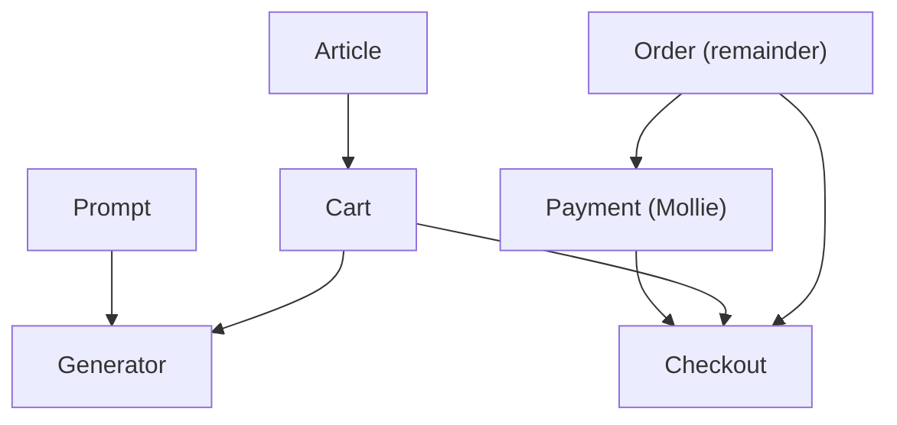

# Migration roadmap

This file tracks which legacy .NET features are still waiting for migration
and in which order they should be migrated. The order is derived from the
`using Voenix.Features.*` dependencies in the legacy source at
`/Users/joe/projects/joto-ai/voenix-shop/backend/Voenix.Api/Features`.

General migration rules remain in
[`module-migration-guide.md`](module-migration-guide.md). Each migration still
gets its own record copied from [`migration-base.md`](migration-base.md).

## Already migrated

| Kotlin module | Legacy source |
| --- | --- |
| `country` | `Features/Country` |
| `vat` | `Features/Vat` |
| `supplier` | `Features/Supplier` |
| `pricing` | `Features/Pricing` |
| `email` | `Features/Email` |
| `image` | `Features/Image` |
| `magic-coins` | `Features/MagicCoins` |
| `production` | `Features/SftpUpload` plus `Order/PdfDocument.cs`, `Order/Services/PdfService.cs`, `Order/Services/PaidOrderProcessor.cs` |
| `platform` (auth) | Session, CSRF, and guest-token infrastructure, including the `Features/Antiforgery` endpoint (`GET /api/antiforgery/token`) |
| `account` | `Features/Auth` plus `Configuration/AuthConfiguration.cs` and the Auth mappings in the exception handler; the guest-data claim is deferred to the Cart migration (see [`account-migration.md`](account-migration.md)) |
| `promotion` | `Features/Promotion`; exports the `PromotionCodes` capability. The usage-limit check that `Order/Services/PaidOrderProcessor.cs` duplicated now lives only in this module's `redeem`, but that file itself migrates with Order. Capacity reservation by in-flight orders, `promotion_redemptions.order_id`, and the customer-facing shape of the `PROMOTION_*` errors are deferred (see [`promotion-migration.md`](promotion-migration.md)) |

`Features/Antiforgery` therefore needs no migration of its own.

## Remaining features and their blockers

Sizes are the legacy line counts and only indicate relative effort. "User
references" means the feature only touches `Auth.Domain` for user ids and
roles; the platform module already provides `UserPrincipal` and admin route
protection, so such a reference does not block a migration.

| Legacy feature | ~Lines | Blocked by (not yet migrated) |
| --- | ---: | --- |
| Article | 4,000 | nothing (Pricing and Image are migrated) |
| Prompt | 4,350 | nothing (Pricing and Image are migrated) |
| Order (remainder) | ~300 | nothing (Promotion and Production are migrated) |
| Cart | 1,000 | Article |
| Generator | 290 | Prompt, Cart |
| Payment (Mollie) | 450 | Order |
| Checkout | 440 | Payment, Order, Cart |

"Order (remainder)" is what `Features/Order` still owns after the production
migration: the `Order`/`OrderItem` domain and the PDF download endpoint in
`PdfController`.

```mermaid
graph TD
    Article --> Cart
    Prompt --> Generator
    Cart --> Generator
    Order["Order (remainder)"] --> Payment["Payment (Mollie)"]
    Payment --> Checkout
    Cart --> Checkout
    Order --> Checkout
```

## Migration order

Waves group features whose blockers are all migrated once the previous wave
is done. Features inside a wave are independent of each other and may be
migrated in any order, or in parallel worktrees.

### Wave 1 — no open blockers

Two Wave-1 items are already done: Auth (module `account`, 2026-07-24), whose
deferred guest-data claim moves to Cart, and Promotion (module `promotion`,
2026-07-26), which exports the `PromotionCodes` capability that Cart, Order,
and Checkout consume.

1. **Article** — large; depends only on migrated modules.
2. **Prompt** — large; depends only on migrated modules.
3. **Order (remainder)** — Promotion was its only blocker, so it moved up from
   Wave 2. It hooks into the migrated `production` module instead of the legacy
   SFTP/PDF services, binds the still-open order branch of the app-owned
   `AggregatedQueuedEmailSource`, and calls `PromotionCodes.redeem` when an
   order is paid. It also owns the deferred `promotion_redemptions.order_id`
   column (see [`promotion-post-migration.md`](promotion-post-migration.md)).

Article and Prompt are the two big blocks and can run in parallel with
everything else in this wave. Order is small and unblocks Payment.

### Wave 2

4. **Cart** — needs Article. Also picks up the deferred guest cart claim from
   the Auth migration and defines the customer-facing wire format for the
   `PromotionCodeResult` failure reasons.
5. **Payment (Mollie)** — needs Order.

### Wave 3

6. **Generator** — needs Prompt and Cart; MagicCoins and guest tokens are
   already migrated.
7. **Checkout** — the integration point of Cart, Order, and Payment;
   deliberately last so it composes finished modules instead of stubs. It also
   decides how the promotion activity window is re-checked at checkout time
   (see [`promotion-post-migration.md`](promotion-post-migration.md)).

Once Checkout is migrated, the legacy backend has no remaining features and
can be retired.

## Keeping this file current

When a migration lands, move its row into the "Already migrated" table and
remove it from the waves. If a migration discovers a new dependency, update
the graph and the waves instead of working around it.
