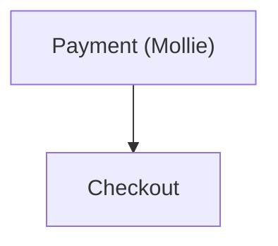

# Migration roadmap

This file tracks which legacy .NET features are still waiting for migration
and in which order they should be migrated. The order is derived from the
`using Voenix.Features.*` dependencies in the legacy source at
`/Users/joe/projects/joto-ai/voenix-shop/backend/Voenix.Api/Features`.

General migration rules remain in
[`module-migration-guide.md`](module-migration-guide.md). Each migration still
gets its own record copied from [`migration-base.md`](migration-base.md).

## Already migrated

| Kotlin module | Legacy source |
| --- | --- |
| `country` | `Features/Country` |
| `vat` | `Features/Vat` |
| `supplier` | `Features/Supplier` |
| `pricing` | `Features/Pricing` |
| `email` | `Features/Email` |
| `image` | `Features/Image` |
| `magic-coins` | `Features/MagicCoins` |
| `production` | `Features/SftpUpload` plus `Order/PdfDocument.cs`, `Order/Services/PdfService.cs`, `Order/Services/PaidOrderProcessor.cs` |
| `platform` (auth) | Session, CSRF, and guest-token infrastructure, including the `Features/Antiforgery` endpoint (`GET /api/antiforgery/token`) |
| `account` | `Features/Auth` plus `Configuration/AuthConfiguration.cs` and the Auth mappings in the exception handler; the guest-data claim is deferred to the Cart migration (see [`account-migration.md`](account-migration.md)) |
| `article` | `Features/Article` plus the article-owned parts of `Features/Pricing` and the two example-image pipelines; exports the `ArticleCatalog` capability that Cart, Order, and the production adapter consume. The Vue frontend adaptation and the orphaned example-image sweep are deferred; the order snapshot of production data was delivered by the Order migration (see [`article-post-migration.md`](article-post-migration.md)). The implementation is complete; the council verification of the module record is still open |
| `prompt` | `Features/Prompt` plus the prompt-owned parts of `Features/Pricing` and the example-image pipeline; exports the `PromptCatalog` capability that Generator (composed generation text) and Cart (gross sales price in cents) consume. The Vue frontend adaptation and a few smaller follow-ups are deferred (see [`prompt-post-migration.md`](prompt-post-migration.md)). The implementation is complete; the council verification of the module record is still open |
| `promotion` | `Features/Promotion`; exports the `PromotionCodes` capability. The usage-limit check that `Order/Services/PaidOrderProcessor.cs` duplicated now lives only in this module's `redeem`, which the Order migration made transactional and gave the deferred `promotion_redemptions.order_id` column. The customer-facing shape of the `PROMOTION_*` errors was delivered by Cart; capacity reservation by in-flight orders is the last deferred item and belongs to Checkout (see [`promotion-migration.md`](promotion-migration.md) and [`promotion-post-migration.md`](promotion-post-migration.md)) |
| `cart` | `Features/Cart` plus the guest-data claim deferred by Account (`Auth/Services/GuestDataClaimService.cs`), the guest image service and route from `Features/Image`, and the Cart/Promotion mappings in the exception handler. It owns the print-image registry (`print_images`, legacy `GeneratedEditedImage`) that Order depends on — the Generator turned out not to need it, because it stores nothing (see [`generator-migration.md`](generator-migration.md)) — exports the `CartGuestImages` and `CartGuestData` capabilities, and fixes the customer-facing wire format of the `PROMOTION_*` failures. The reorder endpoint and the order claims were delivered by the Order migration; the `CHECKED_OUT` write path stays with Checkout, and the Vue frontend adaptation plus the MagicCoins guest-balance claim remain open (see [`cart-migration.md`](cart-migration.md)) |
| `order` | `Features/Order` (the `Order`/`OrderItem` domain, `Domain/OrderStatus.cs`, the EF configurations, and `Controllers/PdfController.cs`) plus the order-owned parts of `Features/Checkout` (`CheckoutService`'s order creation and the customer read paths), the order branch of `Auth/Services/GuestDataClaimService.cs`, and `CartService.ReorderOrderItemAsync`. It binds the four ports earlier migrations left open — Production's `ProductionSource`, Email's order-confirmation branch, Account's order claim, and Cart's reorder — adds `promotion_redemptions.order_id` and the `production_requests` order foreign key, and makes `PromotionCodes.redeem` transactional. The checkout orchestration itself stays with Checkout and the payment with Payment; the frontend adaptation and the Wave-2/Wave-3 hooks are recorded in [`order-post-migration.md`](order-post-migration.md). The implementation is complete; the council verification of the module record is still open |
| `generator` | `Features/Generator` plus `Configuration/GeneratorOptions.cs`, `Configuration/GeneratorOptionsValidator.cs`, and the Generator/MagicCoins branches of the exception handler. The module is stateless: it answers raw image bytes and stores nothing. It consumes `PromptCatalog.composedText` and the `GenerationCoins` capability that this migration made MagicCoins export, and it hardens the legacy endpoint with CSRF protection, a 10 MiB upload limit, and a guarded result download. Abuse protection of the anonymous, cost-incurring endpoint and the `16:9` aspect ratio are open product decisions (see [`all-post-migration.md`](all-post-migration.md)); the council verification, simplification review, and retrospective are complete (see [`generator-migration.md`](generator-migration.md)) |

`Features/Antiforgery` therefore needs no migration of its own.

## Remaining features and their blockers

Sizes are the legacy line counts and only indicate relative effort. "User
references" means the feature only touches `Auth.Domain` for user ids and
roles; the platform module already provides `UserPrincipal` and admin route
protection, so such a reference does not block a migration.

| Legacy feature | ~Lines | Blocked by (not yet migrated) |
| --- | ---: | --- |
| Payment (Mollie) | 450 | nothing (Order is migrated) |
| Checkout | 440 | Payment |

Order was the last feature blocking anything, and it is migrated since
2026-07-31. What it leaves behind for the two remaining features are named
hooks rather than blockers:

- **Payment** calls the module-internal `markPaid(orderId)`, builds
  `payments.order_id` (the legacy `orders.payment_id` column is deliberately
  absent), and owns the `CANCELLED` write path nothing writes yet.
- **Checkout** calls the module-internal placement operation with the amounts
  already decided, writes `carts.status = 'CHECKED_OUT'`, and restores the
  promotion capacity reservation by in-flight orders.

Both lists are in [`order-post-migration.md`](order-post-migration.md).

```mermaid
graph TD
    Payment["Payment (Mollie)"] --> Checkout
```

Generator used to sit in this graph without a single edge — nothing blocked it
and it blocked nothing — which is exactly why it could be migrated on 2026-07-30
next to the Order work. What is left is one edge.

## Migration order

Waves group features whose blockers are all migrated once the previous wave
is done. Features inside a wave are independent of each other and may be
migrated in any order, or in parallel worktrees.

### Wave 1 — no open blockers

Seven Wave-1 items are done and the wave is empty. Auth (module `account`,
2026-07-24); Promotion (module `promotion`, 2026-07-26), which exports the
`PromotionCodes` capability Order now redeems and Checkout will re-check;
Article (module `article`, 2026-07-28), which exports the `ArticleCatalog`
capability; Prompt (module `prompt`, 2026-07-28), which exports the
`PromptCatalog` capability; Cart (module `cart`, 2026-07-30), which picked up
Auth's deferred guest-data claim and whose `print_images` table promoted both
remaining Wave-1 items into this wave; Generator (module `generator`,
2026-07-30), which bound the second half of `PromptCatalog` and redeemed the
coin capability MagicCoins had deferred; and Order (module `order`,
2026-07-31), which bound the real `ProductionSource`, the order-confirmation
branch of the app-owned `AggregatedQueuedEmailSource`, the order half of the
guest-data claim, and the cart's reorder route, and which made
`PromotionCodes.redeem` transactional and gave it the deferred
`promotion_redemptions.order_id` column (see
[`promotion-post-migration.md`](promotion-post-migration.md) and
[`cart-migration.md`](cart-migration.md)).

Wave 1 has no remaining items. Payment moved up.

### Wave 2

1. **Payment (Mollie)** — its blocker Order is migrated. It calls
   `markPaid(orderId)` on the paid webhook and maps its five results, builds
   the `payments` table with `payments.order_id`, returns `paymentStatus` to
   the order response, owns the `CANCELLED` write path, and adds provider-level
   idempotency per order (see
   [`order-post-migration.md`](order-post-migration.md)).

### Wave 3

2. **Checkout** — the integration point of Cart, Order, and Payment;
   deliberately last so it composes finished modules instead of stubs. It calls
   the order module's placement operation with the amounts it computed, owns
   Cart's deferred `CHECKED_OUT` write path and the pre-payment promotion
   re-check, and decides how the promotion activity window is re-checked at the
   start of the checkout, together with the capacity reservation by in-flight
   orders the order schema keeps queryable (see
   [`promotion-post-migration.md`](promotion-post-migration.md) and
   [`order-post-migration.md`](order-post-migration.md)).

Once Checkout is migrated, the legacy backend has no remaining features and
can be retired.

## Keeping this file current

When a migration lands, move its row into the "Already migrated" table and
remove it from the waves. If a migration discovers a new dependency, update
the graph and the waves instead of working around it.
