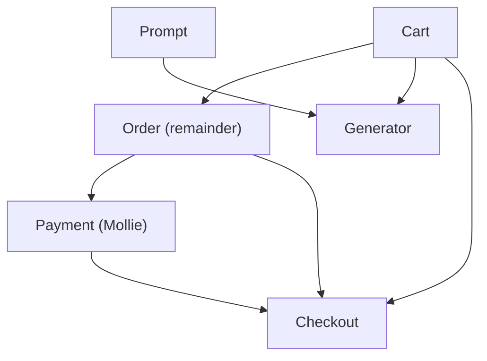

# Migration roadmap

This file tracks which legacy .NET features are still waiting for migration
and in which order they should be migrated. The order is derived from the
`using Voenix.Features.*` dependencies in the legacy source at
`/Users/joe/projects/joto-ai/voenix-shop/backend/Voenix.Api/Features`.

General migration rules remain in
[`module-migration-guide.md`](module-migration-guide.md). Each migration still
gets its own record copied from [`migration-base.md`](migration-base.md).

## Already migrated

| Kotlin module | Legacy source |
| --- | --- |
| `country` | `Features/Country` |
| `vat` | `Features/Vat` |
| `supplier` | `Features/Supplier` |
| `pricing` | `Features/Pricing` |
| `email` | `Features/Email` |
| `image` | `Features/Image` |
| `magic-coins` | `Features/MagicCoins` |
| `production` | `Features/SftpUpload` plus `Order/PdfDocument.cs`, `Order/Services/PdfService.cs`, `Order/Services/PaidOrderProcessor.cs` |
| `platform` (auth) | Session, CSRF, and guest-token infrastructure, including the `Features/Antiforgery` endpoint (`GET /api/antiforgery/token`) |
| `account` | `Features/Auth` plus `Configuration/AuthConfiguration.cs` and the Auth mappings in the exception handler; the guest-data claim is deferred to the Cart migration (see [`account-migration.md`](account-migration.md)) |
| `article` | `Features/Article` plus the article-owned parts of `Features/Pricing` and the two example-image pipelines; exports the `ArticleCatalog` capability that Cart, Order, and the production adapter consume. The Vue frontend adaptation, the orphaned example-image sweep, and the order snapshot of production data are deferred (see [`article-post-migration.md`](article-post-migration.md)). The implementation is complete; the council verification of the module record is still open |
| `promotion` | `Features/Promotion`; exports the `PromotionCodes` capability. The usage-limit check that `Order/Services/PaidOrderProcessor.cs` duplicated now lives only in this module's `redeem`, but that file itself migrates with Order. Capacity reservation by in-flight orders, `promotion_redemptions.order_id`, and the customer-facing shape of the `PROMOTION_*` errors are deferred (see [`promotion-migration.md`](promotion-migration.md)) |

`Features/Antiforgery` therefore needs no migration of its own.

## Remaining features and their blockers

Sizes are the legacy line counts and only indicate relative effort. "User
references" means the feature only touches `Auth.Domain` for user ids and
roles; the platform module already provides `UserPrincipal` and admin route
protection, so such a reference does not block a migration.

| Legacy feature | ~Lines | Blocked by (not yet migrated) |
| --- | ---: | --- |
| Prompt | 4,350 | nothing (Pricing and Image are migrated) |
| Cart | 1,000 | nothing (Article is migrated) |
| Order (remainder) | ~300 | Cart |
| Generator | 290 | Prompt, Cart |
| Payment (Mollie) | 450 | Order |
| Checkout | 440 | Payment, Order, Cart |

"Order (remainder)" is what `Features/Order` still owns after the production
migration: the `Order`/`OrderItem` domain and the PDF download endpoint in
`PdfController`.

The blockers of Order are easy to miss, because its `using` list names neither
feature. They come from the data it has to supply, not from its imports
(corrected on 2026-07-26; Article resolved on 2026-07-28):

- **Article — resolved.** Order has to bind the real `ProductionSource`, which
  today is a stub in `Application.kt` whose every load fails. The contract it
  must fill is `ProductionItem`: `supplierId`, `supplierArticleNumber`,
  `articleName`, `variantName`, and the five mug layout measurements. The
  migrated `article` module answers all of them through `ArticleCatalog`. Order
  must *snapshot* the supplier article number and the measurements at checkout
  instead of reading them at production time (see
  [`article-post-migration.md`](article-post-migration.md)).
- **Cart.** `ProductionItem.imagePath` points at the generated image, and
  `order_items.generated_edited_image_id` references it. That entity lives in
  the legacy Cart feature (`Features/Cart/Domain/GeneratedEditedImage.cs`), so
  it migrates with Cart.

The schema is not a blocker: legacy `order_items` has a foreign key to
`orders` only, and `article_id`/`variant_id` are plain indexed columns.
Tables and repository could be pulled forward, but without the production
source, the PDF endpoint, and the redemption trigger there is nothing to gain
from it.

```mermaid
graph TD
    Cart --> Order["Order (remainder)"]
    Prompt --> Generator
    Cart --> Generator
    Order --> Payment["Payment (Mollie)"]
    Payment --> Checkout
    Cart --> Checkout
    Order --> Checkout
```

## Migration order

Waves group features whose blockers are all migrated once the previous wave
is done. Features inside a wave are independent of each other and may be
migrated in any order, or in parallel worktrees.

### Wave 1 — no open blockers

Three Wave-1 items are already done: Auth (module `account`, 2026-07-24), whose
deferred guest-data claim moves to Cart, Promotion (module `promotion`,
2026-07-26), which exports the `PromotionCodes` capability that Cart, Order,
and Checkout consume, and Article (module `article`, 2026-07-28), which exports
the `ArticleCatalog` capability and thereby promoted Cart into this wave.

1. **Prompt** — large; depends only on migrated modules.
2. **Cart** — its blocker Article is migrated. It also picks up the deferred
   guest cart claim from the Auth migration, brings the
   `generated_edited_images` entity that Order and Generator depend on, and
   defines the customer-facing wire format for the `PromotionCodeResult`
   failure reasons.

These two are independent of each other, so they can run in parallel worktrees.

### Wave 2

3. **Order (remainder)** — needs Cart. It hooks into the migrated
   `production` module instead of the legacy SFTP/PDF services by binding the
   real `ProductionSource`, binds the still-open order branch of the app-owned
   `AggregatedQueuedEmailSource`, and calls `PromotionCodes.redeem` when an
   order is paid — with eligibility and limits only, exactly as legacy
   `PaidOrderProcessor` does. It also owns the deferred
   `promotion_redemptions.order_id` column (see
   [`promotion-post-migration.md`](promotion-post-migration.md)).
4. **Generator** — needs Prompt and Cart; MagicCoins and guest tokens are
   already migrated.

Order and Generator do not depend on each other and may run in parallel.

### Wave 3

5. **Payment (Mollie)** — needs Order.

### Wave 4

6. **Checkout** — the integration point of Cart, Order, and Payment;
   deliberately last so it composes finished modules instead of stubs. It also
   decides how the promotion activity window is re-checked at the start of the
   checkout (see
   [`promotion-post-migration.md`](promotion-post-migration.md)).

Once Checkout is migrated, the legacy backend has no remaining features and
can be retired.

## Keeping this file current

When a migration lands, move its row into the "Already migrated" table and
remove it from the waves. If a migration discovers a new dependency, update
the graph and the waves instead of working around it.
